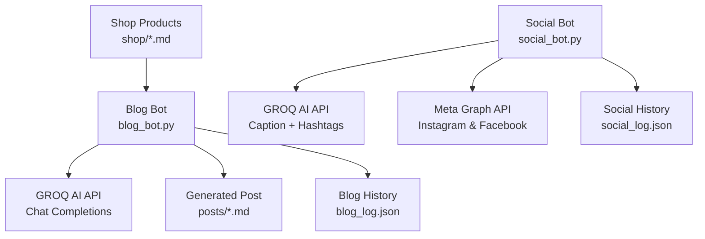
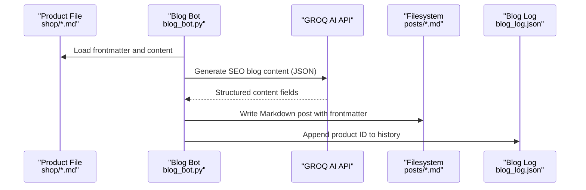
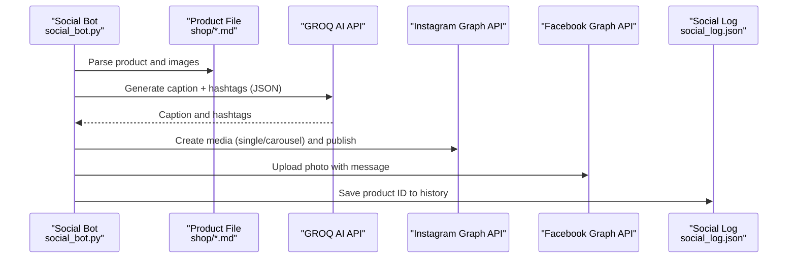
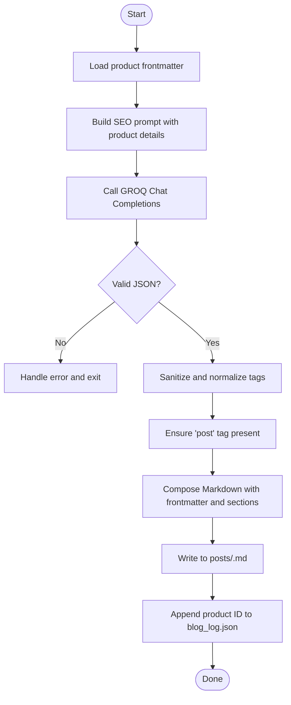
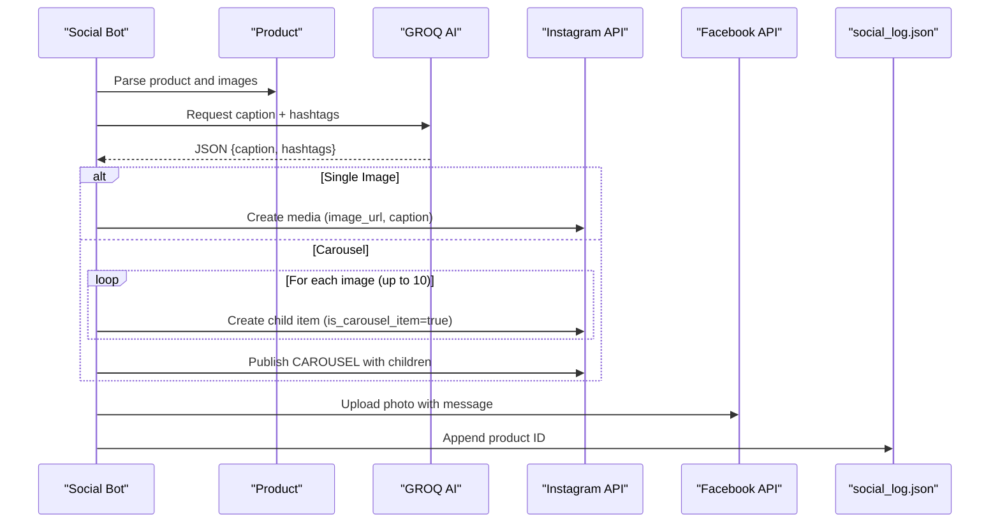
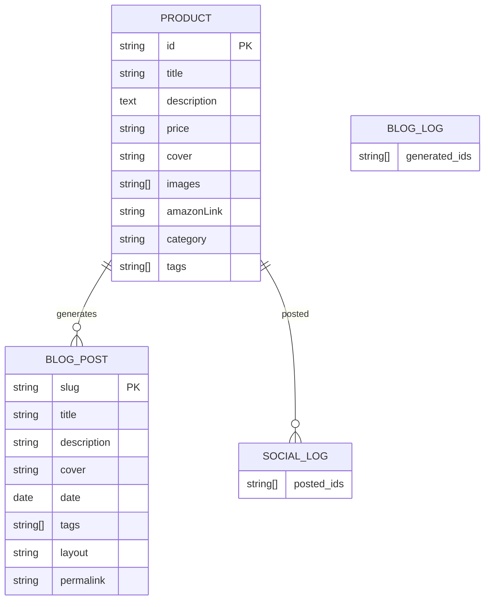
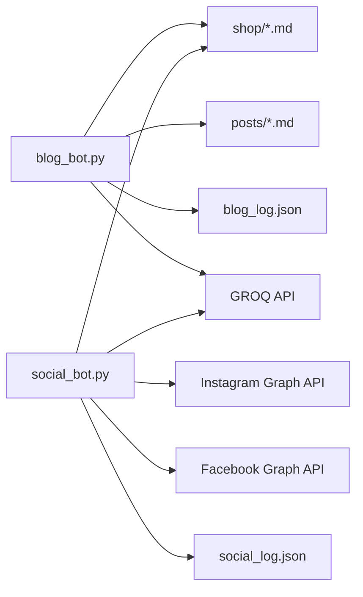

# AI-Powered Content Generation

<cite>
**Referenced Files in This Document**
- [blog_bot.py](file://blog_bot.py)
- [social_bot.py](file://social_bot.py)
- [SOCIAL_BOT_SETUP.md](file://SOCIAL_BOT_SETUP.md)
- [README.md](file://README.md)
- [scripts/test_blog_bot_run.py](file://scripts/test_blog_bot_run.py)
- [shop/B0CLHGCYRN.md](file://shop/B0CLHGCYRN.md)
- [posts/best-gift-ideas-in-uae-2025.md](file://posts/best-gift-ideas-in-uae-2025.md)
- [blog_log.json](file://blog_log.json)
- [social_log.json](file://social_log.json)
</cite>

## Table of Contents
1. [Introduction](#introduction)
2. [Project Structure](#project-structure)
3. [Core Components](#core-components)
4. [Architecture Overview](#architecture-overview)
5. [Detailed Component Analysis](#detailed-component-analysis)
6. [Dependency Analysis](#dependency-analysis)
7. [Performance Considerations](#performance-considerations)
8. [Troubleshooting Guide](#troubleshooting-guide)
9. [Conclusion](#conclusion)
10. [Appendices](#appendices)

## Introduction
This document explains the AI-powered content generation system that automates SEO blog post creation and social media posting for Nillian Store. The system:
- Reads product data from Markdown files in the shop directory
- Uses GROQ AI API to generate SEO-optimized blog posts and social captions
- Writes Eleventy-compatible Markdown posts with frontmatter and structured sections
- Posts to Instagram and Facebook via Meta Graph API
- Maintains logs to avoid repetition and supports debugging

The solution is designed for scalability, reliability, and ease of configuration through environment variables and GitHub secrets.

## Project Structure
At a high level, the automation consists of two Python scripts:
- Blog bot: Generates blog posts using product data and GROQ AI
- Social bot: Generates social captions and publishes to Instagram/Facebook via Meta Graph API

Key directories and files:
- Product catalog: shop/*.md (product definitions with frontmatter)
- Generated posts: posts/*.md (Eleventy-ready blog posts)
- Logs: blog_log.json, social_log.json (history tracking)
- Setup guide: SOCIAL_BOT_SETUP.md (configuration steps)
- Test helper: scripts/test_blog_bot_run.py (unit test for post file creation)

**Diagram sources**
- [blog_bot.py:1-253](file://blog_bot.py#L1-L253)
- [social_bot.py:1-315](file://social_bot.py#L1-L315)
- [blog_log.json:1-1](file://blog_log.json#L1-L1)
- [social_log.json:1-52](file://social_log.json#L1-L52)

**Section sources**
- [README.md:1-64](file://README.md#L1-L64)

## Core Components
- Blog generator:
  - Loads product frontmatter and content
  - Builds an SEO-focused prompt for GROQ AI
  - Parses JSON response into structured sections
  - Creates Eleventy-ready Markdown with tags, cover image, and Amazon call-to-action
  - Tracks generated products to avoid duplicates
- Social poster:
  - Selects a random product not recently posted
  - Generates caption and hashtags via GROQ AI
  - Publishes to Instagram (single or carousel) and Facebook
  - Retries on failure and syncs logs to GitHub when token is available

**Section sources**
- [blog_bot.py:1-253](file://blog_bot.py#L1-L253)
- [social_bot.py:1-315](file://social_bot.py#L1-L315)

## Architecture Overview
The end-to-end workflow spans product selection, AI content generation, content assembly, publishing, and logging.

**Diagram sources**
- [blog_bot.py:48-208](file://blog_bot.py#L48-L208)
- [social_bot.py:120-246](file://social_bot.py#L120-L246)
- [blog_log.json:1-1](file://blog_log.json#L1-L1)
- [social_log.json:1-52](file://social_log.json#L1-L52)

## Detailed Component Analysis

### Blog Bot: Prompt Engineering and Content Templates
- Prompt strategy:
  - Role-based persona for UAE boutique store copywriting
  - Structured output schema enforced via JSON response format
  - Required sections: title, description, tags, intro, product section, why it works, perfect for, conclusion
- Quality control:
  - Tag sanitization and normalization (HTML unescape, special character removal)
  - Enforced inclusion of 'post' tag for Eleventy categorization
  - Title/description escaping for safe YAML frontmatter
- Output template:
  - Frontmatter includes title, description, cover, date, tags, layout, permalink
  - Body includes structured sections, inline images, and a prominent Amazon buy button
  - Image handling supports up to three images with responsive styling

**Diagram sources**
- [blog_bot.py:48-208](file://blog_bot.py#L48-L208)
- [blog_log.json:1-1](file://blog_log.json#L1-L1)

**Section sources**
- [blog_bot.py:48-208](file://blog_bot.py#L48-L208)
- [shop/B0CLHGCYRN.md:1-55](file://shop/B0CLHGCYRN.md#L1-L55)
- [posts/best-gift-ideas-in-uae-2025.md:1-259](file://posts/best-gift-ideas-in-uae-2025.md#L1-L259)

### Social Bot: Multi-Platform Posting and Error Handling
- Content generation:
  - Short prompt requesting caption and hashtags formatted as JSON
  - Appends product link to final caption for conversion
- Publishing flow:
  - Instagram:
    - Single image: create media with image_url and caption
    - Carousel: create multiple child items then publish CAROUSEL media
    - Publish step requires a short delay before calling media_publish
  - Facebook:
    - Upload photo with URL and message
- Error handling:
  - Detects expired tokens (error code 190) and prints actionable guidance
  - Retries up to 3 times with different products
  - Skips products without images
- Logging and persistence:
  - Maintains recent posting history to avoid repetition
  - Optional Git sync of social_log.json to repository using GITHUB_TOKEN

**Diagram sources**
- [social_bot.py:120-246](file://social_bot.py#L120-L246)
- [social_log.json:1-52](file://social_log.json#L1-L52)

**Section sources**
- [social_bot.py:120-246](file://social_bot.py#L120-L246)

### Configuration and Secrets
- Environment variables:
  - GROQ_API_KEY: Used by both bots for content generation
  - META_ACCESS_TOKEN: Used by social bot for Instagram/Facebook publishing
  - FB_PAGE_ID: Facebook Page ID for photo uploads
  - IG_USER_ID: Instagram Business Account ID for media creation/publishing
  - GITHUB_TOKEN: Optional; used to sync social_log.json back to repository
- Setup instructions:
  - Refer to SOCIAL_BOT_SETUP.md for obtaining tokens and permissions
  - Configure secrets in GitHub repository settings for automated workflows

**Section sources**
- [SOCIAL_BOT_SETUP.md:1-106](file://SOCIAL_BOT_SETUP.md#L1-L106)
- [social_bot.py:16-21](file://social_bot.py#L16-L21)

### Data Models and Relationships
- Product model (from shop Markdown):
  - Fields include title, description, price, cover, images, amazonLink, category, tags, etc.
- Generated blog post model (Markdown with frontmatter):
  - Frontmatter fields: title, description, cover, date, tags, layout, permalink
  - Body sections: intro, product section, why_it_works, perfect_for, conclusion
- Social post model:
  - Caption and hashtags generated by AI, appended with product link

**Diagram sources**
- [shop/B0CLHGCYRN.md:1-55](file://shop/B0CLHGCYRN.md#L1-L55)
- [posts/best-gift-ideas-in-uae-2025.md:1-259](file://posts/best-gift-ideas-in-uae-2025.md#L1-L259)
- [blog_log.json:1-1](file://blog_log.json#L1-L1)
- [social_log.json:1-52](file://social_log.json#L1-L52)

## Dependency Analysis
- External dependencies:
  - requests: HTTP client for GROQ and Meta APIs
  - frontmatter: Parsing Markdown frontmatter
  - os, json, pathlib, re, datetime: Standard library utilities
- Internal dependencies:
  - blog_bot.py depends on shop/*.md structure and writes to posts/*.md
  - social_bot.py depends on shop/*.md structure and writes to social_log.json
  - Both bots rely on environment variables for credentials

**Diagram sources**
- [blog_bot.py:1-253](file://blog_bot.py#L1-L253)
- [social_bot.py:1-315](file://social_bot.py#L1-L315)

**Section sources**
- [blog_bot.py:1-253](file://blog_bot.py#L1-L253)
- [social_bot.py:1-315](file://social_bot.py#L1-L315)

## Performance Considerations
- Rate limiting:
  - No explicit rate limiting implemented; consider adding delays between API calls for large-scale runs
- Concurrency:
  - Sequential processing per run; parallelization can be added for batch generation if needed
- Image handling:
  - Up to three images embedded in blog posts; Instagram supports up to ten carousel items
- Retry logic:
  - Social bot retries up to three times with different products to mitigate transient failures
- Logging overhead:
  - Minimal JSON append operations; ensure filesystem write performance is acceptable at scale

[No sources needed since this section provides general guidance]

## Troubleshooting Guide
- Missing environment variables:
  - Verify GROQ_API_KEY, META_ACCESS_TOKEN, FB_PAGE_ID, IG_USER_ID are set
  - Use SOCIAL_BOT_SETUP.md for obtaining and configuring secrets
- Expired access tokens:
  - Error code 190 indicates expired token; follow guidance to refresh long-lived tokens
- No images found:
  - Skip products without images; ensure shop Markdown files include cover/images
- Repetition avoidance:
  - Check blog_log.json and social_log.json for recent IDs; reset if necessary
- Debugging AI issues:
  - Inspect prompts and JSON responses; validate response_format type
  - Use scripts/test_blog_bot_run.py to verify post file creation locally

**Section sources**
- [SOCIAL_BOT_SETUP.md:75-106](file://SOCIAL_BOT_SETUP.md#L75-L106)
- [social_bot.py:186-206](file://social_bot.py#L186-L206)
- [social_bot.py:226-246](file://social_bot.py#L226-L246)
- [scripts/test_blog_bot_run.py:1-10](file://scripts/test_blog_bot_run.py#L1-L10)

## Conclusion
The AI-powered content generation system integrates product data, GROQ AI, and Meta Graph APIs to automate SEO blog creation and multi-platform social posting. It emphasizes structured prompts, robust error handling, and logging for repeatable, scalable operations. With proper configuration and monitoring, it supports continuous content production across platforms.

[No sources needed since this section summarizes without analyzing specific files]

## Appendices

### Configuration Steps Summary
- Set environment variables or GitHub secrets:
  - GROQ_API_KEY
  - META_ACCESS_TOKEN
  - FB_PAGE_ID
  - IG_USER_ID
  - GITHUB_TOKEN (optional)
- Obtain tokens and permissions following SOCIAL_BOT_SETUP.md
- Run blog_bot.py to generate posts
- Run social_bot.py to post to Instagram and Facebook

**Section sources**
- [SOCIAL_BOT_SETUP.md:1-106](file://SOCIAL_BOT_SETUP.md#L1-L106)
- [blog_bot.py:16-16](file://blog_bot.py#L16-L16)
- [social_bot.py:16-21](file://social_bot.py#L16-L21)