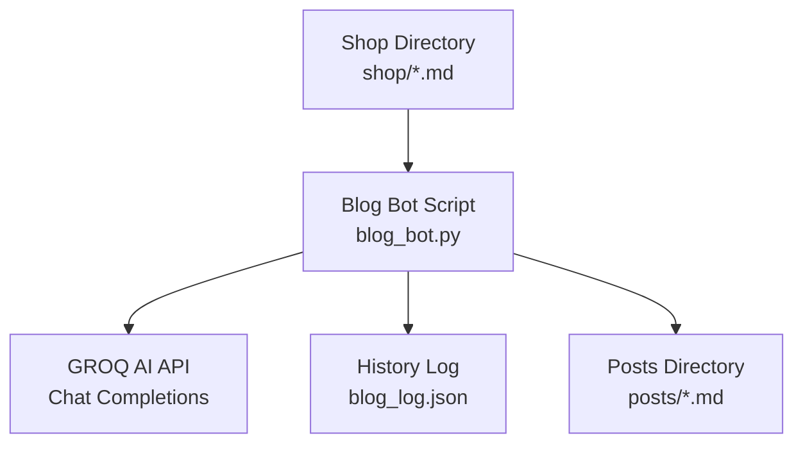
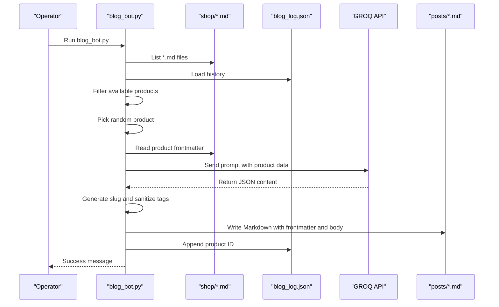
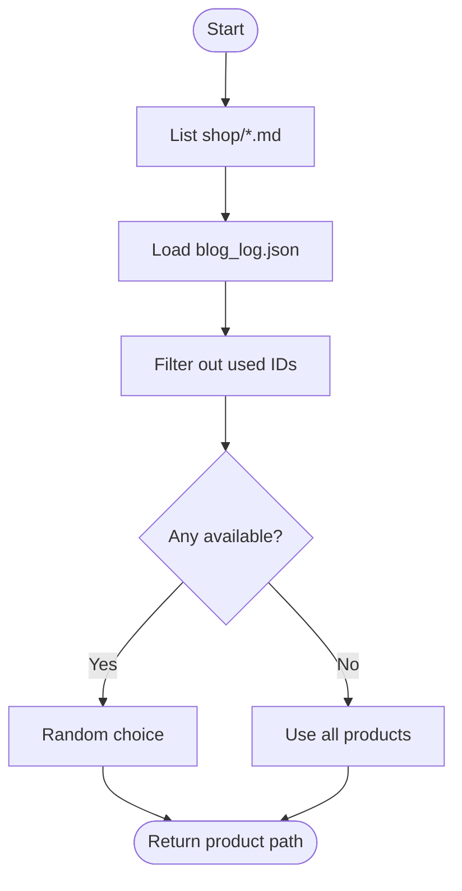
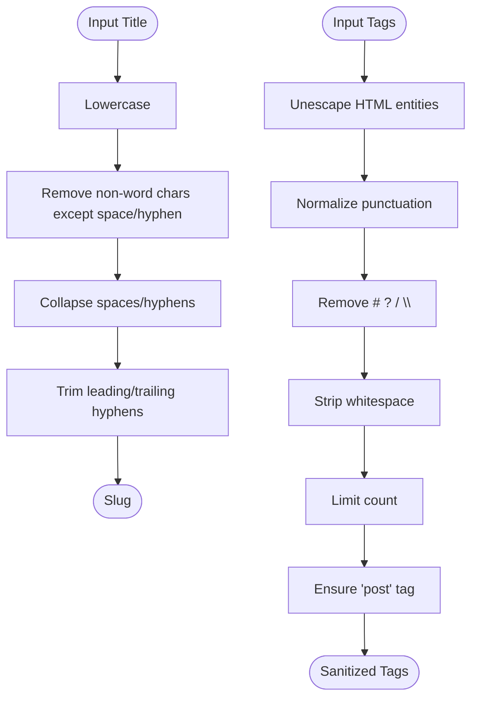
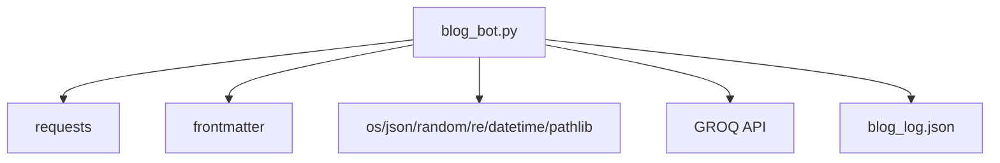

# Blog Generation Bot

<cite>
**Referenced Files in This Document**
- [blog_bot.py](file://blog_bot.py)
- [shop/B0CLHGCYRN.md](file://shop/B0CLHGCYRN.md)
- [posts/best-gift-ideas-in-uae-2025.md](file://posts/best-gift-ideas-in-uae-2025.md)
- [blog_log.json](file://blog_log.json)
- [SOCIAL_BOT_SETUP.md](file://SOCIAL_BOT_SETUP.md)
- [scripts/test_blog_bot_run.py](file://scripts/test_blog_bot_run.py)
</cite>

## Table of Contents
1. [Introduction](#introduction)
2. [Project Structure](#project-structure)
3. [Core Components](#core-components)
4. [Architecture Overview](#architecture-overview)
5. [Detailed Component Analysis](#detailed-component-analysis)
6. [Dependency Analysis](#dependency-analysis)
7. [Performance Considerations](#performance-considerations)
8. [Troubleshooting Guide](#troubleshooting-guide)
9. [Conclusion](#conclusion)
10. [Appendices](#appendices)

## Introduction
This document explains the blog generation bot system that automatically creates SEO-optimized blog posts for products listed in the shop directory. The bot:
- Reads product data from Markdown files in the shop directory
- Selects a random product while avoiding duplicates using history tracking
- Generates structured content via the GROQ AI API with UAE-focused, marketing-oriented prompts
- Produces Markdown posts with frontmatter, tags, images, and Amazon affiliate links
- Writes output to the posts directory with slug-based filenames

The system is designed to be simple, reliable, and easy to operate locally or within CI/CD environments.

## Project Structure
Key directories and files relevant to the blog bot:
- shop/: Product definitions as Markdown files with frontmatter (title, description, price, images, amazonLink, etc.)
- posts/: Generated blog posts as Markdown files with Eleventy-compatible frontmatter
- blog_bot.py: Main script orchestrating selection, AI generation, and file creation
- blog_log.json: History of generated product IDs to avoid duplicates
- SOCIAL_BOT_SETUP.md: Setup guidance including environment variables and secrets
- scripts/test_blog_bot_run.py: Test harness to validate post generation logic

**Diagram sources**
- [blog_bot.py:11-16](file://blog_bot.py#L11-L16)
- [blog_bot.py:33-39](file://blog_bot.py#L33-L39)
- [blog_bot.py:48-97](file://blog_bot.py#L48-L97)
- [blog_bot.py:99-208](file://blog_bot.py#L99-L208)
- [blog_log.json:1-1](file://blog_log.json#L1-L1)

**Section sources**
- [blog_bot.py:11-16](file://blog_bot.py#L11-L16)
- [blog_bot.py:33-39](file://blog_bot.py#L33-L39)
- [blog_bot.py:48-97](file://blog_bot.py#L48-L97)
- [blog_bot.py:99-208](file://blog_bot.py#L99-L208)
- [blog_log.json:1-1](file://blog_log.json#L1-L1)

## Core Components
- Product discovery and duplicate avoidance
  - Scans shop/*.md files and filters out previously used product IDs based on blog_log.json
- Prompt engineering and AI response handling
  - Builds a detailed prompt requesting JSON output with specific fields for title, description, tags, intro, product section, why it works, perfect for, and conclusion
  - Calls GROQ API with model llama-3.3-70b-versatile and expects a JSON object
- Slug generation and tag sanitization
  - Converts titles to URL-safe slugs and sanitizes tags to remove problematic characters
- Frontmatter and markdown assembly
  - Creates Eleventy-compatible frontmatter with title, description, cover image, date, tags, layout, and permalink
  - Assembles body content with sections, images, and an embedded Amazon buy button
- File I/O and logging
  - Writes posts/*.md files and appends product ID to blog_log.json

**Section sources**
- [blog_bot.py:18-39](file://blog_bot.py#L18-L39)
- [blog_bot.py:41-46](file://blog_bot.py#L41-L46)
- [blog_bot.py:48-97](file://blog_bot.py#L48-L97)
- [blog_bot.py:99-208](file://blog_bot.py#L99-L208)

## Architecture Overview
End-to-end flow from product selection to published post:

**Diagram sources**
- [blog_bot.py:33-39](file://blog_bot.py#L33-L39)
- [blog_bot.py:48-97](file://blog_bot.py#L48-L97)
- [blog_bot.py:99-208](file://blog_bot.py#L99-L208)
- [blog_log.json:1-1](file://blog_log.json#L1-L1)

## Detailed Component Analysis

### Product Selection and Duplicate Avoidance
- Loads all Markdown files from shop/
- Reads blog_log.json to get previously generated product IDs
- Filters out duplicates; if none available, falls back to all products
- Randomly selects one product file path

**Diagram sources**
- [blog_bot.py:33-39](file://blog_bot.py#L33-L39)
- [blog_bot.py:18-32](file://blog_bot.py#L18-L32)

**Section sources**
- [blog_bot.py:18-39](file://blog_bot.py#L18-L39)

### Prompt Engineering and AI Response Handling
- Constructs a detailed prompt instructing the model to produce a JSON object with specific fields tailored for UAE-targeted marketing content
- Sends request to GROQ API with Authorization header and JSON payload
- Parses the returned JSON into a structured dictionary

Prompt structure highlights:
- Role and context: Expert SEO copywriter for Nillian Store in UAE
- Input fields: Title, description, price, Amazon link
- Output schema: title, description, tags, intro, product_section, why_it_works, perfect_for, conclusion
- Style requirements: Emojis, UAE context, marketing language, bullet points

Response handling:
- Uses response_format json_object to enforce JSON output
- Extracts choices[0].message.content and parses JSON

**Section sources**
- [blog_bot.py:48-97](file://blog_bot.py#L48-L97)

### Slug Generation and Tag Sanitization
- Slug generation:
  - Lowercases text
  - Removes non-word characters except spaces and hyphens
  - Collapses whitespace/hyphens and trims leading/trailing hyphens
- Tag sanitization:
  - Unescapes HTML entities
  - Normalizes apostrophes and backticks
  - Removes characters like #, ?, /, \
  - Strips whitespace and limits to a reasonable count
  - Ensures 'post' tag is present for Eleventy

**Diagram sources**
- [blog_bot.py:41-46](file://blog_bot.py#L41-L46)
- [blog_bot.py:105-122](file://blog_bot.py#L105-L122)

**Section sources**
- [blog_bot.py:41-46](file://blog_bot.py#L41-L46)
- [blog_bot.py:105-122](file://blog_bot.py#L105-L122)

### Frontmatter and Markdown Assembly
- Frontmatter fields:
  - title, description, cover (first image), date (current), tags (sanitized list), layout (layouts/post.njk), permalink (/posts/{slug}/)
- Body content:
  - Bold title heading
  - Intro paragraph
  - Product section linking to shop page
  - Why It Works blockquote with bullet points
  - Perfect for line
  - Up to three product images centered with styling
  - Embedded Amazon Buy Button styled inline
  - Final Thought section

Amazon affiliate integration:
- Uses product_data['link'] (supports both 'link' and 'amazonLink' fields)
- Generates a styled anchor with cart icon and “Buy on Amazon.ae” label

Image integration:
- Collects up to three images from product frontmatter (cover and images array)
- Inserts them into the post body with responsive styling

**Section sources**
- [blog_bot.py:99-208](file://blog_bot.py#L99-L208)

### Example Outputs
- Sample product definition:
  - See [shop/B0CLHGCYRN.md](file://shop/B0CLHGCYRN.md) for frontmatter fields including title, description, price, cover, images, amazonLink, and content
- Sample generated post:
  - See [posts/best-gift-ideas-in-uae-2025.md](file://posts/best-gift-ideas-in-uae-2025.md) for frontmatter and body structure, tags, images, and Amazon buttons

**Section sources**
- [shop/B0CLHGCYRN.md:1-55](file://shop/B0CLHGCYRN.md#L1-L55)
- [posts/best-gift-ideas-in-uae-2025.md:1-259](file://posts/best-gift-ideas-in-uae-2025.md#L1-L259)

## Dependency Analysis
External dependencies and integrations:
- Python standard library modules: os, json, random, re, datetime, pathlib
- Third-party libraries: requests (HTTP client), frontmatter (Markdown frontmatter parser)
- External service: GROQ API (chat completions endpoint)
- Local storage: blog_log.json for history tracking

**Diagram sources**
- [blog_bot.py:1-8](file://blog_bot.py#L1-L8)
- [blog_bot.py:48-97](file://blog_bot.py#L48-L97)
- [blog_bot.py:18-32](file://blog_bot.py#L18-L32)

**Section sources**
- [blog_bot.py:1-8](file://blog_bot.py#L1-L8)
- [blog_bot.py:48-97](file://blog_bot.py#L48-L97)
- [blog_bot.py:18-32](file://blog_bot.py#L18-L32)

## Performance Considerations
- Network latency: Each run makes one HTTP call to GROQ API; consider batching or caching strategies if generating multiple posts per run
- Disk I/O: Minimal writes (one post file and append to log); ensure filesystem permissions are correct
- Memory usage: Low; processes one product at a time
- Rate limiting: GROQ API may impose rate limits; implement retries/backoff if needed

[No sources needed since this section provides general guidance]

## Troubleshooting Guide
Common issues and resolutions:
- Missing GROQ_API_KEY
  - Symptom: Script prints missing key message and exits
  - Resolution: Set GROQ_API_KEY environment variable before running the script
- API errors or malformed responses
  - Symptom: HTTP error raised by requests or JSON parsing failure
  - Resolution: Check network connectivity, API key validity, and model availability; inspect logs for response details
- No products available
  - Symptom: All shop/*.md files already in history
  - Resolution: Clear or trim blog_log.json to allow reuse of older products
- File permission problems
  - Symptom: Unable to write to posts/ or blog_log.json
  - Resolution: Ensure write permissions for the current user on these paths
- Invalid slug or tag characters
  - Symptom: Post filename contains unexpected characters or tags break frontmatter
  - Resolution: Rely on built-in slugify and tag sanitization; verify input product titles/tags do not contain extreme edge cases

Operational tips:
- Use the test harness to validate post generation without calling the API:
  - See [scripts/test_blog_bot_run.py](file://scripts/test_blog_bot_run.py)
- Verify environment configuration:
  - Refer to [SOCIAL_BOT_SETUP.md](file://SOCIAL_BOT_SETUP.md) for secret setup and troubleshooting steps

**Section sources**
- [blog_bot.py:210-253](file://blog_bot.py#L210-L253)
- [scripts/test_blog_bot_run.py:1-10](file://scripts/test_blog_bot_run.py#L1-L10)
- [SOCIAL_BOT_SETUP.md:1-106](file://SOCIAL_BOT_SETUP.md#L1-L106)

## Conclusion
The blog generation bot automates end-to-end creation of SEO-friendly, UAE-targeted blog posts from product definitions. It leverages structured prompts and JSON responses to maintain consistency, integrates Amazon affiliate links, and produces Eleventy-ready Markdown with proper frontmatter. With robust duplicate avoidance and straightforward configuration, it offers a scalable foundation for content automation.

[No sources needed since this section summarizes without analyzing specific files]

## Appendices

### Configuration Steps
- Set GROQ_API_KEY environment variable before running the bot
- Ensure shop/*.md files exist with required frontmatter fields (title, description, price, images, amazonLink)
- Confirm write permissions for posts/ and blog_log.json

**Section sources**
- [blog_bot.py:16](file://blog_bot.py#L16)
- [SOCIAL_BOT_SETUP.md:24-28](file://SOCIAL_BOT_SETUP.md#L24-L28)

### Data Models
Product frontmatter fields commonly used by the bot:
- id: Derived from filename stem
- title: Product name
- description: Short summary
- price: Price string
- link/amazonLink: Amazon affiliate URL
- cover/images: Image paths for display

Generated post frontmatter fields:
- title: From AI-generated title
- description: From AI-generated description
- cover: First image path
- date: Current date
- tags: Sanitized list including 'post'
- layout: layouts/post.njk
- permalink: /posts/{slug}/

**Section sources**
- [blog_bot.py:231-238](file://blog_bot.py#L231-L238)
- [blog_bot.py:162-172](file://blog_bot.py#L162-L172)