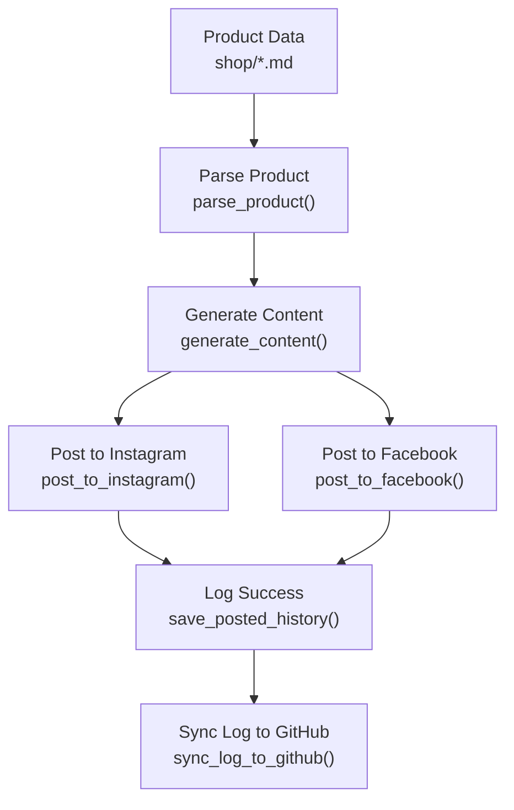
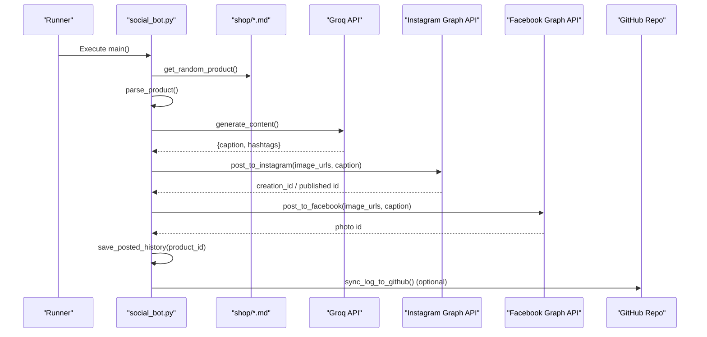
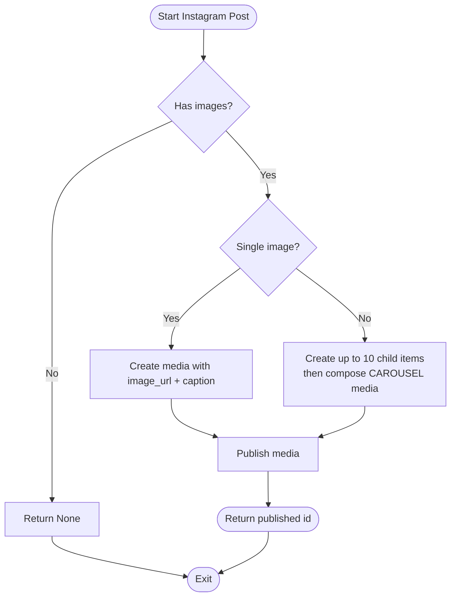
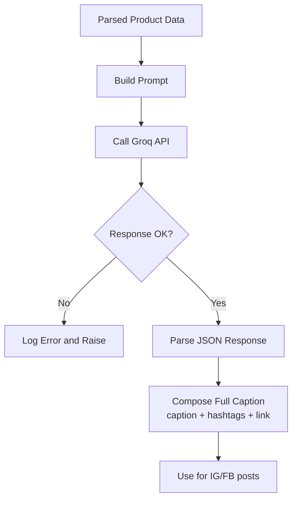
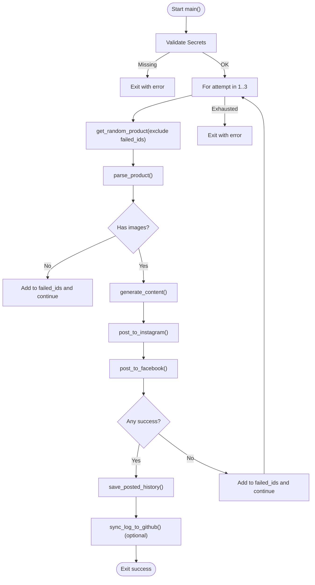
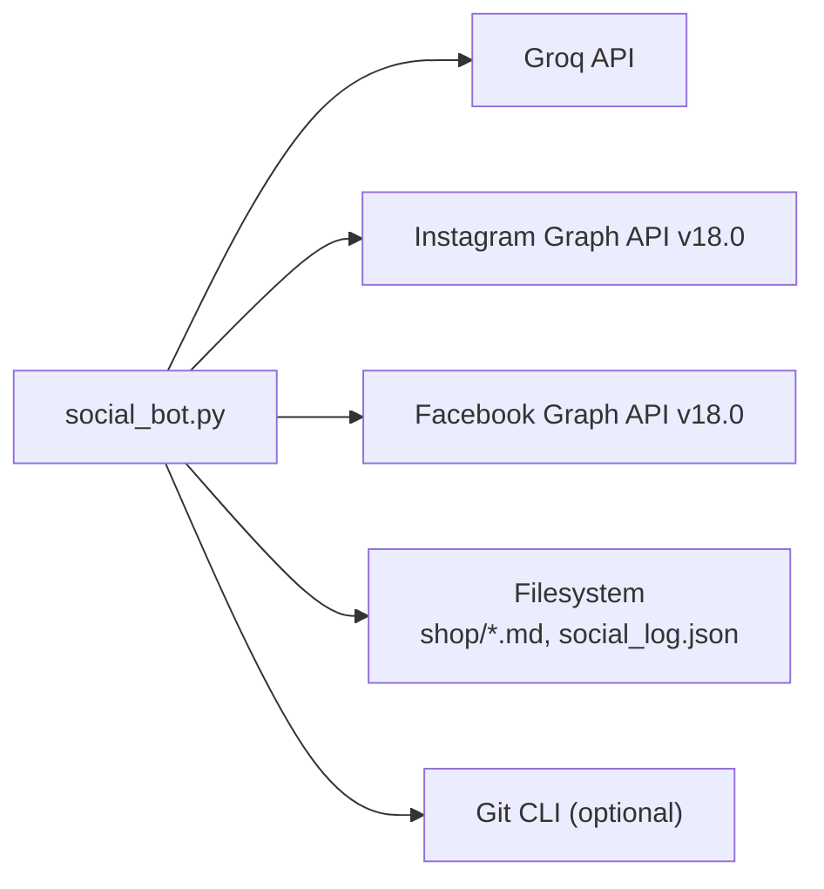

# Social Media Automation

<cite>
**Referenced Files in This Document**
- [social_bot.py](file://social_bot.py)
- [blog_bot.py](file://blog_bot.py)
- [SOCIAL_BOT_SETUP.md](file://SOCIAL_BOT_SETUP.md)
- [social_log.json](file://social_log.json)
- [blog_log.json](file://blog_log.json)
- [B0CLHGCYRN.md](file://shop/B0CLHGCYRN.md)
- [B0F3KHSF4V.md](file://shop/B0F3KHSF4V.md)
</cite>

## Table of Contents
1. [Introduction](#introduction)
2. [Project Structure](#project-structure)
3. [Core Components](#core-components)
4. [Architecture Overview](#architecture-overview)
5. [Detailed Component Analysis](#detailed-component-analysis)
6. [Dependency Analysis](#dependency-analysis)
7. [Performance Considerations](#performance-considerations)
8. [Troubleshooting Guide](#troubleshooting-guide)
9. [Conclusion](#conclusion)
10. [Appendices](#appendices)

## Introduction
This document explains the social media automation system that posts to Instagram and Facebook using the Meta Graph API, with AI-powered content generation via Groq. It covers multi-platform posting strategy, carousel support for multiple images, content generation workflows, authentication setup (access tokens, page permissions, app configuration), hashtag optimization strategies, platform-specific formatting, error handling with retry logic, environment variable configuration, testing procedures, logging, debugging common API errors, monitoring performance, rate limiting considerations, and best practices for maintaining a consistent brand voice across platforms.

## Project Structure
The automation is implemented as Python scripts that:
- Read product data from Markdown files under the shop directory
- Generate engaging captions and hashtags using Groq’s Llama model
- Post to Instagram (single image or carousel) and Facebook (single image)
- Maintain logs of posted products and optionally sync them back to the repository

**Diagram sources**
- [social_bot.py:101-118](file://social_bot.py#L101-L118)
- [social_bot.py:120-136](file://social_bot.py#L120-L136)
- [social_bot.py:138-206](file://social_bot.py#L138-L206)
- [social_bot.py:208-246](file://social_bot.py#L208-L246)
- [social_bot.py:71-78](file://social_bot.py#L71-L78)
- [social_bot.py:32-61](file://social_bot.py#L32-L61)

**Section sources**
- [social_bot.py:1-315](file://social_bot.py#L1-L315)
- [SOCIAL_BOT_SETUP.md:1-106](file://SOCIAL_BOT_SETUP.md#L1-L106)

## Core Components
- Product selection and parsing
  - Randomly selects a product file from the shop directory while avoiding recently posted IDs
  - Parses frontmatter fields such as title, description, price, cover, images, and links
- Content generation
  - Calls Groq API to generate caption and hashtags tailored for UAE audience and brand tone
- Multi-platform posting
  - Instagram: supports single image and carousel (up to 10 child items)
  - Facebook: posts a single image with message
- Logging and persistence
  - Maintains recent post history to avoid repetition
  - Optionally commits and pushes updated log to the repository
- Retry and resilience
  - Retries up to three times with different products on failure
  - Detects expired token errors and provides actionable guidance

**Section sources**
- [social_bot.py:79-94](file://social_bot.py#L79-L94)
- [social_bot.py:101-118](file://social_bot.py#L101-L118)
- [social_bot.py:120-136](file://social_bot.py#L120-L136)
- [social_bot.py:138-206](file://social_bot.py#L138-L206)
- [social_bot.py:208-246](file://social_bot.py#L208-L246)
- [social_bot.py:248-315](file://social_bot.py#L248-L315)

## Architecture Overview
End-to-end flow from product selection to cross-platform publishing and logging.

**Diagram sources**
- [social_bot.py:248-315](file://social_bot.py#L248-L315)
- [social_bot.py:120-136](file://social_bot.py#L120-L136)
- [social_bot.py:138-206](file://social_bot.py#L138-L206)
- [social_bot.py:208-246](file://social_bot.py#L208-L246)
- [social_bot.py:32-61](file://social_bot.py#L32-L61)

## Detailed Component Analysis

### Authentication and App Configuration
- Required secrets
  - GROQ_API_KEY: Key for Groq content generation
  - META_ACCESS_TOKEN: Long-lived access token for Facebook/Instagram
  - FB_PAGE_ID: Facebook Page ID used for posting photos
  - IG_USER_ID: Instagram Business Account ID used for media creation/publishing
  - GITHUB_TOKEN (optional): Used to commit and push social_log.json back to the repo
- Permissions required for META_ACCESS_TOKEN
  - pages_manage_metadata
  - pages_read_engagement
  - instagram_basic
  - instagram_content_publishing
- How to obtain tokens and IDs
  - Create or use an existing Facebook app
  - Generate a long-lived page access token
  - Retrieve your Facebook Page ID and Instagram Business Account ID

Operational checks:
- The script validates presence of all required secrets at startup and exits if any are missing
- If GITHUB_TOKEN is not set, log syncing is skipped with a warning

**Section sources**
- [SOCIAL_BOT_SETUP.md:10-48](file://SOCIAL_BOT_SETUP.md#L10-L48)
- [SOCIAL_BOT_SETUP.md:30-48](file://SOCIAL_BOT_SETUP.md#L30-L48)
- [social_bot.py:248-266](file://social_bot.py#L248-L266)

### Multi-Platform Posting Strategy
- Instagram
  - Single image: Creates media with image_url and caption, then publishes
  - Carousel: Creates up to 10 child items marked as carousel items, then composes a CAROUSEL media with children and caption, then publishes
  - Includes a short delay before publishing to ensure media processing
- Facebook
  - Posts a single image using the first image URL and the generated caption/message

**Diagram sources**
- [social_bot.py:138-206](file://social_bot.py#L138-L206)

**Section sources**
- [social_bot.py:138-206](file://social_bot.py#L138-L206)
- [social_bot.py:208-246](file://social_bot.py#L208-L246)

### Content Generation Workflow
- Input: Parsed product data (title, description, price, link, images)
- Prompt: Requests an engaging caption and a block of hashtags suitable for UAE audience and brand voice
- Output: JSON object containing caption and hashtags
- Composition: Final caption combines AI-generated caption, hashtags, and a “Shop here” link

**Diagram sources**
- [social_bot.py:101-118](file://social_bot.py#L101-L118)
- [social_bot.py:120-136](file://social_bot.py#L120-L136)
- [social_bot.py:284-286](file://social_bot.py#L284-L286)

**Section sources**
- [social_bot.py:101-118](file://social_bot.py#L101-L118)
- [social_bot.py:120-136](file://social_bot.py#L120-L136)
- [social_bot.py:284-286](file://social_bot.py#L284-L286)

### Hashtag Optimization Strategies
- The prompt requests 10–15 relevant hashtags per post
- Hashtags are appended after the caption to maximize discoverability
- Best practices reflected in prompts:
  - Include location context (e.g., Dubai, Abu Dhabi, UAE)
  - Mix broad and niche tags (e.g., home decor, gift ideas, specific product categories)
  - Keep hashtags concise and relevant to the product and audience

Note: The exact prompt and output structure are defined in the content generation function.

**Section sources**
- [social_bot.py:120-136](file://social_bot.py#L120-L136)

### Platform-Specific Formatting
- Instagram
  - Supports both single-image posts and carousels
  - Uses caption field; includes emojis and hashtags
- Facebook
  - Posts a single image with a message field
  - Uses the same caption text for consistency

**Section sources**
- [social_bot.py:138-206](file://social_bot.py#L138-L206)
- [social_bot.py:208-246](file://social_bot.py#L208-L246)

### Error Handling and Retry Logic
- Validation
  - Exits early if required secrets are missing
- Retry loop
  - Attempts up to three times, skipping previously failed product IDs
- Error detection
  - Catches HTTP and unexpected exceptions
  - Parses API error responses and detects expired token code
  - Provides clear instructions to refresh the access token
- Resilience
  - Skips products without images
  - Records failures to exclude those products in subsequent attempts

**Diagram sources**
- [social_bot.py:248-315](file://social_bot.py#L248-L315)
- [social_bot.py:79-94](file://social_bot.py#L79-L94)
- [social_bot.py:138-206](file://social_bot.py#L138-L206)
- [social_bot.py:208-246](file://social_bot.py#L208-L246)

**Section sources**
- [social_bot.py:248-315](file://social_bot.py#L248-L315)
- [social_bot.py:186-206](file://social_bot.py#L186-L206)
- [social_bot.py:226-246](file://social_bot.py#L226-L246)

### Logging System and Monitoring
- Local logs
  - social_log.json: Tracks recently posted product IDs to avoid repetition
  - blog_log.json: Tracks blog generation history (separate workflow)
- Repository sync
  - When GITHUB_TOKEN is available, the script commits and pushes social_log.json to the repository
- Observability
  - Prints detailed logs for each step including API URLs, payload sizes, and error details
  - Detects and reports expired token scenarios with remediation steps

**Section sources**
- [social_bot.py:32-61](file://social_bot.py#L32-L61)
- [social_bot.py:62-78](file://social_bot.py#L62-L78)
- [social_log.json:1-52](file://social_log.json#L1-L52)
- [blog_log.json:1-1](file://blog_log.json#L1-L1)

### Testing Procedures
- Unit-style test for blog content generation
  - A small script demonstrates creating a blog post file from sample product and AI content
- Manual verification
  - Run the social bot locally by setting required environment variables
  - Confirm that social_log.json is updated and optional GitHub sync occurs

**Section sources**
- [blog_bot.py:1-253](file://blog_bot.py#L1-L253)
- [scripts/test_blog_bot_run.py:1-10](file://scripts/test_blog_bot_run.py#L1-L10)

## Dependency Analysis
External dependencies and integration points:
- Groq API: Content generation endpoint
- Meta Graph API v18.0:
  - Instagram media creation and publishing endpoints
  - Facebook photo upload endpoint
- Filesystem: Reads/writes Markdown product files and JSON logs
- Git CLI: Optional repository sync when running in CI

**Diagram sources**
- [social_bot.py:120-136](file://social_bot.py#L120-L136)
- [social_bot.py:138-206](file://social_bot.py#L138-L206)
- [social_bot.py:208-246](file://social_bot.py#L208-L246)
- [social_bot.py:32-61](file://social_bot.py#L32-L61)

**Section sources**
- [social_bot.py:1-315](file://social_bot.py#L1-L315)

## Performance Considerations
- Rate limiting
  - Instagram carousel creation involves multiple sequential uploads; consider spacing between calls if you scale beyond one post per run
  - Facebook photo upload is a single call per post
- Network overhead
  - Each post triggers one Groq call and two Graph API calls (IG create/publish + FB upload)
- Image constraints
  - Instagram carousel limited to 10 child items; the script enforces this limit
- Idempotency and deduplication
  - Recent post history prevents repeated posting of the same product within a rolling window
- Caching and retries
  - Short sleep before publishing ensures media readiness
  - Retry loop avoids transient failures by trying different products

[No sources needed since this section provides general guidance]

## Troubleshooting Guide
Common issues and resolutions:
- Missing required secrets
  - Ensure all four required secrets are configured exactly as specified
- Expired access token
  - The script detects error code 190 and instructs how to obtain a new long-lived token
- No images found
  - Products must include cover or images in frontmatter; otherwise they are skipped
- No posts happening
  - Verify cron schedule and manual trigger options
  - Confirm product files exist and contain valid metadata
- Viewing logs
  - Use the Actions tab to inspect detailed logs for each run

**Section sources**
- [SOCIAL_BOT_SETUP.md:75-106](file://SOCIAL_BOT_SETUP.md#L75-L106)
- [social_bot.py:186-206](file://social_bot.py#L186-L206)
- [social_bot.py:226-246](file://social_bot.py#L226-L246)
- [social_bot.py:248-266](file://social_bot.py#L248-L266)

## Conclusion
The automation system streamlines cross-platform social media publishing by combining structured product data, AI-driven content generation, and robust error handling. It supports Instagram carousels and Facebook single-image posts, maintains a history to avoid repetition, and integrates optional repository synchronization for auditability. With proper authentication and permission setup, it delivers consistent, on-brand content across platforms while providing clear diagnostics and recovery paths.

[No sources needed since this section summarizes without analyzing specific files]

## Appendices

### Step-by-Step Setup Instructions
- Configure GitHub repository secrets as described in the setup guide
- Obtain and validate permissions for the access token
- Ensure product files in the shop directory have required frontmatter fields
- Trigger the workflow manually or rely on scheduled runs
- Monitor logs and verify social_log.json updates

**Section sources**
- [SOCIAL_BOT_SETUP.md:1-106](file://SOCIAL_BOT_SETUP.md#L1-L106)

### Environment Variables Reference
- GROQ_API_KEY: Groq API key for content generation
- META_ACCESS_TOKEN: Long-lived Facebook/Instagram access token
- FB_PAGE_ID: Facebook Page ID
- IG_USER_ID: Instagram Business Account ID
- GITHUB_TOKEN: Optional token for repository sync

**Section sources**
- [SOCIAL_BOT_SETUP.md:10-21](file://SOCIAL_BOT_SETUP.md#L10-L21)
- [social_bot.py:16-21](file://social_bot.py#L16-L21)

### Data Model Examples
- Sample product frontmatter includes fields like title, description, price, cover, images, amazonLink, and permalink
- These fields are parsed and used to construct posts and links

**Section sources**
- [B0CLHGCYRN.md:1-55](file://shop/B0CLHGCYRN.md#L1-L55)
- [B0F3KHSF4V.md:1-55](file://shop/B0F3KHSF4V.md#L1-L55)