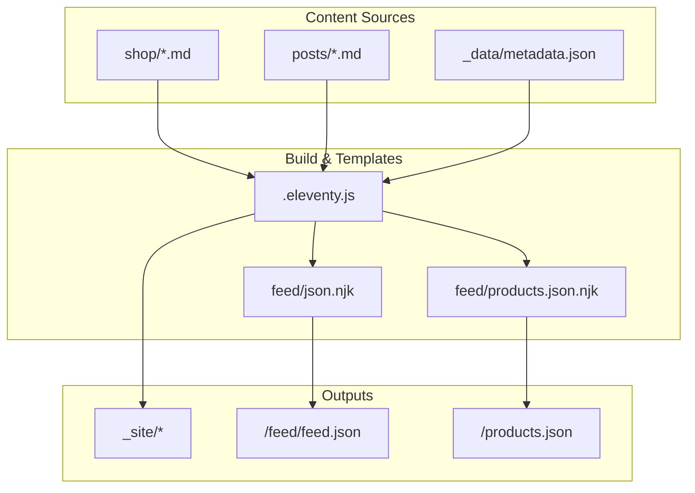
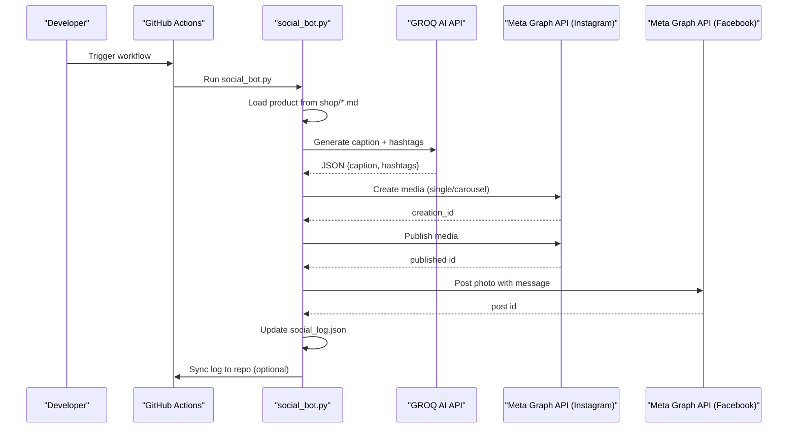
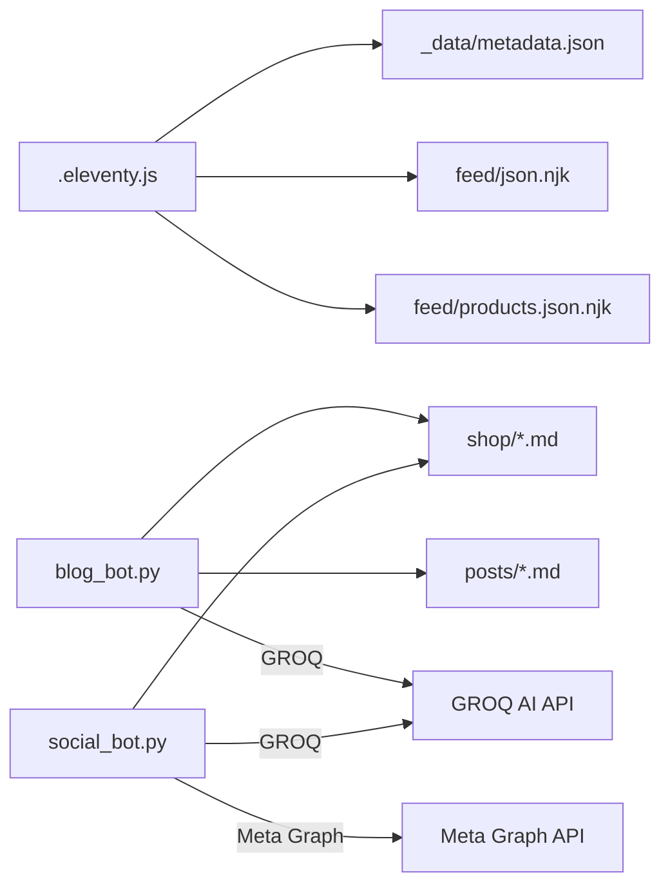

# API Reference

<cite>
**Referenced Files in This Document**
- [README.md](file://README.md)
- [SOCIAL_BOT_SETUP.md](file://SOCIAL_BOT_SETUP.md)
- [package.json](file://package.json)
- [.eleventy.js](file://.eleventy.js)
- [blog_bot.py](file://blog_bot.py)
- [social_bot.py](file://social_bot.py)
- [feed/json.njk](file://feed/json.njk)
- [feed/products.json.njk](file://feed/products.json.njk)
- [_data/metadata.json](file://_data/metadata.json)
- [shop/B0CLHGCYRN.md](file://shop/B0CLHGCYRN.md)
- [posts/best-gift-ideas-in-uae-2025.md](file://posts/best-gift-ideas-in-uae-2025.md)
</cite>

## Table of Contents
1. Introduction
2. Project Structure
3. Core Components
4. Architecture Overview
5. Detailed Component Analysis
6. Dependency Analysis
7. Performance Considerations
8. Troubleshooting Guide
9. Conclusion
10. Appendices

## Introduction
This document provides a comprehensive API reference for the Nillianstore2 platform. It covers:
- External integrations: GROQ AI API for content generation and Meta Graph API for social media posting
- Internal APIs: JSON feeds for posts and products, and template data access via Eleventy collections
- Automation scripts: command-line usage, configuration options, and environment variables
- Security, rate limiting, error handling, and versioning considerations for API consumers

The site is built with Eleventy (11ty), generating static pages and feeds from Markdown product and post files. Automation scripts integrate with external APIs to generate blog content and publish social media posts.

**Section sources**
- [README.md:1-64](file://README.md#L1-L64)
- [package.json:1-34](file://package.json#L1-L34)
- [.eleventy.js:1-160](file://.eleventy.js#L1-L160)

## Project Structure
Nillianstore2 organizes content as Markdown files under shop/ and posts/, with Eleventy templates and data files producing static outputs and feeds. The feed directory exposes internal JSON endpoints consumed by clients or automation.

**Diagram sources**
- [.eleventy.js:145-159](file://.eleventy.js#L145-L159)
- [feed/json.njk:1-33](file://feed/json.njk#L1-L33)
- [feed/products.json.njk:1-17](file://feed/products.json.njk#L1-L17)
- [_data/metadata.json:1-27](file://_data/metadata.json#L1-L27)

**Section sources**
- [.eleventy.js:1-160](file://.eleventy.js#L1-L160)
- [feed/json.njk:1-33](file://feed/json.njk#L1-L33)
- [feed/products.json.njk:1-17](file://feed/products.json.njk#L1-L17)
- [_data/metadata.json:1-27](file://_data/metadata.json#L1-L27)

## Core Components
- Content model: Product and post Markdown files with frontmatter fields used across templates and automation
- Internal APIs: JSON Feed (/feed/feed.json) and Products JSON (/products.json) generated by Eleventy
- External integrations:
  - GROQ AI API for content generation
  - Meta Graph API for Instagram and Facebook publishing
- Automation scripts:
  - Blog generator (blog_bot.py)
  - Social media poster (social_bot.py)

Key responsibilities:
- .eleventy.js configures plugins, filters, collections, and output directories
- feed/json.njk renders the JSON Feed for posts
- feed/products.json.njk renders a flat list of products
- blog_bot.py calls GROQ to generate SEO-optimized blog posts from product data
- social_bot.py calls GROQ for captions and publishes to Meta platforms

**Section sources**
- [.eleventy.js:1-160](file://.eleventy.js#L1-L160)
- [feed/json.njk:1-33](file://feed/json.njk#L1-L33)
- [feed/products.json.njk:1-17](file://feed/products.json.njk#L1-L17)
- [blog_bot.py:1-253](file://blog_bot.py#L1-L253)
- [social_bot.py:1-315](file://social_bot.py#L1-L315)

## Architecture Overview
High-level flow:
- Build time: Eleventy reads Markdown content and data to produce static pages and JSON feeds
- Automation time: Scripts read product Markdown, call GROQ for content, and optionally publish to Meta

**Diagram sources**
- [social_bot.py:120-136](file://social_bot.py#L120-L136)
- [social_bot.py:138-206](file://social_bot.py#L138-L206)
- [social_bot.py:208-246](file://social_bot.py#L208-L246)
- [social_bot.py:248-315](file://social_bot.py#L248-L315)
- [SOCIAL_BOT_SETUP.md:50-106](file://SOCIAL_BOT_SETUP.md#L50-L106)

## Detailed Component Analysis

### Internal API: JSON Feed (Posts)
- Endpoint: /feed/feed.json
- Producer: Eleventy template feed/json.njk
- Data source: collections.posts (from posts/*.md)
- Schema highlights:
  - version: JSON Feed spec version
  - title, description, language, home_page_url, feed_url, author
  - items[]: each item includes id, url, title, content_html, date_published

Notes:
- Absolute URLs are constructed using metadata.url
- content_html is serialized safely; ensure HTML sanitization at consumer side if needed

Example request/response structure:
- Request: GET https://www.nillianstore.com/feed/feed.json
- Response: JSON object with top-level metadata and an array of post items

**Section sources**
- [feed/json.njk:1-33](file://feed/json.njk#L1-L33)
- [_data/metadata.json:11-26](file://_data/metadata.json#L11-L26)

### Internal API: Products JSON
- Endpoint: /products.json
- Producer: Eleventy template feed/products.json.njk
- Data source: collections.shop (from shop/*.md)
- Schema highlights:
  - products[]: each product includes title, description, image, price, link
  - image uses site.url plus cover path
  - link uses site.url plus item.url

Example request/response structure:
- Request: GET https://www.nillianstore.com/products.json
- Response: JSON object with a products array

**Section sources**
- [feed/products.json.njk:1-17](file://feed/products.json.njk#L1-L17)
- [.eleventy.js:16](file://.eleventy.js#L16)

### Content Model: Product Markdown
Product files in shop/*.md include frontmatter fields used by templates and automation.

Common fields:
- title: string
- description: string
- price: string (e.g., AED 95)
- cover: relative image path
- images: array of relative image paths
- amazonLink or link: external purchase URL
- tags: array of strings
- layout: template alias
- permalink: custom route
- date: ISO date
- Optional: bullet_points, image_alts, category, ecwidId

Example file:
- shop/B0CLHGCYRN.md

**Section sources**
- [shop/B0CLHGCYRN.md:1-55](file://shop/B0CLHGCYRN.md#L1-L55)

### Content Model: Post Markdown
Post files in posts/*.md include frontmatter fields used by templates and automation.

Common fields:
- title: string
- description: string
- cover: relative image path
- date: ISO date
- tags: array of strings
- layout: template alias
- permalink: custom route

Example file:
- posts/best-gift-ideas-in-uae-2025.md

**Section sources**
- [posts/best-gift-ideas-in-uae-2025.md:1-28](file://posts/best-gift-ideas-in-uae-2025.md#L1-L28)

### External Integration: GROQ AI API
Used by both blog_bot.py and social_bot.py to generate content.

Authentication:
- Header: Authorization: Bearer <GROQ_API_KEY>
- Environment variable: GROQ_API_KEY

Request schema:
- Endpoint: https://api.groq.com/openai/v1/chat/completions
- Method: POST
- Headers:
  - Authorization: Bearer token
  - Content-Type: application/json
- Body:
  - model: llama-3.3-70b-versatile
  - messages: [{ role: "user", content: prompt }]
  - response_format: { type: "json_object" }

Response schema:
- choices[0].message.content: JSON string matching requested format

Usage patterns:
- blog_bot.py: Generates structured blog content (title, description, tags, sections)
- social_bot.py: Generates caption and hashtags for social posts

Error handling:
- Raises HTTP errors on non-2xx responses
- Prints raw response text when available

Rate limiting:
- Not implemented client-side; rely on provider limits and retries

Security:
- Never hardcode keys; use environment variables or GitHub Secrets

Versioning:
- Uses OpenAI-compatible endpoint path; update model name or endpoint if provider changes

**Section sources**
- [blog_bot.py:48-97](file://blog_bot.py#L48-L97)
- [social_bot.py:120-136](file://social_bot.py#L120-L136)
- [SOCIAL_BOT_SETUP.md:24-28](file://SOCIAL_BOT_SETUP.md#L24-L28)

### External Integration: Meta Graph API
Used by social_bot.py to publish to Instagram and Facebook.

Authentication:
- Access token via META_ACCESS_TOKEN
- Required permissions: pages_manage_metadata, pages_read_engagement, instagram_basic, instagram_content_publishing

Endpoints:
- Instagram create media:
  - POST https://graph.facebook.com/v18.0/{IG_USER_ID}/media
  - Parameters:
    - Single image: image_url, caption, access_token
    - Carousel: multiple child media created with is_carousel_item=true, then publish with children and caption
  - Publish:
    - POST https://graph.facebook.com/v18.0/{IG_USER_ID}/media_publish
    - Parameters: creation_id, access_token
- Facebook post:
  - POST https://graph.facebook.com/v18.0/{FB_PAGE_ID}/photos
  - Parameters: url, message, access_token

Response handling:
- Returns IDs for created/published media
- Detects expired tokens (error code 190) and prints guidance

Error handling:
- Catches requests exceptions and logs detailed error info
- Gracefully handles missing images

Rate limiting:
- Includes a short delay between steps to reduce burstiness

Security:
- Tokens provided via environment variables or GitHub Secrets

Versioning:
- Uses v18.0 of Graph API; update base path if upgrading versions

**Section sources**
- [social_bot.py:138-206](file://social_bot.py#L138-L206)
- [social_bot.py:208-246](file://social_bot.py#L208-L246)
- [SOCIAL_BOT_SETUP.md:30-48](file://SOCIAL_BOT_SETUP.md#L30-L48)

### Automation Script Interfaces

#### Blog Generator (blog_bot.py)
Purpose:
- Select a random product from shop/*.md
- Generate SEO-optimized blog post content via GROQ
- Write a new Markdown file into posts/
- Maintain a history log to avoid repetition

Environment variables:
- GROQ_API_KEY

Command-line usage:
- python blog_bot.py

Behavior:
- Loads product frontmatter and images
- Calls GROQ with a structured prompt
- Creates a sanitized slug and writes a post file with frontmatter and body
- Appends product ID to blog_log.json

Error handling:
- Prints errors and exits without creating files on failure

**Section sources**
- [blog_bot.py:1-253](file://blog_bot.py#L1-L253)

#### Social Media Poster (social_bot.py)
Purpose:
- Select a random product from shop/*.md (excluding recently posted)
- Generate caption and hashtags via GROQ
- Publish to Instagram and Facebook
- Persist posted product IDs to social_log.json
- Optionally sync log to GitHub repository

Environment variables:
- GROQ_API_KEY
- META_ACCESS_TOKEN
- FB_PAGE_ID
- IG_USER_ID
- GITHUB_TOKEN (optional)

Command-line usage:
- python social_bot.py

Behavior:
- Validates required secrets
- Parses product frontmatter and builds absolute image URLs
- Calls GROQ for content
- Posts to Instagram (single or carousel) and Facebook
- Retries up to 3 times with different products on failure
- Syncs social_log.json to repository if GITHUB_TOKEN is set

Error handling:
- Detailed logging for network and API errors
- Token expiration detection and remediation instructions

**Section sources**
- [social_bot.py:1-315](file://social_bot.py#L1-L315)
- [SOCIAL_BOT_SETUP.md:50-106](file://SOCIAL_BOT_SETUP.md#L50-L106)

### Eleventy Configuration and Filters
Key configuration:
- Global site URL: https://www.nillianstore.com
- Template engines: md, njk, html, liquid
- Directories: input ., includes _includes, data _data, output _site
- Plugins: RSS, syntax highlighting, navigation
- Filters: readableDate, htmlDateString, isoDateTime, head, min, safeSlug, filterTagList, sanitize, xmlEncode
- Passthrough copy: img, css, robots.txt, feed, videos

These settings influence how internal APIs render data and construct absolute URLs.

**Section sources**
- [.eleventy.js:1-160](file://.eleventy.js#L1-L160)

## Dependency Analysis
External dependencies:
- Python packages: requests, frontmatter (used by automation scripts)
- Node/Eleventy ecosystem: @11ty/eleventy and plugins (build-time only)

Internal dependencies:
- Eleventy config depends on data files (_data/metadata.json) and templates (feed/*.njk)
- Automation scripts depend on content files (shop/*.md, posts/*.md) and environment variables

**Diagram sources**
- [.eleventy.js:1-160](file://.eleventy.js#L1-L160)
- [feed/json.njk:1-33](file://feed/json.njk#L1-L33)
- [feed/products.json.njk:1-17](file://feed/products.json.njk#L1-L17)
- [blog_bot.py:1-253](file://blog_bot.py#L1-L253)
- [social_bot.py:1-315](file://social_bot.py#L1-L315)

**Section sources**
- [package.json:24-32](file://package.json#L24-L32)
- [blog_bot.py:1-253](file://blog_bot.py#L1-L253)
- [social_bot.py:1-315](file://social_bot.py#L1-L315)

## Performance Considerations
- Build performance: Eleventy generates static assets; keep collections small and avoid heavy processing in templates
- Network calls: Both automation scripts make external API calls; consider caching and retry strategies
- Image handling: Normalize and compress images to reduce payload sizes
- Rate limiting: Implement backoff and jitter when calling GROQ and Meta APIs to avoid throttling
- Concurrency: Avoid parallel calls to Meta APIs within a single run to respect quotas

## Troubleshooting Guide
Common issues and resolutions:
- Missing environment variables: Ensure all required secrets are configured in GitHub Actions or local environment
- Expired Meta access token: Error code 190 indicates token expiry; refresh long-lived token and update secrets
- No images found: Products must include cover or images in frontmatter; otherwise skip posting
- Network errors: Check connectivity and provider status; inspect logged response bodies for details
- Repetitive posts: Review social_log.json and blog_log.json to ensure history tracking works

Operational checks:
- Verify cron schedule and manual triggers in GitHub Actions
- Validate permissions for Meta app (pages_manage_metadata, pages_read_engagement, instagram_basic, instagram_content_publishing)

**Section sources**
- [social_bot.py:248-315](file://social_bot.py#L248-L315)
- [SOCIAL_BOT_SETUP.md:75-106](file://SOCIAL_BOT_SETUP.md#L75-L106)

## Conclusion
Nillianstore2 provides robust internal APIs for posts and products via Eleventy-generated JSON feeds, and integrates external services for content generation and social publishing. Automation scripts encapsulate complex workflows while maintaining clear separation of concerns. Consumers should adhere to authentication requirements, handle errors gracefully, and implement rate limiting and versioning strategies aligned with provider policies.

## Appendices

### Authentication Methods Summary
- GROQ AI API: Bearer token via Authorization header
- Meta Graph API: Long-lived page access token via access_token parameter
- Environment variables: All secrets managed via GitHub Secrets or local env

### Versioning Strategies
- Meta Graph API: Explicitly uses v18.0; pin versions and test upgrades before switching
- GROQ AI API: Uses OpenAI-compatible endpoint; monitor provider updates and adjust model names accordingly
- Internal APIs: Stable JSON schemas; maintain backward compatibility and document breaking changes

### Example Integrations (Conceptual)
- Fetch posts:
  - GET https://www.nillianstore.com/feed/feed.json
  - Parse items array for titles, URLs, and publication dates
- Fetch products:
  - GET https://www.nillianstore.com/products.json
  - Iterate products array for catalog display or search indexing
- Generate blog post (automation):
  - Set GROQ_API_KEY
  - Run python blog_bot.py
- Publish social post (automation):
  - Set GROQ_API_KEY, META_ACCESS_TOKEN, FB_PAGE_ID, IG_USER_ID
  - Run python social_bot.py