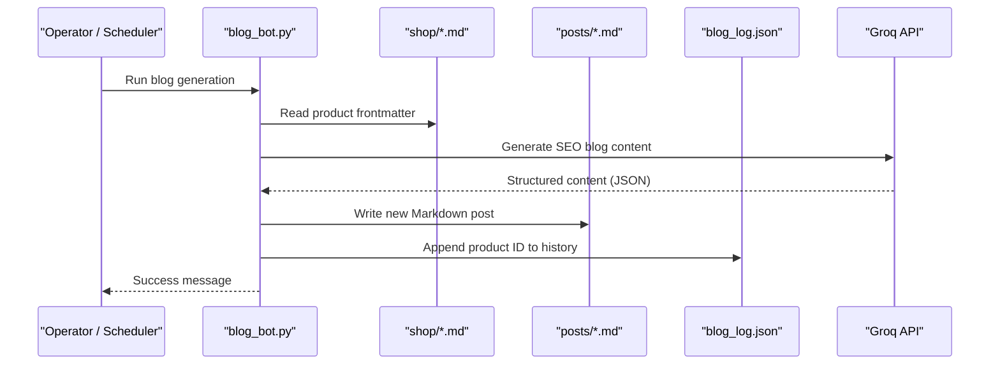
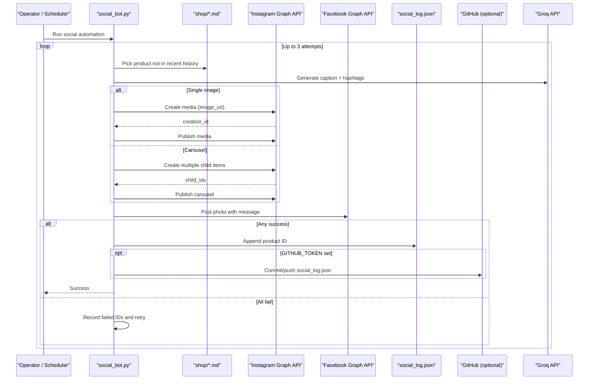
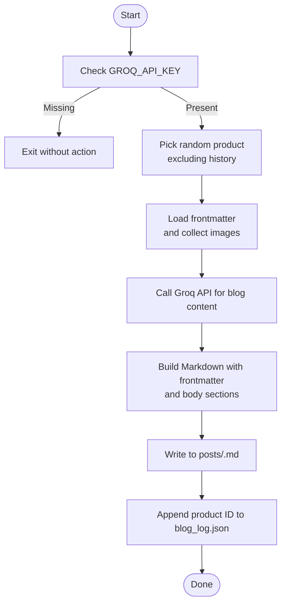
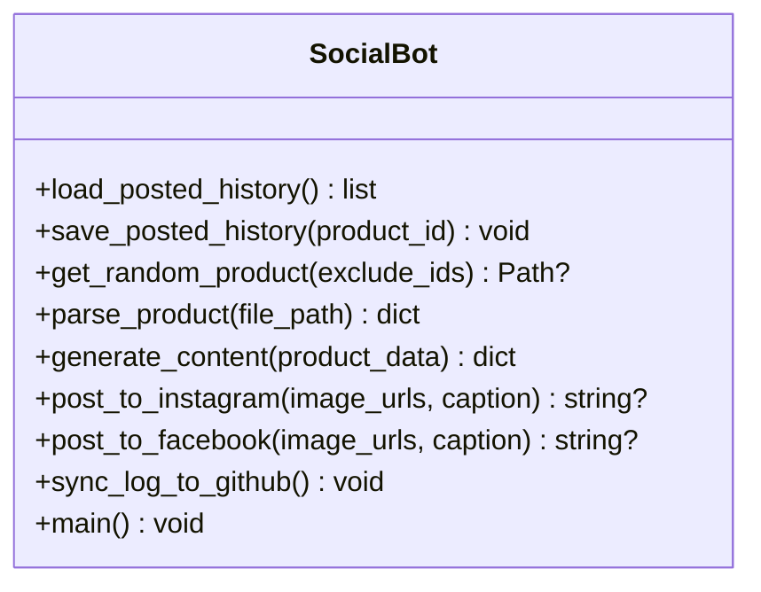
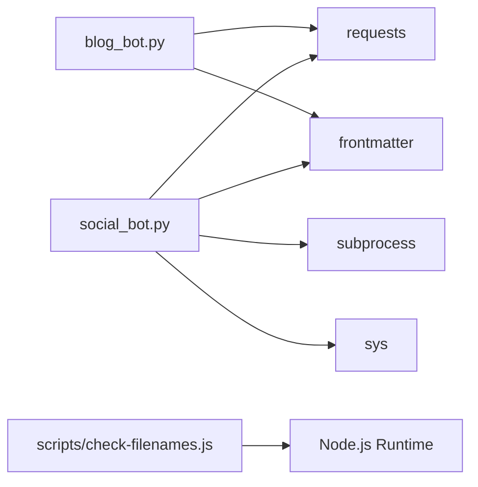

# Automation Script Interfaces

<cite>
**Referenced Files in This Document**
- [blog_bot.py](file://blog_bot.py)
- [social_bot.py](file://social_bot.py)
- [test_frontmatter.py](file://test_frontmatter.py)
- [verify_links.py](file://verify_links.py)
- [scripts/check-filenames.js](file://scripts/check-filenames.js)
- [scripts/test_blog_bot_run.py](file://scripts/test_blog_bot_run.py)
- [SOCIAL_BOT_SETUP.md](file://SOCIAL_BOT_SETUP.md)
- [package.json](file://package.json)
- [shop/B0F3KHSF4V.md](file://shop/B0F3KHSF4V.md)
- [posts/best-gift-ideas-in-uae-2025.md](file://posts/best-gift-ideas-in-uae-2025.md)
</cite>

## Table of Contents
1. [Introduction](#introduction)
2. [Project Structure](#project-structure)
3. [Core Components](#core-components)
4. [Architecture Overview](#architecture-overview)
5. [Detailed Component Analysis](#detailed-component-analysis)
6. [Dependency Analysis](#dependency-analysis)
7. [Performance Considerations](#performance-considerations)
8. [Troubleshooting Guide](#troubleshooting-guide)
9. [Conclusion](#conclusion)
10. [Appendices](#appendices)

## Introduction
This document describes the automation script interfaces and command-line tools used by the Nillianstore2 platform to:
- Generate SEO-focused blog posts from product data using AI content generation
- Automate social media posting across Instagram and Facebook with retry logic and logging
- Validate frontmatter fields, verify Amazon links consistency, and check build artifacts for forbidden filename characters

The scripts are designed to run locally or via CI/CD (e.g., GitHub Actions), integrate with external APIs (Groq, Meta Graph API), and persist state through JSON logs.

## Project Structure
Key automation-related files:
- Blog generation bot: blog_bot.py
- Social media automation bot: social_bot.py
- Utilities: test_frontmatter.py, verify_links.py, scripts/check-filenames.js, scripts/test_blog_bot_run.py
- Configuration and setup: SOCIAL_BOT_SETUP.md, package.json
- Data sources: shop/*.md (product entries), posts/*.md (generated blog posts)

```mermaid
graph TB
subgraph "Automation Scripts"
BB["blog_bot.py"]
SB["social_bot.py"]
TF["test_frontmatter.py"]
VL["verify_links.py"]
CF["scripts/check-filenames.js"]
TBBR["scripts/test_blog_bot_run.py"]
end
subgraph "Data"
SHOP["shop/*.md"]
POSTS["posts/*.md"]
BLOGLOG["blog_log.json"]
SOCLOG["social_log.json"]
end
subgraph "External Services"
GROQ["Groq API"]
METAIG["Instagram Graph API"]
METAFB["Facebook Graph API"]
GH["GitHub (log sync)"]
end
BB --> SHOP
BB --> POSTS
BB --> BLOGLOG
BB --> GROQ
SB --> SHOP
SB --> SOCLOG
SB --> GROQ
SB --> METAIG
SB --> METAFB
SB --> GH
TF --> SHOP
VL --> SHOP
VL --> POSTS
CF --> "_site"
TBBR --> BB
```

**Diagram sources**
- [blog_bot.py:1-253](file://blog_bot.py#L1-L253)
- [social_bot.py:1-315](file://social_bot.py#L1-L315)
- [test_frontmatter.py:1-17](file://test_frontmatter.py#L1-L17)
- [verify_links.py:1-55](file://verify_links.py#L1-L55)
- [scripts/check-filenames.js:1-45](file://scripts/check-filenames.js#L1-L45)
- [scripts/test_blog_bot_run.py:1-10](file://scripts/test_blog_bot_run.py#L1-L10)

**Section sources**
- [blog_bot.py:1-253](file://blog_bot.py#L1-L253)
- [social_bot.py:1-315](file://social_bot.py#L1-L315)
- [test_frontmatter.py:1-17](file://test_frontmatter.py#L1-L17)
- [verify_links.py:1-55](file://verify_links.py#L1-L55)
- [scripts/check-filenames.js:1-45](file://scripts/check-filenames.js#L1-L45)
- [scripts/test_blog_bot_run.py:1-10](file://scripts/test_blog_bot_run.py#L1-L10)
- [SOCIAL_BOT_SETUP.md:1-106](file://SOCIAL_BOT_SETUP.md#L1-L106)
- [package.json:1-34](file://package.json#L1-L34)

## Core Components
- Blog Generation Bot (blog_bot.py): Reads a random product from shop/*.md, generates an SEO-optimized blog post via Groq, writes a Markdown file under posts/, and records history in blog_log.json.
- Social Media Automation Bot (social_bot.py): Selects a random product not recently posted, generates caption and hashtags via Groq, publishes to Instagram and Facebook via Meta Graph API, persists log to social_log.json, and optionally syncs logs to GitHub.
- Validation and Maintenance Utilities:
  - test_frontmatter.py: Quick sanity checks on sample product frontmatter fields.
  - verify_links.py: Ensures Amazon links in generated posts match source product metadata.
  - scripts/check-filenames.js: Scans _site for filenames containing forbidden characters (? or #).
  - scripts/test_blog_bot_run.py: Unit-style test harness for create_blog_file.

**Section sources**
- [blog_bot.py:1-253](file://blog_bot.py#L1-L253)
- [social_bot.py:1-315](file://social_bot.py#L1-L315)
- [test_frontmatter.py:1-17](file://test_frontmatter.py#L1-L17)
- [verify_links.py:1-55](file://verify_links.py#L1-L55)
- [scripts/check-filenames.js:1-45](file://scripts/check-filenames.js#L1-L45)
- [scripts/test_blog_bot_run.py:1-10](file://scripts/test_blog_bot_run.py#L1-L10)

## Architecture Overview
High-level flows:
- Blog generation: Product selection → AI content generation → Markdown creation → History persistence
- Social posting: Product selection → AI content generation → Multi-platform publishing → Logging and optional Git sync



**Diagram sources**
- [blog_bot.py:1-253](file://blog_bot.py#L1-L253)



**Diagram sources**
- [social_bot.py:1-315](file://social_bot.py#L1-L315)

## Detailed Component Analysis

### Blog Generation Bot Interface
- Purpose: Automatically generate SEO-optimized blog posts from product data and publish them into the posts directory.
- Execution:
  - Command: python blog_bot.py
  - Environment variables:
    - GROQ_API_KEY: Required for content generation
  - Inputs:
    - Source products: shop/*.md files with frontmatter fields such as title, description, price, cover/images, amazonLink/link
  - Outputs:
    - New Markdown file under posts/ with structured frontmatter and body
    - Updated blog_log.json with appended product ID
- Behavior highlights:
  - Avoids reusing recently generated products unless all have been used
  - Sanitizes tags and frontmatter values for safe rendering
  - Builds HTML for images and a call-to-action button
- Return codes:
  - Exits silently on missing environment variable; otherwise prints status messages
- Logging:
  - Console output indicates progress and errors
  - Persistent state stored in blog_log.json



**Diagram sources**
- [blog_bot.py:1-253](file://blog_bot.py#L1-L253)

**Section sources**
- [blog_bot.py:1-253](file://blog_bot.py#L1-L253)
- [shop/B0F3KHSF4V.md:1-55](file://shop/B0F3KHSF4V.md#L1-L55)
- [posts/best-gift-ideas-in-uae-2025.md:1-200](file://posts/best-gift-ideas-in-uae-2025.md#L1-L200)

### Social Media Automation Bot Interface
- Purpose: Automate multi-platform posting (Instagram and Facebook) with AI-generated captions and hashtags, including retry logic and log synchronization.
- Execution:
  - Command: python social_bot.py
  - Environment variables:
    - GROQ_API_KEY: Required for content generation
    - META_ACCESS_TOKEN: Required for Meta Graph API access
    - FB_PAGE_ID: Required for Facebook page posting
    - IG_USER_ID: Required for Instagram posting
    - GITHUB_TOKEN: Optional; enables syncing social_log.json back to repository
  - Inputs:
    - Source products: shop/*.md files with frontmatter fields such as title, description, price, cover/images, amazonLink/link
  - Outputs:
    - Published posts on Instagram and Facebook
    - Updated social_log.json with recent product IDs (capped at last 50)
    - Optional commit/push to GitHub if token is present
- Behavior highlights:
  - Skips products already posted recently
  - Supports single-image and carousel posts on Instagram
  - Detects expired tokens and provides remediation guidance
  - Retries up to 3 times with different products before failing
- Return codes:
  - Exits with code 1 when required secrets are missing or after exhausting retries
- Logging:
  - Console output includes detailed steps and error diagnostics
  - Persistent state stored in social_log.json



**Diagram sources**
- [social_bot.py:1-315](file://social_bot.py#L1-L315)

**Section sources**
- [social_bot.py:1-315](file://social_bot.py#L1-L315)
- [SOCIAL_BOT_SETUP.md:1-106](file://SOCIAL_BOT_SETUP.md#L1-L106)

### Utility Scripts

#### Frontmatter Test Script
- Purpose: Quick validation of specific product frontmatter fields for selected samples.
- Execution:
  - Command: python test_frontmatter.py
  - Behavior: Loads two sample product files and prints link, amazonLink, and permalink fields.

**Section sources**
- [test_frontmatter.py:1-17](file://test_frontmatter.py#L1-L17)
- [shop/B0F3KHSF4V.md:1-55](file://shop/B0F3KHSF4V.md#L1-L55)

#### Link Verification Script
- Purpose: Ensure Amazon links in generated blog posts match the expected product metadata.
- Execution:
  - Command: python verify_links.py
  - Behavior:
    - Builds mapping of product IDs to Amazon links from shop/*.md
    - Scans posts/*.md for image references and button hrefs
    - Reports mismatches or confirms correctness

**Section sources**
- [verify_links.py:1-55](file://verify_links.py#L1-L55)

#### Filename Checker (Node.js)
- Purpose: Scan the built site (_site) for filenames containing forbidden characters (? or #).
- Execution:
  - Command: node scripts/check-filenames.js
  - Exit codes:
    - 0: OK (no forbidden characters found)
    - 1: Forbidden characters detected
    - 2: Error (e.g., _site not found)
- Integration:
  - npm script: npm run check:filenames

**Section sources**
- [scripts/check-filenames.js:1-45](file://scripts/check-filenames.js#L1-L45)
- [package.json:1-34](file://package.json#L1-L34)

#### Blog Bot Unit Test Harness
- Purpose: Exercise create_blog_file with synthetic inputs and print the first lines of the generated file.
- Execution:
  - Command: python scripts/test_blog_bot_run.py
  - Behavior: Imports create_blog_file, constructs minimal inputs, writes a test post, and prints preview.

**Section sources**
- [scripts/test_blog_bot_run.py:1-10](file://scripts/test_blog_bot_run.py#L1-L10)
- [blog_bot.py:1-253](file://blog_bot.py#L1-L253)

## Dependency Analysis
- Python dependencies:
  - requests: HTTP calls to Groq and Meta Graph APIs
  - frontmatter: Parsing YAML frontmatter in Markdown files
  - pathlib, os, json, datetime, re, random, time, subprocess, sys, traceback: Standard library utilities
- Node.js dependency:
  - Node runtime for scripts/check-filenames.js
- External services:
  - Groq API for AI content generation
  - Meta Graph API for Instagram and Facebook posting
  - GitHub API for optional log synchronization



**Diagram sources**
- [blog_bot.py:1-253](file://blog_bot.py#L1-L253)
- [social_bot.py:1-315](file://social_bot.py#L1-L315)
- [scripts/check-filenames.js:1-45](file://scripts/check-filenames.js#L1-L45)

**Section sources**
- [blog_bot.py:1-253](file://blog_bot.py#L1-L253)
- [social_bot.py:1-315](file://social_bot.py#L1-L315)
- [scripts/check-filenames.js:1-45](file://scripts/check-filenames.js#L1-L45)

## Performance Considerations
- Network latency:
  - Groq API calls and Meta Graph API calls dominate runtime; consider caching strategies if generating content repeatedly for the same product.
- Retry strategy:
  - Social bot retries up to 3 times with different products to mitigate transient failures.
- I/O operations:
  - File reads/writes are lightweight but should be considered in high-throughput scenarios.
- Token refresh:
  - Expired Meta tokens cause immediate failures; ensure long-lived tokens are refreshed proactively.

[No sources needed since this section provides general guidance]

## Troubleshooting Guide
- Missing environment variables:
  - Blog bot: If GROQ_API_KEY is absent, it exits without action.
  - Social bot: If any required secret is missing, it prints instructions and exits with code 1.
- API errors:
  - Groq API: Request exceptions are printed with response details when available.
  - Meta Graph API: Errors include status codes and parsed responses; token expiration (code 190) triggers explicit guidance.
- No products available:
  - Both bots rely on shop/*.md; ensure product files exist and contain required frontmatter fields.
- Link mismatches:
  - Use verify_links.py to detect inconsistencies between product metadata and generated posts.
- Build artifact issues:
  - Use npm run check:filenames to detect forbidden characters in _site filenames.

**Section sources**
- [blog_bot.py:1-253](file://blog_bot.py#L1-L253)
- [social_bot.py:1-315](file://social_bot.py#L1-L315)
- [verify_links.py:1-55](file://verify_links.py#L1-L55)
- [scripts/check-filenames.js:1-45](file://scripts/check-filenames.js#L1-L45)

## Conclusion
The Nillianstore2 automation suite streamlines content creation and distribution:
- Blog generation automates SEO-focused post creation from product data
- Social automation ensures consistent cross-platform posting with robust error handling
- Utilities provide validation and maintenance capabilities for data integrity and build quality

Adhering to environment requirements and leveraging provided utilities will help maintain reliable operation in production environments.

[No sources needed since this section summarizes without analyzing specific files]

## Appendices

### Environment Requirements and Secrets
- Python runtime with standard libraries plus requests and frontmatter packages
- Node.js runtime for filename checker
- GitHub repository secrets (for social bot):
  - GROQ_API_KEY
  - META_ACCESS_TOKEN
  - FB_PAGE_ID
  - IG_USER_ID
  - GITHUB_TOKEN (optional)

**Section sources**
- [SOCIAL_BOT_SETUP.md:1-106](file://SOCIAL_BOT_SETUP.md#L1-L106)

### Usage Examples and Parameters

- Blog Generation Bot
  - Command: python blog_bot.py
  - Required env: GROQ_API_KEY
  - Input: shop/*.md with frontmatter fields (title, description, price, cover/images, amazonLink/link)
  - Output: posts/<slug>.md and updated blog_log.json
  - Exit behavior: Silent exit if GROQ_API_KEY missing; otherwise prints progress

- Social Media Automation Bot
  - Command: python social_bot.py
  - Required env: GROQ_API_KEY, META_ACCESS_TOKEN, FB_PAGE_ID, IG_USER_ID
  - Optional env: GITHUB_TOKEN
  - Input: shop/*.md with frontmatter fields (title, description, price, cover/images, amazonLink/link)
  - Output: Instagram/Facebook posts, updated social_log.json, optional Git push
  - Exit codes: 0 on success; 1 on missing secrets or exhausted retries

- Frontmatter Test Script
  - Command: python test_frontmatter.py
  - Output: Prints selected frontmatter fields for sample products

- Link Verification Script
  - Command: python verify_links.py
  - Output: Lists mismatches or confirms correctness

- Filename Checker
  - Command: node scripts/check-filenames.js or npm run check:filenames
  - Exit codes: 0 OK; 1 forbidden chars found; 2 error

**Section sources**
- [blog_bot.py:1-253](file://blog_bot.py#L1-L253)
- [social_bot.py:1-315](file://social_bot.py#L1-L315)
- [test_frontmatter.py:1-17](file://test_frontmatter.py#L1-L17)
- [verify_links.py:1-55](file://verify_links.py#L1-L55)
- [scripts/check-filenames.js:1-45](file://scripts/check-filenames.js#L1-L45)
- [package.json:1-34](file://package.json#L1-L34)

### Data Formats

- Product frontmatter (shop/*.md)
  - Fields commonly used by automation:
    - title: string
    - description: string
    - price: string
    - cover: string (relative path)
    - images: array of strings (relative paths)
    - amazonLink or link: string (Amazon URL)
    - layout: string (template reference)
    - permalink: string (route)
    - date: string (YYYY-MM-DD)
  - Example reference: [shop/B0F3KHSF4V.md:1-55](file://shop/B0F3KHSF4V.md#L1-L55)

- Generated blog post (posts/*.md)
  - Frontmatter includes title, description, cover, date, tags, layout, permalink
  - Body includes structured sections, images, and CTA button
  - Example reference: [posts/best-gift-ideas-in-uae-2025.md:1-200](file://posts/best-gift-ideas-in-uae-2025.md#L1-L200)

- Logs
  - blog_log.json: Array of product IDs previously processed
  - social_log.json: Array of product IDs recently posted (last 50 entries retained)

**Section sources**
- [shop/B0F3KHSF4V.md:1-55](file://shop/B0F3KHSF4V.md#L1-L55)
- [posts/best-gift-ideas-in-uae-2025.md:1-200](file://posts/best-gift-ideas-in-uae-2025.md#L1-L200)
- [blog_bot.py:1-253](file://blog_bot.py#L1-L253)
- [social_bot.py:1-315](file://social_bot.py#L1-L315)