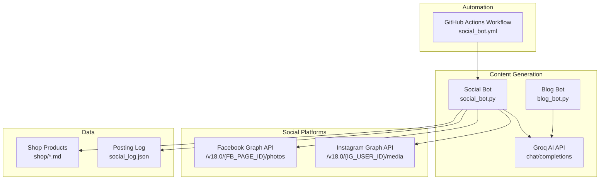
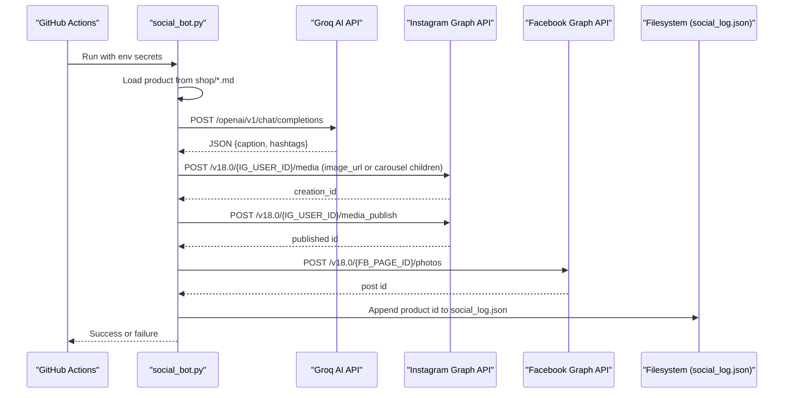
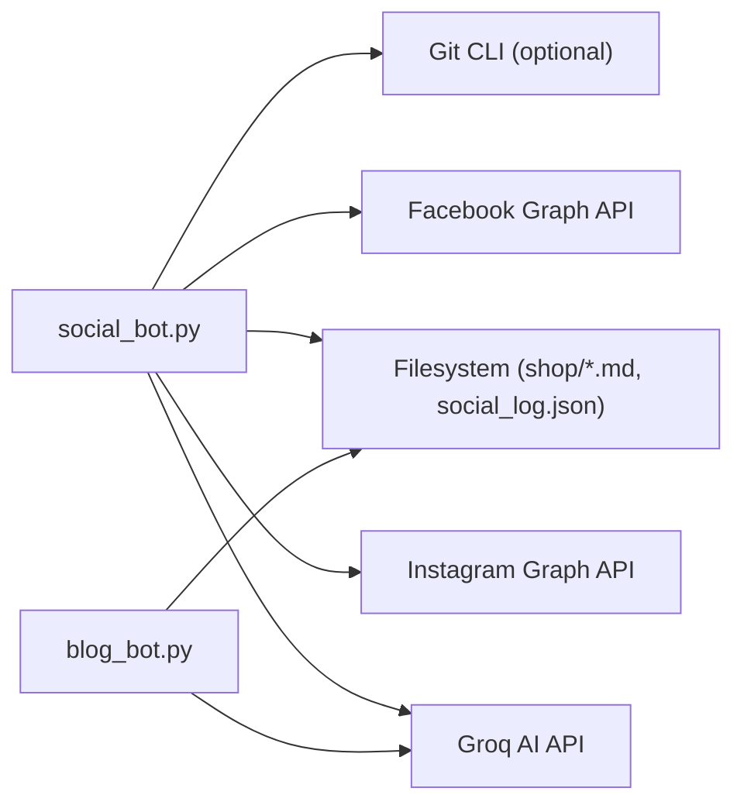

# External API Integrations

<cite>
**Referenced Files in This Document**
- [social_bot.py](file://social_bot.py)
- [blog_bot.py](file://blog_bot.py)
- [social_bot.yml](file://.github/workflows/social_bot.yml)
- [SOCIAL_BOT_SETUP.md](file://SOCIAL_BOT_SETUP.md)
- [B0G2LKSCGR.md](file://shop/B0G2LKSCGR.md)
- [B0F3KHSF4V.md](file://shop/B0F3KHSF4V.md)
</cite>

## Table of Contents
1. Introduction
2. Project Structure
3. Core Components
4. Architecture Overview
5. Detailed Component Analysis
6. Dependency Analysis
7. Performance Considerations
8. Troubleshooting Guide
9. Conclusion

## Introduction
This document provides comprehensive API documentation for external integrations in the Nillianstore2 platform, focusing on:
- GROQ AI API integration for content generation (authentication, request/response schemas, error handling, and rate limiting considerations)
- Meta Graph API integration for social media posting to Instagram and Facebook (OAuth/access token usage, post creation endpoints, image upload processes, and carousel support)
- Environment variable configuration, API key management, and security best practices
- End-to-end code examples via section sources
- Troubleshooting and debugging guidance

The automation is orchestrated by a GitHub Actions workflow that runs periodically or manually, selects a product from the shop directory, generates content using Groq AI, and publishes posts to Instagram and Facebook using Meta Graph API.

## Project Structure
Key files involved in external integrations:
- social_bot.py: Orchestrates content generation and publishing to Instagram/Facebook
- blog_bot.py: Generates SEO-optimized blog posts using Groq AI
- .github/workflows/social_bot.yml: Schedules and executes the social bot with secrets injected as environment variables
- SOCIAL_BOT_SETUP.md: Setup guide for required secrets and permissions
- shop/*.md: Product data used as input for content generation and posting

**Diagram sources**
- [social_bot.yml:1-94](file://.github/workflows/social_bot.yml#L1-L94)
- [social_bot.py:1-315](file://social_bot.py#L1-L315)
- [blog_bot.py:1-253](file://blog_bot.py#L1-L253)

**Section sources**
- [social_bot.yml:1-94](file://.github/workflows/social_bot.yml#L1-L94)
- [social_bot.py:1-315](file://social_bot.py#L1-L315)
- [blog_bot.py:1-253](file://blog_bot.py#L1-L253)
- [SOCIAL_BOT_SETUP.md:1-106](file://SOCIAL_BOT_SETUP.md#L1-L106)

## Core Components
- Social Media Automation Bot (social_bot.py)
  - Loads secrets from environment variables
  - Selects a random product from shop/*.md
  - Calls Groq AI to generate caption and hashtags
  - Publishes to Instagram (single image or carousel) and Facebook
  - Maintains a posting history log and optionally syncs it to GitHub
- Blog Content Generator (blog_bot.py)
  - Reads product frontmatter
  - Calls Groq AI to generate structured blog content
  - Writes a new Markdown post file

Environment variables and secrets:
- GROQ_API_KEY: Bearer token for Groq AI
- META_ACCESS_TOKEN: Long-lived page access token for Meta Graph API
- FB_PAGE_ID: Facebook Page ID
- IG_USER_ID: Instagram Business Account ID
- GITHUB_TOKEN: Optional token for syncing logs back to the repository

Security best practices:
- Store all secrets in GitHub Secrets
- Use long-lived tokens where applicable
- Avoid logging sensitive values
- Validate responses and handle errors gracefully

**Section sources**
- [social_bot.py:16-21](file://social_bot.py#L16-L21)
- [social_bot.py:248-267](file://social_bot.py#L248-L267)
- [blog_bot.py:15-16](file://blog_bot.py#L15-L16)
- [SOCIAL_BOT_SETUP.md:10-48](file://SOCIAL_BOT_SETUP.md#L10-L48)

## Architecture Overview
End-to-end flow for social posting:
- GitHub Actions triggers the workflow on schedule or manual dispatch
- The workflow sets up Python and installs dependencies
- It injects secrets as environment variables
- social_bot.py selects a product, calls Groq AI, then posts to Instagram and Facebook
- Posting history is persisted and optionally synced to the repository

**Diagram sources**
- [social_bot.yml:40-94](file://.github/workflows/social_bot.yml#L40-L94)
- [social_bot.py:120-206](file://social_bot.py#L120-L206)
- [social_bot.py:208-246](file://social_bot.py#L208-L246)
- [social_bot.py:248-315](file://social_bot.py#L248-L315)

## Detailed Component Analysis

### GROQ AI API Integration
Authentication:
- Uses Bearer token via Authorization header
- Token provided through GROQ_API_KEY environment variable

Request schema:
- Endpoint: https://api.groq.com/openai/v1/chat/completions
- Method: POST
- Headers:
  - Authorization: Bearer {GROQ_API_KEY}
  - Content-Type: application/json
- Body fields:
  - model: string (e.g., llama-3.3-70b-versatile)
  - messages: array of message objects with role and content
  - response_format: object specifying type json_object

Response schema:
- choices[0].message.content: JSON string containing generated content
- For social bot: expected keys include caption and hashtags
- For blog bot: expected keys include title, description, tags, intro, product_section, why_it_works, perfect_for, conclusion

Error handling:
- Raises HTTP errors on non-2xx responses
- Prints detailed error text when available
- Retries are handled at the workflow level for social posting

Rate limiting:
- No explicit client-side retry/backoff implemented in the scripts
- Recommended: implement exponential backoff and respect any Retry-After headers if returned by the API

Code example references:
- Authentication and request construction: [social_bot.py:120-136](file://social_bot.py#L120-L136), [blog_bot.py:84-97](file://blog_bot.py#L84-L97)
- Response parsing: [social_bot.py:128-136](file://social_bot.py#L128-L136), [blog_bot.py:95-97](file://blog_bot.py#L95-L97)

**Section sources**
- [social_bot.py:120-136](file://social_bot.py#L120-L136)
- [blog_bot.py:84-97](file://blog_bot.py#L84-L97)

### Meta Graph API Integration (Instagram and Facebook)
Authentication:
- Uses META_ACCESS_TOKEN passed as an access_token parameter in requests
- Tokens must have appropriate permissions (see setup guide)

Instagram endpoints:
- Create media: POST https://graph.facebook.com/v18.0/{IG_USER_ID}/media
  - Single image: parameters include image_url, caption, access_token
  - Carousel: multiple child items created with is_carousel_item=true, then publish with media_type=CAROUSEL and children list
- Publish media: POST https://graph.facebook.com/v18.0/{IG_USER_ID}/media_publish
  - Parameters include creation_id and access_token

Facebook endpoints:
- Post photo: POST https://graph.facebook.com/v18.0/{FB_PAGE_ID}/photos
  - Parameters include url (image URL), message (caption), access_token

Image upload process:
- Images are referenced by absolute URLs hosted on the site (BASE_URL + relative path)
- For Instagram single image: direct image_url parameter
- For Instagram carousel: create multiple child media items, then publish as CAROUSEL

Carousel support:
- Implemented by creating multiple child items with is_carousel_item=true
- Publishing uses children comma-separated IDs

Error handling:
- Detects common errors such as expired tokens (error code 190)
- Logs detailed API responses for diagnostics
- Continues with retries across different products if one fails

Code example references:
- Instagram posting and carousel logic: [social_bot.py:138-206](file://social_bot.py#L138-L206)
- Facebook posting: [social_bot.py:208-246](file://social_bot.py#L208-L246)
- Access token usage: [social_bot.py:18-21](file://social_bot.py#L18-L21)

**Section sources**
- [social_bot.py:138-206](file://social_bot.py#L138-L206)
- [social_bot.py:208-246](file://social_bot.py#L208-L246)
- [social_bot.py:18-21](file://social_bot.py#L18-L21)

### Data Models and Input Schema
Product data source:
- Each product is a Markdown file under shop/ with frontmatter fields
- Common fields used by bots:
  - title: string
  - description: string
  - price: string
  - cover: string (relative path)
  - images: array of strings (relative paths)
  - link or amazonLink: string (product URL)
  - ecwidId: string (identifier)
  - tags: array of strings
  - layout: string
  - permalink: string
  - date: string (YYYY-MM-DD)

Example product files:
- [B0G2LKSCGR.md](file://shop/B0G2LKSCGR.md)
- [B0F3KHSF4V.md](file://shop/B0F3KHSF4V.md)

Parsing behavior:
- Relative image paths are converted to absolute URLs using BASE_URL
- Cover and images are deduplicated
- Amazon link fallback supports both link and amazonLink fields

**Section sources**
- [social_bot.py:96-118](file://social_bot.py#L96-L118)
- [B0G2LKSCGR.md:1-25](file://shop/B0G2LKSCGR.md#L1-L25)
- [B0F3KHSF4V.md:1-25](file://shop/B0F3KHSF4V.md#L1-L25)

### Workflow Orchestration
Triggers:
- Scheduled every 8 hours via cron
- Manual dispatch supported

Steps:
- Checkout repository
- Set up Node.js and build Eleventy site
- Wait for deployment
- Set up Python and install dependencies
- Debug environment secrets
- Verify website images accessibility
- Run social_bot.py with secrets injected as environment variables

Permissions:
- contents: write (for pushing logs back to repository)

**Section sources**
- [social_bot.yml:1-94](file://.github/workflows/social_bot.yml#L1-L94)

## Dependency Analysis
External dependencies:
- Groq AI API: chat completions endpoint for content generation
- Meta Graph API v18.0: Instagram media creation/publishing and Facebook photo posting
- Filesystem: reading/writing Markdown product files and social_log.json
- Git CLI: optional push of social_log.json to repository

Internal coupling:
- social_bot.py depends on:
  - Environment variables for authentication
  - Shop product files for input
  - Groq AI for content generation
  - Meta Graph API for publishing
  - Filesystem for logging
- blog_bot.py depends on:
  - Environment variables for Groq API
  - Shop product files for input
  - Filesystem for writing new posts

Potential circular dependencies:
- None observed; scripts are linear pipelines

External integration points:
- HTTPS endpoints for Groq and Meta APIs
- Repository remote for optional log sync

**Diagram sources**
- [social_bot.py:1-315](file://social_bot.py#L1-L315)
- [blog_bot.py:1-253](file://blog_bot.py#L1-L253)

**Section sources**
- [social_bot.py:1-315](file://social_bot.py#L1-L315)
- [blog_bot.py:1-253](file://blog_bot.py#L1-L253)

## Performance Considerations
- Network latency:
  - Groq AI calls can be slow; consider timeouts and retries with backoff
  - Meta Graph API calls may require delays between requests (already includes a sleep before publishing Instagram media)
- Rate limiting:
  - Implement client-side exponential backoff and jitter
  - Respect server-provided limits and headers if present
- Image availability:
  - Ensure images are publicly accessible and not behind authentication
  - Validate URLs before posting
- Concurrency:
  - Sequential posting reduces risk of race conditions but increases total time
  - If concurrency is introduced, ensure idempotency and proper error handling

[No sources needed since this section provides general guidance]

## Troubleshooting Guide
Common issues and resolutions:
- Missing required secrets:
  - Ensure GROQ_API_KEY, META_ACCESS_TOKEN, FB_PAGE_ID, IG_USER_ID are set in GitHub Secrets
  - Check exact spelling and non-empty values
- Expired or invalid access token:
  - Error code 190 indicates token expiration; regenerate a long-lived token and update the secret
  - Verify app permissions include pages_manage_metadata, pages_read_engagement, instagram_basic, instagram_content_publishing
- No posts happening:
  - Confirm workflow schedule or trigger manually
  - Verify shop/*.md files exist and contain required fields
  - Check that images are accessible via public URLs
- Failed to post to social media:
  - Inspect workflow logs for detailed API responses
  - Validate image URLs and captions length constraints
- Logging and debugging:
  - Review social_log.json for posted product history
  - Enable verbose logging in workflow steps

Operational references:
- Secret names and setup instructions: [SOCIAL_BOT_SETUP.md:10-48](file://SOCIAL_BOT_SETUP.md#L10-L48)
- Workflow secret validation step: [social_bot.yml:60-73](file://.github/workflows/social_bot.yml#L60-L73)
- Error detection for expired tokens: [social_bot.py:186-206](file://social_bot.py#L186-L206), [social_bot.py:226-246](file://social_bot.py#L226-L246)

**Section sources**
- [SOCIAL_BOT_SETUP.md:10-48](file://SOCIAL_BOT_SETUP.md#L10-L48)
- [social_bot.yml:60-73](file://.github/workflows/social_bot.yml#L60-L73)
- [social_bot.py:186-206](file://social_bot.py#L186-L206)
- [social_bot.py:226-246](file://social_bot.py#L226-L246)

## Conclusion
The Nillianstore2 platform integrates Groq AI for content generation and Meta Graph API for automated social media posting. The system is orchestrated by a GitHub Actions workflow that ensures site readiness, injects secrets securely, and executes posting logic with robust error handling and logging. By following the setup guide and adhering to security best practices, teams can reliably automate engaging content distribution across Instagram and Facebook while maintaining clear observability and troubleshooting pathways.

[No sources needed since this section summarizes without analyzing specific files]