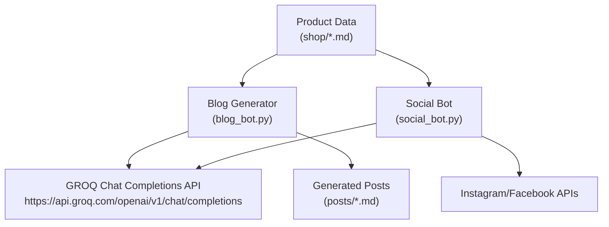
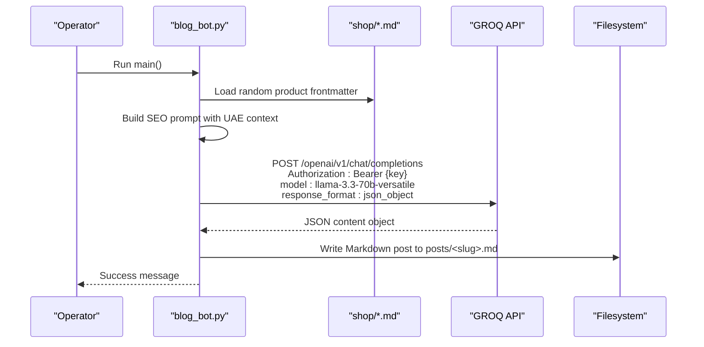
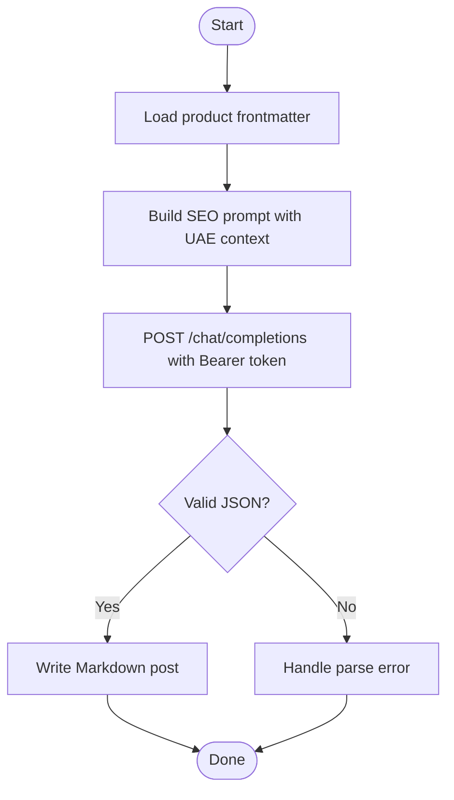
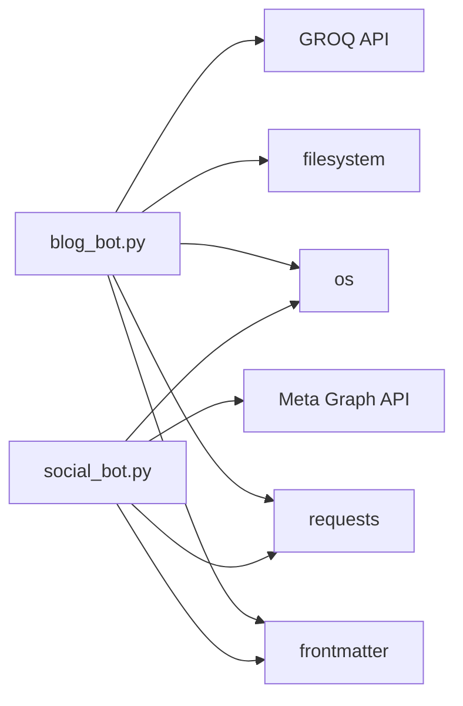

# GROQ AI API Integration

<cite>
**Referenced Files in This Document**
- [blog_bot.py](file://blog_bot.py)
- [social_bot.py](file://social_bot.py)
- [SOCIAL_BOT_SETUP.md](file://SOCIAL_BOT_SETUP.md)
- [shop/B0CLHGCYRN.md](file://shop/B0CLHGCYRN.md)
- [scripts/test_blog_bot_run.py](file://scripts/test_blog_bot_run.py)
</cite>

## Table of Contents
1. [Introduction](#introduction)
2. [Project Structure](#project-structure)
3. [Core Components](#core-components)
4. [Architecture Overview](#architecture-overview)
5. [Detailed Component Analysis](#detailed-component-analysis)
6. [Dependency Analysis](#dependency-analysis)
7. [Performance Considerations](#performance-considerations)
8. [Troubleshooting Guide](#troubleshooting-guide)
9. [Conclusion](#conclusion)

## Introduction
This document provides comprehensive API documentation for the GROQ AI integration used to generate SEO-optimized blog content for Nillian Store, with a focus on UAE-specific context. It covers authentication using Bearer tokens, the chat completions endpoint structure, request and response schemas, prompt engineering approach, model configuration (llama-3.3-70b-versatile), error handling, and operational considerations such as rate limiting and debugging.

## Project Structure
The repository includes two Python scripts that integrate with the GROQ API:
- Blog generation script that creates structured Markdown posts from product data.
- Social media automation script that generates captions and hashtags for Instagram/Facebook.

**Diagram sources**
- [blog_bot.py:48-97](file://blog_bot.py#L48-L97)
- [social_bot.py:120-136](file://social_bot.py#L120-L136)

**Section sources**
- [blog_bot.py:1-253](file://blog_bot.py#L1-253)
- [social_bot.py:1-315](file://social_bot.py#L1-315)

## Core Components
- Authentication: Bearer token via environment variable GROQ_API_KEY.
- Endpoint: https://api.groq.com/openai/v1/chat/completions.
- Model: llama-3.3-70b-versatile.
- Response format: JSON object enforced by response_format.type=json_object.
- Prompting: Structured prompts tailored for SEO-optimized blog posts with UAE context.

Key responsibilities:
- blog_bot.py: Reads product frontmatter, builds a detailed prompt, calls GROQ, parses JSON, and writes a Markdown post file.
- social_bot.py: Builds a shorter prompt for social captions, calls GROQ, and publishes to Meta platforms.

**Section sources**
- [blog_bot.py:15-16](file://blog_bot.py#L15-L16)
- [blog_bot.py:84-97](file://blog_bot.py#L84-L97)
- [social_bot.py:16-21](file://social_bot.py#L16-L21)
- [social_bot.py:120-136](file://social_bot.py#L120-L136)

## Architecture Overview
The end-to-end flow for blog generation:

**Diagram sources**
- [blog_bot.py:48-97](file://blog_bot.py#L48-L97)
- [blog_bot.py:99-208](file://blog_bot.py#L99-L208)
- [blog_bot.py:210-253](file://blog_bot.py#L210-L253)

## Detailed Component Analysis

### Authentication Setup
- The API key is read from the environment variable GROQ_API_KEY.
- Requests include Authorization header with Bearer token.
- For GitHub Actions, secrets are configured per setup guide.

Configuration references:
- Environment variable usage and validation.
- Bearer token injection into headers.
- Secrets management guidance.

**Section sources**
- [blog_bot.py:15-16](file://blog_bot.py#L15-L16)
- [blog_bot.py:84-87](file://blog_bot.py#L84-L87)
- [social_bot.py:16-21](file://social_bot.py#L16-L21)
- [social_bot.py:121-122](file://social_bot.py#L121-L122)
- [SOCIAL_BOT_SETUP.md:10-29](file://SOCIAL_BOT_SETUP.md#L10-L29)

### Chat Completions Endpoint Structure
- Base URL: https://api.groq.com/openai/v1/chat/completions
- Method: POST
- Headers:
  - Authorization: Bearer <API_KEY>
  - Content-Type: application/json
- Request body fields:
  - model: string (llama-3.3-70b-versatile)
  - messages: array of message objects with role and content
  - response_format: object with type set to json_object

Request schema:
- model: string
- messages: array
  - role: string ("user")
  - content: string (prompt)
- response_format: object
  - type: string ("json_object")

Response schema:
- choices[0].message.content: string containing JSON text that must be parsed into an object.

Error handling:
- HTTP errors raised and logged.
- Non-JSON responses handled by try/except around JSON parsing.

**Section sources**
- [blog_bot.py:84-97](file://blog_bot.py#L84-L97)
- [social_bot.py:120-136](file://social_bot.py#L120-L136)

### Prompt Engineering Approach (SEO-Optimized UAE Blog Posts)
The blog generator constructs a detailed prompt that instructs the model to produce:
- A catchy title including emojis and UAE context.
- A meta description.
- Tags list (10–15 relevant tags).
- Structured sections: intro, product section, why it works (bullets), perfect for, conclusion.
- Output strictly as JSON with specified keys.

Prompt inputs:
- Product title, description, price, Amazon link, images.

Output expectations:
- JSON object with keys: title, description, tags, intro, product_section, why_it_works, perfect_for, conclusion.

UAE-specific elements:
- Emphasis on Dubai, Abu Dhabi, Sharjah, and 2025 trends.
- Localized lifestyle and decor context.

**Section sources**
- [blog_bot.py:48-82](file://blog_bot.py#L48-L82)

### Request and Response Schemas

#### Request Schema
- model: "llama-3.3-70b-versatile"
- messages: [{"role": "user", "content": "<prompt>"}]
- response_format: {"type": "json_object"}

#### Response Schema
- choices[0].message.content: stringified JSON object matching expected keys.

Parsing:
- The code parses the content field into a Python dict and uses it to build Markdown.

**Section sources**
- [blog_bot.py:89-97](file://blog_bot.py#L89-L97)

### Model Configuration
- Model name: llama-3.3-70b-versatile
- Used consistently in both blog and social bots.

**Section sources**
- [blog_bot.py:90](file://blog_bot.py#L90)
- [social_bot.py:124](file://social_bot.py#L124)

### Rate Limiting Considerations
- No explicit retry/backoff or rate-limit handling is implemented in the scripts.
- Operational best practices:
  - Add exponential backoff and retries for transient errors.
  - Implement request throttling if generating multiple posts in batch.
  - Monitor API quotas and adjust scheduling accordingly.

[No sources needed since this section provides general guidance]

### Error Handling and Debugging
- HTTP errors: raise_for_status() is used; exceptions are caught and printed.
- JSON parse errors: wrapped in try/except blocks.
- Missing environment variables: validated at startup with clear messages.
- Logging:
  - Blog history saved to blog_log.json to avoid reprocessing products.
  - Social posting history saved to social_log.json.

Debugging tips:
- Verify GROQ_API_KEY presence and correctness.
- Inspect raw HTTP responses when errors occur.
- Validate that the model returns valid JSON matching the expected schema.

**Section sources**
- [blog_bot.py:95-97](file://blog_bot.py#L95-L97)
- [blog_bot.py:210-213](file://blog_bot.py#L210-L213)
- [social_bot.py:128-136](file://social_bot.py#L128-L136)
- [social_bot.py:248-263](file://social_bot.py#L248-L263)

### Code Examples and Usage Paths
- Configure API key: Set GROQ_API_KEY in your environment or GitHub Secrets.
- Make authenticated requests: Use Authorization: Bearer token and JSON payload with model, messages, and response_format.
- Handle JSON responses: Parse choices[0].message.content and validate required keys.
- Manage errors: Catch HTTP and JSON parsing exceptions; log details.

Example paths:
- Authentication and request construction: [blog_bot.py:84-97](file://blog_bot.py#L84-L97)
- Social bot request pattern: [social_bot.py:120-136](file://social_bot.py#L120-L136)
- Test helper for file creation: [scripts/test_blog_bot_run.py:1-10](file://scripts/test_blog_bot_run.py#L1-L10)

**Section sources**
- [blog_bot.py:84-97](file://blog_bot.py#L84-L97)
- [social_bot.py:120-136](file://social_bot.py#L120-L136)
- [scripts/test_blog_bot_run.py:1-10](file://scripts/test_blog_bot_run.py#L1-L10)

### Data Flow and File Generation
- Input: Product frontmatter from shop/*.md files.
- Processing: Prompt assembly, GROQ call, JSON parsing.
- Output: Markdown post written to posts/<slug>.md with frontmatter and structured content.

**Diagram sources**
- [blog_bot.py:48-97](file://blog_bot.py#L48-L97)
- [blog_bot.py:99-208](file://blog_bot.py#L99-L208)

**Section sources**
- [blog_bot.py:48-208](file://blog_bot.py#L48-L208)

### Sample Product Data Reference
A sample product file demonstrates the frontmatter structure consumed by the bots:
- Fields include title, description, price, cover/images, amazonLink, etc.

**Section sources**
- [shop/B0CLHGCYRN.md:1-55](file://shop/B0CLHGCYRN.md#L1-L55)

## Dependency Analysis
The integration depends on:
- Python standard libraries: os, json, requests, pathlib, datetime, re.
- Third-party library: frontmatter for reading product frontmatter.
- External services:
  - GROQ API for content generation.
  - Meta Graph API for social publishing (in social_bot.py).

**Diagram sources**
- [blog_bot.py:1-9](file://blog_bot.py#L1-L9)
- [social_bot.py:1-10](file://social_bot.py#L1-L10)

**Section sources**
- [blog_bot.py:1-9](file://blog_bot.py#L1-L9)
- [social_bot.py:1-10](file://social_bot.py#L1-L10)

## Performance Considerations
- Avoid redundant processing by tracking posted/generated IDs in logs.
- Batch operations should implement throttling and backoff.
- Prefer minimal payloads and concise prompts to reduce latency.
- Cache frequently reused prompt templates locally to speed up iteration.

[No sources needed since this section provides general guidance]

## Troubleshooting Guide
Common issues and resolutions:
- Missing GROQ_API_KEY: Ensure the environment variable is set or configured in GitHub Secrets.
- Invalid Bearer token: Verify token validity and permissions.
- Non-JSON response: Check model output and ensure response_format is set to json_object.
- HTTP errors: Inspect status codes and response bodies; add retries for transient failures.
- Parsing errors: Validate JSON keys and types before writing files.
- Rate limits: Implement backoff and monitor quotas.

Operational checks:
- Confirm product files exist and contain required fields.
- Validate generated JSON matches expected schema.
- Review logs (blog_log.json, social_log.json) for repeated attempts and exclusions.

**Section sources**
- [blog_bot.py:210-213](file://blog_bot.py#L210-L213)
- [blog_bot.py:95-97](file://blog_bot.py#L95-L97)
- [social_bot.py:128-136](file://social_bot.py#L128-L136)
- [social_bot.py:248-263](file://social_bot.py#L248-L263)
- [SOCIAL_BOT_SETUP.md:75-106](file://SOCIAL_BOT_SETUP.md#L75-L106)

## Conclusion
The GROQ AI integration leverages a straightforward Bearer-token-authenticated chat completions endpoint with a strict JSON response format. The blog generator’s prompt engineering focuses on SEO optimization and UAE localization, producing structured content ready for Eleventy-based static site generation. Robust error handling and logging support reliable operation, while recommended improvements include rate limiting, retries, and enhanced validation to further improve resilience and content quality.