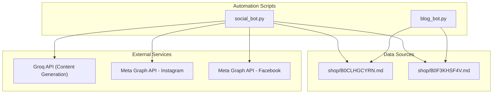
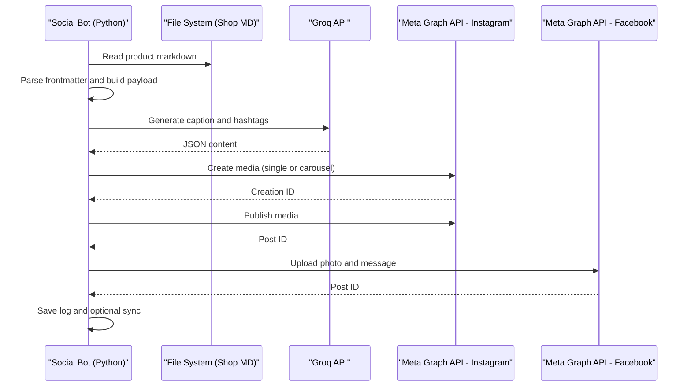
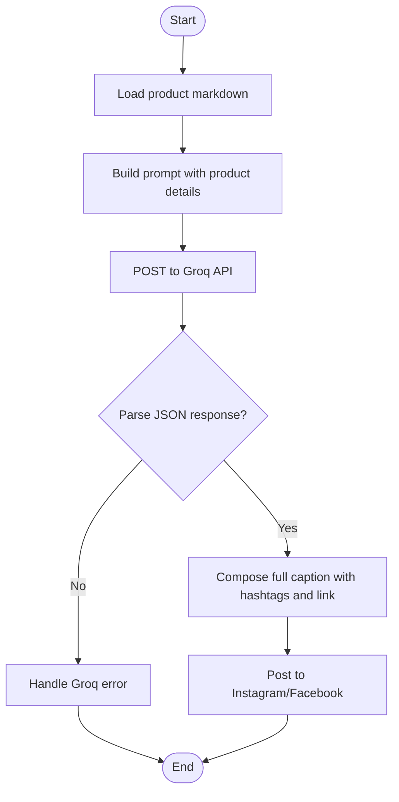
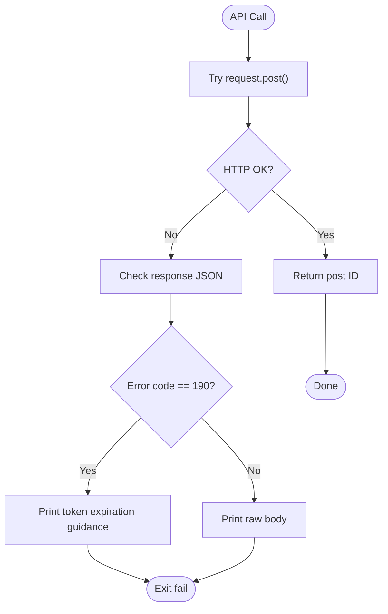
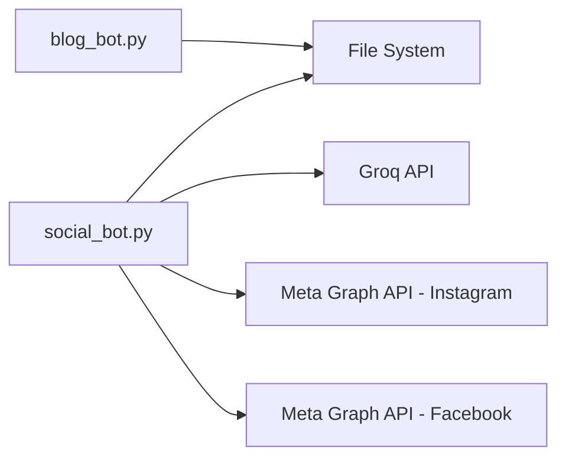

# Meta Graph API Integration

<cite>
**Referenced Files in This Document**
- [social_bot.py](file://social_bot.py)
- [SOCIAL_BOT_SETUP.md](file://SOCIAL_BOT_SETUP.md)
- [blog_bot.py](file://blog_bot.py)
- [B0CLHGCYRN.md](file://shop/B0CLHGCYRN.md)
- [B0F3KHSF4V.md](file://shop/B0F3KHSF4V.md)
</cite>

## Table of Contents
1. [Introduction](#introduction)
2. [Project Structure](#project-structure)
3. [Core Components](#core-components)
4. [Architecture Overview](#architecture-overview)
5. [Detailed Component Analysis](#detailed-component-analysis)
6. [Dependency Analysis](#dependency-analysis)
7. [Performance Considerations](#performance-considerations)
8. [Troubleshooting Guide](#troubleshooting-guide)
9. [Conclusion](#conclusion)
10. [Appendices](#appendices)

## Introduction
This document provides detailed API documentation for integrating the Meta Graph API to automate social media posting on Instagram and Facebook. It covers authentication setup, access token management, required permissions, post creation endpoints, image upload processes (including carousel support), error handling strategies, retry logic, rate limiting considerations, platform-specific differences, debugging common authentication issues, and monitoring post delivery status. The implementation is driven by a Python automation script that reads product data from markdown files, generates content using an external AI service, and posts to both platforms via Meta Graph API.

## Project Structure
The repository includes:
- A social automation script that orchestrates content generation and posting to Instagram and Facebook.
- A setup guide detailing required secrets and permissions.
- A blog automation script for generating SEO-optimized blog posts (not part of Meta Graph integration).
- Sample product markdown files with frontmatter metadata used as input for content generation.

**Diagram sources**
- [social_bot.py:120-137](file://social_bot.py#L120-L137)
- [social_bot.py:138-206](file://social_bot.py#L138-L206)
- [social_bot.py:208-246](file://social_bot.py#L208-L246)
- [B0CLHGCYRN.md:1-25](file://shop/B0CLHGCYRN.md#L1-L25)
- [B0F3KHSF4V.md:1-25](file://shop/B0F3KHSF4V.md#L1-L25)

**Section sources**
- [social_bot.py:1-315](file://social_bot.py#L1-L315)
- [SOCIAL_BOT_SETUP.md:1-106](file://SOCIAL_BOT_SETUP.md#L1-L106)
- [B0CLHGCYRN.md:1-55](file://shop/B0CLHGCYRN.md#L1-L55)
- [B0F3KHSF4V.md:1-55](file://shop/B0F3KHSF4V.md#L1-L55)

## Core Components
- Social Automation Script: Loads environment variables for credentials, selects a random product, generates caption and hashtags via Groq API, then posts to Instagram and Facebook using Meta Graph API.
- Content Generation Service: Uses Groq API to produce engaging captions and hashtags tailored for UAE audience.
- Platform Posting Modules: Separate functions for Instagram and Facebook posting, including single-image and carousel workflows for Instagram.
- Logging and Retry Mechanism: Maintains a posted history file to avoid repetition and retries up to three times on failure.

Key responsibilities:
- Authentication configuration via environment variables.
- Product parsing from markdown frontmatter.
- Caption and hashtag generation through Groq API.
- Image URL normalization and upload to Meta Graph API.
- Publishing workflow for Instagram (creation + publish).
- Error detection and guidance for expired tokens.

**Section sources**
- [social_bot.py:16-21](file://social_bot.py#L16-L21)
- [social_bot.py:79-118](file://social_bot.py#L79-L118)
- [social_bot.py:120-137](file://social_bot.py#L120-L137)
- [social_bot.py:138-206](file://social_bot.py#L138-L206)
- [social_bot.py:208-246](file://social_bot.py#L208-L246)
- [social_bot.py:248-315](file://social_bot.py#L248-L315)

## Architecture Overview
The system integrates three main layers:
- Data Layer: Product markdown files with structured frontmatter.
- Processing Layer: Python script orchestrating content generation and API calls.
- External APIs: Groq for content generation; Meta Graph API for Instagram and Facebook posting.

**Diagram sources**
- [social_bot.py:79-118](file://social_bot.py#L79-L118)
- [social_bot.py:120-137](file://social_bot.py#L120-L137)
- [social_bot.py:138-206](file://social_bot.py#L138-L206)
- [social_bot.py:208-246](file://social_bot.py#L208-L246)
- [social_bot.py:248-315](file://social_bot.py#L248-L315)

## Detailed Component Analysis

### Authentication and Permissions
- Required environment variables:
  - GROQ_API_KEY: For content generation.
  - META_ACCESS_TOKEN: Long-lived page access token for Facebook/Instagram.
  - FB_PAGE_ID: Facebook Page ID.
  - IG_USER_ID: Instagram Business Account ID.
- Required permissions for META_ACCESS_TOKEN:
  - pages_manage_metadata
  - pages_read_engagement
  - instagram_basic
  - instagram_content_publishing

Token management:
- Use long-lived tokens generated via Facebook Developer Console.
- If token expires, the API returns error code 190; the script detects this and prints remediation steps.

**Section sources**
- [social_bot.py:16-21](file://social_bot.py#L16-L21)
- [SOCIAL_BOT_SETUP.md:30-48](file://SOCIAL_BOT_SETUP.md#L30-L48)
- [social_bot.py:186-206](file://social_bot.py#L186-L206)
- [social_bot.py:226-246](file://social_bot.py#L226-L246)

### Post Creation Endpoints and Media Uploads
- Instagram:
  - Create media endpoint: POST https://graph.facebook.com/v18.0/{IG_USER_ID}/media
    - Single image: parameters include image_url, caption, access_token.
    - Carousel: multiple child items created with is_carousel_item=true, then a parent CAROUSEL media with children IDs.
  - Publish media endpoint: POST https://graph.facebook.com/v18.0/{IG_USER_ID}/media_publish with creation_id.
- Facebook:
  - Photo upload endpoint: POST https://graph.facebook.com/v18.0/{FB_PAGE_ID}/photos
    - Parameters include url (image URL), message (caption), access_token.

Media types:
- Single image posts supported for both platforms.
- Carousel posts supported for Instagram only.

Scheduling:
- No built-in scheduling in the current script; posts are published immediately after creation.

**Section sources**
- [social_bot.py:138-206](file://social_bot.py#L138-L206)
- [social_bot.py:208-246](file://social_bot.py#L208-L246)

### Data Model and Input Format
Product markdown files use frontmatter fields:
- title, description, price, cover, images[], amazonLink/link, tags, layout, permalink, date.
- The script extracts image URLs from cover and images arrays, deduplicates them, and normalizes paths to absolute URLs.

Example references:
- [shop/B0CLHGCYRN.md:1-25](file://shop/B0CLHGCYRN.md#L1-L25)
- [shop/B0F3KHSF4V.md:1-25](file://shop/B0F3KHSF4V.md#L1-L25)

**Section sources**
- [social_bot.py:101-118](file://social_bot.py#L101-L118)
- [B0CLHGCYRN.md:1-25](file://shop/B0CLHGCYRN.md#L1-L25)
- [B0F3KHSF4V.md:1-25](file://shop/B0F3KHSF4V.md#L1-L25)

### Content Generation Flow
- The script constructs a prompt with product details and requests Groq API to return JSON containing caption and hashtags.
- The final caption combines caption, hashtags, and shop link.

**Diagram sources**
- [social_bot.py:120-137](file://social_bot.py#L120-L137)
- [social_bot.py:248-315](file://social_bot.py#L248-L315)

**Section sources**
- [social_bot.py:120-137](file://social_bot.py#L120-L137)
- [social_bot.py:284-290](file://social_bot.py#L284-L290)

### Error Handling Strategies
- Network errors: Caught and logged with HTTP status codes when available.
- Expired token detection: Checks for error code 190 and prints instructions to obtain a new long-lived token.
- Unexpected exceptions: Traces stack traces for debugging.
- Retry logic: Main loop attempts up to three times with different products before failing.

**Diagram sources**
- [social_bot.py:186-206](file://social_bot.py#L186-L206)
- [social_bot.py:226-246](file://social_bot.py#L226-L246)
- [social_bot.py:271-315](file://social_bot.py#L271-L315)

**Section sources**
- [social_bot.py:186-206](file://social_bot.py#L186-L206)
- [social_bot.py:226-246](file://social_bot.py#L226-L246)
- [social_bot.py:271-315](file://social_bot.py#L271-L315)

### Rate Limiting Considerations
- Instagram carousel creation involves multiple sequential uploads followed by a publish call.
- The script introduces a delay between creation and publishing to mitigate transient failures.
- No explicit exponential backoff or rate limit headers parsing is implemented; consider adding jittered delays and respecting Meta’s rate limits if encountering throttling.

[No sources needed since this section provides general guidance]

### Platform-Specific Differences
- Instagram:
  - Requires two-step process: create media (single or carousel), then publish media.
  - Supports carousel with up to ten child images.
- Facebook:
  - Single-photo upload with message in one step.
  - Does not support carousel via the same endpoint in this implementation.

**Section sources**
- [social_bot.py:138-206](file://social_bot.py#L138-L206)
- [social_bot.py:208-246](file://social_bot.py#L208-L246)

### Monitoring Post Delivery Status
- The script logs successful post IDs returned by the APIs.
- There is no polling mechanism to monitor post visibility or engagement metrics.
- To monitor delivery, extend the script to query post IDs via Graph API endpoints for post status and insights.

[No sources needed since this section provides general guidance]

## Dependency Analysis
- Internal dependencies:
  - social_bot.py depends on file system operations for product markdown parsing and logging.
  - blog_bot.py is independent and focused on blog content generation.
- External dependencies:
  - Groq API for content generation.
  - Meta Graph API v18.0 for Instagram and Facebook posting.

**Diagram sources**
- [social_bot.py:120-137](file://social_bot.py#L120-L137)
- [social_bot.py:138-206](file://social_bot.py#L138-L206)
- [social_bot.py:208-246](file://social_bot.py#L208-L246)
- [blog_bot.py:48-97](file://blog_bot.py#L48-L97)

**Section sources**
- [social_bot.py:1-315](file://social_bot.py#L1-L315)
- [blog_bot.py:1-253](file://blog_bot.py#L1-L253)

## Performance Considerations
- Minimize network calls by batching where possible (e.g., ensure image URLs are valid and accessible).
- Avoid excessive retries; cap at three attempts as implemented.
- Consider caching recent product selections to reduce repeated processing.
- For large carousels, stagger uploads and add small delays to avoid rate limiting.

[No sources needed since this section provides general guidance]

## Troubleshooting Guide
Common issues and resolutions:
- Missing required secrets: Ensure all four secrets are set correctly in GitHub repository settings.
- Failed to post to social media: Verify tokens are valid and have required permissions; check API responses in workflow logs.
- No posts happening: Confirm cron schedule and manual trigger availability; verify product markdown files exist and contain images.
- Token expired (error code 190): Obtain a new long-lived token from Facebook Developer Console and update the secret.

**Section sources**
- [SOCIAL_BOT_SETUP.md:75-106](file://SOCIAL_BOT_SETUP.md#L75-L106)
- [social_bot.py:248-267](file://social_bot.py#L248-L267)
- [social_bot.py:186-206](file://social_bot.py#L186-L206)
- [social_bot.py:226-246](file://social_bot.py#L226-L246)

## Conclusion
The Meta Graph API integration automates social media posting across Instagram and Facebook by combining product data, AI-generated content, and robust error handling. While it supports single-image and Instagram carousel posts, scheduling and advanced monitoring features can be extended. Proper token management and permission configuration are critical for reliable operation.

[No sources needed since this section summarizes without analyzing specific files]

## Appendices

### API Reference Summary
- Instagram:
  - Create media: POST /v18.0/{IG_USER_ID}/media
    - Single image: image_url, caption, access_token
    - Carousel: multiple child items with is_carousel_item=true, then parent with media_type=CAROUSEL and children IDs
  - Publish media: POST /v18.0/{IG_USER_ID}/media_publish with creation_id
- Facebook:
  - Photo upload: POST /v18.0/{FB_PAGE_ID}/photos with url, message, access_token

**Section sources**
- [social_bot.py:138-206](file://social_bot.py#L138-L206)
- [social_bot.py:208-246](file://social_bot.py#L208-L246)

### Example Workflows (Code Snippet Paths)
- Authentication setup and validation:
  - [social_bot.py:16-21](file://social_bot.py#L16-L21)
  - [social_bot.py:248-267](file://social_bot.py#L248-L267)
- Creating posts with text and media:
  - Instagram single image: [social_bot.py:148-157](file://social_bot.py#L148-L157)
  - Instagram carousel: [social_bot.py:159-179](file://social_bot.py#L159-L179)
  - Facebook photo: [social_bot.py:218-225](file://social_bot.py#L218-L225)
- Managing post scheduling:
  - Not implemented; posts are immediate.
- Error handling and retry logic:
  - Exponential backoff not implemented; simple retry loop: [social_bot.py:271-315](file://social_bot.py#L271-L315)
  - Expired token detection: [social_bot.py:186-206](file://social_bot.py#L186-L206), [social_bot.py:226-246](file://social_bot.py#L226-L246)