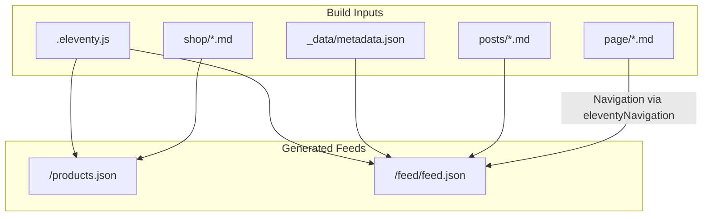
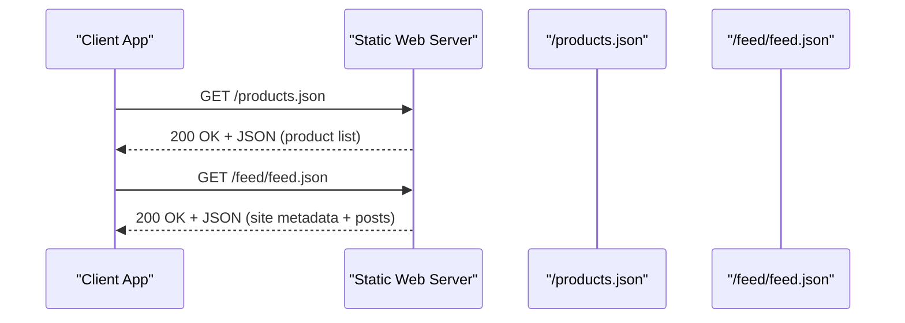
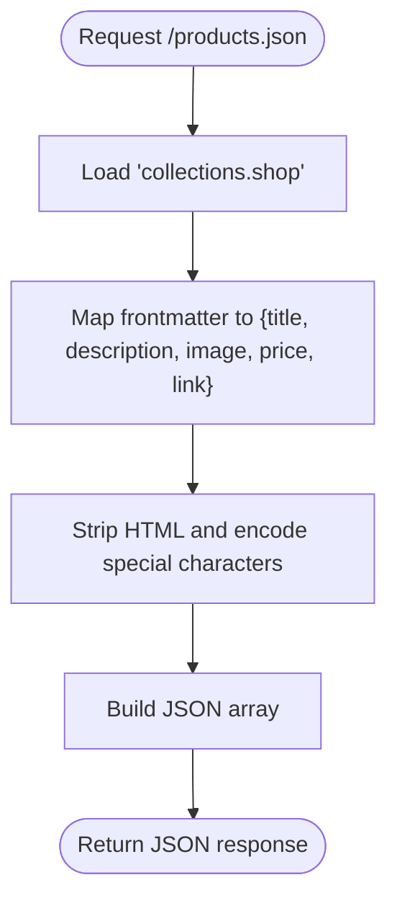
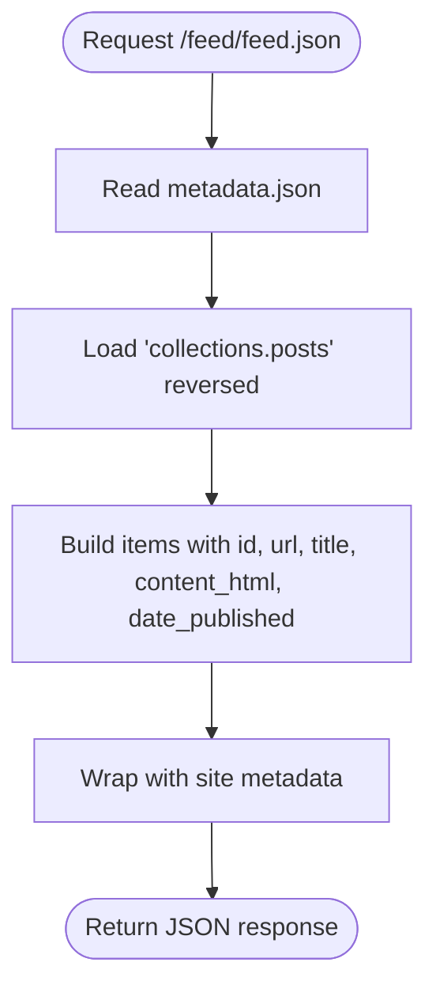
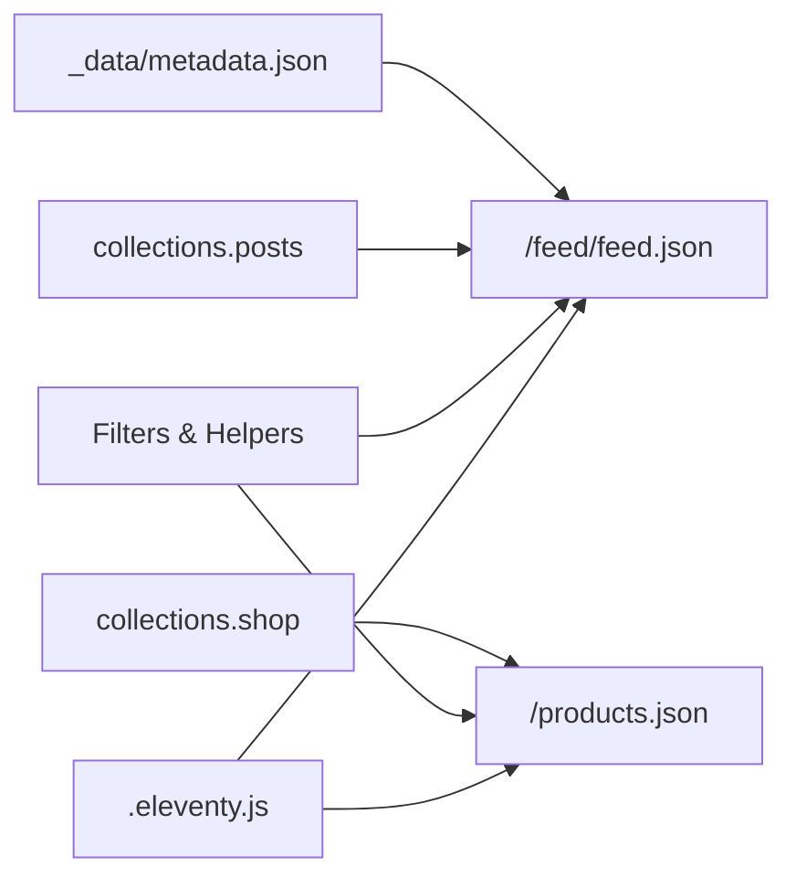

# Internal Endpoints and Data Access

<cite>
**Referenced Files in This Document**
- [products.json.njk](file://feed/products.json.njk)
- [json.njk](file://feed/json.njk)
- [metadata.json](file://_data/metadata.json)
- [.eleventy.js](file://.eleventy.js)
- [shop.json](file://shop/shop.json)
- [posts.json](file://posts/posts.json)
- [B0CLHGCYRN.md](file://shop/B0CLHGCYRN.md)
- [best-gift-ideas-in-uae-2025.md](file://posts/best-gift-ideas-in-uae-2025.md)
- [about.md](file://page/about.md)
</cite>

## Table of Contents
1. [Introduction](#introduction)
2. [Project Structure](#project-structure)
3. [Core Components](#core-components)
4. [Architecture Overview](#architecture-overview)
5. [Detailed Component Analysis](#detailed-component-analysis)
6. [Dependency Analysis](#dependency-analysis)
7. [Performance Considerations](#performance-considerations)
8. [Troubleshooting Guide](#troubleshooting-guide)
9. [Conclusion](#conclusion)
10. [Appendices](#appendices)

## Introduction
This document explains the internal API endpoints and data access patterns used by the Nillianstore2 platform, which is built with Eleventy (11ty). It focuses on:
- JSON feed endpoints for product catalog and site metadata/content listing
- Data schemas for products, posts, pages, and navigation items
- Eleventy collection queries and template data access patterns
- Client consumption examples, pagination, filtering, and client-side search
- Caching strategies, performance considerations, and data refresh mechanisms

The platform generates static JSON feeds at build time from content collections and global data. Consumers can fetch these feeds to render UIs or power integrations without a runtime backend.

## Project Structure
Key directories and files relevant to internal APIs and data access:
- feed/: Contains Nunjucks templates that generate JSON endpoints
- _data/: Global site data including metadata
- shop/: Product content entries and a tag index
- posts/: Blog post content entries and a tag index
- page/: Static pages with optional navigation metadata
- .eleventy.js: Build configuration, filters, collections, and global data

**Diagram sources**
- [.eleventy.js:1-160](file://.eleventy.js#L1-L160)
- [metadata.json:1-27](file://_data/metadata.json#L1-L27)
- [products.json.njk:1-17](file://feed/products.json.njk#L1-L17)
- [json.njk:1-33](file://feed/json.njk#L1-L33)

**Section sources**
- [.eleventy.js:1-160](file://.eleventy.js#L1-L160)
- [metadata.json:1-27](file://_data/metadata.json#L1-L27)
- [products.json.njk:1-17](file://feed/products.json.njk#L1-L17)
- [json.njk:1-33](file://feed/json.njk#L1-L33)

## Core Components
- Products JSON endpoint (/products.json): Aggregates all shop items into a single array of product objects.
- Site Metadata and Content Listing JSON endpoint (/feed/feed.json): Provides site-level metadata and an ordered list of posts.
- Collections and tags: Shop and posts are organized via tags and Eleventy collections.
- Navigation: Pages can opt-in to navigation using frontmatter keys consumed by the navigation plugin.

Data sources:
- Products: Markdown files under shop/ with frontmatter fields such as title, description, price, cover, images, category, tags, amazonLink, permalink, date, etc.
- Posts: Markdown files under posts/ with frontmatter fields such as title, description, cover, date, tags, layout, permalink.
- Pages: Markdown files under page/ with frontmatter fields such as layout, title, description, cover, permalink, and optional eleventyNavigation.

Global data:
- metadata.json provides site-wide settings including URLs and feed paths.

**Section sources**
- [products.json.njk:1-17](file://feed/products.json.njk#L1-L17)
- [json.njk:1-33](file://feed/json.njk#L1-L33)
- [metadata.json:1-27](file://_data/metadata.json#L1-L27)
- [shop.json:1-4](file://shop/shop.json#L1-L4)
- [posts.json:1-6](file://posts/posts.json#L1-L6)
- [B0CLHGCYRN.md:1-55](file://shop/B0CLHGCYRN.md#L1-L55)
- [best-gift-ideas-in-uae-2025.md:1-259](file://posts/best-gift-ideas-in-uae-2025.md#L1-L259)
- [about.md:1-109](file://page/about.md#L1-L109)

## Architecture Overview
At build time, Eleventy reads content and data, renders Nunjucks templates in feed/, and writes static JSON files to the output directory. Consumers request these files directly from the web server.

**Diagram sources**
- [products.json.njk:1-17](file://feed/products.json.njk#L1-L17)
- [json.njk:1-33](file://feed/json.njk#L1-L33)

## Detailed Component Analysis

### Products Catalog API (/products.json)
- Endpoint: /products.json
- Source template: feed/products.json.njk
- Data source: Eleventy collection named shop
- Output schema: An object with a products array; each item includes:
  - title: string
  - description: string (HTML stripped and XML-encoded)
  - image: absolute URL string
  - price: string
  - link: absolute URL string

Notes:
- The template uses collections.shop and maps frontmatter fields to JSON properties.
- Images and links are made absolute using site.url and url filter.

**Diagram sources**
- [products.json.njk:1-17](file://feed/products.json.njk#L1-L17)
- [.eleventy.js:135-143](file://.eleventy.js#L135-L143)

**Section sources**
- [products.json.njk:1-17](file://feed/products.json.njk#L1-L17)
- [.eleventy.js:135-143](file://.eleventy.js#L135-L143)

#### Product Data Schema
- Fields commonly present in shop items:
  - title: string
  - description: string
  - price: string
  - cover: string (relative path)
  - images: array of strings (relative paths)
  - ecwidId: string
  - category: string
  - tags: array of strings
  - amazonLink: string
  - permalink: string
  - date: ISO date string
  - bullet_points: array of strings
  - cover_alt: string
  - image_alts: array of strings

Example reference:
- [B0CLHGCYRN.md:1-55](file://shop/B0CLHGCYRN.md#L1-L55)

**Section sources**
- [B0CLHGCYRN.md:1-55](file://shop/B0CLHGCYRN.md#L1-L55)

### Site Metadata and Content Listing API (/feed/feed.json)
- Endpoint: /feed/feed.json
- Source template: feed/json.njk
- Data sources:
  - Global data: _data/metadata.json
  - Collection: collections.posts (reversed order)
- Output schema:
  - version: string
  - title: string
  - language: string
  - home_page_url: string
  - feed_url: string
  - description: string
  - author: object with name, url
  - items: array of post objects with:
    - id: absolute URL string
    - url: absolute URL string
    - title: string
    - content_html: string (templateContent serialized)
    - date_published: formatted date string

Notes:
- Uses metadata.json for site-level values and feed URLs.
- Post items use absoluteUrl helper and rssDate filter for formatting.

**Diagram sources**
- [json.njk:1-33](file://feed/json.njk#L1-L33)
- [metadata.json:1-27](file://_data/metadata.json#L1-L27)

**Section sources**
- [json.njk:1-33](file://feed/json.njk#L1-L33)
- [metadata.json:1-27](file://_data/metadata.json#L1-L27)

#### Post Data Schema
- Fields commonly present in posts:
  - title: string
  - description: string
  - cover: string (relative path)
  - date: ISO date string
  - tags: array of strings
  - layout: string
  - permalink: string

Example reference:
- [best-gift-ideas-in-uae-2025.md:1-259](file://posts/best-gift-ideas-in-uae-2025.md#L1-L259)

**Section sources**
- [best-gift-ideas-in-uae-2025.md:1-259](file://posts/best-gift-ideas-in-uae-2025.md#L1-L259)

### Page and Navigation Items
- Pages are Markdown files under page/.
- Optional navigation inclusion via eleventyNavigation frontmatter key (key, order).
- Example reference:
  - [about.md:1-109](file://page/about.md#L1-L109)

Note: The navigation plugin is enabled in the Eleventy config, allowing pages to participate in navigation lists.

**Section sources**
- [about.md:1-109](file://page/about.md#L1-L109)
- [.eleventy.js:1-160](file://.eleventy.js#L1-L160)

### Eleventy Collections and Tag Indexes
- Collections:
  - shop: All shop items
  - posts: All blog posts
- Tag indexes:
  - shop/shop.json defines tag "shops"
  - posts/posts.json defines tag "posts"
- Custom tagList collection aggregates unique tags across all items, excluding reserved tags.

These structures enable filtering and listing views within templates and can be extended to support client-side filtering.

**Section sources**
- [shop.json:1-4](file://shop/shop.json#L1-L4)
- [posts.json:1-6](file://posts/posts.json#L1-L6)
- [.eleventy.js:72-95](file://.eleventy.js#L72-L95)

## Dependency Analysis
- Feed endpoints depend on:
  - Eleventy collections (shop, posts)
  - Global data (metadata.json)
  - Filters (xmlEncode, url, absoluteUrl, rssDate)
  - Plugins (RSS, navigation)
- Build-time dependencies:
  - Luxon for date formatting
  - markdown-it with anchor plugin for content processing

**Diagram sources**
- [products.json.njk:1-17](file://feed/products.json.njk#L1-L17)
- [json.njk:1-33](file://feed/json.njk#L1-L33)
- [metadata.json:1-27](file://_data/metadata.json#L1-L27)
- [.eleventy.js:1-160](file://.eleventy.js#L1-L160)

**Section sources**
- [.eleventy.js:1-160](file://.eleventy.js#L1-L160)
- [products.json.njk:1-17](file://feed/products.json.njk#L1-L17)
- [json.njk:1-33](file://feed/json.njk#L1-L33)
- [metadata.json:1-27](file://_data/metadata.json#L1-L27)

## Performance Considerations
- Static generation: Both endpoints are generated at build time, resulting in fast, cacheable responses.
- Payload size:
  - /products.json contains all products; consider client-side pagination if the catalog grows large.
  - /feed/feed.json includes full post content_html; clients may prefer fetching individual post pages for detailed content.
- Image optimization: Ensure images are optimized and served via CDN for faster load times.
- Browser caching: Configure long-lived cache headers for JSON assets where appropriate.
- Minification: Consider minifying JSON outputs during deployment if needed.

[No sources needed since this section provides general guidance]

## Troubleshooting Guide
Common issues and checks:
- Missing fields:
  - Verify product frontmatter includes required fields (title, description, price, cover).
  - Verify post frontmatter includes title and date.
- Encoding problems:
  - Description fields are HTML-stripped and XML-encoded; ensure no malformed input.
- Absolute URLs:
  - Confirm site.url is set correctly in Eleventy config and metadata.json.
- Date formatting:
  - Ensure dates are valid ISO strings; check rssDate filter behavior.
- Collections not found:
  - Confirm content files have correct tags and layouts so they appear in collections.shop and collections.posts.

**Section sources**
- [products.json.njk:1-17](file://feed/products.json.njk#L1-L17)
- [json.njk:1-33](file://feed/json.njk#L1-L33)
- [.eleventy.js:135-143](file://.eleventy.js#L135-L143)
- [metadata.json:1-27](file://_data/metadata.json#L1-L27)

## Conclusion
Nillianstore2 exposes two primary JSON endpoints generated at build time:
- /products.json for the product catalog
- /feed/feed.json for site metadata and a list of posts

These endpoints rely on Eleventy collections, global metadata, and Nunjucks templates. Clients can consume them to implement listings, search, and filtering. For scalability, consider client-side pagination and selective content retrieval.

[No sources needed since this section summarizes without analyzing specific files]

## Appendices

### Client Consumption Examples (JavaScript)
- Fetch products:
  - Request: GET /products.json
  - Response: JSON with a products array
  - Use cases: Render product grids, implement client-side search and filters
- Fetch site metadata and posts:
  - Request: GET /feed/feed.json
  - Response: JSON with site metadata and items array
  - Use cases: Render post lists, display site info, implement client-side search over titles and summaries

Implementation tips:
- Pagination: Slice the products or items arrays on the client based on page size and current page.
- Filtering: Filter by category, tags, or keywords using JavaScript array methods.
- Search: Implement client-side search by matching query against title and description fields.
- Error handling: Handle network errors and empty responses gracefully.

[No sources needed since this section provides general guidance]