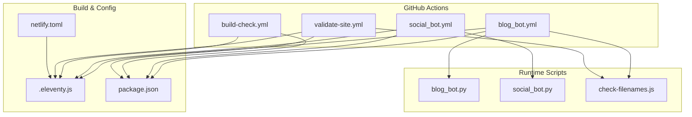
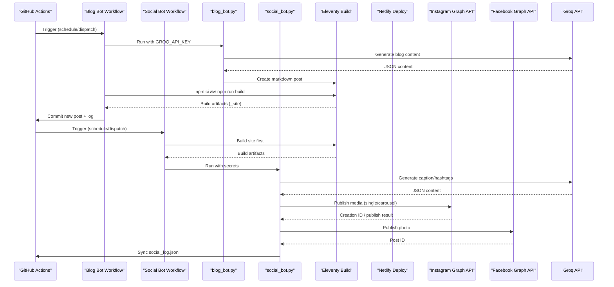
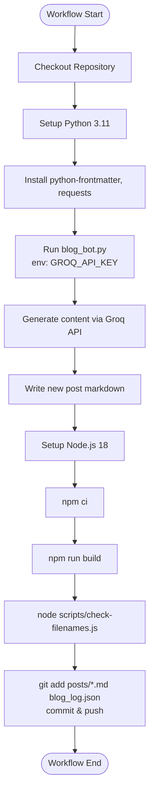
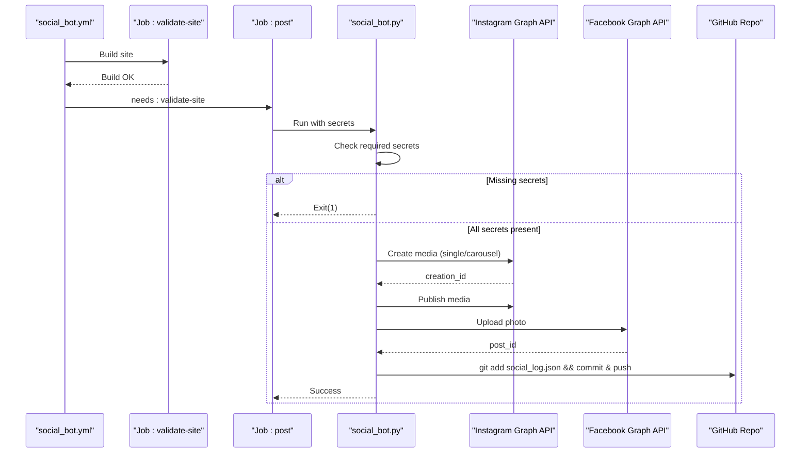
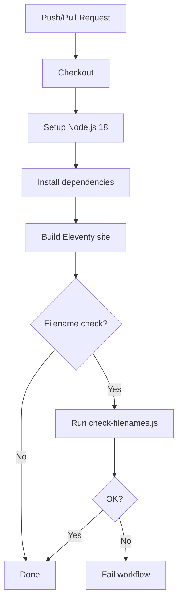
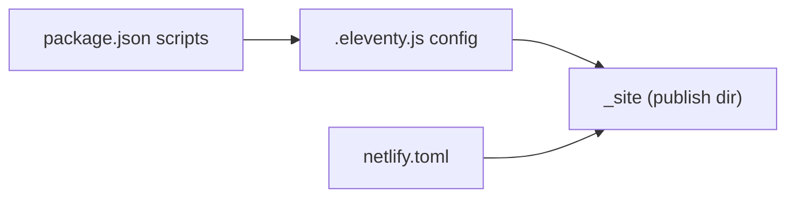
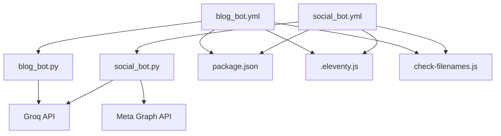

# Automation and CI/CD

<cite>
**Referenced Files in This Document**
- [blog_bot.yml](file://.github/workflows/blog_bot.yml)
- [social_bot.yml](file://.github/workflows/social_bot.yml)
- [build-check.yml](file://.github/workflows/build-check.yml)
- [validate-site.yml](file://.github/workflows/validate-site.yml)
- [netlify.toml](file://netlify.toml)
- [package.json](file://package.json)
- [.eleventy.js](file://.eleventy.js)
- [check-filenames.js](file://scripts/check-filenames.js)
- [blog_bot.py](file://blog_bot.py)
- [social_bot.py](file://social_bot.py)
- [SOCIAL_BOT_SETUP.md](file://SOCIAL_BOT_SETUP.md)
</cite>

## Table of Contents
1. [Introduction](#introduction)
2. [Project Structure](#project-structure)
3. [Core Components](#core-components)
4. [Architecture Overview](#architecture-overview)
5. [Detailed Component Analysis](#detailed-component-analysis)
6. [Dependency Analysis](#dependency-analysis)
7. [Performance Considerations](#performance-considerations)
8. [Troubleshooting Guide](#troubleshooting-guide)
9. [Conclusion](#conclusion)

## Introduction
This document explains the automation and CI/CD system for Nillianstore2, focusing on GitHub Actions workflows that automate blog generation, social media posting, build validation, and deployment to Netlify. It covers triggers, conditional execution, environment variables, error handling, retry strategies, logging, and monitoring approaches.

## Project Structure
The automation is implemented through:
- GitHub Actions workflows under .github/workflows
- Python bots for content generation and social posting
- Eleventy configuration and build scripts
- Netlify deployment configuration

**Diagram sources**
- [blog_bot.yml:1-53](file://.github/workflows/blog_bot.yml#L1-L53)
- [social_bot.yml:1-94](file://.github/workflows/social_bot.yml#L1-L94)
- [build-check.yml:1-26](file://.github/workflows/build-check.yml#L1-L26)
- [validate-site.yml:1-23](file://.github/workflows/validate-site.yml#L1-L23)
- [blog_bot.py:1-253](file://blog_bot.py#L1-L253)
- [social_bot.py:1-315](file://social_bot.py#L1-L315)
- [check-filenames.js:1-45](file://scripts/check-filenames.js#L1-L45)
- [.eleventy.js:1-160](file://.eleventy.js#L1-L160)
- [package.json:1-34](file://package.json#L1-L34)
- [netlify.toml:1-3](file://netlify.toml#L1-L3)

**Section sources**
- [blog_bot.yml:1-53](file://.github/workflows/blog_bot.yml#L1-L53)
- [social_bot.yml:1-94](file://.github/workflows/social_bot.yml#L1-L94)
- [build-check.yml:1-26](file://.github/workflows/build-check.yml#L1-L26)
- [validate-site.yml:1-23](file://.github/workflows/validate-site.yml#L1-L23)
- [package.json:1-34](file://package.json#L1-L34)
- [.eleventy.js:1-160](file://.eleventy.js#L1-L160)
- [netlify.toml:1-3](file://netlify.toml#L1-L3)

## Core Components
- Automated Blog Generation Bot: Scheduled or manually triggered workflow that generates a new blog post from a product using AI, validates the site build, and commits the new post.
- Social Media Automation Bot: Scheduled or manually triggered workflow that posts a product to Instagram and Facebook with AI-generated captions and hashtags, then syncs logs back to the repository.
- Build Validation Workflows: On push/pull request, these ensure the Eleventy site builds successfully and generated filenames are safe for hosting.
- Deployment Configuration: Netlify publishes the Eleventy output directory and runs the debug build command.

Key responsibilities:
- Triggers and permissions define when and how workflows run.
- Environment variables (secrets) provide API keys and tokens.
- Conditional steps guard against missing secrets and handle retries.
- Logging and status codes drive observability and failure signaling.

**Section sources**
- [blog_bot.yml:1-53](file://.github/workflows/blog_bot.yml#L1-L53)
- [social_bot.yml:1-94](file://.github/workflows/social_bot.yml#L1-L94)
- [build-check.yml:1-26](file://.github/workflows/build-check.yml#L1-L26)
- [validate-site.yml:1-23](file://.github/workflows/validate-site.yml#L1-L23)
- [netlify.toml:1-3](file://netlify.toml#L1-L3)

## Architecture Overview
End-to-end flow across automation components:

**Diagram sources**
- [blog_bot.yml:1-53](file://.github/workflows/blog_bot.yml#L1-L53)
- [social_bot.yml:1-94](file://.github/workflows/social_bot.yml#L1-L94)
- [blog_bot.py:1-253](file://blog_bot.py#L1-L253)
- [social_bot.py:1-315](file://social_bot.py#L1-L315)
- [.eleventy.js:1-160](file://.eleventy.js#L1-L160)
- [package.json:1-34](file://package.json#L1-L34)

## Detailed Component Analysis

### Automated Blog Generation Bot
- Triggers: Weekly schedule and manual dispatch.
- Permissions: Write access to repository contents to commit new posts.
- Steps:
  - Checkout repo with credentials persisted.
  - Set up Python and install dependencies.
  - Run blog generator script with GROQ_API_KEY secret.
  - Set up Node.js, install dependencies, build Eleventy site, and validate filenames.
  - Commit and push new posts and history log.

Behavioral highlights:
- Uses Groq API to generate SEO-friendly blog content based on product data.
- Writes frontmatter and body into a new Markdown file under posts/.
- Maintains a history log to avoid regenerating posts for the same product.
- Validates the final build before committing changes.

**Diagram sources**
- [blog_bot.yml:1-53](file://.github/workflows/blog_bot.yml#L1-L53)
- [blog_bot.py:1-253](file://blog_bot.py#L1-L253)
- [check-filenames.js:1-45](file://scripts/check-filenames.js#L1-L45)
- [package.json:1-34](file://package.json#L1-L34)

**Section sources**
- [blog_bot.yml:1-53](file://.github/workflows/blog_bot.yml#L1-L53)
- [blog_bot.py:1-253](file://blog_bot.py#L1-L253)
- [check-filenames.js:1-45](file://scripts/check-filenames.js#L1-L45)
- [package.json:1-34](file://package.json#L1-L34)

### Social Media Automation Bot
- Triggers: Every 8 hours and manual dispatch.
- Permissions: Write access to repository contents to sync logs.
- Jobs:
  - validate-site: Builds the site and waits briefly for Netlify deployment.
  - post: Runs after validate-site; checks secrets, verifies images, posts to Instagram and Facebook, and syncs logs.

Behavioral highlights:
- Requires multiple secrets: GROQ_API_KEY, META_ACCESS_TOKEN, FB_PAGE_ID, IG_USER_ID, and optionally GITHUB_TOKEN.
- Generates captions and hashtags via Groq API.
- Posts single image or carousel to Instagram, then posts to Facebook.
- Retries up to three times with different products on failure.
- Syncs social_log.json back to the repository if GITHUB_TOKEN is present.

**Diagram sources**
- [social_bot.yml:1-94](file://.github/workflows/social_bot.yml#L1-L94)
- [social_bot.py:1-315](file://social_bot.py#L1-L315)

**Section sources**
- [social_bot.yml:1-94](file://.github/workflows/social_bot.yml#L1-L94)
- [social_bot.py:1-315](file://social_bot.py#L1-L315)
- [SOCIAL_BOT_SETUP.md:1-106](file://SOCIAL_BOT_SETUP.md#L1-L106)

### Build Validation Workflows
- build-check.yml:
  - Triggers on push to main and pull requests.
  - Sets up Node.js 18, installs dependencies, and runs Eleventy build.
- validate-site.yml:
  - Similar to build-check but also runs filename validation script to ensure no forbidden characters in generated paths.

These workflows protect the main branch by failing fast on build errors and invalid filenames.

**Diagram sources**
- [build-check.yml:1-26](file://.github/workflows/build-check.yml#L1-L26)
- [validate-site.yml:1-23](file://.github/workflows/validate-site.yml#L1-L23)
- [check-filenames.js:1-45](file://scripts/check-filenames.js#L1-L45)
- [package.json:1-34](file://package.json#L1-L34)

**Section sources**
- [build-check.yml:1-26](file://.github/workflows/build-check.yml#L1-L26)
- [validate-site.yml:1-23](file://.github/workflows/validate-site.yml#L1-L23)
- [check-filenames.js:1-45](file://scripts/check-filenames.js#L1-L45)
- [package.json:1-34](file://package.json#L1-L34)

### Deployment Configuration (Netlify)
- netlify.toml defines:
  - Publish directory: _site
  - Build command: DEBUG=* eleventy
- Eleventy configuration (.eleventy.js) sets input/output directories and plugins.
- package.json provides build scripts used by workflows and Netlify.

**Diagram sources**
- [netlify.toml:1-3](file://netlify.toml#L1-L3)
- [.eleventy.js:1-160](file://.eleventy.js#L1-L160)
- [package.json:1-34](file://package.json#L1-L34)

**Section sources**
- [netlify.toml:1-3](file://netlify.toml#L1-L3)
- [.eleventy.js:1-160](file://.eleventy.js#L1-L160)
- [package.json:1-34](file://package.json#L1-L34)

## Dependency Analysis
- Workflows depend on:
  - Node.js runtime and npm for building Eleventy sites.
  - Python runtime and packages for bot logic.
  - External APIs: Groq (content generation), Meta Graph API (Instagram/Facebook).
- Internal dependencies:
  - blog_bot.yml depends on blog_bot.py and Eleventy build.
  - social_bot.yml depends on social_bot.py and Eleventy build.
  - Both workflows may rely on check-filenames.js for safety checks.

**Diagram sources**
- [blog_bot.yml:1-53](file://.github/workflows/blog_bot.yml#L1-L53)
- [social_bot.yml:1-94](file://.github/workflows/social_bot.yml#L1-L94)
- [blog_bot.py:1-253](file://blog_bot.py#L1-L253)
- [social_bot.py:1-315](file://social_bot.py#L1-L315)
- [check-filenames.js:1-45](file://scripts/check-filenames.js#L1-L45)
- [.eleventy.js:1-160](file://.eleventy.js#L1-L160)
- [package.json:1-34](file://package.json#L1-L34)

**Section sources**
- [blog_bot.yml:1-53](file://.github/workflows/blog_bot.yml#L1-L53)
- [social_bot.yml:1-94](file://.github/workflows/social_bot.yml#L1-L94)
- [blog_bot.py:1-253](file://blog_bot.py#L1-L253)
- [social_bot.py:1-315](file://social_bot.py#L1-L315)
- [check-filenames.js:1-45](file://scripts/check-filenames.js#L1-L45)
- [.eleventy.js:1-160](file://.eleventy.js#L1-L160)
- [package.json:1-34](file://package.json#L1-L34)

## Performance Considerations
- Use pinned Node.js and Python versions to reduce cold starts and dependency resolution time.
- Prefer npm ci over npm install for deterministic, faster installs in CI.
- Limit external API calls by caching results where appropriate (e.g., product selection history).
- Keep image URLs accessible before posting to avoid retries and wasted API calls.
- Avoid unnecessary large uploads; prefer optimized images.

[No sources needed since this section provides general guidance]

## Troubleshooting Guide
Common issues and resolutions:
- Missing secrets:
  - Ensure all required secrets are set in repository settings. The social bot explicitly checks for presence and exits early if any are missing.
- Expired or invalid tokens:
  - If Meta API returns an expired token error, update the long-lived token and refresh secrets.
- No images found:
  - Products must include cover or images in frontmatter; otherwise, the bot skips them.
- Build failures:
  - Check Eleventy build logs and ensure all dependencies are installed.
- Filename validation failures:
  - Generated files must not contain forbidden characters; adjust slugs and tags accordingly.

Operational tips:
- Review workflow logs in the Actions tab for detailed outputs and stack traces.
- Manually trigger workflows to reproduce issues quickly.
- For social posting, verify website accessibility of images before posting.

**Section sources**
- [social_bot.yml:60-94](file://.github/workflows/social_bot.yml#L60-L94)
- [social_bot.py:248-315](file://social_bot.py#L248-L315)
- [SOCIAL_BOT_SETUP.md:75-106](file://SOCIAL_BOT_SETUP.md#L75-L106)
- [check-filenames.js:22-45](file://scripts/check-filenames.js#L22-L45)

## Conclusion
Nillianstore2’s automation pipeline integrates scheduled and manual triggers to generate blog content, post to social media, validate builds, and deploy to Netlify. The design emphasizes reliability through retries, explicit secret checks, and robust build validations. Monitoring and debugging are facilitated by comprehensive workflow logs and clear exit codes.

[No sources needed since this section summarizes without analyzing specific files]