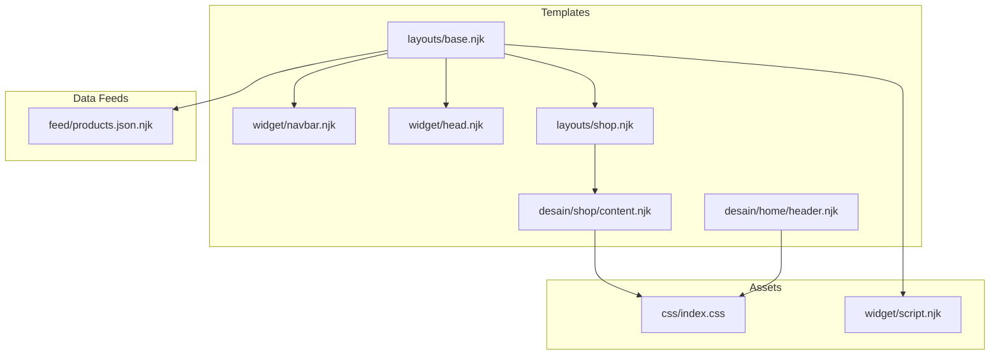
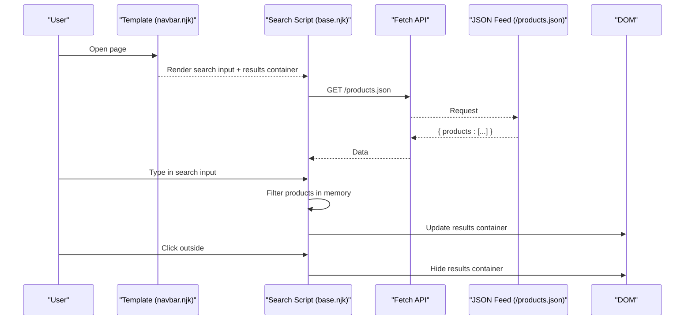
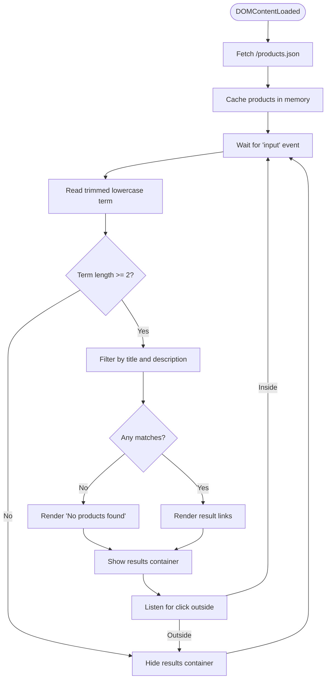
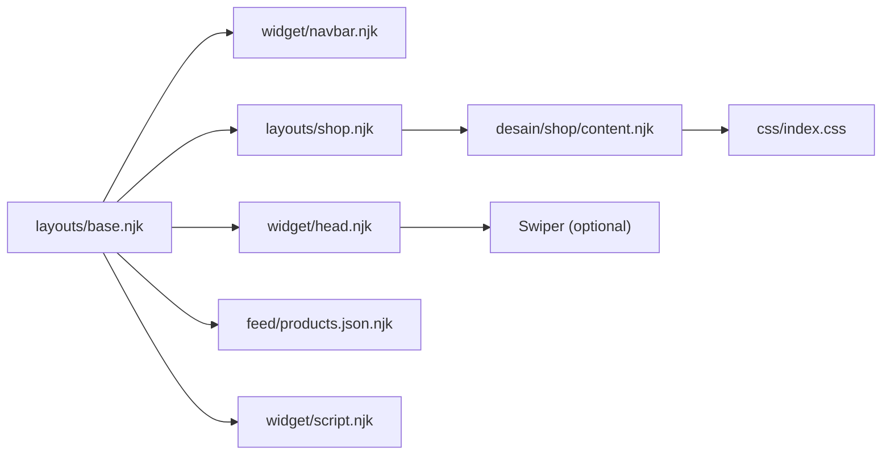

# Client-Side Features

<cite>
**Referenced Files in This Document**
- [base.njk](file://_includes/layouts/base.njk)
- [navbar.njk](file://_includes/widget/navbar.njk)
- [head.njk](file://_includes/widget/head.njk)
- [script.njk](file://_includes/widget/script.njk)
- [products.json.njk](file://feed/products.json.njk)
- [content.njk](file://_includes/desain/shop/content.njk)
- [index.css](file://css/index.css)
- [header.njk](file://_includes/desain/home/header.njk)
- [shop.njk](file://_includes/layouts/shop.njk)
</cite>

## Table of Contents
1. Introduction
2. Project Structure
3. Core Components
4. Architecture Overview
5. Detailed Component Analysis
6. Dependency Analysis
7. Performance Considerations
8. Troubleshooting Guide
9. Conclusion

## Introduction
This document explains the client-side features of the Nillianstore2 platform with a focus on:
- A vanilla JavaScript product search system that integrates with a generated JSON feed for real-time filtering
- Interactive UI components including responsive navigation, hero sections, and dynamic content behaviors
- Event handling, DOM manipulation patterns, and state management approaches used on the client
- Integration points with generated JSON feeds and how updates propagate to the user interface
- Browser compatibility, performance optimizations, and accessibility considerations

The site is built with Eleventy (Nunjucks templates), Bootstrap 5, and minimal custom JavaScript to keep the runtime lightweight and performant.

## Project Structure
Client-side functionality is primarily implemented through:
- Template includes that render interactive UI elements (navigation, search input, results container)
- Inline scripts that handle events, fetch data from generated JSON endpoints, and update the DOM
- CSS for layout, responsiveness, and visual polish
- Generated JSON feeds produced at build time by Eleventy

**Diagram sources**
- [base.njk:1-61](file://_includes/layouts/base.njk#L1-L61)
- [navbar.njk:1-36](file://_includes/widget/navbar.njk#L1-L36)
- [head.njk:1-113](file://_includes/widget/head.njk#L1-L113)
- [script.njk:1-3](file://_includes/widget/script.njk#L1-L3)
- [products.json.njk:1-17](file://feed/products.json.njk#L1-L17)
- [content.njk:1-120](file://_includes/desain/shop/content.njk#L1-L120)
- [index.css:1-52](file://css/index.css#L1-L52)
- [header.njk:1-21](file://_includes/desain/home/header.njk#L1-L21)
- [shop.njk:1-5](file://_includes/layouts/shop.njk#L1-L5)

**Section sources**
- [base.njk:1-61](file://_includes/layouts/base.njk#L1-L61)
- [navbar.njk:1-36](file://_includes/widget/navbar.njk#L1-L36)
- [head.njk:1-113](file://_includes/widget/head.njk#L1-L113)
- [script.njk:1-3](file://_includes/widget/script.njk#L1-L3)
- [products.json.njk:1-17](file://feed/products.json.njk#L1-L17)
- [content.njk:1-120](file://_includes/desain/shop/content.njk#L1-L120)
- [index.css:1-52](file://css/index.css#L1-L52)
- [header.njk:1-21](file://_includes/desain/home/header.njk#L1-L21)
- [shop.njk:1-5](file://_includes/layouts/shop.njk#L1-L5)

## Core Components
- Product Search System
  - Input element and results container are rendered in the navigation include
  - Vanilla JS fetches /products.json and filters items in-memory as the user types
  - Results are rendered into a dropdown-like container positioned near the input
- Responsive Navigation
  - Uses Bootstrap’s collapse behavior for mobile-friendly toggling
  - Includes an inline search form integrated into the nav bar
- Hero Section
  - Styled via CSS to maintain aspect ratio and responsive sizing
  - Supports high-priority image loading for faster perceived performance
- Dynamic Content Loading
  - Optional third-party scripts (e.g., Swiper) are loaded dynamically after page load
  - Analytics and social integrations are deferred or conditionally injected
- Shop Page Interactions
  - Click handlers for analytics events on call-to-action buttons
  - Lightweight DOM event binding without heavy frameworks

**Section sources**
- [navbar.njk:1-36](file://_includes/widget/navbar.njk#L1-L36)
- [base.njk:7-61](file://_includes/layouts/base.njk#L7-L61)
- [head.njk:17-41](file://_includes/widget/head.njk#L17-L41)
- [head.njk:100-110](file://_includes/widget/head.njk#L100-L110)
- [header.njk:1-21](file://_includes/desain/home/header.njk#L1-L21)
- [content.njk:92-119](file://_includes/desain/shop/content.njk#L92-L119)

## Architecture Overview
The client-side architecture centers around a simple, efficient pipeline:
- Templates render static HTML with embedded UI controls (search input, results container)
- On DOMContentLoaded, a small script initializes the search logic
- The script fetches a prebuilt JSON file containing all products
- As users type, the script filters the in-memory dataset and updates the DOM
- No server round-trips occur during search; updates are instantaneous

**Diagram sources**
- [navbar.njk:16-33](file://_includes/widget/navbar.njk#L16-L33)
- [base.njk:7-61](file://_includes/layouts/base.njk#L7-L61)
- [products.json.njk:1-17](file://feed/products.json.njk#L1-L17)

## Detailed Component Analysis

### Product Search System
- Implementation approach
  - Vanilla JavaScript listens for input events on the search field
  - Fetches the generated /products.json once and caches it in memory
  - Filters by title and description using case-insensitive substring matching
  - Renders result links with title, short description, and price
  - Hides the results container when the input is empty or too short
  - Closes the results container when clicking outside
- State management
  - In-memory array holds the full product list
  - Temporary variable holds the current filtered matches
- DOM manipulation patterns
  - Direct innerHTML assignment for result rendering
  - Class toggling to show/hide the results container
- Accessibility
  - Search input has role="search" and aria-label attributes
  - Results container uses semantic link elements for keyboard navigation
- Error handling
  - Network errors are logged to the console
  - Empty results display a friendly message

**Diagram sources**
- [base.njk:7-61](file://_includes/layouts/base.njk#L7-L61)
- [navbar.njk:16-33](file://_includes/widget/navbar.njk#L16-L33)
- [products.json.njk:1-17](file://feed/products.json.njk#L1-L17)

**Section sources**
- [base.njk:7-61](file://_includes/layouts/base.njk#L7-L61)
- [navbar.njk:16-33](file://_includes/widget/navbar.njk#L16-L33)
- [products.json.njk:1-17](file://feed/products.json.njk#L1-L17)

### Responsive Navigation
- Behavior
  - Bootstrap’s collapse toggles the menu on smaller screens
  - Search form is aligned within the navbar and remains accessible
- Accessibility
  - Toggle button includes aria-controls, aria-expanded, and aria-label
  - Form has role="search" and appropriate labels
- Styling
  - Uses Bootstrap utility classes for spacing, alignment, and visibility

**Section sources**
- [navbar.njk:1-36](file://_includes/widget/navbar.njk#L1-L36)

### Hero Sections
- Layout
  - Container maintains a 16:9 aspect ratio and scales responsively
  - Image fills the container while preserving aspect ratio
- Performance
  - High-priority preload hints for critical images
  - Lazy loading for non-critical assets elsewhere
- Styling
  - Custom CSS ensures consistent sizing and positioning across viewports

**Section sources**
- [header.njk:1-21](file://_includes/desain/home/header.njk#L1-L21)
- [index.css:27-51](file://css/index.css#L27-L51)
- [head.njk:60-86](file://_includes/widget/head.njk#L60-L86)

### Dynamic Content Loading
- Conditional script injection
  - Third-party libraries (e.g., Swiper) are appended to the DOM after page load
  - Initialization occurs only if relevant elements exist on the page
- Deferred execution
  - Scripts are added with defer or async where appropriate
  - Non-critical integrations are injected only on specific pages

**Section sources**
- [head.njk:17-41](file://_includes/widget/head.njk#L17-L41)
- [head.njk:100-110](file://_includes/widget/head.njk#L100-L110)
- [script.njk:1-3](file://_includes/widget/script.njk#L1-L3)

### Shop Page Interactions
- Analytics integration
  - Click handler on the buy button sends Google Analytics events
  - Values are extracted from template variables and sanitized before sending
- DOM binding
  - Lightweight event listener attached after DOMContentLoaded
  - Safe checks ensure gtag is available before invoking

**Section sources**
- [content.njk:92-119](file://_includes/desain/shop/content.njk#L92-L119)

## Dependency Analysis
- Template dependencies
  - Base layout includes navbar, head, content, and footer
  - Shop layout extends base and includes shop-specific content
- Runtime dependencies
  - Bootstrap JS provides navbar collapse and utilities
  - Optional Swiper library is loaded dynamically
- Data dependencies
  - Search depends on /products.json generated by Eleventy
  - Products are sourced from the Eleventy “shop” collection

**Diagram sources**
- [base.njk:1-61](file://_includes/layouts/base.njk#L1-L61)
- [navbar.njk:1-36](file://_includes/widget/navbar.njk#L1-L36)
- [head.njk:1-113](file://_includes/widget/head.njk#L1-L113)
- [script.njk:1-3](file://_includes/widget/script.njk#L1-L3)
- [products.json.njk:1-17](file://feed/products.json.njk#L1-L17)
- [content.njk:1-120](file://_includes/desain/shop/content.njk#L1-L120)
- [index.css:1-52](file://css/index.css#L1-L52)
- [shop.njk:1-5](file://_includes/layouts/shop.njk#L1-L5)

**Section sources**
- [base.njk:1-61](file://_includes/layouts/base.njk#L1-L61)
- [shop.njk:1-5](file://_includes/layouts/shop.njk#L1-L5)
- [products.json.njk:1-17](file://feed/products.json.njk#L1-L17)

## Performance Considerations
- Minimal JavaScript footprint
  - Vanilla JS avoids framework overhead
  - Single fetch for product data reduces network requests
- Efficient filtering
  - In-memory filtering with simple string operations keeps interactions snappy
- Resource loading strategies
  - Preload hints for critical CSS/JS
  - Defer and async usage for non-blocking loads
  - Conditional injection of optional libraries
- Image optimization
  - Aspect-ratio containers prevent layout shifts
  - High-priority hints for hero images; lazy loading elsewhere
- Accessibility and usability
  - Keyboard navigable search results
  - Proper ARIA attributes improve screen reader support

[No sources needed since this section provides general guidance]

## Troubleshooting Guide
- Search returns no results
  - Verify /products.json exists and contains a valid array under the expected key
  - Ensure the search term meets the minimum length requirement
  - Check browser console for fetch errors
- Results do not hide when clicking outside
  - Confirm the click listener is attached to the document
  - Validate that the results container ID matches the selector
- Navbar toggle does not work on mobile
  - Ensure Bootstrap JS is loaded and initialized
  - Check that the toggle button targets the correct collapse container
- Analytics events not firing
  - Confirm gtag is defined before attaching the click handler
  - Inspect the browser console for errors related to analytics

**Section sources**
- [base.njk:7-61](file://_includes/layouts/base.njk#L7-L61)
- [navbar.njk:1-36](file://_includes/widget/navbar.njk#L1-L36)
- [script.njk:1-3](file://_includes/widget/script.njk#L1-L3)
- [content.njk:92-119](file://_includes/desain/shop/content.njk#L92-L119)

## Conclusion
The Nillianstore2 client-side implementation emphasizes simplicity, speed, and accessibility. The vanilla JavaScript search leverages a prebuilt JSON feed for instant filtering, while Bootstrap and targeted CSS provide responsive, accessible UIs. Dynamic loading of optional libraries and careful resource hints further optimize performance. This approach delivers a smooth user experience with minimal runtime complexity.

[No sources needed since this section summarizes without analyzing specific files]