# AI-Powered Blog Generation

<cite>
**Referenced Files in This Document**
- [blog_bot.py](file://blog_bot.py)
- [blog_log.json](file://blog_log.json)
- [blog_bot.yml](file://.github/workflows/blog_bot.yml)
- [check-filenames.js](file://scripts/check-filenames.js)
- [test_blog_bot_run.py](file://scripts/test_blog_bot_run.py)
- [.eleventy.js](file://.eleventy.js)
- [post.njk](file://_includes/layouts/post.njk)
- [B0CLHGCYRN.md](file://shop/B0CLHGCYRN.md)
- [best-gift-ideas-in-uae-2025.md](file://posts/best-gift-ideas-in-uae-2025.md)
</cite>

## Table of Contents
1. Introduction
2. Project Structure
3. Core Components
4. Architecture Overview
5. Detailed Component Analysis
6. Dependency Analysis
7. Performance Considerations
8. Troubleshooting Guide
9. Conclusion

## Introduction
This document explains the AI-powered blog generation system that transforms product data into automated, SEO-optimized blog posts for Nillian Store (UAE). The system:
- Reads product files from the shop directory
- Uses GROQ AI to generate structured content with UAE localization and SEO focus
- Writes Eleventy-compatible Markdown posts with frontmatter, tags, images, and Amazon affiliate links
- Maintains a history log to avoid duplicate content generation
- Integrates with GitHub Actions for scheduled automation and build validation

The result is a repeatable pipeline that produces high-quality, market-localized blog content at scale.

## Project Structure
Key directories and files involved in the blog generation workflow:
- Product catalog: shop/*.md (product metadata and images)
- Generated content: posts/*.md (Eleventy blog posts)
- History tracking: blog_log.json (prevents duplicates)
- Automation: .github/workflows/blog_bot.yml (scheduled run)
- Build validation: scripts/check-filenames.js (ensures safe filenames)
- Site configuration: .eleventy.js (filters, collections, markdown setup)
- Layouts: _includes/layouts/post.njk (post rendering)

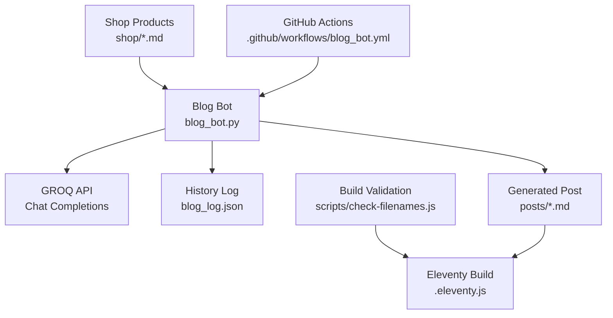

**Diagram sources**
- [blog_bot.py:1-253](file://blog_bot.py#L1-L253)
- [blog_bot.yml:1-53](file://.github/workflows/blog_bot.yml#L1-L53)
- [check-filenames.js:1-45](file://scripts/check-filenames.js#L1-L45)
- [.eleventy.js:1-160](file://.eleventy.js#L1-L160)

**Section sources**
- [blog_bot.py:1-253](file://blog_bot.py#L1-L253)
- [blog_bot.yml:1-53](file://.github/workflows/blog_bot.yml#L1-L53)
- [check-filenames.js:1-45](file://scripts/check-filenames.js#L1-L45)
- [.eleventy.js:1-160](file://.eleventy.js#L1-L160)

## Core Components
- Product Data Extraction: Loads product frontmatter and body text, collects cover and additional images, and resolves Amazon link fields.
- Prompt Engineering and Content Generation: Constructs a detailed prompt with context injection (title, description, price, link), tone/style guidance, and UAE market localization; calls GROQ API with JSON response format.
- History Management: Persists generated product IDs to prevent re-generation and ensure coverage across the catalog.
- Post Creation: Builds an Eleventy-ready Markdown file with sanitized frontmatter, tags, images, and embedded Amazon affiliate button.
- Automation and Validation: Scheduled GitHub Action runs the bot, builds the site, validates filenames, and commits new posts.

**Section sources**
- [blog_bot.py:18-46](file://blog_bot.py#L18-L46)
- [blog_bot.py:48-97](file://blog_bot.py#L48-L97)
- [blog_bot.py:99-208](file://blog_bot.py#L99-L208)
- [blog_bot.yml:1-53](file://.github/workflows/blog_bot.yml#L1-L53)

## Architecture Overview
End-to-end flow from product selection to published post:

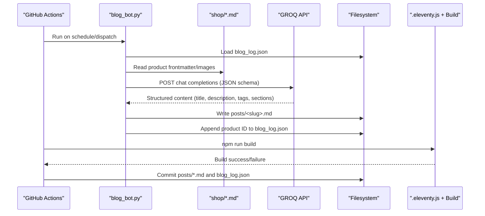

**Diagram sources**
- [blog_bot.py:210-253](file://blog_bot.py#L210-L253)
- [blog_bot.py:48-97](file://blog_bot.py#L48-L97)
- [blog_bot.yml:30-52](file://.github/workflows/blog_bot.yml#L30-L52)
- [.eleventy.js:146-159](file://.eleventy.js#L146-L159)

## Detailed Component Analysis

### Product Data Extraction
- Reads product Markdown using frontmatter library
- Aggregates images from cover and images list, deduplicating entries
- Resolves Amazon link via either link or amazonLink field
- Prepares a compact product_data object for prompt injection

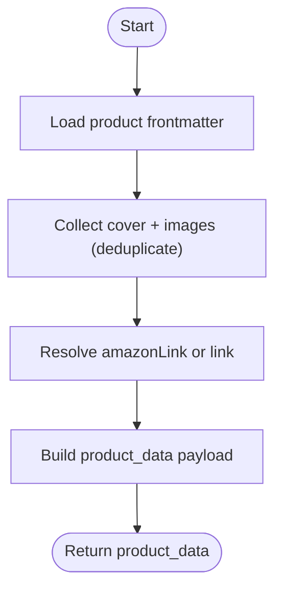

**Diagram sources**
- [blog_bot.py:210-238](file://blog_bot.py#L210-L238)

**Section sources**
- [blog_bot.py:210-238](file://blog_bot.py#L210-L238)
- [B0CLHGCYRN.md:1-55](file://shop/B0CLHGCYRN.md#L1-L55)

### Prompt Engineering and Content Generation
- Context Injection: Title, description, price, and Amazon link are injected into the prompt
- Tone and Style: Emphasizes SEO copywriting, UAE lifestyle/home decor trends, emojis, and localized references
- Output Schema: Requests JSON with title, description, tags, intro, product_section, why_it_works, perfect_for, conclusion
- API Call: Uses GROQ OpenAI-compatible endpoint with model llama-3.3-70b-versatile and JSON response format

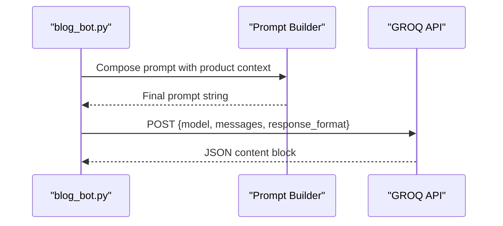

**Diagram sources**
- [blog_bot.py:48-97](file://blog_bot.py#L48-L97)

**Section sources**
- [blog_bot.py:48-97](file://blog_bot.py#L48-L97)

### History Management (Duplicate Prevention)
- Loads existing history from blog_log.json
- Filters out already-generated products when selecting the next candidate
- Appends newly generated product ID after successful creation

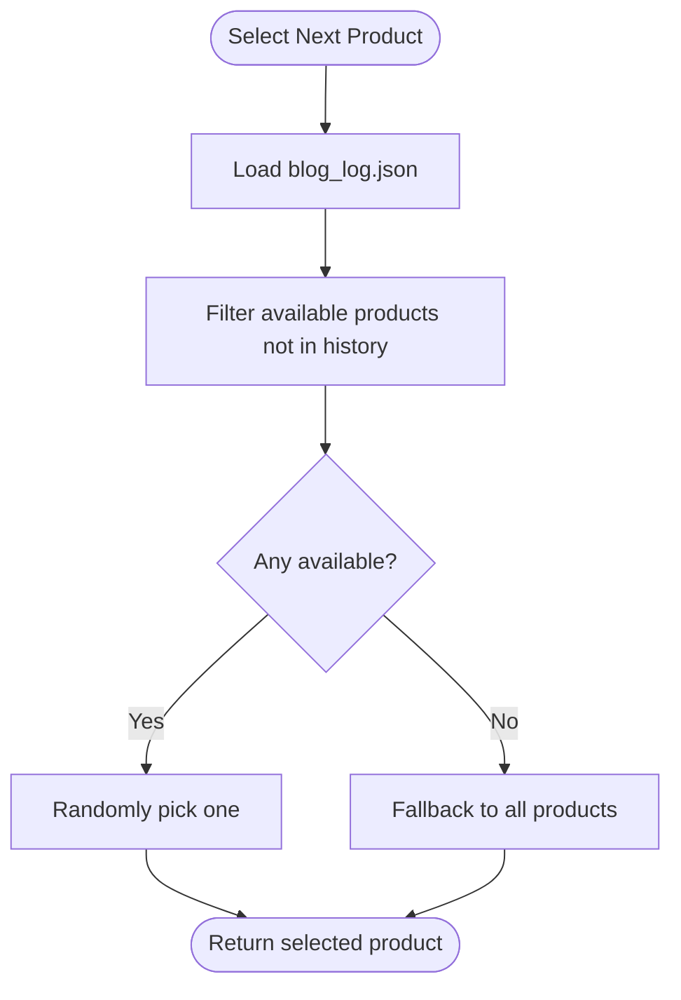

**Diagram sources**
- [blog_bot.py:18-39](file://blog_bot.py#L18-L39)

**Section sources**
- [blog_bot.py:18-39](file://blog_bot.py#L18-L39)
- [blog_log.json:1-1](file://blog_log.json#L1-L1)

### Automated Tagging System
- Tags are sourced from AI output and sanitized:
  - HTML entity decoding
  - Normalization of apostrophes/backticks
  - Removal of characters unsafe for filenames/URLs
- Enforces inclusion of 'post' tag for Eleventy collection filtering
- Limits tag count to a reasonable maximum for frontmatter readability

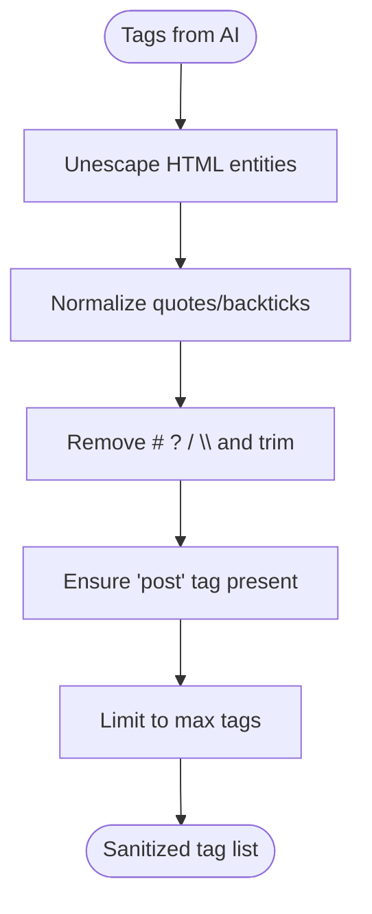

**Diagram sources**
- [blog_bot.py:105-122](file://blog_bot.py#L105-L122)
- [.eleventy.js:64-66](file://.eleventy.js#L64-L66)

**Section sources**
- [blog_bot.py:105-122](file://blog_bot.py#L105-L122)
- [.eleventy.js:64-66](file://.eleventy.js#L64-L66)

### Image Selection Logic
- Prioritizes cover image if present
- Appends additional images from images list while avoiding duplicates
- Embeds up to three images in the post with responsive styling and alt text derived from product title

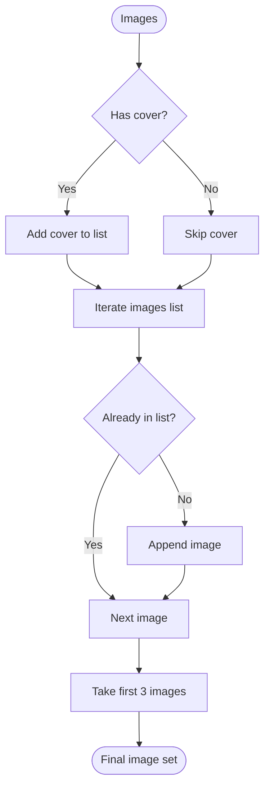

**Diagram sources**
- [blog_bot.py:219-227](file://blog_bot.py#L219-L227)
- [blog_bot.py:142-149](file://blog_bot.py#L142-L149)

**Section sources**
- [blog_bot.py:219-227](file://blog_bot.py#L219-L227)
- [blog_bot.py:142-149](file://blog_bot.py#L142-L149)

### Amazon Affiliate Link Integration
- Resolves affiliate link from either link or amazonLink frontmatter fields
- Generates a centered call-to-action button linking to Amazon.ae with appropriate attributes
- Ensures rel="noopener" and target="_blank" for security and UX

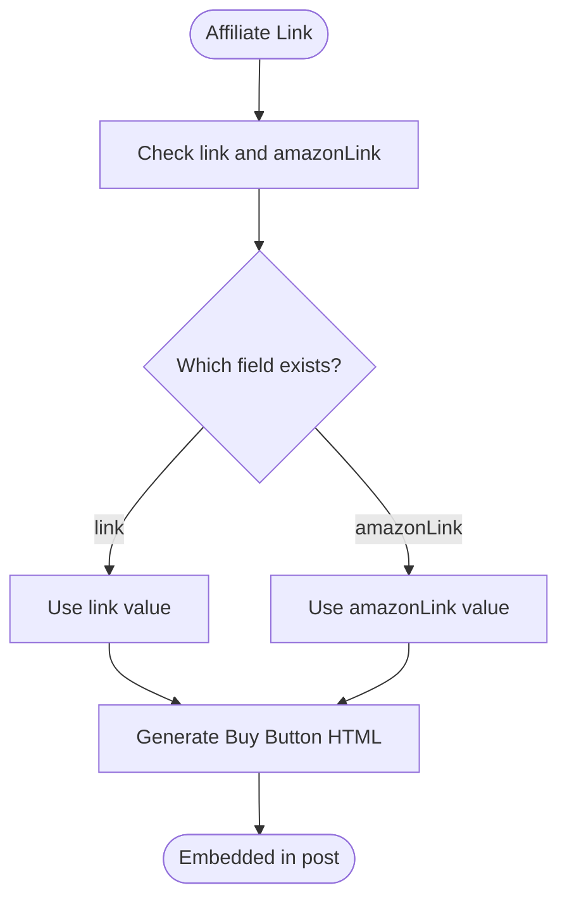

**Diagram sources**
- [blog_bot.py:228-229](file://blog_bot.py#L228-L229)
- [blog_bot.py:124-140](file://blog_bot.py#L124-L140)

**Section sources**
- [blog_bot.py:228-229](file://blog_bot.py#L228-L229)
- [blog_bot.py:124-140](file://blog_bot.py#L124-L140)

### Post File Creation and Frontmatter Sanitization
- Slug generation from AI title for permalink-safe filenames
- Date stamping and layout assignment
- Escaping and sanitizing title/description/tags for valid YAML frontmatter
- Assembling structured Markdown content with sections, images, and buy button

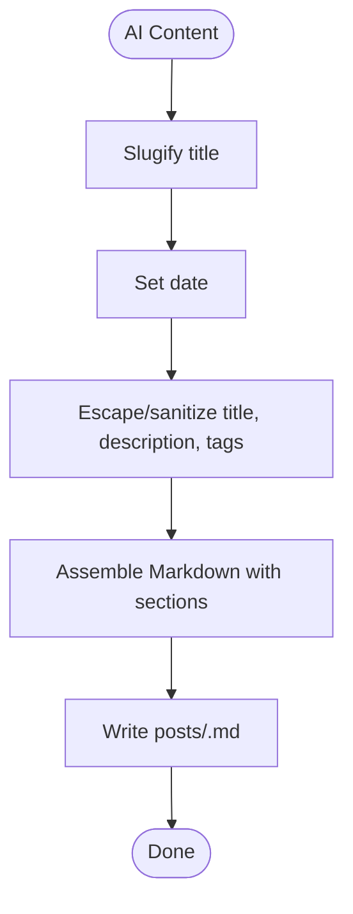

**Diagram sources**
- [blog_bot.py:99-103](file://blog_bot.py#L99-L103)
- [blog_bot.py:151-172](file://blog_bot.py#L151-L172)
- [blog_bot.py:162-203](file://blog_bot.py#L162-L203)

**Section sources**
- [blog_bot.py:99-103](file://blog_bot.py#L99-L103)
- [blog_bot.py:151-172](file://blog_bot.py#L151-L172)
- [blog_bot.py:162-203](file://blog_bot.py#L162-L203)

### Automation Workflow (GitHub Actions)
- Triggers weekly on schedule and manual dispatch
- Installs Python dependencies, runs blog_bot.py with GROQ_API_KEY secret
- Sets up Node.js, installs Eleventy, builds site, and validates filenames
- Commits and pushes new posts and updated history

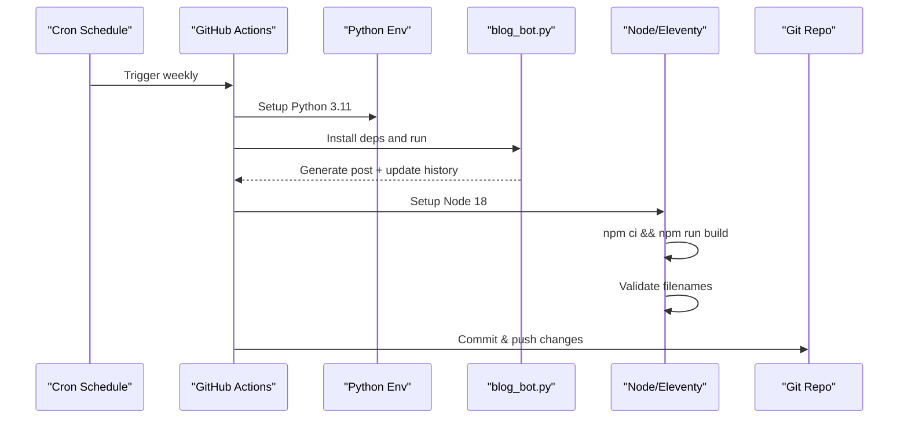

**Diagram sources**
- [blog_bot.yml:1-53](file://.github/workflows/blog_bot.yml#L1-L53)
- [check-filenames.js:1-45](file://scripts/check-filenames.js#L1-L45)

**Section sources**
- [blog_bot.yml:1-53](file://.github/workflows/blog_bot.yml#L1-L53)
- [check-filenames.js:1-45](file://scripts/check-filenames.js#L1-L45)

### Eleventy Rendering and Collections
- Adds layout aliases for posts and shops
- Configures markdown-it with HTML support and anchor links
- Provides filters for dates, slugs, and tag filtering
- Defines collections and passthrough assets

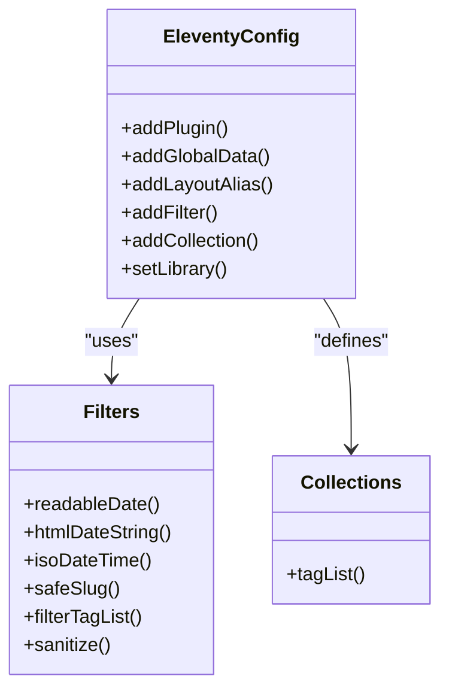

**Diagram sources**
- [.eleventy.js:9-23](file://.eleventy.js#L9-L23)
- [.eleventy.js:25-70](file://.eleventy.js#L25-L70)
- [.eleventy.js:72-95](file://.eleventy.js#L72-L95)
- [.eleventy.js:106-116](file://.eleventy.js#L106-L116)

**Section sources**
- [.eleventy.js:1-160](file://.eleventy.js#L1-L160)
- [post.njk:1-6](file://_includes/layouts/post.njk#L1-L6)

## Dependency Analysis
- External Dependencies
  - python-frontmatter: Parsing product frontmatter
  - requests: HTTP client for GROQ API
  - Node/Eleventy: Build and render static site
- Internal Coupling
  - blog_bot.py orchestrates data extraction, AI generation, and file writes
  - GitHub Actions coordinates environment setup, execution, and commit steps
  - Eleventy config ensures consistent slug/tag handling and markdown processing

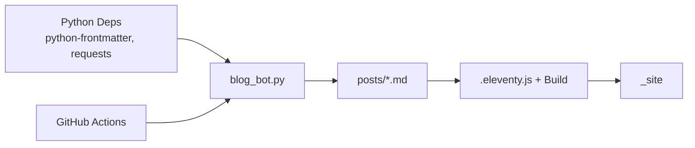

**Diagram sources**
- [blog_bot.py:1-8](file://blog_bot.py#L1-L8)
- [blog_bot.yml:26-44](file://.github/workflows/blog_bot.yml#L26-L44)
- [.eleventy.js:146-159](file://.eleventy.js#L146-L159)

**Section sources**
- [blog_bot.py:1-8](file://blog_bot.py#L1-L8)
- [blog_bot.yml:26-44](file://.github/workflows/blog_bot.yml#L26-L44)
- [.eleventy.js:146-159](file://.eleventy.js#L146-L159)

## Performance Considerations
- Large Catalog Handling
  - History-based selection avoids repeated work and distributes coverage
  - Consider batching strategies if scaling beyond single-run generation
- API Efficiency
  - Single request per product; consider caching prompts and responses for identical inputs
  - Model choice (llama-3.3-70b-versatile) balances quality and latency; monitor token usage
- Build Validation
  - Filename checks prevent deployment issues; keep slugification robust
- Local Testing
  - Use test script to validate post structure without network calls

[No sources needed since this section provides general guidance]

## Troubleshooting Guide
- Missing API Key
  - Symptom: Script exits early due to missing GROQ_API_KEY
  - Resolution: Set GROQ_API_KEY in environment or GitHub Secrets
- API Errors
  - Symptom: HTTP errors or malformed JSON responses
  - Resolution: Inspect response logs; verify key validity and rate limits; retry with different product if transient
- Duplicate Content
  - Symptom: Same product generates multiple posts
  - Resolution: Review blog_log.json; clear or prune entries as needed; ensure save step executes
- Invalid Filenames
  - Symptom: Build fails due to forbidden characters in filenames
  - Resolution: Adjust slugify logic; use check-filenames.js to detect issues before commit
- Manual Intervention
  - Use local test script to generate a post with mock data and inspect frontmatter/content structure
  - Edit generated posts manually if needed; then rebuild site

**Section sources**
- [blog_bot.py:210-213](file://blog_bot.py#L210-L213)
- [blog_bot.py:95-97](file://blog_bot.py#L95-L97)
- [check-filenames.js:22-44](file://scripts/check-filenames.js#L22-L44)
- [test_blog_bot_run.py:1-10](file://scripts/test_blog_bot_run.py#L1-L10)

## Conclusion
The AI-powered blog generation system delivers a reliable, scalable pipeline for producing SEO-focused, UAE-localized content. By combining structured prompt engineering, robust history management, and automated CI/CD integration, it ensures consistent quality and efficient coverage across large product catalogs. With built-in safeguards (sanitization, filename validation) and clear troubleshooting paths, the system supports both automated operations and manual oversight when necessary.