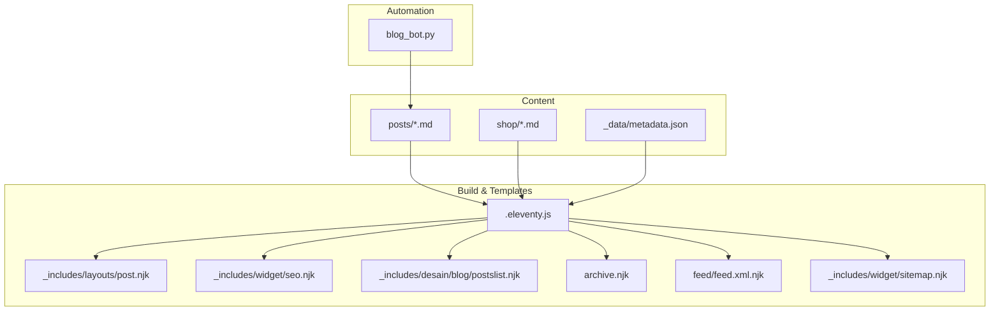
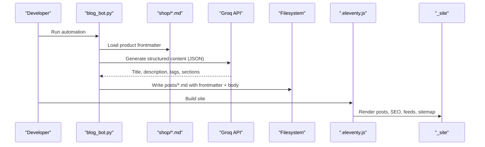
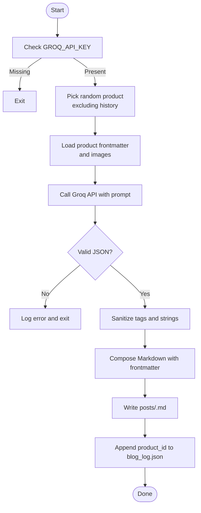
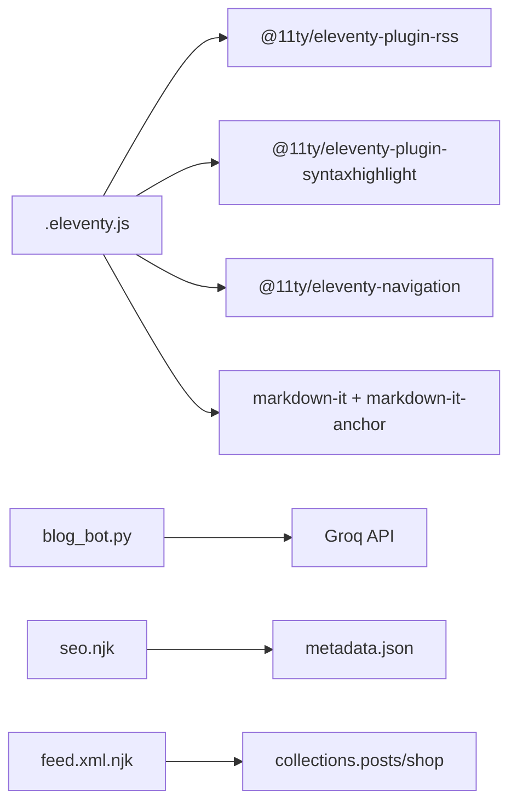

# Blog Post Management

<cite>
**Referenced Files in This Document**
- [blog_bot.py](file://blog_bot.py)
- [.eleventy.js](file://.eleventy.js)
- [metadata.json](file://_data/metadata.json)
- [seo.njk](file://_includes/widget/seo.njk)
- [post.njk](file://_includes/layouts/post.njk)
- [postslist.njk](file://_includes/desain/blog/postslist.njk)
- [archive.njk](file://archive.njk)
- [feed.xml.njk](file://feed/feed.xml.njk)
- [sitemap.njk](file://_includes/widget/sitemap.njk)
- [best-gift-ideas-in-uae-2025.md](file://posts/best-gift-ideas-in-uae-2025.md)
- [elevate-your-tea-game-in-dubai-abu-dhabi-with-power-king-the-ultimate-15l-glass-teapot-for-2025.md](file://posts/elevate-your-tea-game-in-dubai-abu-dhabi-with-power-king-the-ultimate-15l-glass-teapot-for-2025.md)
- [B0CLHGCYRN.md](file://shop/B0CLHGCYRN.md)
</cite>

## Table of Contents
1. Introduction
2. Project Structure
3. Core Components
4. Architecture Overview
5. Detailed Component Analysis
6. Dependency Analysis
7. Performance Considerations
8. Troubleshooting Guide
9. Conclusion

## Introduction
This document explains the blog post management system for Nillianstore, an Eleventy-based site targeting UAE audiences. It covers:
- Blog post frontmatter structure and conventions
- Content formatting standards using Markdown with examples from existing posts
- SEO optimization guidelines tailored to the UAE market
- How blog posts relate to products via tags and categories
- Automated content generation workflow powered by a blog bot
- Post organization, archival strategies, and RSS feed generation
- Performance optimization and search considerations for large collections

## Project Structure
The blog system is built on Eleventy with Markdown posts under posts/, product pages under shop/, shared layouts and widgets under _includes/, and global metadata under _data/. The build configuration centralizes filters, collections, and plugins.

**Diagram sources**
- [.eleventy.js:1-160](file://.eleventy.js#L1-L160)
- [metadata.json:1-27](file://_data/metadata.json#L1-L27)
- [post.njk:1-6](file://_includes/layouts/post.njk#L1-L6)
- [seo.njk:1-208](file://_includes/widget/seo.njk#L1-L208)
- [postslist.njk:1-11](file://_includes/desain/blog/postslist.njk#L1-L11)
- [archive.njk:1-11](file://archive.njk#L1-L11)
- [feed.xml.njk:1-63](file://feed/feed.xml.njk#L1-L63)
- [sitemap.njk:1-22](file://_includes/widget/sitemap.njk#L1-L22)
- [blog_bot.py:1-253](file://blog_bot.py#L1-L253)

**Section sources**
- [.eleventy.js:1-160](file://.eleventy.js#L1-L160)
- [metadata.json:1-27](file://_data/metadata.json#L1-L27)

## Core Components
- Build configuration and data layer:
  - Global site URL, layout aliases, date/time filters, safe slug filter, tag filtering, XML encoding, markdown-it setup with anchor links, and plugin registration (RSS, syntax highlight, navigation).
  - Global metadata including title, description, locale, author, and feed paths.
- Layouts and widgets:
  - Post layout includes header and content partials.
  - SEO widget injects meta tags, Open Graph/Twitter cards, canonical URLs, Schema.org JSON-LD for articles/products, and breadcrumb lists.
- Collections and listing:
  - Archive page renders the blog list using a reusable partial that displays cover images, titles, and descriptions.
- Feed and sitemap:
  - Atom feed template iterates over collections and emits entries with thumbnails and optional product fields.
  - Sitemap generator enumerates all pages with change frequency and priority rules.

**Section sources**
- [.eleventy.js:1-160](file://.eleventy.js#L1-L160)
- [metadata.json:1-27](file://_data/metadata.json#L1-L27)
- [post.njk:1-6](file://_includes/layouts/post.njk#L1-L6)
- [seo.njk:1-208](file://_includes/widget/seo.njk#L1-L208)
- [postslist.njk:1-11](file://_includes/desain/blog/postslist.njk#L1-L11)
- [archive.njk:1-11](file://archive.njk#L1-L11)
- [feed.xml.njk:1-63](file://feed/feed.xml.njk#L1-L63)
- [sitemap.njk:1-22](file://_includes/widget/sitemap.njk#L1-L22)

## Architecture Overview
The system combines static content (Markdown), automated generation (Python bot), and Eleventy build-time rendering. Posts are authored or generated, then compiled into HTML with rich SEO metadata and feeds.

**Diagram sources**
- [blog_bot.py:1-253](file://blog_bot.py#L1-L253)
- [.eleventy.js:1-160](file://.eleventy.js#L1-L160)

## Detailed Component Analysis

### Blog Post Frontmatter Structure
Posts use YAML frontmatter to control routing, SEO, and display. Common fields include:
- title: Page title used in headings and SEO
- description: Meta description for search engines and social previews
- cover: Primary image path for listings and OG images
- date: Publication date (YYYY-MM-DD)
- tags: Array of keywords; must include "post" for collection membership
- layout: Template alias (e.g., layouts/post.njk)
- permalink: Custom URL path for the post

Example references:
- [best-gift-ideas-in-uae-2025.md:1-28](file://posts/best-gift-ideas-in-uae-2025.md#L1-L28)
- [elevate-your-tea-game-in-dubai-abu-dhabi-with-power-king-the-ultimate-15l-glass-teapot-for-2025.md:1-22](file://posts/elevate-your-tea-game-in-dubai-abu-dhabi-with-power-king-the-ultimate-15l-glass-teapot-for-2025.md#L1-L22)

Notes:
- Tags should be concise and relevant to UAE lifestyle and product themes.
- Include "post" in tags to ensure inclusion in the posts collection.
- Use descriptive permalinks without special characters.

**Section sources**
- [best-gift-ideas-in-uae-2025.md:1-28](file://posts/best-gift-ideas-in-uae-2025.md#L1-L28)
- [elevate-your-tea-game-in-dubai-abu-dhabi-with-power-king-the-ultimate-15l-glass-teapot-for-2025.md:1-22](file://posts/elevate-your-tea-game-in-dubai-abu-dhabi-with-power-king-the-ultimate-15l-glass-teapot-for-2025.md#L1-L22)

### Content Formatting Standards (Markdown)
Recommended structure for posts:
- Strong opening paragraph introducing UAE context and relevance
- Product section linking to the product page
- “Why It Works” blockquote with bullet points
- “Perfect for” callout line
- Inline images with responsive styling
- Clear CTA button to Amazon.ae
- Final thought/conclusion

Examples:
- [best-gift-ideas-in-uae-2025.md:30-259](file://posts/best-gift-ideas-in-uae-2025.md#L30-L259)
- [elevate-your-tea-game-in-dubai-abu-dhabi-with-power-king-the-ultimate-15l-glass-teapot-for-2025.md:24-84](file://posts/elevate-your-tea-game-in-dubai-abu-dhabi-with-power-king-the-ultimate-15l-glass-teapot-for-2025.md#L24-L84)

Guidelines:
- Use bold text sparingly for emphasis
- Keep paragraphs short and scannable
- Link to related products and category/tag pages
- Add alt text to images for accessibility and SEO

**Section sources**
- [best-gift-ideas-in-uae-2025.md:30-259](file://posts/best-gift-ideas-in-uae-2025.md#L30-L259)
- [elevate-your-tea-game-in-dubai-abu-dhabi-with-power-king-the-ultimate-15l-glass-teapot-for-2025.md:24-84](file://posts/elevate-your-tea-game-in-dubai-abu-dhabi-with-power-king-the-ultimate-15l-glass-teapot-for-2025.md#L24-L84)

### SEO Optimization Guidelines (UAE Market)
Meta and schema handling:
- Title and description are injected via the SEO widget, falling back to global metadata when needed.
- Open Graph and Twitter cards are set with locale en_AE and site-specific handles.
- Canonical URLs point to absolute site URLs.
- Article Schema.org JSON-LD is emitted for posts; breadcrumbs enhance SERP presentation.

Implementation references:
- [seo.njk:1-208](file://_includes/widget/seo.njk#L1-L208)
- [metadata.json:1-27](file://_data/metadata.json#L1-L27)

UAE-focused recommendations:
- Place primary keyword near the beginning of title and first paragraph
- Include city names (Dubai, Abu Dhabi, Sharjah) and year where relevant
- Use localized phrases like “UAE home decor,” “gift ideas UAE,” “Ramadan Iftar gifts”
- Ensure meta description is compelling and within typical length limits
- Internal link to product pages and category/tag pages to strengthen topical authority

**Section sources**
- [seo.njk:1-208](file://_includes/widget/seo.njk#L1-L208)
- [metadata.json:1-27](file://_data/metadata.json#L1-L27)

### Relationship Between Blog Posts and Products
- Posts link directly to product pages using internal links in the body.
- Tags serve as the connective tissue between posts and products; consistent tagging enables cross-linking and discovery.
- Product pages define categories and tags that can be mirrored in posts for cohesion.

References:
- [B0CLHGCYRN.md:1-55](file://shop/B0CLHGCYRN.md#L1-L55)
- Example post linking to product: [best-gift-ideas-in-uae-2025.md:40-40](file://posts/best-gift-ideas-in-uae-2025.md#L40-L40)

Best practices:
- Mirror product tags in posts to improve discoverability
- Use category-aligned language in post titles and intros
- Maintain consistent naming across tags and categories

**Section sources**
- [B0CLHGCYRN.md:1-55](file://shop/B0CLHGCYRN.md#L1-L55)
- [best-gift-ideas-in-uae-2025.md:40-40](file://posts/best-gift-ideas-in-uae-2025.md#L40-L40)

### Automated Content Generation Workflow (Blog Bot)
The Python bot automates post creation by:
- Selecting a random product not yet processed (tracked in a log file)
- Loading product frontmatter and images
- Prompting an LLM to generate structured content (title, description, tags, sections)
- Writing a new Markdown post with frontmatter and formatted body
- Recording the product ID to avoid duplicates

**Diagram sources**
- [blog_bot.py:1-253](file://blog_bot.py#L1-L253)

Prompt engineering highlights:
- Role definition as expert SEO copywriter for UAE audience
- Structured output format (JSON) with required fields
- Emphasis on UAE context, catchy titles, and clear sections

Review process:
- Validate generated JSON before writing files
- Sanitize tags to remove unsafe characters and limit count
- Ensure “post” tag is present for Eleventy collection membership

**Section sources**
- [blog_bot.py:1-253](file://blog_bot.py#L1-L253)

### Post Organization and Archival Strategies
- All posts live under posts/ and are rendered via the post layout.
- The archive page at /posts/ aggregates posts using a reusable partial.
- Tag filtering removes internal tags from public lists.

References:
- [archive.njk:1-11](file://archive.njk#L1-L11)
- [postslist.njk:1-11](file://_includes/desain/blog/postslist.njk#L1-L11)
- [.eleventy.js:64-66](file://.eleventy.js#L64-L66)

Recommendations:
- Use consistent tag naming and avoid overly granular tags
- Group related posts with thematic tags (e.g., “tea lovers gifts,” “UAE home decor”)
- Periodically review and merge duplicate or overlapping tags

**Section sources**
- [archive.njk:1-11](file://archive.njk#L1-L11)
- [postslist.njk:1-11](file://_includes/desain/blog/postslist.njk#L1-L11)
- [.eleventy.js:64-66](file://.eleventy.js#L64-L66)

### RSS Feed Generation
The Atom feed template:
- Iterates over collections.posts and collections.shop
- Includes title, link, id, updated date, content snippet, thumbnail, and optional product fields
- Uses xmlEncode to safely escape content

Reference:
- [feed.xml.njk:1-63](file://feed/feed.xml.njk#L1-L63)

Guidelines:
- Keep descriptions concise and informative
- Ensure cover images are accessible and appropriately sized
- Verify dates are valid ISO formats

**Section sources**
- [feed.xml.njk:1-63](file://feed/feed.xml.njk#L1-L63)

### Search Functionality and Indexing
- Sitemap generation enumerates all pages with lastmod and prioritization rules.
- No client-side search implementation is present in the repository.

Reference:
- [sitemap.njk:1-22](file://_includes/widget/sitemap.njk#L1-L22)

Recommendations:
- Leverage sitemaps for crawler indexing
- Implement a lightweight client-side search (e.g., lunr.js) if needed
- Use structured data and clean URLs to improve discoverability

**Section sources**
- [sitemap.njk:1-22](file://_includes/widget/sitemap.njk#L1-L22)

## Dependency Analysis
Key dependencies and relationships:
- Eleventy config depends on plugins (RSS, syntax highlight, navigation) and sets up markdown-it with anchors.
- SEO widget relies on global metadata and per-page frontmatter fields.
- Blog bot depends on environment variables and external API.

**Diagram sources**
- [.eleventy.js:1-160](file://.eleventy.js#L1-L160)
- [blog_bot.py:1-253](file://blog_bot.py#L1-L253)
- [seo.njk:1-208](file://_includes/widget/seo.njk#L1-L208)
- [metadata.json:1-27](file://_data/metadata.json#L1-L27)
- [feed.xml.njk:1-63](file://feed/feed.xml.njk#L1-L63)

**Section sources**
- [.eleventy.js:1-160](file://.eleventy.js#L1-L160)
- [blog_bot.py:1-253](file://blog_bot.py#L1-L253)
- [seo.njk:1-208](file://_includes/widget/seo.njk#L1-L208)
- [metadata.json:1-27](file://_data/metadata.json#L1-L27)
- [feed.xml.njk:1-63](file://feed/feed.xml.njk#L1-L63)

## Performance Considerations
- Image optimization:
  - Use WebP images and lazy loading attributes where applicable
  - Limit inline styles and keep image markup minimal
- Asset passthrough:
  - Only copy necessary directories (img, css, videos) to reduce build size
- Collection efficiency:
  - Avoid excessive tags; consolidate synonyms
  - Use safeSlug consistently to prevent duplicate tag pages
- Rendering:
  - Prefer server-side rendering benefits of Eleventy
  - Minimize heavy JS in templates; defer non-critical scripts

[No sources needed since this section provides general guidance]

## Troubleshooting Guide
Common issues and resolutions:
- Missing API key:
  - Ensure GROQ_API_KEY is set before running the bot
- Invalid JSON from LLM:
  - Validate response structure and sanitize tags before writing files
- Duplicate posts:
  - Check blog_log.json to avoid reprocessing the same product
- Tag sanitization:
  - Remove problematic characters and normalize apostrophes to avoid filename issues
- Date formatting:
  - Use htmlDateString and isoDateTime filters for consistent outputs

References:
- [blog_bot.py:1-253](file://blog_bot.py#L1-L253)
- [.eleventy.js:26-37](file://.eleventy.js#L26-L37)

**Section sources**
- [blog_bot.py:1-253](file://blog_bot.py#L1-L253)
- [.eleventy.js:26-37](file://.eleventy.js#L26-L37)

## Conclusion
The blog post management system integrates automated content generation with robust Eleventy build-time processing to deliver SEO-friendly, UAE-targeted posts. By adhering to frontmatter conventions, content formatting standards, and SEO best practices, teams can scale content production while maintaining quality and discoverability. Automation streamlines workflows, and careful tag management ensures cohesive navigation and performance.

[No sources needed since this section summarizes without analyzing specific files]