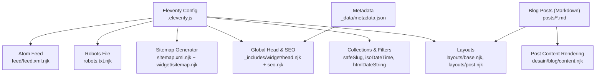
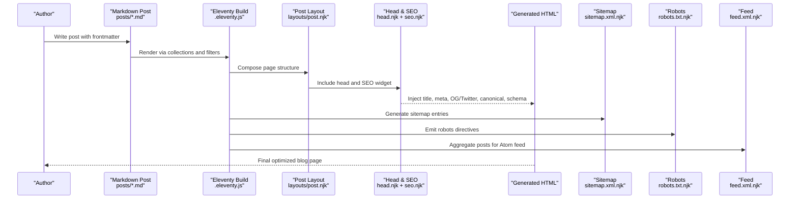
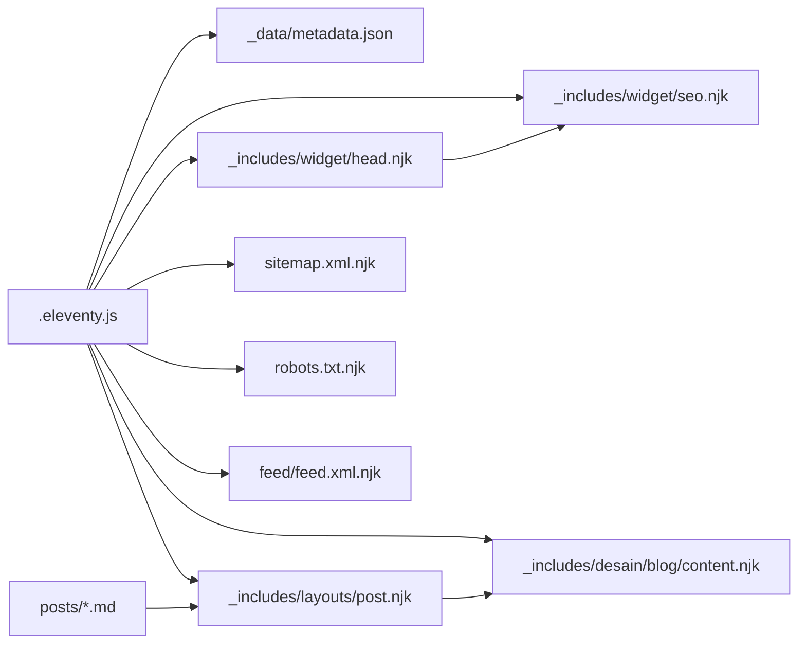

# Blog SEO Optimization

<cite>
**Referenced Files in This Document**
- [README.md](file://README.md)
- [.eleventy.js](file://.eleventy.js)
- [_includes/widget/head.njk](file://_includes/widget/head.njk)
- [_includes/widget/seo.njk](file://_includes/widget/seo.njk)
- [_includes/layouts/base.njk](file://_includes/layouts/base.njk)
- [_includes/layouts/post.njk](file://_includes/layouts/post.njk)
- [_includes/desain/blog/content.njk](file://_includes/desain/blog/content.njk)
- [_includes/desain/blog/post.njk](file://_includes/desain/blog/post.njk)
- [_data/metadata.json](file://_data/metadata.json)
- [sitemap.xml.njk](file://sitemap.xml.njk)
- [_includes/widget/sitemap.njk](file://_includes/widget/sitemap.njk)
- [robots.txt.njk](file://robots.txt.njk)
- [feed/feed.xml.njk](file://feed/feed.xml.njk)
- [posts/posts.json](file://posts/posts.json)
- [posts/best-gift-ideas-in-uae-2025.md](file://posts/best-gift-ideas-in-uae-2025.md)
- [posts/elevate-your-2025-uae-lifestyle-with-our-stunning-double-walled-glass-mug-perfect-for-dubai-and-abu-dhabi-homes.md](file://posts/elevate-your-2025-uae-lifestyle-with-our-stunning-double-walled-glass-mug-perfect-for-dubai-and-abu-dhabi-homes.md)
</cite>

## Table of Contents
1. Introduction
2. Project Structure
3. Core Components
4. Architecture Overview
5. Detailed Component Analysis
6. Dependency Analysis
7. Performance Considerations
8. Troubleshooting Guide
9. Conclusion
10. Appendices

## Introduction
This document provides a comprehensive SEO optimization guide for blog posts targeting the UAE market, tailored to the Eleventy-based site structure and content patterns found in this repository. It covers keyword research strategies with cultural and seasonal considerations, on-page SEO implementation (title tags, meta descriptions, header hierarchy, internal linking), schema markup for rich snippets, Open Graph and Twitter Card optimization, technical SEO (URLs, canonical URLs, sitemaps, RSS feeds), performance and image SEO best practices, mobile-first indexing considerations, and monitoring/analytics setup for tracking blog performance in the UAE.

The guidance references actual files in the codebase to ensure accuracy and actionability.

## Project Structure
The site is built with Eleventy using Nunjucks templates and Markdown content. Key areas relevant to blog SEO include:
- Global head and SEO widget for metadata, Open Graph, Twitter Cards, canonical URL, robots directive, and structured data
- Layouts for base and post pages
- Collections and filters for dates, slugs, and safe slug generation
- Sitemap and robots configuration
- Atom feed for syndication
- Blog post frontmatter conventions and examples

**Diagram sources**
- [.eleventy.js:1-160](file://.eleventy.js#L1-L160)
- [_includes/widget/head.njk:1-114](file://_includes/widget/head.njk#L1-L114)
- [_includes/widget/seo.njk:1-254](file://_includes/widget/seo.njk#L1-L254)
- [_includes/layouts/base.njk:1-62](file://_includes/layouts/base.njk#L1-L62)
- [_includes/layouts/post.njk:1-6](file://_includes/layouts/post.njk#L1-L6)
- [_includes/desain/blog/content.njk:1-8](file://_includes/desain/blog/content.njk#L1-L8)
- [_data/metadata.json:1-47](file://_data/metadata.json#L1-L47)
- [sitemap.xml.njk:1-6](file://sitemap.xml.njk#L1-L6)
- [_includes/widget/sitemap.njk:1-22](file://_includes/widget/sitemap.njk#L1-L22)
- [robots.txt.njk:1-8](file://robots.txt.njk#L1-L8)
- [feed/feed.xml.njk:1-63](file://feed/feed.xml.njk#L1-L63)

**Section sources**
- [.eleventy.js:1-160](file://.eleventy.js#L1-L160)
- [_includes/widget/head.njk:1-114](file://_includes/widget/head.njk#L1-L114)
- [_includes/widget/seo.njk:1-254](file://_includes/widget/seo.njk#L1-L254)
- [_includes/layouts/base.njk:1-62](file://_includes/layouts/base.njk#L1-L62)
- [_includes/layouts/post.njk:1-6](file://_includes/layouts/post.njk#L1-L6)
- [_includes/desain/blog/content.njk:1-8](file://_includes/desain/blog/content.njk#L1-L8)
- [_data/metadata.json:1-47](file://_data/metadata.json#L1-L47)
- [sitemap.xml.njk:1-6](file://sitemap.xml.njk#L1-L6)
- [_includes/widget/sitemap.njk:1-22](file://_includes/widget/sitemap.njk#L1-L22)
- [robots.txt.njk:1-8](file://robots.txt.njk#L1-L8)
- [feed/feed.xml.njk:1-63](file://feed/feed.xml.njk#L1-L63)

## Core Components
- Global head and SEO injection: The head template includes the SEO widget which renders title, description, Open Graph, Twitter Cards, canonical URL, robots directive, Google verification, and JSON-LD structured data based on page type.
- Post layout: The post layout composes the blog header and content sections.
- Metadata: Centralized site-wide metadata including locale en_AE, social handles, business info, and feed paths.
- Sitemap and robots: Generated sitemap and robots file configured for crawling and indexing.
- Atom feed: Syndication feed for posts and shop items.
- Eleventy config: Adds plugins, global data, filters (including ISO datetime with Asia/Dubai timezone), safe slug normalization, collections, and passthrough assets.

Key implementation anchors:
- Title tag and meta description rendering
- Open Graph and Twitter Card fields
- Canonical URL and robots directive
- Article schema for blog posts
- BreadcrumbList schema
- Locale set to en_AE
- Date formatting with Dubai timezone for structured data
- Safe slug filter for clean URLs

**Section sources**
- [_includes/widget/head.njk:1-114](file://_includes/widget/head.njk#L1-L114)
- [_includes/widget/seo.njk:1-254](file://_includes/widget/seo.njk#L1-L254)
- [_includes/layouts/post.njk:1-6](file://_includes/layouts/post.njk#L1-L6)
- [_data/metadata.json:1-47](file://_data/metadata.json#L1-L47)
- [sitemap.xml.njk:1-6](file://sitemap.xml.njk#L1-L6)
- [_includes/widget/sitemap.njk:1-22](file://_includes/widget/sitemap.njk#L1-L22)
- [robots.txt.njk:1-8](file://robots.txt.njk#L1-L8)
- [feed/feed.xml.njk:1-63](file://feed/feed.xml.njk#L1-L63)
- [.eleventy.js:1-160](file://.eleventy.js#L1-L160)

## Architecture Overview
The blog SEO pipeline integrates content authoring, templating, and build-time optimizations:
- Authors write Markdown posts with frontmatter (title, description, cover, date, tags, permalink).
- Eleventy processes posts into HTML using layouts and includes.
- The head template injects SEO metadata and structured data.
- Sitemap and robots are generated at build time.
- Atom feed aggregates posts for syndication.

**Diagram sources**
- [posts/best-gift-ideas-in-uae-2025.md:1-259](file://posts/best-gift-ideas-in-uae-2025.md#L1-L259)
- [.eleventy.js:1-160](file://.eleventy.js#L1-L160)
- [_includes/layouts/post.njk:1-6](file://_includes/layouts/post.njk#L1-L6)
- [_includes/widget/head.njk:1-114](file://_includes/widget/head.njk#L1-L114)
- [_includes/widget/seo.njk:1-254](file://_includes/widget/seo.njk#L1-L254)
- [sitemap.xml.njk:1-6](file://sitemap.xml.njk#L1-L6)
- [robots.txt.njk:1-8](file://robots.txt.njk#L1-L8)
- [feed/feed.xml.njk:1-63](file://feed/feed.xml.njk#L1-L63)

## Detailed Component Analysis

### Keyword Research Strategies for UAE Market
- Cultural considerations:
  - Incorporate culturally relevant terms such as Eid, Ramadan, Mother’s Day, housewarming, and local lifestyle themes that resonate with UAE audiences.
  - Use city-specific modifiers like Dubai, Abu Dhabi, Sharjah to capture localized search intent.
- Seasonal trends:
  - Plan content around key periods: Ramadan/Eid, National Day, back-to-school, summer promotions, and holiday gifting seasons.
- Practical steps:
  - Start with seed keywords from existing post titles and tags (e.g., “gift ideas UAE,” “Dubai home decor”).
  - Expand using related queries and long-tail variations observed in post frontmatter and tags.
  - Validate demand by checking trending topics and regional shopping behavior reflected in product categories and gift guides.

Implementation anchors:
- Existing post tags demonstrate UAE-focused keyword usage and seasonal framing.
- Titles and descriptions integrate location and occasion modifiers.

**Section sources**
- [posts/best-gift-ideas-in-uae-2025.md:1-259](file://posts/best-gift-ideas-in-uae-2025.md#L1-L259)
- [posts/elevate-your-2025-uae-lifestyle-with-our-stunning-double-walled-glass-mug-perfect-for-dubai-and-abu-dhabi-homes.md:1-82](file://posts/elevate-your-2025-uae-lifestyle-with-our-stunning-double-walled-glass-mug-perfect-for-dubai-and-abu-dhabi-homes.md#L1-L82)

### On-Page SEO Implementation
- Title tag optimization:
  - Ensure each post has a unique, descriptive title reflecting primary keyword and locality.
  - Keep titles concise and compelling; avoid duplication across posts.
- Meta description writing:
  - Provide clear, benefit-driven summaries that include target keywords and call-to-action cues.
  - Maintain consistent length suitable for SERP display.
- Header tag hierarchy:
  - Use a single H1 per page (typically the post title).
  - Organize content with H2/H3 subheads to improve readability and topical structure.
- Internal linking strategies:
  - Link to related posts and product pages within content to distribute authority and aid navigation.
  - Use descriptive anchor text aligned with target keywords.

Current implementation anchors:
- Title and description are rendered from frontmatter or metadata.
- Canonical URL is set globally.
- Robots directive allows indexing.

**Section sources**
- [_includes/widget/seo.njk:1-254](file://_includes/widget/seo.njk#L1-L254)
- [_includes/widget/head.njk:1-114](file://_includes/widget/head.njk#L1-L114)
- [posts/best-gift-ideas-in-uae-2025.md:1-259](file://posts/best-gift-ideas-in-uae-2025.md#L1-L259)

### Schema Markup and Structured Data
- Article schema for blog posts:
  - Includes headline, image, publication/modification dates, mainEntityOfPage, author, publisher, and description.
- BreadcrumbList schema:
  - Provides hierarchical navigation context for non-home pages.
- Organization and WebSite schemas:
  - Present on homepage to establish entity information and site identity.

Recommendations:
- Ensure dates use ISO 8601 format with appropriate timezone (Asia/Dubai) for accurate indexing.
- Verify image URLs are absolute and accessible.
- Keep author and publisher details consistent with metadata.

**Section sources**
- [_includes/widget/seo.njk:1-254](file://_includes/widget/seo.njk#L1-L254)
- [.eleventy.js:34-37](file://.eleventy.js#L34-L37)

### Open Graph and Twitter Card Optimization
- Open Graph:
  - og:title, og:description, og:type, og:url, og:image, og:locale set dynamically.
  - Type switches between website, article, and product based on tags.
- Twitter Cards:
  - twitter:title, twitter:description, twitter:card, twitter:site, twitter:creator, twitter:url, twitter:image, twitter:image:alt configured.
- Social sharing best practices:
  - Use high-quality cover images with descriptive alt text.
  - Ensure og:image dimensions meet platform recommendations.

**Section sources**
- [_includes/widget/seo.njk:1-254](file://_includes/widget/seo.njk#L1-L254)
- [_data/metadata.json:1-47](file://_data/metadata.json#L1-L47)

### Technical SEO: URL Structure, Canonical URLs, Sitemaps, RSS Feeds
- URL structure:
  - Clean permalinks defined in post frontmatter; safe slug filter normalizes tags for stable URLs.
- Canonical URLs:
  - Canonical link injected per page to prevent duplicate content issues.
- Sitemap inclusion:
  - Sitemap generator includes all non-excluded pages with changefreq and priority hints.
- RSS/Atom feed:
  - Atom feed aggregates posts and shop items; alternate links declared in head.

Operational notes:
- Use absolute URLs for resources and links.
- Exclude sensitive or utility pages from sitemap where appropriate.

**Section sources**
- [.eleventy.js:48-66](file://.eleventy.js#L48-L66)
- [_includes/widget/seo.njk:43-44](file://_includes/widget/seo.njk#L43-L44)
- [sitemap.xml.njk:1-6](file://sitemap.xml.njk#L1-L6)
- [_includes/widget/sitemap.njk:1-22](file://_includes/widget/sitemap.njk#L1-L22)
- [feed/feed.xml.njk:1-63](file://feed/feed.xml.njk#L1-L63)
- [_includes/widget/head.njk:56-57](file://_includes/widget/head.njk#L56-L57)

### Performance Optimization Techniques for Blog Pages
- Resource loading:
  - Preload critical CSS and defer non-critical scripts to reduce render-blocking.
  - Use preconnect and dns-prefetch for third-party CDNs.
- JavaScript handling:
  - Defer heavy libraries until after DOMContentLoaded; initialize only when needed.
- Image optimization:
  - Serve modern formats (WebP), responsive sizing, and lazy-loading where applicable.
- Caching and CDN:
  - Leverage browser caching and CDN delivery for static assets.

Current implementation anchors:
- Preload CSS and defer Swiper JS initialization.
- Preconnect/dns-prefetch for external CDNs.

**Section sources**
- [_includes/widget/head.njk:10-41](file://_includes/widget/head.njk#L10-L41)
- [_includes/widget/head.njk:47-60](file://_includes/widget/head.njk#L47-L60)

### Image SEO Best Practices
- Alt text:
  - Provide meaningful alt attributes describing the image content and context.
- File naming:
  - Use descriptive filenames that reflect content and keywords.
- Dimensions and compression:
  - Optimize file sizes and serve appropriately sized images for devices.
- Contextual relevance:
  - Place images near relevant headings and paragraphs to reinforce topical signals.

Evidence in posts:
- Images include descriptive alt text and are embedded within content sections.

**Section sources**
- [posts/best-gift-ideas-in-uae-2025.md:40-74](file://posts/best-gift-ideas-in-uae-2025.md#L40-L74)
- [posts/elevate-your-2025-uae-lifestyle-with-our-stunning-double-walled-glass-mug-perfect-for-dubai-and-abu-dhabi-homes.md:42-74](file://posts/elevate-your-2025-uae-lifestyle-with-our-stunning-double-walled-glass-mug-perfect-for-dubai-and-abu-dhabi-homes.md#L42-L74)

### Mobile-First Indexing Considerations
- Viewport and theme color:
  - Proper viewport meta ensures correct scaling and PWA-like experience.
- Responsive design:
  - Use fluid layouts and media queries to optimize for mobile screens.
- Touch-friendly interactions:
  - Ensure buttons and links have adequate tap targets.
- Avoid intrusive interstitials:
  - Minimize pop-ups that hinder mobile usability.

Current implementation anchors:
- Viewport and theme-color meta tags present.
- Bootstrap classes used for responsive layout.

**Section sources**
- [_includes/widget/head.njk:4-8](file://_includes/widget/head.njk#L4-L8)
- [_includes/desain/blog/content.njk:1-8](file://_includes/desain/blog/content.njk#L1-L8)

### Monitoring and Analytics Setup for UAE Markets
- Analytics integration:
  - Google Analytics (gtag.js) included in head for traffic measurement.
- Search Console:
  - Submit sitemap and verify site ownership to monitor indexing and performance.
- Regional insights:
  - Segment analytics by country (UAE) and device type to understand mobile vs desktop behavior.
- Content performance:
  - Track top-performing posts, bounce rates, and conversion actions (e.g., affiliate clicks).

Current implementation anchors:
- gtag.js script added to head with configuration.

**Section sources**
- [_includes/widget/head.njk:90-98](file://_includes/widget/head.njk#L90-L98)
- [sitemap.xml.njk:1-6](file://sitemap.xml.njk#L1-L6)

## Dependency Analysis
The following diagram maps core dependencies among templates, data, and build configuration:

**Diagram sources**
- [.eleventy.js:1-160](file://.eleventy.js#L1-L160)
- [_data/metadata.json:1-47](file://_data/metadata.json#L1-L47)
- [_includes/widget/head.njk:1-114](file://_includes/widget/head.njk#L1-L114)
- [_includes/widget/seo.njk:1-254](file://_includes/widget/seo.njk#L1-L254)
- [_includes/layouts/post.njk:1-6](file://_includes/layouts/post.njk#L1-L6)
- [_includes/desain/blog/content.njk:1-8](file://_includes/desain/blog/content.njk#L1-L8)
- [sitemap.xml.njk:1-6](file://sitemap.xml.njk#L1-L6)
- [robots.txt.njk:1-8](file://robots.txt.njk#L1-L8)
- [feed/feed.xml.njk:1-63](file://feed/feed.xml.njk#L1-L63)

**Section sources**
- [.eleventy.js:1-160](file://.eleventy.js#L1-L160)
- [_includes/widget/head.njk:1-114](file://_includes/widget/head.njk#L1-L114)
- [_includes/widget/seo.njk:1-254](file://_includes/widget/seo.njk#L1-L254)
- [_includes/layouts/post.njk:1-6](file://_includes/layouts/post.njk#L1-L6)
- [_includes/desain/blog/content.njk:1-8](file://_includes/desain/blog/content.njk#L1-L8)
- [sitemap.xml.njk:1-6](file://sitemap.xml.njk#L1-L6)
- [robots.txt.njk:1-8](file://robots.txt.njk#L1-L8)
- [feed/feed.xml.njk:1-63](file://feed/feed.xml.njk#L1-L63)

## Performance Considerations
- Prioritize critical rendering path:
  - Inline minimal CSS if necessary; preload essential stylesheets.
- Defer non-critical scripts:
  - Initialize interactive components only when visible or required.
- Optimize images:
  - Convert to WebP/AVIF, implement responsive srcset, and lazy-load below-the-fold images.
- Reduce third-party overhead:
  - Load social widgets conditionally and defer their initialization.
- Monitor Core Web Vitals:
  - Track LCP, INP, CLS to maintain strong user experience metrics.

[No sources needed since this section provides general guidance]

## Troubleshooting Guide
Common issues and resolutions:
- Missing or incorrect canonical URL:
  - Verify canonical link injection and ensure absolute URLs.
- Duplicate content warnings:
  - Confirm robots directive and canonical settings; exclude non-indexable pages from sitemap.
- Structured data errors:
  - Validate JSON-LD using testing tools; ensure required fields (headline, image, datePublished, author, publisher) are present and correctly formatted.
- Sitemap not updated:
  - Rebuild site to regenerate sitemap; check exclusions and lastmod values.
- Feed syndication problems:
  - Ensure feed path is accessible and alternate links are declared in head.

**Section sources**
- [_includes/widget/seo.njk:43-44](file://_includes/widget/seo.njk#L43-L44)
- [_includes/widget/sitemap.njk:1-22](file://_includes/widget/sitemap.njk#L1-L22)
- [feed/feed.xml.njk:1-63](file://feed/feed.xml.njk#L1-L63)
- [_includes/widget/head.njk:56-57](file://_includes/widget/head.njk#L56-L57)

## Conclusion
By aligning content strategy with UAE cultural and seasonal trends, implementing robust on-page SEO, leveraging structured data and social metadata, and ensuring technical foundations (URLs, canonicalization, sitemaps, feeds) are solid, the blog can achieve stronger visibility and engagement in the UAE market. Continuous monitoring through analytics and search console will help refine performance and adapt to evolving user behavior.

[No sources needed since this section summarizes without analyzing specific files]

## Appendices

### Blog Post Frontmatter Checklist
- title: Unique, keyword-rich, and region-aware
- description: Clear summary with primary keyword and value proposition
- cover: High-quality image path for OG/Twitter cards
- date: Accurate publication date (used for schema and feed)
- tags: Relevant keywords and category tags (post, posts)
- layout: Reference to post layout
- permalink: Clean, readable URL path

**Section sources**
- [posts/best-gift-ideas-in-uae-2025.md:1-28](file://posts/best-gift-ideas-in-uae-2025.md#L1-L28)
- [posts/elevate-your-2025-uae-lifestyle-with-our-stunning-double-walled-glass-mug-perfect-for-dubai-and-abu-dhabi-homes.md:1-21](file://posts/elevate-your-2025-uae-lifestyle-with-our-stunning-double-walled-glass-mug-perfect-for-dubai-and-abu-dhabi-homes.md#L1-L21)
- [posts/posts.json:1-6](file://posts/posts.json#L1-L6)