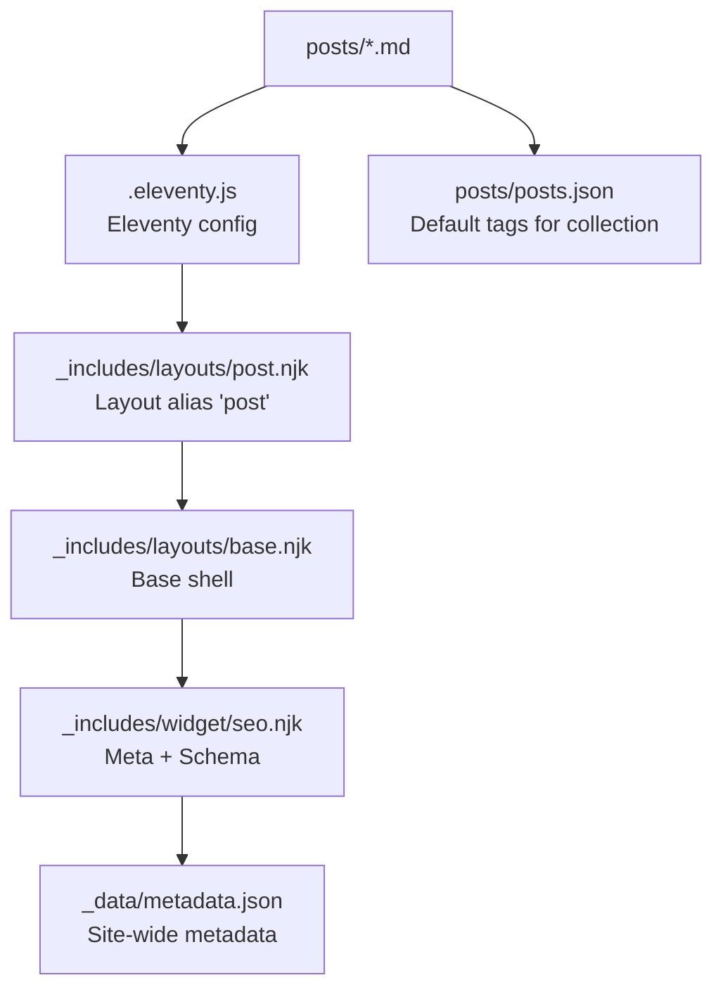
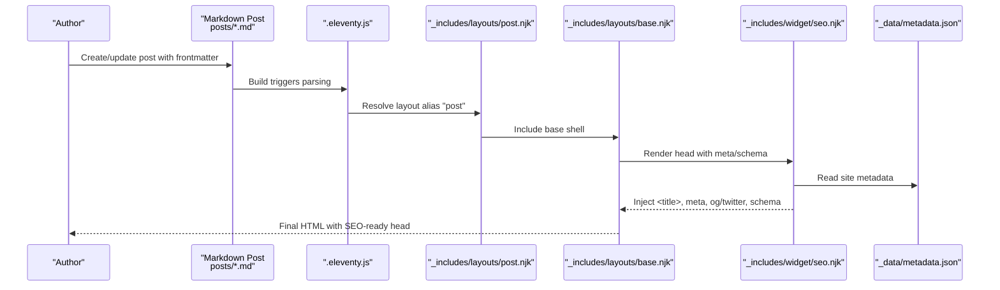
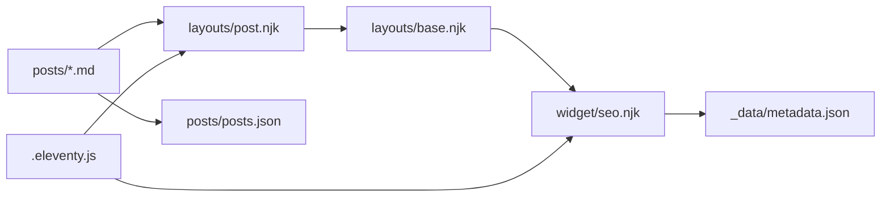

# Manual Blog Post Creation

<cite>
**Referenced Files in This Document**
- [.eleventy.js](file://.eleventy.js)
- [metadata.json](file://_data/metadata.json)
- [seo.njk](file://_includes/widget/seo.njk)
- [post.njk](file://_includes/layouts/post.njk)
- [base.njk](file://_includes/layouts/base.njk)
- [posts.json](file://posts/posts.json)
- [best-gift-ideas-in-uae-2025.md](file://posts/best-gift-ideas-in-uae-2025.md)
- [elevate-your-tea-game-in-dubai-abu-dhabi-with-power-king-the-ultimate-15l-glass-teapot-for-2025.md](file://posts/elevate-your-tea-game-in-dubai-abu-dhabi-with-power-king-the-ultimate-15l-glass-teapot-for-2025.md)
- [illuminate-your-childs-dreams-cute-panda-night-light-for-kids-in-dubai-abu-dhabi-and-across-the-uae-2025.md](file://posts/illuminate-your-childs-dreams-cute-panda-night-light-for-kids-in-dubai-abu-dhabi-and-across-the-uae-2025.md)
- [best-padel-racket-protectors-uae-2025.md](file://posts/best-padel-racket-protectors-uae-2025.md)
</cite>

## Table of Contents
1. Introduction
2. Project Structure
3. Core Components
4. Architecture Overview
5. Detailed Component Analysis
6. Dependency Analysis
7. Performance Considerations
8. Troubleshooting Guide
9. Conclusion
10. Appendices

## Introduction
This guide explains how to manually create blog posts for the site, including frontmatter requirements, Markdown standards, SEO practices tailored for the UAE market, content organization, tag management, image optimization, and step-by-step instructions for creating new posts with correct naming conventions and file structure.

## Project Structure
Blog posts are stored under the posts directory as Markdown files. Each post uses a layout alias that maps to a Nunjucks template. The build system is configured via Eleventy, which sets up plugins, filters, collections, and markdown processing. Global metadata (site title, description, locale, social links) is defined centrally and consumed by the SEO widget.

**Diagram sources**
- [.eleventy.js:1-160](file://.eleventy.js#L1-L160)
- [post.njk:1-6](file://_includes/layouts/post.njk#L1-L6)
- [base.njk:1-62](file://_includes/layouts/base.njk#L1-L62)
- [seo.njk:1-231](file://_includes/widget/seo.njk#L1-L231)
- [metadata.json:1-47](file://_data/metadata.json#L1-L47)
- [posts.json:1-6](file://posts/posts.json#L1-L6)

**Section sources**
- [.eleventy.js:1-160](file://.eleventy.js#L1-L160)
- [posts.json:1-6](file://posts/posts.json#L1-L6)
- [metadata.json:1-47](file://_data/metadata.json#L1-L47)

## Core Components
- Frontmatter fields used by posts:
  - title: Page title (used in <title>, Open Graph, Twitter, Schema).
  - description: Meta description (used in meta description, OG/Twitter descriptions, Schema).
  - cover: Cover image path (used in OG/Twitter images and Schema Article image).
  - date: Publication date (used in Schema Article dates; formatted via filters).
  - tags: Array of tags (used for categorization, filtering, and schema type detection).
  - layout: Layout alias (maps to layouts/post.njk).
  - permalink: Custom URL path for the post.
- Layout aliasing:
  - The "post" alias points to _includes/layouts/post.njk.
- SEO widget:
  - Reads title, description, cover, tags, and page.url to generate meta tags, Open Graph, Twitter cards, canonical link, and structured data (Article or Organization/WebSite).
- Metadata:
  - Site-wide values such as title, description, url, locale, author, business info, and social links are centralized in _data/metadata.json and referenced by the SEO widget.

**Section sources**
- [seo.njk:1-231](file://_includes/widget/seo.njk#L1-L231)
- [post.njk:1-6](file://_includes/layouts/post.njk#L1-L6)
- [metadata.json:1-47](file://_data/metadata.json#L1-L47)

## Architecture Overview
The end-to-end flow from a Markdown post to rendered HTML with SEO metadata:

**Diagram sources**
- [.eleventy.js:1-160](file://.eleventy.js#L1-L160)
- [post.njk:1-6](file://_includes/layouts/post.njk#L1-L6)
- [base.njk:1-62](file://_includes/layouts/base.njk#L1-L62)
- [seo.njk:1-231](file://_includes/widget/seo.njk#L1-L231)
- [metadata.json:1-47](file://_data/metadata.json#L1-L47)

## Detailed Component Analysis

### Frontmatter Specification
Required and recommended fields:
- title: Human-readable title; also drives <title>, OG, Twitter, and Schema headline.
- description: Concise summary for search engines and social previews.
- cover: Image path relative to site root (e.g., /img/...); used for OG/Twitter images and Schema Article image.
- date: ISO date string (YYYY-MM-DD); used for Schema Article datePublished/dateModified via isoDateTime filter.
- tags: Array of strings; must include "post" to trigger Article schema and correct breadcrumb generation.
- layout: Must be set to layouts/post.njk to use the blog layout.
- permalink: Absolute path starting with /posts/... to control final URL.

Notes:
- Tags are filtered for navigation/collections; reserved tags like all, nav, post, posts, shop, shops are handled specially by filters and collections.
- The "post" tag is required for article-type rendering and breadcrumbs.

Examples of existing posts demonstrating these fields:
- [best-gift-ideas-in-uae-2025.md:1-28](file://posts/best-gift-ideas-in-uae-2025.md#L1-L28)
- [elevate-your-tea-game-in-dubai-abu-dhabi-with-power-king-the-ultimate-15l-glass-teapot-for-2025.md:1-22](file://posts/elevate-your-tea-game-in-dubai-abu-dhabi-with-power-king-the-ultimate-15l-glass-teapot-for-2025.md#L1-L22)
- [illuminate-your-childs-dreams-cute-panda-night-light-for-kids-in-dubai-abu-dhabi-and-across-the-uae-2025.md:1-23](file://posts/illuminate-your-childs-dreams-cute-panda-night-light-for-kids-in-dubai-abu-dhabi-and-across-the-uae-2025.md#L1-L23)

**Section sources**
- [best-gift-ideas-in-uae-2025.md:1-28](file://posts/best-gift-ideas-in-uae-2025.md#L1-L28)
- [elevate-your-tea-game-in-dubai-abu-dhabi-with-power-king-the-ultimate-15l-glass-teapot-for-2025.md:1-22](file://posts/elevate-your-tea-game-in-dubai-abu-dhabi-with-power-king-the-ultimate-15l-glass-teapot-for-2025.md#L1-L22)
- [illuminate-your-childs-dreams-cute-panda-night-light-for-kids-in-dubai-abu-dhabi-and-across-the-uae-2025.md:1-23](file://posts/illuminate-your-childs-dreams-cute-panda-night-light-for-kids-in-dubai-abu-dhabi-and-across-the-uae-2025.md#L1-L23)
- [.eleventy.js:64-95](file://.eleventy.js#L64-L95)

### Markdown Formatting Standards
Headings hierarchy:
- Use H1 once per post for the main heading.
- Use H2/H3 for sections and subsections to improve readability and anchor generation.
- Headings automatically get anchors via markdown-it-anchor configuration.

Images:
- Embed responsive images using inline styles consistent with existing posts: max-width:100%, height:auto, rounded corners, subtle shadow.
- Place images inside centered containers for alignment.
- Provide descriptive alt text for accessibility and SEO.

Internal linking:
- Link to product pages on your site using absolute URLs under /shop/<product-id>/ pattern.
- Example patterns can be seen in existing posts where product titles link to internal shop pages.

Amazon affiliate button integration:
- Use a centered container with an Amazon.ae link styled consistently across posts.
- Ensure target="_blank" and rel="noopener" for security.
- Keep the call-to-action clear and visually distinct.

Example references:
- [best-gift-ideas-in-uae-2025.md:40-72](file://posts/best-gift-ideas-in-uae-2025.md#L40-L72)
- [elevate-your-tea-game-in-dubai-abu-dhabi-with-power-king-the-ultimate-15l-glass-teapot-for-2025.md:30-64](file://posts/elevate-your-tea-game-in-dubai-abu-dhabi-with-power-king-the-ultimate-15l-glass-teapot-for-2025.md#L30-L64)
- [illuminate-your-childs-dreams-cute-panda-night-light-for-kids-in-dubai-abu-dhabi-and-across-the-uae-2025.md:31-66](file://posts/illuminate-your-childs-dreams-cute-panda-night-light-for-kids-in-dubai-abu-dhabi-and-across-the-uae-2025.md#L31-L66)

**Section sources**
- [.eleventy.js:107-116](file://.eleventy.js#L107-L116)
- [best-gift-ideas-in-uae-2025.md:40-72](file://posts/best-gift-ideas-in-uae-2025.md#L40-L72)
- [elevate-your-tea-game-in-dubai-abu-dhabi-with-power-king-the-ultimate-15l-glass-teapot-for-2025.md:30-64](file://posts/elevate-your-tea-game-in-dubai-abu-dhabi-with-power-king-the-ultimate-15l-glass-teapot-for-2025.md#L30-L64)
- [illuminate-your-childs-dreams-cute-panda-night-light-for-kids-in-dubai-abu-dhabi-and-across-the-uae-2025.md:31-66](file://posts/illuminate-your-childs-dreams-cute-panda-night-light-for-kids-in-dubai-abu-dhabi-and-across-the-uae-2025.md#L31-L66)

### SEO Optimization Guidelines (UAE Market)
Title and meta description:
- Keep title concise and compelling; include primary keyword and location context (e.g., Dubai, Abu Dhabi, UAE).
- Write a clear, benefit-focused description within typical meta length limits; ensure it matches user intent and includes relevant keywords.

Open Graph and Twitter:
- Title, description, and image are driven by frontmatter fields and metadata.json.
- Locale is set to en_AE for English targeting in the UAE.

Structured data:
- For posts tagged with "post", Article schema is generated with headline, image, published/modified dates, author, publisher, and description.
- Canonical URL is set based on site.url and page.url.

Internal linking patterns:
- Link to related products and other posts to strengthen topical relevance and distribute authority.
- Use descriptive anchor text that includes keywords naturally.

Keyword placement strategies:
- Primary keyword in title, first paragraph, and a few strategic subheadings.
- Secondary keywords in body copy and image alt attributes.

**Section sources**
- [seo.njk:1-231](file://_includes/widget/seo.njk#L1-L231)
- [metadata.json:1-47](file://_data/metadata.json#L1-L47)
- [.eleventy.js:35-37](file://.eleventy.js#L35-L37)

### Content Organization Best Practices
Structure:
- Start with a strong introduction contextualizing the topic for UAE audiences.
- Present product details with benefits and features.
- Include a “Why It Works” section with bullet points.
- Add a “Perfect for” section to clarify audience fit.
- Conclude with a final thought and clear call-to-action.

Tag management:
- Use specific, searchable tags that reflect topics, locations, and use cases.
- Always include "post" to enable article schema and proper breadcrumbs.
- Avoid reserved tags for content; they are filtered out by collections and navigation.

Image optimization techniques:
- Use WebP format when possible for performance.
- Provide meaningful alt text describing the image and its purpose.
- Keep images appropriately sized; rely on responsive CSS to scale down on smaller screens.

**Section sources**
- [best-gift-ideas-in-uae-2025.md:30-72](file://posts/best-gift-ideas-in-uae-2025.md#L30-L72)
- [best-padel-racket-protectors-uae-2025.md:1-163](file://posts/best-padel-racket-protectors-uae-2025.md#L1-L163)
- [.eleventy.js:64-95](file://.eleventy.js#L64-L95)

### Step-by-Step Instructions for Creating New Posts
1. Create a new Markdown file in the posts directory.
   - Naming convention: lowercase, hyphen-separated slug reflecting the post title (e.g., your-post-slug.md).
2. Add frontmatter at the top of the file:
   - title: Engaging, keyword-rich title.
   - description: Clear, concise summary for search and social.
   - cover: Path to a representative image (e.g., /img/product.webp).
   - date: ISO date (YYYY-MM-DD).
   - tags: Array including "post" plus relevant topic/location tags.
   - layout: Set to layouts/post.njk.
   - permalink: Set to /posts/your-post-slug/.
3. Write the content:
   - Use one H1 for the main heading.
   - Organize sections with H2/H3.
   - Embed images with responsive styling and descriptive alt text.
   - Link internally to product pages (/shop/<id>/) and relevant posts.
   - Include an Amazon.ae buy button block if applicable.
4. Save and build:
   - Run the build process to generate static HTML.
   - Verify the page renders correctly and SEO tags appear in the source.
5. Review:
   - Check title, description, cover image, tags, and permalink.
   - Confirm internal links resolve and Amazon links open in a new tab with rel="noopener".

File structure requirements:
- All posts live under posts/*.md.
- Images should be placed under img/ and referenced with absolute paths from the site root.
- Layout alias "post" is mapped to _includes/layouts/post.njk.

**Section sources**
- [posts.json:1-6](file://posts/posts.json#L1-L6)
- [.eleventy.js:22-23](file://.eleventy.js#L22-L23)
- [best-gift-ideas-in-uae-2025.md:1-28](file://posts/best-gift-ideas-in-uae-2025.md#L1-L28)

## Dependency Analysis
Post creation depends on:
- Eleventy configuration for layout aliases, markdown processing, and filters.
- Layout templates for rendering content and injecting SEO.
- Centralized metadata for global site information.
- Tag handling for collections and navigation.

**Diagram sources**
- [.eleventy.js:1-160](file://.eleventy.js#L1-L160)
- [post.njk:1-6](file://_includes/layouts/post.njk#L1-L6)
- [base.njk:1-62](file://_includes/layouts/base.njk#L1-L62)
- [seo.njk:1-231](file://_includes/widget/seo.njk#L1-L231)
- [metadata.json:1-47](file://_data/metadata.json#L1-L47)
- [posts.json:1-6](file://posts/posts.json#L1-L6)

**Section sources**
- [.eleventy.js:1-160](file://.eleventy.js#L1-L160)
- [post.njk:1-6](file://_includes/layouts/post.njk#L1-L6)
- [seo.njk:1-231](file://_includes/widget/seo.njk#L1-L231)
- [metadata.json:1-47](file://_data/metadata.json#L1-L47)
- [posts.json:1-6](file://posts/posts.json#L1-L6)

## Performance Considerations
- Prefer WebP images to reduce payload size while maintaining quality.
- Keep alt text concise but descriptive for accessibility and SEO.
- Limit inline styles to necessary responsive rules; avoid heavy custom CSS in posts.
- Use appropriate image dimensions and leverage browser caching via CDN/static hosting.

[No sources needed since this section provides general guidance]

## Troubleshooting Guide
Common issues and resolutions:
- Missing "post" tag:
  - Without "post", Article schema and blog breadcrumbs may not render correctly.
  - Ensure tags include "post".
- Incorrect layout:
  - If layout is not set to layouts/post.njk, the post will not render with the intended design.
- Broken image paths:
  - Verify cover and in-content images point to valid paths under img/.
- Permalink conflicts:
  - Ensure each post has a unique permalink under /posts/.
- SEO fields missing:
  - Confirm title, description, and cover are present in frontmatter.

Validation helpers:
- Existing scripts demonstrate checking Amazon links and frontmatter usage patterns; you can adapt similar logic to validate your posts.

**Section sources**
- [seo.njk:76-104](file://_includes/widget/seo.njk#L76-L104)
- [verify_links.py:1-54](file://verify_links.py#L1-L54)

## Conclusion
By following the frontmatter specification, Markdown standards, SEO guidelines, and organizational best practices outlined here, you can consistently produce high-quality, SEO-optimized blog posts tailored for the UAE market. Maintain clear naming conventions, proper file structure, and thoughtful tagging to ensure reliable rendering and discoverability.

[No sources needed since this section summarizes without analyzing specific files]

## Appendices

### Appendix A: Frontmatter Field Reference
- title: Required. Drives <title>, OG, Twitter, and Schema headline.
- description: Required. Drives meta description and social previews.
- cover: Required. Used for OG/Twitter images and Schema Article image.
- date: Required. Used for Schema Article dates via isoDateTime filter.
- tags: Required array; must include "post".
- layout: Required; set to layouts/post.njk.
- permalink: Required; define a unique path under /posts/.

**Section sources**
- [seo.njk:1-231](file://_includes/widget/seo.njk#L1-L231)
- [.eleventy.js:35-37](file://.eleventy.js#L35-L37)
- [post.njk:1-6](file://_includes/layouts/post.njk#L1-L6)

### Appendix B: Example Post References
- [best-gift-ideas-in-uae-2025.md:1-28](file://posts/best-gift-ideas-in-uae-2025.md#L1-L28)
- [elevate-your-tea-game-in-dubai-abu-dhabi-with-power-king-the-ultimate-15l-glass-teapot-for-2025.md:1-22](file://posts/elevate-your-tea-game-in-dubai-abu-dhabi-with-power-king-the-ultimate-15l-glass-teapot-for-2025.md#L1-L22)
- [illuminate-your-childs-dreams-cute-panda-night-light-for-kids-in-dubai-abu-dhabi-and-across-the-uae-2025.md:1-23](file://posts/illuminate-your-childs-dreams-cute-panda-night-light-for-kids-in-dubai-abu-dhabi-and-across-the-uae-2025.md#L1-L23)
- [best-padel-racket-protectors-uae-2025.md:1-163](file://posts/best-padel-racket-protectors-uae-2025.md#L1-L163)

**Section sources**
- [best-gift-ideas-in-uae-2025.md:1-28](file://posts/best-gift-ideas-in-uae-2025.md#L1-L28)
- [elevate-your-tea-game-in-dubai-abu-dhabi-with-power-king-the-ultimate-15l-glass-teapot-for-2025.md:1-22](file://posts/elevate-your-tea-game-in-dubai-abu-dhabi-with-power-king-the-ultimate-15l-glass-teapot-for-2025.md#L1-L22)
- [illuminate-your-childs-dreams-cute-panda-night-light-for-kids-in-dubai-abu-dhabi-and-across-the-uae-2025.md:1-23](file://posts/illuminate-your-childs-dreams-cute-panda-night-light-for-kids-in-dubai-abu-dhabi-and-across-the-uae-2025.md#L1-L23)
- [best-padel-racket-protectors-uae-2025.md:1-163](file://posts/best-padel-racket-protectors-uae-2025.md#L1-L163)