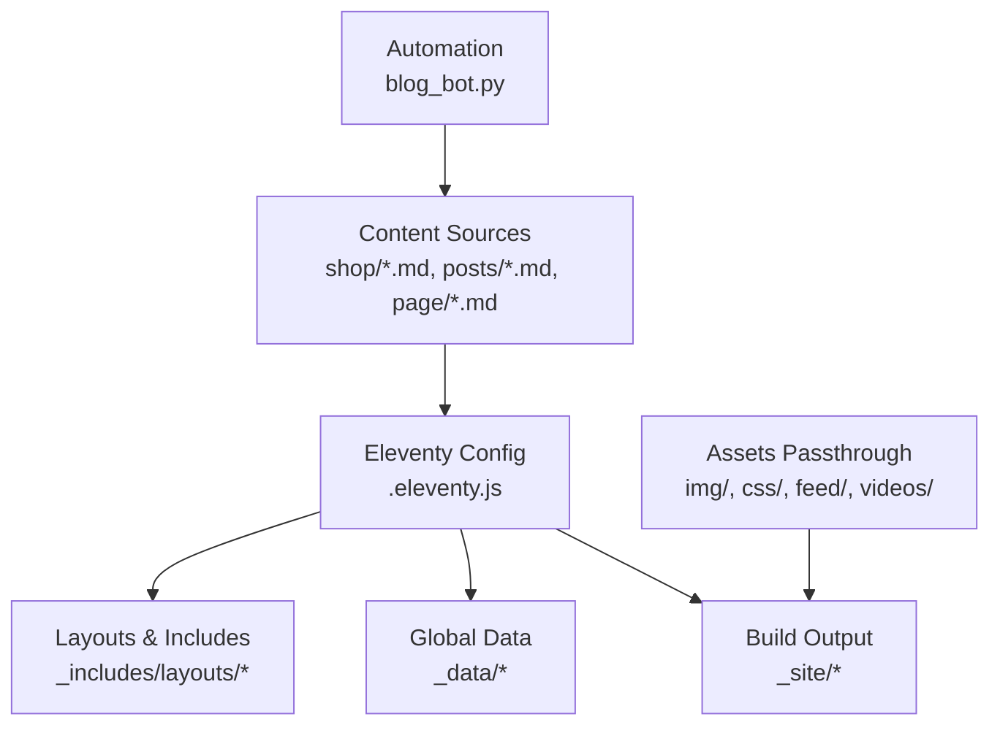
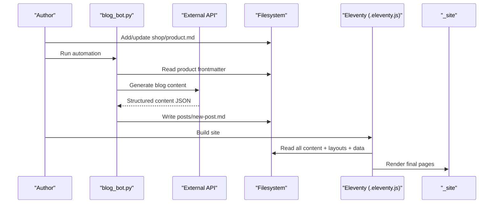
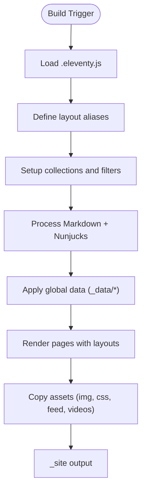
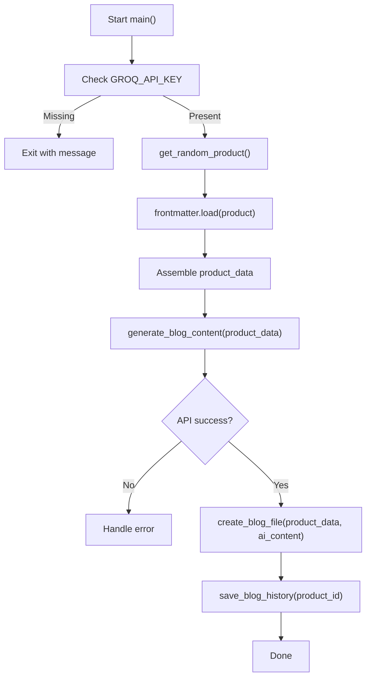
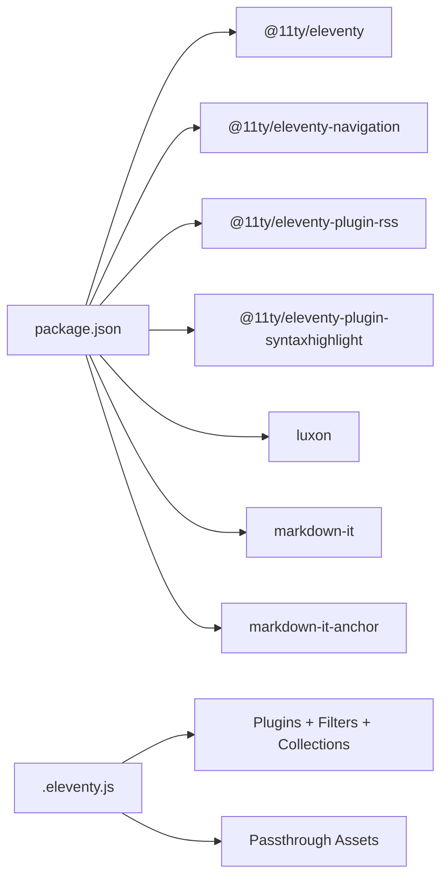

# Content Management System

<cite>
**Referenced Files in This Document**
- [README.md](file://README.md)
- [.eleventy.js](file://.eleventy.js)
- [package.json](file://package.json)
- [shop/shop.json](file://shop/shop.json)
- [posts/posts.json](file://posts/posts.json)
- [_data/metadata.json](file://_data/metadata.json)
- [shop/B0CLHGCYRN.md](file://shop/B0CLHGCYRN.md)
- [posts/best-gift-ideas-in-uae-2025.md](file://posts/best-gift-ideas-in-uae-2025.md)
- [page/about.md](file://page/about.md)
- [blog_bot.py](file://blog_bot.py)
</cite>

## Table of Contents
1. [Introduction](#introduction)
2. [Project Structure](#project-structure)
3. [Core Components](#core-components)
4. [Architecture Overview](#architecture-overview)
5. [Detailed Component Analysis](#detailed-component-analysis)
6. [Dependency Analysis](#dependency-analysis)
7. [Performance Considerations](#performance-considerations)
8. [Troubleshooting Guide](#troubleshooting-guide)
9. [Conclusion](#conclusion)
10. [Appendices](#appendices)

## Introduction
This document explains how to manage content in the Nillianstore2 CMS, a static site built with Eleventy (11ty). The system organizes content into three tiers:
- Product catalog items in the shop directory
- AI-generated blog posts in the posts directory
- Static pages in the page directory

It covers frontmatter schemas, workflows for creating and generating content, SEO and image guidelines, category organization, rendering via the template engine, and operational guidance for versioning, backups, and bulk operations.

## Project Structure
The repository follows a content-first structure:
- shop: Markdown files for products, each with product-specific frontmatter
- posts: Markdown files for blog posts, including those generated by automation
- page: Markdown files for static pages
- _includes/layouts: Layout templates used by content types
- _data: Global data such as site metadata
- .eleventy.js: Eleventy configuration, collections, filters, and passthrough assets
- package.json: Build scripts and dependencies

**Diagram sources**
- [.eleventy.js:99-104](file://.eleventy.js#L99-L104)
- [package.json:5-11](file://package.json#L5-L11)

**Section sources**
- [README.md:1-20](file://README.md#L1-L20)
- [.eleventy.js:146-159](file://.eleventy.js#L146-L159)
- [package.json:1-12](file://package.json#L1-L12)

## Core Components
- Shop content: Each product is a Markdown file under shop with product frontmatter and body copy.
- Blog content: Posts are Markdown files under posts with post frontmatter and rich content.
- Static pages: Page files under page with page frontmatter and content.
- Eleventy configuration: Defines layouts, collections, filters, markdown processing, and asset passthrough.
- Automation script: Generates blog posts from products using an external API.

Key responsibilities:
- Frontmatter defines metadata and rendering behavior
- Collections and tags organize content
- Layouts control presentation
- Filters and global data enhance output

**Section sources**
- [.eleventy.js:21-24](file://.eleventy.js#L21-L24)
- [.eleventy.js:72-95](file://.eleventy.js#L72-L95)
- [shop/shop.json:1-4](file://shop/shop.json#L1-L4)
- [posts/posts.json:1-6](file://posts/posts.json#L1-L6)

## Architecture Overview
The content management architecture combines manual authoring and automated generation:
- Manual: Authors add or edit Markdown files in shop, posts, and page directories.
- Automated: The blog bot reads a product, calls an external API to generate structured content, and writes a new post file.
- Rendering: Eleventy compiles Markdown and Nunjucks templates into static HTML, applying layouts and global data.

**Diagram sources**
- [blog_bot.py:210-253](file://blog_bot.py#L210-L253)
- [.eleventy.js:146-159](file://.eleventy.js#L146-L159)

## Detailed Component Analysis

### Product Catalog (shop directory)
Products are represented by Markdown files with product-specific frontmatter. Typical fields include title, description, price, cover image, multiple images, category, tags, layout, amazonLink, permalink, date, bullet points, and alt text for accessibility.

Frontmatter schema (product):
- Required
  - title: string
  - description: string
  - price: string (e.g., currency and amount)
  - cover: path to primary image
  - ecwidId: string (unique product identifier)
  - category: string (used for grouping)
  - tags: array of strings (include “shop” for collection filtering)
  - layout: string (must be “layouts/shop.njk”)
  - amazonLink: URL to purchase
  - permalink: string (URL path for the product)
  - date: ISO date string
- Optional
  - images: array of image paths
  - bullet_points: array of descriptive points
  - cover_alt: alt text for cover
  - image_alts: array of alt texts for additional images

Validation rules and conventions:
- Use safe slugs for permalinks; avoid special characters that break URLs.
- Keep tags consistent; include “shop” to participate in shop collections.
- Ensure image paths exist under img/.
- Provide meaningful alt text for accessibility and SEO.

Rendering:
- Products use the shop layout alias configured in Eleventy.
- Tags and categories enable listing and filtering.

**Section sources**
- [shop/B0CLHGCYRN.md:1-38](file://shop/B0CLHGCYRN.md#L1-L38)
- [.eleventy.js:21-24](file://.eleventy.js#L21-L24)
- [shop/shop.json:1-4](file://shop/shop.json#L1-L4)

### Blog Posts (posts directory)
Posts are Markdown files with post frontmatter and rich content. They can be authored manually or generated automatically from products.

Frontmatter schema (post):
- Required
  - title: string
  - description: string
  - cover: path to featured image
  - date: ISO date string
  - tags: array of strings (include “post” for collection filtering)
  - layout: string (must be “layouts/post.njk”)
  - permalink: string (URL path for the post)
- Optional
  - Additional custom fields if needed by templates

Validation rules and conventions:
- Include “post” tag to appear in post collections.
- Use concise, SEO-friendly titles and descriptions.
- Ensure cover image exists and has appropriate alt text in content.

Rendering:
- Posts use the post layout alias configured in Eleventy.
- Tags support listing and navigation.

**Section sources**
- [posts/best-gift-ideas-in-uae-2025.md:1-28](file://posts/best-gift-ideas-in-uae-2025.md#L1-L28)
- [.eleventy.js:21-24](file://.eleventy.js#L21-L24)
- [posts/posts.json:1-6](file://posts/posts.json#L1-L6)

### Static Pages (page directory)
Static pages are Markdown files with page frontmatter and content. They typically include navigation metadata and custom permalinks.

Frontmatter schema (page):
- Required
  - layout: string (must be “layouts/page.njk”)
  - title: string
  - description: string
  - cover: path to hero image
  - permalink: string (URL path for the page)
- Optional
  - eleventyNavigation: object with key and order for navigation ordering

Validation rules and conventions:
- Set unique permalinks to avoid conflicts.
- Use clear titles and descriptions for SEO.
- Configure navigation metadata to include pages in menus.

Rendering:
- Pages use the page layout alias configured in Eleventy.

**Section sources**
- [page/about.md:1-10](file://page/about.md#L1-L10)
- [.eleventy.js:21-24](file://.eleventy.js#L21-L24)

### Template Engine and Rendering
Eleventy processes Markdown and Nunjucks templates:
- Layout aliases map short names to full layout paths.
- Collections aggregate content by tags.
- Filters format dates, sanitize strings, and encode XML.
- Markdown library enables anchors and linkification.
- Passthrough copies static assets like images and CSS.

**Diagram sources**
- [.eleventy.js:21-24](file://.eleventy.js#L21-L24)
- [.eleventy.js:72-95](file://.eleventy.js#L72-L95)
- [.eleventy.js:106-116](file://.eleventy.js#L106-L116)
- [.eleventy.js:99-104](file://.eleventy.js#L99-L104)

**Section sources**
- [.eleventy.js:21-24](file://.eleventy.js#L21-L24)
- [.eleventy.js:72-95](file://.eleventy.js#L72-L95)
- [.eleventy.js:106-116](file://.eleventy.js#L106-L116)
- [.eleventy.js:99-104](file://.eleventy.js#L99-L104)

### Automation Workflow (AI-generated blog posts)
The automation script performs these steps:
- Reads a random product Markdown file from shop
- Extracts frontmatter fields (title, description, price, images, amazon link)
- Calls an external API to generate structured blog content
- Writes a new Markdown post file under posts with sanitized frontmatter and content
- Logs history to avoid regenerating the same product

**Diagram sources**
- [blog_bot.py:210-253](file://blog_bot.py#L210-L253)
- [blog_bot.py:18-46](file://blog_bot.py#L18-L46)
- [blog_bot.py:48-97](file://blog_bot.py#L48-L97)
- [blog_bot.py:99-208](file://blog_bot.py#L99-L208)

**Section sources**
- [blog_bot.py:18-46](file://blog_bot.py#L18-L46)
- [blog_bot.py:48-97](file://blog_bot.py#L48-L97)
- [blog_bot.py:99-208](file://blog_bot.py#L99-L208)
- [blog_bot.py:210-253](file://blog_bot.py#L210-L253)

## Dependency Analysis
- Eleventy plugins: RSS, syntax highlighting, navigation
- Markdown processing: markdown-it with anchor plugin
- Date formatting: Luxon
- Build scripts: build, watch, serve, debug
- Asset passthrough: img, css, feed, videos

**Diagram sources**
- [package.json:24-32](file://package.json#L24-L32)
- [.eleventy.js:1-8](file://.eleventy.js#L1-L8)
- [.eleventy.js:99-104](file://.eleventy.js#L99-L104)

**Section sources**
- [package.json:1-12](file://package.json#L1-L12)
- [package.json:24-32](file://package.json#L24-L32)
- [.eleventy.js:1-8](file://.eleventy.js#L1-L8)
- [.eleventy.js:99-104](file://.eleventy.js#L99-L104)

## Performance Considerations
- Image optimization: Use compressed formats (e.g., WebP), proper dimensions, and alt text to improve load times and SEO.
- Asset passthrough: Only include necessary assets to reduce bundle size.
- Tag filtering: Use collections and filters to limit rendered lists and avoid heavy DOM.
- Build caching: Leverage Eleventy’s incremental builds during development with watch mode.

[No sources needed since this section provides general guidance]

## Troubleshooting Guide
Common issues and resolutions:
- Missing environment variable for automation: Ensure GROQ_API_KEY is set before running the blog bot.
- Invalid filenames or permalinks: Use safe slugs and avoid special characters; verify perma links do not conflict.
- Broken image references: Confirm image paths exist under img/ and are copied via passthrough.
- Collection/tag mismatches: Ensure tags include required values (“shop”, “post”) and avoid reserved tags filtered out by config.

Operational checks:
- Verify build scripts in package.json run successfully.
- Inspect _site output for expected pages and assets.
- Review logs from automation for errors.

**Section sources**
- [blog_bot.py:210-214](file://blog_bot.py#L210-L214)
- [.eleventy.js:64-70](file://.eleventy.js#L64-L70)
- [.eleventy.js:99-104](file://.eleventy.js#L99-L104)
- [package.json:5-11](file://package.json#L5-L11)

## Conclusion
Nillianstore2 uses a straightforward, content-first approach powered by Eleventy. Products, posts, and pages are authored as Markdown with well-defined frontmatter. Automation streamlines blog creation from product data. With careful attention to SEO, images, and tags, the system delivers fast, searchable, and maintainable static sites.

[No sources needed since this section summarizes without analyzing specific files]

## Appendices

### Frontmatter Schema Summary

- Product (shop/*.md)
  - Required: title, description, price, cover, ecwidId, category, tags (include “shop”), layout (“layouts/shop.njk”), amazonLink, permalink, date
  - Optional: images[], bullet_points[], cover_alt, image_alts[]
- Post (posts/*.md)
  - Required: title, description, cover, date, tags (include “post”), layout (“layouts/post.njk”), permalink
  - Optional: additional fields as needed by templates
- Page (page/*.md)
  - Required: layout (“layouts/page.njk”), title, description, cover, permalink
  - Optional: eleventyNavigation { key, order }

**Section sources**
- [shop/B0CLHGCYRN.md:1-38](file://shop/B0CLHGCYRN.md#L1-L38)
- [posts/best-gift-ideas-in-uae-2025.md:1-28](file://posts/best-gift-ideas-in-uae-2025.md#L1-L28)
- [page/about.md:1-10](file://page/about.md#L1-L10)

### SEO Optimization Guidelines
- Titles and descriptions: Keep them concise, keyword-rich, and relevant to user intent.
- Permalinks: Use readable, lowercase, hyphenated slugs.
- Images: Provide descriptive alt text and optimize file sizes.
- Tags: Use consistent, meaningful tags to aid discovery and internal linking.
- Metadata: Ensure global metadata is accurate in _data/metadata.json.

**Section sources**
- [_data/metadata.json:1-27](file://_data/metadata.json#L1-L27)

### Image Management Best Practices
- Store images under img/ and reference relative paths in frontmatter and content.
- Prefer modern formats (WebP) and responsive sizing.
- Maintain consistent naming aligned with product IDs where applicable.

**Section sources**
- [.eleventy.js:99-104](file://.eleventy.js#L99-L104)

### Category Organization
- Use category field on products to group related items.
- Leverage tags for cross-cutting themes (e.g., seasonal campaigns).
- Avoid reserved tags filtered by config; keep tags clean and normalized.

**Section sources**
- [shop/B0CLHGCYRN.md:12-22](file://shop/B0CLHGCYRN.md#L12-L22)
- [.eleventy.js:64-70](file://.eleventy.js#L64-L70)

### Versioning, Backup, and Bulk Operations
- Versioning: Use Git to track changes across content and templates.
- Backups: Regularly commit content; consider exporting _site for deployment snapshots.
- Bulk operations:
  - Rename or move files carefully to update permalinks and references.
  - Use search-and-replace within frontmatter for mass updates (e.g., tags, categories).
  - Automate repetitive tasks with scripts similar to the blog bot pattern.

[No sources needed since this section provides general guidance]