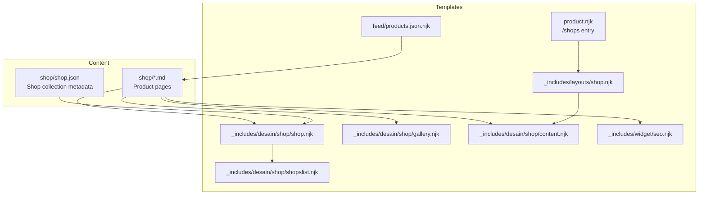
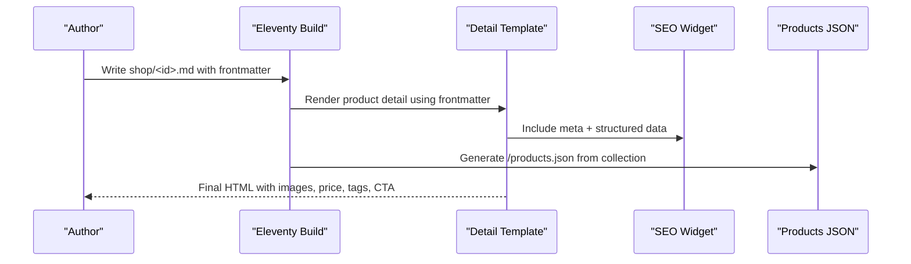
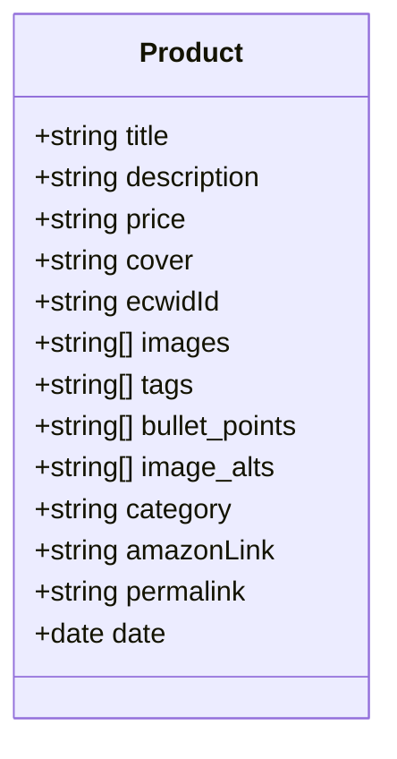
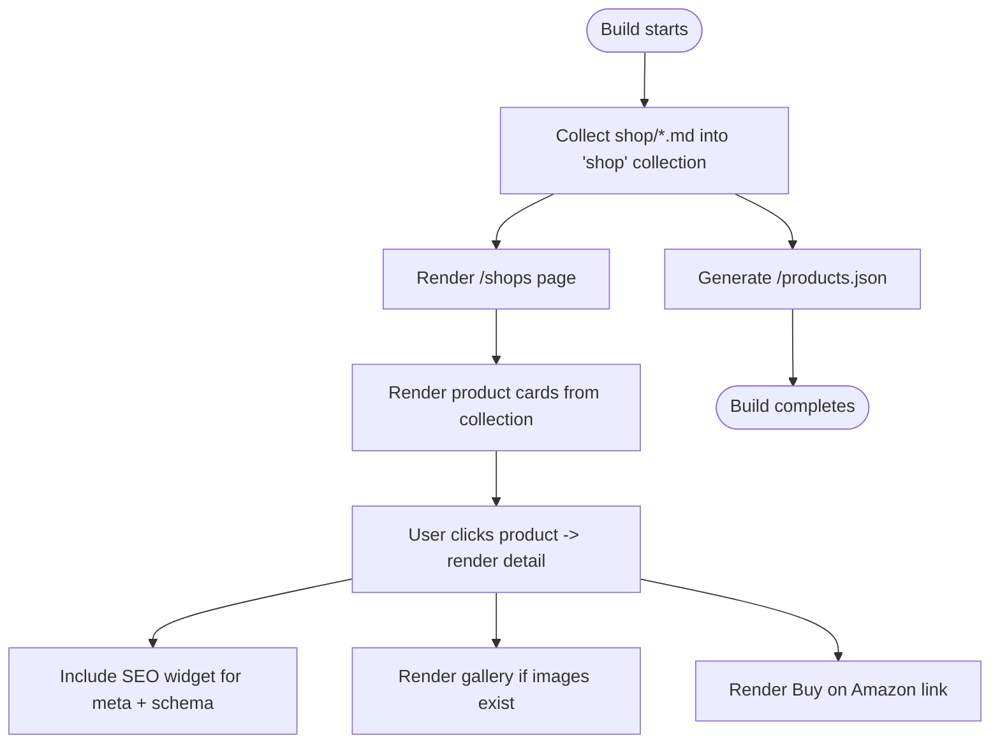
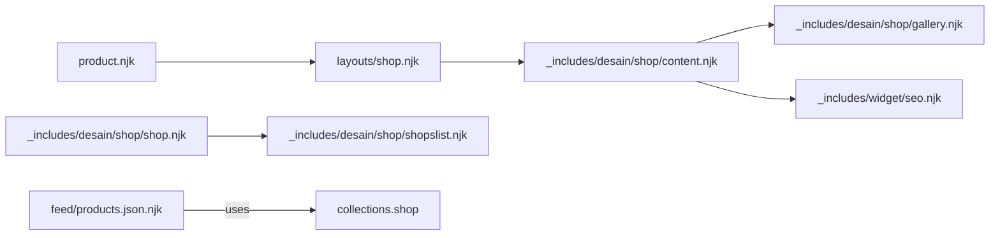

# Product Catalog System

<cite>
**Referenced Files in This Document**
- [B0CLHGCYRN.md](file://shop/B0CLHGCYRN.md)
- [shop.json](file://shop/shop.json)
- [product.njk](file://product.njk)
- [shop.njk (layout)](file://_includes/layouts/shop.njk)
- [seo.njk](file://_includes/widget/seo.njk)
- [shop.njk (collection renderer)](file://_includes/desain/shop/shop.njk)
- [shopslist.njk](file://_includes/desain/shop/shopslist.njk)
- [gallery.njk](file://_includes/desain/shop/gallery.njk)
- [content.njk](file://_includes/desain/shop/content.njk)
- [produk.njk](file://_includes/desain/page/produk.njk)
- [products.json.njk](file://feed/products.json.njk)
</cite>

## Table of Contents
1. Introduction
2. Project Structure
3. Core Components
4. Architecture Overview
5. Detailed Component Analysis
6. Dependency Analysis
7. Performance Considerations
8. Troubleshooting Guide
9. Conclusion
10. Appendices

## Introduction
This document explains the product catalog system used to author, render, and expose products for an Eleventy-based site. It covers the frontmatter schema, data model, category and tag organization, image management, template rendering flow, bulk operations, validation, Amazon affiliate integration, performance considerations, and search functionality.

## Project Structure
Products are authored as Markdown files under shop/. Each file uses a consistent frontmatter schema and is rendered via shared templates. A dedicated page aggregates all products, and a JSON feed exposes a machine-readable list.

**Diagram sources**
- [product.njk:1-10](file://product.njk#L1-L10)
- [shop.njk (layout):1-5](file://_includes/layouts/shop.njk#L1-L5)
- [shop.njk (collection renderer):1-4](file://_includes/desain/shop/shop.njk#L1-L4)
- [shopslist.njk:1-15](file://_includes/desain/shop/shopslist.njk#L1-L15)
- [gallery.njk:1-50](file://_includes/desain/shop/gallery.njk#L1-L50)
- [content.njk:1-120](file://_includes/desain/shop/content.njk#L1-L120)
- [seo.njk:1-208](file://_includes/widget/seo.njk#L1-L208)
- [products.json.njk:1-17](file://feed/products.json.njk#L1-L17)

**Section sources**
- [product.njk:1-10](file://product.njk#L1-L10)
- [shop.njk (layout):1-5](file://_includes/layouts/shop.njk#L1-L5)
- [shop.njk (collection renderer):1-4](file://_includes/desain/shop/shop.njk#L1-L4)
- [shopslist.njk:1-15](file://_includes/desain/shop/shopslist.njk#L1-L15)
- [gallery.njk:1-50](file://_includes/desain/shop/gallery.njk#L1-L50)
- [content.njk:1-120](file://_includes/desain/shop/content.njk#L1-L120)
- [seo.njk:1-208](file://_includes/widget/seo.njk#L1-L208)
- [products.json.njk:1-17](file://feed/products.json.njk#L1-L17)

## Core Components
- Product content files: Markdown with structured frontmatter describing each product.
- Shop listing page: Renders a grid of products from the collections.
- Product detail layout: Composes title, description, images, features, price, tags, and CTA.
- SEO widget: Injects meta tags and structured data based on tags and frontmatter fields.
- Products JSON feed: Exposes a minimal product index for external consumption.

Key responsibilities:
- Authoring and validation of product frontmatter.
- Rendering product listings and details.
- Generating SEO-friendly markup and structured data.
- Providing a machine-readable product index.

**Section sources**
- [B0CLHGCYRN.md:1-55](file://shop/B0CLHGCYRN.md#L1-L55)
- [shop.njk (collection renderer):1-4](file://_includes/desain/shop/shop.njk#L1-L4)
- [shopslist.njk:1-15](file://_includes/desain/shop/shopslist.njk#L1-L15)
- [content.njk:1-120](file://_includes/desain/shop/content.njk#L1-L120)
- [seo.njk:1-208](file://_includes/widget/seo.njk#L1-L208)
- [products.json.njk:1-17](file://feed/products.json.njk#L1-L17)

## Architecture Overview
The system follows a content-first architecture:
- Content authors write product Markdown files with frontmatter.
- Eleventy collects these into named collections.
- Templates consume collections to render lists and detail pages.
- The SEO widget enriches pages with Open Graph, Twitter, and Schema.org data.
- A JSON feed provides a lightweight product index.

**Diagram sources**
- [content.njk:1-120](file://_includes/desain/shop/content.njk#L1-L120)
- [seo.njk:1-208](file://_includes/widget/seo.njk#L1-L208)
- [products.json.njk:1-17](file://feed/products.json.njk#L1-L17)

## Detailed Component Analysis

### Frontmatter Schema
Required fields:
- title: Human-readable product name.
- description: Short summary used in listings and SEO.
- price: Displayed price string (e.g., “AED 95”).
- cover: Primary image path (e.g., /img/...webp).
- ecwidId: Unique identifier used in analytics and structured data.

Optional fields:
- images: Array of additional image paths for gallery.
- tags: Array of strings for categorization and navigation.
- bullet_points: Array of feature highlights.
- image_alts: Array of alt texts corresponding to images.

Example reference:
- See a complete product example with all fields present.

Notes:
- category is commonly used to group products (e.g., lighting, decor).
- amazonLink is used for the affiliate buy button.
- permalink can override default URL generation.
- date is used for sorting and ordering.

**Section sources**
- [B0CLHGCYRN.md:1-55](file://shop/B0CLHGCYRN.md#L1-L55)

### Product Data Model
Conceptual structure derived from actual product files and templates:
- Identifiers: ecwidId, optional permalink.
- Presentation: title, description, cover, images[], image_alts[].
- Commerce: price, amazonLink.
- Organization: category, tags[].
- Marketing: bullet_points[].
- Metadata: date, layout.

Relationships:
- images[] maps to gallery rendering logic.
- tags[] drives tag pages and breadcrumb generation.
- category integrates with tag-based navigation and breadcrumbs.

[No sources needed since this diagram shows conceptual model]

### Category and Tag System
- Categories: Use a top-level category field (e.g., lighting, decor) to organize products.
- Tags: Use descriptive, SEO-oriented tags (e.g., “ceiling light UAE”, “cloud lamp Dubai”) to enable filtering and discovery.
- Breadcrumbs: When a product has a category, the breadcrumb includes Home > Shop > Category > Product.
- Tag links: Tags render as clickable links to tag pages.

Implementation references:
- Breadcrumb generation considers tags and category.
- Tag links use safe slugification.

**Section sources**
- [seo.njk:142-206](file://_includes/widget/seo.njk#L142-L206)
- [content.njk:61-71](file://_includes/desain/shop/content.njk#L61-L71)

### Image Management Guidelines
Naming conventions:
- Use consistent filenames per product, e.g., /img/<ecwidId>.webp for cover and /img/<ecwidId>-N.webp for additional images.
- Prefer WebP format for performance.

Alt text requirements:
- Provide meaningful alt text for accessibility and SEO.
- For multiple images, supply image_alts aligned with images order; otherwise, fallbacks use generic or title-based alt text.

Rendering behavior:
- Gallery supports multiple images with carousel controls.
- Fallback to single cover if no multi-image array is provided.

**Section sources**
- [B0CLHGCYRN.md:6-37](file://shop/B0CLHGCYRN.md#L6-L37)
- [gallery.njk:1-50](file://_includes/desain/shop/gallery.njk#L1-L50)

### Template Engine and Rendering Flow
- Entry point: A page defines a route that includes a shop listing component.
- Listing: A component iterates over the shops collection and renders cards with cover, title, and description.
- Detail: The product detail layout composes sections including title, description, cover, features, price, tags, gallery, and body content.
- SEO: The SEO widget injects meta tags and structured data based on tags and frontmatter.

**Diagram sources**
- [product.njk:1-10](file://product.njk#L1-L10)
- [shop.njk (collection renderer):1-4](file://_includes/desain/shop/shop.njk#L1-L4)
- [shopslist.njk:1-15](file://_includes/desain/shop/shopslist.njk#L1-L15)
- [content.njk:1-120](file://_includes/desain/shop/content.njk#L1-L120)
- [seo.njk:1-208](file://_includes/widget/seo.njk#L1-L208)
- [products.json.njk:1-17](file://feed/products.json.njk#L1-L17)

**Section sources**
- [product.njk:1-10](file://product.njk#L1-L10)
- [shop.njk (collection renderer):1-4](file://_includes/desain/shop/shop.njk#L1-L4)
- [shopslist.njk:1-15](file://_includes/desain/shop/shopslist.njk#L1-L15)
- [content.njk:1-120](file://_includes/desain/shop/content.njk#L1-L120)
- [seo.njk:1-208](file://_includes/widget/seo.njk#L1-L208)
- [products.json.njk:1-17](file://feed/products.json.njk#L1-L17)

### Bulk Operations
- Adding new products: Create a new Markdown file under shop/ with required frontmatter and images.
- Updating existing products: Edit the corresponding Markdown file and rebuild.
- Listing page: Automatically reflects changes by iterating the collection.
- JSON feed: Automatically updates when products change.

Operational tips:
- Keep ecwidId unique and consistent across files and images.
- Maintain consistent image naming patterns to simplify automation.

**Section sources**
- [B0CLHGCYRN.md:1-55](file://shop/B0CLHGCYRN.md#L1-L55)
- [shopslist.njk:1-15](file://_includes/desain/shop/shopslist.njk#L1-L15)
- [products.json.njk:1-17](file://feed/products.json.njk#L1-L17)

### Product Validation
Recommended checks before publishing:
- Required fields present: title, description, price, cover, ecwidId.
- Images exist: cover and any referenced images in images[].
- Alt text coverage: image_alts length matches images length when provided.
- Price format: Ensure numeric extraction works for analytics and structured data.
- Tags and category: Present and appropriate for navigation and SEO.

Automation ideas:
- Pre-commit hooks or CI steps to validate frontmatter presence and image existence.
- Lint rules to enforce naming conventions for images and frontmatter keys.

**Section sources**
- [B0CLHGCYRN.md:1-55](file://shop/B0CLHGCYRN.md#L1-L55)
- [gallery.njk:1-50](file://_includes/desain/shop/gallery.njk#L1-L50)
- [content.njk:92-118](file://_includes/desain/shop/content.njk#L92-L118)

### Amazon Affiliate Integration
- Buy button: The detail template renders a prominent “Buy on Amazon.ae” button linked via amazonLink.
- Analytics: Click events send checkout-related metrics using Google Analytics gtag.
- Structured data: Offers include currency and price extracted from the price field.

Best practices:
- Always set amazonLink for monetized products.
- Keep price consistent with the final display value.
- Verify gtag availability before sending events.

**Section sources**
- [content.njk:40-57](file://_includes/desain/shop/content.njk#L40-L57)
- [content.njk:92-118](file://_includes/desain/shop/content.njk#L92-L118)
- [seo.njk:60-74](file://_includes/widget/seo.njk#L60-L74)

### Search Functionality
Client-side search strategy:
- Consume /products.json to build an in-memory index.
- Filter by title, description, tags, and category.
- Debounce input and highlight matches.

Server-side alternatives:
- Leverage Eleventy’s tag pages for category/tag-based browsing.
- Add a simple API endpoint or pre-rendered search index for larger catalogs.

Performance notes:
- Keep the JSON payload lean (title, description, image, price, link).
- Implement pagination or virtual scrolling for very large datasets.

**Section sources**
- [products.json.njk:1-17](file://feed/products.json.njk#L1-L17)

## Dependency Analysis
High-level dependencies between components:
- product.njk depends on layouts/shop.njk.
- Layout includes content.njk for product detail rendering.
- Collection renderer uses shopslist.njk to iterate products.
- Gallery and content templates depend on frontmatter fields.
- SEO widget depends on tags, cover, price, ecwidId, and date.
- Products JSON feed depends on the shop collection.

**Diagram sources**
- [product.njk:1-10](file://product.njk#L1-L10)
- [shop.njk (layout):1-5](file://_includes/layouts/shop.njk#L1-L5)
- [content.njk:1-120](file://_includes/desain/shop/content.njk#L1-L120)
- [shop.njk (collection renderer):1-4](file://_includes/desain/shop/shop.njk#L1-L4)
- [shopslist.njk:1-15](file://_includes/desain/shop/shopslist.njk#L1-L15)
- [gallery.njk:1-50](file://_includes/desain/shop/gallery.njk#L1-L50)
- [seo.njk:1-208](file://_includes/widget/seo.njk#L1-L208)
- [products.json.njk:1-17](file://feed/products.json.njk#L1-L17)

**Section sources**
- [product.njk:1-10](file://product.njk#L1-L10)
- [shop.njk (layout):1-5](file://_includes/layouts/shop.njk#L1-L5)
- [content.njk:1-120](file://_includes/desain/shop/content.njk#L1-L120)
- [shop.njk (collection renderer):1-4](file://_includes/desain/shop/shop.njk#L1-L4)
- [shopslist.njk:1-15](file://_includes/desain/shop/shopslist.njk#L1-L15)
- [gallery.njk:1-50](file://_includes/desain/shop/gallery.njk#L1-L50)
- [seo.njk:1-208](file://_includes/widget/seo.njk#L1-L208)
- [products.json.njk:1-17](file://feed/products.json.njk#L1-L17)

## Performance Considerations
- Image optimization: Serve WebP images, set explicit width/height attributes, and use lazy loading.
- Minimize DOM size: Avoid excessive nested elements in galleries; reuse components.
- Efficient iteration: Collections should be filtered/sorted at the template level only when necessary.
- Caching: Rely on static site caching and CDN for images and JSON feed.
- Analytics events: Guard gtag calls to avoid runtime errors.

[No sources needed since this section provides general guidance]

## Troubleshooting Guide
Common issues and resolutions:
- Missing cover or images: Ensure cover path exists and images[] entries are correct.
- Broken alt text mapping: Align image_alts length with images length.
- Price parsing errors: Confirm price contains a numeric portion without extra characters.
- Missing amazonLink: Verify the field is set for monetized products.
- SEO not generated: Ensure tags include “shop” for product-specific structured data.

Validation checklist:
- Required frontmatter present.
- All referenced assets exist.
- Tags and categories are valid and consistent.
- Links and IDs are unique and correct.

**Section sources**
- [B0CLHGCYRN.md:1-55](file://shop/B0CLHGCYRN.md#L1-L55)
- [gallery.njk:1-50](file://_includes/desain/shop/gallery.njk#L1-L50)
- [content.njk:92-118](file://_includes/desain/shop/content.njk#L92-L118)
- [seo.njk:47-75](file://_includes/widget/seo.njk#L47-L75)

## Conclusion
The product catalog system combines clear content authoring with robust templating and SEO. By following the frontmatter schema, image guidelines, and tag strategies, teams can maintain a scalable, high-performance catalog that integrates seamlessly with Amazon affiliate flows and provides strong discoverability through tags and structured data.

[No sources needed since this section summarizes without analyzing specific files]

## Appendices

### Example Product Reference
- Full example with all fields: see the cloud pendant light product.

**Section sources**
- [B0CLHGCYRN.md:1-55](file://shop/B0CLHGCYRN.md#L1-L55)

### Shop Page Aggregation
- The main shop page includes a listing component that renders all products.

**Section sources**
- [produk.njk:1-9](file://_includes/desain/page/produk.njk#L1-L9)
- [shopslist.njk:1-15](file://_includes/desain/shop/shopslist.njk#L1-L15)