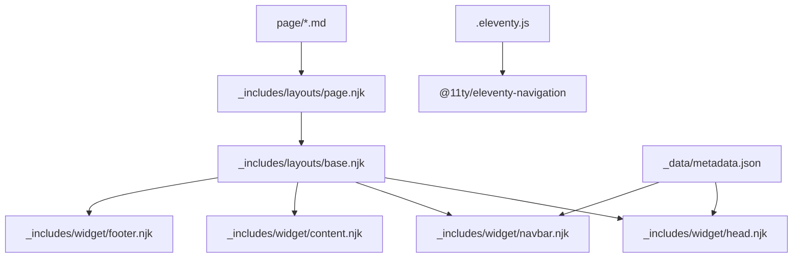
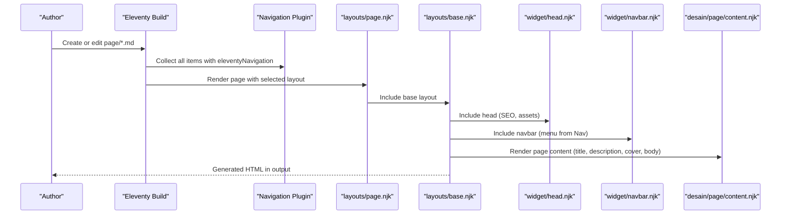
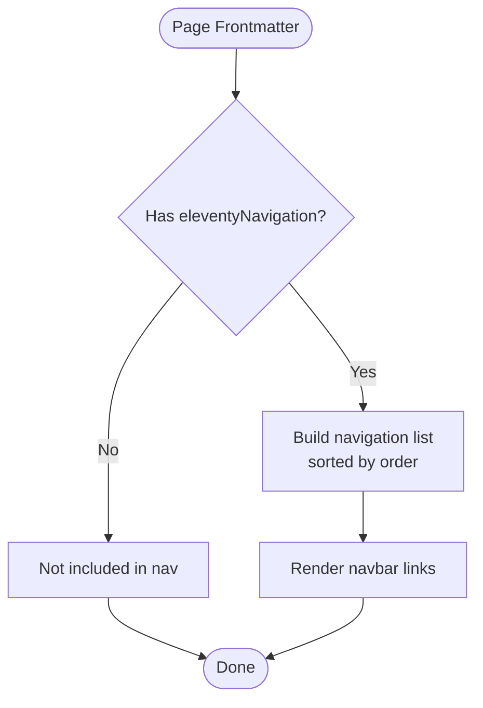
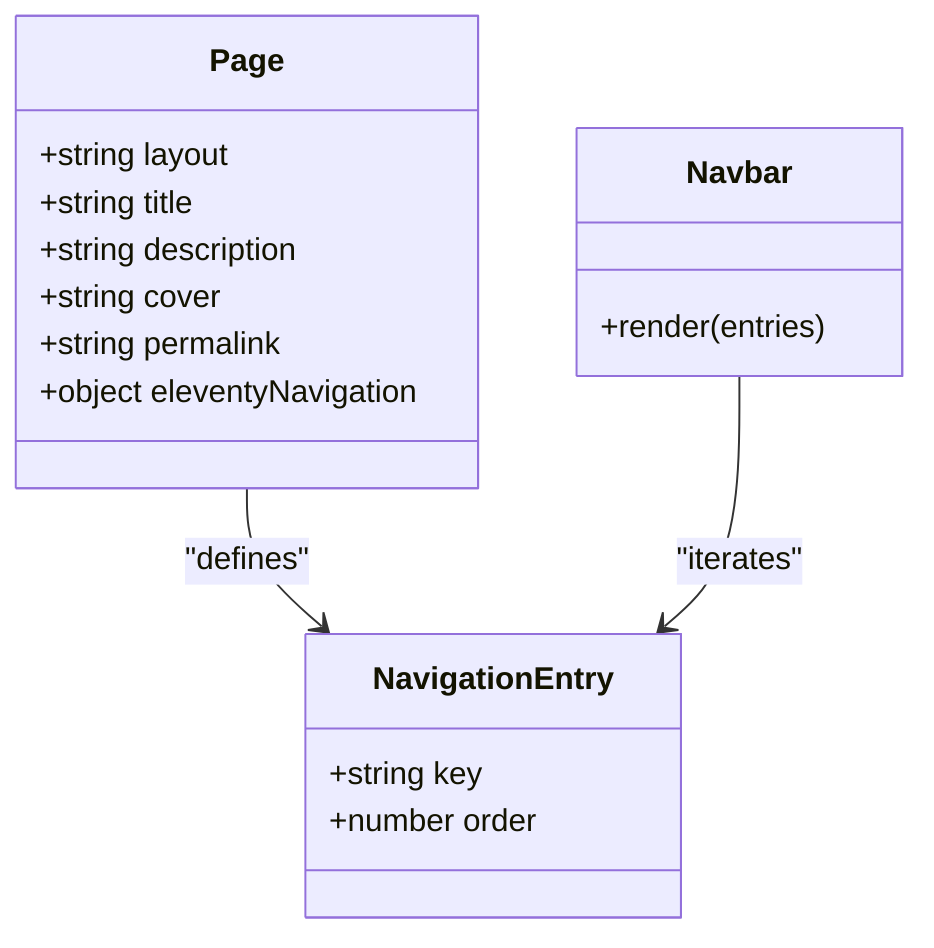
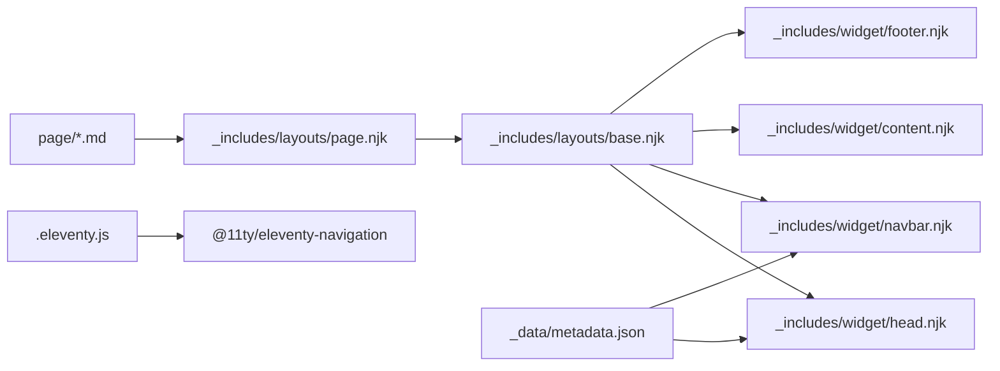

# Static Page Management

<cite>
**Referenced Files in This Document**
- [about.md](file://page/about.md)
- [contact.md](file://page/contact.md)
- [premium.md](file://page/premium.md)
- [pro.md](file://page/pro.md)
- [proshop.md](file://page/proshop.md)
- [sourcecode.md](file://page/sourcecode.md)
- [page.njk](file://_includes/layouts/page.njk)
- [base.njk](file://_includes/layouts/base.njk)
- [content.njk](file://_includes/desain/page/content.njk)
- [navbar.njk](file://_includes/widget/navbar.njk)
- [head.njk](file://_includes/widget/head.njk)
- [eleventy.js](file://.eleventy.js)
- [metadata.json](file://_data/metadata.json)
</cite>

## Table of Contents
1. [Introduction](#introduction)
2. [Project Structure](#project-structure)
3. [Core Components](#core-components)
4. [Architecture Overview](#architecture-overview)
5. [Detailed Component Analysis](#detailed-component-analysis)
6. [Dependency Analysis](#dependency-analysis)
7. [Performance Considerations](#performance-considerations)
8. [Troubleshooting Guide](#troubleshooting-guide)
9. [Conclusion](#conclusion)
10. [Appendices](#appendices)

## Introduction
This document explains how static pages are managed in the site, focusing on frontmatter structure, layout configuration, navigation integration, content formatting standards, and template usage patterns. It also provides guidelines for creating new pages, managing metadata, configuring page-specific settings, SEO optimization, responsive design considerations, and maintenance procedures.

## Project Structure
Static pages live under the page directory and use Nunjucks layouts to render consistently across the site. The build configuration enables navigation via a plugin and sets up global data used by templates.

**Diagram sources**
- [page.njk:1-10](file://_includes/layouts/page.njk#L1-L10)
- [base.njk:1-62](file://_includes/layouts/base.njk#L1-L62)
- [head.njk:1-113](file://_includes/widget/head.njk#L1-L113)
- [navbar.njk:1-37](file://_includes/widget/navbar.njk#L1-L37)
- [eleventy.js:1-160](file://.eleventy.js#L1-L160)
- [metadata.json:1-27](file://_data/metadata.json#L1-L27)

**Section sources**
- [eleventy.js:1-160](file://.eleventy.js#L1-L160)
- [metadata.json:1-27](file://_data/metadata.json#L1-L27)

## Core Components
- Frontmatter fields commonly used by static pages:
  - layout: path to the layout file (e.g., layouts/page.njk)
  - title: page title
  - description: short description used in meta and page header
  - cover: hero image path
  - permalink: custom URL path
  - eleventyNavigation: object with key and order for navigation
  - Additional contact-related fields (address, city, state, phone, email, icons) when needed
- Layouts:
  - layouts/page.njk wraps page content and delegates to base layout
  - layouts/base.njk includes head, navbar, content area, and footer
- Navigation:
  - Built using @11ty/eleventy-navigation; pages expose navigation entries via eleventyNavigation frontmatter
- Global data:
  - _data/metadata.json supplies site-wide metadata consumed by head and navbar

**Section sources**
- [about.md:1-10](file://page/about.md#L1-L10)
- [contact.md:1-19](file://page/contact.md#L1-L19)
- [page.njk:1-10](file://_includes/layouts/page.njk#L1-L10)
- [base.njk:1-62](file://_includes/layouts/base.njk#L1-L62)
- [navbar.njk:1-37](file://_includes/widget/navbar.njk#L1-L37)
- [eleventy.js:1-160](file://.eleventy.js#L1-L160)
- [metadata.json:1-27](file://_data/metadata.json#L1-L27)

## Architecture Overview
The rendering pipeline for a static page:
- Eleventy reads each .md file in page/
- Frontmatter is parsed and merged with global data
- The selected layout renders the page using Nunjucks
- The navigation plugin builds an ordered menu from eleventyNavigation entries
- Head and navbar include global metadata and link to CSS/JS assets

**Diagram sources**
- [eleventy.js:1-160](file://.eleventy.js#L1-L160)
- [page.njk:1-10](file://_includes/layouts/page.njk#L1-L10)
- [base.njk:1-62](file://_includes/layouts/base.njk#L1-L62)
- [head.njk:1-113](file://_includes/widget/head.njk#L1-L113)
- [navbar.njk:1-37](file://_includes/widget/navbar.njk#L1-L37)
- [content.njk:1-6](file://_includes/desain/page/content.njk#L1-L6)

## Detailed Component Analysis

### Frontmatter Structure and Semantics
Common frontmatter keys and their roles:
- layout: selects the layout template (e.g., layouts/page.njk)
- title: human-readable page title
- description: concise summary for SEO and page header
- cover: hero image path displayed above content
- permalink: final URL path for the page
- eleventyNavigation.key: label shown in navigation
- eleventyNavigation.order: sort order within navigation
- Contact-specific fields (when applicable): address, city, state, phone, email, icon1, icon2, icon3

Guidelines:
- Always set layout to layouts/page.njk for standard pages
- Provide meaningful title and description for SEO
- Use cover images optimized for web (WebP recommended)
- Define permalink to control URL structure
- Add eleventyNavigation to appear in the main menu; set order to control position

Examples of usage can be found in:
- [about.md:1-10](file://page/about.md#L1-L10)
- [contact.md:1-19](file://page/contact.md#L1-L19)
- [premium.md:1-10](file://page/premium.md#L1-L10)
- [pro.md:1-22](file://page/pro.md#L1-L22)
- [proshop.md:1-10](file://page/proshop.md#L1-L10)
- [sourcecode.md:1-9](file://page/sourcecode.md#L1-L9)

**Section sources**
- [about.md:1-10](file://page/about.md#L1-L10)
- [contact.md:1-19](file://page/contact.md#L1-L19)
- [premium.md:1-10](file://page/premium.md#L1-L10)
- [pro.md:1-22](file://page/pro.md#L1-L22)
- [proshop.md:1-10](file://page/proshop.md#L1-L10)
- [sourcecode.md:1-9](file://page/sourcecode.md#L1-L9)

### Layout Configuration and Rendering
- layouts/page.njk:
  - Declares its own layout as layouts/base.njk
  - Includes desain/page/content.njk to render page-specific content
- layouts/base.njk:
  - Includes widget/head.njk, widget/navbar.njk, widget/content.njk, widget/footer.njk
  - Adds client-side search script that loads /products.json and filters results dynamically
- desain/page/content.njk:
  - Renders page title, description, optional cover image, and the Markdown content

Best practices:
- Keep page-level logic in frontmatter and content files
- Use layouts for consistent chrome (header, footer, scripts)
- Avoid heavy inline styles; prefer CSS classes and Bootstrap utilities

**Section sources**
- [page.njk:1-10](file://_includes/layouts/page.njk#L1-L10)
- [base.njk:1-62](file://_includes/layouts/base.njk#L1-L62)
- [content.njk:1-6](file://_includes/desain/page/content.njk#L1-L6)

### Navigation Integration
- The navigation plugin is enabled in the build config
- Pages define eleventyNavigation with key and order
- The navbar template iterates over collections.all | eleventyNavigation to render links

Operational flow:
- Author adds eleventyNavigation to page frontmatter
- Build collects navigation entries and sorts by order
- Navbar template renders entries as links

**Diagram sources**
- [eleventy.js:1-160](file://.eleventy.js#L1-L160)
- [navbar.njk:1-37](file://_includes/widget/navbar.njk#L1-L37)
- [about.md:1-10](file://page/about.md#L1-L10)
- [contact.md:1-19](file://page/contact.md#L1-L19)

**Section sources**
- [eleventy.js:1-160](file://.eleventy.js#L1-L160)
- [navbar.njk:1-37](file://_includes/widget/navbar.njk#L1-L37)
- [about.md:1-10](file://page/about.md#L1-L10)
- [contact.md:1-19](file://page/contact.md#L1-L19)

### Content Formatting Standards and Template Usage
- Markdown is processed with a library configured to allow HTML, line breaks, and auto-linking
- Anchor links are generated automatically for headings
- Pages can include reusable components via Nunjucks  directives
- Example pages demonstrate including specialized sections (e.g., contact intro, theme templates)

Recommendations:
- Use semantic Markdown headings for structure and anchor generation
- Keep images optimized and provide alt text
- Prefer includes for repeated UI blocks to maintain consistency

**Section sources**
- [eleventy.js:106-116](file://.eleventy.js#L106-L116)
- [contact.md:21-22](file://page/contact.md#L21-L22)
- [sourcecode.md:8-9](file://page/sourcecode.md#L8-L9)

### Creating New Static Pages
Step-by-step:
1. Create a new Markdown file under page/
2. Add frontmatter:
   - layout: layouts/page.njk
   - title and description
   - cover (optional)
   - permalink (optional)
   - eleventyNavigation with key and order (if it should appear in the menu)
3. Write content using Markdown; include reusable components if needed
4. Build and verify the page appears at the expected URL and in the navigation

Example references:
- [about.md:1-10](file://page/about.md#L1-L10)
- [contact.md:1-19](file://page/contact.md#L1-L19)

**Section sources**
- [about.md:1-10](file://page/about.md#L1-L10)
- [contact.md:1-19](file://page/contact.md#L1-L19)

### Managing Page Metadata and Site-Wide Settings
- Per-page metadata: title, description, cover, permalink, navigation entry
- Site-wide metadata: _data/metadata.json provides title, description, URLs, language, locale, author, feed paths, and icon
- Head and navbar consume metadata for SEO tags, favicon, and branding

Guidelines:
- Keep per-page descriptions concise and keyword-relevant
- Ensure cover images are appropriately sized and compressed
- Update metadata.json for global changes like site URL or author info

**Section sources**
- [metadata.json:1-27](file://_data/metadata.json#L1-L27)
- [head.njk:1-113](file://_includes/widget/head.njk#L1-L113)
- [navbar.njk:1-37](file://_includes/widget/navbar.njk#L1-L37)

### Configuring Page-Specific Settings
- Use permalink to control final URL
- Use eleventyNavigation to control visibility and ordering in the menu
- For contact pages, additional fields such as address, city, state, phone, email, and icons can be provided and consumed by includes

References:
- [contact.md:1-19](file://page/contact.md#L1-L19)

**Section sources**
- [contact.md:1-19](file://page/contact.md#L1-L19)

### Relationship Between Static Pages and Site Navigation
- Any page with eleventyNavigation will be rendered in the navbar
- Order determines display sequence
- Title shown in the menu comes from the page’s title field

**Diagram sources**
- [about.md:1-10](file://page/about.md#L1-L10)
- [contact.md:1-19](file://page/contact.md#L1-L19)
- [navbar.njk:1-37](file://_includes/widget/navbar.njk#L1-L37)

**Section sources**
- [about.md:1-10](file://page/about.md#L1-L10)
- [contact.md:1-19](file://page/contact.md#L1-L19)
- [navbar.njk:1-37](file://_includes/widget/navbar.njk#L1-L37)

## Dependency Analysis
Key dependencies for static pages:
- Eleventy core and plugins:
  - @11ty/eleventy-navigation powers menu generation
  - RSS and syntax highlight plugins are loaded but not directly required for static pages
- Data layer:
  - _data/metadata.json supplies global variables
- Templates:
  - layouts/page.njk depends on layouts/base.njk
  - layouts/base.njk depends on widgets (head, navbar, content, footer)
  - desain/page/content.njk renders page-specific content

**Diagram sources**
- [page.njk:1-10](file://_includes/layouts/page.njk#L1-L10)
- [base.njk:1-62](file://_includes/layouts/base.njk#L1-L62)
- [head.njk:1-113](file://_includes/widget/head.njk#L1-L113)
- [navbar.njk:1-37](file://_includes/widget/navbar.njk#L1-L37)
- [eleventy.js:1-160](file://.eleventy.js#L1-L160)
- [metadata.json:1-27](file://_data/metadata.json#L1-L27)

**Section sources**
- [eleventy.js:1-160](file://.eleventy.js#L1-L160)
- [metadata.json:1-27](file://_data/metadata.json#L1-L27)

## Performance Considerations
- Images:
  - Use WebP where possible and ensure appropriate dimensions
  - Provide alt attributes for accessibility and SEO
- Scripts:
  - Client-side search fetches /products.json; ensure this resource exists and is small enough for fast filtering
  - Defer non-critical scripts and preload critical CSS
- Assets:
  - Preload CSS and fonts to improve perceived performance
  - Use CDN resources with preconnect hints

[No sources needed since this section provides general guidance]

## Troubleshooting Guide
Common issues and resolutions:
- Page does not appear in navigation:
  - Verify eleventyNavigation is present with key and order
  - Confirm the navigation plugin is enabled in the build config
- Incorrect URL:
  - Check permalink in frontmatter
- Missing hero image:
  - Ensure cover path is correct and the image exists in the public folder
- Search dropdown not working:
  - Confirm /products.json is generated and accessible
  - Check browser console for network errors loading products.json
- Markdown not rendering as expected:
  - Review markdown-it configuration and ensure HTML is allowed if needed

**Section sources**
- [eleventy.js:1-160](file://.eleventy.js#L1-L160)
- [base.njk:1-62](file://_includes/layouts/base.njk#L1-L62)
- [navbar.njk:1-37](file://_includes/widget/navbar.njk#L1-L37)

## Conclusion
Static pages in this project follow a clear pattern: structured frontmatter, consistent layout composition, and navigation integration via a dedicated plugin. By adhering to the documented conventions—especially around metadata, navigation entries, and content formatting—you can create, maintain, and optimize pages efficiently while ensuring good SEO and cross-device compatibility.

[No sources needed since this section summarizes without analyzing specific files]

## Appendices

### Best Practices Checklist
- Frontmatter completeness:
  - layout, title, description, cover, permalink, eleventyNavigation
- Content quality:
  - Semantic headings, descriptive alt text, concise paragraphs
- SEO:
  - Unique titles and descriptions per page
  - Proper canonicalization via permalink
  - Structured data via global metadata
- Accessibility:
  - Alt attributes for images
  - Sufficient color contrast and keyboard navigability
- Maintenance:
  - Keep images optimized
  - Regularly review navigation order and labels
  - Validate external links and feeds

[No sources needed since this section provides general guidance]