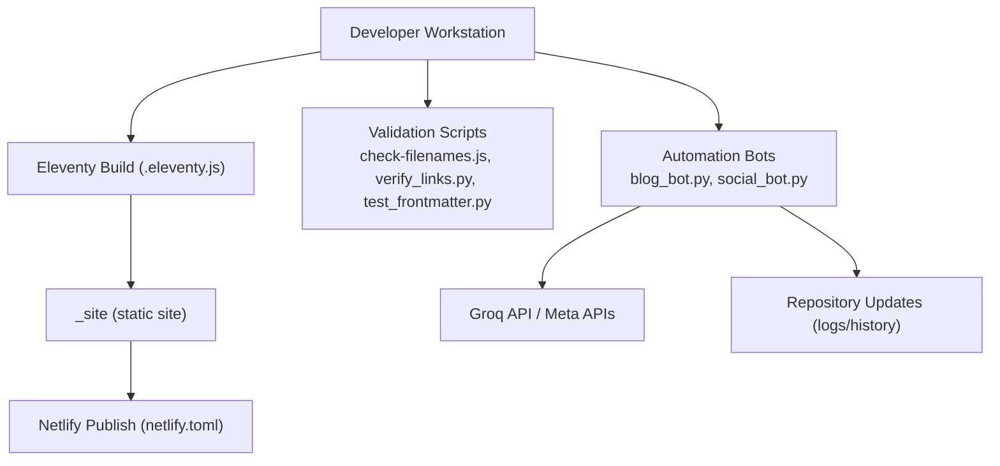
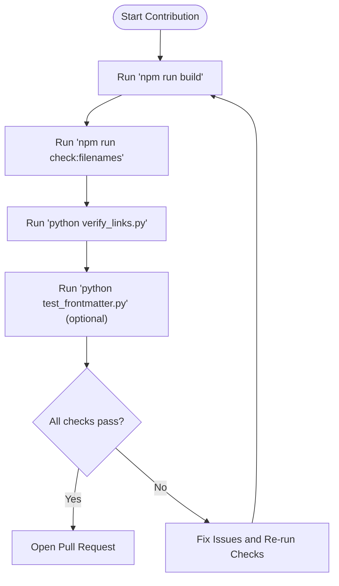
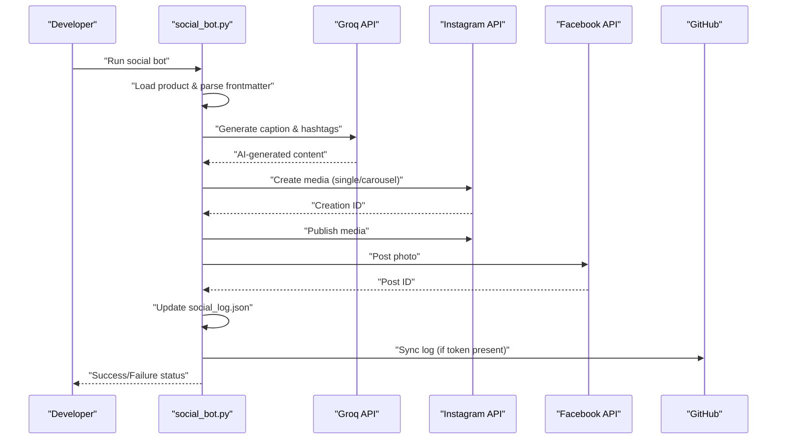
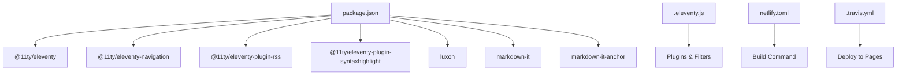

# Contributing Guidelines

<cite>
**Referenced Files in This Document**
- [.editorconfig](file://.editorconfig)
- [README.md](file://README.md)
- [package.json](file://package.json)
- [.eleventy.js](file://.eleventy.js)
- [netlify.toml](file://netlify.toml)
- [.travis.yml](file://.travis.yml)
- [scripts/check-filenames.js](file://scripts/check-filenames.js)
- [verify_links.py](file://verify_links.py)
- [test_frontmatter.py](file://test_frontmatter.py)
- [blog_bot.py](file://blog_bot.py)
- [social_bot.py](file://social_bot.py)
- [SOCIAL_BOT_SETUP.md](file://SOCIAL_BOT_SETUP.md)
</cite>

## Table of Contents
1. Introduction
2. Project Structure
3. Core Components
4. Architecture Overview
5. Detailed Component Analysis
6. Dependency Analysis
7. Performance Considerations
8. Troubleshooting Guide
9. Conclusion
10. Appendices

## Introduction
This document provides comprehensive contributing guidelines for the Nillianstore2 project. It explains how to set up your development environment, follow branch and commit conventions, submit pull requests, adhere to code standards, run tests and validation scripts, and engage with the community. The project is an Eleventy-based static site generator online shop that integrates content automation bots and CI/CD integrations.

## Project Structure
Nillianstore2 is a static site built with Eleventy (11ty). Content is authored in Markdown and Nunjucks templates, with data stored in JSON files. Automation scripts generate blog posts and social media content using external APIs. Build outputs are published to Netlify and were historically deployed via Travis CI.

Key directories and files:
- _includes: Nunjucks layouts and partials
- _data: Site-wide data (JSON)
- posts: Blog posts (Markdown)
- shop: Product pages (Markdown)
- scripts: Utility scripts (e.g., filename checks)
- .eleventy.js: Eleventy configuration
- package.json: Node scripts and dependencies
- netlify.toml: Netlify build settings
- .travis.yml: Legacy Travis CI configuration
- .editorconfig: Editor formatting rules
- verify_links.py, test_frontmatter.py: Validation utilities
- blog_bot.py, social_bot.py: Automation scripts
- SOCIAL_BOT_SETUP.md: Social bot setup guide

```mermaid
graph TB
A["Source Root"] --> B["_includes<br/>layouts & partials"]
A --> C["_data<br/>site data (JSON)"]
A --> D["posts<br/>blog posts (MD)"]
A --> E["shop<br/>products (MD)"]
A --> F["scripts<br/>utilities"]
A --> G[".eleventy.js<br/>Eleventy config"]
A --> H["package.json<br/>scripts & deps"]
A --> I["netlify.toml<br/>build config"]
A --> J[".travis.yml<br/>legacy CI"]
A --> K[".editorconfig<br/>formatting rules"]
A --> L["verify_links.py<br/>link validator"]
A --> M["test_frontmatter.py<br/>frontmatter tester"]
A --> N["blog_bot.py<br/>blog generator"]
A --> O["social_bot.py<br/>social poster"]
A --> P["SOCIAL_BOT_SETUP.md<br/>setup guide"]
```

[No sources needed since this diagram shows conceptual structure]

**Section sources**
- [README.md:1-64](file://README.md#L1-L64)
- [.eleventy.js:1-160](file://.eleventy.js#L1-L160)
- [package.json:1-34](file://package.json#L1-L34)
- [netlify.toml:1-3](file://netlify.toml#L1-L3)
- [.travis.yml:1-15](file://.travis.yml#L1-L15)

## Core Components
- Eleventy configuration: Defines plugins, filters, collections, passthrough assets, markdown library, and output directory.
- Build and dev scripts: Provide commands for building, watching, serving, debugging, and running validations.
- Validation scripts: Ensure generated filenames are safe and links are consistent across posts and products.
- Automation bots: Generate blog posts and social media content using AI APIs and publish them.

**Section sources**
- [.eleventy.js:1-160](file://.eleventy.js#L1-L160)
- [package.json:1-34](file://package.json#L1-L34)
- [scripts/check-filenames.js:1-45](file://scripts/check-filenames.js#L1-L45)
- [verify_links.py:1-55](file://verify_links.py#L1-L55)
- [test_frontmatter.py:1-17](file://test_frontmatter.py#L1-L17)
- [blog_bot.py:1-253](file://blog_bot.py#L1-L253)
- [social_bot.py:1-315](file://social_bot.py#L1-L315)

## Architecture Overview
The development and deployment architecture includes local development with Eleventy, automated content generation, link validation, and publishing to Netlify. Legacy CI uses Travis CI; current production builds are configured via Netlify.

**Diagram sources**
- [.eleventy.js:1-160](file://.eleventy.js#L1-L160)
- [netlify.toml:1-3](file://netlify.toml#L1-L3)
- [scripts/check-filenames.js:1-45](file://scripts/check-filenames.js#L1-L45)
- [verify_links.py:1-55](file://verify_links.py#L1-L55)
- [test_frontmatter.py:1-17](file://test_frontmatter.py#L1-L17)
- [blog_bot.py:1-253](file://blog_bot.py#L1-L253)
- [social_bot.py:1-315](file://social_bot.py#L1-L315)

## Detailed Component Analysis

### Development Workflow and Branch Strategy
- Branching model:
  - main: Stable, deployable version.
  - develop: Integration branch for feature work.
  - feature/*: Feature branches created from develop.
  - hotfix/*: Hotfixes created from main.
- Commit conventions:
  - Use clear, imperative messages.
  - Prefix commits by scope when helpful (e.g., docs:, shop:, posts:, scripts:, ci:).
  - Keep changes focused and atomic.
- Pull request process:
  - Create PR against develop for features; against main for hotfixes.
  - Ensure all validation scripts pass locally before opening PR.
  - Include screenshots or demos for UI/content changes.
  - Request review from maintainers.

[No sources needed since this section doesn't analyze specific files]

### Code Standards and Conventions (.editorconfig)
Formatting rules enforced by .editorconfig:
- Indentation: spaces, size 2
- Line endings: LF
- Final newline: true
- Trailing whitespace: trimmed
- Charset: UTF-8

Apply these settings in your editor to ensure consistency across contributors.

**Section sources**
- [.editorconfig:1-10](file://.editorconfig#L1-L10)

### Testing Requirements and Quality Assurance
- Build and serve:
  - npm run build: Generates static site into _site.
  - npm run watch: Rebuilds on file changes.
  - npm run serve: Starts local server with live reload.
  - npm run debug: Runs Eleventy with debug logging.
- Filename safety check:
  - npm run check:filenames scans _site for forbidden characters (? and #) in filenames.
- Link verification:
  - python verify_links.py ensures Amazon links in blog posts match product metadata.
- Frontmatter testing:
  - python test_frontmatter.py validates sample product frontmatter fields.

Recommended pre-merge checklist:
- Run npm run build and confirm no errors.
- Run npm run check:filenames and ensure OK.
- Run python verify_links.py and resolve any mismatches.
- Optionally run python test_frontmatter.py to validate frontmatter parsing.

**Diagram sources**
- [package.json:1-34](file://package.json#L1-L34)
- [scripts/check-filenames.js:1-45](file://scripts/check-filenames.js#L1-L45)
- [verify_links.py:1-55](file://verify_links.py#L1-L55)
- [test_frontmatter.py:1-17](file://test_frontmatter.py#L1-L17)

**Section sources**
- [package.json:1-34](file://package.json#L1-L34)
- [scripts/check-filenames.js:1-45](file://scripts/check-filenames.js#L1-L45)
- [verify_links.py:1-55](file://verify_links.py#L1-L55)
- [test_frontmatter.py:1-17](file://test_frontmatter.py#L1-L17)

### Adding New Features
- Create a feature branch from develop: feature/<short-description>.
- Implement changes following .editorconfig and Eleventy conventions.
- Update relevant templates, data, or scripts as needed.
- Add tests or validation steps if behavior affects build or content integrity.
- Open a PR with description, rationale, and evidence (screenshots/demos).

[No sources needed since this section doesn't analyze specific files]

### Modifying Existing Functionality
- Identify affected components (templates, filters, collections, scripts).
- Ensure backward compatibility where possible.
- Update documentation and examples accordingly.
- Run full QA checklist before submitting changes.

[No sources needed since this section doesn't analyze specific files]

### Updating Documentation
- Edit README.md or add new docs under appropriate locations.
- Keep links valid and images accessible.
- Follow .editorconfig formatting.

**Section sources**
- [README.md:1-64](file://README.md#L1-L64)

### Issue Reporting Procedures
- Search existing issues to avoid duplicates.
- Provide clear reproduction steps, expected vs actual behavior, and environment details.
- Attach logs or screenshots when applicable.
- Label issues appropriately (bug, enhancement, docs).

[No sources needed since this section doesn't analyze specific files]

### Feature Requests
- Describe the problem or opportunity.
- Propose a solution or approach.
- Explain benefits and potential impact.
- Be open to discussion and iteration.

[No sources needed since this section doesn't analyze specific files]

### Community Interaction Standards
- Be respectful and inclusive.
- Focus on constructive feedback.
- Follow repository guidelines and moderation policies.

[No sources needed since this section doesn't analyze specific files]

### Setup Instructions for Development Environments
- Prerequisites:
  - Node.js (compatible with Eleventy v2.x)
  - Python 3 (for validation scripts)
- Install dependencies:
  - npm install
- Local development:
  - npm run serve to start the dev server
  - npm run watch to rebuild on changes
  - npm run debug for verbose logs
- Build:
  - npm run build to generate _site
- Netlify integration:
  - netlify.toml defines publish folder (_site) and build command (DEBUG=* eleventy)
- Legacy CI (Travis):
  - .travis.yml installs Eleventy globally and deploys _site to GitHub Pages on master

**Section sources**
- [package.json:1-34](file://package.json#L1-L34)
- [netlify.toml:1-3](file://netlify.toml#L1-L3)
- [.travis.yml:1-15](file://.travis.yml#L1-L15)

### Automation Bots: Blog and Social Media Posting
- Blog generator (blog_bot.py):
  - Reads product data from shop/*.md
  - Uses Groq API to generate SEO-optimized blog content
  - Writes Markdown posts to posts/ with frontmatter and layout references
  - Maintains history in blog_log.json to avoid repetition
- Social poster (social_bot.py):
  - Selects random product, generates caption and hashtags via Groq API
  - Posts to Instagram and Facebook using Meta Graph API
  - Syncs posting history to social_log.json and optionally pushes to GitHub
  - Requires secrets: GROQ_API_KEY, META_ACCESS_TOKEN, FB_PAGE_ID, IG_USER_ID, GITHUB_TOKEN
- Setup guide:
  - SOCIAL_BOT_SETUP.md details required secrets and troubleshooting

**Diagram sources**
- [social_bot.py:1-315](file://social_bot.py#L1-L315)
- [SOCIAL_BOT_SETUP.md:1-106](file://SOCIAL_BOT_SETUP.md#L1-L106)

**Section sources**
- [blog_bot.py:1-253](file://blog_bot.py#L1-L253)
- [social_bot.py:1-315](file://social_bot.py#L1-L315)
- [SOCIAL_BOT_SETUP.md:1-106](file://SOCIAL_BOT_SETUP.md#L1-L106)

## Dependency Analysis
- Eleventy core and plugins:
  - @11ty/eleventy, navigation, RSS, syntax highlight
- Utilities:
  - luxon for date formatting
  - markdown-it and markdown-it-anchor for enhanced Markdown processing
- Build and CI:
  - Netlify build configuration
  - Travis CI legacy configuration

**Diagram sources**
- [package.json:1-34](file://package.json#L1-L34)
- [.eleventy.js:1-160](file://.eleventy.js#L1-L160)
- [netlify.toml:1-3](file://netlify.toml#L1-L3)
- [.travis.yml:1-15](file://.travis.yml#L1-L15)

**Section sources**
- [package.json:1-34](file://package.json#L1-L34)
- [.eleventy.js:1-160](file://.eleventy.js#L1-L160)
- [netlify.toml:1-3](file://netlify.toml#L1-L3)
- [.travis.yml:1-15](file://.travis.yml#L1-L15)

## Performance Considerations
- Keep product images optimized and use appropriate formats.
- Avoid excessive tags or large frontmatter payloads.
- Use Eleventy’s caching and incremental builds effectively.
- Monitor build times and reduce unnecessary passthrough copies.

[No sources needed since this section provides general guidance]

## Troubleshooting Guide
- Build failures:
  - Review Eleventy debug output (npm run debug).
  - Validate template syntax and data structures.
- Filename issues:
  - Run npm run check:filenames and fix forbidden characters in generated paths.
- Link mismatches:
  - Run python verify_links.py and align Amazon links with product metadata.
- Frontmatter parsing errors:
  - Run python test_frontmatter.py to identify malformed fields.
- Social bot errors:
  - Ensure all required secrets are set (GROQ_API_KEY, META_ACCESS_TOKEN, FB_PAGE_ID, IG_USER_ID, GITHUB_TOKEN).
  - Check token expiration and permissions per SOCIAL_BOT_SETUP.md.

**Section sources**
- [scripts/check-filenames.js:1-45](file://scripts/check-filenames.js#L1-L45)
- [verify_links.py:1-55](file://verify_links.py#L1-L55)
- [test_frontmatter.py:1-17](file://test_frontmatter.py#L1-L17)
- [SOCIAL_BOT_SETUP.md:1-106](file://SOCIAL_BOT_SETUP.md#L1-L106)

## Conclusion
By following these guidelines—branch strategy, commit conventions, code standards, testing requirements, and quality assurance processes—you can contribute effectively to Nillianstore2. Use the provided scripts to validate your changes and consult the setup guides for automation workflows. Thank you for helping improve the project!

[No sources needed since this section summarizes without analyzing specific files]

## Appendices

### Quick Commands Reference
- Build: npm run build
- Watch: npm run watch
- Serve: npm run serve
- Debug: npm run debug
- Filename check: npm run check:filenames
- Link verification: python verify_links.py
- Frontmatter test: python test_frontmatter.py

**Section sources**
- [package.json:1-34](file://package.json#L1-L34)
- [scripts/check-filenames.js:1-45](file://scripts/check-filenames.js#L1-L45)
- [verify_links.py:1-55](file://verify_links.py#L1-L55)
- [test_frontmatter.py:1-17](file://test_frontmatter.py#L1-L17)