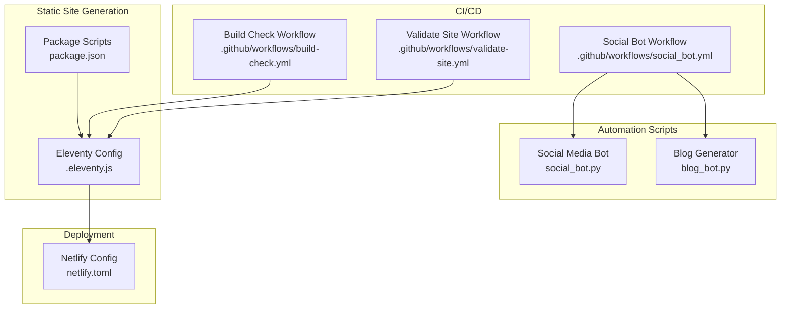
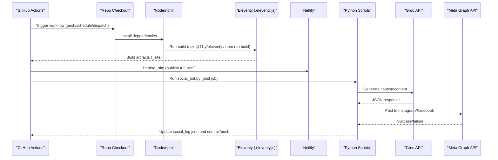
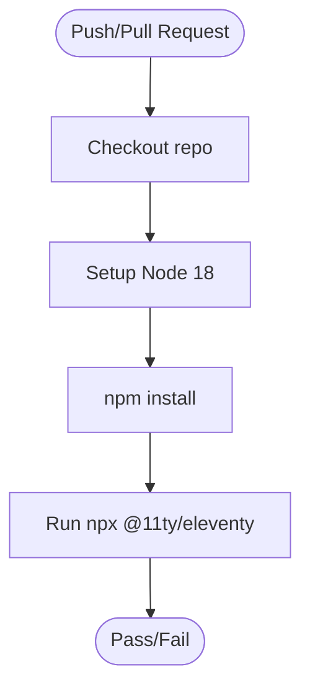
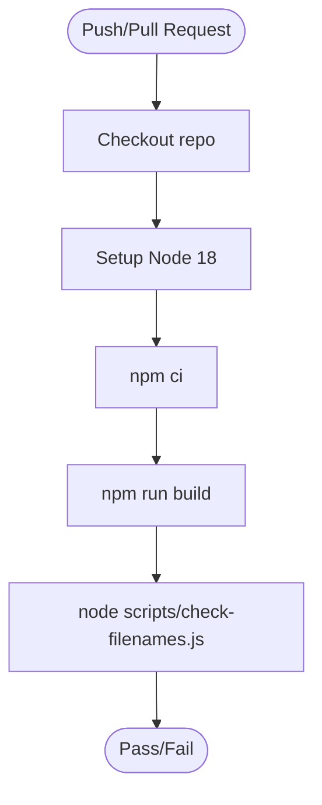
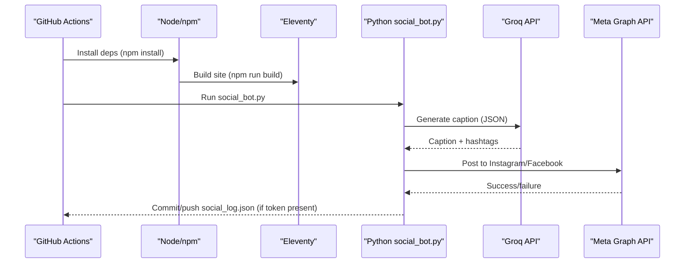
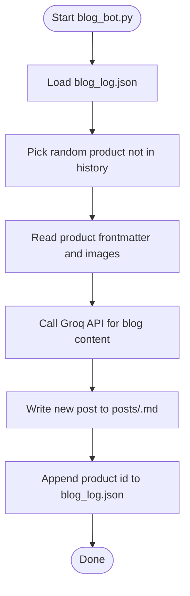
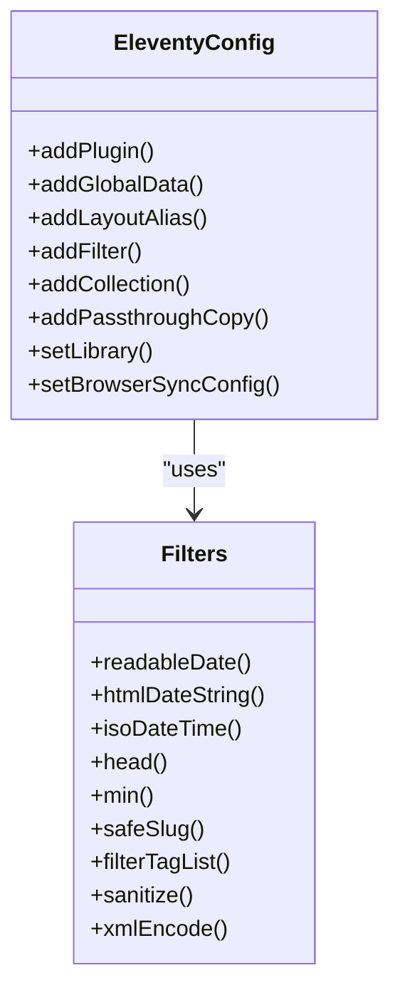
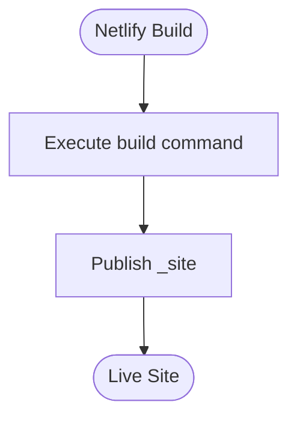
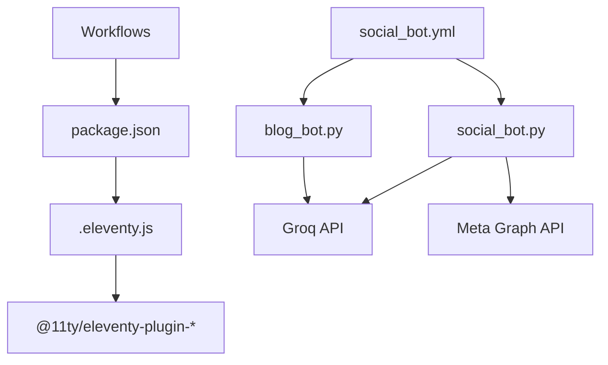

# Automation Workflows and CI/CD

<cite>
**Referenced Files in This Document**
- [build-check.yml](file://.github/workflows/build-check.yml)
- [validate-site.yml](file://.github/workflows/validate-site.yml)
- [social_bot.yml](file://.github/workflows/social_bot.yml)
- [blog_bot.py](file://blog_bot.py)
- [social_bot.py](file://social_bot.py)
- [.eleventy.js](file://.eleventy.js)
- [netlify.toml](file://netlify.toml)
- [package.json](file://package.json)
- [SOCIAL_BOT_SETUP.md](file://SOCIAL_BOT_SETUP.md)
- [check-filenames.js](file://scripts/check-filenames.js)
</cite>

## Table of Contents
1. [Introduction](#introduction)
2. [Project Structure](#project-structure)
3. [Core Components](#core-components)
4. [Architecture Overview](#architecture-overview)
5. [Detailed Component Analysis](#detailed-component-analysis)
6. [Dependency Analysis](#dependency-analysis)
7. [Performance Considerations](#performance-considerations)
8. [Troubleshooting Guide](#troubleshooting-guide)
9. [Conclusion](#conclusion)
10. [Appendices](#appendices)

## Introduction
This document explains the automation workflows and continuous integration pipeline for automated blog generation, social media posting, and build validation. It covers GitHub Actions workflows, Python automation scripts, static site generation with Eleventy, environment variable management, error handling strategies, and deployment to Netlify including caching and asset optimization. It also provides troubleshooting guidance and monitoring approaches.

## Project Structure
The repository uses a static site generator (Eleventy) with Markdown content and Nunjucks templates. Automation is implemented via:
- GitHub Actions workflows for build checks, site validation, and social media automation
- Python scripts for AI-assisted blog post creation and social media posting
- Netlify configuration for publishing and build commands

**Diagram sources**
- [build-check.yml:1-25](file://.github/workflows/build-check.yml#L1-L25)
- [validate-site.yml:1-22](file://.github/workflows/validate-site.yml#L1-L22)
- [social_bot.yml:1-58](file://.github/workflows/social_bot.yml#L1-L58)
- [blog_bot.py:1-253](file://blog_bot.py#L1-L253)
- [social_bot.py:1-315](file://social_bot.py#L1-L315)
- [.eleventy.js:1-160](file://.eleventy.js#L1-L160)
- [package.json:1-34](file://package.json#L1-L34)
- [netlify.toml:1-3](file://netlify.toml#L1-L3)

**Section sources**
- [build-check.yml:1-25](file://.github/workflows/build-check.yml#L1-L25)
- [validate-site.yml:1-22](file://.github/workflows/validate-site.yml#L1-L22)
- [social_bot.yml:1-58](file://.github/workflows/social_bot.yml#L1-L58)
- [.eleventy.js:1-160](file://.eleventy.js#L1-L160)
- [package.json:1-34](file://package.json#L1-L34)
- [netlify.toml:1-3](file://netlify.toml#L1-L3)

## Core Components
- Build Validation Workflows:
  - Build Check: Installs Node dependencies and runs Eleventy to ensure the site builds successfully on push or pull request.
  - Validate Site: Builds the site using npm scripts and runs a filename check script to prevent invalid filenames.
- Social Media Automation:
  - Scheduled workflow posts to Instagram and Facebook using Meta Graph API and generates captions via Groq AI.
  - Maintains a log file to avoid repeating recently posted products and syncs logs back to the repository.
- Blog Generation:
  - Python script reads product data from Markdown files, calls Groq AI to generate SEO-optimized blog content, and writes new posts into the posts directory.
- Static Site Generation:
  - Eleventy configuration defines plugins, filters, collections, passthrough assets, and output directory.
- Deployment:
  - Netlify configuration specifies publish directory and build command.

**Section sources**
- [build-check.yml:1-25](file://.github/workflows/build-check.yml#L1-L25)
- [validate-site.yml:1-22](file://.github/workflows/validate-site.yml#L1-L22)
- [social_bot.yml:1-58](file://.github/workflows/social_bot.yml#L1-L58)
- [blog_bot.py:1-253](file://blog_bot.py#L1-L253)
- [social_bot.py:1-315](file://social_bot.py#L1-L315)
- [.eleventy.js:1-160](file://.eleventy.js#L1-L160)
- [netlify.toml:1-3](file://netlify.toml#L1-L3)

## Architecture Overview
End-to-end flow across CI/CD, automation, and deployment:

**Diagram sources**
- [build-check.yml:1-25](file://.github/workflows/build-check.yml#L1-L25)
- [validate-site.yml:1-22](file://.github/workflows/validate-site.yml#L1-L22)
- [social_bot.yml:1-58](file://.github/workflows/social_bot.yml#L1-L58)
- [.eleventy.js:1-160](file://.eleventy.js#L1-L160)
- [netlify.toml:1-3](file://netlify.toml#L1-L3)
- [social_bot.py:1-315](file://social_bot.py#L1-L315)
- [blog_bot.py:1-253](file://blog_bot.py#L1-L253)

## Detailed Component Analysis

### Build Check Workflow
- Triggers: push to main, pull requests.
- Steps: checkout repo, setup Node 18, install dependencies, run Eleventy build.
- Purpose: fast feedback on code changes that affect site generation.

**Diagram sources**
- [build-check.yml:1-25](file://.github/workflows/build-check.yml#L1-L25)

**Section sources**
- [build-check.yml:1-25](file://.github/workflows/build-check.yml#L1-L25)

### Validate Site Workflow
- Triggers: push to main, pull requests.
- Steps: checkout repo, setup Node 18, install dependencies with npm ci, build site, run filename validation script.
- Purpose: ensures generated filenames are valid and consistent.

**Diagram sources**
- [validate-site.yml:1-22](file://.github/workflows/validate-site.yml#L1-L22)
- [package.json:1-34](file://package.json#L1-L34)
- [check-filenames.js](file://scripts/check-filenames.js)

**Section sources**
- [validate-site.yml:1-22](file://.github/workflows/validate-site.yml#L1-L22)
- [package.json:1-34](file://package.json#L1-L34)
- [check-filenames.js](file://scripts/check-filenames.js)

### Social Media Automation Workflow
- Triggers: scheduled every 8 hours and manual dispatch.
- Jobs:
  - validate-site: builds the site and waits briefly for Netlify deployment.
  - post: runs Python social bot after successful validation; requires secrets.
- Secrets: GROQ_API_KEY, META_ACCESS_TOKEN, FB_PAGE_ID, IG_USER_ID, optional GITHUB_TOKEN.

**Diagram sources**
- [social_bot.yml:1-58](file://.github/workflows/social_bot.yml#L1-L58)
- [social_bot.py:1-315](file://social_bot.py#L1-L315)

**Section sources**
- [social_bot.yml:1-58](file://.github/workflows/social_bot.yml#L1-L58)
- [social_bot.py:1-315](file://social_bot.py#L1-L315)
- [SOCIAL_BOT_SETUP.md:1-106](file://SOCIAL_BOT_SETUP.md#L1-L106)

### Blog Generation Script
- Reads product Markdown files from shop directory.
- Calls Groq AI to generate structured blog content.
- Writes new Markdown posts into posts directory with frontmatter and embedded images/buttons.
- Tracks previously used products to avoid duplicates.

**Diagram sources**
- [blog_bot.py:1-253](file://blog_bot.py#L1-L253)

**Section sources**
- [blog_bot.py:1-253](file://blog_bot.py#L1-L253)

### Eleventy Configuration
- Adds plugins (RSS, syntax highlight, navigation).
- Defines global data (site URL), layout aliases, filters (date formatting, safe slug, tag filtering, sanitization).
- Creates tag collection using sanitized slugs.
- Passthrough copies for img, css, robots.txt, feed, videos.
- Sets markdown library with anchor links.
- Output directory set to _site.

**Diagram sources**
- [.eleventy.js:1-160](file://.eleventy.js#L1-L160)

**Section sources**
- [.eleventy.js:1-160](file://.eleventy.js#L1-L160)

### Netlify Deployment Configuration
- Publishes the _site directory.
- Uses debug-enabled Eleventy build command.

**Diagram sources**
- [netlify.toml:1-3](file://netlify.toml#L1-L3)

**Section sources**
- [netlify.toml:1-3](file://netlify.toml#L1-L3)

## Dependency Analysis
- Workflows depend on Node 18 and npm scripts defined in package.json.
- Eleventy config depends on installed plugins and libraries.
- Social bot depends on Python packages (python-frontmatter, requests) and external APIs (Groq, Meta).
- Blog generator depends on python-frontmatter and Groq API.

**Diagram sources**
- [package.json:1-34](file://package.json#L1-L34)
- [.eleventy.js:1-160](file://.eleventy.js#L1-L160)
- [social_bot.yml:1-58](file://.github/workflows/social_bot.yml#L1-L58)
- [social_bot.py:1-315](file://social_bot.py#L1-L315)
- [blog_bot.py:1-253](file://blog_bot.py#L1-L253)

**Section sources**
- [package.json:1-34](file://package.json#L1-L34)
- [.eleventy.js:1-160](file://.eleventy.js#L1-L160)
- [social_bot.yml:1-58](file://.github/workflows/social_bot.yml#L1-L58)
- [social_bot.py:1-315](file://social_bot.py#L1-L315)
- [blog_bot.py:1-253](file://blog_bot.py#L1-L253)

## Performance Considerations
- Use npm ci in CI for deterministic installs and faster caching.
- Keep Eleventy build minimal by avoiding unnecessary passthrough copies.
- Limit image sizes and optimize assets before committing to reduce build time and deploy size.
- Cache Node modules in GitHub Actions to speed up subsequent runs.
- Avoid excessive retries in automation; use exponential backoff if needed.

[No sources needed since this section provides general guidance]

## Troubleshooting Guide
Common issues and resolutions:
- Missing required secrets:
  - Ensure GROQ_API_KEY, META_ACCESS_TOKEN, FB_PAGE_ID, IG_USER_ID are configured in GitHub repository secrets.
  - Verify exact secret names and non-empty values.
- Expired access tokens:
  - If Meta API returns error code indicating expired token, refresh long-lived tokens and update secrets.
- No posts happening:
  - Confirm cron schedule and manual trigger availability.
  - Verify shop directory contains product Markdown files with images and links.
- Build failures:
  - Check Node version compatibility and plugin versions.
  - Review generated filenames and ensure they pass the filename validation script.
- Log syncing skipped:
  - GITHUB_TOKEN may be missing; without it, social_log.json will not be committed/pushed.

**Section sources**
- [SOCIAL_BOT_SETUP.md:1-106](file://SOCIAL_BOT_SETUP.md#L1-L106)
- [social_bot.py:1-315](file://social_bot.py#L1-L315)
- [validate-site.yml:1-22](file://.github/workflows/validate-site.yml#L1-L22)
- [check-filenames.js](file://scripts/check-filenames.js)

## Conclusion
The repository implements a robust CI/CD pipeline combining build validation, automated blog generation, and social media posting. GitHub Actions orchestrate Node-based builds and Python automation, while Eleventy produces static assets deployed to Netlify. Proper secret management, error handling, and logging ensure reliability and observability.

[No sources needed since this section summarizes without analyzing specific files]

## Appendices

### Environment Variables and Secrets
- Required for social bot:
  - GROQ_API_KEY
  - META_ACCESS_TOKEN
  - FB_PAGE_ID
  - IG_USER_ID
- Optional:
  - GITHUB_TOKEN (for syncing logs)

**Section sources**
- [SOCIAL_BOT_SETUP.md:1-106](file://SOCIAL_BOT_SETUP.md#L1-L106)
- [social_bot.py:1-315](file://social_bot.py#L1-L315)

### Monitoring Approaches
- Review GitHub Actions logs for each workflow run.
- Inspect social_log.json and blog_log.json for recent activity.
- Monitor Netlify deployments for build status and errors.
- Track API responses and error codes from Groq and Meta APIs.

**Section sources**
- [social_bot.yml:1-58](file://.github/workflows/social_bot.yml#L1-L58)
- [social_bot.py:1-315](file://social_bot.py#L1-L315)
- [blog_bot.py:1-253](file://blog_bot.py#L1-L253)