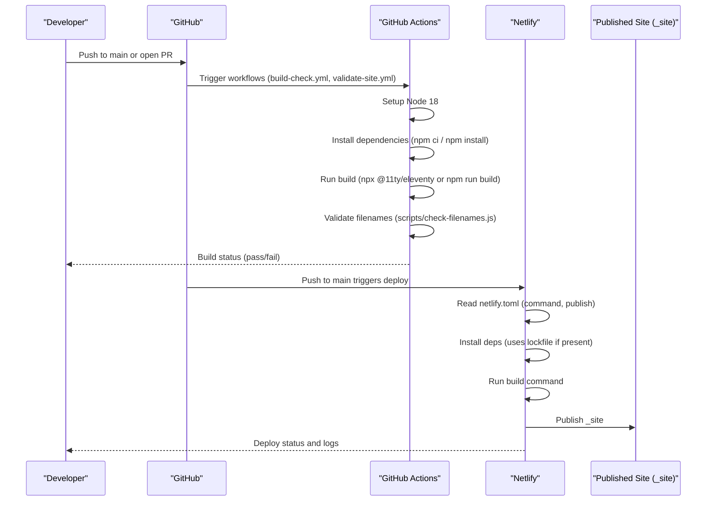
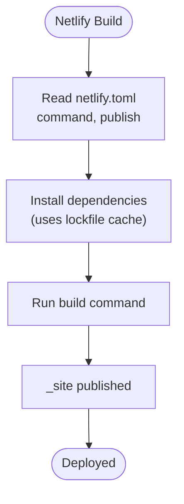
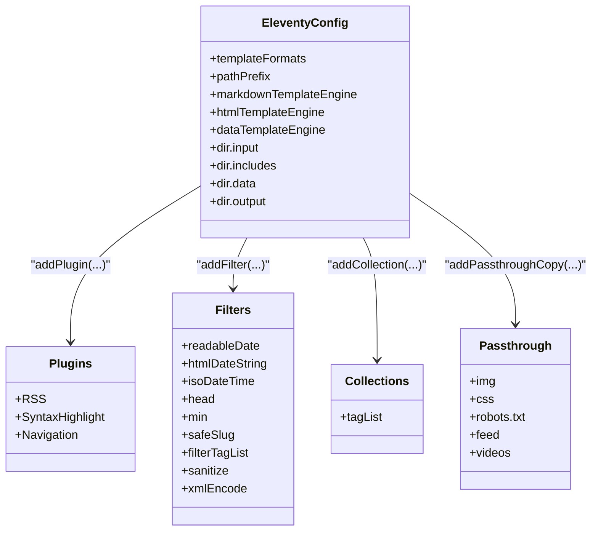
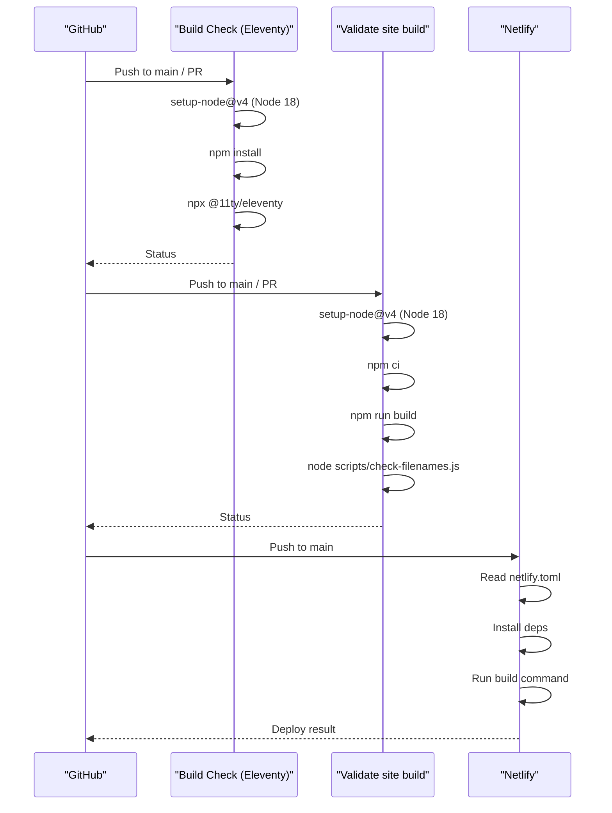
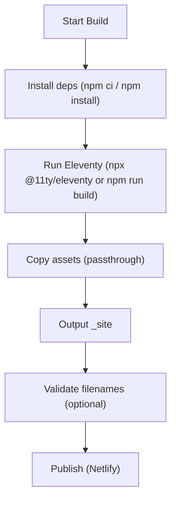
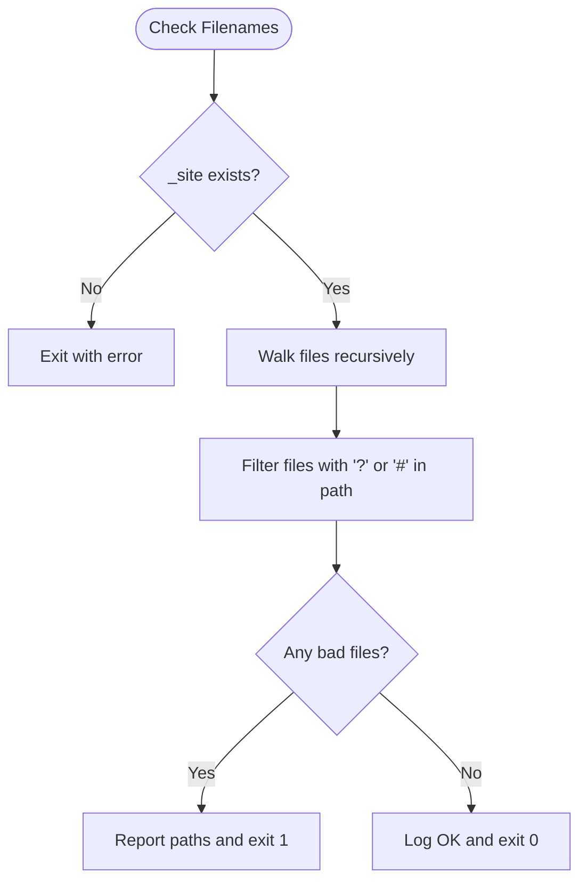
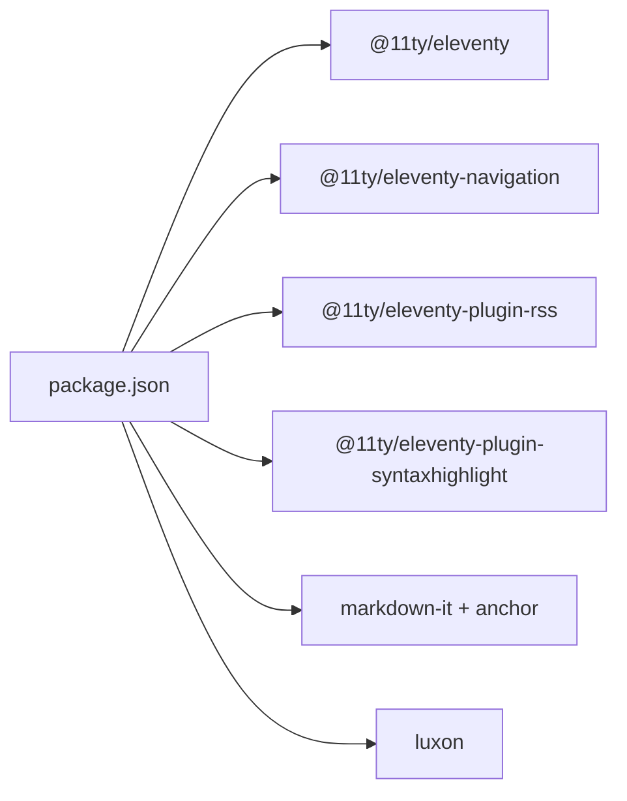

# Deployment Pipeline and Netlify Integration

<cite>
**Referenced Files in This Document**
- [netlify.toml](file://netlify.toml)
- [package.json](file://package.json)
- [.eleventy.js](file://.eleventy.js)
- [build-check.yml](file://.github/workflows/build-check.yml)
- [validate-site.yml](file://.github/workflows/validate-site.yml)
- [check-filenames.js](file://scripts/check-filenames.js)
- [README.md](file://README.md)
</cite>

## Table of Contents
1. [Introduction](#introduction)
2. [Project Structure](#project-structure)
3. [Core Components](#core-components)
4. [Architecture Overview](#architecture-overview)
5. [Detailed Component Analysis](#detailed-component-analysis)
6. [Dependency Analysis](#dependency-analysis)
7. [Performance Considerations](#performance-considerations)
8. [Troubleshooting Guide](#troubleshooting-guide)
9. [Conclusion](#conclusion)

## Introduction
This document explains the deployment pipeline and Netlify integration for this Eleventy-based site. It covers Node.js version management, dependency installation, Eleventy build commands, asset handling, Netlify configuration, continuous deployment from Git to production, build status notifications, rollback procedures, troubleshooting, performance optimization, and monitoring.

## Project Structure
The repository is an Eleventy static site project with:
- Build configuration in package.json scripts
- Eleventy configuration in .eleventy.js
- Netlify build settings in netlify.toml
- GitHub Actions workflows for CI validation and builds
- A filename validation script used by CI

```mermaid
graph TB
subgraph "Source"
P["package.json"]
E[".eleventy.js"]
N["netlify.toml"]
W1[".github/workflows/build-check.yml"]
W2[".github/workflows/validate-site.yml"]
S["scripts/check-filenames.js"]
end
subgraph "CI (GitHub Actions)"
A1["Build Check (Eleventy)"]
A2["Validate site build"]
end
subgraph "Netlify"
NB["Netlify Build"]
NP["_site (published)"]
end
P --> E
N --> NB
W1 --> A1
W2 --> A2
A1 --> |npm install + npx eleventy| NP
A2 --> |npm ci + npm run build + check-filenames.js| NP
NB --> |publish = "_site"| NP
```

**Diagram sources**
- [package.json:5-12](file://package.json#L5-L12)
- [.eleventy.js:146-158](file://.eleventy.js#L146-L158)
- [netlify.toml:1-3](file://netlify.toml#L1-L3)
- [build-check.yml:1-25](file://.github/workflows/build-check.yml#L1-L25)
- [validate-site.yml:1-22](file://.github/workflows/validate-site.yml#L1-L22)
- [check-filenames.js:1-45](file://scripts/check-filenames.js#L1-L45)

**Section sources**
- [package.json:5-12](file://package.json#L5-L12)
- [.eleventy.js:146-158](file://.eleventy.js#L146-L158)
- [netlify.toml:1-3](file://netlify.toml#L1-L3)
- [build-check.yml:1-25](file://.github/workflows/build-check.yml#L1-L25)
- [validate-site.yml:1-22](file://.github/workflows/validate-site.yml#L1-L22)
- [check-filenames.js:1-45](file://scripts/check-filenames.js#L1-L45)

## Core Components
- Build tooling and scripts:
  - npm scripts define build, watch, serve, debug, and a filename check command.
- Eleventy configuration:
  - Defines template engines, directory layout, data passthroughs, filters, collections, and output directory.
- Netlify configuration:
  - Publishes the _site directory and runs the Eleventy build command.
- CI workflows:
  - Two GitHub Actions workflows validate builds on push/pull requests using Node 18 and run the build plus checks.

Key responsibilities:
- Node.js version management: enforced via GitHub Actions setup-node steps.
- Dependency installation: npm ci or npm install in CI; Netlify uses its own environment.
- Eleventy build: executed via npm run build or directly with npx @11ty/eleventy.
- Asset optimization: handled by Eleventy passthrough copy and markdown processing; no additional minifiers are configured in this repo.

**Section sources**
- [package.json:5-12](file://package.json#L5-L12)
- [.eleventy.js:106-116](file://.eleventy.js#L106-116)
- [.eleventy.js:146-158](file://.eleventy.js#L146-L158)
- [netlify.toml:1-3](file://netlify.toml#L1-L3)
- [build-check.yml:16-25](file://.github/workflows/build-check.yml#L16-L25)
- [validate-site.yml:14-22](file://.github/workflows/validate-site.yml#L14-L22)

## Architecture Overview
End-to-end flow from code change to production:



**Diagram sources**
- [build-check.yml:1-25](file://.github/workflows/build-check.yml#L1-L25)
- [validate-site.yml:1-22](file://.github/workflows/validate-site.yml#L1-L22)
- [netlify.toml:1-3](file://netlify.toml#L1-L3)
- [check-filenames.js:1-45](file://scripts/check-filenames.js#L1-L45)

## Detailed Component Analysis

### Netlify Configuration
- Publish directory: _site
- Build command: runs Eleventy with debug enabled
- Environment variables: none defined in netlify.toml; configure them in the Netlify UI under Site settings → Build & deploy → Environment variables
- Caching: Netlify caches node_modules by default when a lockfile exists; ensure package-lock.json is committed for deterministic installs
- Redirects and headers: not defined in netlify.toml; add redirects and headers rules in netlify.toml as needed



**Diagram sources**
- [netlify.toml:1-3](file://netlify.toml#L1-L3)

**Section sources**
- [netlify.toml:1-3](file://netlify.toml#L1-L3)

### Eleventy Build Configuration
- Output directory: _site
- Template engines: md, njk, html, liquid
- Data passthrough: img, css, robots.txt, feed, videos
- Markdown library: markdown-it with anchor plugin
- Filters and collections: date formatting, safe slug generation, tag list collection
- BrowserSync config for local development only



**Diagram sources**
- [.eleventy.js:10-13](file://.eleventy.js#L10-L13)
- [.eleventy.js:25-70](file://.eleventy.js#L25-L70)
- [.eleventy.js:72-95](file://.eleventy.js#L72-L95)
- [.eleventy.js:99-104](file://.eleventy.js#L99-L104)
- [.eleventy.js:106-116](file://.eleventy.js#L106-L116)
- [.eleventy.js:146-158](file://.eleventy.js#L146-L158)

**Section sources**
- [.eleventy.js:106-116](file://.eleventy.js#L106-116)
- [.eleventy.js:146-158](file://.eleventy.js#L146-L158)

### Continuous Deployment Workflow (Git Push to Production)
- Triggers:
  - GitHub Actions: on push to main and pull requests
  - Netlify: on push to main (default branch)
- CI jobs:
  - Build Check (Eleventy): sets up Node 18, installs deps, runs Eleventy
  - Validate site build: sets up Node 18, installs deps with npm ci, runs npm run build, then validates generated filenames
- Production deploy:
  - Netlify reads netlify.toml, installs dependencies, runs the build command, and publishes _site



**Diagram sources**
- [build-check.yml:1-25](file://.github/workflows/build-check.yml#L1-L25)
- [validate-site.yml:1-22](file://.github/workflows/validate-site.yml#L1-L22)
- [netlify.toml:1-3](file://netlify.toml#L1-L3)

**Section sources**
- [build-check.yml:1-25](file://.github/workflows/build-check.yml#L1-L25)
- [validate-site.yml:1-22](file://.github/workflows/validate-site.yml#L1-L22)
- [netlify.toml:1-3](file://netlify.toml#L1-L3)

### Build Process Details
- Node.js version:
  - CI enforces Node 18 via actions/setup-node@v4
  - Netlify will use its default Node version unless specified in the UI; consider pinning it to match CI
- Dependencies:
  - CI uses npm ci (deterministic) or npm install
  - Ensure package-lock.json is committed for reproducible builds
- Eleventy commands:
  - CI: npx @11ty/eleventy or npm run build
  - Netlify: DEBUG=* eleventy (as per netlify.toml)
- Asset handling:
  - Eleventy copies img, css, robots.txt, feed, videos to _site
  - No explicit minification or image optimization configured here



**Diagram sources**
- [build-check.yml:16-25](file://.github/workflows/build-check.yml#L16-L25)
- [validate-site.yml:14-22](file://.github/workflows/validate-site.yml#L14-L22)
- [.eleventy.js:99-104](file://.eleventy.js#L99-L104)
- [netlify.toml:1-3](file://netlify.toml#L1-L3)

**Section sources**
- [build-check.yml:16-25](file://.github/workflows/build-check.yml#L16-L25)
- [validate-site.yml:14-22](file://.github/workflows/validate-site.yml#L14-L22)
- [.eleventy.js:99-104](file://.eleventy.js#L99-L104)
- [netlify.toml:1-3](file://netlify.toml#L1-L3)

### Filename Validation Logic
A dedicated script scans the generated _site for forbidden characters in filenames and fails the build if found.



**Diagram sources**
- [check-filenames.js:1-45](file://scripts/check-filenames.js#L1-L45)

**Section sources**
- [check-filenames.js:1-45](file://scripts/check-filenames.js#L1-L45)

## Dependency Analysis
- Direct runtime/dev dependencies include Eleventy core and plugins for RSS, syntax highlighting, navigation, Luxon for dates, and markdown-it with anchor support.
- CI workflows depend on Node 18 and standard npm tooling.
- Netlify depends on the presence of a lockfile for caching and determinism.



**Diagram sources**
- [package.json:24-32](file://package.json#L24-L32)

**Section sources**
- [package.json:24-32](file://package.json#L24-L32)

## Performance Considerations
- Deterministic builds:
  - Commit package-lock.json and keep CI and Netlify Node versions aligned (Node 18).
- Caching:
  - Netlify caches node_modules automatically when a lockfile is present.
- Build speed:
  - Use npm ci in CI for faster, deterministic installs.
- Asset optimization:
  - Consider adding image optimization (e.g., Eleventy image processing) and CSS/JS minification plugins to reduce payload sizes.
- Debug logging:
  - The Netlify build command includes DEBUG=*, which can increase build time and log volume; remove or scope it for production if needed.

[No sources needed since this section provides general guidance]

## Troubleshooting Guide
Common issues and resolutions:
- Build fails due to missing _site:
  - The filename checker requires _site to exist before scanning. Ensure the build step runs before the check step.
- Filenames with forbidden characters:
  - The validator rejects filenames containing ? or #. Use the safeSlug filter in templates and verify permalinks/collections generate safe names.
- Node version mismatch:
  - Align Netlify’s Node version with CI (Node 18) to avoid inconsistent behavior.
- Missing environment variables:
  - If you need env vars at build time, set them in Netlify UI under Build & deploy → Environment variables.
- Slow builds:
  - Remove or scope DEBUG=* in the Netlify build command if unnecessary.
- Lockfile issues:
  - Ensure package-lock.json is committed so Netlify can cache dependencies effectively.

**Section sources**
- [check-filenames.js:22-29](file://scripts/check-filenames.js#L22-L29)
- [.eleventy.js:48-62](file://.eleventy.js#L48-L62)
- [netlify.toml:1-3](file://netlify.toml#L1-L3)

## Conclusion
This project uses a straightforward, robust pipeline:
- GitHub Actions validate builds and enforce Node 18, dependency installation, Eleventy build, and filename checks.
- Netlify publishes the _site directory based on netlify.toml.
- For improved reliability and performance, align Node versions across CI and Netlify, leverage lockfile caching, and consider adding asset optimization plugins. Environment variables should be managed through Netlify’s UI when required.

[No sources needed since this section summarizes without analyzing specific files]