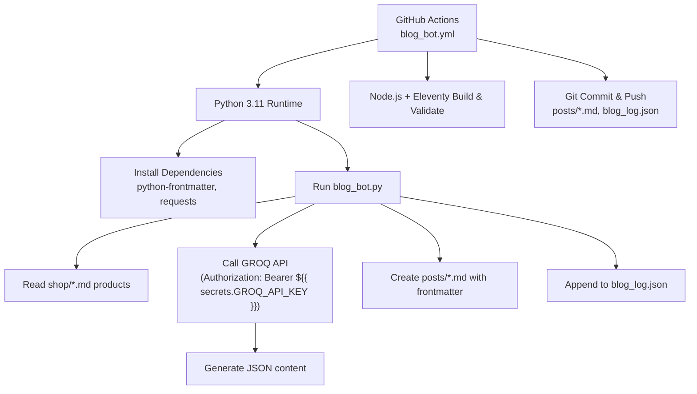
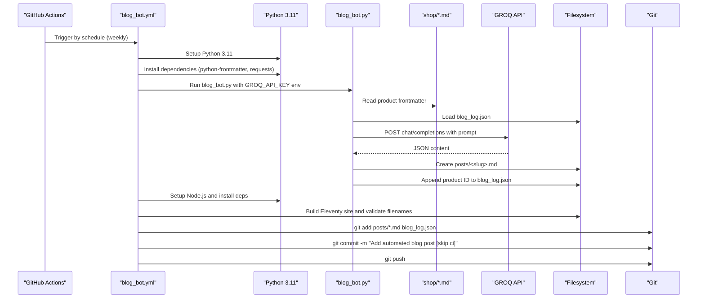
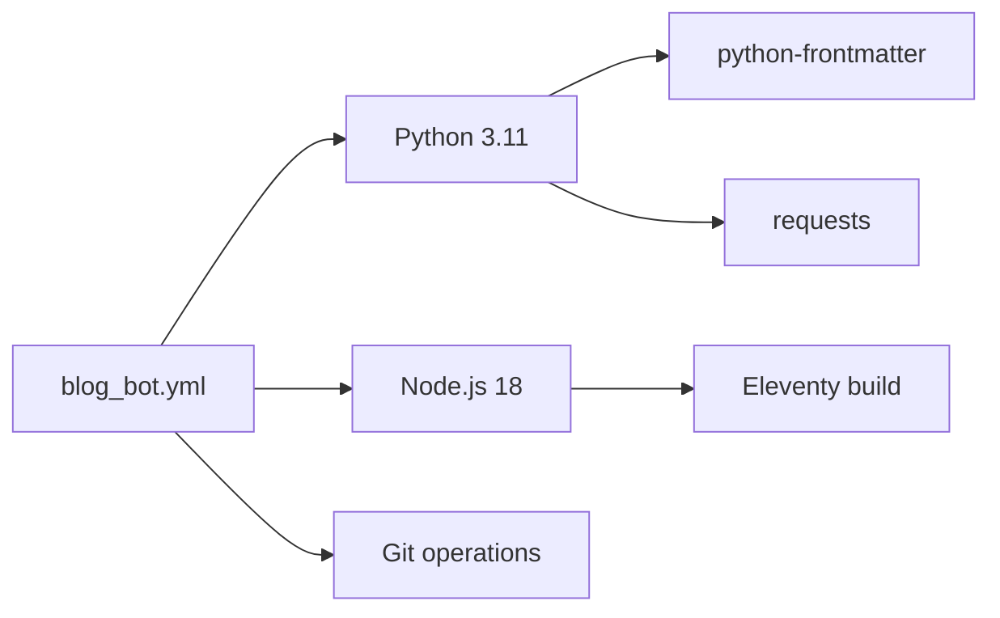

# Blog Generation Workflow

<cite>
**Referenced Files in This Document**
- [blog_bot.yml](file://.github/workflows/blog_bot.yml)
- [blog_bot.py](file://blog_bot.py)
- [blog_log.json](file://blog_log.json)
- [test_blog_bot_run.py](file://scripts/test_blog_bot_run.py)
- [social_bot.yml](file://.github/workflows/social_bot.yml)
- [SOCIAL_BOT_SETUP.md](file://SOCIAL_BOT_SETUP.md)
- [package.json](file://package.json)
</cite>

## Table of Contents
1. [Introduction](#introduction)
2. [Project Structure](#project-structure)
3. [Core Components](#core-components)
4. [Architecture Overview](#architecture-overview)
5. [Detailed Component Analysis](#detailed-component-analysis)
6. [Dependency Analysis](#dependency-analysis)
7. [Performance Considerations](#performance-considerations)
8. [Troubleshooting Guide](#troubleshooting-guide)
9. [Conclusion](#conclusion)

## Introduction
This document explains the automated blog generation workflow that runs weekly to create SEO-optimized blog posts from product data using an AI model via the GROQ API. It covers:
- Cron schedule configuration for weekly execution
- Python environment setup (version 3.11) and dependency installation
- GROQ API integration, including secret management and error handling
- Automated commit process that creates new blog posts
- Troubleshooting steps for failed runs, debugging API connectivity issues, and monitoring the blog_log.json file for generation history

## Project Structure
The automation is implemented as a GitHub Actions workflow that orchestrates Python execution, content generation, site validation, and Git commits. The key files are:
- Workflow definition: .github/workflows/blog_bot.yml
- Python script: blog_bot.py
- Generation log: blog_log.json
- Optional local test helper: scripts/test_blog_bot_run.py
- Related social media workflow for context: .github/workflows/social_bot.yml
- Site build tooling: package.json (Eleventy)

**Diagram sources**
- [blog_bot.yml:1-53](file://.github/workflows/blog_bot.yml#L1-L53)
- [blog_bot.py:1-253](file://blog_bot.py#L1-L253)
- [package.json:1-34](file://package.json#L1-L34)

**Section sources**
- [blog_bot.yml:1-53](file://.github/workflows/blog_bot.yml#L1-L53)
- [blog_bot.py:1-253](file://blog_bot.py#L1-L253)
- [package.json:1-34](file://package.json#L1-L34)

## Core Components
- Weekly cron job: Triggers every Sunday at midnight UTC.
- Python runtime: Uses Python 3.11 in GitHub Actions.
- Dependencies: python-frontmatter and requests installed via pip.
- Product selection: Randomly picks a product from shop/*.md, avoiding previously generated posts tracked in blog_log.json.
- Content generation: Sends a structured prompt to GROQ API; expects JSON response with title, description, tags, intro, product_section, why_it_works, perfect_for, conclusion.
- Post creation: Writes a Markdown post under posts/ with sanitized frontmatter and embedded images and Amazon button HTML.
- History tracking: Appends product IDs to blog_log.json to avoid duplicates.
- Validation and commit: Builds the Eleventy site and validates filenames, then commits and pushes new posts and updated log.

**Section sources**
- [blog_bot.yml:1-53](file://.github/workflows/blog_bot.yml#L1-L53)
- [blog_bot.py:1-253](file://blog_bot.py#L1-L253)
- [blog_log.json:1-1](file://blog_log.json#L1-L1)

## Architecture Overview
End-to-end flow from trigger to published post:

**Diagram sources**
- [blog_bot.yml:1-53](file://.github/workflows/blog_bot.yml#L1-L53)
- [blog_bot.py:1-253](file://blog_bot.py#L1-L253)

## Detailed Component Analysis

### Workflow Configuration (Weekly Schedule)
- Schedule: Runs weekly on Sundays at midnight UTC.
- Permissions: contents: write to allow committing and pushing changes.
- Steps:
  - Checkout repository with full history and persist credentials.
  - Set up Python 3.11 and install python-frontmatter and requests.
  - Execute blog_bot.py with GROQ_API_KEY provided via GitHub Secrets.
  - Set up Node.js 18, install dependencies, run Eleventy build, and validate filenames.
  - Commit and push new posts and updated blog_log.json.

Operational notes:
- The commit message includes [skip ci] to prevent recursive CI runs.
- The workflow ensures the site builds successfully before committing artifacts.

**Section sources**
- [blog_bot.yml:1-53](file://.github/workflows/blog_bot.yml#L1-L53)

### Python Environment and Dependencies
- Runtime: Python 3.11 configured in the workflow.
- Dependencies:
  - python-frontmatter: Used to read product metadata from shop/*.md files.
  - requests: Used to call the GROQ API.
- Installation: Executed via pip within the workflow.

Local testing:
- A helper script demonstrates creating a post with sample data and inspecting the output.

**Section sources**
- [blog_bot.yml:21-28](file://.github/workflows/blog_bot.yml#L21-L28)
- [test_blog_bot_run.py:1-10](file://scripts/test_blog_bot_run.py#L1-L10)

### GROQ API Integration and Secret Management
- Secret: GROQ_API_KEY is injected into the environment during the “Run Blog Bot” step.
- Request:
  - Endpoint: https://api.groq.com/openai/v1/chat/completions
  - Headers: Authorization: Bearer <GROQ_API_KEY>, Content-Type: application/json
  - Payload: model llama-3.3-70b-versatile, messages with user prompt, response_format json_object
- Response parsing: Expects choices[0].message.content as JSON containing required fields.

Error handling:
- Raises HTTP errors if the request fails.
- Main function prints a clear message when GROQ_API_KEY is missing.

Secret reference guidance:
- For additional context on managing secrets in workflows, see the social bot setup documentation.

**Section sources**
- [blog_bot.yml:30-33](file://.github/workflows/blog_bot.yml#L30-L33)
- [blog_bot.py:15-16](file://blog_bot.py#L15-L16)
- [blog_bot.py:84-97](file://blog_bot.py#L84-L97)
- [blog_bot.py:210-213](file://blog_bot.py#L210-L213)
- [SOCIAL_BOT_SETUP.md:1-98](file://SOCIAL_BOT_SETUP.md#L1-L98)

### Content Generation Logic
- Prompt construction: Includes product title, description, price, and Amazon link; instructs the model to return a JSON object with specific fields.
- Output structure:
  - title, description, tags, intro, product_section, why_it_works, perfect_for, conclusion
- Sanitization:
  - Tags are unescaped and cleaned of problematic characters; empty tags filtered; limited to a reasonable count.
  - Title and description escaped for safe frontmatter embedding.
- Frontmatter and body:
  - Generates YAML frontmatter with title, description, cover image, date, tags, layout, and permalink.
  - Composes markdown body with sections, bullet points, images, and a centered Amazon buy button.

**Section sources**
- [blog_bot.py:48-97](file://blog_bot.py#L48-L97)
- [blog_bot.py:99-208](file://blog_bot.py#L99-L208)

### Automated Commit Process
- After successful generation:
  - Adds all newly created posts (*.md) and the updated blog_log.json.
  - Commits with a standardized message including [skip ci].
  - Pushes changes to the repository.

Validation:
- Before committing, the workflow builds the Eleventy site and runs filename checks to ensure compatibility.

**Section sources**
- [blog_bot.yml:46-52](file://.github/workflows/blog_bot.yml#L46-L52)
- [blog_bot.yml:40-44](file://.github/workflows/blog_bot.yml#L40-L44)

### Generation History Tracking (blog_log.json)
- Purpose: Avoid generating duplicate posts for the same product by tracking product IDs.
- Behavior:
  - On each successful run, the selected product ID is appended to blog_log.json.
  - Next runs skip already processed products unless the list is exhausted.

Monitoring:
- Inspect blog_log.json to review which products have been used for blog generation.

**Section sources**
- [blog_bot.py:18-31](file://blog_bot.py#L18-L31)
- [blog_log.json:1-1](file://blog_log.json#L1-L1)

### Data Model and File Formats
- Input product format (shop/*.md):
  - Frontmatter fields include title, description, price, cover, images, amazonLink or link, and other metadata.
- Generated post format (posts/*.md):
  - Frontmatter fields include title, description, cover, date, tags, layout, permalink.
  - Body includes structured sections and images.

Example references:
- Sample product file: shop/B0CLHGCYRN.md
- Example generated post: posts/best-gift-ideas-in-uae-2025.md

**Section sources**
- [shop/B0CLHGCYRN.md:1-55](file://shop/B0CLHGCYRN.md#L1-L55)
- [posts/best-gift-ideas-in-uae-2025.md:1-200](file://posts/best-gift-ideas-in-uae-2025.md#L1-L200)

## Dependency Analysis
External dependencies and their roles:
- python-frontmatter: Parses and writes frontmatter in Markdown files.
- requests: Makes HTTP calls to the GROQ API.
- Node.js/Eleventy: Validates site build and filenames after post creation.

Workflow-level dependencies:
- GitHub Actions runners (ubuntu-latest).
- Python 3.11 runtime.
- Node.js 18 runtime for build validation.

**Diagram sources**
- [blog_bot.yml:1-53](file://.github/workflows/blog_bot.yml#L1-L53)
- [package.json:1-34](file://package.json#L1-L34)

**Section sources**
- [blog_bot.yml:1-53](file://.github/workflows/blog_bot.yml#L1-L53)
- [package.json:1-34](file://package.json#L1-L34)

## Performance Considerations
- Network latency: GROQ API calls can be slow; consider adding retries or timeouts if needed.
- Disk I/O: Writing multiple posts and updating blog_log.json should be efficient; batch operations are minimal.
- Build time: Eleventy build occurs after post creation; ensure only necessary files are changed to reduce rebuild time.
- Rate limits: Be mindful of API rate limits; weekly scheduling helps avoid excessive usage.

[No sources needed since this section provides general guidance]

## Troubleshooting Guide
Common issues and resolutions:

- Missing GROQ_API_KEY
  - Symptom: Script prints a message indicating the key is missing.
  - Resolution: Add GROQ_API_KEY to repository secrets and ensure it is passed to the workflow step.

- API request failures
  - Symptom: HTTP error raised during requests.post.
  - Resolution: Check network connectivity, verify token validity, and inspect logs for status codes and responses.

- No products available
  - Symptom: All products have been processed and no new posts are created.
  - Resolution: Review blog_log.json; remove stale entries if needed or add new product files to shop/.

- Build or filename validation failures
  - Symptom: Eleventy build or filename check fails.
  - Resolution: Fix invalid characters in titles/tags; ensure frontmatter is well-formed; re-run the workflow.

- Debugging API connectivity
  - Use the workflow logs to confirm environment variables and request payloads.
  - Compare with the social bot workflow’s secret verification step for patterns.

- Monitoring generation history
  - Inspect blog_log.json to track which product IDs have been used.
  - Remove duplicates or stale entries if you need to regenerate posts for specific products.

**Section sources**
- [blog_bot.py:210-213](file://blog_bot.py#L210-L213)
- [blog_bot.py:94-97](file://blog_bot.py#L94-L97)
- [blog_log.json:1-1](file://blog_log.json#L1-L1)
- [social_bot.yml:60-73](file://.github/workflows/social_bot.yml#L60-L73)

## Conclusion
The automated blog generation workflow integrates product data, AI-powered content creation, and continuous integration to produce high-quality posts on a weekly cadence. By leveraging GitHub Secrets for secure API access, robust sanitization and validation, and clear logging, the system maintains reliability and traceability. Use the troubleshooting guide to diagnose issues and monitor blog_log.json to manage generation history effectively.

[No sources needed since this section summarizes without analyzing specific files]