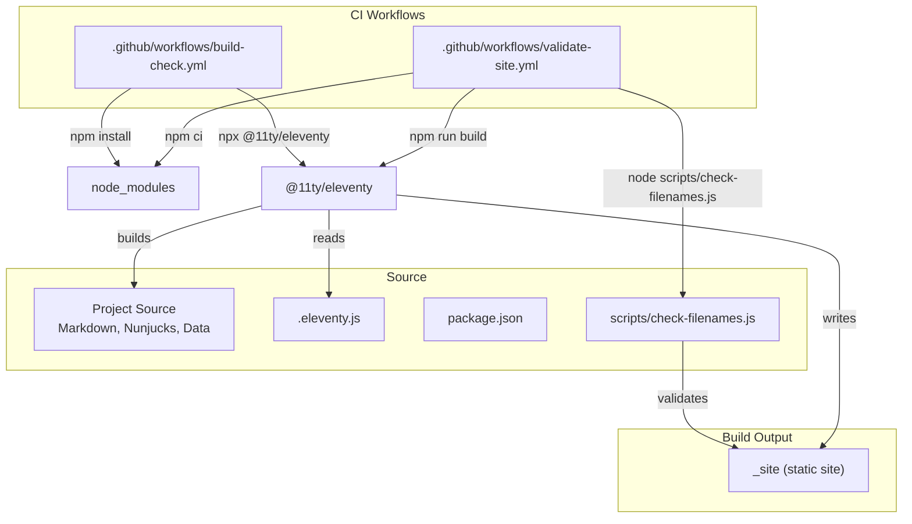
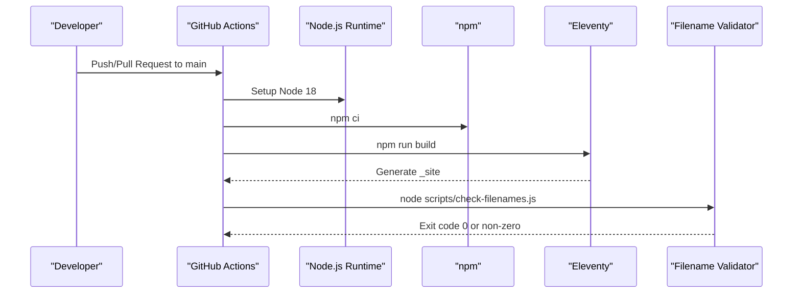
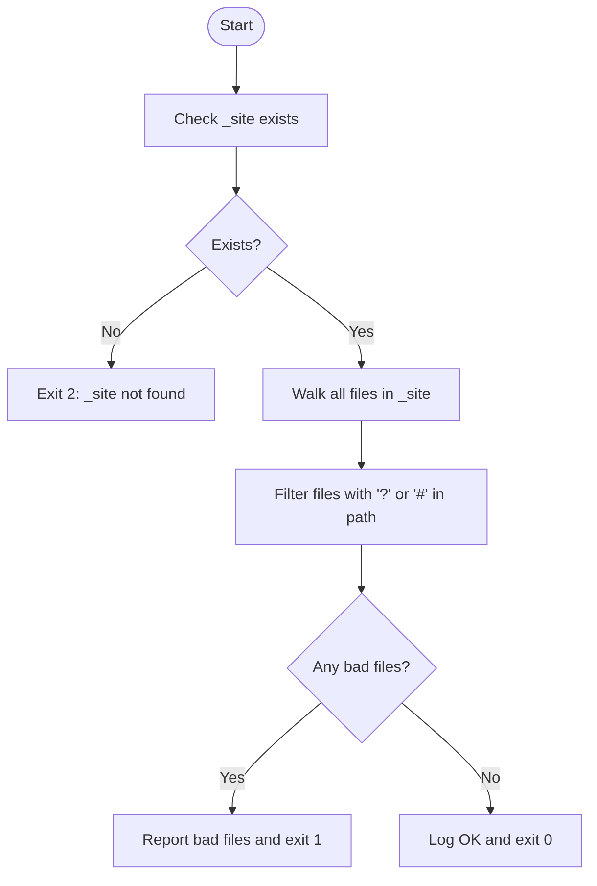
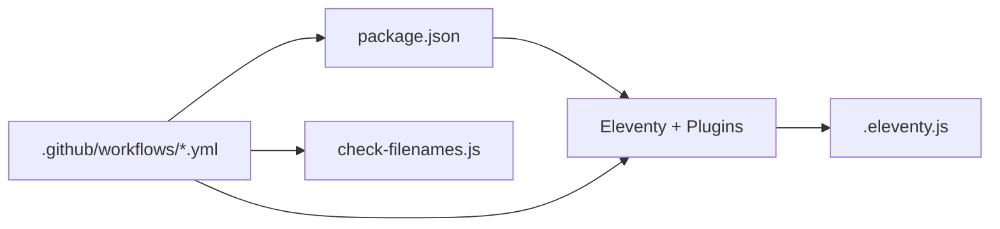

# Build Validation Workflow

<cite>
**Referenced Files in This Document**
- [package.json](file://package.json)
- [.eleventy.js](file://.eleventy.js)
- [scripts/check-filenames.js](file://scripts/check-filenames.js)
- [.github/workflows/validate-site.yml](file://.github/workflows/validate-site.yml)
- [.github/workflows/build-check.yml](file://.github/workflows/build-check.yml)
- [netlify.toml](file://netlify.toml)
- [.travis.yml](file://.travis.yml)
- [.gitignore](file://.gitignore)
</cite>

## Table of Contents
1. Introduction
2. Project Structure
3. Core Components
4. Architecture Overview
5. Detailed Component Analysis
6. Dependency Analysis
7. Performance Considerations
8. Troubleshooting Guide
9. Conclusion

## Introduction
This document explains the build validation workflow that ensures code quality and site integrity for this Eleventy-based project. It covers:
- Node.js environment setup
- Installing dependencies using npm ci (CI mode)
- Running the Eleventy build
- Executing the filename validation script
- Common build failure scenarios
- Guidance on configuring build caching, optimizing performance, and interpreting logs for debugging

## Project Structure
The build pipeline is orchestrated by GitHub Actions workflows and local npm scripts. The Eleventy configuration defines template engines, output directory, passthrough assets, and filters used during the build. A dedicated script validates generated filenames to prevent deployment issues.

**Diagram sources**
- [.github/workflows/validate-site.yml:10-22](file://.github/workflows/validate-site.yml#L10-L22)
- [.github/workflows/build-check.yml:9-25](file://.github/workflows/build-check.yml#L9-L25)
- [.eleventy.js:145-159](file://.eleventy.js#L145-L159)
- [scripts/check-filenames.js:22-45](file://scripts/check-filenames.js#L22-L45)
- [package.json:5-12](file://package.json#L5-L12)

**Section sources**
- [.github/workflows/validate-site.yml:10-22](file://.github/workflows/validate-site.yml#L10-L22)
- [.github/workflows/build-check.yml:9-25](file://.github/workflows/build-check.yml#L9-L25)
- [.eleventy.js:145-159](file://.eleventy.js#L145-L159)
- [package.json:5-12](file://package.json#L5-L12)

## Core Components
- Node.js runtime: Version pinned in CI workflows.
- Dependency installation: CI uses npm ci; local development may use npm install.
- Build command: npm run build invokes Eleventy via package.json scripts.
- Filename validation: Node script scans _site for forbidden characters.
- Eleventy configuration: Defines template formats, directories, plugins, filters, and passthrough copies.

Key responsibilities:
- package.json: Declares scripts and devDependencies for Eleventy and related tools.
- .eleventy.js: Configures Eleventy behavior, including output directory and asset passthrough.
- scripts/check-filenames.js: Validates generated filenames to ensure safe URLs.
- .github/workflows/*: Define CI steps for reproducible builds and validations.

**Section sources**
- [package.json:24-32](file://package.json#L24-L32)
- [.eleventy.js:145-159](file://.eleventy.js#L145-L159)
- [scripts/check-filenames.js:22-45](file://scripts/check-filenames.js#L22-L45)
- [.github/workflows/validate-site.yml:10-22](file://.github/workflows/validate-site.yml#L10-L22)
- [.github/workflows/build-check.yml:9-25](file://.github/workflows/build-check.yml#L9-L25)

## Architecture Overview
The CI pipeline performs a deterministic build and validation sequence:
- Checkout repository
- Setup Node.js
- Install dependencies with npm ci
- Run Eleventy build
- Validate generated filenames

**Diagram sources**
- [.github/workflows/validate-site.yml:10-22](file://.github/workflows/validate-site.yml#L10-L22)
- [package.json:5-12](file://package.json#L5-L12)
- [scripts/check-filenames.js:22-45](file://scripts/check-filenames.js#L22-L45)

## Detailed Component Analysis

### Node.js Environment Setup
- CI sets Node.js version explicitly to ensure consistent builds across runs.
- Local development should align with the same major version to avoid compatibility issues.

**Section sources**
- [.github/workflows/validate-site.yml:14-16](file://.github/workflows/validate-site.yml#L14-L16)
- [.github/workflows/build-check.yml:16-19](file://.github/workflows/build-check.yml#L16-L19)

### Dependency Installation (CI Mode)
- CI uses npm ci to install dependencies from package-lock.json deterministically.
- Alternative workflow uses npm install for flexibility but less strict reproducibility.

Best practices:
- Keep package-lock.json committed to enable npm ci.
- Prefer npm ci in CI pipelines for speed and reliability.

**Section sources**
- [.github/workflows/validate-site.yml:17-18](file://.github/workflows/validate-site.yml#L17-L18)
- [.github/workflows/build-check.yml:21-22](file://.github/workflows/build-check.yml#L21-L22)
- [.gitignore:1-4](file://.gitignore#L1-4)

### Eleventy Build Process
- npm run build executes Eleventy according to package.json scripts.
- Eleventy reads .eleventy.js to determine template engines, data directories, output directory, and passthrough assets.
- Output directory is _site, which is also the publish target for Netlify.

Configuration highlights:
- Template formats include Markdown and Nunjucks.
- Directories: input root, includes, data, and output _site.
- Passthrough copy for static assets like images, CSS, feed, and videos.

**Section sources**
- [package.json:5-12](file://package.json#L5-L12)
- [.eleventy.js:145-159](file://.eleventy.js#L145-L159)
- [.eleventy.js:99-104](file://.eleventy.js#L99-L104)
- [netlify.toml:1-3](file://netlify.toml#L1-3)

### Filename Validation Script
The validator ensures no generated files contain forbidden characters (? or #), which can cause routing or hosting issues.

Behavior:
- Requires _site to exist; otherwise exits with an error indicating to run the build first.
- Recursively walks _site and checks file paths against a regex pattern.
- Exits with code 1 if any invalid filenames are found; otherwise exits with code 0.

**Diagram sources**
- [scripts/check-filenames.js:22-45](file://scripts/check-filenames.js#L22-L45)

**Section sources**
- [scripts/check-filenames.js:22-45](file://scripts/check-filenames.js#L22-L45)

### CI Workflows
Two workflows demonstrate different approaches:
- validate-site.yml: Uses npm ci, npm run build, then runs the filename validator.
- build-check.yml: Uses npm install and directly invokes Eleventy via npx.

Recommendation:
- Use validate-site.yml for strict, reproducible builds and validation.
- Use build-check.yml for quick checks without enforcing lockfile usage.

**Section sources**
- [.github/workflows/validate-site.yml:10-22](file://.github/workflows/validate-site.yml#L10-L22)
- [.github/workflows/build-check.yml:9-25](file://.github/workflows/build-check.yml#L9-L25)

### Hosting Configuration (Netlify)
Netlify publishes the _site directory and runs Eleventy with debug enabled. This helps capture detailed logs during hosted builds.

**Section sources**
- [netlify.toml:1-3](file://netlify.toml#L1-3)

### Legacy CI (Travis)
A legacy Travis configuration installs Eleventy globally and builds with a path prefix. This is retained for historical reference and does not affect current CI.

**Section sources**
- [.travis.yml:1-15](file://.travis.yml#L1-L15)

## Dependency Analysis
The build depends on:
- Node.js runtime (version pinned in CI)
- npm for dependency management
- Eleventy core and plugins declared in devDependencies
- Custom filename validation script

**Diagram sources**
- [package.json:24-32](file://package.json#L24-L32)
- [.eleventy.js:1-14](file://.eleventy.js#L1-L14)
- [.github/workflows/validate-site.yml:10-22](file://.github/workflows/validate-site.yml#L10-L22)
- [.github/workflows/build-check.yml:9-25](file://.github/workflows/build-check.yml#L9-L25)

**Section sources**
- [package.json:24-32](file://package.json#L24-L32)
- [.eleventy.js:1-14](file://.eleventy.js#L1-L14)
- [.github/workflows/validate-site.yml:10-22](file://.github/workflows/validate-site.yml#L10-L22)
- [.github/workflows/build-check.yml:9-25](file://.github/workflows/build-check.yml#L9-L25)

## Performance Considerations
Optimizations and guidance:
- Use npm ci in CI for faster, deterministic installs.
- Keep package-lock.json up-to-date to leverage cache effectively.
- Avoid unnecessary rebuilds by committing only changed content when possible.
- Limit heavy operations in templates and data processing.
- Use Eleventy’s passthrough copy for large static assets to avoid reprocessing.
- Enable caching at the CI platform level (e.g., GitHub Actions cache for node_modules).

[No sources needed since this section provides general guidance]

## Troubleshooting Guide
Common failures and resolutions:
- Missing _site directory before validation:
  - Symptom: Validator reports _site not found and exits with code 2.
  - Resolution: Ensure npm run build completes successfully before running the validator.
- Forbidden characters in generated filenames:
  - Symptom: Validator lists files containing ? or # and exits with code 1.
  - Resolution: Adjust slugs or permalink logic to sanitize unsafe characters.
- Dependency resolution errors:
  - Symptom: npm ci fails due to missing or mismatched lockfile entries.
  - Resolution: Commit updated package-lock.json or run npm install locally to regenerate it.
- Node.js version mismatch:
  - Symptom: Build fails due to incompatible Node version.
  - Resolution: Align local Node version with CI (v18) or update CI to match your environment.
- Debugging builds:
  - Use DEBUG=* to capture verbose logs during Eleventy execution.
  - In Netlify, the build command already enables debug output.

Operational references:
- CI steps for install and build
- Package scripts for build and debug
- Validator behavior and exit codes
- Eleventy configuration for output directory and passthrough assets

**Section sources**
- [scripts/check-filenames.js:22-45](file://scripts/check-filenames.js#L22-L45)
- [.github/workflows/validate-site.yml:17-22](file://.github/workflows/validate-site.yml#L17-L22)
- [package.json:5-12](file://package.json#L5-L12)
- [.eleventy.js:145-159](file://.eleventy.js#L145-L159)
- [netlify.toml:1-3](file://netlify.toml#L1-3)

## Conclusion
The build validation workflow combines deterministic dependency installation, Eleventy generation, and post-build filename validation to maintain site integrity. By following the recommended practices—using npm ci, pinning Node versions, sanitizing slugs, and leveraging debug logs—you can achieve reliable, fast, and maintainable builds across local and CI environments.

[No sources needed since this section summarizes without analyzing specific files]