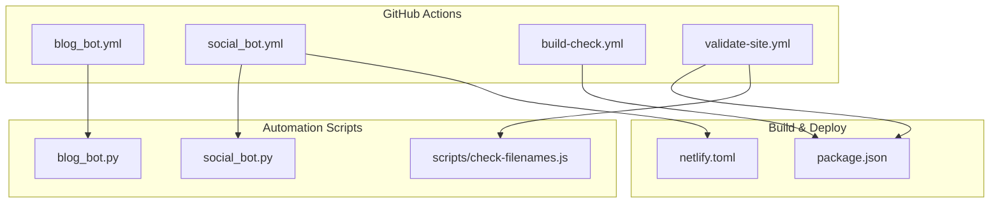
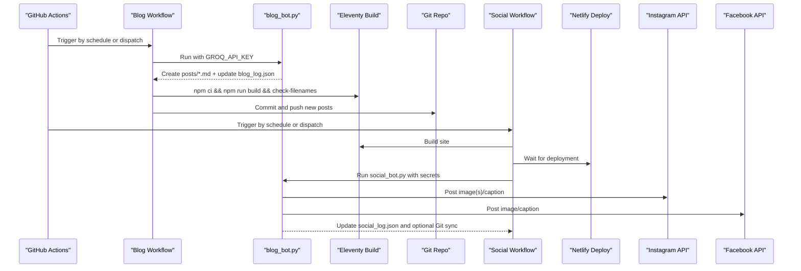
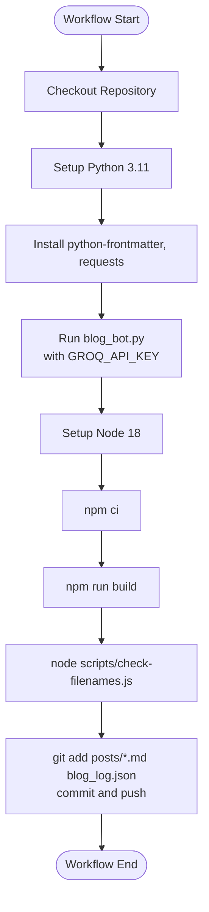
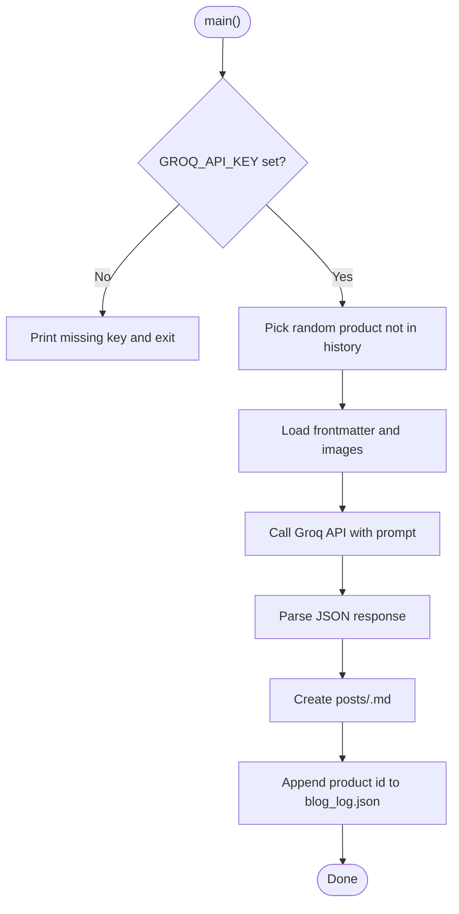
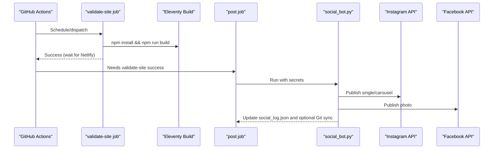
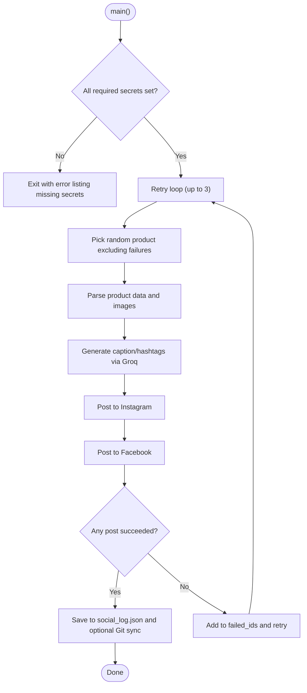
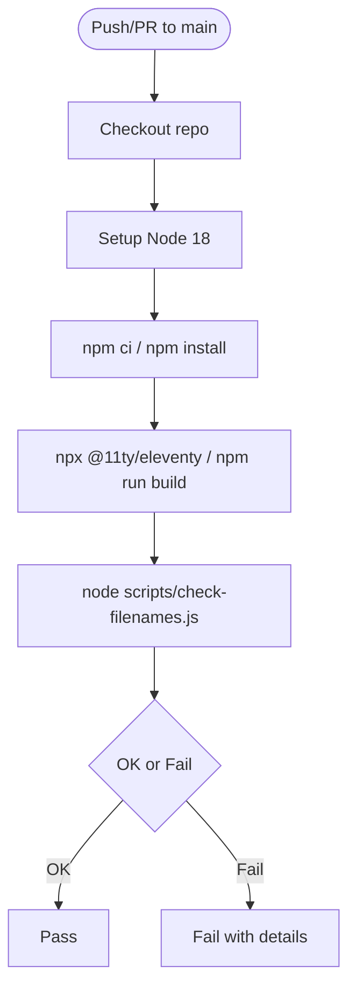
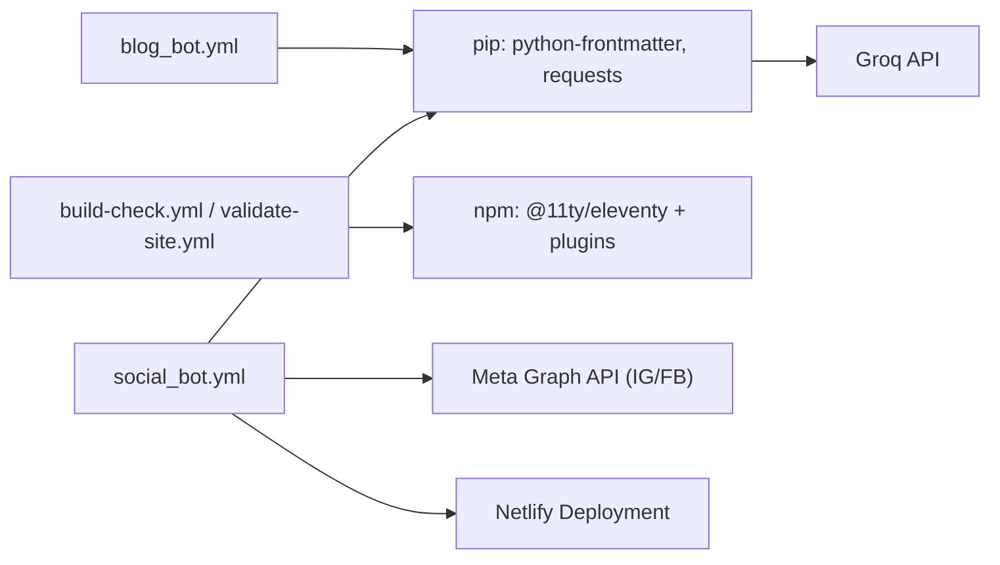

# GitHub Actions Workflows

<cite>
**Referenced Files in This Document**
- [blog_bot.yml](file://.github/workflows/blog_bot.yml)
- [social_bot.yml](file://.github/workflows/social_bot.yml)
- [build-check.yml](file://.github/workflows/build-check.yml)
- [validate-site.yml](file://.github/workflows/validate-site.yml)
- [blog_bot.py](file://blog_bot.py)
- [social_bot.py](file://social_bot.py)
- [check-filenames.js](file://scripts/check-filenames.js)
- [package.json](file://package.json)
- [netlify.toml](file://netlify.toml)
- [SOCIAL_BOT_SETUP.md](file://SOCIAL_BOT_SETUP.md)
</cite>

## Table of Contents
1. Introduction
2. Project Structure
3. Core Components
4. Architecture Overview
5. Detailed Component Analysis
6. Dependency Analysis
7. Performance Considerations
8. Troubleshooting Guide
9. Conclusion
10. Appendices

## Introduction
This document explains the GitHub Actions workflows that power automated content generation and site build validation for the project. It covers:
- Automated blog post generation using a Python script and Groq AI, with scheduled runs and manual triggers
- Build validation to ensure Eleventy builds succeed and generated filenames are safe
- Social media posting automation (Instagram/Facebook) after successful site builds
- Workflow triggers (cron schedules, manual dispatch), environment variable management via GitHub Secrets, and error handling strategies
- Customization examples, debugging failed runs, and monitoring workflow performance

## Project Structure
The repository includes multiple GitHub Actions workflows under .github/workflows, along with Python automation scripts and Node-based build tooling. The key files relevant to this documentation are:
- Blog generation workflow and script
- Social media automation workflow and script
- Build validation workflows and filename checker
- Site configuration for Netlify deployment

**Diagram sources**
- [blog_bot.yml:1-52](file://.github/workflows/blog_bot.yml#L1-L52)
- [social_bot.yml:1-94](file://.github/workflows/social_bot.yml#L1-L94)
- [build-check.yml:1-25](file://.github/workflows/build-check.yml#L1-L25)
- [validate-site.yml:1-22](file://.github/workflows/validate-site.yml#L1-L22)
- [blog_bot.py:1-253](file://blog_bot.py#L1-L253)
- [social_bot.py:1-315](file://social_bot.py#L1-L315)
- [check-filenames.js:1-45](file://scripts/check-filenames.js#L1-L45)
- [package.json:1-34](file://package.json#L1-L34)
- [netlify.toml:1-3](file://netlify.toml#L1-L3)

**Section sources**
- [blog_bot.yml:1-52](file://.github/workflows/blog_bot.yml#L1-L52)
- [social_bot.yml:1-94](file://.github/workflows/social_bot.yml#L1-L94)
- [build-check.yml:1-25](file://.github/workflows/build-check.yml#L1-L25)
- [validate-site.yml:1-22](file://.github/workflows/validate-site.yml#L1-L22)
- [blog_bot.py:1-253](file://blog_bot.py#L1-L253)
- [social_bot.py:1-315](file://social_bot.py#L1-L315)
- [check-filenames.js:1-45](file://scripts/check-filenames.js#L1-L45)
- [package.json:1-34](file://package.json#L1-L34)
- [netlify.toml:1-3](file://netlify.toml#L1-L3)

## Core Components
- Blog Generation Workflow: Schedules weekly runs and allows manual dispatch. Sets up Python, installs dependencies, runs the blog generator, validates the Eleventy build, and commits new posts.
- Social Media Automation Workflow: Validates the site build first, waits for Netlify deployment, then posts to Instagram and Facebook using generated captions and images.
- Build Validation Workflows: Ensure Eleventy builds successfully on push/PR and validate generated filenames for safety.
- Python Automation Scripts: Generate SEO-optimized blog posts and social media content using Groq AI; handle API errors and retries; persist logs and optionally sync to Git.
- Node Utilities: Filename checker ensures no forbidden characters in generated output paths.

**Section sources**
- [blog_bot.yml:1-52](file://.github/workflows/blog_bot.yml#L1-L52)
- [social_bot.yml:1-94](file://.github/workflows/social_bot.yml#L1-L94)
- [build-check.yml:1-25](file://.github/workflows/build-check.yml#L1-L25)
- [validate-site.yml:1-22](file://.github/workflows/validate-site.yml#L1-L22)
- [blog_bot.py:1-253](file://blog_bot.py#L1-L253)
- [social_bot.py:1-315](file://social_bot.py#L1-L315)
- [check-filenames.js:1-45](file://scripts/check-filenames.js#L1-L45)

## Architecture Overview
The CI/CD architecture integrates scheduling, code generation, site building, deployment, and social media publishing.

**Diagram sources**
- [blog_bot.yml:1-52](file://.github/workflows/blog_bot.yml#L1-L52)
- [social_bot.yml:1-94](file://.github/workflows/social_bot.yml#L1-L94)
- [blog_bot.py:1-253](file://blog_bot.py#L1-L253)
- [social_bot.py:1-315](file://social_bot.py#L1-L315)
- [check-filenames.js:1-45](file://scripts/check-filenames.js#L1-L45)
- [netlify.toml:1-3](file://netlify.toml#L1-L3)

## Detailed Component Analysis

### Blog Generation Workflow
- Triggers: Weekly cron and manual dispatch.
- Environment: Ubuntu runner, Python 3.11, Node 18.
- Steps:
  - Checkout repo with credentials persistence
  - Install Python dependencies (python-frontmatter, requests)
  - Run blog generator with GROQ_API_KEY secret
  - Validate Eleventy build and filename safety
  - Commit and push new posts and log file

**Diagram sources**
- [blog_bot.yml:1-52](file://.github/workflows/blog_bot.yml#L1-L52)
- [blog_bot.py:1-253](file://blog_bot.py#L1-L253)
- [check-filenames.js:1-45](file://scripts/check-filenames.js#L1-L45)

**Section sources**
- [blog_bot.yml:1-52](file://.github/workflows/blog_bot.yml#L1-L52)
- [blog_bot.py:1-253](file://blog_bot.py#L1-L253)
- [check-filenames.js:1-45](file://scripts/check-filenames.js#L1-L45)

#### Blog Bot Script Behavior
- Reads product markdown from shop directory
- Calls Groq API with GROQ_API_KEY to generate structured blog content
- Creates a new Markdown post in posts directory with frontmatter and embedded images
- Updates blog_log.json to avoid reprocessing the same product
- Error handling: prints missing keys and exceptions; exits gracefully

**Diagram sources**
- [blog_bot.py:1-253](file://blog_bot.py#L1-L253)

**Section sources**
- [blog_bot.py:1-253](file://blog_bot.py#L1-L253)

### Social Media Automation Workflow
- Triggers: Every 8 hours via cron and manual dispatch.
- Jobs:
  - validate-site: Builds the site and waits for Netlify deployment
  - post: Runs social bot with required secrets; posts to Instagram and Facebook; updates social_log.json; optionally syncs to Git

**Diagram sources**
- [social_bot.yml:1-94](file://.github/workflows/social_bot.yml#L1-L94)
- [social_bot.py:1-315](file://social_bot.py#L1-L315)
- [netlify.toml:1-3](file://netlify.toml#L1-L3)

**Section sources**
- [social_bot.yml:1-94](file://.github/workflows/social_bot.yml#L1-L94)
- [social_bot.py:1-315](file://social_bot.py#L1-L315)
- [netlify.toml:1-3](file://netlify.toml#L1-L3)

#### Social Bot Script Behavior
- Requires secrets: GROQ_API_KEY, META_ACCESS_TOKEN, FB_PAGE_ID, IG_USER_ID
- Selects a random product not recently posted
- Generates caption and hashtags via Groq API
- Posts to Instagram (single or carousel) and Facebook
- Retries up to 3 times with different products on failure
- Logs results to social_log.json and can sync to Git if GITHUB_TOKEN is present

**Diagram sources**
- [social_bot.py:1-315](file://social_bot.py#L1-L315)

**Section sources**
- [social_bot.py:1-315](file://social_bot.py#L1-L315)

### Build Validation Workflows
- build-check.yml: On push/PR to main, sets up Node 18, installs dependencies, and runs Eleventy build.
- validate-site.yml: On push/PR to main, installs dependencies, builds the site, and checks generated filenames for forbidden characters.

**Diagram sources**
- [build-check.yml:1-25](file://.github/workflows/build-check.yml#L1-L25)
- [validate-site.yml:1-22](file://.github/workflows/validate-site.yml#L1-L22)
- [check-filenames.js:1-45](file://scripts/check-filenames.js#L1-L45)

**Section sources**
- [build-check.yml:1-25](file://.github/workflows/build-check.yml#L1-L25)
- [validate-site.yml:1-22](file://.github/workflows/validate-site.yml#L1-L22)
- [check-filenames.js:1-45](file://scripts/check-filenames.js#L1-L45)

## Dependency Analysis
- Python dependencies used by automation scripts:
  - python-frontmatter: Read/write frontmatter in Markdown
  - requests: HTTP calls to Groq API and Meta APIs
- Node dependencies managed via package.json for Eleventy build and plugins
- External integrations:
  - Groq API for content generation
  - Meta Graph API for Instagram and Facebook posting
  - Netlify for site deployment

**Diagram sources**
- [blog_bot.yml:1-52](file://.github/workflows/blog_bot.yml#L1-L52)
- [social_bot.yml:1-94](file://.github/workflows/social_bot.yml#L1-L94)
- [build-check.yml:1-25](file://.github/workflows/build-check.yml#L1-L25)
- [validate-site.yml:1-22](file://.github/workflows/validate-site.yml#L1-L22)
- [package.json:1-34](file://package.json#L1-L34)

**Section sources**
- [blog_bot.yml:1-52](file://.github/workflows/blog_bot.yml#L1-L52)
- [social_bot.yml:1-94](file://.github/workflows/social_bot.yml#L1-L94)
- [build-check.yml:1-25](file://.github/workflows/build-check.yml#L1-L25)
- [validate-site.yml:1-22](file://.github/workflows/validate-site.yml#L1-L22)
- [package.json:1-34](file://package.json#L1-L34)

## Performance Considerations
- Use cached dependencies where possible to speed up runs (e.g., pip cache, npm cache).
- Keep Python and Node versions pinned to stable releases for consistent builds.
- Limit retries and implement backoff when calling external APIs to avoid rate limits.
- Prefer deterministic scheduling windows to reduce contention on shared runners.
- Validate site early in workflows to fail fast before expensive operations like social posting.

[No sources needed since this section provides general guidance]

## Troubleshooting Guide
- Missing secrets:
  - Ensure all required secrets are configured in GitHub repository settings.
  - For social bot, verify GROQ_API_KEY, META_ACCESS_TOKEN, FB_PAGE_ID, IG_USER_ID.
  - Optional GITHUB_TOKEN enables log syncing to the repository.
- Build failures:
  - Confirm Node version matches workflow setup.
  - Review Eleventy build logs for template or dependency issues.
  - Filenames containing forbidden characters will cause the filename checker to fail.
- Social posting failures:
  - Check token expiration messages and permissions in workflow logs.
  - Verify images are accessible at the expected URLs.
  - Inspect API responses for detailed error codes.
- Debugging failed runs:
  - Open the Actions tab, select the workflow run, and inspect step logs.
  - Use the debug steps provided in the social workflow to confirm secret availability.
  - Manually trigger workflows to reproduce issues.

**Section sources**
- [social_bot.yml:60-94](file://.github/workflows/social_bot.yml#L60-L94)
- [SOCIAL_BOT_SETUP.md:1-106](file://SOCIAL_BOT_SETUP.md#L1-L106)
- [check-filenames.js:1-45](file://scripts/check-filenames.js#L1-L45)

## Conclusion
The workflows provide a robust pipeline for automated blog generation, site build validation, and social media publishing. They leverage scheduled triggers, secure secret management, and clear error handling to maintain reliability. With the provided customization and troubleshooting guidance, you can adapt the pipelines to your needs and monitor performance effectively.

[No sources needed since this section summarizes without analyzing specific files]

## Appendices

### Workflow Customization Examples
- Change blog generation frequency:
  - Update the cron expression in the blog workflow schedule.
- Add additional build validations:
  - Extend the validate-site workflow with linting or link checks.
- Customize social posting cadence:
  - Adjust the cron expression in the social workflow schedule.
- Enable caching:
  - Add caching steps for pip and npm to improve performance.

**Section sources**
- [blog_bot.yml:1-52](file://.github/workflows/blog_bot.yml#L1-L52)
- [social_bot.yml:1-94](file://.github/workflows/social_bot.yml#L1-L94)
- [validate-site.yml:1-22](file://.github/workflows/validate-site.yml#L1-L22)

### Monitoring Workflow Performance
- Review run durations and concurrency in the Actions tab.
- Analyze step-level logs for bottlenecks.
- Track success/failure rates over time to identify recurring issues.
- Set up alerts or notifications for critical workflow failures.

[No sources needed since this section provides general guidance]