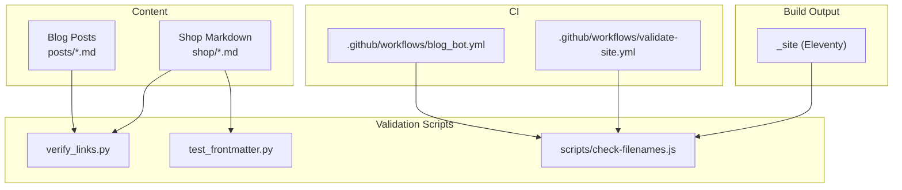
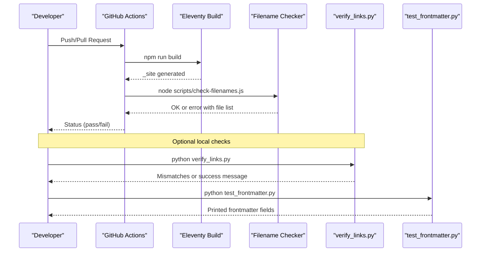
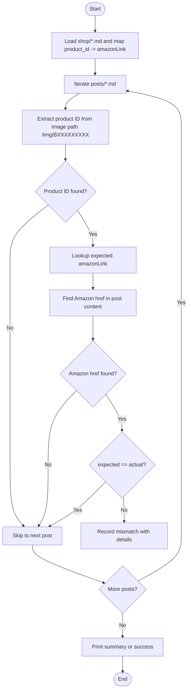
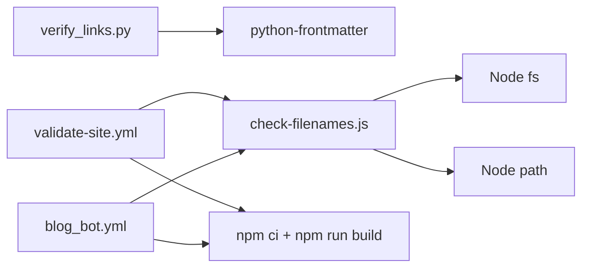

# Site Validation Workflow

<cite>
**Referenced Files in This Document**
- [verify_links.py](file://verify_links.py)
- [test_frontmatter.py](file://test_frontmatter.py)
- [check-filenames.js](file://scripts/check-filenames.js)
- [validate-site.yml](file://.github/workflows/validate-site.yml)
- [blog_bot.yml](file://.github/workflows/blog_bot.yml)
- [package.json](file://package.json)
- [.eleventy.js](file://.eleventy.js)
- [B0F3KHSF4V.md](file://shop/B0F3KHSF4V.md)
- [best-gift-ideas-in-uae-2025.md](file://posts/best-gift-ideas-in-uae-2025.md)
</cite>

## Table of Contents
1. [Introduction](#introduction)
2. [Project Structure](#project-structure)
3. [Core Components](#core-components)
4. [Architecture Overview](#architecture-overview)
5. [Detailed Component Analysis](#detailed-component-analysis)
6. [Dependency Analysis](#dependency-analysis)
7. [Performance Considerations](#performance-considerations)
8. [Troubleshooting Guide](#troubleshooting-guide)
9. [Conclusion](#conclusion)
10. [Appendices](#appendices)

## Introduction
This document explains the site validation workflow that performs comprehensive quality checks across content and build outputs. It focuses on:
- Link verification between blog posts and shop product pages using verify_links.py
- Frontmatter inspection and sanity checks with test_frontmatter.py
- Content integrity checks via filename safety validation in check-filenames.js
- How to interpret results, fix common failures, customize rules, and integrate additional checks into CI

The goal is to ensure consistent Amazon links, safe generated filenames, and reliable frontmatter fields used by Eleventy templates.

## Project Structure
The validation workflow spans Python scripts for content checks, a Node script for build output checks, and GitHub Actions workflows to automate execution.

**Diagram sources**
- [verify_links.py:1-55](file://verify_links.py#L1-L55)
- [test_frontmatter.py:1-17](file://test_frontmatter.py#L1-L17)
- [check-filenames.js:1-45](file://scripts/check-filenames.js#L1-L45)
- [validate-site.yml:1-23](file://.github/workflows/validate-site.yml#L1-L23)
- [blog_bot.yml:1-52](file://.github/workflows/blog_bot.yml#L1-L52)

**Section sources**
- [verify_links.py:1-55](file://verify_links.py#L1-L55)
- [test_frontmatter.py:1-17](file://test_frontmatter.py#L1-L17)
- [check-filenames.js:1-45](file://scripts/check-filenames.js#L1-L45)
- [validate-site.yml:1-23](file://.github/workflows/validate-site.yml#L1-L23)
- [blog_bot.yml:1-52](file://.github/workflows/blog_bot.yml#L1-L52)

## Core Components
- verify_links.py: Cross-checks Amazon links in blog posts against shop product metadata.
- test_frontmatter.py: Loads sample shop products and prints key frontmatter fields for manual inspection.
- check-filenames.js: Scans the Eleventy build output (_site) for filenames containing forbidden characters (? or #).
- validate-site.yml: GitHub Action that builds the site and runs filename checks.
- blog_bot.yml: GitHub Action that generates blog content and then validates the build.

Key responsibilities:
- Enforce link consistency between posts and shop items
- Ensure safe filenames in the final static site
- Provide quick frontmatter visibility for debugging

**Section sources**
- [verify_links.py:1-55](file://verify_links.py#L1-L55)
- [test_frontmatter.py:1-17](file://test_frontmatter.py#L1-L17)
- [check-filenames.js:1-45](file://scripts/check-filenames.js#L1-L45)
- [validate-site.yml:1-23](file://.github/workflows/validate-site.yml#L1-L23)
- [blog_bot.yml:1-52](file://.github/workflows/blog_bot.yml#L1-L52)

## Architecture Overview
The validation pipeline integrates content checks and build-time checks into CI.

**Diagram sources**
- [validate-site.yml:1-23](file://.github/workflows/validate-site.yml#L1-L23)
- [check-filenames.js:1-45](file://scripts/check-filenames.js#L1-L45)
- [verify_links.py:1-55](file://verify_links.py#L1-L55)
- [test_frontmatter.py:1-17](file://test_frontmatter.py#L1-L17)

## Detailed Component Analysis

### Link Verification (verify_links.py)
Purpose:
- Build a mapping from product IDs to their expected Amazon links from shop markdown files.
- For each blog post, detect the referenced product ID from image paths and compare it to the actual Amazon button link embedded in the post.
- Report mismatches with details.

Rules:
- Product identification: Uses image path pattern /img/BXXXXXXXXX to infer the product ID.
- Expected link source: Reads amazonLink from the corresponding shop product’s frontmatter.
- Actual link extraction: Searches for an Amazon href matching https://www.amazon.ae/dp/BXXXXXXXXX within the post content.
- Comparison: If expected link exists and differs from actual link, record a mismatch.

Error reporting:
- Prints count of mismatches and per-issue details including blog filename, product ID, expected link, and actual link.
- If no issues found, prints a success message.

Interpretation:
- Any reported mismatch indicates the blog post’s buy button does not match the shop product’s amazonLink.
- “NOT FOUND” for expected link means the product ID extracted from images has no matching shop entry.

Fix guidance:
- Update the blog post’s Amazon button href to match the shop product’s amazonLink.
- Ensure the image path includes the correct product ID so the checker can identify the intended product.

Customization:
- Adjust regex patterns if you change image naming conventions or Amazon domain/path formats.
- Extend the script to also validate other outbound links or enforce stricter URL formats.

**Diagram sources**
- [verify_links.py:1-55](file://verify_links.py#L1-L55)

**Section sources**
- [verify_links.py:1-55](file://verify_links.py#L1-L55)

### Frontmatter Inspection (test_frontmatter.py)
Purpose:
- Load specific shop product files and print selected frontmatter fields for quick inspection.

Fields inspected:
- link
- amazonLink
- permalink

Usage:
- Run locally to confirm that critical fields are present and correctly set for given products.

Limitations:
- Only tests two hardcoded product files; extend to iterate all shop files for broader coverage.

**Section sources**
- [test_frontmatter.py:1-17](file://test_frontmatter.py#L1-L17)
- [B0F3KHSF4V.md:1-55](file://shop/B0F3KHSF4V.md#L1-L55)

### Filename Safety Check (check-filenames.js)
Purpose:
- After building the site, scan _site for any filenames containing forbidden characters (? or #), which can cause deployment issues.

Behavior:
- Ensures _site exists; otherwise exits with an informative error.
- Recursively walks _site and filters filenames with ? or #.
- Exits with code 1 if violations are found, printing offending files.
- Exits with code 0 when clean.

Integration:
- Executed by GitHub Actions after npm run build.
- Also available as an npm script.

Customization:
- Modify the regular expression to allow or disallow additional characters based on hosting constraints.

**Section sources**
- [check-filenames.js:1-45](file://scripts/check-filenames.js#L1-L45)
- [package.json:1-34](file://package.json#L1-L34)
- [validate-site.yml:1-23](file://.github/workflows/validate-site.yml#L1-L23)

### Eleventy Slug Sanitization (.eleventy.js)
Purpose:
- Provides a safeSlug filter that normalizes strings to safe filenames by removing unsafe characters and collapsing hyphens.

Relevance:
- Helps prevent generation of filenames with problematic characters, complementing the filename checker.

**Section sources**
- [.eleventy.js:39-75](file://.eleventy.js#L39-L75)

### Blog Post Example and Link Patterns
Observations:
- Blog posts include Amazon button links in HTML anchors.
- Image references may include product IDs used by the link verifier.

Example reference:
- A blog post contains multiple Amazon button links and product images.

**Section sources**
- [best-gift-ideas-in-uae-2025.md:1-259](file://posts/best-gift-ideas-in-uae-2025.md#L1-L259)

## Dependency Analysis
- verify_links.py depends on python-frontmatter to parse YAML frontmatter in markdown files.
- check-filenames.js uses Node fs and path modules to traverse _site.
- GitHub Actions workflows orchestrate dependency installation, build, and validation steps.

**Diagram sources**
- [verify_links.py:1-55](file://verify_links.py#L1-L55)
- [check-filenames.js:1-45](file://scripts/check-filenames.js#L1-L45)
- [validate-site.yml:1-23](file://.github/workflows/validate-site.yml#L1-L23)
- [blog_bot.yml:1-52](file://.github/workflows/blog_bot.yml#L1-L52)

**Section sources**
- [verify_links.py:1-55](file://verify_links.py#L1-L55)
- [check-filenames.js:1-45](file://scripts/check-filenames.js#L1-L45)
- [validate-site.yml:1-23](file://.github/workflows/validate-site.yml#L1-L23)
- [blog_bot.yml:1-52](file://.github/workflows/blog_bot.yml#L1-L52)

## Performance Considerations
- verify_links.py:
  - Time complexity is O(S + P) where S is number of shop files and P is number of posts. Regex scans are linear in content size.
  - Memory usage scales with number of shop entries and loaded posts.
- check-filenames.js:
  - Filesystem traversal is proportional to total files in _site. Filtering is linear.
- Recommendations:
  - Cache shop mappings if running repeatedly in development.
  - Limit regex scope to relevant sections if posts become very large.

[No sources needed since this section provides general guidance]

## Troubleshooting Guide
Common issues and resolutions:
- verify_links.py reports mismatches:
  - Cause: Blog post Amazon button href differs from shop product’s amazonLink.
  - Fix: Align the href in the post with the shop product’s amazonLink.
  - Tip: Ensure the image path includes the correct product ID so the tool identifies the right product.
- verify_links.py shows “NOT FOUND” for expected link:
  - Cause: No matching shop file for the product ID extracted from images.
  - Fix: Create or rename the shop product file to match the product ID in the image path.
- check-filenames.js fails with forbidden characters:
  - Cause: Generated filenames contain ? or #.
  - Fix: Adjust permalinks or use the safeSlug filter to sanitize titles/slug components.
  - Tip: Review .eleventy.js safeSlug behavior and ensure content does not introduce unsafe characters.
- test_frontmatter.py shows missing fields:
  - Cause: Frontmatter lacks required keys like link, amazonLink, or permalink.
  - Fix: Add or correct these fields in the shop product markdown.

Operational tips:
- Run verify_links.py and test_frontmatter.py locally before pushing changes.
- Use npm run check:filenames to quickly validate filenames without full rebuild.
- Inspect GitHub Actions logs for detailed failure context.

**Section sources**
- [verify_links.py:1-55](file://verify_links.py#L1-L55)
- [test_frontmatter.py:1-17](file://test_frontmatter.py#L1-L17)
- [check-filenames.js:1-45](file://scripts/check-filenames.js#L1-L45)
- [.eleventy.js:39-75](file://.eleventy.js#L39-L75)

## Conclusion
The validation workflow enforces link consistency between blog posts and shop products, ensures safe filenames in the built site, and provides quick frontmatter inspection. Integrating these checks into CI helps catch issues early and maintain high content quality.

[No sources needed since this section summarizes without analyzing specific files]

## Appendices

### How to Run Locally
- Install dependencies:
  - Python: python-frontmatter
  - Node: npm ci
- Run validations:
  - python verify_links.py
  - python test_frontmatter.py
  - npm run check:filenames

### Extending the Workflow
- Add new checks:
  - Create a new script under scripts/ and add an npm script alias.
  - Integrate into validate-site.yml by adding a step after the build.
- Customize rules:
  - Adjust regex patterns in verify_links.py for different link/image formats.
  - Modify the forbidden character regex in check-filenames.js to match hosting requirements.

**Section sources**
- [package.json:1-34](file://package.json#L1-L34)
- [validate-site.yml:1-23](file://.github/workflows/validate-site.yml#L1-L23)
- [verify_links.py:1-55](file://verify_links.py#L1-L55)
- [check-filenames.js:1-45](file://scripts/check-filenames.js#L1-L45)