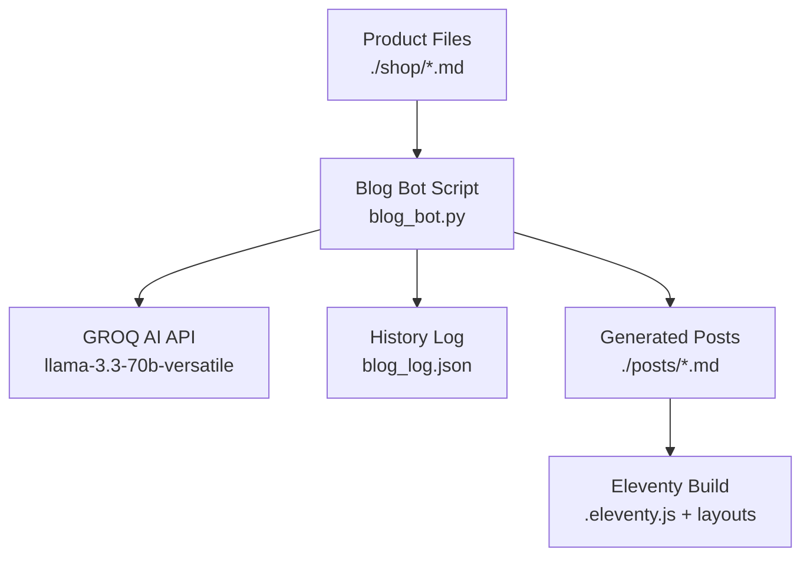
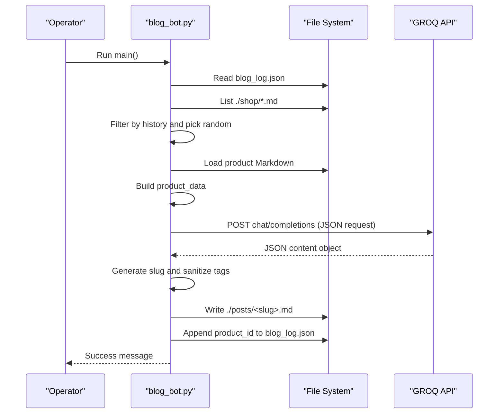
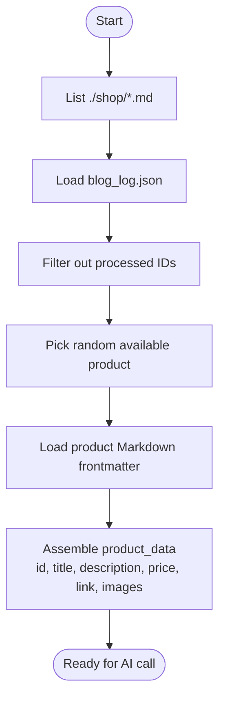
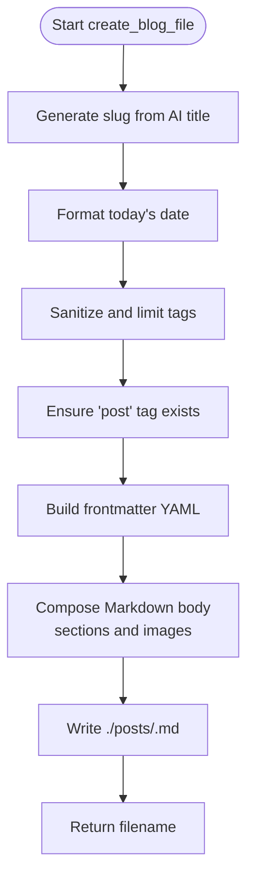
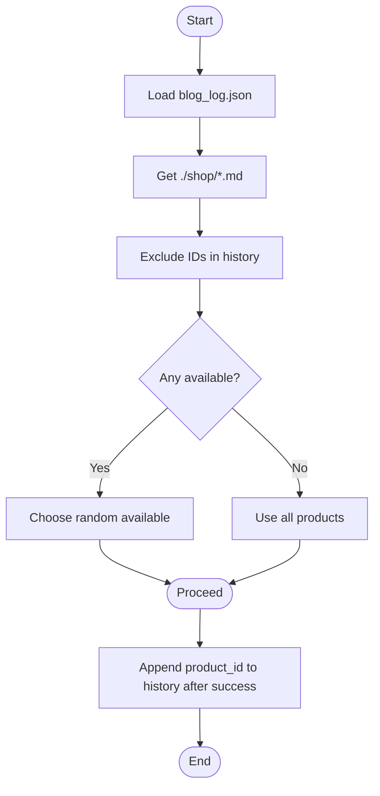
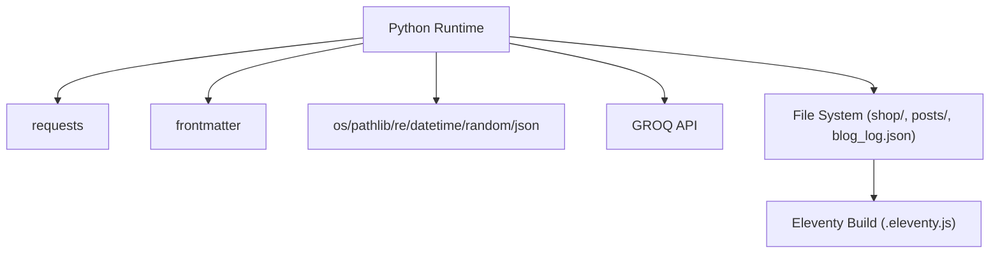

# Blog Generation Bot

<cite>
**Referenced Files in This Document**
- [blog_bot.py](file://blog_bot.py)
- [blog_log.json](file://blog_log.json)
- [shop/B0CLHGCYRN.md](file://shop/B0CLHGCYRN.md)
- [posts/best-gift-ideas-in-uae-2025.md](file://posts/best-gift-ideas-in-uae-2025.md)
- [scripts/test_blog_bot_run.py](file://scripts/test_blog_bot_run.py)
- [SOCIAL_BOT_SETUP.md](file://SOCIAL_BOT_SETUP.md)
- [.eleventy.js](file://.eleventy.js)
</cite>

## Table of Contents
1. [Introduction](#introduction)
2. [Project Structure](#project-structure)
3. [Core Components](#core-components)
4. [Architecture Overview](#architecture-overview)
5. [Detailed Component Analysis](#detailed-component-analysis)
6. [Dependency Analysis](#dependency-analysis)
7. [Performance Considerations](#performance-considerations)
8. [Troubleshooting Guide](#troubleshooting-guide)
9. [Conclusion](#conclusion)
10. [Appendices](#appendices)

## Introduction
This document explains the blog generation bot that automates SEO-optimized blog post creation for Nillian Store, targeting UAE audiences. It covers:
- Product data processing workflow from product Markdown files
- Integration with GROQ AI API using the llama-3.3-70b-versatile model
- Prompt engineering strategies tailored to UAE-focused content
- Markdown file generation with proper frontmatter structure for Eleventy
- History management to prevent duplicate content
- Random product selection logic and slug generation algorithms
- Configuration examples for GROQ_API_KEY
- Troubleshooting guides for API failures and error handling patterns
- Testing framework usage via provided scripts
- Practical examples of generated blog posts and the JSON response format from the AI API

## Project Structure
The bot operates within a static site project built with Eleventy. The key directories and files involved are:
- shop/: Product source files (Markdown with frontmatter)
- posts/: Generated blog posts (Markdown with frontmatter)
- blog_bot.py: Main automation script
- blog_log.json: Persistent history of processed products
- .eleventy.js: Eleventy configuration including safeSlug filter used by templates
- SOCIAL_BOT_SETUP.md: Setup guide for secrets including GROQ_API_KEY



**Diagram sources**
- [blog_bot.py:1-253](file://blog_bot.py#L1-L253)
- [blog_log.json:1-1](file://blog_log.json#L1-L1)
- [.eleventy.js:39-75](file://.eleventy.js#L39-L75)

**Section sources**
- [blog_bot.py:1-253](file://blog_bot.py#L1-L253)
- [blog_log.json:1-1](file://blog_log.json#L1-L1)
- [.eleventy.js:39-75](file://.eleventy.js#L39-L75)

## Core Components
- Product Data Loader: Reads a product Markdown file and extracts title, description, price, images, and Amazon link.
- History Manager: Tracks previously processed product IDs to avoid duplicates.
- Random Selector: Chooses an unprocessed product at random; falls back to all products if none remain.
- Slug Generator: Normalizes titles into URL-safe slugs.
- AI Content Generator: Sends a structured prompt to GROQ AI and parses JSON output.
- File Writer: Creates a new Markdown post with frontmatter and body content.

Key responsibilities and interactions are implemented in the main script.

**Section sources**
- [blog_bot.py:18-46](file://blog_bot.py#L18-L46)
- [blog_bot.py:48-97](file://blog_bot.py#L48-L97)
- [blog_bot.py:99-208](file://blog_bot.py#L99-L208)
- [blog_bot.py:210-253](file://blog_bot.py#L210-L253)

## Architecture Overview
The end-to-end flow:
1. Load environment variables (e.g., GROQ_API_KEY).
2. Select a random product not yet processed.
3. Parse product frontmatter and assemble product_data.
4. Call GROQ AI API with a UAE-focused prompt to generate structured JSON content.
5. Create a new Markdown post with frontmatter and body.
6. Append the product ID to the history log.



**Diagram sources**
- [blog_bot.py:210-253](file://blog_bot.py#L210-L253)
- [blog_bot.py:18-46](file://blog_bot.py#L18-L46)
- [blog_bot.py:48-97](file://blog_bot.py#L48-L97)
- [blog_bot.py:99-208](file://blog_bot.py#L99-L208)

## Detailed Component Analysis

### Product Data Processing Workflow
- Input: Product Markdown files under ./shop/ with frontmatter fields such as title, description, price, cover, images, amazonLink/link.
- Extraction: The script loads the selected product file, aggregates images from cover and images list, and resolves the Amazon link from either link or amazonLink.
- Output: A structured product_data dictionary passed to the AI generator and file writer.



**Diagram sources**
- [blog_bot.py:33-46](file://blog_bot.py#L33-L46)
- [blog_bot.py:210-253](file://blog_bot.py#L210-L253)

**Section sources**
- [blog_bot.py:33-46](file://blog_bot.py#L33-L46)
- [blog_bot.py:210-253](file://blog_bot.py#L210-L253)
- [shop/B0CLHGCYRN.md:1-55](file://shop/B0CLHGCYRN.md#L1-L55)

### GROQ AI API Integration (llama-3.3-70b-versatile)
- Authentication: Uses Bearer token from GROQ_API_KEY environment variable.
- Endpoint: https://api.groq.com/openai/v1/chat/completions
- Model: llama-3.3-70b-versatile
- Request: JSON payload with messages array and response_format set to json_object.
- Response: JSON string containing structured content fields.

```mermaid
classDiagram
class BlogBot {
+generate_blog_content(product_data) dict
-headers dict
-data dict
}
class GROQAPI {
+POST /openai/v1/chat/completions
+Authorization : Bearer {GROQ_API_KEY}
+model : "llama-3.3-70b-versatile"
+response_format : {"type" : "json_object"}
}
BlogBot --> GROQAPI : "HTTP POST"
```

**Diagram sources**
- [blog_bot.py:84-97](file://blog_bot.py#L84-L97)

**Section sources**
- [blog_bot.py:84-97](file://blog_bot.py#L84-L97)
- [SOCIAL_BOT_SETUP.md:1-106](file://SOCIAL_BOT_SETUP.md#L1-L106)

### Prompt Engineering Strategies for UAE-Focused Content
- Role and context: Expert SEO copywriter for Nillian Store in the UAE.
- Required sections: Catchy title with emojis and UAE context, meta description, tags (10–15), intro, product section, why it works bullets, perfect for, conclusion.
- Output format: Strict JSON object with specific keys for title, description, tags, intro, product_section, why_it_works, perfect_for, conclusion.

Implementation details are embedded in the prompt construction function.

**Section sources**
- [blog_bot.py:48-82](file://blog_bot.py#L48-L82)

### Markdown File Generation with Frontmatter
- Slug generation: Lowercase, remove non-word characters except hyphens, collapse whitespace/hyphens, trim leading/trailing hyphens.
- Frontmatter fields: title, description, cover, date, tags (sanitized and limited), layout, permalink.
- Body content: Title heading, intro, product section, why it works blockquote, perfect for line, up to three product images, buy button, final thought.
- Tag sanitization: HTML entity decoding, apostrophe normalization, removal of problematic characters, trimming, limit to 15 tags, ensure 'post' tag is present.



**Diagram sources**
- [blog_bot.py:99-208](file://blog_bot.py#L99-L208)

**Section sources**
- [blog_bot.py:41-46](file://blog_bot.py#L41-L46)
- [blog_bot.py:99-208](file://blog_bot.py#L99-L208)

### History Management System to Prevent Duplicate Content
- Storage: blog_log.json contains an array of product IDs already processed.
- Logic: Before selecting a product, exclude any IDs found in the history. If no available products remain, fall back to all products.
- Update: After successful generation, append the current product ID to the history.



**Diagram sources**
- [blog_bot.py:18-39](file://blog_bot.py#L18-L39)
- [blog_log.json:1-1](file://blog_log.json#L1-L1)

**Section sources**
- [blog_bot.py:18-39](file://blog_bot.py#L18-L39)
- [blog_log.json:1-1](file://blog_log.json#L1-L1)

### Random Product Selection Logic
- Scans all Markdown files in ./shop/.
- Filters out those whose stems (product IDs) appear in the history.
- If none remain, uses the full list.
- Picks one randomly.

**Section sources**
- [blog_bot.py:33-39](file://blog_bot.py#L33-L39)

### Slug Generation Algorithms
- Converts text to lowercase.
- Removes non-word characters except spaces and hyphens.
- Collapses sequences of spaces, underscores, and hyphens into single hyphens.
- Trims leading/trailing hyphens.

Note: Eleventy also provides a safeSlug filter used elsewhere in templates; this bot’s slugify is independent and used for filenames.

**Section sources**
- [blog_bot.py:41-46](file://blog_bot.py#L41-L46)
- [.eleventy.js:48-62](file://.eleventy.js#L48-L62)

### JSON Response Format from AI API
Expected keys in the JSON object returned by the model:
- title: string
- description: string
- tags: array of strings
- intro: string
- product_section: string
- why_it_works: array of strings
- perfect_for: string
- conclusion: string

The script expects these keys when constructing the Markdown post.

**Section sources**
- [blog_bot.py:48-82](file://blog_bot.py#L48-L82)
- [blog_bot.py:99-208](file://blog_bot.py#L99-L208)

### Practical Examples of Generated Blog Posts
Example output demonstrates the expected structure and styling:
- Frontmatter includes title, description, cover image, date, tags, layout, and permalink.
- Body includes headings, sections, bullet points, blockquotes, images, and a call-to-action button.

Reference example file path:
- [posts/best-gift-ideas-in-uae-2025.md](file://posts/best-gift-ideas-in-uae-2025.md)

**Section sources**
- [posts/best-gift-ideas-in-uae-2025.md:1-259](file://posts/best-gift-ideas-in-uae-2025.md#L1-L259)

### Testing Framework Usage
A simple test script validates the file creation process:
- Imports create_blog_file from the bot.
- Provides sample product_data and ai_content.
- Writes a post and prints the first lines to verify frontmatter and structure.

Run the test script to confirm behavior without invoking the AI API.

**Section sources**
- [scripts/test_blog_bot_run.py:1-10](file://scripts/test_blog_bot_run.py#L1-L10)

## Dependency Analysis
External dependencies and integrations:
- Python libraries: os, json, random, requests, frontmatter, datetime, pathlib, re.
- External service: GROQ AI API (OpenAI-compatible endpoint).
- Site builder: Eleventy (uses layouts and collections; safeSlug filter defined in config).



**Diagram sources**
- [blog_bot.py:1-9](file://blog_bot.py#L1-L9)
- [.eleventy.js:39-75](file://.eleventy.js#L39-L75)

**Section sources**
- [blog_bot.py:1-9](file://blog_bot.py#L1-L9)
- [.eleventy.js:39-75](file://.eleventy.js#L39-L75)

## Performance Considerations
- Network latency: Each AI call incurs HTTP round-trip time; consider batching or caching results if generating multiple posts.
- I/O operations: Reading/writing small JSON and Markdown files is lightweight; ensure filesystem permissions are correct.
- Tag sanitization overhead: Minimal; regex operations on short strings.
- Random selection: O(n) scan over product files; acceptable for typical catalog sizes.

[No sources needed since this section provides general guidance]

## Troubleshooting Guide
Common issues and resolutions:
- Missing GROQ_API_KEY: The script checks for the environment variable and exits early if absent. Set it before running.
- API failures: The script raises HTTP errors; inspect logs for status codes and response bodies. For social bot integration, detailed error parsing is included.
- Invalid JSON response: Ensure the model returns the expected JSON structure; adjust prompts if necessary.
- Filename conflicts: Slugs are sanitized; if collisions occur, consider adding timestamps or unique suffixes.
- No images: Some products may lack images; handle gracefully in content generation.

Configuration reference:
- GROQ_API_KEY setup instructions and troubleshooting steps are documented in the setup guide.

**Section sources**
- [blog_bot.py:210-213](file://blog_bot.py#L210-L213)
- [blog_bot.py:95-97](file://blog_bot.py#L95-L97)
- [SOCIAL_BOT_SETUP.md:1-106](file://SOCIAL_BOT_SETUP.md#L1-L106)

## Conclusion
The blog generation bot streamlines content production by combining product data, robust prompt engineering, and automated Markdown generation. With history tracking and slug normalization, it ensures unique, SEO-friendly posts tailored for UAE audiences. Proper configuration of GROQ_API_KEY and adherence to the expected JSON response format are critical for reliable operation.

[No sources needed since this section summarizes without analyzing specific files]

## Appendices

### Configuration Examples
- Environment variable:
  - GROQ_API_KEY=<your_groq_api_key>
- Running locally:
  - Ensure Python dependencies (requests, frontmatter) are installed.
  - Export GROQ_API_KEY and run the main script.

**Section sources**
- [blog_bot.py:15-16](file://blog_bot.py#L15-L16)
- [SOCIAL_BOT_SETUP.md:1-106](file://SOCIAL_BOT_SETUP.md#L1-L106)