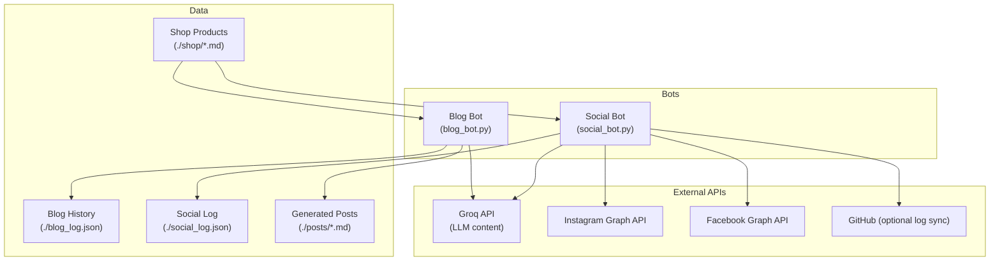
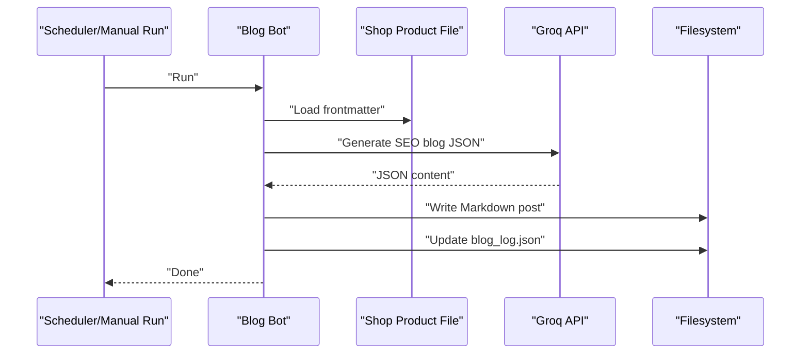
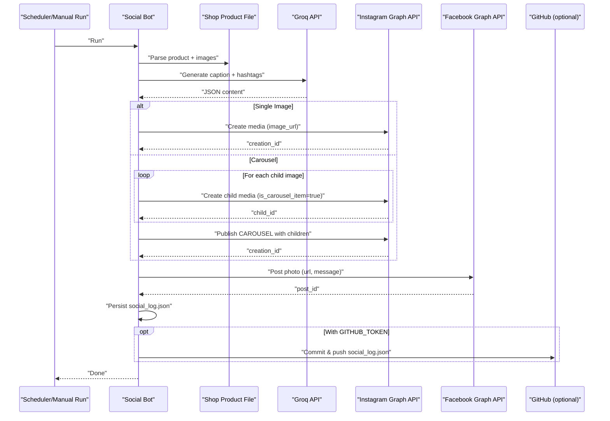
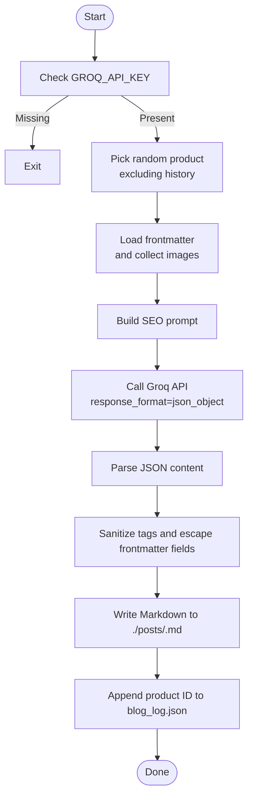
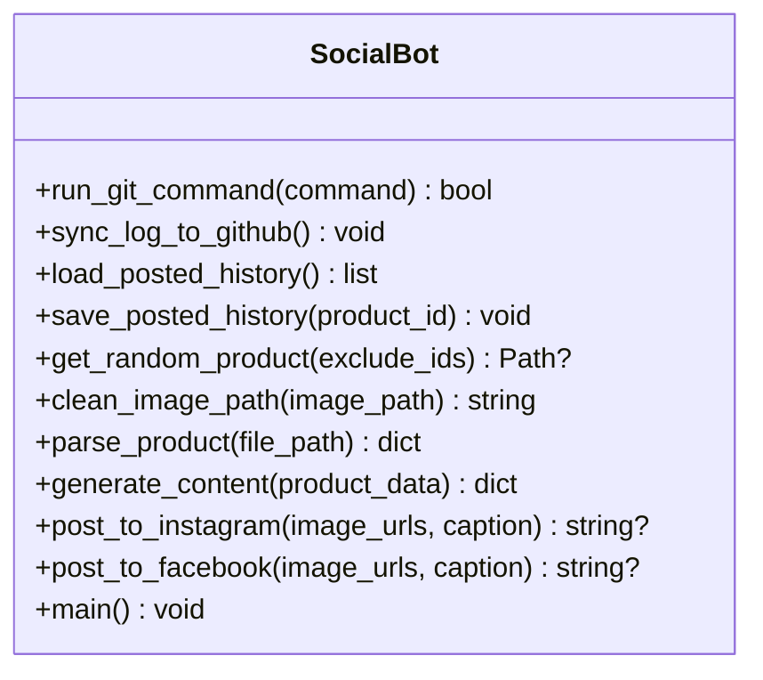
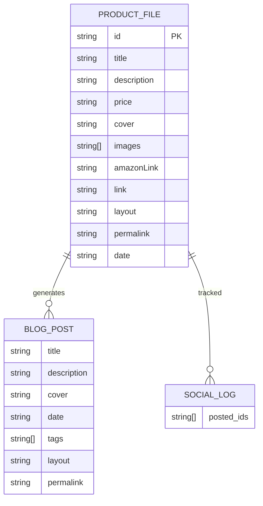
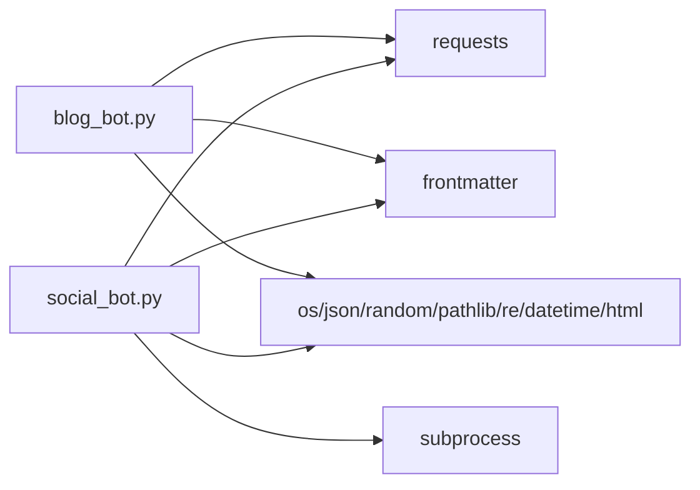

# Python Automation Bots

<cite>
**Referenced Files in This Document**
- [blog_bot.py](file://blog_bot.py)
- [social_bot.py](file://social_bot.py)
- [SOCIAL_BOT_SETUP.md](file://SOCIAL_BOT_SETUP.md)
- [test_blog_bot_run.py](file://scripts/test_blog_bot_run.py)
- [shop/B0CLHGCYRN.md](file://shop/B0CLHGCYRN.md)
- [posts/posts.json](file://posts/posts.json)
- [blog_log.json](file://blog_log.json)
- [social_log.json](file://social_log.json)
</cite>

## Table of Contents
1. [Introduction](#introduction)
2. [Project Structure](#project-structure)
3. [Core Components](#core-components)
4. [Architecture Overview](#architecture-overview)
5. [Detailed Component Analysis](#detailed-component-analysis)
6. [Dependency Analysis](#dependency-analysis)
7. [Performance Considerations](#performance-considerations)
8. [Troubleshooting Guide](#troubleshooting-guide)
9. [Conclusion](#conclusion)
10. [Appendices](#appendices)

## Introduction
This document explains the Python automation bots that power AI-generated blog posts and social media publishing for Nillian Store. It covers:
- Blog bot architecture: product data processing, GROQ AI API integration, prompt engineering, and Markdown file generation.
- Social media bot functionality: Instagram and Facebook posting, carousel creation, token management, retry logic, logging, and optional Git sync.
- Error handling, logging mechanisms, testing utilities, configuration examples, troubleshooting guides for API failures, and performance optimization tips.

## Project Structure
The repository includes two primary automation scripts and supporting artifacts:
- Blog bot script generates SEO-optimized blog posts from product files using Groq AI and writes Markdown to the posts directory.
- Social media bot script selects a product, generates captions via Groq AI, and publishes to Instagram and Facebook via Meta Graph API. It maintains a posted history and can sync logs to GitHub.

**Diagram sources**
- [blog_bot.py:1-253](file://blog_bot.py#L1-L253)
- [social_bot.py:1-315](file://social_bot.py#L1-L315)

**Section sources**
- [blog_bot.py:1-253](file://blog_bot.py#L1-L253)
- [social_bot.py:1-315](file://social_bot.py#L1-L315)
- [posts/posts.json:1-6](file://posts/posts.json#L1-L6)

## Core Components
- Blog Bot
  - Loads product frontmatter from shop files, constructs an AI prompt, calls Groq LLM, and writes a structured Markdown post with frontmatter and images.
  - Tracks previously generated products to avoid duplicates.
- Social Media Bot
  - Selects a random product not recently posted, generates caption and hashtags via Groq, posts single image or carousel to Instagram, posts first image to Facebook, persists history, and optionally syncs logs to GitHub.

Key responsibilities and interactions are detailed in the next sections.

**Section sources**
- [blog_bot.py:18-208](file://blog_bot.py#L18-L208)
- [social_bot.py:79-246](file://social_bot.py#L79-L246)

## Architecture Overview
End-to-end flows for both bots:

**Diagram sources**
- [blog_bot.py:48-208](file://blog_bot.py#L48-L208)
- [blog_log.json:1-1](file://blog_log.json#L1-L1)

**Diagram sources**
- [social_bot.py:120-246](file://social_bot.py#L120-L246)
- [social_log.json:1-52](file://social_log.json#L1-L52)

## Detailed Component Analysis

### Blog Bot
Responsibilities:
- Product selection and deduplication based on blog_log.json.
- Prompt construction tailored for SEO copywriting with UAE context.
- JSON response parsing and Markdown assembly with frontmatter, tags, images, and call-to-action button.
- Safe tag sanitization and title/description escaping for frontmatter.

Key functions and behaviors:
- load_blog_history/save_blog_history: Manage previously generated product IDs.
- get_random_product: Choose a product excluding those already processed.
- generate_blog_content: Build prompt and call Groq chat completions with JSON response format.
- create_blog_file: Generate slug, sanitize tags, assemble Markdown including cover image, up to three additional images, and Amazon buy button.
- main: Orchestrate flow, handle missing environment variables, and print status.

**Diagram sources**
- [blog_bot.py:18-208](file://blog_bot.py#L18-L208)

Error handling and robustness:
- Missing API key exits early.
- File I/O wrapped with try/except when loading history.
- Tag sanitization removes problematic characters and escapes quotes for frontmatter safety.

Testing support:
- A small test script demonstrates creating a blog file from sample inputs and printing the resulting frontmatter lines.

**Section sources**
- [blog_bot.py:18-208](file://blog_bot.py#L18-L208)
- [blog_bot.py:210-253](file://blog_bot.py#L210-L253)
- [scripts/test_blog_bot_run.py:1-10](file://scripts/test_blog_bot_run.py#L1-L10)
- [blog_log.json:1-1](file://blog_log.json#L1-L1)

### Social Media Bot
Responsibilities:
- Validate required secrets and exit if missing.
- Select a random product not recently posted; parse product frontmatter and normalize image URLs.
- Generate caption and hashtags via Groq.
- Post to Instagram (single image or carousel), then to Facebook.
- Persist posted product IDs to social_log.json and optionally sync to GitHub.

Key functions and behaviors:
- run_git_command/sync_log_to_github: Execute git commands and push updates when GITHUB_TOKEN is present.
- load_posted_history/save_posted_history: Maintain recent posting history with size cap.
- get_random_product: Exclude previously posted and failed IDs.
- clean_image_path/parse_product: Normalize relative paths to absolute URLs and extract product metadata.
- generate_content: Construct prompt and call Groq API with JSON response format.
- post_to_instagram: Create media items, build carousel if multiple images, publish, and detect expired tokens.
- post_to_facebook: Upload first image with caption.
- main: Retry loop up to 3 attempts, aggregate failures, and exit with error code on total failure.

**Diagram sources**
- [social_bot.py:23-246](file://social_bot.py#L23-L246)

Error handling and resilience:
- Validates required secrets at startup.
- Catches request exceptions and prints detailed API responses.
- Detects token expiration (error code 190) and provides actionable guidance.
- Retries up to 3 times with different products, skipping those without images.

Logging and persistence:
- Writes social_log.json with recent IDs capped at 50 entries.
- Optional GitHub sync commits and pushes updated log.

**Section sources**
- [social_bot.py:23-246](file://social_bot.py#L23-L246)
- [social_log.json:1-52](file://social_log.json#L1-L52)

### Data Models and Inputs
- Shop product frontmatter example fields used by bots:
  - title, description, price, cover, images[], amazonLink/link, layout, permalink, date.
- Generated blog post frontmatter fields:
  - title, description, cover, date, tags[], layout, permalink.
- Social log:
  - Array of product IDs representing recently posted items.

**Diagram sources**
- [shop/B0CLHGCYRN.md:1-55](file://shop/B0CLHGCYRN.md#L1-L55)
- [blog_bot.py:162-203](file://blog_bot.py#L162-L203)
- [social_log.json:1-52](file://social_log.json#L1-L52)

**Section sources**
- [shop/B0CLHGCYRN.md:1-55](file://shop/B0CLHGCYRN.md#L1-L55)
- [blog_bot.py:162-203](file://blog_bot.py#L162-L203)
- [social_log.json:1-52](file://social_log.json#L1-L52)

## Dependency Analysis
- External dependencies:
  - requests: HTTP calls to Groq and Meta Graph APIs.
  - frontmatter: Parsing product frontmatter.
  - subprocess: Git operations for log sync.
  - os/json/random/pathlib/re/datetime/html: Standard library utilities.
- Internal dependencies:
  - Blog bot depends on shop markdown files and writes to posts directory and blog_log.json.
  - Social bot depends on shop markdown files, writes to social_log.json, and optionally interacts with GitHub.

**Diagram sources**
- [blog_bot.py:1-9](file://blog_bot.py#L1-L9)
- [social_bot.py:1-10](file://social_bot.py#L1-L10)

**Section sources**
- [blog_bot.py:1-9](file://blog_bot.py#L1-L9)
- [social_bot.py:1-10](file://social_bot.py#L1-L10)

## Performance Considerations
- Reduce network calls:
  - Cache product listings locally if the shop directory is large; current approach scans *.md files per run.
- Limit image uploads:
  - Instagram carousel supports up to 10 children; the bot caps at 10 and uses only the first three images for blog posts.
- Avoid repeated work:
  - Both bots maintain history files to prevent reprocessing or reposting the same product.
- Efficient retries:
  - Social bot retries up to 3 times with different products, skipping those without images.
- Logging overhead:
  - Keep social_log.json size bounded (capped at 50 entries).

[No sources needed since this section provides general guidance]

## Troubleshooting Guide
Common issues and resolutions:
- Missing required secrets:
  - The social bot validates GROQ_API_KEY, META_ACCESS_TOKEN, FB_PAGE_ID, IG_USER_ID and exits with instructions if any are missing.
- Token expiration (Meta):
  - If API returns error code 190, the bot detects it and instructs how to obtain a new long-lived token and update secrets.
- No images found:
  - Products without images are skipped; ensure product frontmatter includes cover or images[].
- Groq API errors:
  - Request exceptions are caught and printed with response details; verify model name and API key validity.
- Git sync failures:
  - Without GITHUB_TOKEN, log syncing is skipped; otherwise, check permissions and remote URL configuration.

Configuration references:
- Required secrets and setup steps are documented in the setup guide.

**Section sources**
- [social_bot.py:248-267](file://social_bot.py#L248-L267)
- [social_bot.py:186-206](file://social_bot.py#L186-L206)
- [social_bot.py:226-246](file://social_bot.py#L226-L246)
- [SOCIAL_BOT_SETUP.md:1-106](file://SOCIAL_BOT_SETUP.md#L1-L106)

## Conclusion
The automation suite combines product data processing, AI-driven content generation, and multi-platform publishing with robust error handling and logging. The blog bot produces SEO-focused Markdown posts, while the social bot automates Instagram and Facebook publishing with retry logic and optional Git synchronization. Proper configuration of secrets and adherence to best practices ensures reliable operation.

[No sources needed since this section summarizes without analyzing specific files]

## Appendices

### Configuration Examples
- Environment variables:
  - GROQ_API_KEY: Used by both bots for LLM content generation.
  - META_ACCESS_TOKEN: Used by social bot for Instagram/Facebook publishing.
  - FB_PAGE_ID: Facebook Page ID for posting.
  - IG_USER_ID: Instagram Business Account ID for posting.
  - GITHUB_TOKEN: Optional token for syncing social_log.json to GitHub.

Setup reference:
- See the setup guide for obtaining and configuring these secrets.

**Section sources**
- [SOCIAL_BOT_SETUP.md:10-48](file://SOCIAL_BOT_SETUP.md#L10-L48)
- [social_bot.py:16-21](file://social_bot.py#L16-L21)

### Testing Utilities
- Local test for blog file generation:
  - The test script imports create_blog_file and writes a sample post to verify frontmatter and structure.

Usage:
- Run the test script to validate Markdown generation against sample inputs.

**Section sources**
- [scripts/test_blog_bot_run.py:1-10](file://scripts/test_blog_bot_run.py#L1-L10)