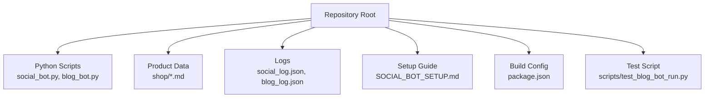
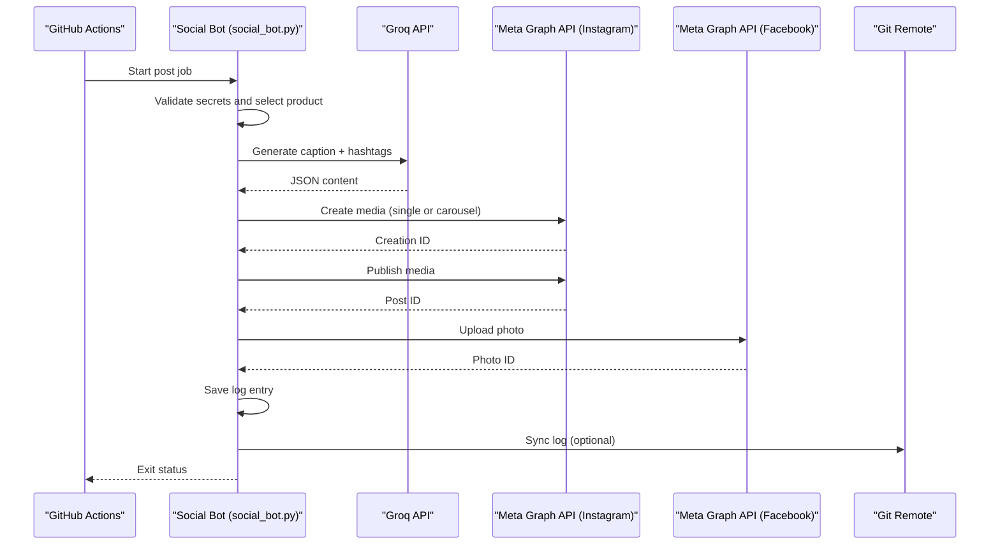
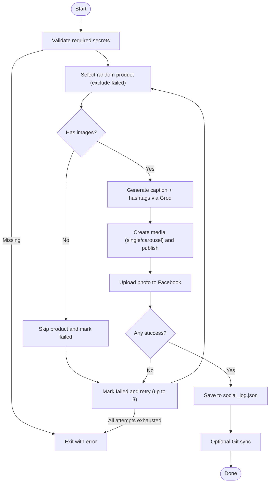
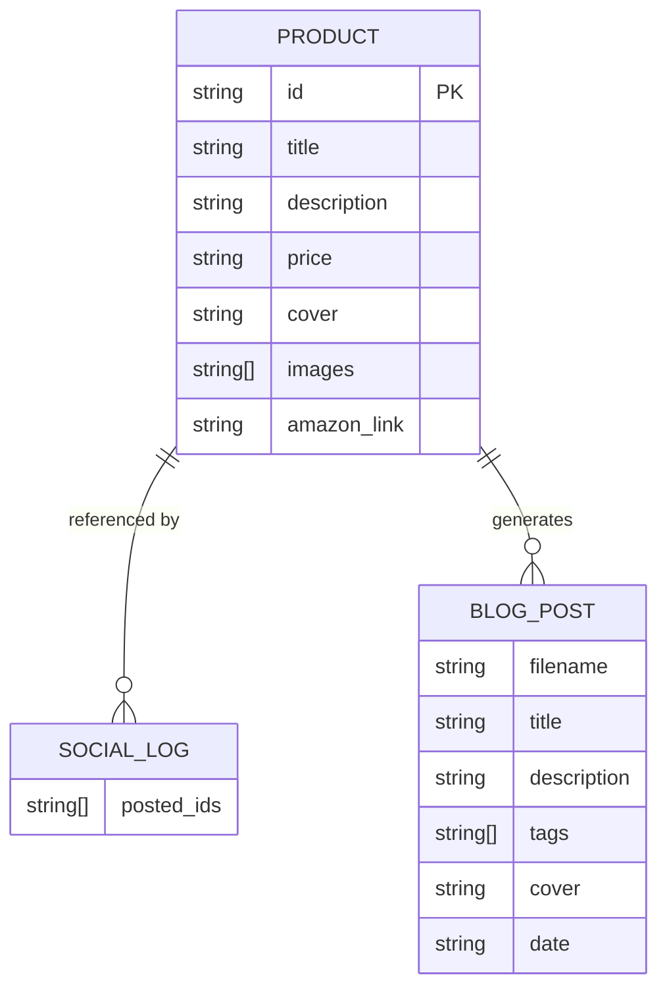
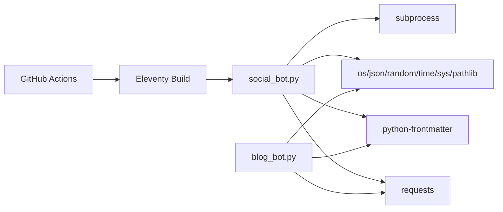

# Social Media Automation Bot

<cite>
**Referenced Files in This Document**
- [social_bot.py](file://social_bot.py)
- [blog_bot.py](file://blog_bot.py)
- [SOCIAL_BOT_SETUP.md](file://SOCIAL_BOT_SETUP.md)
- [package.json](file://package.json)
- [social_log.json](file://social_log.json)
- [blog_log.json](file://blog_log.json)
- [B0CLHGCYRN.md](file://shop/B0CLHGCYRN.md)
- [B0F3KHSF4V.md](file://shop/B0F3KHSF4V.md)
- [test_blog_bot_run.py](file://scripts/test_blog_bot_run.py)
</cite>

## Table of Contents
1. Introduction
2. Project Structure
3. Core Components
4. Architecture Overview
5. Detailed Component Analysis
6. Dependency Analysis
7. Performance Considerations
8. Troubleshooting Guide
9. Conclusion
10. Appendices

## Introduction
This document explains the social media automation bot that posts to Instagram and Facebook using Meta Graph API, generates content with Groq AI, manages tokens and authentication, handles errors and retries, logs activity, and synchronizes logs via Git. It also covers setup instructions for Meta API credentials, troubleshooting authentication issues, performance considerations for posting, and monitoring approaches for successful deployments.

## Project Structure
The repository includes:
- Python automation scripts for social posting and blog generation
- Product data as Markdown files with frontmatter
- Logs tracking posted products
- Setup guide for GitHub secrets and workflow behavior
- Build configuration for the Eleventy site used by the deployment pipeline

**Section sources**
- [social_bot.py:1-22](file://social_bot.py#L1-L22)
- [blog_bot.py:1-17](file://blog_bot.py#L1-L17)
- [SOCIAL_BOT_SETUP.md:1-21](file://SOCIAL_BOT_SETUP.md#L1-L21)
- [package.json:1-12](file://package.json#L1-L12)

## Core Components
- Social Posting Bot (Instagram + Facebook): Orchestrates product selection, content generation, carousel creation, publishing, logging, retry logic, and Git sync.
- Blog Generation Bot: Generates SEO-optimized blog posts from product data using Groq AI and writes Markdown files.
- Configuration and Secrets: Loads environment variables for API keys and IDs; validates required secrets at runtime.
- Logging and History: Tracks recently posted/generated items to avoid repetition and supports syncing to Git.
- Deployment Integration: Works alongside a build step and waits for site deployment before posting.

Key responsibilities:
- Content generation via Groq API with UAE-focused prompts and hashtags.
- Meta Graph API calls for Instagram media creation (single or carousel), publishing, and Facebook photo posting.
- Error handling with token expiration detection and detailed diagnostics.
- Retry loop across multiple attempts with different products.
- Optional Git synchronization of logs using a token.

**Section sources**
- [social_bot.py:120-136](file://social_bot.py#L120-L136)
- [social_bot.py:138-206](file://social_bot.py#L138-L206)
- [social_bot.py:208-246](file://social_bot.py#L208-L246)
- [social_bot.py:248-314](file://social_bot.py#L248-L314)
- [blog_bot.py:48-97](file://blog_bot.py#L48-L97)
- [blog_bot.py:99-208](file://blog_bot.py#L99-L208)
- [SOCIAL_BOT_SETUP.md:22-48](file://SOCIAL_BOT_SETUP.md#L22-L48)

## Architecture Overview
High-level flow:
- The workflow triggers on schedule or manually.
- It builds the site and waits for deployment.
- The Python script selects a product, generates content, posts to Instagram and Facebook, logs success, and optionally syncs logs to Git.

**Diagram sources**
- [social_bot.py:120-136](file://social_bot.py#L120-L136)
- [social_bot.py:138-206](file://social_bot.py#L138-L206)
- [social_bot.py:208-246](file://social_bot.py#L208-L246)
- [social_bot.py:248-314](file://social_bot.py#L248-L314)

## Detailed Component Analysis

### Social Posting Bot (Instagram + Facebook)
Responsibilities:
- Load secrets and validate presence.
- Select a random product excluding previously posted IDs.
- Parse product frontmatter and extract image URLs.
- Generate engaging captions and hashtags via Groq AI.
- Post to Instagram (single image or carousel up to 10 items).
- Post to Facebook (single image).
- Persist history and optionally sync to Git.
- Retry up to three times with different products on failure.

**Diagram sources**
- [social_bot.py:248-314](file://social_bot.py#L248-L314)
- [social_bot.py:79-94](file://social_bot.py#L79-L94)
- [social_bot.py:101-118](file://social_bot.py#L101-L118)
- [social_bot.py:120-136](file://social_bot.py#L120-L136)
- [social_bot.py:138-206](file://social_bot.py#L138-L206)
- [social_bot.py:208-246](file://social_bot.py#L208-L246)

Key implementation details:
- Instagram single vs. carousel:
  - Single image: create media with image_url and caption, then publish.
  - Carousel: create child media items with is_carousel_item=true, then create CAROUSEL parent with children list and caption, then publish.
- Token expiration detection:
  - Parses API error responses and detects specific error codes indicating expired tokens, providing actionable guidance.
- Retry logic:
  - Main loop runs up to three attempts, skipping previously failed product IDs.

**Section sources**
- [social_bot.py:138-206](file://social_bot.py#L138-L206)
- [social_bot.py:208-246](file://social_bot.py#L208-L246)
- [social_bot.py:248-314](file://social_bot.py#L248-L314)

### Meta Graph API Integration
- Instagram endpoints:
  - Create media: POST /v18.0/{IG_USER_ID}/media
  - Publish media: POST /v18.0/{IG_USER_ID}/media_publish
- Facebook endpoint:
  - Upload photo: POST /v18.0/{FB_PAGE_ID}/photos

Parameters:
- access_token: META_ACCESS_TOKEN
- For Instagram single: image_url, caption
- For Instagram carousel: multiple child items with is_carousel_item=true, then parent with media_type=CAROUSEL and children list
- For Facebook: url (image), message (caption)

Error handling:
- Detects HTTP errors and parses response bodies.
- Identifies token expiration by error code and prints remediation steps.

**Section sources**
- [social_bot.py:138-206](file://social_bot.py#L138-L206)
- [social_bot.py:208-246](file://social_bot.py#L208-L246)

### Carousel Creation for Multiple Images
- Supports up to 10 images per carousel.
- Creates each child item individually, collects creation IDs, then creates a CAROUSEL parent referencing all children.
- Adds a short delay before publishing to ensure backend readiness.

**Section sources**
- [social_bot.py:158-185](file://social_bot.py#L158-L185)

### Token Management and Authentication
- Required secrets:
  - GROQ_API_KEY
  - META_ACCESS_TOKEN
  - FB_PAGE_ID
  - IG_USER_ID
  - GITHUB_TOKEN (optional, for log sync)
- Validation:
  - At startup, checks for missing secrets and exits with clear instructions if any are absent.
- Token expiration:
  - On API errors, inspects response for specific error codes and provides explicit guidance to refresh tokens.

**Section sources**
- [social_bot.py:16-21](file://social_bot.py#L16-L21)
- [social_bot.py:248-266](file://social_bot.py#L248-L266)
- [social_bot.py:186-206](file://social_bot.py#L186-L206)
- [social_bot.py:226-246](file://social_bot.py#L226-L246)
- [SOCIAL_BOT_SETUP.md:10-48](file://SOCIAL_BOT_SETUP.md#L10-L48)

### Content Generation Strategies and Hashtag Optimization for UAE Market
- Uses Groq Llama model to generate:
  - Engaging caption tailored to Nillian Store’s UAE audience
  - 10–15 relevant hashtags optimized for local search and trends
- Prompts include product title, description, price, and link to contextualize output.
- Final caption concatenates generated caption, hashtags, and shop link.

**Section sources**
- [social_bot.py:120-136](file://social_bot.py#L120-L136)
- [social_bot.py:284-286](file://social_bot.py#L284-L286)

### Logging Systems and Git Synchronization
- Logging:
  - Maintains social_log.json with recent product IDs to avoid repetition.
  - Caps history length to keep file manageable.
- Git sync:
  - If GITHUB_TOKEN is present, commits and pushes updated social_log.json to the repository.
  - Skips commit if no changes detected.

**Section sources**
- [social_bot.py:32-61](file://social_bot.py#L32-L61)
- [social_bot.py:62-78](file://social_bot.py#L62-L78)
- [social_log.json:1-52](file://social_log.json#L1-L52)

### Blog Generation Bot
- Reads product frontmatter and generates an SEO-optimized blog post using Groq AI.
- Writes Markdown with structured sections, tags, cover image, and Amazon call-to-action button.
- Sanitizes tags and frontmatter fields to ensure safe file names and valid YAML.

**Section sources**
- [blog_bot.py:48-97](file://blog_bot.py#L48-L97)
- [blog_bot.py:99-208](file://blog_bot.py#L99-L208)
- [blog_log.json:1-1](file://blog_log.json#L1-L1)

### Data Models and Input/Output Specifications
- Product input (from shop/*.md frontmatter):
  - Fields: title, description, price, cover, images[], amazonLink/link
- Social post output:
  - Caption string including hashtags and shop link
  - Image URLs normalized to absolute URLs
- Blog output:
  - Markdown file with frontmatter and structured body

**Diagram sources**
- [B0CLHGCYRN.md:1-25](file://shop/B0CLHGCYRN.md#L1-L25)
- [B0F3KHSF4V.md:1-25](file://shop/B0F3KHSF4V.md#L1-L25)
- [social_log.json:1-52](file://social_log.json#L1-L52)

## Dependency Analysis
External dependencies:
- Requests library for HTTP calls to Groq and Meta APIs
- python-frontmatter for parsing product frontmatter
- subprocess for Git operations
- Standard libraries: os, json, random, time, sys, pathlib

Runtime environment:
- Python 3.11 in GitHub Actions
- Node.js 18 and Eleventy build step prior to posting

**Diagram sources**
- [social_bot.py:1-9](file://social_bot.py#L1-L9)
- [blog_bot.py:1-8](file://blog_bot.py#L1-L8)
- [package.json:1-12](file://package.json#L1-L12)

**Section sources**
- [social_bot.py:1-9](file://social_bot.py#L1-L9)
- [blog_bot.py:1-8](file://blog_bot.py#L1-L8)
- [package.json:1-12](file://package.json#L1-L12)

## Performance Considerations
- Rate limiting and delays:
  - Introduces a sleep between creating and publishing Instagram media to accommodate backend processing.
- Carousel limits:
  - Limits carousel items to 10 to stay within platform constraints.
- Retry strategy:
  - Up to three attempts with different products reduces transient failures impact.
- I/O efficiency:
  - Keeps social_log.json capped to recent entries to minimize file size and I/O overhead.
- Network calls:
  - Minimizes redundant requests by reusing parsed product data and avoiding duplicate posts.

[No sources needed since this section provides general guidance]

## Troubleshooting Guide
Common issues and resolutions:
- Missing required secrets:
  - Ensure all four required secrets are set exactly as named.
- Expired or invalid tokens:
  - Look for specific error codes indicating token expiration and follow the provided steps to obtain a new long-lived token.
- No posts happening:
  - Verify cron schedule and manual trigger availability.
  - Confirm product files exist and contain images.
- Failed to post to social media:
  - Inspect workflow logs for detailed API responses and error codes.
- Git sync not occurring:
  - Ensure GITHUB_TOKEN is available; otherwise, log sync is skipped intentionally.

Operational tips:
- Use manual trigger to test end-to-end quickly.
- Review social_log.json to confirm recent postings.
- Validate product frontmatter fields (cover/images) before running.

**Section sources**
- [social_bot.py:248-266](file://social_bot.py#L248-L266)
- [social_bot.py:186-206](file://social_bot.py#L186-L206)
- [social_bot.py:226-246](file://social_bot.py#L226-L246)
- [SOCIAL_BOT_SETUP.md:75-98](file://SOCIAL_BOT_SETUP.md#L75-L98)

## Conclusion
The bot automates multi-platform posting by combining AI-generated content with Meta Graph API integrations, robust error handling, retry logic, and optional Git-based log synchronization. With proper secret configuration and adherence to platform constraints, it delivers reliable, repeatable social media updates aligned with the UAE market.

[No sources needed since this section summarizes without analyzing specific files]

## Appendices

### Setup Instructions for Meta API Credentials
- Obtain and configure:
  - GROQ_API_KEY for content generation
  - META_ACCESS_TOKEN with appropriate permissions
  - FB_PAGE_ID and IG_USER_ID for target accounts
- Add secrets in repository settings under Actions.
- Refer to the setup guide for step-by-step acquisition and permission requirements.

**Section sources**
- [SOCIAL_BOT_SETUP.md:10-48](file://SOCIAL_BOT_SETUP.md#L10-L48)

### Monitoring Approaches for Successful Deployments
- Workflow logs:
  - Inspect Actions run logs for detailed outputs and errors.
- Repository logs:
  - Review social_log.json for recent posted product IDs.
- Manual verification:
  - Trigger workflow manually to validate end-to-end flow.
- Site build dependency:
  - Ensure site build completes successfully before posting.

**Section sources**
- [SOCIAL_BOT_SETUP.md:50-74](file://SOCIAL_BOT_SETUP.md#L50-L74)
- [social_log.json:1-52](file://social_log.json#L1-L52)

### Example Product Frontmatter References
- Sample product files demonstrate expected structure for title, images, price, and links.

**Section sources**
- [B0CLHGCYRN.md:1-25](file://shop/B0CLHGCYRN.md#L1-L25)
- [B0F3KHSF4V.md:1-25](file://shop/B0F3KHSF4V.md#L1-L25)

### Test Utilities
- A small test script demonstrates blog file creation with sanitized tags and frontmatter.

**Section sources**
- [test_blog_bot_run.py:1-10](file://scripts/test_blog_bot_run.py#L1-L10)