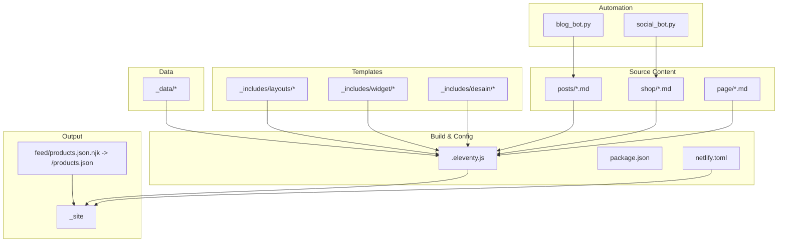
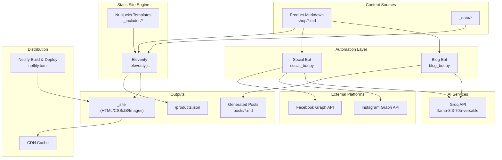
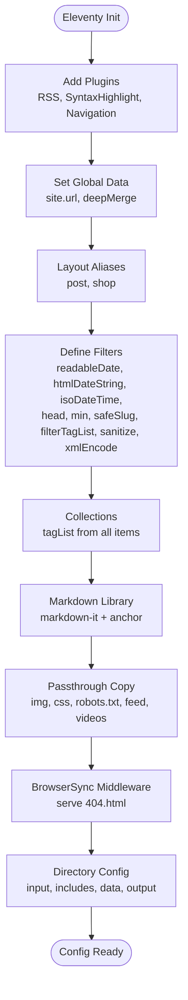
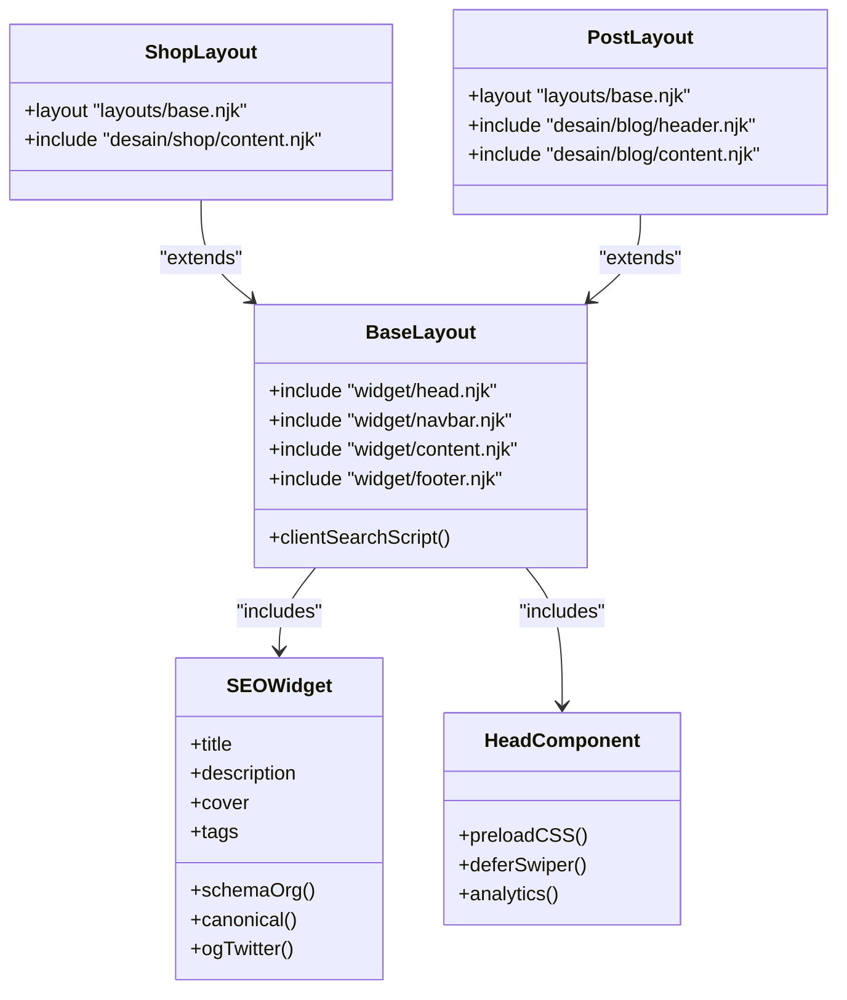
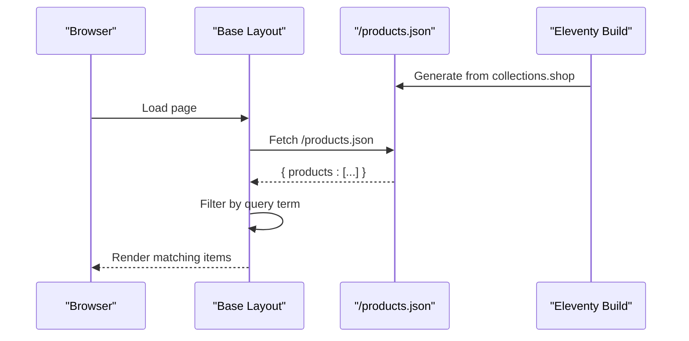
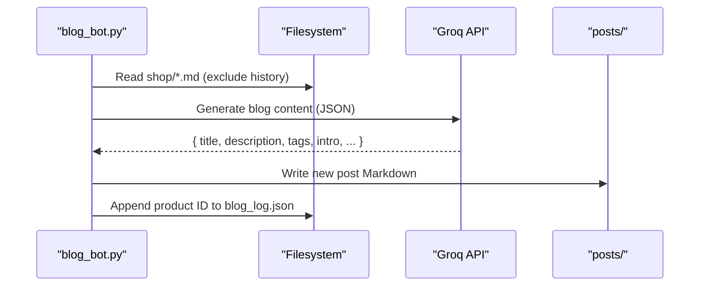
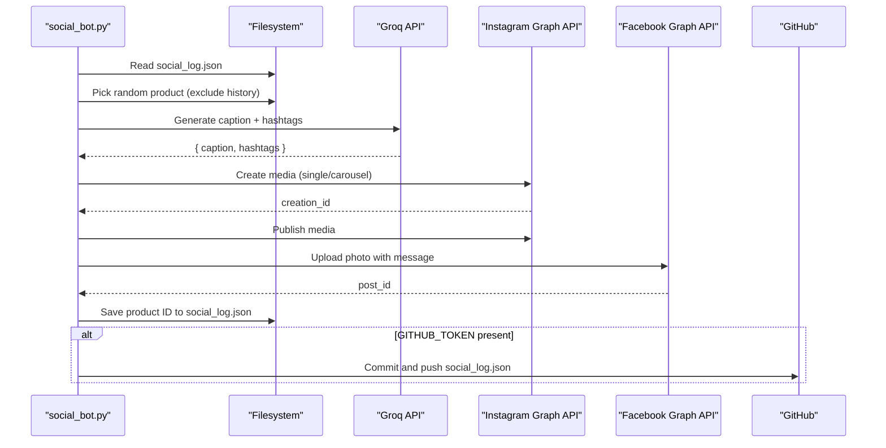
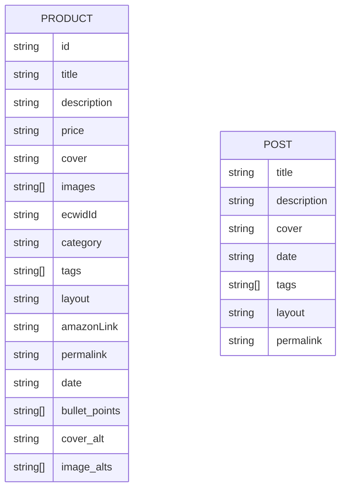
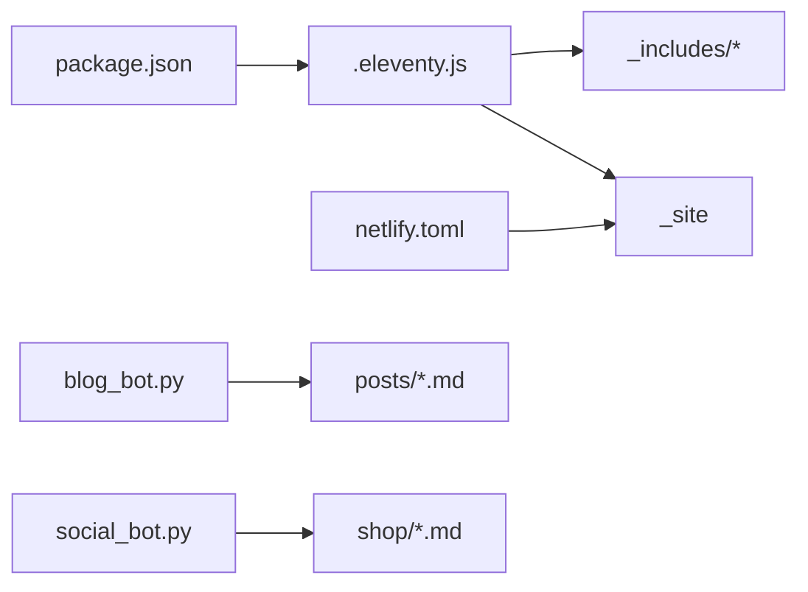

# Core Architecture

<cite>
**Referenced Files in This Document**
- [README.md](file://README.md)
- [.eleventy.js](file://.eleventy.js)
- [package.json](file://package.json)
- [netlify.toml](file://netlify.toml)
- [blog_bot.py](file://blog_bot.py)
- [social_bot.py](file://social_bot.py)
- [_includes/layouts/base.njk](file://_includes/layouts/base.njk)
- [_includes/layouts/shop.njk](file://_includes/layouts/shop.njk)
- [_includes/layouts/post.njk](file://_includes/layouts/post.njk)
- [_includes/widget/seo.njk](file://_includes/widget/seo.njk)
- [_includes/widget/head.njk](file://_includes/widget/head.njk)
- [feed/products.json.njk](file://feed/products.json.njk)
- [scripts/check-filenames.js](file://scripts/check-filenames.js)
- [shop/B0CLHGCYRN.md](file://shop/B0CLHGCYRN.md)
- [posts/best-gift-ideas-in-uae-2025.md](file://posts/best-gift-ideas-in-uae-2025.md)
</cite>

## Table of Contents
1. Introduction
2. Project Structure
3. Core Components
4. Architecture Overview
5. Detailed Component Analysis
6. Dependency Analysis
7. Performance Considerations
8. Troubleshooting Guide
9. Conclusion

## Introduction
This document describes the architecture of Nillianstore2, a static site system built with Eleventy (11ty) and Nunjucks templates, augmented by Python automation scripts for content generation and social media publishing. The system combines:
- Product catalog authored as Markdown files under shop/
- AI-assisted blog post generation from product data
- Automated social media posting to Instagram and Facebook
- A robust template inheritance system using layouts and reusable components
- Static site build and deployment via Netlify

The result is a high-performance, SEO-friendly e-commerce and blog site that scales well for large catalogs through static assets and CDN distribution.

## Project Structure
At a high level:
- Source content: shop/*.md (products), posts/*.md (articles), page/*.md (pages)
- Templates: _includes/layouts/* and _includes/desain/* and _includes/widget/*
- Data: _data/* (site-wide metadata and collections)
- Build configuration: .eleventy.js, package.json, netlify.toml
- Automation: blog_bot.py, social_bot.py
- Generated artifacts: _site (Eleventy output), products.json (client-side search index)

**Diagram sources**
- [.eleventy.js:146-159](file://.eleventy.js#L146-L159)
- [package.json:5-12](file://package.json#L5-L12)
- [netlify.toml:1-3](file://netlify.toml#L1-L3)
- [blog_bot.py:11-13](file://blog_bot.py#L11-L13)
- [social_bot.py:11-14](file://social_bot.py#L11-L14)
- [feed/products.json.njk:1-17](file://feed/products.json.njk#L1-L17)

**Section sources**
- [README.md:1-20](file://README.md#L1-L20)
- [.eleventy.js:146-159](file://.eleventy.js#L146-L159)
- [package.json:5-12](file://package.json#L5-L12)
- [netlify.toml:1-3](file://netlify.toml#L1-L3)

## Core Components
- Eleventy configuration and plugins:
  - Adds RSS, syntax highlighting, navigation
  - Defines global site URL, deep merge behavior, layout aliases, filters, markdown-it setup, passthrough copies, and directory mapping
- Template system:
  - Base layout composes head, navbar, content, footer
  - Shop and Post layouts extend base and include design-specific sections
  - SEO widget injects Open Graph, Twitter, Schema.org, canonical, and robots tags
- Data pipeline:
  - Products collection generated into /products.json for client-side search
  - Tag list collection computed from all items
- Automation:
  - Blog bot reads product Markdown, calls Groq API, writes new blog posts
  - Social bot selects product, generates caption, posts to Instagram/Facebook, logs results, optionally syncs log to GitHub

**Section sources**
- [.eleventy.js:10-116](file://.eleventy.js#L10-L116)
- [.eleventy.js:72-95](file://.eleventy.js#L72-L95)
- [.eleventy.js:146-159](file://.eleventy.js#L146-L159)
- [_includes/layouts/base.njk:1-4](file://_includes/layouts/base.njk#L1-L4)
- [_includes/layouts/shop.njk:1-5](file://_includes/layouts/shop.njk#L1-L5)
- [_includes/layouts/post.njk:1-6](file://_includes/layouts/post.njk#L1-L6)
- [_includes/widget/seo.njk:1-44](file://_includes/widget/seo.njk#L1-L44)
- [feed/products.json.njk:1-17](file://feed/products.json.njk#L1-L17)
- [blog_bot.py:48-97](file://blog_bot.py#L48-L97)
- [social_bot.py:120-136](file://social_bot.py#L120-L136)

## Architecture Overview
The system integrates content authoring, AI-driven content generation, templating, and automated social publishing.

**Diagram sources**
- [blog_bot.py:48-97](file://blog_bot.py#L48-L97)
- [social_bot.py:120-136](file://social_bot.py#L120-L136)
- [social_bot.py:138-206](file://social_bot.py#L138-L206)
- [social_bot.py:208-246](file://social_bot.py#L208-L246)
- [.eleventy.js:146-159](file://.eleventy.js#L146-L159)
- [netlify.toml:1-3](file://netlify.toml#L1-L3)
- [feed/products.json.njk:1-17](file://feed/products.json.njk#L1-L17)

## Detailed Component Analysis

### Eleventy Configuration and Plugins
- Plugins: RSS, syntax highlight, navigation
- Global data: site.url set for absolute URLs
- Deep merge enabled for data precedence
- Layout aliases: post and shop mapped to Nunjucks layouts
- Filters: date formatting, safe slug normalization, tag filtering, sanitization, XML encoding
- Collections: tagList derived from all items; sanitized slugs ensure consistent permalinks
- Markdown library: markdown-it with anchor plugin
- Passthrough copy: img, css, robots.txt, feed, videos
- BrowserSync middleware serves 404.html during local dev
- Directory config: input root, includes, data, output _site

**Diagram sources**
- [.eleventy.js:10-116](file://.eleventy.js#L10-L116)
- [.eleventy.js:146-159](file://.eleventy.js#L146-L159)

**Section sources**
- [.eleventy.js:10-116](file://.eleventy.js#L10-L116)
- [.eleventy.js:146-159](file://.eleventy.js#L146-L159)

### Template Inheritance System
- Base layout composes head, navbar, content, footer and includes client-side search script consuming /products.json
- Shop and Post layouts extend base and include design-specific sections
- SEO widget dynamically sets title, description, Open Graph, Twitter, canonical, robots, and structured data based on tags and page context
- Head component preloads CSS/JS, initializes Swiper asynchronously, and includes analytics

**Diagram sources**
- [_includes/layouts/base.njk:1-4](file://_includes/layouts/base.njk#L1-L4)
- [_includes/layouts/shop.njk:1-5](file://_includes/layouts/shop.njk#L1-L5)
- [_includes/layouts/post.njk:1-6](file://_includes/layouts/post.njk#L1-L6)
- [_includes/widget/seo.njk:1-44](file://_includes/widget/seo.njk#L1-L44)
- [_includes/widget/head.njk:1-42](file://_includes/widget/head.njk#L1-L42)

**Section sources**
- [_includes/layouts/base.njk:1-62](file://_includes/layouts/base.njk#L1-L62)
- [_includes/layouts/shop.njk:1-5](file://_includes/layouts/shop.njk#L1-L5)
- [_includes/layouts/post.njk:1-6](file://_includes/layouts/post.njk#L1-L6)
- [_includes/widget/seo.njk:1-208](file://_includes/widget/seo.njk#L1-L208)
- [_includes/widget/head.njk:1-113](file://_includes/widget/head.njk#L1-113)

### Data Processing Pipeline
- Client-side search index:
  - feed/products.json.njk iterates collections.shop to produce a JSON array of products with title, description, image, price, link
  - base.njk fetches /products.json and implements client-side filtering by title and description
- Tag collection:
  - .eleventy.js computes tagList across all items, normalizes tags with safeSlug, and excludes internal tags

**Diagram sources**
- [feed/products.json.njk:1-17](file://feed/products.json.njk#L1-L17)
- [_includes/layouts/base.njk:14-52](file://_includes/layouts/base.njk#L14-L52)

**Section sources**
- [feed/products.json.njk:1-17](file://feed/products.json.njk#L1-L17)
- [_includes/layouts/base.njk:14-52](file://_includes/layouts/base.njk#L14-L52)
- [.eleventy.js:72-95](file://.eleventy.js#L72-L95)

### Blog Bot (AI-Assisted Content Generation)
- Reads a random product Markdown file from shop/, excluding previously used IDs tracked in blog_log.json
- Calls Groq API with a prompt to generate SEO-optimized blog content in JSON format
- Writes a new Markdown post under posts/ with frontmatter including title, description, cover, date, tags, layout, permalink
- Appends product ID to history to avoid repetition

**Diagram sources**
- [blog_bot.py:33-46](file://blog_bot.py#L33-L46)
- [blog_bot.py:48-97](file://blog_bot.py#L48-L97)
- [blog_bot.py:99-208](file://blog_bot.py#L99-L208)
- [blog_bot.py:210-253](file://blog_bot.py#L210-L253)

**Section sources**
- [blog_bot.py:11-13](file://blog_bot.py#L11-L13)
- [blog_bot.py:33-46](file://blog_bot.py#L33-L46)
- [blog_bot.py:48-97](file://blog_bot.py#L48-L97)
- [blog_bot.py:99-208](file://blog_bot.py#L99-L208)
- [blog_bot.py:210-253](file://blog_bot.py#L210-L253)

### Social Media Bot (Instagram and Facebook Publishing)
- Loads required secrets (GROQ_API_KEY, META_ACCESS_TOKEN, FB_PAGE_ID, IG_USER_ID)
- Selects a random product not recently posted (tracked in social_log.json)
- Generates caption and hashtags via Groq API
- Publishes to Instagram (single or carousel) and Facebook via Graph API
- Logs success and optionally syncs social_log.json back to GitHub

**Diagram sources**
- [social_bot.py:248-315](file://social_bot.py#L248-L315)
- [social_bot.py:120-136](file://social_bot.py#L120-L136)
- [social_bot.py:138-206](file://social_bot.py#L138-L206)
- [social_bot.py:208-246](file://social_bot.py#L208-L246)
- [social_bot.py:32-61](file://social_bot.py#L32-L61)

**Section sources**
- [social_bot.py:16-21](file://social_bot.py#L16-L21)
- [social_bot.py:79-94](file://social_bot.py#L79-L94)
- [social_bot.py:120-136](file://social_bot.py#L120-L136)
- [social_bot.py:138-206](file://social_bot.py#L138-L206)
- [social_bot.py:208-246](file://social_bot.py#L208-L246)
- [social_bot.py:248-315](file://social_bot.py#L248-L315)

### Product and Post Data Models
- Product Markdown fields:
  - title, description, price, cover, images[], ecwidId, category, tags[], layout, amazonLink, permalink, date, bullet_points, cover_alt, image_alts[]
- Post Markdown fields:
  - title, description, cover, date, tags[], layout, permalink

**Diagram sources**
- [shop/B0CLHGCYRN.md:1-38](file://shop/B0CLHGCYRN.md#L1-L38)
- [posts/best-gift-ideas-in-uae-2025.md:1-28](file://posts/best-gift-ideas-in-uae-2025.md#L1-L28)

**Section sources**
- [shop/B0CLHGCYRN.md:1-38](file://shop/B0CLHGCYRN.md#L1-L38)
- [posts/best-gift-ideas-in-uae-2025.md:1-28](file://posts/best-gift-ideas-in-uae-2025.md#L1-L28)

## Dependency Analysis
- Eleventy depends on Node packages defined in package.json
- Templates depend on widgets and designs included via Nunjucks
- Automation scripts depend on environment variables for external APIs
- Netlify uses netlify.toml to publish _site and run Eleventy build

**Diagram sources**
- [package.json:24-32](file://package.json#L24-L32)
- [.eleventy.js:146-159](file://.eleventy.js#L146-L159)
- [netlify.toml:1-3](file://netlify.toml#L1-L3)
- [blog_bot.py:11-13](file://blog_bot.py#L11-L13)
- [social_bot.py:11-14](file://social_bot.py#L11-L14)

**Section sources**
- [package.json:24-32](file://package.json#L24-L32)
- [.eleventy.js:146-159](file://.eleventy.js#L146-L159)
- [netlify.toml:1-3](file://netlify.toml#L1-L3)

## Performance Considerations
- Preload critical CSS and fonts; defer non-critical JS like Swiper and third-party embeds
- Use CDN caching for static assets served from Netlify’s global edge network
- Minimize client-side payload by generating a compact /products.json and filtering in-browser only when needed
- Avoid heavy server-side processing at request time; rely on static outputs
- For very large catalogs, consider pagination or lazy loading strategies in templates and limit initial product index size

[No sources needed since this section provides general guidance]

## Troubleshooting Guide
- Missing environment variables:
  - Blog bot requires GROQ_API_KEY; social bot requires GROQ_API_KEY, META_ACCESS_TOKEN, FB_PAGE_ID, IG_USER_ID, and optionally GITHUB_TOKEN
- Social token expiration:
  - If Meta returns error code 190, refresh long-lived access tokens and update repository secrets
- No products available:
  - Ensure shop/*.md files exist and contain required fields (images, links)
- Build issues:
  - Verify Eleventy runs successfully and produces _site; use npm scripts for build/watch/serve
- Filename validation:
  - Use check-filenames.js to detect forbidden characters in generated paths

**Section sources**
- [blog_bot.py:210-213](file://blog_bot.py#L210-L213)
- [social_bot.py:248-263](file://social_bot.py#L248-L263)
- [social_bot.py:186-206](file://social_bot.py#L186-L206)
- [social_bot.py:226-246](file://social_bot.py#L226-L246)
- [scripts/check-filenames.js:22-45](file://scripts/check-filenames.js#L22-L45)
- [package.json:5-12](file://package.json#L5-L12)

## Conclusion
Nillianstore2 leverages Eleventy’s static site generation with a modular Nunjucks template system, AI-assisted content creation, and automated social publishing. The architecture emphasizes performance, SEO, and scalability by producing static assets distributed via CDN, while automation streamlines content operations. With careful management of environment secrets and robust error handling, the system supports large catalogs and continuous growth.

[No sources needed since this section summarizes without analyzing specific files]