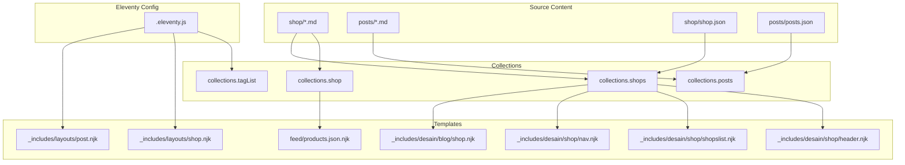
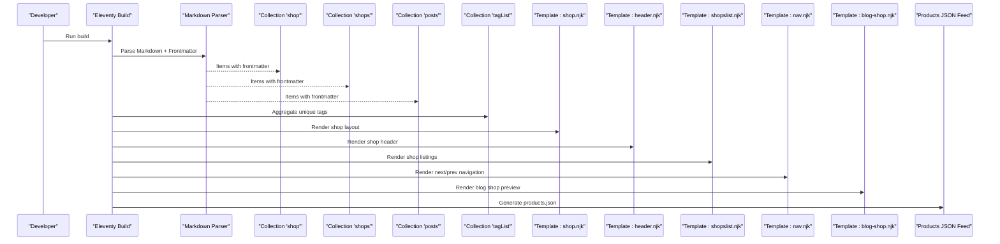
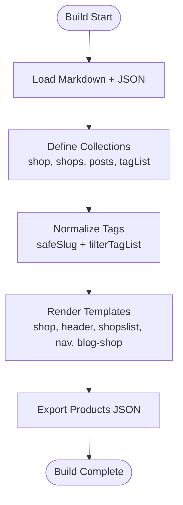
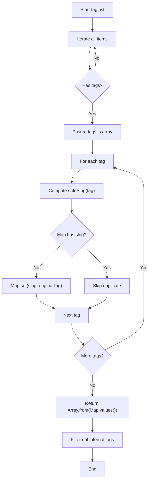
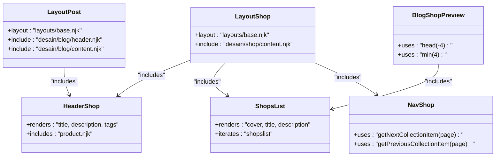
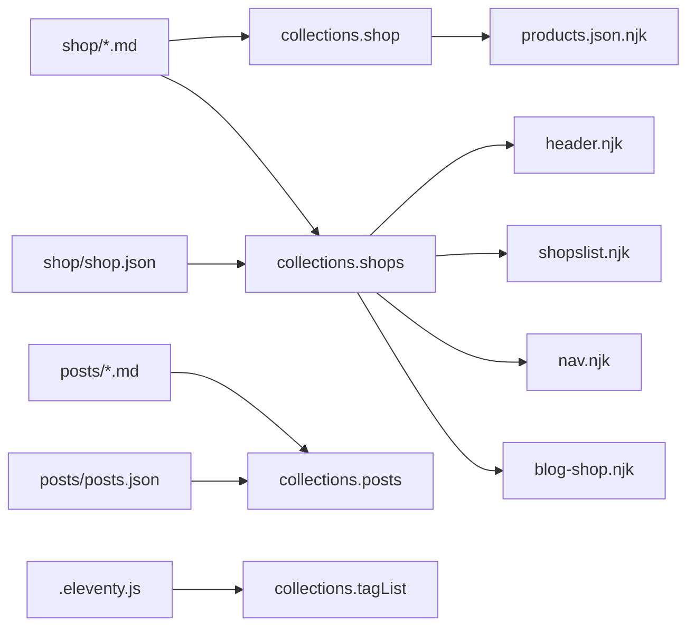

# Collection Management

<cite>
**Referenced Files in This Document**
- [.eleventy.js](file://.eleventy.js)
- [shop.json](file://shop/shop.json)
- [posts.json](file://posts/posts.json)
- [B0CLHGCYRN.md](file://shop/B0CLHGCYRN.md)
- [best-gift-ideas-in-uae-2025.md](file://posts/best-gift-ideas-in-uae-2025.md)
- [products.json.njk](file://feed/products.json.njk)
- [shop.njk](file:_includes/layouts/shop.njk)
- [post.njk](file:_includes/layouts/post.njk)
- [header.njk](file:_includes/desain/shop/header.njk)
- [shopslist.njk](file:_includes/desain/shop/shopslist.njk)
- [nav.njk](file:_includes/desain/shop/nav.njk)
- [blog-shop.njk](file:_includes/desain/blog/shop.njk)
- [metadata.json](file://_data/metadata.json)
</cite>

## Table of Contents
1. [Introduction](#introduction)
2. [Project Structure](#project-structure)
3. [Core Components](#core-components)
4. [Architecture Overview](#architecture-overview)
5. [Detailed Component Analysis](#detailed-component-analysis)
6. [Dependency Analysis](#dependency-analysis)
7. [Performance Considerations](#performance-considerations)
8. [Troubleshooting Guide](#troubleshooting-guide)
9. [Conclusion](#conclusion)

## Introduction
This document explains how the site organizes and processes product data using Eleventy collections. It covers:
- How product pages are created from Markdown files in the shop directory
- How collections are defined, filtered, and consumed across templates
- Data aggregation strategies for tags and listings
- Custom collection definitions and data transformation logic
- Performance optimization, caching strategies, and debugging techniques for large datasets

The goal is to provide a clear, code-backed understanding of the collection system so you can extend or optimize it confidently.

## Project Structure
At a high level:
- Product content lives under shop as individual Markdown files with frontmatter metadata
- Posts live under posts as Markdown files with frontmatter metadata
- Eleventy configuration defines filters, layout aliases, and custom collections
- Templates consume collections to render lists, detail pages, navigation, and feeds

**Diagram sources**
- [.eleventy.js:1-160](file://.eleventy.js#L1-L160)
- [shop.json:1-4](file://shop/shop.json#L1-L4)
- [posts.json:1-6](file://posts/posts.json#L1-L6)
- [products.json.njk:1-17](file://feed/products.json.njk#L1-L17)
- [shop.njk:1-5](file://_includes/layouts/shop.njk#L1-L5)
- [post.njk:1-6](file://_includes/layouts/post.njk#L1-L6)
- [header.njk:1-11](file://_includes/desain/shop/header.njk#L1-L11)
- [shopslist.njk:1-15](file://_includes/desain/shop/shopslist.njk#L1-L15)
- [nav.njk:1-8](file://_includes/desain/shop/nav.njk#L1-L8)
- [blog-shop.njk:1-4](file://_includes/desain/blog/shop.njk#L1-L4)

**Section sources**
- [.eleventy.js:1-160](file://.eleventy.js#L1-L160)
- [shop.json:1-4](file://shop/shop.json#L1-L4)
- [posts.json:1-6](file://posts/posts.json#L1-L6)

## Core Components
- Product source files (Markdown): Each file contains structured frontmatter fields such as title, description, price, cover image, images array, ecwidId, category, tags, amazonLink, permalink, date, bullet_points, and alt text arrays. These drive both page generation and collection membership.
- Post source files (Markdown): Similar frontmatter structure with tags and layout selection.
- Eleventy configuration: Adds plugins, global data, layout aliases, filters, and custom collections. Also configures markdown parsing and browsersync middleware.
- Collections used by templates:
  - collections.shop: Used to generate a products JSON feed
  - collections.shops: Used to list and navigate shop items
  - collections.posts: Used to list recent posts
  - collections.tagList: A custom collection that aggregates unique tags across all content

Key behaviors:
- Tag normalization and filtering ensure consistent tag slugs and exclude internal tags
- Safe slug filter guarantees URL-safe tag paths
- Head and min filters support listing pagination and previews
- XML encoding filter ensures safe output in feeds

**Section sources**
- [B0CLHGCYRN.md:1-55](file://shop/B0CLHGCYRN.md#L1-L55)
- [best-gift-ideas-in-uae-2025.md:1-259](file://posts/best-gift-ideas-in-uae-2025.md#L1-L259)
- [.eleventy.js:25-70](file://.eleventy.js#L25-L70)
- [.eleventy.js:72-95](file://.eleventy.js#L72-L95)
- [products.json.njk:1-17](file://feed/products.json.njk#L1-L17)

## Architecture Overview
The collection architecture connects source Markdown files to generated outputs via Eleventy’s collection system and template consumption.

**Diagram sources**
- [.eleventy.js:1-160](file://.eleventy.js#L1-L160)
- [shop.njk:1-5](file://_includes/layouts/shop.njk#L1-L5)
- [header.njk:1-11](file://_includes/desain/shop/header.njk#L1-L11)
- [shopslist.njk:1-15](file://_includes/desain/shop/shopslist.njk#L1-L15)
- [nav.njk:1-8](file://_includes/desain/shop/nav.njk#L1-L8)
- [blog-shop.njk:1-4](file://_includes/desain/blog/shop.njk#L1-L4)
- [products.json.njk:1-17](file://feed/products.json.njk#L1-L17)

## Detailed Component Analysis

### Product Source Data Model
Product pages are defined by Markdown files with rich frontmatter. Typical fields include:
- Identifiers and links: ecwidId, amazonLink, permalink
- Media: cover, images, cover_alt, image_alts
- Commerce and categorization: price, category, tags
- SEO and presentation: title, description, bullet_points
- Metadata: date, layout

This model enables:
- Automatic page generation per file
- Rich product listings and galleries
- Filtering and sorting by tags, categories, and dates
- External link integration for purchasing

**Section sources**
- [B0CLHGCYRN.md:1-55](file://shop/B0CLHGCYRN.md#L1-L55)

### Post Source Data Model
Posts follow a similar pattern with frontmatter including title, description, cover, date, tags, layout, and permalink. They are collected into collections.posts for listing and navigation.

**Section sources**
- [best-gift-ideas-in-uae-2025.md:1-259](file://posts/best-gift-ideas-in-uae-2025.md#L1-L259)

### Eleventy Configuration and Filters
The configuration centralizes:
- Plugins and global data
- Layout aliases for post and shop layouts
- Date formatting filters
- Utility filters: head, min, safeSlug, filterTagList, sanitize, xmlEncode
- Custom collection: tagList for unique, normalized tags

These utilities power:
- Consistent tag-based URLs
- Efficient listing slices
- Safe HTML/XML output
- Clean tag lists for navigation and indexes

**Section sources**
- [.eleventy.js:10-24](file://.eleventy.js#L10-L24)
- [.eleventy.js:25-70](file://.eleventy.js#L25-L70)
- [.eleventy.js:72-95](file://.eleventy.js#L72-L95)

### Collections and Their Usage
- collections.shop: Consumed by the products JSON feed to export product metadata
- collections.shops: Used in shop headers, listings, and navigation
- collections.posts: Used in blog sections and post listings
- collections.tagList: Provides a curated list of unique tags after normalization and filtering

**Diagram sources**
- [.eleventy.js:72-95](file://.eleventy.js#L72-L95)
- [products.json.njk:1-17](file://feed/products.json.njk#L1-L17)
- [header.njk:1-11](file://_includes/desain/shop/header.njk#L1-L11)
- [shopslist.njk:1-15](file://_includes/desain/shop/shopslist.njk#L1-L15)
- [nav.njk:1-8](file://_includes/desain/shop/nav.njk#L1-L8)
- [blog-shop.njk:1-4](file://_includes/desain/blog/shop.njk#L1-L4)

**Section sources**
- [products.json.njk:1-17](file://feed/products.json.njk#L1-L17)
- [header.njk:1-11](file://_includes/desain/shop/header.njk#L1-L11)
- [shopslist.njk:1-15](file://_includes/desain/shop/shopslist.njk#L1-L15)
- [nav.njk:1-8](file://_includes/desain/shop/nav.njk#L1-L8)
- [blog-shop.njk:1-4](file://_includes/desain/blog/shop.njk#L1-L4)

### Tag Aggregation and Normalization Logic
The tagList collection:
- Iterates all items
- Normalizes each tag using safeSlug to match sanitized permalinks
- Deduplicates tags using a Map
- Excludes internal tags like all, nav, post, posts, shop, shops

This ensures:
- Stable tag URLs
- No duplicate entries
- Clean tag lists for UI components

**Diagram sources**
- [.eleventy.js:72-95](file://.eleventy.js#L72-L95)
- [.eleventy.js:48-66](file://.eleventy.js#L48-L66)

**Section sources**
- [.eleventy.js:72-95](file://.eleventy.js#L72-L95)
- [.eleventy.js:48-66](file://.eleventy.js#L48-L66)

### Template Consumption Patterns
- Shop layout includes reusable shop content
- Post layout includes reusable blog content
- Shop header renders tags and includes product details
- Shopslist renders product cards with cover images and descriptions
- Nav provides next/previous navigation within the shops collection
- Blog shop preview uses head and min to limit displayed items

**Diagram sources**
- [shop.njk:1-5](file://_includes/layouts/shop.njk#L1-L5)
- [post.njk:1-6](file://_includes/layouts/post.njk#L1-L6)
- [header.njk:1-11](file://_includes/desain/shop/header.njk#L1-L11)
- [shopslist.njk:1-15](file://_includes/desain/shop/shopslist.njk#L1-L15)
- [nav.njk:1-8](file://_includes/desain/shop/nav.njk#L1-L8)
- [blog-shop.njk:1-4](file://_includes/desain/blog/shop.njk#L1-L4)

**Section sources**
- [shop.njk:1-5](file://_includes/layouts/shop.njk#L1-L5)
- [post.njk:1-6](file://_includes/layouts/post.njk#L1-L6)
- [header.njk:1-11](file://_includes/desain/shop/header.njk#L1-L11)
- [shopslist.njk:1-15](file://_includes/desain/shop/shopslist.njk#L1-L15)
- [nav.njk:1-8](file://_includes/desain/shop/nav.njk#L1-L8)
- [blog-shop.njk:1-4](file://_includes/desain/blog/shop.njk#L1-L4)

### Data Feeds and Aggregation
The products JSON feed iterates collections.shop to produce a machine-readable catalog with title, description, image, price, and link. The feed excludes itself from collections to avoid circular inclusion.

Global metadata (site.url) is provided via Eleventy configuration and referenced in the feed to construct absolute URLs.

**Section sources**
- [products.json.njk:1-17](file://feed/products.json.njk#L1-L17)
- [.eleventy.js:15-16](file://.eleventy.js#L15-L16)
- [metadata.json:1-47](file://_data/metadata.json#L1-L47)

## Dependency Analysis
- Source-to-collection mapping:
  - shop/*.md -> collections.shop and collections.shops
  - posts/*.md -> collections.posts
  - shop/shop.json and posts/posts.json contribute tags that influence collection membership and tag lists
- Template dependencies:
  - Layouts depend on included partials
  - Listings depend on collections and utility filters
  - Navigation depends on collection item helpers
- Global data dependency:
  - Site URL used in feeds and absolute links

**Diagram sources**
- [.eleventy.js:72-95](file://.eleventy.js#L72-L95)
- [shop.json:1-4](file://shop/shop.json#L1-L4)
- [posts.json:1-6](file://posts/posts.json#L1-L6)
- [products.json.njk:1-17](file://feed/products.json.njk#L1-L17)
- [header.njk:1-11](file://_includes/desain/shop/header.njk#L1-L11)
- [shopslist.njk:1-15](file://_includes/desain/shop/shopslist.njk#L1-L15)
- [nav.njk:1-8](file://_includes/desain/shop/nav.njk#L1-L8)
- [blog-shop.njk:1-4](file://_includes/desain/blog/shop.njk#L1-L4)

**Section sources**
- [shop.json:1-4](file://shop/shop.json#L1-L4)
- [posts.json:1-6](file://posts/posts.json#L1-L6)
- [.eleventy.js:72-95](file://.eleventy.js#L72-L95)

## Performance Considerations
- Minimize heavy operations in templates:
  - Use head and min filters to limit iteration size when rendering previews
  - Avoid repeated expensive computations inside loops
- Optimize tag processing:
  - Keep tag normalization centralized in the tagList collection
  - Exclude internal tags early to reduce downstream work
- Reduce DOM and asset load:
  - Ensure cover images use lazy loading attributes where applicable
  - Prefer optimized image formats and sizes
- Leverage Eleventy features:
  - Use eleventyExcludeFromCollections for assets and feeds not intended for listing
  - Configure deep merge only when needed to avoid unnecessary overhead
- Caching strategies:
  - Rely on Eleventy’s incremental builds during development
  - For large catalogs, consider precomputing derived data in configuration and exposing it via global data or dedicated collections
- Debugging large datasets:
  - Log collection lengths in templates temporarily to verify counts
  - Validate tag normalization by inspecting tagList output
  - Use Eleventy’s debug mode to identify slow transforms

[No sources needed since this section provides general guidance]

## Troubleshooting Guide
Common issues and resolutions:
- Missing or inconsistent tags:
  - Ensure every product and post includes a tags array; normalize via safeSlug and filterTagList
  - Verify internal tags are excluded from public tag lists
- Incorrect tag URLs:
  - Confirm safeSlug usage aligns with permalink generation
  - Check that tagList deduplication preserves original display values
- Empty listings:
  - Verify collections.shops and collections.posts are populated by checking source files and their tags
  - Confirm layout aliases point to correct layout files
- Feed errors:
  - Ensure site.url is set globally and used consistently in feed templates
  - Validate XML encoding for special characters in descriptions

**Section sources**
- [.eleventy.js:48-70](file://.eleventy.js#L48-L70)
- [.eleventy.js:72-95](file://.eleventy.js#L72-L95)
- [products.json.njk:1-17](file://feed/products.json.njk#L1-L17)
- [shop.njk:1-5](file://_includes/layouts/shop.njk#L1-L5)
- [post.njk:1-6](file://_includes/layouts/post.njk#L1-L6)

## Conclusion
The collection management system leverages Eleventy’s flexible collection API to transform Markdown-based product and post content into organized, filterable, and consumable datasets. Centralized filters and custom collections ensure consistency, while templates efficiently render listings, navigation, and feeds. By following the patterns outlined here—normalizing tags, limiting iterations, and leveraging Eleventy’s built-in tools—you can maintain performance and scalability even as your dataset grows.