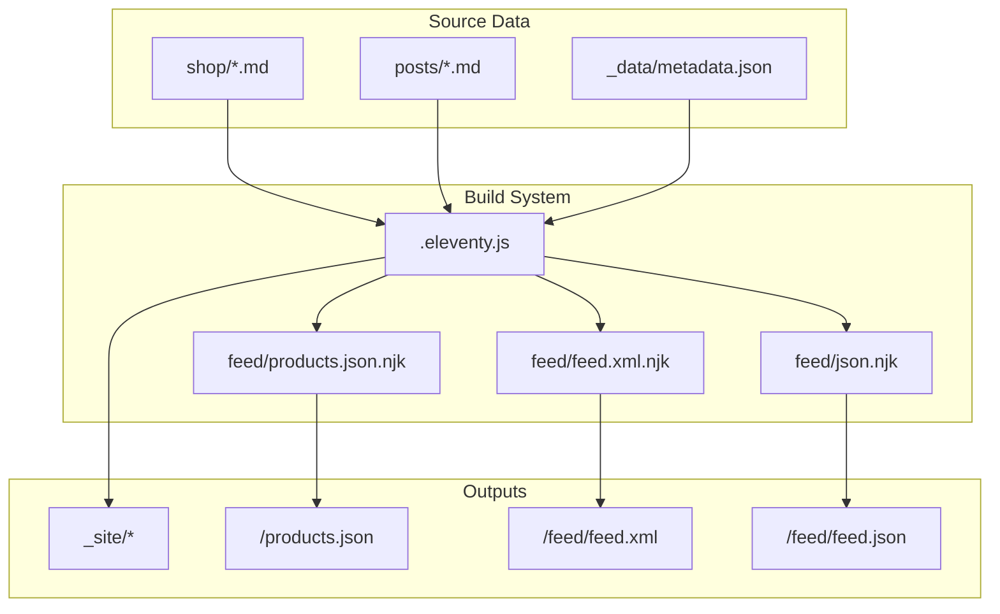
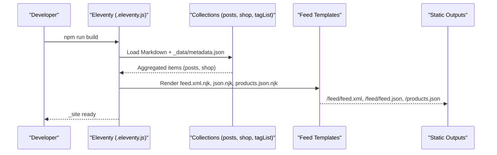
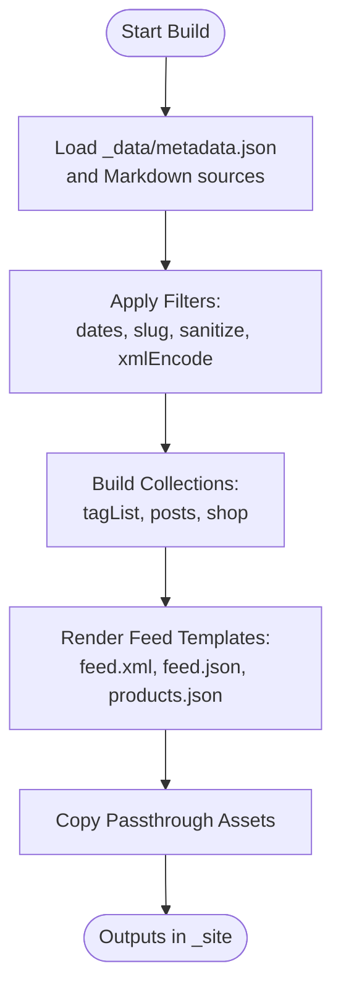
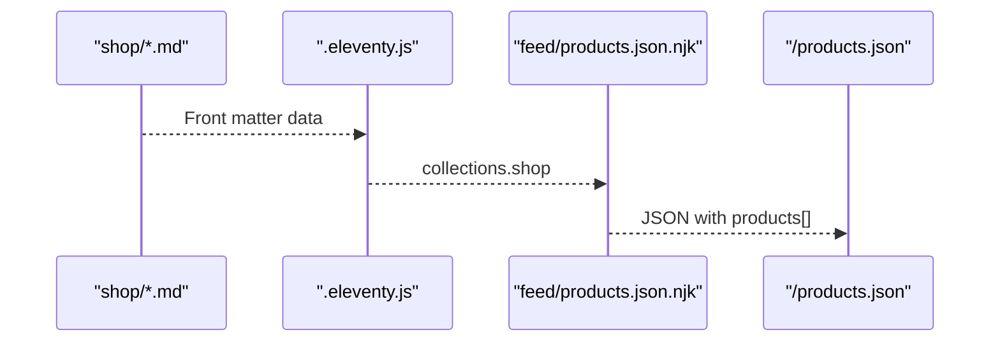
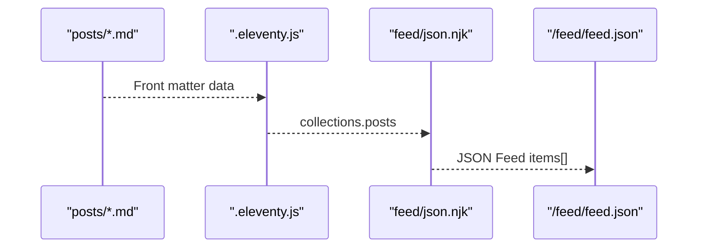
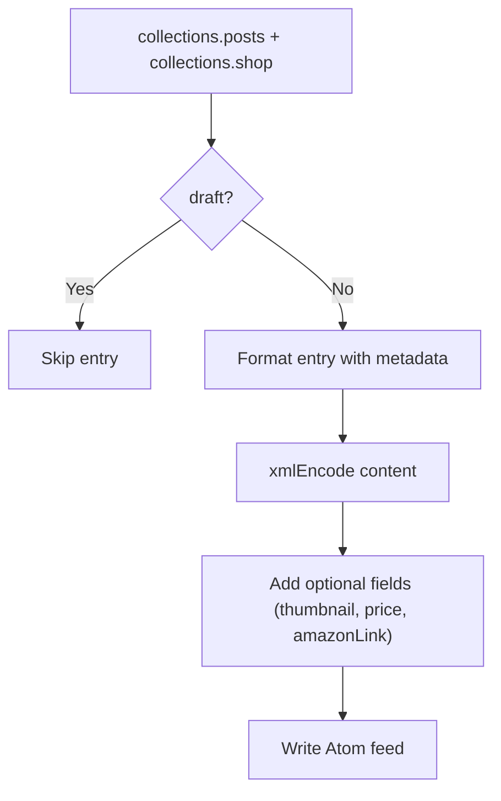
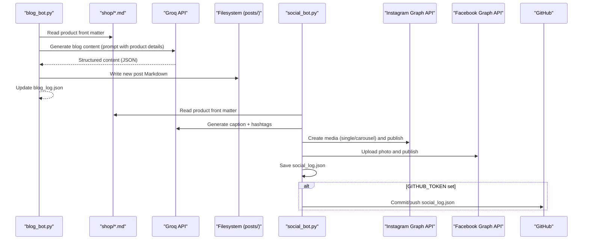
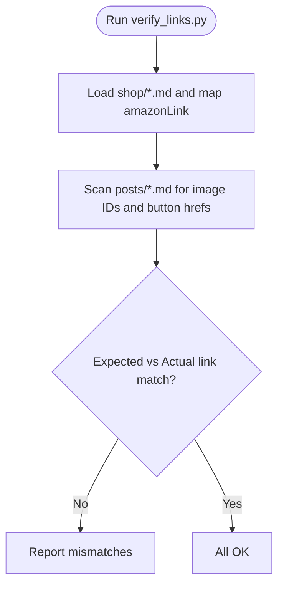
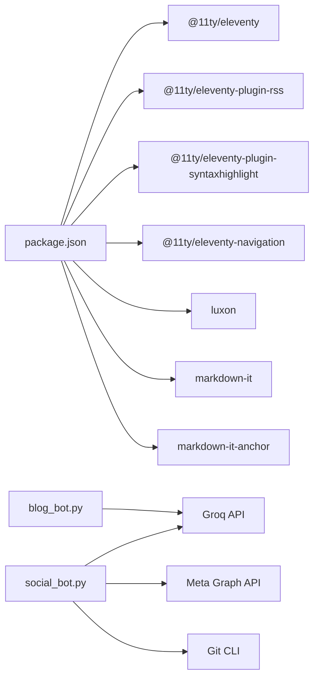

# Data Processing Pipeline

<cite>
**Referenced Files in This Document**
- [.eleventy.js](file://.eleventy.js)
- [package.json](file://package.json)
- [feed/feed.xml.njk](file://feed/feed.xml.njk)
- [feed/json.njk](file://feed/json.njk)
- [feed/products.json.njk](file://feed/products.json.njk)
- [_data/metadata.json](file://_data/metadata.json)
- [posts/posts.json](file://posts/posts.json)
- [shop/shop.json](file://shop/shop.json)
- [blog_bot.py](file://blog_bot.py)
- [social_bot.py](file://social_bot.py)
- [scripts/check-filenames.js](file://scripts/check-filenames.js)
- [verify_links.py](file://verify_links.py)
- [test_frontmatter.py](file://test_frontmatter.py)
- [netlify.toml](file://netlify.toml)
</cite>

## Table of Contents
1. [Introduction](#introduction)
2. [Project Structure](#project-structure)
3. [Core Components](#core-components)
4. [Architecture Overview](#architecture-overview)
5. [Detailed Component Analysis](#detailed-component-analysis)
6. [Dependency Analysis](#dependency-analysis)
7. [Performance Considerations](#performance-considerations)
8. [Troubleshooting Guide](#troubleshooting-guide)
9. [Conclusion](#conclusion)
10. [Appendices](#appendices)

## Introduction
This document describes the end-to-end data processing pipeline that transforms Markdown product files and blog posts into generated feeds and Eleventy collections. The system ingests structured Markdown with front matter, aggregates items into collections (products, posts), applies filtering and sanitization, and renders JSON and Atom feeds. It also includes automation scripts to generate blog content from products using an external AI API and to publish social media posts via Meta APIs.

The pipeline emphasizes:
- Clear separation between source data (Markdown), build-time transformations (Eleventy), and output artifacts (JSON/Atom feeds).
- Robust filtering and sanitization for safe URLs and XML/JSON generation.
- Extensible collection-based architecture for products and posts.
- Integration points for external services (AI content generation and social platforms).

## Project Structure
At a high level:
- Source data resides in shop/ (product Markdown) and posts/ (blog Markdown).
- Feed templates live under feed/ and are rendered by Eleventy into static outputs.
- Global metadata is defined in _data/metadata.json.
- Eleventy configuration centralizes filters, collections, and plugins.
- Automation scripts (Python) generate content and post to social platforms.
- Utility scripts validate filenames and link consistency.

**Diagram sources**
- [.eleventy.js:1-160](file://.eleventy.js#L1-L160)
- [feed/feed.xml.njk:1-63](file://feed/feed.xml.njk#L1-L63)
- [feed/json.njk:1-33](file://feed/json.njk#L1-L33)
- [feed/products.json.njk:1-17](file://feed/products.json.njk#L1-L17)
- [_data/metadata.json:1-27](file://_data/metadata.json#L1-L27)

**Section sources**
- [.eleventy.js:1-160](file://.eleventy.js#L1-L160)
- [package.json:1-34](file://package.json#L1-L34)
- [netlify.toml:1-3](file://netlify.toml#L1-L3)

## Core Components
- Eleventy configuration: registers plugins, global data, filters, collections, markdown library, and passthrough assets.
- Collections:
  - tagList: builds a unique list of tags across all items, normalizing slugs for consistent navigation.
  - posts: aggregated from posts/ directory via posts/posts.json.
  - shop: aggregated from shop/ directory via shop/shop.json.
- Feed generators:
  - Atom feed (/feed/feed.xml): iterates posts and shop items, excludes drafts, encodes content safely.
  - JSON Feed (/feed/feed.json): iterates posts, serializes template content safely.
  - Products JSON (/products.json): iterates shop items, produces a flat product array.
- Filters and utilities:
  - Date formatting (readableDate, htmlDateString, isoDateTime).
  - Array helpers (head, min).
  - Slug normalization (safeSlug) to ensure valid filenames.
  - Tag filtering (filterTagList) to exclude internal tags.
  - Sanitization (sanitize, xmlEncode) for safe rendering.

**Section sources**
- [.eleventy.js:25-95](file://.eleventy.js#L25-L95)
- [.eleventy.js:134-143](file://.eleventy.js#L134-L143)
- [feed/feed.xml.njk:1-63](file://feed/feed.xml.njk#L1-L63)
- [feed/json.njk:1-33](file://feed/json.njk#L1-L33)
- [feed/products.json.njk:1-17](file://feed/products.json.njk#L1-L17)
- [posts/posts.json:1-6](file://posts/posts.json#L1-L6)
- [shop/shop.json:1-4](file://shop/shop.json#L1-L4)

## Architecture Overview
The pipeline consists of three phases:
1. Ingestion: Markdown files with front matter are read by Eleventy; metadata is loaded from _data.
2. Transformation: Collections aggregate items; filters normalize dates, slugs, and content; drafts are excluded where required.
3. Generation: Templates render Atom, JSON Feed, and Products JSON; static site assets are copied.

**Diagram sources**
- [.eleventy.js:1-160](file://.eleventy.js#L1-L160)
- [feed/feed.xml.njk:1-63](file://feed/feed.xml.njk#L1-L63)
- [feed/json.njk:1-33](file://feed/json.njk#L1-L33)
- [feed/products.json.njk:1-17](file://feed/products.json.njk#L1-L17)
- [_data/metadata.json:1-27](file://_data/metadata.json#L1-L27)

## Detailed Component Analysis

### Eleventy Configuration and Collections
- Plugins: RSS, syntax highlighting, navigation.
- Global data: site.url used throughout templates for absolute URLs.
- Deep merge enabled for layered data overrides.
- Layout aliases: post -> layouts/post.njk, shop -> layouts/shop.njk.
- Filters:
  - readableDate, htmlDateString, isoDateTime for date formatting.
  - head, min for array/math operations.
  - safeSlug: uses Eleventy’s slug filter then removes unsafe characters to produce Netlify-safe filenames.
  - filterTagList: removes internal tags like all, nav, post, posts, shop, shops.
  - sanitize: escapes quotes and newlines for safe string usage.
  - xmlEncode: escapes &, <, >, ", ' for XML safety.
- Collections:
  - tagList: maps normalized tag slugs to original tags, excluding internal tags.
- Markdown library: configured with HTML support, line breaks, linkify, and anchor permalinks.
- Passthrough copy: img, css, robots.txt, feed, videos.
- Browsersync middleware: serves 404.html during development.

**Diagram sources**
- [.eleventy.js:1-160](file://.eleventy.js#L1-L160)

**Section sources**
- [.eleventy.js:10-24](file://.eleventy.js#L10-L24)
- [.eleventy.js:25-70](file://.eleventy.js#L25-L70)
- [.eleventy.js:72-95](file://.eleventy.js#L72-L95)
- [.eleventy.js:99-105](file://.eleventy.js#L99-L105)
- [.eleventy.js:106-116](file://.eleventy.js#L106-L116)
- [.eleventy.js:118-132](file://.eleventy.js#L118-L132)
- [.eleventy.js:134-143](file://.eleventy.js#L134-L143)
- [.eleventy.js:146-159](file://.eleventy.js#L146-L159)

### Product Collection and Products JSON Feed
- Source: shop/*.md files with front matter fields such as title, description, price, cover, images, amazonLink, permalink, tags.
- Collection: shop is created via shop/shop.json tagging.
- Products JSON generator:
  - Iterates collections.shop.
  - Produces a JSON object with a products array containing title, description (stripped of HTML and XML-encoded), image (absolute URL), price, and link (absolute URL).

**Diagram sources**
- [feed/products.json.njk:1-17](file://feed/products.json.njk#L1-L17)
- [shop/shop.json:1-4](file://shop/shop.json#L1-L4)

**Section sources**
- [feed/products.json.njk:1-17](file://feed/products.json.njk#L1-L17)
- [shop/shop.json:1-4](file://shop/shop.json#L1-L4)

### Blog Posts Collection and JSON Feed
- Source: posts/*.md files with front matter fields such as title, description, cover, date, tags, layout, permalink.
- Collection: posts is created via posts/posts.json tagging.
- JSON Feed generator:
  - Iterates collections.posts in reverse chronological order.
  - Serializes id, url, title, content_html (templateContent serialized safely), and date_published.

**Diagram sources**
- [feed/json.njk:1-33](file://feed/json.njk#L1-L33)
- [posts/posts.json:1-6](file://posts/posts.json#L1-L6)

**Section sources**
- [feed/json.njk:1-33](file://feed/json.njk#L1-L33)
- [posts/posts.json:1-6](file://posts/posts.json#L1-L6)

### Atom Feed Generator
- Source: both posts and shop collections.
- Behavior:
  - Excludes draft items.
  - Uses metadata for feed identity and author info.
  - Encodes content safely with xmlEncode.
  - Includes optional media thumbnails, price, brand, availability, and custom fields (e.g., amazonLink).

**Diagram sources**
- [feed/feed.xml.njk:1-63](file://feed/feed.xml.njk#L1-L63)

**Section sources**
- [feed/feed.xml.njk:1-63](file://feed/feed.xml.njk#L1-L63)

### External Integrations: AI Content Generation and Social Posting
- Blog Bot:
  - Reads a random product file from shop/*.md.
  - Calls Groq API to generate SEO-optimized blog content.
  - Creates a new Markdown post in posts/ with sanitized front matter and embedded images and Amazon button.
  - Maintains a history log to avoid reusing the same product.
- Social Bot:
  - Reads a random product file, generates caption and hashtags via Groq API.
  - Publishes to Instagram (single or carousel) and Facebook via Meta Graph API.
  - Persists posting history and optionally syncs logs to GitHub.

**Diagram sources**
- [blog_bot.py:1-253](file://blog_bot.py#L1-L253)
- [social_bot.py:1-315](file://social_bot.py#L1-L315)

**Section sources**
- [blog_bot.py:18-46](file://blog_bot.py#L18-L46)
- [blog_bot.py:48-97](file://blog_bot.py#L48-L97)
- [blog_bot.py:99-208](file://blog_bot.py#L99-L208)
- [blog_bot.py:210-253](file://blog_bot.py#L210-L253)
- [social_bot.py:23-61](file://social_bot.py#L23-L61)
- [social_bot.py:79-118](file://social_bot.py#L79-L118)
- [social_bot.py:120-136](file://social_bot.py#L120-L136)
- [social_bot.py:138-206](file://social_bot.py#L138-L206)
- [social_bot.py:208-246](file://social_bot.py#L208-L246)
- [social_bot.py:248-315](file://social_bot.py#L248-L315)

### Data Validation and Quality Assurance
- Filename validation script:
  - Scans _site for forbidden characters (? and #) in filenames and exits with error if found.
- Link verification script:
  - Cross-checks Amazon links in blog posts against product files to detect mismatches.
- Front matter test script:
  - Loads sample product files and prints key fields for manual inspection.

**Diagram sources**
- [verify_links.py:1-55](file://verify_links.py#L1-L55)

**Section sources**
- [scripts/check-filenames.js:1-45](file://scripts/check-filenames.js#L1-L45)
- [verify_links.py:1-55](file://verify_links.py#L1-L55)
- [test_frontmatter.py:1-17](file://test_frontmatter.py#L1-L17)

## Dependency Analysis
- Build dependencies:
  - Eleventy core and plugins (RSS, syntax highlight, navigation).
  - Luxon for date formatting.
  - Markdown-it and markdown-it-anchor for enhanced Markdown processing.
- Runtime integrations:
  - Groq API for AI-generated content.
  - Meta Graph API for Instagram/Facebook publishing.
  - Git CLI for syncing logs to GitHub.

**Diagram sources**
- [package.json:24-32](file://package.json#L24-L32)
- [blog_bot.py:84-97](file://blog_bot.py#L84-L97)
- [social_bot.py:120-136](file://social_bot.py#L120-L136)
- [social_bot.py:138-206](file://social_bot.py#L138-L206)
- [social_bot.py:208-246](file://social_bot.py#L208-L246)
- [social_bot.py:23-61](file://social_bot.py#L23-L61)

**Section sources**
- [package.json:24-32](file://package.json#L24-L32)

## Performance Considerations
- Use Eleventy’s built-in collections and filters to minimize custom processing overhead.
- Avoid heavy computations in templates; precompute derived data in Eleventy config or scripts.
- Limit iterations in feed templates to necessary fields; strip HTML early with striptags before encoding.
- Cache external API responses when feasible (e.g., store generated captions or blog content locally to reduce redundant calls).
- Keep image paths relative and rely on site.url for absolute URLs to avoid repeated URL construction logic.
- Exclude drafts and unnecessary items early in collection pipelines to reduce template workload.

[No sources needed since this section provides general guidance]

## Troubleshooting Guide
- Missing environment variables:
  - Ensure GROQ_API_KEY, META_ACCESS_TOKEN, FB_PAGE_ID, IG_USER_ID, and GITHUB_TOKEN are set in CI/CD secrets.
- API errors:
  - Check response status codes and bodies; handle token expiration (error code 190) by refreshing tokens.
- File naming issues:
  - Run filename checker after build to catch forbidden characters in output paths.
- Link mismatches:
  - Use link verification script to detect inconsistencies between blog posts and product files.
- Front matter parsing:
  - Use front matter test script to inspect expected fields and values.

**Section sources**
- [social_bot.py:248-263](file://social_bot.py#L248-L263)
- [social_bot.py:186-206](file://social_bot.py#L186-L206)
- [social_bot.py:226-246](file://social_bot.py#L226-L246)
- [scripts/check-filenames.js:22-45](file://scripts/check-filenames.js#L22-L45)
- [verify_links.py:16-55](file://verify_links.py#L16-L55)
- [test_frontmatter.py:1-17](file://test_frontmatter.py#L1-L17)

## Conclusion
The pipeline integrates Markdown-driven content with Eleventy’s collection and templating system to produce robust feeds and a static site. Filtering, sanitization, and safe slug generation ensure reliable outputs. External integrations extend the workflow by automating content creation and social distribution. With clear validation tools and structured configurations, the system remains maintainable and extensible.

[No sources needed since this section summarizes without analyzing specific files]

## Appendices
- Build commands:
  - npm run build
  - npm run watch
  - npm run serve
  - npm run debug
- Deployment:
  - Netlify publishes _site and runs Eleventy with DEBUG enabled.

**Section sources**
- [package.json:5-11](file://package.json#L5-L11)
- [netlify.toml:1-3](file://netlify.toml#L1-L3)