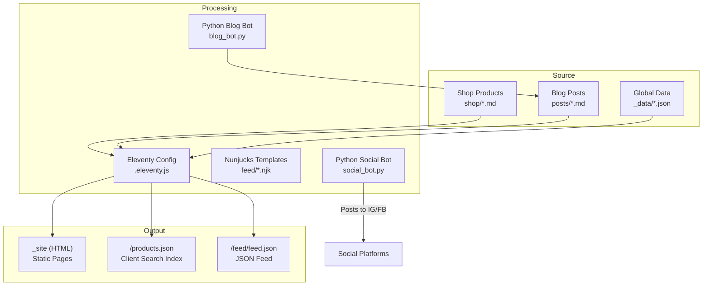
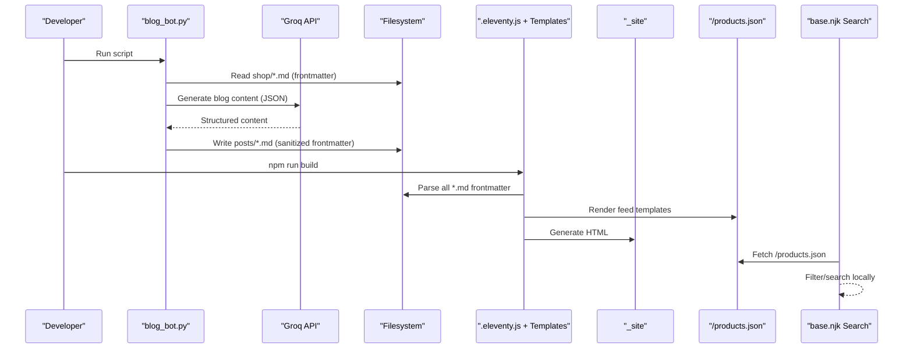
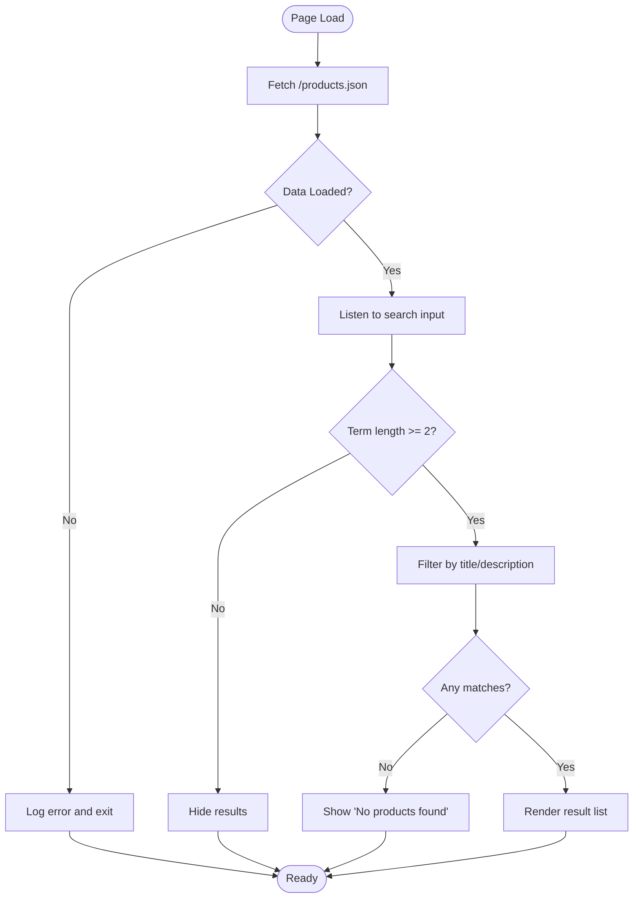
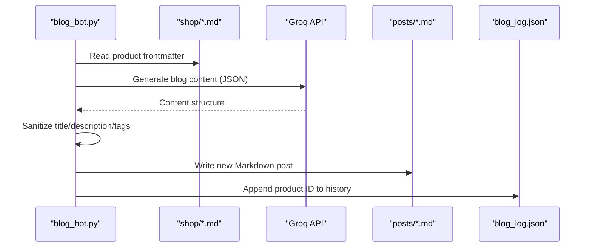
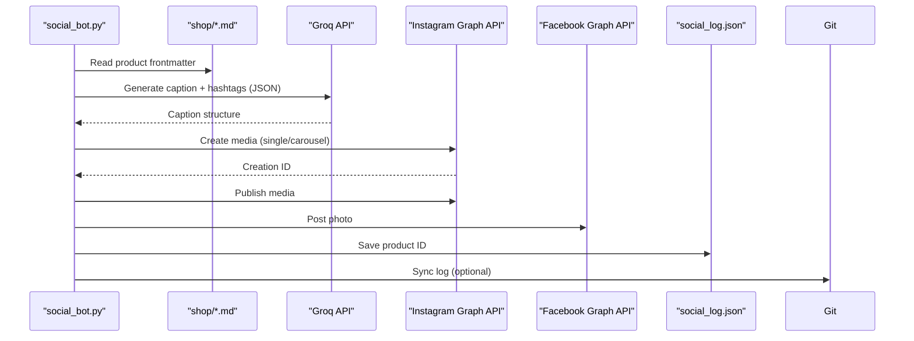
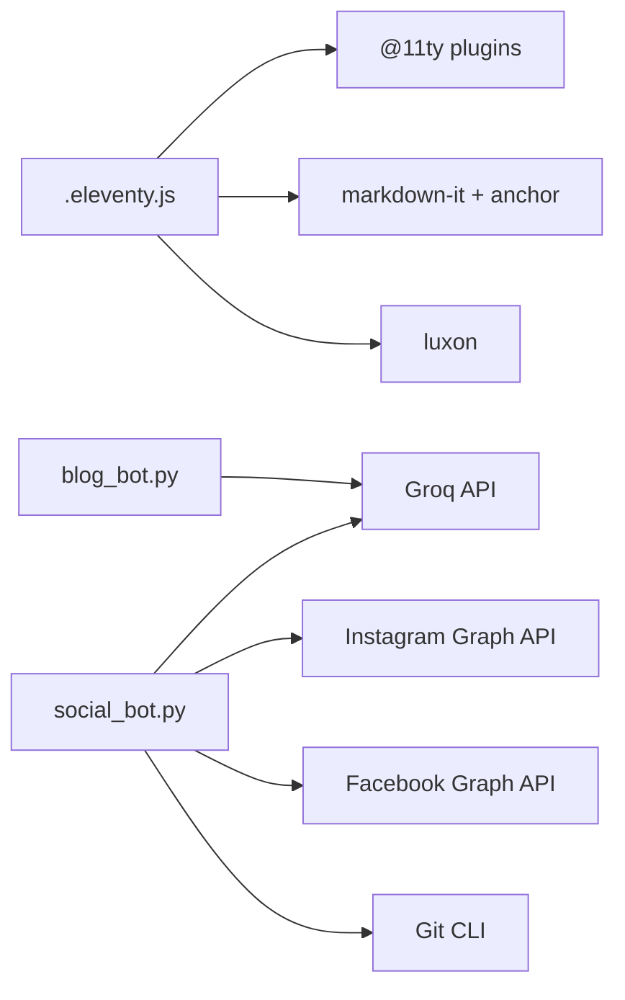

# Data Transformation Engine

<cite>
**Referenced Files in This Document**
- [.eleventy.js](file://.eleventy.js)
- [package.json](file://package.json)
- [metadata.json](file://_data/metadata.json)
- [template.json](file://_data/template.json)
- [blog_bot.py](file://blog_bot.py)
- [social_bot.py](file://social_bot.py)
- [check-filenames.js](file://scripts/check-filenames.js)
- [products.json.njk](file://feed/products.json.njk)
- [json.njk](file://feed/json.njk)
- [base.njk](file://_includes/layouts/base.njk)
- [head.njk](file://_includes/widget/head.njk)
- [B0CLHGCYRN.md](file://shop/B0CLHGCYRN.md)
- [test_frontmatter.py](file://test_frontmatter.py)
</cite>

## Table of Contents
1. [Introduction](#introduction)
2. [Project Structure](#project-structure)
3. [Core Components](#core-components)
4. [Architecture Overview](#architecture-overview)
5. [Detailed Component Analysis](#detailed-component-analysis)
6. [Dependency Analysis](#dependency-analysis)
7. [Performance Considerations](#performance-considerations)
8. [Troubleshooting Guide](#troubleshooting-guide)
9. [Conclusion](#conclusion)
10. [Appendices](#appendices)

## Introduction
This document describes the data transformation engine that converts raw Markdown content with YAML frontmatter into structured data objects and formatted outputs for a static site built with Eleventy. It covers:
- Custom filter functions used during build-time transformations
- Data validation rules applied to frontmatter fields
- End-to-end transformation pipelines (build-time and automation scripts)
- How Markdown frontmatter is parsed, processed, and converted into structured data
- Error handling, data sanitization, and performance optimization techniques
- Examples of implementing custom transformations and integrating with external data sources (AI APIs and social platforms)

The system combines:
- Build-time processing via Eleventy configuration and Nunjucks templates
- Python automation scripts that generate blog posts and publish social media content
- JSON feeds consumed by client-side features like search

## Project Structure
At a high level, the transformation pipeline spans three layers:
- Source layer: Markdown product pages and blog posts with YAML frontmatter
- Processing layer: Eleventy filters/collections and Nunjucks templates; Python bots for AI generation and social publishing
- Output layer: Static HTML, JSON feeds, and generated artifacts

**Diagram sources**
- [.eleventy.js:1-160](file://.eleventy.js#L1-L160)
- [products.json.njk:1-17](file://feed/products.json.njk#L1-L17)
- [json.njk:1-33](file://feed/json.njk#L1-L33)
- [blog_bot.py:1-253](file://blog_bot.py#L1-L253)
- [social_bot.py:1-315](file://social_bot.py#L1-L315)

**Section sources**
- [.eleventy.js:1-160](file://.eleventy.js#L1-L160)
- [package.json:1-34](file://package.json#L1-L34)

## Core Components
- Eleventy configuration and filters: Centralizes date formatting, slug normalization, tag filtering, XML encoding, and collection construction. These are the primary building blocks for transforming frontmatter into safe, consistent values.
- Frontmatter parsing and model: Product and post Markdown files define structured metadata (title, description, tags, cover images, links, dates). The system normalizes these fields across build-time and automation scripts.
- Feed generators: Nunjucks templates produce /products.json and /feed/feed.json from collections, applying sanitization and absolute URL resolution.
- Automation scripts:
  - Blog bot: Reads product frontmatter, calls an AI API to generate SEO-optimized blog content, writes new Markdown posts with sanitized frontmatter.
  - Social bot: Reads product frontmatter, generates captions via AI, publishes to Instagram and Facebook, persists posting history, and optionally syncs logs to Git.

Key responsibilities:
- Validation and sanitization of user/AI-generated content
- Consistent slugification and permalink generation
- Safe output encoding for XML/JSON contexts
- Robust error handling and logging

**Section sources**
- [.eleventy.js:25-95](file://.eleventy.js#L25-L95)
- [products.json.njk:1-17](file://feed/products.json.njk#L1-L17)
- [json.njk:1-33](file://feed/json.njk#L1-L33)
- [blog_bot.py:48-208](file://blog_bot.py#L48-L208)
- [social_bot.py:101-118](file://social_bot.py#L101-L118)

## Architecture Overview
The transformation engine orchestrates multiple flows:

**Diagram sources**
- [blog_bot.py:210-253](file://blog_bot.py#L210-L253)
- [.eleventy.js:145-159](file://.eleventy.js#L145-L159)
- [products.json.njk:1-17](file://feed/products.json.njk#L1-L17)
- [base.njk:14-20](file://_includes/layouts/base.njk#L14-L20)

## Detailed Component Analysis

### Frontmatter Model and Validation Rules
Product and post Markdown files use YAML frontmatter to define structured metadata. Typical fields include:
- title: string
- description: string
- price: string or currency-formatted value
- cover: image path
- images: array of image paths
- tags: array of strings
- layout: template alias
- permalink: route path
- date: ISO date string
- amazonLink/link: external link
- Optional: bullet_points, cover_alt, image_alts

Validation and sanitization rules:
- Title and description: Escape quotes and collapse newlines to ensure valid YAML and safe rendering.
- Tags: Unescape HTML entities, remove problematic characters (e.g., #, ?, slashes), trim whitespace, limit count, ensure inclusion of required tags (e.g., 'post').
- Slugs/permalinks: Normalize using a safe slug function that removes unsafe characters and collapses hyphens.
- Image paths: Deduplicate and normalize relative paths to absolute URLs when needed.
- Dates: Ensure ISO format for feeds and schema compatibility.

Examples of where these rules are applied:
- Tag sanitization and enforcement in blog generation
- Safe slug generation for permalinks and tag lists
- XML encoding for feed outputs

**Section sources**
- [B0CLHGCYRN.md:1-38](file://shop/B0CLHGCYRN.md#L1-L38)
- [blog_bot.py:105-123](file://blog_bot.py#L105-L123)
- [blog_bot.py:151-172](file://blog_bot.py#L151-L172)
- [.eleventy.js:48-66](file://.eleventy.js#L48-L66)
- [.eleventy.js:134-143](file://.eleventy.js#L134-L143)

### Custom Filters and Collections
Filters implemented in Eleventy config:
- readableDate: Format dates for human-readable display
- htmlDateString: Format dates for HTML input attributes
- isoDateTime: Produce ISO datetime with timezone for schema.org
- head: Slice arrays for pagination or previews
- min: Compute minimum among numbers
- safeSlug: Normalize slugs safely for filenames and routes
- filterTagList: Remove internal/system tags from public lists
- sanitize: Replace quotes and collapse newlines for safe embedding
- xmlEncode: Encode special characters for XML/JSON contexts

Collections:
- tagList: Aggregates unique tags across items, deduplicates, and excludes internal tags

These filters and collections form the core of the transformation pipeline, ensuring consistency and safety across outputs.

**Section sources**
- [.eleventy.js:25-70](file://.eleventy.js#L25-L70)
- [.eleventy.js:72-95](file://.eleventy.js#L72-L95)
- [.eleventy.js:134-143](file://.eleventy.js#L134-L143)

### Feed Generation Pipelines
Two key feed templates transform collections into structured outputs:
- products.json: Builds a client-searchable index from the shop collection, including title, description, image, price, and link. Uses xmlEncode and absolute URL helpers.
- feed.json: Produces a JSON Feed compliant with the spec, listing posts with id, url, title, content_html, and published date.

Data flow:
- Eleventy collects items tagged appropriately
- Nunjucks iterates collections and applies filters
- Outputs are written to _site with defined permalinks

**Section sources**
- [products.json.njk:1-17](file://feed/products.json.njk#L1-L17)
- [json.njk:1-33](file://feed/json.njk#L1-L33)

### Client-Side Search Integration
The base layout fetches /products.json at runtime and performs local filtering by title and description. This offloads search logic to the browser, improving interactivity without server overhead.

**Diagram sources**
- [base.njk:14-20](file://_includes/layouts/base.njk#L14-L20)
- [base.njk:22-52](file://_includes/layouts/base.njk#L22-L52)

**Section sources**
- [base.njk:14-52](file://_includes/layouts/base.njk#L14-L52)

### Blog Generation Pipeline (Automation)
The blog bot automates creation of SEO-optimized posts from product data:
- Selects a random product not yet posted
- Loads frontmatter and aggregates images
- Calls Groq API to generate structured content (title, description, tags, sections)
- Sanitizes frontmatter fields and constructs Markdown with embedded HTML elements
- Writes the new post file and updates posting history

**Diagram sources**
- [blog_bot.py:33-46](file://blog_bot.py#L33-L46)
- [blog_bot.py:48-97](file://blog_bot.py#L48-L97)
- [blog_bot.py:99-208](file://blog_bot.py#L99-L208)
- [blog_bot.py:210-253](file://blog_bot.py#L210-L253)

**Section sources**
- [blog_bot.py:18-46](file://blog_bot.py#L18-L46)
- [blog_bot.py:48-97](file://blog_bot.py#L48-L97)
- [blog_bot.py:99-208](file://blog_bot.py#L99-L208)
- [blog_bot.py:210-253](file://blog_bot.py#L210-L253)

### Social Publishing Pipeline (Automation)
The social bot selects a product, generates captions via AI, and publishes to Instagram and Facebook:
- Parses product frontmatter and normalizes image URLs
- Generates caption and hashtags via Groq API
- Publishes single image or carousel to Instagram, then publishes
- Publishes photo to Facebook
- Persists posting history and optionally syncs logs to GitHub

**Diagram sources**
- [social_bot.py:79-118](file://social_bot.py#L79-L118)
- [social_bot.py:120-136](file://social_bot.py#L120-L136)
- [social_bot.py:138-206](file://social_bot.py#L138-L206)
- [social_bot.py:208-246](file://social_bot.py#L208-L246)
- [social_bot.py:248-315](file://social_bot.py#L248-L315)

**Section sources**
- [social_bot.py:79-118](file://social_bot.py#L79-L118)
- [social_bot.py:120-136](file://social_bot.py#L120-L136)
- [social_bot.py:138-206](file://social_bot.py#L138-L206)
- [social_bot.py:208-246](file://social_bot.py#L208-L246)
- [social_bot.py:248-315](file://social_bot.py#L248-L315)

### Data Sanitization and Encoding
Sanitization strategies:
- Frontmatter field escaping: Quotes escaped, newlines collapsed to prevent malformed YAML
- Tag cleaning: HTML entity unescaping, removal of forbidden characters, trimming, limiting count
- Slug normalization: Lowercase, non-alphanumeric replacement with hyphens, collapsing duplicates
- XML/JSON encoding: Special characters encoded for safe serialization

These steps ensure robustness against malformed inputs and platform constraints.

**Section sources**
- [blog_bot.py:105-123](file://blog_bot.py#L105-L123)
- [blog_bot.py:151-172](file://blog_bot.py#L151-L172)
- [.eleventy.js:48-66](file://.eleventy.js#L48-L66)
- [.eleventy.js:134-143](file://.eleventy.js#L134-L143)

### Error Handling Strategies
- API errors: Raise exceptions with response details; detect expired tokens and provide remediation guidance
- File operations: Guard against missing directories and invalid JSON logs
- Build-time checks: Validate output filenames for forbidden characters to avoid deployment issues

**Section sources**
- [social_bot.py:128-136](file://social_bot.py#L128-L136)
- [social_bot.py:186-206](file://social_bot.py#L186-L206)
- [social_bot.py:226-246](file://social_bot.py#L226-L246)
- [blog_bot.py:248-253](file://blog_bot.py#L248-L253)
- [check-filenames.js:22-45](file://scripts/check-filenames.js#L22-L45)

## Dependency Analysis
External dependencies and integrations:
- Eleventy ecosystem: Plugins for RSS, syntax highlighting, navigation
- Markdown processing: markdown-it with anchor plugin
- Date/time formatting: Luxon
- AI generation: Groq API (OpenAI-compatible endpoint)
- Social platforms: Instagram Graph API, Facebook Graph API
- Git operations: Subprocess calls for log syncing

**Diagram sources**
- [package.json:24-32](file://package.json#L24-L32)
- [.eleventy.js:1-8](file://.eleventy.js#L1-L8)
- [blog_bot.py:84-97](file://blog_bot.py#L84-L97)
- [social_bot.py:120-136](file://social_bot.py#L120-L136)
- [social_bot.py:138-206](file://social_bot.py#L138-L206)
- [social_bot.py:208-246](file://social_bot.py#L208-L246)
- [social_bot.py:23-30](file://social_bot.py#L23-L30)

**Section sources**
- [package.json:24-32](file://package.json#L24-L32)
- [.eleventy.js:1-8](file://.eleventy.js#L1-L8)

## Performance Considerations
- Client-side search: Offloads filtering to the browser using /products.json, reducing server load and improving responsiveness
- Defer and preload assets: Critical CSS and JS are preloaded or deferred to optimize page load times
- Collection efficiency: Use Map-based deduplication for tag aggregation to minimize redundant work
- Feed size control: Limit tags and truncate descriptions to keep payloads small
- Image handling: Deduplicate image URLs and cap carousel items to reduce API call overhead

[No sources needed since this section provides general guidance]

## Troubleshooting Guide
Common issues and resolutions:
- Missing environment variables: Ensure GROQ_API_KEY, META_ACCESS_TOKEN, FB_PAGE_ID, IG_USER_ID, and GITHUB_TOKEN are configured
- Expired access tokens: Detect error code 190 and follow instructions to refresh tokens
- Invalid filenames in output: Run filename check script after build to catch forbidden characters
- Frontmatter parsing errors: Validate YAML structure and ensure quotes/newlines are properly escaped
- Empty or malformed AI responses: Inspect API error logs and retry with sanitized prompts

**Section sources**
- [social_bot.py:248-263](file://social_bot.py#L248-L263)
- [social_bot.py:186-206](file://social_bot.py#L186-L206)
- [social_bot.py:226-246](file://social_bot.py#L226-L246)
- [check-filenames.js:22-45](file://scripts/check-filenames.js#L22-L45)
- [test_frontmatter.py:1-17](file://test_frontmatter.py#L1-L17)

## Conclusion
The data transformation engine integrates Eleventy’s build-time capabilities with Python automation to convert raw Markdown frontmatter into safe, structured outputs. Custom filters and collections enforce validation and sanitization, while feed templates and client-side search deliver efficient, interactive experiences. Robust error handling and performance optimizations ensure reliability and scalability.

[No sources needed since this section summarizes without analyzing specific files]

## Appendices

### Example: Implementing a Custom Transformation
To add a new transformation:
- Define a filter in Eleventy config for consistent reuse across templates
- Apply the filter in feed templates to sanitize or encode values
- If generating content externally, implement similar sanitization in your script before writing frontmatter

Example references:
- Adding a filter: see existing filters for patterns
- Using filters in templates: see feed templates for usage
- Sanitizing frontmatter: see blog bot’s approach to escaping and tag cleaning

**Section sources**
- [.eleventy.js:25-70](file://.eleventy.js#L25-L70)
- [products.json.njk:1-17](file://feed/products.json.njk#L1-L17)
- [blog_bot.py:151-172](file://blog_bot.py#L151-L172)

### Example: Integrating with External Data Sources
- AI content generation: Use OpenAI-compatible endpoints with structured JSON responses
- Social publishing: Follow platform-specific APIs for media creation and publishing
- Logging and persistence: Maintain history files to avoid duplicate posts and support auditing

**Section sources**
- [blog_bot.py:84-97](file://blog_bot.py#L84-L97)
- [social_bot.py:120-136](file://social_bot.py#L120-L136)
- [social_bot.py:138-206](file://social_bot.py#L138-L206)
- [social_bot.py:208-246](file://social_bot.py#L208-L246)