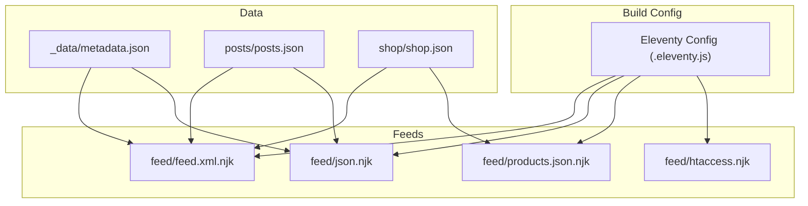
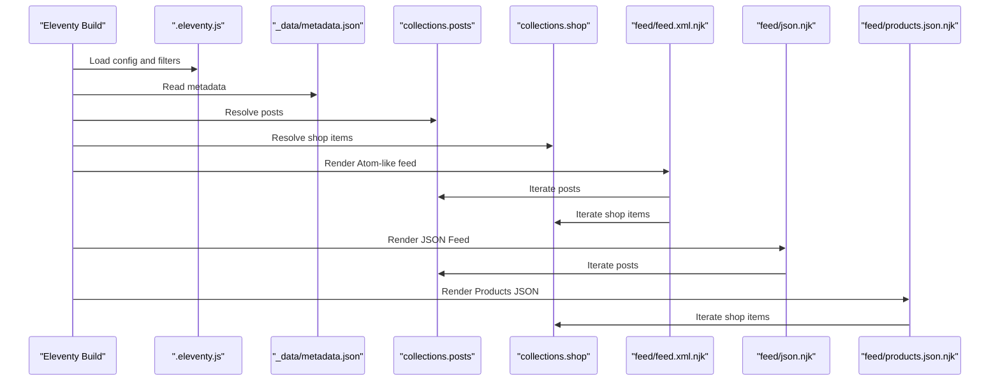
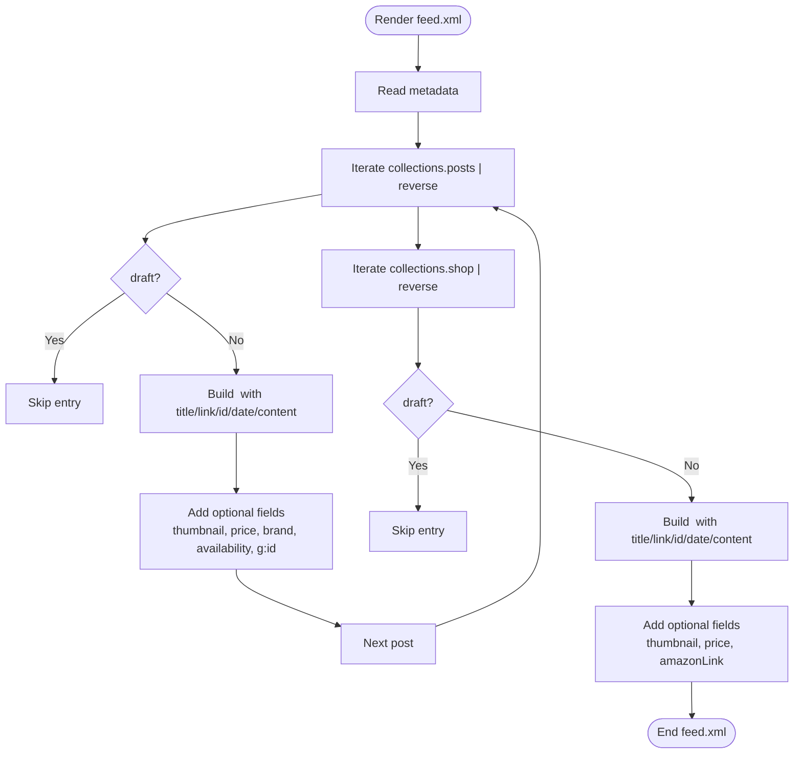
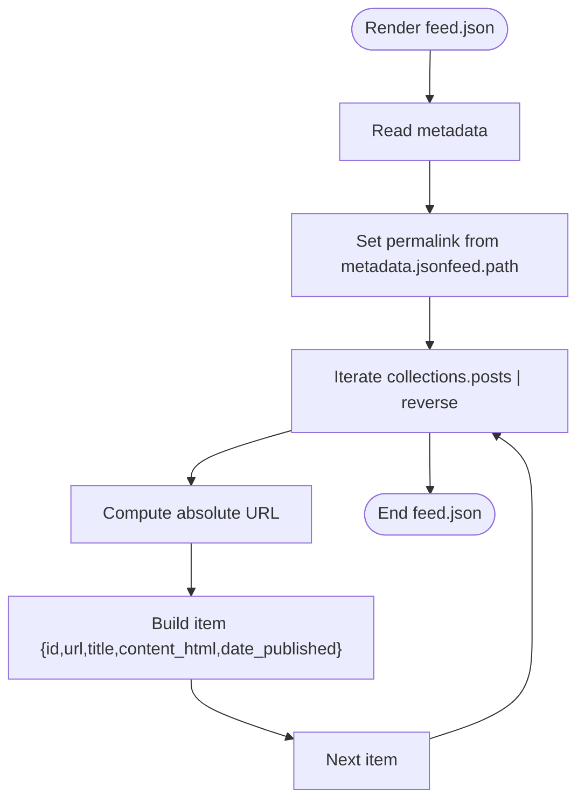
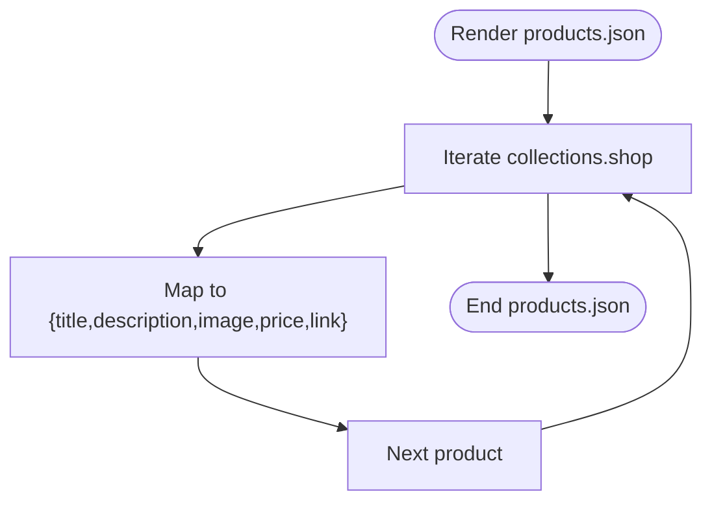
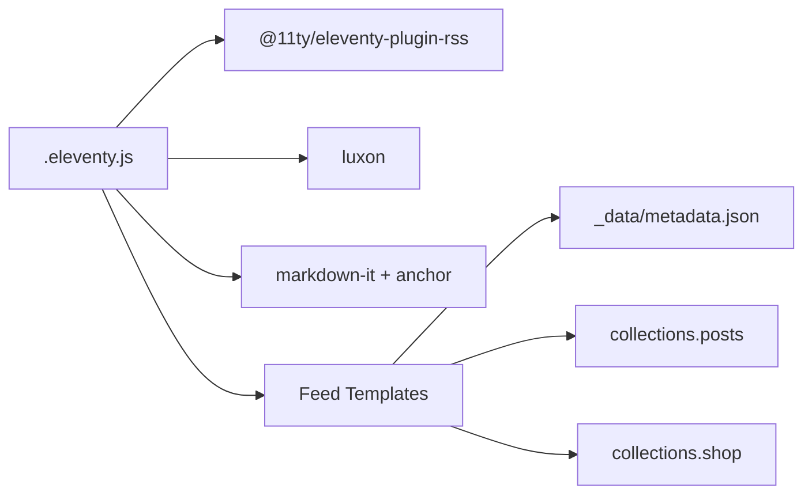

# Feed Generation System

<cite>
**Referenced Files in This Document**
- [.eleventy.js](file://.eleventy.js)
- [metadata.json](file://_data/metadata.json)
- [feed.xml.njk](file://feed/feed.xml.njk)
- [json.njk](file://feed/json.njk)
- [products.json.njk](file://feed/products.json.njk)
- [htaccess.njk](file://feed/htaccess.njk)
- [posts.json](file://posts/posts.json)
- [shop.json](file://shop/shop.json)
</cite>

## Table of Contents
1. [Introduction](#introduction)
2. [Project Structure](#project-structure)
3. [Core Components](#core-components)
4. [Architecture Overview](#architecture-overview)
5. [Detailed Component Analysis](#detailed-component-analysis)
6. [Dependency Analysis](#dependency-analysis)
7. [Performance Considerations](#performance-considerations)
8. [Troubleshooting Guide](#troubleshooting-guide)
9. [Conclusion](#conclusion)
10. [Appendices](#appendices)

## Introduction
This document explains the feed generation system that transforms Eleventy collections into structured data feeds. It covers:
- JSON Feed for blog posts
- Atom/RSS-style XML feed combining posts and products
- Custom JSON endpoint for product listings
- Nunjucks template processing, data filtering, and output formatting
- Feed structure schemas, permalink configuration, and collection integration patterns
- Examples for creating custom feeds and optimizing performance for large datasets

The system uses Eleventy’s Nunjucks templates to iterate over collections (posts and shop items), apply filters for date formatting and content sanitization, and emit standardized feed outputs at configured permalinks.

## Project Structure
Feed-related files are located under the feed directory and rely on global metadata and Eleventy collections. The build configuration wires up plugins, filters, and passthrough behavior.

**Diagram sources**
- [.eleventy.js:1-160](file://.eleventy.js#L1-L160)
- [metadata.json:1-47](file://_data/metadata.json#L1-L47)
- [feed.xml.njk:1-63](file://feed/feed.xml.njk#L1-L63)
- [json.njk:1-33](file://feed/json.njk#L1-L33)
- [products.json.njk:1-17](file://feed/products.json.njk#L1-L17)
- [htaccess.njk:1-6](file://feed/htaccess.njk#L1-L6)
- [posts.json:1-6](file://posts/posts.json#L1-L6)
- [shop.json:1-4](file://shop/shop.json#L1-L4)

**Section sources**
- [.eleventy.js:1-160](file://.eleventy.js#L1-L160)
- [metadata.json:1-47](file://_data/metadata.json#L1-L47)
- [feed.xml.njk:1-63](file://feed/feed.xml.njk#L1-L63)
- [json.njk:1-33](file://feed/json.njk#L1-L33)
- [products.json.njk:1-17](file://feed/products.json.njk#L1-L17)
- [htaccess.njk:1-6](file://feed/htaccess.njk#L1-L6)
- [posts.json:1-6](file://posts/posts.json#L1-L6)
- [shop.json:1-4](file://shop/shop.json#L1-L4)

## Core Components
- Eleventy configuration: registers RSS plugin, adds global site URL, defines date and utility filters, sets markdown library, and configures directories.
- Metadata: centralizes feed paths, titles, author info, and language settings used by all feed templates.
- Feed templates:
  - Atom-style XML feed combining posts and shop entries.
  - JSON Feed for posts with HTML content and publication dates.
  - Products JSON endpoint enumerating shop items.
- Collection integration:
  - Posts collection driven by Markdown files tagged via posts.json.
  - Shop collection driven by product Markdown files tagged via shop.json.

Key responsibilities:
- Data filtering: date formatting, safe slug generation, tag filtering, XML encoding, and string sanitization.
- Output formatting: strict adherence to JSON Feed spec and Atom schema conventions.
- Permalink configuration: static URLs for feeds and optional Apache DirectoryIndex behavior.

**Section sources**
- [.eleventy.js:1-160](file://.eleventy.js#L1-L160)
- [metadata.json:1-47](file://_data/metadata.json#L1-L47)
- [feed.xml.njk:1-63](file://feed/feed.xml.njk#L1-L63)
- [json.njk:1-33](file://feed/json.njk#L1-L33)
- [products.json.njk:1-17](file://feed/products.json.njk#L1-L17)
- [posts.json:1-6](file://posts/posts.json#L1-L6)
- [shop.json:1-4](file://shop/shop.json#L1-L4)

## Architecture Overview
The feed system is a set of Nunjucks templates that consume Eleventy collections and metadata to produce static feed artifacts. The build process renders these templates once per build, producing:
- /feed/feed.xml (Atom-like feed)
- /feed/feed.json (JSON Feed)
- /products.json (Products JSON)
- Optional Apache DirectoryIndex configuration for /feed/

**Diagram sources**
- [.eleventy.js:1-160](file://.eleventy.js#L1-L160)
- [metadata.json:1-47](file://_data/metadata.json#L1-L47)
- [feed.xml.njk:1-63](file://feed/feed.xml.njk#L1-L63)
- [json.njk:1-33](file://feed/json.njk#L1-L33)
- [products.json.njk:1-17](file://feed/products.json.njk#L1-L17)

## Detailed Component Analysis

### Atom-like XML Feed (feed/feed.xml.njk)
Purpose:
- Produces an Atom-compatible feed that includes both blog posts and shop items.
- Uses metadata for title, subtitle, author, and links.
- Applies draft filtering and formats dates using htmlDateString filter.
- Encodes content safely with xmlEncode and strips tags from descriptions.

Key behaviors:
- Iterates collections.posts and collections.shop in reverse chronological order.
- Skips draft items based on frontmatter flag.
- Includes optional media thumbnails, price, brand, availability, and identifiers when present.

Permalink:
- Outputs to /feed/feed.xml.

Schema highlights:
- Root elements include title, subtitle, link, updated, id, author.
- Entries include title, link, id, updated, content, optional media thumbnail, price, brand, availability, category, and optional identifiers.

**Diagram sources**
- [feed.xml.njk:1-63](file://feed/feed.xml.njk#L1-L63)
- [.eleventy.js:30-32](file://.eleventy.js#L30-L32)
- [.eleventy.js:135-143](file://.eleventy.js#L135-L143)

**Section sources**
- [feed.xml.njk:1-63](file://feed/feed.xml.njk#L1-L63)
- [.eleventy.js:30-32](file://.eleventy.js#L30-L32)
- [.eleventy.js:135-143](file://.eleventy.js#L135-L143)

### JSON Feed (feed/json.njk)
Purpose:
- Generates a JSON Feed compliant with version 1.1.
- Uses metadata for feed-level properties (title, language, home_page_url, feed_url, description, author).
- Iterates collections.posts to create items with id, url, title, content_html, and date_published.

Key behaviors:
- Builds absolute URLs using url and absoluteUrl filters combined with metadata.url.
- Dumps templateContent safely for content_html.
- Formats dates using rssDate filter.

Permalink:
- Dynamically set from metadata.jsonfeed.path.

Schema highlights:
- Top-level keys: version, title, language, home_page_url, feed_url, description, author, items[].
- Item keys: id, url, title, content_html, date_published.

**Diagram sources**
- [json.njk:1-33](file://feed/json.njk#L1-L33)
- [metadata.json:17-20](file://_data/metadata.json#L17-L20)

**Section sources**
- [json.njk:1-33](file://feed/json.njk#L1-L33)
- [metadata.json:17-20](file://_data/metadata.json#L17-L20)

### Products JSON Endpoint (feed/products.json.njk)
Purpose:
- Exposes a simple JSON array of products for external consumption or integrations.

Key behaviors:
- Iterates collections.shop and maps each item to a minimal product object with title, description, image, price, and link.
- Strips tags and encodes content for safe JSON/XML contexts.

Permalink:
- Fixed to /products.json.

Schema highlights:
- Root key: products[]
- Product keys: title, description, image, price, link

**Diagram sources**
- [products.json.njk:1-17](file://feed/products.json.njk#L1-L17)

**Section sources**
- [products.json.njk:1-17](file://feed/products.json.njk#L1-L17)

### Apache DirectoryIndex (feed/htaccess.njk)
Purpose:
- Configures Apache to serve the default filename when browsing /feed/.

Behavior:
- Sets DirectoryIndex to the filename defined in metadata.

Permalink:
- Outputs to feed/.htaccess.

**Section sources**
- [htaccess.njk:1-6](file://feed/htaccess.njk#L1-L6)
- [metadata.json:11-16](file://_data/metadata.json#L11-L16)

### Eleventy Configuration and Filters (.eleventy.js)
Responsibilities:
- Registers RSS plugin and other utilities.
- Adds global site URL for absolute link generation.
- Defines filters used by feeds:
  - readableDate: human-readable UTC date format.
  - htmlDateString: yyyy-LL-dd for Atom timestamps.
  - isoDateTime: ISO 8601 with timezone.
  - head: array slicing helper.
  - min: numeric minimum helper.
  - safeSlug: sanitized slug generator.
  - filterTagList: excludes internal tags.
  - sanitize: basic string cleanup.
  - xmlEncode: escapes special characters for XML.
- Configures markdown-it with anchor support.
- Sets passthrough copy for assets and feed directory.
- Defines directory layout.

Relevance to feeds:
- htmlDateString and xmlEncode directly impact feed timestamp and content safety.
- Global site.url ensures absolute URLs in feeds.
- Passthrough copy ensures feed templates render correctly.

**Section sources**
- [.eleventy.js:1-160](file://.eleventy.js#L1-L160)

### Collections and Tagging (posts.json, shop.json)
- posts.json assigns the “posts” tag to the posts collection.
- shop.json assigns the “shops” tag to the shop collection.
- These tags enable Eleventy to group content into collections used by feed templates.

**Section sources**
- [posts.json:1-6](file://posts/posts.json#L1-L6)
- [shop.json:1-4](file://shop/shop.json#L1-L4)

## Dependency Analysis
The feed system depends on:
- Eleventy core and plugins (RSS, navigation, syntax highlight).
- Luxon for date formatting.
- Markdown-it and markdown-it-anchor for content rendering.
- Centralized metadata for feed-level configuration.
- Collections generated from tagged Markdown files.

**Diagram sources**
- [.eleventy.js:1-160](file://.eleventy.js#L1-L160)
- [metadata.json:1-47](file://_data/metadata.json#L1-L47)
- [feed.xml.njk:1-63](file://feed/feed.xml.njk#L1-L63)
- [json.njk:1-33](file://feed/json.njk#L1-L33)
- [products.json.njk:1-17](file://feed/products.json.njk#L1-L17)

**Section sources**
- [.eleventy.js:1-160](file://.eleventy.js#L1-L160)
- [metadata.json:1-47](file://_data/metadata.json#L1-L47)

## Performance Considerations
Optimizations for large datasets:
- Limit iteration scope:
  - Use head filter to cap the number of items in feeds.
  - Apply additional filters to exclude drafts and unpublish items early.
- Reduce payload size:
  - For JSON Feed, consider omitting full content_html for large posts; provide summaries instead.
  - For products JSON, limit fields to essentials and avoid heavy images in description.
- Precompute derived data:
  - Create dedicated data files for aggregated lists if needed.
- Caching strategies:
  - Serve feeds via CDN caching headers at your hosting layer.
- Template efficiency:
  - Avoid expensive operations inside loops; precompute values outside iterations where possible.
- Asset handling:
  - Ensure images referenced in feeds are optimized and served efficiently.

[No sources needed since this section provides general guidance]

## Troubleshooting Guide
Common issues and resolutions:
- Missing rssDate filter error:
  - Ensure the RSS plugin is registered so rssDate is available in templates.
- Incorrect absolute URLs:
  - Verify metadata.url and site.url are correct and consistent across templates.
- Invalid XML due to special characters:
  - Confirm xmlEncode is applied to content fields before inclusion in XML.
- Draft items appearing in feeds:
  - Check draft flags in frontmatter and ensure conditional logic skips drafts.
- Empty or malformed JSON:
  - Validate JSON structure and ensure proper comma handling between items.
- Apache DirectoryIndex not working:
  - Confirm htaccess.njk is copied and metadata.feed.filename matches the actual file name.

**Section sources**
- [.eleventy.js:11-13](file://.eleventy.js#L11-L13)
- [.eleventy.js:135-143](file://.eleventy.js#L135-L143)
- [metadata.json:1-47](file://_data/metadata.json#L1-L47)
- [feed.xml.njk:1-63](file://feed/feed.xml.njk#L1-L63)
- [json.njk:1-33](file://feed/json.njk#L1-L33)
- [htaccess.njk:1-6](file://feed/htaccess.njk#L1-L6)

## Conclusion
The feed generation system leverages Eleventy’s Nunjucks templates and collections to produce standardized feeds for both content and products. With centralized metadata, robust filtering, and clear permalink configuration, it offers a flexible foundation for extending feeds, adding new endpoints, and scaling to larger datasets through targeted optimizations.

[No sources needed since this section summarizes without analyzing specific files]

## Appendices

### Creating a Custom Feed
Steps:
- Add a new Nunjucks template under feed/ with a permalink and eleventyExcludeFromCollections flag.
- Reference collections and metadata to build your desired schema.
- Apply filters for date formatting and content sanitization.
- Test locally and verify output structure.

Example pattern references:
- Permalink and exclusion pattern: see feed/xml and json templates.
- Collection iteration and draft filtering: see feed/xml template.
- Absolute URL construction: see json feed template.

**Section sources**
- [feed.xml.njk:1-63](file://feed/feed.xml.njk#L1-L63)
- [json.njk:1-33](file://feed/json.njk#L1-L33)

### Feed Schemas Summary
- JSON Feed:
  - Version: https://jsonfeed.org/version/1.1
  - Items include id, url, title, content_html, date_published.
- Atom-like XML:
  - Root includes title, subtitle, link, updated, id, author.
  - Entries include title, link, id, updated, content, optional media, price, brand, availability, category, identifiers.
- Products JSON:
  - Root key: products[]
  - Product keys: title, description, image, price, link

**Section sources**
- [json.njk:1-33](file://feed/json.njk#L1-L33)
- [feed.xml.njk:1-63](file://feed/feed.xml.njk#L1-L63)
- [products.json.njk:1-17](file://feed/products.json.njk#L1-L17)