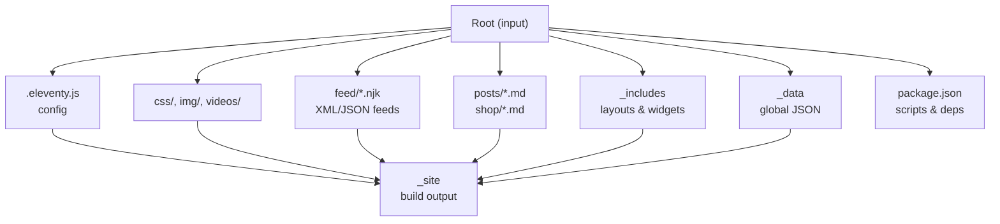
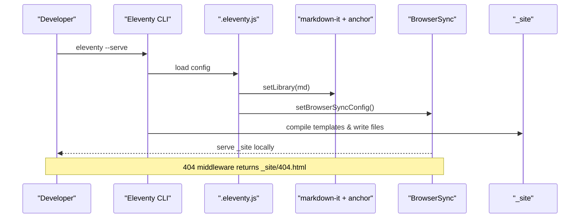
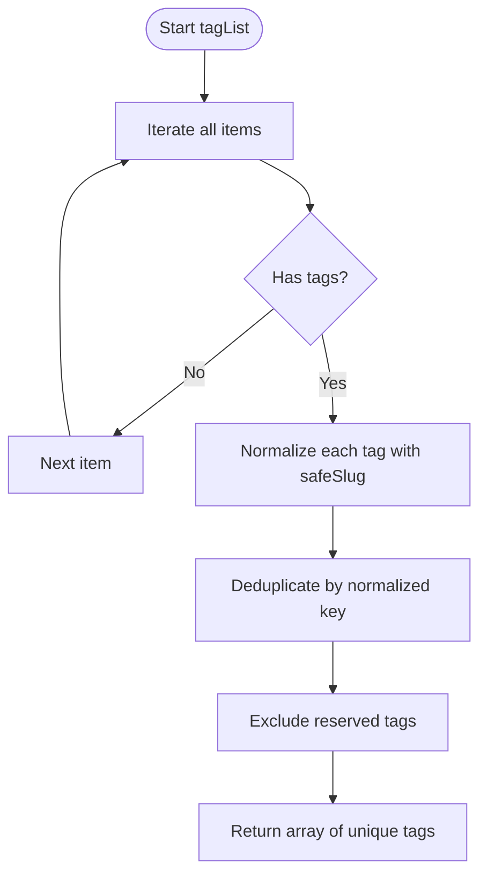
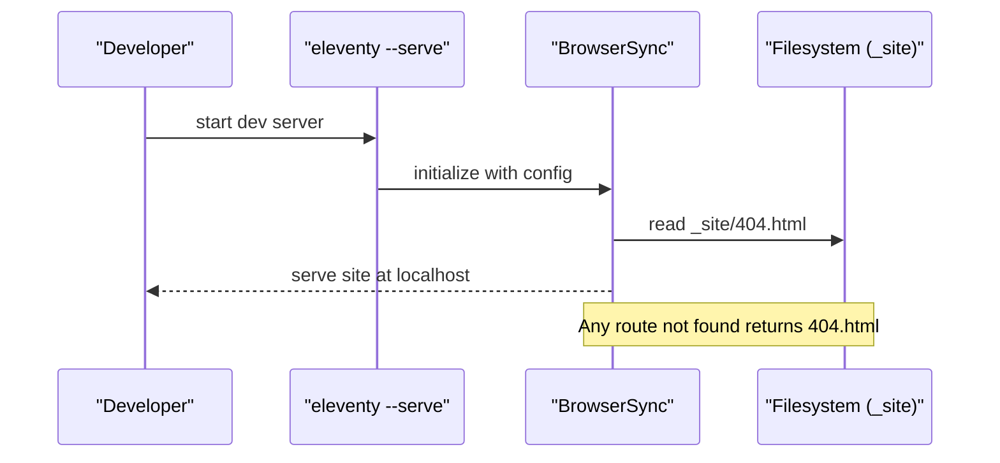
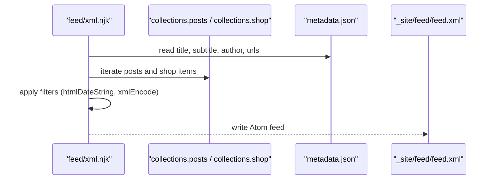
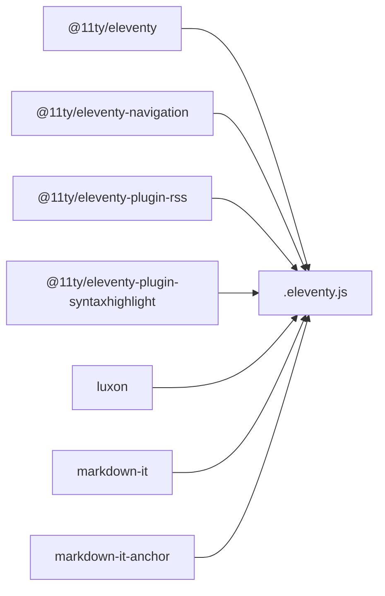

# Eleventy Configuration and Setup

<cite>
**Referenced Files in This Document**
- [.eleventy.js](file://.eleventy.js)
- [package.json](file://package.json)
- [_data/metadata.json](file://_data/metadata.json)
- [_data/home.json](file://_data/home.json)
- [_data/widget.json](file://_data/widget.json)
- [_includes/layouts/base.njk](file://_includes/layouts/base.njk)
- [_includes/layouts/post.njk](file://_includes/layouts/post.njk)
- [_includes/layouts/shop.njk](file://_includes/layouts/shop.njk)
- [feed/feed.xml.njk](file://feed/feed.xml.njk)
- [feed/json.njk](file://feed/json.njk)
</cite>

## Table of Contents
1. Introduction
2. Project Structure
3. Core Components
4. Architecture Overview
5. Detailed Component Analysis
6. Dependency Analysis
7. Performance Considerations
8. Troubleshooting Guide
9. Conclusion

## Introduction
This document explains the Eleventy configuration system used by the project. It covers plugin setup (RSS, syntax highlighting, navigation), global data, layout aliases, custom filters, markdown-it configuration with anchor links and HTML support, collections for tags and content organization, directory structure, template formats, passthrough copy settings, build customization, and development server configuration with BrowserSync middleware. The goal is to provide a clear, progressive guide for both new and experienced users.

## Project Structure
The site follows a conventional Eleventy layout:
- Root-level templates and pages are compiled into _site.
- Shared layouts and partials live under _includes.
- Global data lives under _data.
- Static assets (images, CSS, videos) are copied via passthrough copy.
- Feeds are generated from templates under feed/.

**Diagram sources**
- [.eleventy.js:146-158](file://.eleventy.js#L146-L158)
- [package.json:5-11](file://package.json#L5-L11)

**Section sources**
- [.eleventy.js:146-158](file://.eleventy.js#L146-L158)
- [package.json:5-11](file://package.json#L5-L11)

## Core Components
- Plugins: RSS, syntax highlighting, navigation.
- Global data: site.url and metadata.
- Layout aliases: post and shop map to specific layouts.
- Custom filters: date formatting, head/min helpers, safe slug, tag filtering, sanitization, XML encoding.
- Collections: tagList for unique tags; posts and shop collections driven by frontmatter tags.
- Markdown library: markdown-it with HTML enabled and anchor links.
- Passthrough copy: images, CSS, robots.txt, feed, videos.
- Build options: template formats, path prefix, engine selections, directory mapping.
- Dev server: BrowserSync with a 404 middleware hook.

**Section sources**
- [.eleventy.js:10-19](file://.eleventy.js#L10-L19)
- [.eleventy.js:21-23](file://.eleventy.js#L21-L23)
- [.eleventy.js:25-70](file://.eleventy.js#L25-L70)
- [.eleventy.js:72-95](file://.eleventy.js#L72-L95)
- [.eleventy.js:99-104](file://.eleventy.js#L99-L104)
- [.eleventy.js:106-116](file://.eleventy.js#L106-L116)
- [.eleventy.js:118-132](file://.eleventy.js#L118-L132)
- [.eleventy.js:134-143](file://.eleventy.js#L134-L143)
- [.eleventy.js:146-158](file://.eleventy.js#L146-L158)

## Architecture Overview
High-level flow: Eleventy reads .eleventy.js, loads plugins and data, compiles templates using configured engines, generates collections, applies filters, and writes static files to _site. During development, BrowserSync serves _site and injects a 404 handler.

**Diagram sources**
- [.eleventy.js:106-116](file://.eleventy.js#L106-L116)
- [.eleventy.js:118-132](file://.eleventy.js#L118-L132)
- [.eleventy.js:146-158](file://.eleventy.js#L146-L158)

## Detailed Component Analysis

### Main Configuration File (.eleventy.js)
Responsibilities:
- Plugin registration: RSS, syntax highlight, navigation.
- Global data: site.url.
- Deep merge for data.
- Layout aliases: post -> layouts/post.njk, shop -> layouts/shop.njk.
- Filters: readableDate, htmlDateString, isoDateTime, head, min, safeSlug, filterTagList, sanitize, xmlEncode.
- Collections: tagList derived from all items’ tags.
- Passthrough copy: img, css, robots.txt, feed, videos.
- Markdown library: markdown-it with HTML and anchors.
- BrowserSync: ready callback adds 404 middleware reading _site/404.html.
- Build options: templateFormats, pathPrefix, engines, dir mapping.

Key behaviors:
- safeSlug uses Eleventy’s built-in slug filter then normalizes characters for filesystem safety.
- tagList deduplicates tags using safeSlug keys and excludes reserved tags.
- xmlEncode ensures safe content in XML feeds.

**Section sources**
- [.eleventy.js:10-19](file://.eleventy.js#L10-L19)
- [.eleventy.js:21-23](file://.eleventy.js#L21-L23)
- [.eleventy.js:25-70](file://.eleventy.js#L25-L70)
- [.eleventy.js:72-95](file://.eleventy.js#L72-L95)
- [.eleventy.js:99-104](file://.eleventy.js#L99-L104)
- [.eleventy.js:106-116](file://.eleventy.js#L106-L116)
- [.eleventy.js:118-132](file://.eleventy.js#L118-L132)
- [.eleventy.js:134-143](file://.eleventy.js#L134-L143)
- [.eleventy.js:146-158](file://.eleventy.js#L146-L158)

### Global Data and Metadata
- metadata.json provides site-wide information including title, description, URLs, author, and feed paths.
- home.json and widget.json supply UI strings and assets for the homepage and widgets.
- site.url is also defined globally in .eleventy.js for absolute URL generation.

Usage examples:
- Feed templates reference metadata fields for titles, authors, and feed URLs.
- Templates can access metadata.* and site.url directly.

**Section sources**
- [_data/metadata.json:1-27](file://_data/metadata.json#L1-L27)
- [_data/home.json:1-12](file://_data/home.json#L1-L12)
- [_data/widget.json:1-7](file://_data/widget.json#L1-L7)
- [.eleventy.js:15-16](file://.eleventy.js#L15-L16)

### Layout Aliases and Template Engines
- Layout aliases simplify referencing layouts:
  - post -> layouts/post.njk
  - shop -> layouts/shop.njk
- Base layout composes reusable widgets (head, navbar, content, footer).
- Post and shop layouts extend base and include feature-specific sections.

Template engine configuration:
- markdownTemplateEngine: njk
- htmlTemplateEngine: njk
- dataTemplateEngine: false
- templateFormats: md, njk, html, liquid

**Section sources**
- [.eleventy.js:21-23](file://.eleventy.js#L21-L23)
- [.eleventy.js:146-158](file://.eleventy.js#L146-L158)
- [_includes/layouts/base.njk:1-4](file://_includes/layouts/base.njk#L1-L4)
- [_includes/layouts/post.njk:1-6](file://_includes/layouts/post.njk#L1-L6)
- [_includes/layouts/shop.njk:1-5](file://_includes/layouts/shop.njk#L1-L5)

### Custom Filters
Implemented filters:
- Date formatting: readableDate, htmlDateString, isoDateTime.
- Array helpers: head, min.
- Slug normalization: safeSlug (uses built-in slug then cleans unsafe characters).
- Tag filtering: filterTagList removes reserved tags.
- Sanitization: sanitize replaces quotes and collapses whitespace.
- XML encoding: xmlEncode escapes special characters for XML.

Example usage patterns:
- Dates in feeds use htmlDateString or rssDate.
- Safe slugs ensure stable permalinks across platforms.
- xmlEncode protects feed content.

**Section sources**
- [.eleventy.js:25-70](file://.eleventy.js#L25-L70)
- [.eleventy.js:134-143](file://.eleventy.js#L134-L143)

### Collections System
- tagList collection:
  - Iterates all items, collects tags, normalizes via safeSlug, deduplicates, and excludes reserved tags.
- Built-in collections:
  - posts and shop are created automatically based on frontmatter tags in posts/*.md and shop/*.md.
  - Feed templates iterate collections.posts and collections.shop.

**Diagram sources**
- [.eleventy.js:72-95](file://.eleventy.js#L72-L95)

**Section sources**
- [.eleventy.js:72-95](file://.eleventy.js#L72-L95)
- [feed/feed.xml.njk:18-40](file://feed/feed.xml.njk#L18-L40)
- [feed/feed.xml.njk:42-62](file://feed/feed.xml.njk#L42-L62)

### Markdown-it Configuration
- Enabled HTML parsing and line breaks.
- linkify enabled for auto-linking URLs.
- markdown-it-anchor configured with permalink anchors and styling class.

Impact:
- Content supports inline HTML and automatic links.
- Headings get anchor links for deep linking.

**Section sources**
- [.eleventy.js:106-116](file://.eleventy.js#L106-L116)

### Directory Structure and Passthrough Copy
- Input root maps to current directory.
- Includes directory: _includes.
- Data directory: _data.
- Output directory: _site.
- Passthrough copy includes: img, css, robots.txt, feed, videos.

Result:
- Static assets and feed templates are copied verbatim to _site.

**Section sources**
- [.eleventy.js:99-104](file://.eleventy.js#L99-L104)
- [.eleventy.js:146-158](file://.eleventy.js#L146-L158)

### Build Process and Development Server
- Scripts:
  - build: runs Eleventy.
  - watch: incremental rebuild.
  - serve/start: local dev server.
  - debug: verbose logging.
- BrowserSync:
  - Adds a middleware that serves _site/404.html for unmatched routes during development.
  - UI disabled and ghost mode off for single-user dev.

**Diagram sources**
- [.eleventy.js:118-132](file://.eleventy.js#L118-L132)
- [package.json:5-11](file://package.json#L5-L11)

**Section sources**
- [.eleventy.js:118-132](file://.eleventy.js#L118-L132)
- [package.json:5-11](file://package.json#L5-L11)

### Feeds and Data Integration
- Atom feed (feed.xml.njk):
  - Uses metadata for title, subtitle, author, and URLs.
  - Iterates collections.posts and collections.shop to generate entries.
  - Applies xmlEncode for safe content.
- JSON Feed (json.njk):
  - Uses metadata for feed URLs and author info.
  - Iterates collections.posts and builds items with published dates.

**Diagram sources**
- [feed/feed.xml.njk:1-63](file://feed/feed.xml.njk#L1-L63)
- [_data/metadata.json:1-27](file://_data/metadata.json#L1-L27)

**Section sources**
- [feed/feed.xml.njk:1-63](file://feed/feed.xml.njk#L1-L63)
- [feed/json.njk:1-33](file://feed/json.njk#L1-L33)
- [_data/metadata.json:1-27](file://_data/metadata.json#L1-L27)

## Dependency Analysis
External dependencies relevant to configuration:
- @11ty/eleventy: core generator.
- @11ty/eleventy-navigation: navigation helper.
- @11ty/eleventy-plugin-rss: RSS utilities.
- @11ty/eleventy-plugin-syntaxhighlight: code highlighting.
- luxon: date/time formatting.
- markdown-it and markdown-it-anchor: markdown processing.

**Diagram sources**
- [package.json:24-32](file://package.json#L24-L32)
- [.eleventy.js:1-8](file://.eleventy.js#L1-L8)

**Section sources**
- [package.json:24-32](file://package.json#L24-L32)
- [.eleventy.js:1-8](file://.eleventy.js#L1-L8)

## Performance Considerations
- Prefer minimal passthrough copies to reduce build size.
- Use collections judiciously; large datasets may increase build time.
- Keep markdown-it plugins limited to what you need.
- Avoid heavy synchronous operations in filters; consider caching if necessary.
- For large sites, leverage incremental builds and watch mode during development.

[No sources needed since this section provides general guidance]

## Troubleshooting Guide
Common issues and resolutions:
- 404 handling in development:
  - Ensure _site/404.html exists before starting the dev server so BrowserSync can read it.
  - Verify BrowserSync middleware is registered and not overridden elsewhere.
- Anchor links missing:
  - Confirm markdown-it-anchor is applied and headings exist in content.
- Tags not appearing in tagList:
  - Check that items have tags in frontmatter and that they are not filtered out by reserved names.
- Feed errors:
  - Validate xmlEncode usage and ensure required metadata fields exist.
  - Confirm collections.posts and collections.shop contain expected items.

**Section sources**
- [.eleventy.js:118-132](file://.eleventy.js#L118-L132)
- [.eleventy.js:106-116](file://.eleventy.js#L106-L116)
- [.eleventy.js:72-95](file://.eleventy.js#L72-L95)
- [feed/feed.xml.njk:1-63](file://feed/feed.xml.njk#L1-L63)

## Conclusion
The Eleventy configuration centralizes plugins, data, filters, collections, and build behavior in a single file while keeping content and templates organized. With robust date handling, safe slug generation, and comprehensive feed support, the setup scales well for blogs and product catalogs. The development server integrates seamlessly with BrowserSync, providing a smooth local workflow.