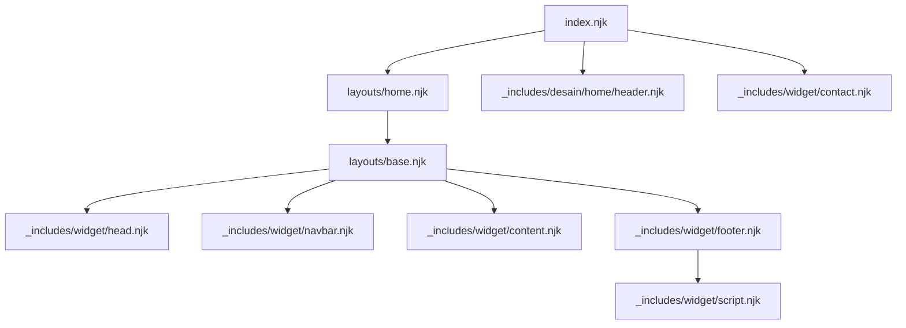
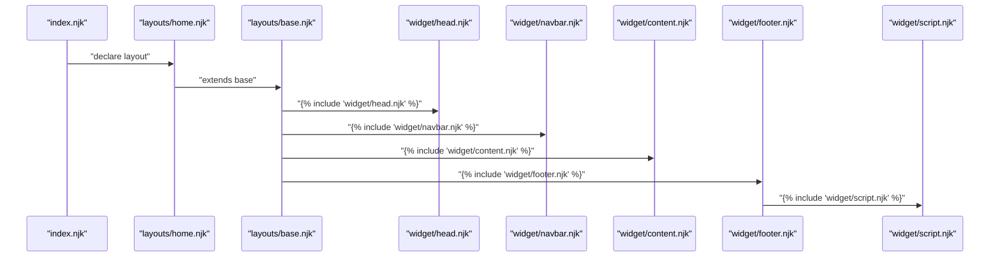
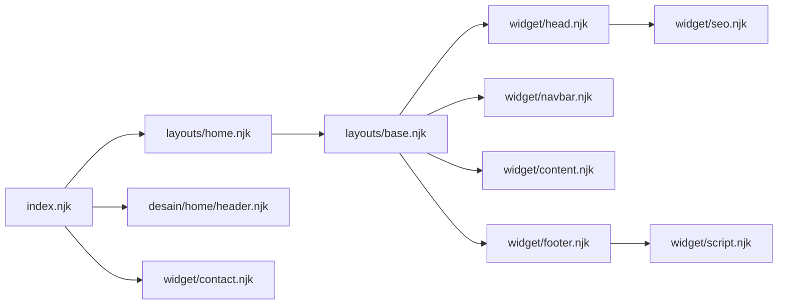

# Component Architecture and Includes

<cite>
**Referenced Files in This Document**
- [index.njk](file://index.njk)
- [base.njk](file://_includes/layouts/base.njk)
- [home.njk](file://_includes/layouts/home.njk)
- [page.njk](file://_includes/layouts/page.njk)
- [head.njk](file://_includes/widget/head.njk)
- [navbar.njk](file://_includes/widget/navbar.njk)
- [content.njk](file://_includes/widget/content.njk)
- [footer.njk](file://_includes/widget/footer.njk)
- [script.njk](file://_includes/widget/script.njk)
- [seo.njk](file://_includes/widget/seo.njk)
- [contact.njk](file://_includes/widget/contact.njk)
- [tag.njk](file://_includes/widget/tag.njk)
- [sitemap.njk](file://_includes/widget/sitemap.njk)
- [header.njk](file://_includes/desain/home/header.njk)
- [template.njk](file://_includes/desain/themes/template.njk)
- [metadata.json](file://_data/metadata.json)
</cite>

## Table of Contents
1. Introduction
2. Project Structure
3. Core Components
4. Architecture Overview
5. Detailed Component Analysis
6. Dependency Analysis
7. Performance Considerations
8. Troubleshooting Guide
9. Conclusion

## Introduction
This document explains the component-based architecture built with Nunjucks includes in this Eleventy project. It focuses on how the _includes/widget directory provides reusable building blocks such as head, navbar, content, footer, and script widgets. You will learn:
- How to include components and pass parameters between them
- How components remain independent while sharing common functionality
- How to create custom components and manage dependencies
- The modular design principles and reusability patterns used across the template system

The goal is to make it easy for both new and experienced contributors to understand, extend, and maintain the template system without breaking existing behavior.

## Project Structure
At a high level, the site composes pages from layout templates that include reusable widgets. Widgets encapsulate concerns like HTML head, navigation, page content rendering, footer, and scripts. Theme-specific UI fragments live under _includes/desain and are included by pages or layouts.

**Diagram sources**
- [index.njk:1-47](file://index.njk#L1-L47)
- [home.njk:1-5](file://_includes/layouts/home.njk#L1-L5)
- [base.njk:1-62](file://_includes/layouts/base.njk#L1-L62)
- [head.njk:1-114](file://_includes/widget/head.njk#L1-L114)
- [navbar.njk:1-37](file://_includes/widget/navbar.njk#L1-L37)
- [content.njk:1-1](file://_includes/widget/content.njk#L1-L1)
- [footer.njk:1-100](file://_includes/widget/footer.njk#L1-L100)
- [script.njk:1-3](file://_includes/widget/script.njk#L1-L3)
- [header.njk:1-22](file://_includes/desain/home/header.njk#L1-L22)
- [contact.njk:1-8](file://_includes/widget/contact.njk#L1-L8)

**Section sources**
- [index.njk:1-47](file://index.njk#L1-L47)
- [home.njk:1-5](file://_includes/layouts/home.njk#L1-L5)
- [base.njk:1-62](file://_includes/layouts/base.njk#L1-L62)

## Core Components
The widget layer defines the core building blocks:
- Head: Provides document head markup, SEO metadata inclusion, preloads, analytics, and dynamic script injection.
- Navbar: Renders responsive navigation and search input with client-side filtering.
- Content: Renders the page’s main content safely.
- Footer: Contains branding, links, policies, social icons, and includes the global script widget.
- Script: Loads Bootstrap JS and closes the document.

These components are composed by base layout and specialized layouts (home, page).

Key responsibilities and interactions:
- Base layout orchestrates the order of includes and injects shared client logic.
- Head includes SEO metadata and performance optimizations.
- Navbar uses Eleventy Navigation collection to render menu items.
- Footer includes the script widget to ensure scripts load once at the end.

**Section sources**
- [base.njk:1-62](file://_includes/layouts/base.njk#L1-L62)
- [head.njk:1-114](file://_includes/widget/head.njk#L1-L114)
- [navbar.njk:1-37](file://_includes/widget/navbar.njk#L1-L37)
- [content.njk:1-1](file://_includes/widget/content.njk#L1-L1)
- [footer.njk:1-100](file://_includes/widget/footer.njk#L1-L100)
- [script.njk:1-3](file://_includes/widget/script.njk#L1-L3)

## Architecture Overview
The template system follows a layered composition pattern:
- Pages declare a layout and include theme-specific fragments.
- Layouts compose global widgets in a fixed order.
- Widgets are self-contained and can be reused across pages and themes.
- Data flows via Eleventy globals (e.g., metadata), page frontmatter, and Nunjucks variables passed through includes.

**Diagram sources**
- [index.njk:1-47](file://index.njk#L1-L47)
- [home.njk:1-5](file://_includes/layouts/home.njk#L1-L5)
- [base.njk:1-62](file://_includes/layouts/base.njk#L1-L62)
- [head.njk:1-114](file://_includes/widget/head.njk#L1-L114)
- [navbar.njk:1-37](file://_includes/widget/navbar.njk#L1-L37)
- [content.njk:1-1](file://_includes/widget/content.njk#L1-L1)
- [footer.njk:1-100](file://_includes/widget/footer.njk#L1-L100)
- [script.njk:1-3](file://_includes/widget/script.njk#L1-L3)

## Detailed Component Analysis

### Head Widget
Responsibilities:
- Define doctype, language, viewport, and meta tags
- Include SEO metadata via seo.njk
- Preload critical CSS and fonts; defer non-critical resources
- Inject analytics and third-party scripts conditionally
- Provide inline styles for hero images and container utilities

Data usage:
- Reads metadata from global data (e.g., title, icon, author)
- Uses Eleventy generator and URL helpers

Performance considerations:
- Uses preload and noscript fallbacks
- Defer loading of heavy libraries until DOM ready

**Section sources**
- [head.njk:1-114](file://_includes/widget/head.njk#L1-L114)
- [seo.njk:1-254](file://_includes/widget/seo.njk#L1-L254)
- [metadata.json:1-47](file://_data/metadata.json#L1-L47)

### Navbar Widget
Responsibilities:
- Render responsive navigation bar with brand logo and shop name
- Build navigation links using Eleventy Navigation collection
- Provide a search input with an associated results dropdown

Data usage:
- Accesses metadata for branding
- Iterates over collections.all filtered by eleventyNavigation

Client behavior:
- Search input and results dropdown are wired in base layout script

**Section sources**
- [navbar.njk:1-37](file://_includes/widget/navbar.njk#L1-L37)
- [base.njk:6-62](file://_includes/layouts/base.njk#L6-L62)

### Content Widget
Responsibilities:
- Safely render the page’s main content block

Usage:
- Used by base layout to output page content provided by layouts and pages

**Section sources**
- [content.njk:1-1](file://_includes/widget/content.njk#L1-L1)

### Footer Widget
Responsibilities:
- Branding, quick links, policies, business info, social icons
- Copyright and legal notices
- Include global script widget to close the document

Data usage:
- Uses metadata for links, email, and social URLs
- Uses Eleventy Navigation collection for quick links

**Section sources**
- [footer.njk:1-100](file://_includes/widget/footer.njk#L1-L100)
- [script.njk:1-3](file://_includes/widget/script.njk#L1-L3)

### Script Widget
Responsibilities:
- Load Bootstrap bundle with integrity and crossorigin attributes
- Close body and html tags

Placement:
- Included by footer to ensure scripts run after DOM elements exist

**Section sources**
- [script.njk:1-3](file://_includes/widget/script.njk#L1-L3)

### SEO Widget
Responsibilities:
- Title and description fallbacks
- Open Graph and Twitter card metadata
- Canonical link
- Schema.org structured data for products, articles, organization, website, and breadcrumbs
- Locale and image handling based on page context

Data usage:
- Relies on page-level variables (title, description, cover, tags) and global metadata

**Section sources**
- [seo.njk:1-254](file://_includes/widget/seo.njk#L1-L254)
- [metadata.json:1-47](file://_data/metadata.json#L1-L47)

### Contact Widget
Responsibilities:
- Render a call-to-action banner using widget data keys

Parameter passing example:
- Accepts widget.help, widget.helpinfo, widget.helplink, widget.helpbtn

Usage:
- Included directly in index.njk

**Section sources**
- [contact.njk:1-8](file://_includes/widget/contact.njk#L1-L8)
- [index.njk:46-47](file://index.njk#L46-L47)

### Tag Widget
Responsibilities:
- Display a tag-specific listing and include a posts list partial

Parameter passing example:
- Expects a tag variable to drive the heading and collection selection

Usage:
- Demonstrates including other partials (postslist.njk) from within a widget

**Section sources**
- [tag.njk:1-6](file://_includes/widget/tag.njk#L1-L6)

### Sitemap Widget
Responsibilities:
- Generate sitemap.xml entries for all published pages
- Exclude excluded pages and sensitive URLs
- Set changefreq and priority based on page type

Data usage:
- Uses collections.all and page metadata

**Section sources**
- [sitemap.njk:1-22](file://_includes/widget/sitemap.njk#L1-L22)

### Theme Composition
Responsibilities:
- Compose multiple theme fragments into a single template

Usage:
- Template includes support, free, and pro theme parts

**Section sources**
- [template.njk:1-3](file://_includes/desain/themes/template.njk#L1-L3)

### Home Header Fragment
Responsibilities:
- Hero image container and headline text
- Uses metadata for title and description

Usage:
- Included by index.njk to render home-specific visuals

**Section sources**
- [header.njk:1-22](file://_includes/desain/home/header.njk#L1-L22)
- [index.njk:42-44](file://index.njk#L42-L44)

## Dependency Analysis
The following diagram shows how pages and layouts depend on widgets and theme fragments.

**Diagram sources**
- [index.njk:1-47](file://index.njk#L1-L47)
- [home.njk:1-5](file://_includes/layouts/home.njk#L1-L5)
- [base.njk:1-62](file://_includes/layouts/base.njk#L1-L62)
- [head.njk:1-114](file://_includes/widget/head.njk#L1-L114)
- [navbar.njk:1-37](file://_includes/widget/navbar.njk#L1-L37)
- [content.njk:1-1](file://_includes/widget/content.njk#L1-L1)
- [footer.njk:1-100](file://_includes/widget/footer.njk#L1-L100)
- [script.njk:1-3](file://_includes/widget/script.njk#L1-L3)
- [seo.njk:1-254](file://_includes/widget/seo.njk#L1-L254)
- [header.njk:1-22](file://_includes/desain/home/header.njk#L1-L22)
- [contact.njk:1-8](file://_includes/widget/contact.njk#L1-L8)

**Section sources**
- [index.njk:1-47](file://index.njk#L1-L47)
- [base.njk:1-62](file://_includes/layouts/base.njk#L1-L62)

## Performance Considerations
- Prefer preloading critical assets and deferring non-critical ones to improve First Contentful Paint and Time to Interactive.
- Use noscript fallbacks for styles to ensure graceful degradation.
- Keep widget boundaries clear to avoid duplicate resource loads.
- Minimize inline scripts; prefer deferred external scripts where possible.
- Avoid heavy computations in templates; offload to build-time or client-side when appropriate.

[No sources needed since this section provides general guidance]

## Troubleshooting Guide
Common issues and resolutions:
- Missing or incorrect metadata fields: Ensure metadata.json contains required keys referenced by widgets (e.g., title, icon, url).
- Duplicate script loads: Verify that script.njk is only included once (via footer) and not duplicated elsewhere.
- Search not working: Confirm that base layout script runs after DOMContentLoaded and that /products.json is available.
- SEO tags missing: Check that seo.njk is included in head and that page-level variables (title, description, cover, tags) are set.
- Navigation links not rendering: Ensure pages have eleventyNavigation frontmatter so they appear in collections.all | eleventyNavigation.

**Section sources**
- [base.njk:6-62](file://_includes/layouts/base.njk#L6-L62)
- [head.njk:1-114](file://_includes/widget/head.njk#L1-L114)
- [navbar.njk:1-37](file://_includes/widget/navbar.njk#L1-L37)
- [seo.njk:1-254](file://_includes/widget/seo.njk#L1-L254)
- [metadata.json:1-47](file://_data/metadata.json#L1-L47)

## Conclusion
The template system leverages a clean, modular architecture centered around reusable widgets. By composing base layout with focused components, the project achieves strong separation of concerns, predictable data flow, and high reusability. Following the patterns outlined here—clear include boundaries, explicit parameter passing, and consistent use of shared data—will help you extend the system safely and efficiently.

[No sources needed since this section summarizes without analyzing specific files]