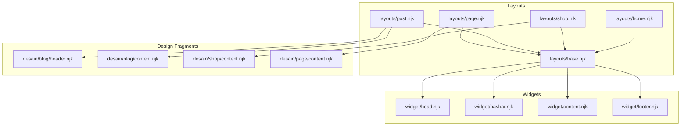
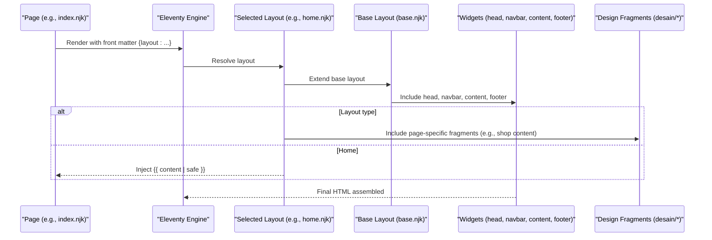
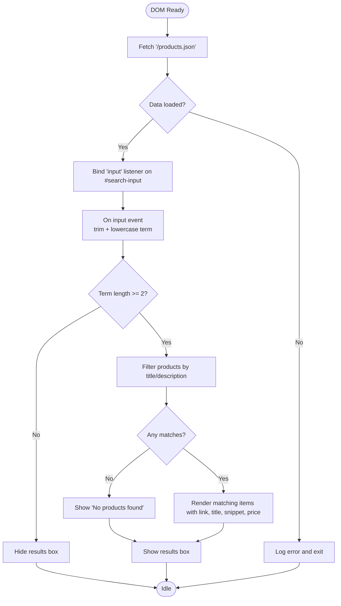
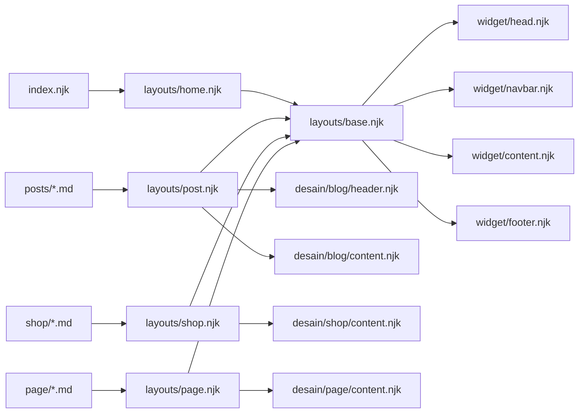

# Layout Hierarchy and Inheritance

<cite>
**Referenced Files in This Document**
- [base.njk](file://_includes/layouts/base.njk)
- [home.njk](file://_includes/layouts/home.njk)
- [shop.njk](file://_includes/layouts/shop.njk)
- [post.njk](file://_includes/layouts/post.njk)
- [page.njk](file://_includes/layouts/page.njk)
- [head.njk](file://_includes/widget/head.njk)
- [navbar.njk](file://_includes/widget/navbar.njk)
- [content.njk](file://_includes/widget/content.njk)
- [footer.njk](file://_includes/widget/footer.njk)
- [index.njk](file://index.njk)
- [blog header.njk](file://_includes/desain/blog/header.njk)
- [blog content.njk](file://_includes/desain/blog/content.njk)
- [shop content.njk](file://_includes/desain/shop/content.njk)
- [page content.njk](file://_includes/desain/page/content.njk)
</cite>

## Table of Contents
1. [Introduction](#introduction)
2. [Project Structure](#project-structure)
3. [Core Components](#core-components)
4. [Architecture Overview](#architecture-overview)
5. [Detailed Component Analysis](#detailed-component-analysis)
6. [Dependency Analysis](#dependency-analysis)
7. [Performance Considerations](#performance-considerations)
8. [Troubleshooting Guide](#troubleshooting-guide)
9. [Conclusion](#conclusion)
10. [Appendices](#appendices)

## Introduction
This document explains the layout hierarchy system used by the site’s Nunjucks templates. The root template base.njk composes shared page structure via includes, while specialized layouts home.njk, shop.njk, post.njk, and page.njk extend that foundation to render distinct page types. The project uses Eleventy’s layout mechanism with a front matter key to declare inheritance. Each specific layout composes reusable design fragments from _includes/desain/* to customize sections such as headers, galleries, and navigation, while preserving consistent global structure (head, navbar, main content area, footer).

## Project Structure
The layout system is organized under _includes/layouts for top-level templates and _includes/widget for shared shell components. Page-specific designs live under _includes/desain/<area>/*.njk. Pages reference a layout through front matter; Eleventy then renders the chosen layout, which in turn includes widgets and design fragments.

**Diagram sources**
- [base.njk:1-62](file://_includes/layouts/base.njk#L1-L62)
- [home.njk:1-5](file://_includes/layouts/home.njk#L1-L5)
- [shop.njk:1-5](file://_includes/layouts/shop.njk#L1-L5)
- [post.njk:1-6](file://_includes/layouts/post.njk#L1-L6)
- [page.njk:1-10](file://_includes/layouts/page.njk#L1-L10)
- [head.njk:1-113](file://_includes/widget/head.njk#L1-L113)
- [navbar.njk:1-37](file://_includes/widget/navbar.njk#L1-L37)
- [content.njk:1-1](file://_includes/widget/content.njk#L1-L1)
- [footer.njk:1-52](file://_includes/widget/footer.njk#L1-L52)
- [blog header.njk:1-17](file://_includes/desain/blog/header.njk#L1-L17)
- [blog content.njk:1-8](file://_includes/desain/blog/content.njk#L1-L8)
- [shop content.njk:1-120](file://_includes/desain/shop/content.njk#L1-L120)
- [page content.njk:1-6](file://_includes/desain/page/content.njk#L1-L6)

**Section sources**
- [base.njk:1-62](file://_includes/layouts/base.njk#L1-L62)
- [home.njk:1-5](file://_includes/layouts/home.njk#L1-L5)
- [shop.njk:1-5](file://_includes/layouts/shop.njk#L1-L5)
- [post.njk:1-6](file://_includes/layouts/post.njk#L1-L6)
- [page.njk:1-10](file://_includes/layouts/page.njk#L1-L10)
- [head.njk:1-113](file://_includes/widget/head.njk#L1-L113)
- [navbar.njk:1-37](file://_includes/widget/navbar.njk#L1-L37)
- [content.njk:1-1](file://_includes/widget/content.njk#L1-L1)
- [footer.njk:1-52](file://_includes/widget/footer.njk#L1-L52)
- [blog header.njk:1-17](file://_includes/desain/blog/header.njk#L1-L17)
- [blog content.njk:1-8](file://_includes/desain/blog/content.njk#L1-L8)
- [shop content.njk:1-120](file://_includes/desain/shop/content.njk#L1-L120)
- [page content.njk:1-6](file://_includes/desain/page/content.njk#L1-L6)

## Core Components
- Root layout base.njk: Composes the global shell by including head, navbar, content placeholder, and footer. It also wires client-side search behavior that consumes /products.json.
- Specialized layouts:
  - home.njk: Extends base and injects page content directly.
  - shop.njk: Extends base and includes a product-focused content fragment.
  - post.njk: Extends base and includes blog header and content fragments.
  - page.njk: Extends base and includes a generic page content fragment.
- Widgets:
  - widget/head.njk: HTML <html>, <head>, SEO, fonts, CSS/JS preloads, analytics, and opens <body>.
  - widget/navbar.njk: Top navigation with menu links and a search input.
  - widget/content.njk: Placeholder that renders {{ content | safe }}.
  - widget/footer.njk: Footer markup and script include.

How inheritance works in this project:
- Eleventy reads a front matter key named layout on each page or layout file.
- The value points to another layout file path.
- At build time, Eleventy wraps the current file’s rendered output into the referenced layout.
- Within layouts,  is used to compose reusable parts.

Note on block/extend syntax:
- This codebase does not use Nunjucks blocks or extends. Instead, it relies on Eleventy’s layout front matter plus Nunjucks includes for composition.

**Section sources**
- [base.njk:1-62](file://_includes/layouts/base.njk#L1-L62)
- [home.njk:1-5](file://_includes/layouts/home.njk#L1-L5)
- [shop.njk:1-5](file://_includes/layouts/shop.njk#L1-L5)
- [post.njk:1-6](file://_includes/layouts/post.njk#L1-L6)
- [page.njk:1-10](file://_includes/layouts/page.njk#L1-L10)
- [head.njk:1-113](file://_includes/widget/head.njk#L1-L113)
- [navbar.njk:1-37](file://_includes/widget/navbar.njk#L1-L37)
- [content.njk:1-1](file://_includes/widget/content.njk#L1-L1)
- [footer.njk:1-52](file://_includes/widget/footer.njk#L1-L52)

## Architecture Overview
The rendering pipeline starts from a page (for example index.njk), which declares its layout. Eleventy resolves the layout chain and includes widgets and design fragments to produce the final HTML.

**Diagram sources**
- [index.njk:1-47](file://index.njk#L1-L47)
- [home.njk:1-5](file://_includes/layouts/home.njk#L1-L5)
- [base.njk:1-62](file://_includes/layouts/base.njk#L1-L62)
- [head.njk:1-113](file://_includes/widget/head.njk#L1-L113)
- [navbar.njk:1-37](file://_includes/widget/navbar.njk#L1-L37)
- [content.njk:1-1](file://_includes/widget/content.njk#L1-L1)
- [footer.njk:1-52](file://_includes/widget/footer.njk#L1-L52)
- [shop content.njk:1-120](file://_includes/desain/shop/content.njk#L1-L120)

## Detailed Component Analysis

### Base Layout: base.njk
Responsibilities:
- Includes the global shell: head, navbar, content placeholder, and footer.
- Adds client-side search logic that fetches /products.json and populates a dropdown results list.

Key behaviors:
- Uses DOMContentLoaded to initialize search input listeners.
- Fetches products data and filters by title and description.
- Toggles visibility of a results container based on input length and click-outside behavior.

Best practices observed:
- Centralizes cross-cutting concerns (search UX) at the root level so all pages inherit it.
- Keeps UI interactions isolated in a single script block within the layout.

**Section sources**
- [base.njk:1-62](file://_includes/layouts/base.njk#L1-L62)

### Home Layout: home.njk
Responsibilities:
- Declares inheritance from base.njk.
- Renders the page’s content directly into the base shell.

Composition pattern:
- Minimal wrapper around {{ content | safe }}, allowing index.njk to include multiple design fragments (header, shop, blog, contact).

**Section sources**
- [home.njk:1-5](file://_includes/layouts/home.njk#L1-L5)
- [index.njk:1-47](file://index.njk#L1-L47)

### Shop Layout: shop.njk
Responsibilities:
- Declares inheritance from base.njk.
- Includes a product-oriented content fragment that renders title, description, cover image, features, price, tags, gallery, and CTA.

Content customization:
- Uses variables like title, description, cover, bullet_points, price, amazonLink, ecwidId, and images to drive rich product presentation.
- Integrates analytics events on buy button clicks.

**Section sources**
- [shop.njk:1-5](file://_includes/layouts/shop.njk#L1-L5)
- [shop content.njk:1-120](file://_includes/desain/shop/content.njk#L1-L120)

### Post Layout: post.njk
Responsibilities:
- Declares inheritance from base.njk.
- Includes blog header and content fragments to render article metadata, tags, cover image, and related sections.

Content customization:
- Leverages variables such as title, description, tags, cover, and date formatting helpers.
- Composes two-column layout using blog header and content fragments.

**Section sources**
- [post.njk:1-6](file://_includes/layouts/post.njk#L1-L6)
- [blog header.njk:1-17](file://_includes/desain/blog/header.njk#L1-L17)
- [blog content.njk:1-8](file://_includes/desain/blog/content.njk#L1-L8)

### Page Layout: page.njk
Responsibilities:
- Declares inheritance from base.njk.
- Includes a generic page content fragment that displays title, description, optional cover image, and body content.

Content customization:
- Simple, flexible container suitable for static informational pages.

**Section sources**
- [page.njk:1-10](file://_includes/layouts/page.njk#L1-L10)
- [page content.njk:1-6](file://_includes/desain/page/content.njk#L1-L6)

### Widget Shell: head, navbar, content, footer
- head.njk: Builds the <html> and <head>, loads styles/scripts efficiently (preload/defer), includes SEO meta, favicon, and analytics initialization.
- navbar.njk: Renders responsive navigation and a search input tied to the base layout’s search script.
- content.njk: Placeholder that outputs {{ content | safe }} where the selected layout places page content.
- footer.njk: Provides branding, navigation links, social icons, and includes scripts.

These widgets are included by base.njk, ensuring consistent structure across all pages.

**Section sources**
- [head.njk:1-113](file://_includes/widget/head.njk#L1-L113)
- [navbar.njk:1-37](file://_includes/widget/navbar.njk#L1-L37)
- [content.njk:1-1](file://_includes/widget/content.njk#L1-L1)
- [footer.njk:1-52](file://_includes/widget/footer.njk#L1-L52)

### Client-Side Search Flow
The search feature is implemented in base.njk and driven by the navbar’s input element.

**Diagram sources**
- [base.njk:1-62](file://_includes/layouts/base.njk#L1-L62)
- [navbar.njk:1-37](file://_includes/widget/navbar.njk#L1-L37)

## Dependency Analysis
The following diagram shows how layouts depend on widgets and design fragments.

**Diagram sources**
- [index.njk:1-47](file://index.njk#L1-L47)
- [home.njk:1-5](file://_includes/layouts/home.njk#L1-L5)
- [post.njk:1-6](file://_includes/layouts/post.njk#L1-L6)
- [shop.njk:1-5](file://_includes/layouts/shop.njk#L1-L5)
- [page.njk:1-10](file://_includes/layouts/page.njk#L1-L10)
- [base.njk:1-62](file://_includes/layouts/base.njk#L1-L62)
- [head.njk:1-113](file://_includes/widget/head.njk#L1-L113)
- [navbar.njk:1-37](file://_includes/widget/navbar.njk#L1-L37)
- [content.njk:1-1](file://_includes/widget/content.njk#L1-L1)
- [footer.njk:1-52](file://_includes/widget/footer.njk#L1-L52)
- [blog header.njk:1-17](file://_includes/desain/blog/header.njk#L1-L17)
- [blog content.njk:1-8](file://_includes/desain/blog/content.njk#L1-L8)
- [shop content.njk:1-120](file://_includes/desain/shop/content.njk#L1-L120)
- [page content.njk:1-6](file://_includes/desain/page/content.njk#L1-L6)

**Section sources**
- [index.njk:1-47](file://index.njk#L1-L47)
- [home.njk:1-5](file://_includes/layouts/home.njk#L1-L5)
- [post.njk:1-6](file://_includes/layouts/post.njk#L1-L6)
- [shop.njk:1-5](file://_includes/layouts/shop.njk#L1-L5)
- [page.njk:1-10](file://_includes/layouts/page.njk#L1-L10)
- [base.njk:1-62](file://_includes/layouts/base.njk#L1-L62)

## Performance Considerations
- Preloading and deferring: The head widget preloads critical CSS and defers heavy libraries (Swiper, Font Awesome) to improve perceived performance.
- Lazy loading: Images use lazy loading attributes to reduce initial payload.
- Conditional script injection: Some third-party scripts are injected only when needed, reducing unnecessary work on most pages.
- Client-side search: Filtering runs in-memory after fetching a small JSON dataset; ensure the dataset remains reasonably sized to avoid jank on low-end devices.

[No sources needed since this section provides general guidance]

## Troubleshooting Guide
Common issues and checks:
- Missing layout inheritance: Ensure each page or layout has a front matter key named layout pointing to the correct relative path. For example, index.njk sets layout to layouts/home.njk.
- Content not rendering: Verify that the selected layout includes a content placeholder or explicitly renders {{ content | safe }}.
- Search not working: Confirm that /products.json exists and returns an object with a products array containing fields like title, description, link, and price. Also verify that the search input has id="search-input" and the results container has id="search-results".
- Navbar links: Navigation entries are generated from collections.all filtered by eleventyNavigation; ensure your pages define eleventyNavigation with key and order.

**Section sources**
- [index.njk:1-47](file://index.njk#L1-L47)
- [base.njk:1-62](file://_includes/layouts/base.njk#L1-L62)
- [navbar.njk:1-37](file://_includes/widget/navbar.njk#L1-L37)

## Conclusion
The layout system centers on a single root template that composes shared structure via includes. Specialized layouts extend this root and selectively include design fragments to tailor content presentation. This approach yields a consistent user experience across pages while keeping page-specific logic modular and maintainable. To add new page types, create a new layout under _includes/layouts that extends base.njk and includes the appropriate design fragments.

[No sources needed since this section summarizes without analyzing specific files]

## Appendices

### How to Create a New Page Type
Steps:
1. Create a new layout file under _includes/layouts/newtype.njk.
2. Add front matter to set layout: layouts/base.njk.
3. Include one or more design fragments from _includes/desain/<area>/... to render your content.
4. Reference the new layout from your page’s front matter (layout: layouts/newtype.njk).

Example references:
- See how home.njk extends base and renders content directly.
- See how shop.njk includes a product content fragment.
- See how post.njk composes blog header and content fragments.

**Section sources**
- [home.njk:1-5](file://_includes/layouts/home.njk#L1-L5)
- [shop.njk:1-5](file://_includes/layouts/shop.njk#L1-L5)
- [post.njk:1-6](file://_includes/layouts/post.njk#L1-L6)
- [page.njk:1-10](file://_includes/layouts/page.njk#L1-L10)