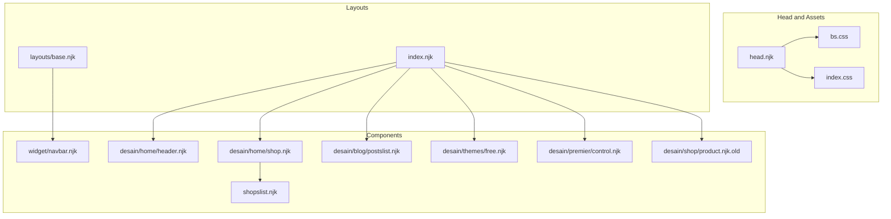
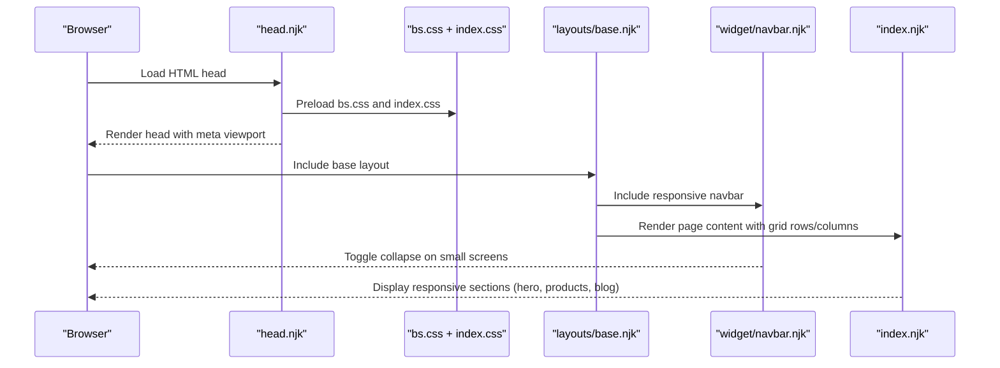
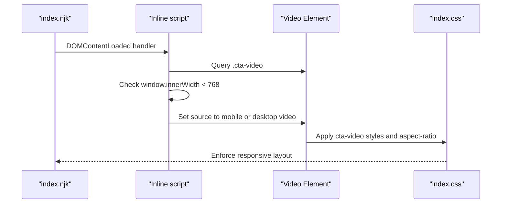
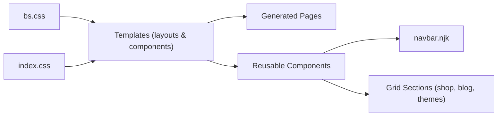

# Responsive Design and Bootstrap Integration

<cite>
**Referenced Files in This Document**
- [index.css](file://css/index.css)
- [bs.css](file://css/bs.css)
- [head.njk](file://_includes/widget/head.njk)
- [navbar.njk](file://_includes/widget/navbar.njk)
- [base.njk](file://_includes/layouts/base.njk)
- [index.njk](file://index.njk)
- [header.njk](file://_includes\desain\home\header.njk)
- [shop.njk](file://_includes\desain\home\shop.njk)
- [shopslist.njk](file://_includes\shopslist.njk)
- [postslist.njk](file://_includes\desain\blog\postslist.njk)
- [free.njk](file://_includes\desain\themes\free.njk)
- [control.njk (premier)](file://_includes\desain\premier\control.njk)
- [product.njk.old](file://_includes\desain\shop\product.njk.old)
</cite>

## Table of Contents
1. [Introduction](#introduction)
2. [Project Structure](#project-structure)
3. [Core Components](#core-components)
4. [Architecture Overview](#architecture-overview)
5. [Detailed Component Analysis](#detailed-component-analysis)
6. [Dependency Analysis](#dependency-analysis)
7. [Performance Considerations](#performance-considerations)
8. [Troubleshooting Guide](#troubleshooting-guide)
9. [Conclusion](#conclusion)

## Introduction
This document explains how the template system implements responsive design using Bootstrap 5 and custom CSS. It covers:
- How Bootstrap classes are used for mobile-first layouts, breakpoints, and the grid system
- Custom CSS overrides in index.css and bs.css
- Mobile optimization patterns for navigation, product grids, and content layouts
- Accessibility considerations and cross-browser compatibility approaches

The site is built with Eleventy templates that include reusable components and layouts, leveraging Bootstrap’s prebuilt utilities and components to achieve a consistent, responsive experience across devices.

## Project Structure
Responsive behavior is implemented through:
- A global head setup that loads Bootstrap and custom styles efficiently
- Reusable layout and component templates that apply Bootstrap grid and utility classes
- Custom CSS for targeted overrides and mobile-specific adjustments



**Diagram sources**
- [head.njk:1-114](file://_includes/widget/head.njk#L1-L114)
- [bs.css:1-12](file://css/bs.css#L1-L12)
- [index.css:1-52](file://css/index.css#L1-L52)
- [base.njk:1-62](file://_includes/layouts/base.njk#L1-L62)
- [index.njk:1-102](file://index.njk#L1-L102)
- [navbar.njk:1-37](file://_includes/widget/navbar.njk#L1-L37)
- [header.njk:1-21](file://_includes\desain\home\header.njk#L1-L21)
- [shop.njk:1-10](file://_includes\desain\home\shop.njk#L1-L10)
- [shopslist.njk:1-13](file://_includes\shopslist.njk#L1-L13)
- [postslist.njk:1-11](file://_includes\desain\blog\postslist.njk#L1-L11)
- [free.njk:1-12](file://_includes\desain\themes\free.njk#L1-L12)
- [control.njk (premier):14-27](file://_includes\desain\premier\control.njk#L14-L27)
- [product.njk.old:1-30](file://_includes\desain\shop\product.njk.old#L1-L30)

**Section sources**
- [head.njk:1-114](file://_includes/widget/head.njk#L1-L114)
- [bs.css:1-12](file://css/bs.css#L1-L12)
- [index.css:1-52](file://css/index.css#L1-L52)
- [base.njk:1-62](file://_includes/layouts/base.njk#L1-L62)
- [index.njk:1-102](file://index.njk#L1-L102)

## Core Components
- Head and asset loading: The head includes the viewport meta tag, preload/defer strategies for CSS and JS, and theme-color settings for mobile browsers.
- Navbar: Uses Bootstrap’s navbar with collapse toggling at lg breakpoint, search input, and accessible attributes.
- Grid-based layouts: Rows and columns define responsive structures for hero, trust badges, product listings, blog posts, and themes.
- Custom CSS: Provides image constraints, video aspect ratio handling, and mobile-specific overrides.

Key implementation highlights:
- Viewport and mobile readiness via meta tags
- Preloading critical CSS and deferring non-critical scripts
- Using Bootstrap utilities for spacing, alignment, visibility, and typography
- Applying media queries for specific elements like images and videos

**Section sources**
- [head.njk:1-114](file://_includes/widget/head.njk#L1-L114)
- [navbar.njk:1-37](file://_includes/widget/navbar.njk#L1-L37)
- [index.css:1-52](file://css/index.css#L1-L52)

## Architecture Overview
The responsive architecture combines Bootstrap’s mobile-first framework with targeted custom CSS. Templates compose reusable components to build pages consistently across breakpoints.



**Diagram sources**
- [head.njk:1-114](file://_includes/widget/head.njk#L1-L114)
- [bs.css:1-12](file://css/bs.css#L1-L12)
- [index.css:1-52](file://css/index.css#L1-L52)
- [base.njk:1-62](file://_includes/layouts/base.njk#L1-L62)
- [navbar.njk:1-37](file://_includes/widget/navbar.njk#L1-L37)
- [index.njk:1-102](file://index.njk#L1-L102)

## Detailed Component Analysis

### Global Head and Asset Loading
- Viewport configuration ensures proper scaling on mobile devices.
- Preload links for Bootstrap and custom CSS improve performance; noscript fallbacks ensure styles load without JavaScript.
- Theme color and mobile web app capabilities enhance native-like experiences.

Practical implications:
- Faster perceived performance due to early style delivery
- Graceful degradation when JavaScript is disabled
- Consistent mobile browser chrome integration

**Section sources**
- [head.njk:1-114](file://_includes/widget/head.njk#L1-L114)

### Bootstrap Integration and Breakpoints
Bootstrap 5 provides a comprehensive set of responsive utilities and components:
- Breakpoints: sm (576px), md (768px), lg (992px), xl (1200px), xxl (1400px)
- Grid system: container, row, col-* classes for flexible layouts
- Utilities: spacing, colors, display, text alignment, shadows, borders, etc.

Examples in templates:
- Navbar expand at lg breakpoint
- Two-column and multi-column layouts using col-md-* and col-6
- Full-width containers for hero and sections

**Section sources**
- [bs.css:1-12](file://css/bs.css#L1-L12)
- [navbar.njk:1-37](file://_includes/widget/navbar.njk#L1-L37)
- [index.njk:47-78](file://index.njk#L47-L78)

### Custom CSS Overrides (index.css)
Custom styles refine Bootstrap defaults and add mobile-specific behaviors:
- Image constraints within specific column contexts to prevent oversized visuals
- CTA video wrapper and video element styling with aspect-ratio handling
- Media queries to adjust layout and sizing for mobile vs desktop

Key patterns:
- Use max-width and auto margins to center images responsively
- Switch aspect ratios for videos based on screen width
- Remove horizontal padding on mobile for full-bleed effects

**Section sources**
- [index.css:1-52](file://css/index.css#L1-L52)

### Responsive Navigation
The navbar uses Bootstrap’s collapse mechanism:
- Toggles menu visibility below lg breakpoint
- Includes aria attributes for accessibility
- Integrates a client-side search input with results dropdown

Accessibility features:
- aria-controls, aria-expanded, aria-label on toggle button
- role="search" on form
- Keyboard-friendly focus management via Bootstrap components

Mobile optimizations:
- Collapsible menu reduces clutter on small screens
- Search input positioned with absolute placement and z-index for usability

**Section sources**
- [navbar.njk:1-37](file://_includes/widget/navbar.njk#L1-L37)
- [base.njk:6-61](file://_includes/layouts/base.njk#L6-L61)

### Product Grids and Content Layouts
Product and content sections rely on Bootstrap’s grid:
- Row containers with justified or centered columns
- Column widths adapt from single-column on mobile to multiple columns on larger screens
- Images use img-fluid for responsiveness and rounded corners for aesthetics

Examples:
- Home shop section header and call-to-action
- Shops list with responsive cards
- Blog posts with full-width images and titles
- Themes listing with two-column mobile and three-column desktop

```mermaid
flowchart TD
Start(["Render Section"]) --> Container["Container/Fluid Container"]
Container --> Row["Row with justify-content-center"]
Row --> Columns{"Breakpoint?"}
Columns --> |Mobile (<768px)| ColMobile["col-6 or col-12"]
Columns --> |Tablet/Desktop (>=768px)| ColDesktop["col-md-4 or col-md-12"]
ColMobile --> Cards["Card-like items with img-fluid"]
ColDesktop --> Cards
Cards --> End(["Responsive Grid Output"])
```

**Diagram sources**
- [shop.njk:1-10](file://_includes\desain\home\shop.njk#L1-L10)
- [shopslist.njk:1-13](file://_includes\shopslist.njk#L1-L13)
- [postslist.njk:1-11](file://_includes\desain\blog\postslist.njk#L1-L11)
- [free.njk:1-12](file://_includes\desain\themes\free.njk#L1-L12)

**Section sources**
- [shop.njk:1-10](file://_includes\desain\home\shop.njk#L1-L10)
- [shopslist.njk:1-13](file://_includes\shopslist.njk#L1-L13)
- [postslist.njk:1-11](file://_includes\desain\blog\postslist.njk#L1-L11)
- [free.njk:1-12](file://_includes\desain\themes\free.njk#L1-L12)

### Hero and Media Handling
Hero image and CTA video demonstrate responsive media techniques:
- Hero image container maintains aspect ratio and scales fluidly
- CTA video switches source based on screen width and adjusts aspect ratio for mobile
- Custom CSS enforces responsive sizing and rounded corners



**Diagram sources**
- [index.njk:8-40](file://index.njk#L8-L40)
- [index.css:27-51](file://css/index.css#L27-L51)

**Section sources**
- [index.njk:8-40](file://index.njk#L8-L40)
- [index.css:27-51](file://css/index.css#L27-L51)
- [header.njk:1-21](file://_includes\desain\home\header.njk#L1-L21)

### Tabs and Multi-section Layouts
Tabs demonstrate responsive control panels:
- Each tab item spans equal widths across breakpoints using col-md-3 and col-3
- Buttons trigger tab panes with data-bs-toggle and aria attributes

Accessibility:
- role="tab", aria-controls, aria-selected provide keyboard and screen reader support

**Section sources**
- [control.njk (premier):14-27](file://_includes\desain\premier\control.njk#L14-L27)

### Product Detail Layout
Product detail layout uses a two-column structure:
- Left column displays cover image with responsive sizing
- Right column contains content and call-to-action buttons
- Spacing adapts between mobile and desktop using p-3 and p-md-5

**Section sources**
- [product.njk.old:1-30](file://_includes\desain\shop\product.njk.old#L1-L30)

## Dependency Analysis
The responsive system depends on:
- Bootstrap 5 CSS for core layout, utilities, and components
- Custom CSS for targeted overrides and mobile-specific enhancements
- Eleventy templates composing reusable components into pages



**Diagram sources**
- [bs.css:1-12](file://css/bs.css#L1-L12)
- [index.css:1-52](file://css/index.css#L1-L52)
- [navbar.njk:1-37](file://_includes/widget/navbar.njk#L1-L37)
- [shop.njk:1-10](file://_includes\desain\home\shop.njk#L1-L10)
- [postslist.njk:1-11](file://_includes\desain\blog\postslist.njk#L1-L11)
- [free.njk:1-12](file://_includes\desain\themes\free.njk#L1-L12)

**Section sources**
- [bs.css:1-12](file://css/bs.css#L1-L12)
- [index.css:1-52](file://css/index.css#L1-L52)
- [navbar.njk:1-37](file://_includes/widget/navbar.njk#L1-L37)
- [shop.njk:1-10](file://_includes\desain\home\shop.njk#L1-L10)
- [postslist.njk:1-11](file://_includes\desain\blog\postslist.njk#L1-L11)
- [free.njk:1-12](file://_includes\desain\themes\free.njk#L1-L12)

## Performance Considerations
- Preload critical CSS (Bootstrap and custom) to reduce render-blocking time
- Defer non-critical scripts until after DOMContentLoaded
- Use lazy loading for images where appropriate
- Optimize media assets by switching video sources based on device size
- Keep custom CSS minimal and scoped to avoid overriding large portions of Bootstrap

[No sources needed since this section provides general guidance]

## Troubleshooting Guide
Common issues and resolutions:
- Navbar not collapsing: Ensure data-bs-toggle and data-bs-target match IDs; verify Bootstrap JS is loaded in footer/script.njk
- Images overflowing: Confirm img-fluid class and custom constraints in index.css are applied
- Video aspect ratio incorrect: Check media query thresholds and aspect-ratio values in index.css
- Search results not appearing: Verify /products.json exists and fetch logic in base.njk runs correctly

**Section sources**
- [navbar.njk:1-37](file://_includes/widget/navbar.njk#L1-L37)
- [index.css:1-52](file://css/index.css#L1-L52)
- [base.njk:6-61](file://_includes/layouts/base.njk#L6-L61)

## Conclusion
The template system achieves robust responsive design by combining Bootstrap 5’s mobile-first framework with focused custom CSS. Templates leverage Bootstrap’s grid and utilities to create consistent layouts across breakpoints while custom styles handle specific media and mobile optimizations. Accessibility attributes and performance-focused asset loading further enhance user experience across devices and browsers.

[No sources needed since this section summarizes without analyzing specific files]