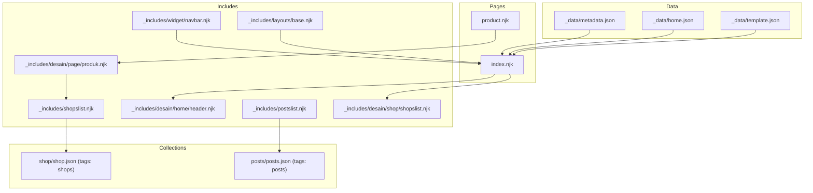
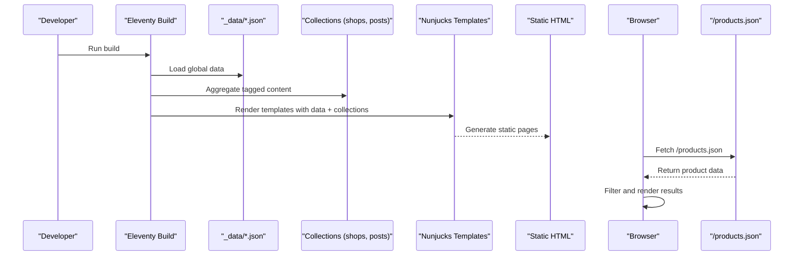
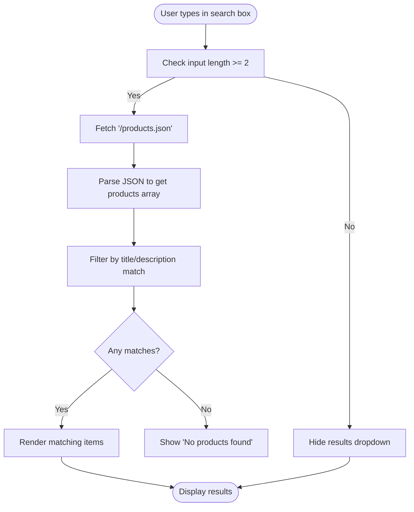
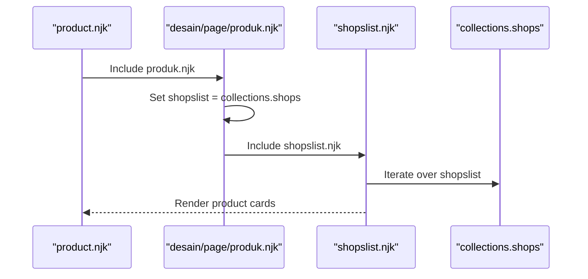
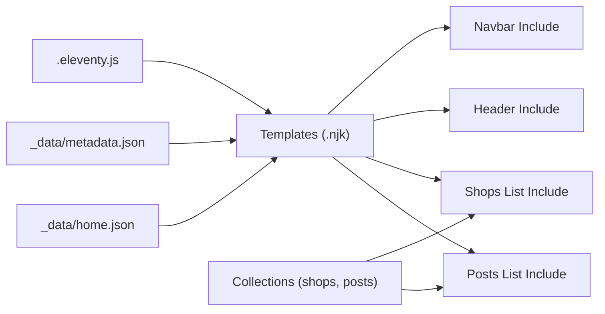

# Template Data Access and Rendering

<cite>
**Referenced Files in This Document**
- [.eleventy.js](file://.eleventy.js)
- [metadata.json](file://_data/metadata.json)
- [home.json](file://_data/home.json)
- [template.json](file://_data/template.json)
- [index.njk](file://index.njk)
- [product.njk](file://product.njk)
- [_includes/layouts/base.njk](file://_includes/layouts/base.njk)
- [_includes/desain/home/header.njk](file://_includes/desain/home/header.njk)
- [_includes/desain/page/produk.njk](file://_includes/desain/page/produk.njk)
- [_includes/shopslist.njk](file://_includes/shopslist.njk)
- [_includes/postslist.njk](file://_includes/postslist.njk)
- [_includes/desain/shop/shopslist.njk](file://_includes/desain/shop/shopslist.njk)
- [_includes/widget/navbar.njk](file://_includes/widget/navbar.njk)
- [shop\shop.json](file://shop/shop.json)
- [posts\posts.json](file://posts/posts.json)
</cite>

## Table of Contents
1. Introduction
2. Project Structure
3. Core Components
4. Architecture Overview
5. Detailed Component Analysis
6. Dependency Analysis
7. Performance Considerations
8. Troubleshooting Guide
9. Conclusion

## Introduction
This document explains how data is accessed and rendered in Nunjucks templates within this Eleventy project. It focuses on:
- Global data from the _data directory
- Collections (including tag-based collections)
- Data binding syntax, conditionals, and loops
- Dynamic content loading for products, blog posts, and site metadata
- Performance considerations and caching strategies for large datasets

## Project Structure
The project uses Eleventy’s standard layout and data conventions:
- Global site data lives in _data/*.json and is available to all templates as a global object.
- Content pages are organized by feature (e.g., shop/, posts/) with front matter and optional per-folder JSON that defines tags.
- Reusable UI fragments live in _includes and are composed into page templates.

**Diagram sources**
- [index.njk:1-102](file://index.njk#L1-L102)
- [product.njk:1-10](file://product.njk#L1-L10)
- [_includes/desain/home/header.njk:1-22](file://_includes/desain/home/header.njk#L1-L22)
- [_includes/desain/page/produk.njk:1-9](file://_includes/desain/page/produk.njk#L1-L9)
- [_includes/shopslist.njk:1-13](file://_includes/shopslist.njk#L1-L13)
- [_includes/postslist.njk:1-10](file://_includes/postslist.njk#L1-L10)
- [_includes/desain/shop/shopslist.njk:1-15](file://_includes/desain/shop/shopslist.njk#L1-L15)
- [_includes/widget/navbar.njk:1-37](file://_includes/widget/navbar.njk#L1-L37)
- [_includes/layouts/base.njk:1-62](file://_includes/layouts/base.njk#L1-L62)
- [shop\shop.json:1-4](file://shop/shop.json#L1-L4)
- [posts\posts.json:1-6](file://posts/posts.json#L1-L6)

**Section sources**
- [.eleventy.js:146-159](file://.eleventy.js#L146-L159)
- [index.njk:1-102](file://index.njk#L1-L102)
- [product.njk:1-10](file://product.njk#L1-L10)

## Core Components
- Global data objects:
  - Site metadata: metadata.* keys such as title, description, icon, social links, business info.
  - Home page content: home.* keys such as cover images and copy.
  - Template showcase list: template.* array entries with cover, title, description, url, link.
- Collections:
  - Tag-based collections created automatically by Eleventy when items declare tags in front matter or folder-level JSON (e.g., shops, posts).
  - Custom collection tagList built in configuration to enumerate unique tags across content.
- Layouts and includes:
  - Pages include reusable fragments under _includes to compose headers, lists, navigation, and footers.

Examples of access patterns:
- Site metadata: {{ metadata.title }}, {{ metadata.description }}
- Home content: {{ home.cover }}, {{ home.intro1 }}
- Collection iteration:  ... {{ item.data.title }} ... 
- Navigation via plugin:  ... {{ entry.title }} ... 

**Section sources**
- [metadata.json:1-47](file://_data/metadata.json#L1-L47)
- [home.json:1-12](file://_data/home.json#L1-L12)
- [template.json:1-59](file://_data/template.json#L1-L59)
- [_includes/desain/home/header.njk:1-22](file://_includes/desain/home/header.njk#L1-L22)
- [_includes/widget/navbar.njk:1-37](file://_includes/widget/navbar.njk#L1-L37)
- [_includes/shopslist.njk:1-13](file://_includes/shopslist.njk#L1-L13)
- [_includes/postslist.njk:1-10](file://_includes/postslist.njk#L1-L10)
- [.eleventy.js:72-95](file://.eleventy.js#L72-L95)

## Architecture Overview
At build time, Eleventy loads global data from _data, builds collections from tagged content, and renders Nunjucks templates. At runtime, client-side scripts can fetch generated JSON assets for dynamic features like search.

**Diagram sources**
- [.eleventy.js:146-159](file://.eleventy.js#L146-L159)
- [_includes/layouts/base.njk:1-62](file://_includes/layouts/base.njk#L1-L62)

## Detailed Component Analysis

### Global Data Access Patterns
- Site metadata:
  - Accessed via the metadata object in templates.
  - Used in header and navbar to display site title, description, and icons.
- Home content:
  - Accessed via the home object; used to populate hero and section content.
- Template showcase:
  - The template.json array can be iterated in templates to render example templates.

Practical examples:
- Header displays site title and description using metadata fields.
- Navbar brand shows shop name and icon from metadata.

**Section sources**
- [_includes/desain/home/header.njk:1-22](file://_includes/desain/home/header.njk#L1-L22)
- [_includes/widget/navbar.njk:1-37](file://_includes/widget/navbar.njk#L1-L37)
- [metadata.json:1-47](file://_data/metadata.json#L1-L47)
- [home.json:1-12](file://_data/home.json#L1-L12)
- [template.json:1-59](file://_data/template.json#L1-L59)

### Collections and Tag-Based Data
- Shop products:
  - Each shop page declares tags in its front matter or folder-level JSON (e.g., shop/shop.json).
  - Eleventy aggregates these into the shops collection.
  - Lists iterate over collections.shops to render cards with image, title, and description.
- Blog posts:
  - Posts declare tags in posts/posts.json.
  - Posts lists iterate over collections.posts to render post cards.

Key patterns:
- Set a local variable to a collection alias for reuse: 
- Iterate with reverse order: 
- Conditional rendering:  ... 
- Safe URL generation: {{ shop.url | url }}

**Section sources**
- [shop\shop.json:1-4](file://shop/shop.json#L1-L4)
- [posts\posts.json:1-6](file://posts/posts.json#L1-L6)
- [_includes/desain/page/produk.njk:1-9](file://_includes/desain/page/produk.njk#L1-L9)
- [_includes/shopslist.njk:1-13](file://_includes/shopslist.njk#L1-L13)
- [_includes/postslist.njk:1-10](file://_includes/postslist.njk#L1-L10)
- [_includes/desain/shop/shopslist.njk:1-15](file://_includes/desain/shop/shopslist.njk#L1-L15)

### Navigation and Page Indexing
- The navigation plugin indexes pages based on front matter and exposes them via collections.all | eleventyNavigation.
- The navbar renders menu entries using this filtered collection.

**Section sources**
- [_includes/widget/navbar.njk:1-37](file://_includes/widget/navbar.njk#L1-L37)
- [.eleventy.js:1-15](file://.eleventy.js#L1-L15)

### Dynamic Content Loading at Runtime
- A client-side search feature fetches a generated JSON file (/products.json) and filters results in the browser.
- This pattern keeps server load minimal while enabling interactive experiences.

**Diagram sources**
- [_includes/layouts/base.njk:1-62](file://_includes/layouts/base.njk#L1-L62)

**Section sources**
- [_includes/layouts/base.njk:1-62](file://_includes/layouts/base.njk#L1-L62)

### Example: Product Listing Page
- The product listing page composes a header and a product list include.
- It sets a local variable referencing the shops collection and delegates rendering to a shared list include.

**Diagram sources**
- [product.njk:1-10](file://product.njk#L1-L10)
- [_includes/desain/page/produk.njk:1-9](file://_includes/desain/page/produk.njk#L1-L9)
- [_includes/shopslist.njk:1-13](file://_includes/shopslist.njk#L1-L13)

**Section sources**
- [product.njk:1-10](file://product.njk#L1-L10)
- [_includes/desain/page/produk.njk:1-9](file://_includes/desain/page/produk.njk#L1-L9)
- [_includes/shopslist.njk:1-13](file://_includes/shopslist.njk#L1-L13)

### Example: Blog Post Listing
- The posts list include iterates over a postslist variable (typically bound to collections.posts) and renders each post card with conditional image and text blocks.

**Section sources**
- [_includes/postslist.njk:1-10](file://_includes/postslist.njk#L1-L10)

### Example: Home Page Composition
- The home page includes multiple sections (header, shop highlights, blog highlights) and trust/reputation content.
- It demonstrates composition through includes and usage of global data.

**Section sources**
- [index.njk:1-102](file://index.njk#L1-L102)
- [_includes/desain/home/header.njk:1-22](file://_includes/desain/home/header.njk#L1-L22)

## Dependency Analysis
- Configuration-driven behavior:
  - Global data merge strategy and layout aliases are defined in configuration.
  - Custom filters and collections are registered here.
- Template dependencies:
  - Pages depend on includes for consistent UI and data presentation.
  - Includes depend on collections and global data.

**Diagram sources**
- [.eleventy.js:1-15](file://.eleventy.js#L1-L15)
- [.eleventy.js:72-95](file://.eleventy.js#L72-L95)
- [_includes/widget/navbar.njk:1-37](file://_includes/widget/navbar.njk#L1-L37)
- [_includes/desain/home/header.njk:1-22](file://_includes/desain/home/header.njk#L1-L22)
- [_includes/shopslist.njk:1-13](file://_includes/shopslist.njk#L1-L13)
- [_includes/postslist.njk:1-10](file://_includes/postslist.njk#L1-L10)

**Section sources**
- [.eleventy.js:1-15](file://.eleventy.js#L1-L15)
- [.eleventy.js:72-95](file://.eleventy.js#L72-L95)

## Performance Considerations
- Prefer pre-rendered data where possible:
  - Use Eleventy collections and global data to render lists at build time rather than fetching large payloads at runtime.
- Minimize runtime work:
  - Avoid heavy client-side filtering on very large datasets; paginate or limit results on the server side.
- Optimize images:
  - Use appropriate sizes and lazy loading attributes to reduce initial payload.
- Cache static assets:
  - Ensure CDN and browser cache headers are configured for long-lived static files.
- Reduce DOM updates:
  - For client-side search, debounce input events and limit result counts.
- Efficient templating:
  - Keep includes focused and avoid deep nesting of loops.
  - Use filters judiciously; custom filters run during build but still add overhead.

[No sources needed since this section provides general guidance]

## Troubleshooting Guide
- Missing global data:
  - If metadata or home fields are undefined, verify the corresponding _data JSON files exist and contain expected keys.
- Empty collections:
  - Ensure content items declare tags in front matter or folder-level JSON (e.g., shop/shop.json, posts/posts.json).
- Incorrect URLs:
  - Always use the url filter for generated paths to ensure correct absolute URLs.
- Search not working:
  - Confirm that /products.json is generated and accessible; check network tab for errors.
- Navigation missing entries:
  - Verify eleventy-navigation front matter exists on pages included in the navigation.

**Section sources**
- [shop\shop.json:1-4](file://shop/shop.json#L1-L4)
- [posts\posts.json:1-6](file://posts/posts.json#L1-L6)
- [_includes/layouts/base.njk:1-62](file://_includes/layouts/base.njk#L1-L62)
- [_includes/widget/navbar.njk:1-37](file://_includes/widget/navbar.njk#L1-L37)

## Conclusion
This project demonstrates robust data access patterns in Eleventy with Nunjucks:
- Global data from _data provides site-wide context.
- Tag-based collections power dynamic listings for products and posts.
- Includes promote reusability and consistency.
- Client-side JSON fetching enables lightweight interactivity.
Adopting the patterns and performance tips outlined here will help maintain clarity, scalability, and speed as your content grows.