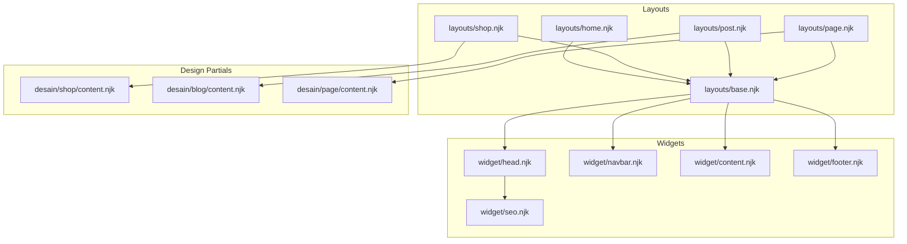
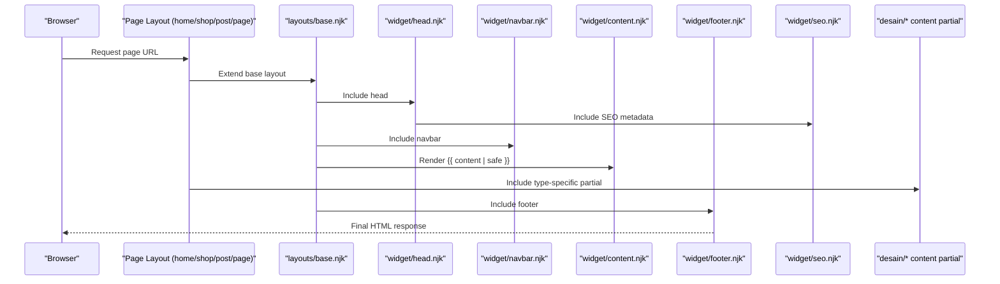
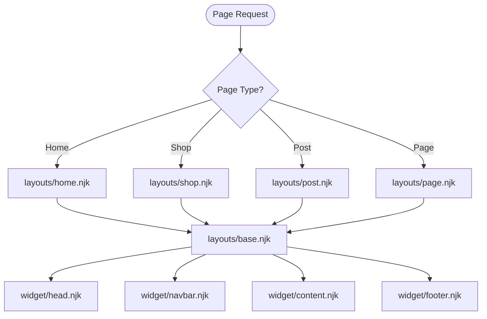
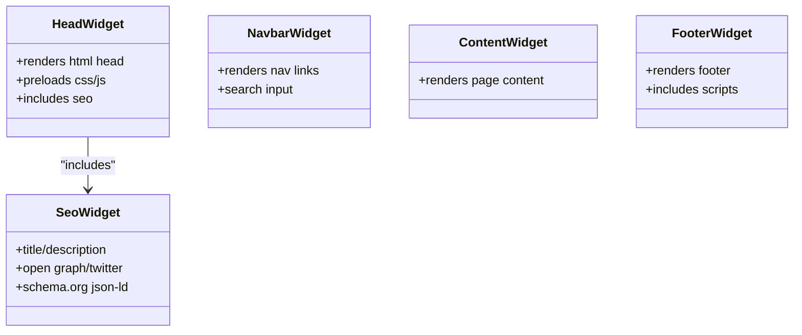
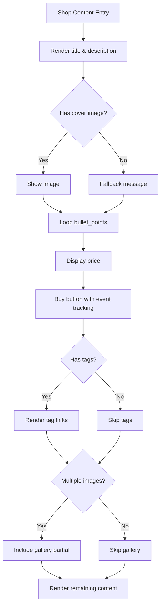
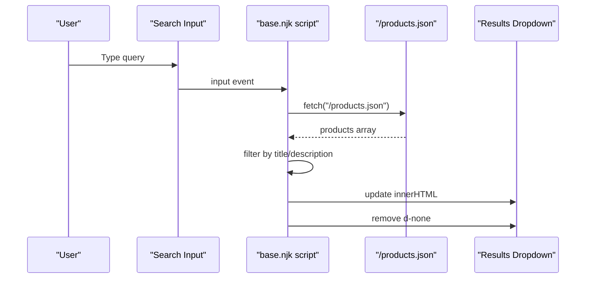
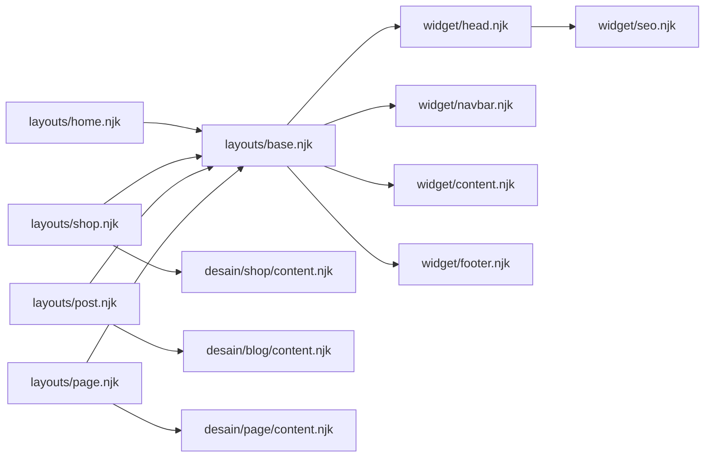

# Template System Architecture

<cite>
**Referenced Files in This Document**
- [base.njk](file://_includes/layouts/base.njk)
- [home.njk](file://_includes/layouts/home.njk)
- [shop.njk](file://_includes/layouts/shop.njk)
- [post.njk](file://_includes/layouts/post.njk)
- [page.njk](file://_includes/layouts/page.njk)
- [head.njk](file://_includes/widget/head.njk)
- [navbar.njk](file://_includes/widget/navbar.njk)
- [content.njk](file://_includes/widget/content.njk)
- [footer.njk](file://_includes/widget/footer.njk)
- [seo.njk](file://_includes/widget/seo.njk)
- [metadata.json](file://_data/metadata.json)
- [content.njk (shop)](file://_includes/desain/shop/content.njk)
- [content.njk (blog)](file://_includes/desain/blog/content.njk)
- [content.njk (page)](file://_includes/desain/page/content.njk)
</cite>

## Table of Contents
1. [Introduction](#introduction)
2. [Project Structure](#project-structure)
3. [Core Components](#core-components)
4. [Architecture Overview](#architecture-overview)
5. [Detailed Component Analysis](#detailed-component-analysis)
6. [Dependency Analysis](#dependency-analysis)
7. [Performance Considerations](#performance-considerations)
8. [Troubleshooting Guide](#troubleshooting-guide)
9. [Conclusion](#conclusion)

## Introduction
This document explains the Nunjucks template system architecture used by the project. It focuses on:
- Layout inheritance starting from base.njk as the root layout
- The component-based include system under _includes
- How page types (home, shop, post, page) extend the base layout
- The widget system for reusable parts such as head, navbar, content, footer, and SEO
- Template data access patterns, conditional rendering, and loops
- Dynamic client-side search behavior and responsive design implementation within templates

The goal is to provide a clear mental model for both new contributors and maintainers to understand how pages are composed and rendered.

## Project Structure
At a high level, the template system is organized into three main areas:
- layouts: define page-level layouts that inherit from base.njk
- widget: reusable UI components included across layouts and pages
- desain: theme-specific partials for different content types (shop, blog, page)

**Diagram sources**
- [base.njk:1-62](file://_includes/layouts/base.njk#L1-L62)
- [home.njk:1-5](file://_includes/layouts/home.njk#L1-L5)
- [shop.njk:1-5](file://_includes/layouts/shop.njk#L1-L5)
- [post.njk:1-6](file://_includes/layouts/post.njk#L1-L6)
- [page.njk:1-10](file://_includes/layouts/page.njk#L1-L10)
- [head.njk:1-113](file://_includes/widget/head.njk#L1-L113)
- [navbar.njk:1-37](file://_includes/widget/navbar.njk#L1-L37)
- [content.njk:1-1](file://_includes/widget/content.njk#L1-L1)
- [footer.njk:1-52](file://_includes/widget/footer.njk#L1-L52)
- [seo.njk:1-208](file://_includes/widget/seo.njk#L1-L208)
- [content.njk (shop):1-120](file://_includes/desain/shop/content.njk#L1-L120)
- [content.njk (blog):1-8](file://_includes/desain/blog/content.njk#L1-L8)
- [content.njk (page):1-6](file://_includes/desain/page/content.njk#L1-L6)

**Section sources**
- [base.njk:1-62](file://_includes/layouts/base.njk#L1-L62)
- [home.njk:1-5](file://_includes/layouts/home.njk#L1-L5)
- [shop.njk:1-5](file://_includes/layouts/shop.njk#L1-L5)
- [post.njk:1-6](file://_includes/layouts/post.njk#L1-L6)
- [page.njk:1-10](file://_includes/layouts/page.njk#L1-L10)
- [head.njk:1-113](file://_includes/widget/head.njk#L1-L113)
- [navbar.njk:1-37](file://_includes/widget/navbar.njk#L1-L37)
- [content.njk:1-1](file://_includes/widget/content.njk#L1-L1)
- [footer.njk:1-52](file://_includes/widget/footer.njk#L1-L52)
- [seo.njk:1-208](file://_includes/widget/seo.njk#L1-L208)
- [content.njk (shop):1-120](file://_includes/desain/shop/content.njk#L1-L120)
- [content.njk (blog):1-8](file://_includes/desain/blog/content.njk#L1-L8)
- [content.njk (page):1-6](file://_includes/desain/page/content.njk#L1-L6)

## Core Components
- Base layout (base.njk): Assembles global widgets (head, navbar, content, footer) and includes a client-side search script that fetches product data at runtime.
- Page layouts:
  - home.njk: Extends base and renders raw content.
  - shop.njk: Extends base and includes shop content partial.
  - post.njk: Extends base and includes blog header and content partials.
  - page.njk: Extends base and includes page content partial.
- Widgets:
  - head.njk: Provides HTML <html>, <head>, meta tags, CSS/JS preloads, and includes SEO metadata.
  - navbar.njk: Renders navigation links using Eleventy navigation collection and a search input.
  - content.njk: Placeholder for page body content.
  - footer.njk: Site footer with navigation and social links; includes scripts.
  - seo.njk: Title, description, Open Graph, Twitter, canonical, robots, and structured data (Schema.org).

Data access patterns:
- Global site metadata is accessed via metadata.* keys (e.g., title, url, icon, author).
- Page-level variables like title, description, cover, tags, price, amazonLink, ecwidId are used conditionally and in loops.
- Collections and Eleventy filters (e.g., eleventyNavigation, url, safeSlug, sanitize) are used for routing, formatting, and sanitization.

Responsive design:
- Bootstrap utility classes are used throughout (e.g., container, row, col-md-*, img-fluid, d-none, position-absolute).
- Preload and defer strategies optimize critical resources.

Dynamic content loading:
- Client-side search loads /products.json and filters results by title and description without page reloads.

**Section sources**
- [base.njk:1-62](file://_includes/layouts/base.njk#L1-L62)
- [home.njk:1-5](file://_includes/layouts/home.njk#L1-L5)
- [shop.njk:1-5](file://_includes/layouts/shop.njk#L1-L5)
- [post.njk:1-6](file://_includes/layouts/post.njk#L1-L6)
- [page.njk:1-10](file://_includes/layouts/page.njk#L1-L10)
- [head.njk:1-113](file://_includes/widget/head.njk#L1-L113)
- [navbar.njk:1-37](file://_includes/widget/navbar.njk#L1-L37)
- [content.njk:1-1](file://_includes/widget/content.njk#L1-L1)
- [footer.njk:1-52](file://_includes/widget/footer.njk#L1-L52)
- [seo.njk:1-208](file://_includes/widget/seo.njk#L1-L208)
- [content.njk (shop):1-120](file://_includes/desain/shop/content.njk#L1-L120)
- [content.njk (blog):1-8](file://_includes/desain/blog/content.njk#L1-L8)
- [content.njk (page):1-6](file://_includes/desain/page/content.njk#L1-L6)
- [metadata.json:1-27](file://_data/metadata.json#L1-L27)

## Architecture Overview
The rendering pipeline follows a clear inheritance and composition pattern:
- Page layouts declare their parent layout (base.njk) and include type-specific partials.
- base.njk composes global widgets and injects shared scripts.
- head.njk sets up the document head, preloads assets, and includes SEO metadata.
- seo.njk generates dynamic metadata and structured data based on page context.
- Content partials render page-specific sections using data variables and collections.

**Diagram sources**
- [home.njk:1-5](file://_includes/layouts/home.njk#L1-L5)
- [shop.njk:1-5](file://_includes/layouts/shop.njk#L1-L5)
- [post.njk:1-6](file://_includes/layouts/post.njk#L1-L6)
- [page.njk:1-10](file://_includes/layouts/page.njk#L1-L10)
- [base.njk:1-62](file://_includes/layouts/base.njk#L1-L62)
- [head.njk:1-113](file://_includes/widget/head.njk#L1-L113)
- [navbar.njk:1-37](file://_includes/widget/navbar.njk#L1-L37)
- [content.njk:1-1](file://_includes/widget/content.njk#L1-L1)
- [footer.njk:1-52](file://_includes/widget/footer.njk#L1-L52)
- [seo.njk:1-208](file://_includes/widget/seo.njk#L1-L208)
- [content.njk (shop):1-120](file://_includes/desain/shop/content.njk#L1-L120)
- [content.njk (blog):1-8](file://_includes/desain/blog/content.njk#L1-L8)
- [content.njk (page):1-6](file://_includes/desain/page/content.njk#L1-L6)

## Detailed Component Analysis

### Layout Inheritance Pattern
- All page layouts set layout: layouts/base.njk in front matter and then include or render content.
- home.njk simply renders the page’s content block.
- shop.njk includes the shop content partial.
- post.njk includes blog header and content partials.
- page.njk includes the page content partial.

**Diagram sources**
- [home.njk:1-5](file://_includes/layouts/home.njk#L1-L5)
- [shop.njk:1-5](file://_includes/layouts/shop.njk#L1-L5)
- [post.njk:1-6](file://_includes/layouts/post.njk#L1-L6)
- [page.njk:1-10](file://_includes/layouts/page.njk#L1-L10)
- [base.njk:1-62](file://_includes/layouts/base.njk#L1-L62)
- [head.njk:1-113](file://_includes/widget/head.njk#L1-L113)
- [navbar.njk:1-37](file://_includes/widget/navbar.njk#L1-L37)
- [content.njk:1-1](file://_includes/widget/content.njk#L1-L1)
- [footer.njk:1-52](file://_includes/widget/footer.njk#L1-L52)

**Section sources**
- [home.njk:1-5](file://_includes/layouts/home.njk#L1-L5)
- [shop.njk:1-5](file://_includes/layouts/shop.njk#L1-L5)
- [post.njk:1-6](file://_includes/layouts/post.njk#L1-L6)
- [page.njk:1-10](file://_includes/layouts/page.njk#L1-L10)
- [base.njk:1-62](file://_includes/layouts/base.njk#L1-L62)

### Widget System
- head.njk:
  - Declares HTML language and viewport settings.
  - Preloads Swiper CSS and defers JS initialization after DOMContentLoaded.
  - Includes seo.njk for dynamic metadata and structured data.
  - Preloads CSS and Font Awesome with noscript fallbacks.
  - Adds analytics and optional third-party scripts.
- navbar.njk:
  - Uses Eleventy navigation collection to build nav links.
  - Provides a search input with an associated dropdown area for results.
- content.njk:
  - Simple placeholder that renders the page’s content safely.
- footer.njk:
  - Displays site branding, navigation links, and social icons.
  - Includes script.njk for shared scripts.
- seo.njk:
  - Generates title, description, Open Graph, Twitter cards, canonical link, robots directive, and Google verification.
  - Produces Schema.org JSON-LD for Product, Article, Organization, WebSite, and BreadcrumbList depending on tags and page context.

**Diagram sources**
- [head.njk:1-113](file://_includes/widget/head.njk#L1-L113)
- [navbar.njk:1-37](file://_includes/widget/navbar.njk#L1-L37)
- [content.njk:1-1](file://_includes/widget/content.njk#L1-L1)
- [footer.njk:1-52](file://_includes/widget/footer.njk#L1-L52)
- [seo.njk:1-208](file://_includes/widget/seo.njk#L1-L208)

**Section sources**
- [head.njk:1-113](file://_includes/widget/head.njk#L1-L113)
- [navbar.njk:1-37](file://_includes/widget/navbar.njk#L1-L37)
- [content.njk:1-1](file://_includes/widget/content.njk#L1-L1)
- [footer.njk:1-52](file://_includes/widget/footer.njk#L1-L52)
- [seo.njk:1-208](file://_includes/widget/seo.njk#L1-L208)

### Page-Specific Content Partials
- Shop content (desain/shop/content.njk):
  - Displays product title, description, image, bullet points, price, and CTA button.
  - Loops over tags to generate tag links.
  - Conditionally includes gallery if multiple images exist.
  - Emits Google Analytics events on buy button click.
- Blog content (desain/blog/content.njk):
  - Composes two columns including post and shop partials.
- Page content (desain/page/content.njk):
  - Renders page title, description, optional cover image, and content.

**Diagram sources**
- [content.njk (shop):1-120](file://_includes/desain/shop/content.njk#L1-L120)

**Section sources**
- [content.njk (shop):1-120](file://_includes/desain/shop/content.njk#L1-L120)
- [content.njk (blog):1-8](file://_includes/desain/blog/content.njk#L1-L8)
- [content.njk (page):1-6](file://_includes/desain/page/content.njk#L1-L6)

### Data Access Patterns
- Global metadata:
  - Accessed via metadata.* keys such as title, url, icon, author, feed paths.
- Page-level variables:
  - title, description, cover, tags, price, amazonLink, ecwidId, category, bullet_points, images.
- Collections and filters:
  - collections.all | eleventyNavigation for navigation.
  - Filters: url, safeSlug, sanitize, htmlDateString, isoDateTime.

Examples of usage locations:
- Metadata usage in head and navbar.
- Conditional OG type selection in SEO based on tags.
- Looping over collections and tags.

**Section sources**
- [metadata.json:1-27](file://_data/metadata.json#L1-L27)
- [head.njk:1-113](file://_includes/widget/head.njk#L1-L113)
- [navbar.njk:1-37](file://_includes/widget/navbar.njk#L1-L37)
- [seo.njk:1-208](file://_includes/widget/seo.njk#L1-L208)
- [content.njk (shop):1-120](file://_includes/desain/shop/content.njk#L1-L120)

### Conditional Rendering and Loops
- Conditional rendering:
  - Cover image presence check before rendering.
  - Multiple images check to include gallery.
  - Tags presence to render tag links.
  - OG type selection based on tags.
- Loops:
  - Navigation links from collections.
  - Bullet points iteration.
  - Tag iteration for links.

**Section sources**
- [content.njk (shop):1-120](file://_includes/desain/shop/content.njk#L1-L120)
- [navbar.njk:1-37](file://_includes/widget/navbar.njk#L1-L37)
- [seo.njk:1-208](file://_includes/widget/seo.njk#L1-L208)

### Dynamic Content Loading and Responsive Design
- Dynamic search:
  - On DOMContentLoaded, base.njk attaches an input listener to fetch /products.json and filter results by title and description.
  - Results are injected into a dropdown area and hidden when input is empty or too short.
- Responsive design:
  - Bootstrap grid and utilities control layout across breakpoints.
  - Images use img-fluid and aspect-ratio containers for consistent display.

**Diagram sources**
- [base.njk:1-62](file://_includes/layouts/base.njk#L1-L62)
- [navbar.njk:1-37](file://_includes/widget/navbar.njk#L1-L37)

**Section sources**
- [base.njk:1-62](file://_includes/layouts/base.njk#L1-L62)
- [navbar.njk:1-37](file://_includes/widget/navbar.njk#L1-L37)

## Dependency Analysis
The following diagram shows key dependencies between layouts, widgets, and content partials.

**Diagram sources**
- [base.njk:1-62](file://_includes/layouts/base.njk#L1-L62)
- [home.njk:1-5](file://_includes/layouts/home.njk#L1-L5)
- [shop.njk:1-5](file://_includes/layouts/shop.njk#L1-L5)
- [post.njk:1-6](file://_includes/layouts/post.njk#L1-L6)
- [page.njk:1-10](file://_includes/layouts/page.njk#L1-L10)
- [head.njk:1-113](file://_includes/widget/head.njk#L1-L113)
- [navbar.njk:1-37](file://_includes/widget/navbar.njk#L1-L37)
- [content.njk:1-1](file://_includes/widget/content.njk#L1-L1)
- [footer.njk:1-52](file://_includes/widget/footer.njk#L1-L52)
- [seo.njk:1-208](file://_includes/widget/seo.njk#L1-L208)
- [content.njk (shop):1-120](file://_includes/desain/shop/content.njk#L1-L120)
- [content.njk (blog):1-8](file://_includes/desain/blog/content.njk#L1-L8)
- [content.njk (page):1-6](file://_includes/desain/page/content.njk#L1-L6)

**Section sources**
- [base.njk:1-62](file://_includes/layouts/base.njk#L1-L62)
- [home.njk:1-5](file://_includes/layouts/home.njk#L1-L5)
- [shop.njk:1-5](file://_includes/layouts/shop.njk#L1-L5)
- [post.njk:1-6](file://_includes/layouts/post.njk#L1-L6)
- [page.njk:1-10](file://_includes/layouts/page.njk#L1-L10)
- [head.njk:1-113](file://_includes/widget/head.njk#L1-L113)
- [navbar.njk:1-37](file://_includes/widget/navbar.njk#L1-L37)
- [content.njk:1-1](file://_includes/widget/content.njk#L1-L1)
- [footer.njk:1-52](file://_includes/widget/footer.njk#L1-L52)
- [seo.njk:1-208](file://_includes/widget/seo.njk#L1-L208)
- [content.njk (shop):1-120](file://_includes/desain/shop/content.njk#L1-L120)
- [content.njk (blog):1-8](file://_includes/desain/blog/content.njk#L1-L8)
- [content.njk (page):1-6](file://_includes/desain/page/content.njk#L1-L6)

## Performance Considerations
- Resource preloading and deferring:
  - Critical CSS and fonts are preloaded; non-critical JS is deferred until DOMContentLoaded.
- Lazy loading:
  - Images use lazy loading attributes to improve initial load performance.
- Client-side filtering:
  - Search uses a single fetch call to /products.json and filters in memory, avoiding server round-trips.
- Structured data:
  - Schema.org blocks are generated only when needed based on page context.

[No sources needed since this section provides general guidance]

## Troubleshooting Guide
- Missing metadata fields:
  - Ensure metadata.json contains required keys (title, url, icon, author).
  - Verify page front matter provides title, description, cover where expected.
- SEO issues:
  - Confirm og:image and canonical URLs resolve correctly.
  - Validate JSON-LD fields (price, currency, date) are properly formatted.
- Search not working:
  - Check that /products.json exists and returns a valid JSON structure with products array.
  - Ensure the search input ID matches the script expectations.
- Navigation links missing:
  - Verify collections.all and eleventyNavigation are configured and entries have titles and URLs.

**Section sources**
- [metadata.json:1-27](file://_data/metadata.json#L1-L27)
- [seo.njk:1-208](file://_includes/widget/seo.njk#L1-L208)
- [base.njk:1-62](file://_includes/layouts/base.njk#L1-L62)
- [navbar.njk:1-37](file://_includes/widget/navbar.njk#L1-L37)

## Conclusion
The template system leverages a clean separation of concerns:
- Layouts define structural inheritance from base.njk.
- Widgets encapsulate reusable UI and metadata logic.
- Design partials handle content-type specifics.
- Data access is centralized through metadata and page variables, with robust conditional rendering and looping.
- Dynamic features like client-side search and rich SEO/structured data enhance user experience and discoverability.

[No sources needed since this section summarizes without analyzing specific files]