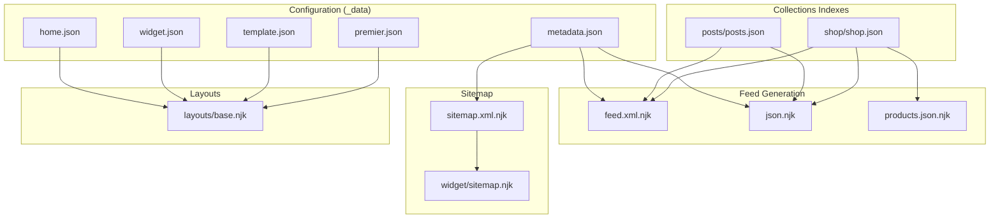
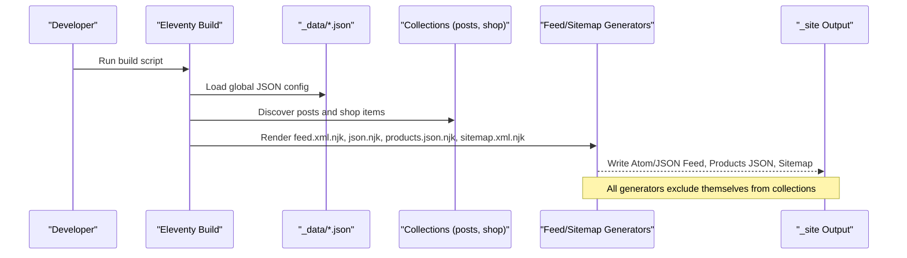
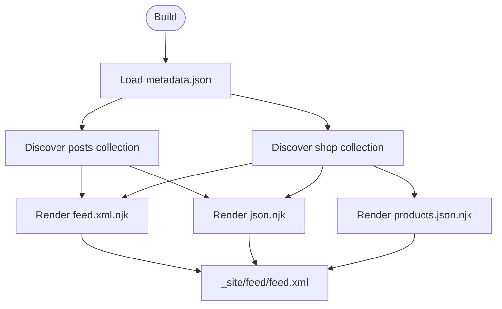
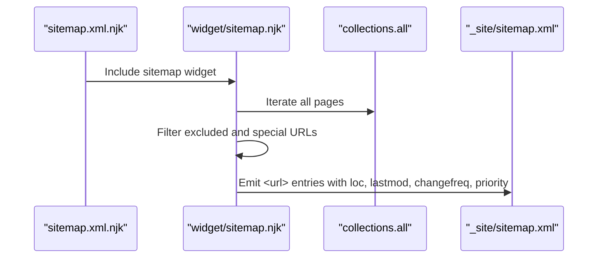
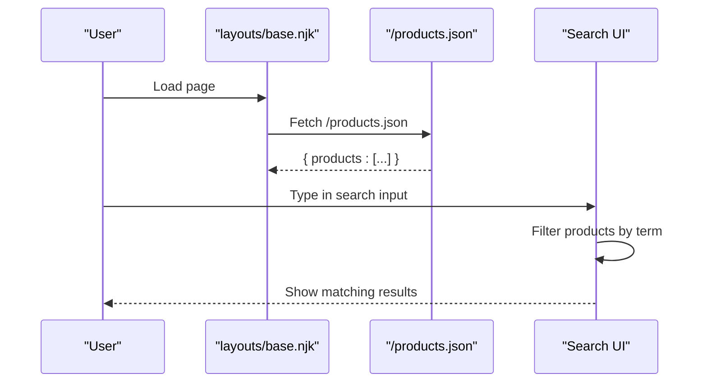
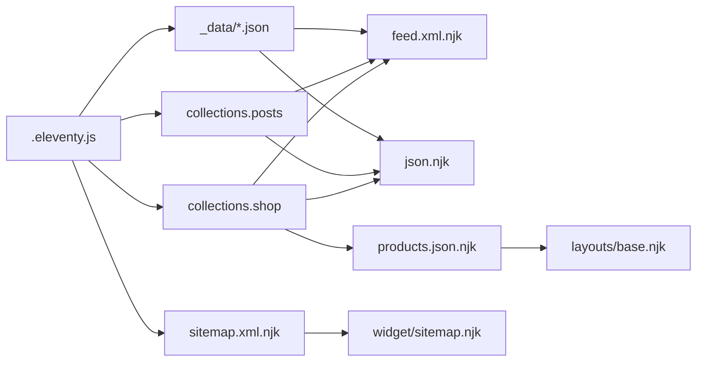

# Data Management and Configuration

<cite>
**Referenced Files in This Document**
- [.eleventy.js](file://.eleventy.js)
- [package.json](file://package.json)
- [_data/metadata.json](file://_data/metadata.json)
- [_data/home.json](file://_data/home.json)
- [_data/widget.json](file://_data/widget.json)
- [_data/template.json](file://_data/template.json)
- [_data/premier.json](file://_data/premier.json)
- [feed/feed.xml.njk](file://feed/feed.xml.njk)
- [feed/json.njk](file://feed/json.njk)
- [feed/products.json.njk](file://feed/products.json.njk)
- [sitemap.xml.njk](file://sitemap.xml.njk)
- [_includes/widget/sitemap.njk](file://_includes/widget/sitemap.njk)
- [_includes/layouts/base.njk](file://_includes/layouts/base.njk)
- [posts/posts.json](file://posts/posts.json)
- [shop/shop.json](file://shop/shop.json)
</cite>

## Table of Contents
1. Introduction
2. Project Structure
3. Core Components
4. Architecture Overview
5. Detailed Component Analysis
6. Dependency Analysis
7. Performance Considerations
8. Troubleshooting Guide
9. Conclusion
10. Appendices

## Introduction
This document explains the data management and configuration system for Nillianstore2, a static site built with Eleventy. It covers:
- Global configuration via JSON files (site metadata, theme settings, widget configurations)
- Feed generation for RSS/Atom, JSON Feed, and XML sitemaps
- Data flow from configuration files to template variables and generated outputs
- Data validation patterns, schema definitions, and environment-specific considerations
- The relationship between static data files and dynamic content generation
- Backup strategies, version control practices, and migration procedures for configuration changes

## Project Structure
Nillianstore2 organizes data and templates as follows:
- _data: Global JSON configuration consumed by templates and collections
- feed: Templates that generate Atom/RSS, JSON Feed, and product JSON
- _includes: Reusable widgets and layouts that consume global data
- sitemap.xml.njk: Entry point for sitemap generation using a reusable widget
- posts and shop: Content directories with per-collection index JSON files to tag items

**Diagram sources**
- [.eleventy.js:146-158](file://.eleventy.js#L146-L158)
- [_data/metadata.json:1-27](file://_data/metadata.json#L1-L27)
- [_data/home.json:1-12](file://_data/home.json#L1-L12)
- [_data/widget.json:1-7](file://_data/widget.json#L1-L7)
- [_data/template.json:1-59](file://_data/template.json#L1-L59)
- [_data/premier.json:1-16](file://_data/premier.json#L1-L16)
- [feed/feed.xml.njk:1-63](file://feed/feed.xml.njk#L1-L63)
- [feed/json.njk:1-33](file://feed/json.njk#L1-L33)
- [feed/products.json.njk:1-17](file://feed/products.json.njk#L1-L17)
- [sitemap.xml.njk:1-6](file://sitemap.xml.njk#L1-L6)
- [_includes/widget/sitemap.njk:1-22](file://_includes/widget/sitemap.njk#L1-L22)
- [_includes/layouts/base.njk:1-62](file://_includes/layouts/base.njk#L1-L62)
- [posts/posts.json:1-6](file://posts/posts.json#L1-L6)
- [shop/shop.json:1-4](file://shop/shop.json#L1-L4)

**Section sources**
- [.eleventy.js:146-158](file://.eleventy.js#L146-L158)
- [package.json:1-34](file://package.json#L1-L34)

## Core Components
- Global metadata: Site identity, URLs, author, and feed endpoints are defined in a single source of truth.
- Home page content: Hero and feature blocks are configured via JSON for easy updates without touching templates.
- Widget text: Help banner copy and links are centralized for consistent UI messaging.
- Template showcase: A list of related templates is managed as structured data for display pages.
- Collection indexes: posts/posts.json and shop/shop.json tag all items within their respective folders into Eleventy collections.
- Feed generators: Atom/RSS, JSON Feed, and products JSON are templated and excluded from collections.
- Sitemap generator: A reusable widget builds an XML sitemap based on all non-excluded pages.

Key responsibilities:
- Centralize site-wide strings and URLs to avoid duplication
- Provide typed structures for feeds and client-side consumption
- Keep content and presentation decoupled through data-driven templates

**Section sources**
- [_data/metadata.json:1-27](file://_data/metadata.json#L1-L27)
- [_data/home.json:1-12](file://_data/home.json#L1-L12)
- [_data/widget.json:1-7](file://_data/widget.json#L1-L7)
- [_data/template.json:1-59](file://_data/template.json#L1-L59)
- [_data/premier.json:1-16](file://_data/premier.json#L1-L16)
- [posts/posts.json:1-6](file://posts/posts.json#L1-L6)
- [shop/shop.json:1-4](file://shop/shop.json#L1-L4)
- [feed/feed.xml.njk:1-63](file://feed/feed.xml.njk#L1-L63)
- [feed/json.njk:1-33](file://feed/json.njk#L1-L33)
- [feed/products.json.njk:1-17](file://feed/products.json.njk#L1-L17)
- [_includes/widget/sitemap.njk:1-22](file://_includes/widget/sitemap.njk#L1-L22)

## Architecture Overview
The build pipeline reads JSON configuration and content, merges it into Eleventy’s global data, and renders templates into static assets.

**Diagram sources**
- [.eleventy.js:146-158](file://.eleventy.js#L146-L158)
- [feed/feed.xml.njk:1-63](file://feed/feed.xml.njk#L1-L63)
- [feed/json.njk:1-33](file://feed/json.njk#L1-L33)
- [feed/products.json.njk:1-17](file://feed/products.json.njk#L1-L17)
- [sitemap.xml.njk:1-6](file://sitemap.xml.njk#L1-L6)
- [_includes/widget/sitemap.njk:1-22](file://_includes/widget/sitemap.njk#L1-L22)

## Detailed Component Analysis

### Global Configuration System
- metadata.json
  - Purpose: Single source of truth for site identity, language, locale, author, and feed endpoints.
  - Key fields: title, description, url, language, locale, feed.path/id, jsonfeed.path/url, author.name/email/url.
  - Usage: Consumed by feed templates and layout head widgets; used to compute absolute URLs.
- home.json
  - Purpose: Hero and feature block content for the homepage.
  - Fields: cover, icon1/icon2, title1/title2, intro1/intro2, cover1/cover2.
- widget.json
  - Purpose: Help banner text and link configuration.
  - Fields: help, helpinfo, helpbtn, helplink.
- template.json and premier.json
  - Purpose: Lists of related templates or featured sections displayed on marketing/showcase pages.
  - Fields: cover, title, description, url, link.

Validation and schema recommendations:
- Enforce required fields at build time using a lightweight Node script invoked from package.json scripts.
- Validate URL formats and ensure feed paths exist.
- Normalize language and locale codes to ISO standards.

Environment-specific configuration:
- Use site.url in .eleventy.js for absolute URLs across the site.
- For multi-environment builds, consider overriding site.url via environment variables or separate config files loaded conditionally.

**Section sources**
- [_data/metadata.json:1-27](file://_data/metadata.json#L1-L27)
- [_data/home.json:1-12](file://_data/home.json#L1-L12)
- [_data/widget.json:1-7](file://_data/widget.json#L1-L7)
- [_data/template.json:1-59](file://_data/template.json#L1-L59)
- [_data/premier.json:1-16](file://_data/premier.json#L1-L16)
- [.eleventy.js:16-16](file://.eleventy.js#L16-L16)
- [package.json:5-12](file://package.json#L5-L12)

### Feed Generation System
- Atom/Atom-like feed (feed.xml.njk)
  - Reads metadata.title, metadata.feed.*, metadata.author.*
  - Iterates collections.posts and collections.shop to produce entries
  - Uses filters for date formatting and XML encoding
- JSON Feed (feed/json.njk)
  - Uses metadata.jsonfeed.path and metadata.jsonfeed.url
  - Builds items array from collections.posts
  - Uses absoluteUrl helper and rssDate filter for canonical IDs and dates
- Products JSON (feed/products.json.njk)
  - Generates /products.json consumed by client-side search in base layout
  - Maps shop collection items to a simple product object shape

Data flow highlights:
- Collections.posts and collections.shop are populated from Markdown files in posts/ and shop/ plus their index JSON tags.
- Feed templates rely on global site.url and metadata to construct absolute links.
- xmlEncode ensures safe output in XML contexts.

**Diagram sources**
- [feed/feed.xml.njk:1-63](file://feed/feed.xml.njk#L1-L63)
- [feed/json.njk:1-33](file://feed/json.njk#L1-L33)
- [feed/products.json.njk:1-17](file://feed/products.json.njk#L1-L17)
- [_data/metadata.json:1-27](file://_data/metadata.json#L1-L27)
- [posts/posts.json:1-6](file://posts/posts.json#L1-L6)
- [shop/shop.json:1-4](file://shop/shop.json#L1-L4)

**Section sources**
- [feed/feed.xml.njk:1-63](file://feed/feed.xml.njk#L1-L63)
- [feed/json.njk:1-33](file://feed/json.njk#L1-L33)
- [feed/products.json.njk:1-17](file://feed/products.json.njk#L1-L17)
- [posts/posts.json:1-6](file://posts/posts.json#L1-L6)
- [shop/shop.json:1-4](file://shop/shop.json#L1-L4)

### Sitemap Generation
- sitemap.xml.njk includes a reusable widget that iterates collections.all
- Excludes pages marked with eleventyExcludeFromCollections and specific URLs (e.g., 404, Google verification)
- Assigns lastmod from page.date and sets changefreq/priority based on page type

**Diagram sources**
- [sitemap.xml.njk:1-6](file://sitemap.xml.njk#L1-L6)
- [_includes/widget/sitemap.njk:1-22](file://_includes/widget/sitemap.njk#L1-L22)

**Section sources**
- [sitemap.xml.njk:1-6](file://sitemap.xml.njk#L1-L6)
- [_includes/widget/sitemap.njk:1-22](file://_includes/widget/sitemap.njk#L1-L22)

### Client-Side Product Search Integration
- base layout fetches /products.json at runtime
- Filters results by title and description and renders a dropdown
- Relies on products.json.njk to provide a stable product schema

**Diagram sources**
- [_includes/layouts/base.njk:1-62](file://_includes/layouts/base.njk#L1-L62)
- [feed/products.json.njk:1-17](file://feed/products.json.njk#L1-L17)

**Section sources**
- [_includes/layouts/base.njk:1-62](file://_includes/layouts/base.njk#L1-L62)
- [feed/products.json.njk:1-17](file://feed/products.json.njk#L1-L17)

## Dependency Analysis
- Eleventy configuration
  - Adds plugins for RSS, syntax highlighting, navigation
  - Defines global data (site.url), deep merge behavior, layout aliases, filters, passthrough copies, markdown library, and directory structure
- Data consumers
  - Feed templates depend on metadata.json and collections.posts/shop
  - Sitemap depends on collections.all and excludes certain pages
  - Base layout depends on /products.json for client-side search

**Diagram sources**
- [.eleventy.js:1-160](file://.eleventy.js#L1-L160)
- [_data/metadata.json:1-27](file://_data/metadata.json#L1-L27)
- [feed/feed.xml.njk:1-63](file://feed/feed.xml.njk#L1-L63)
- [feed/json.njk:1-33](file://feed/json.njk#L1-L33)
- [feed/products.json.njk:1-17](file://feed/products.json.njk#L1-L17)
- [sitemap.xml.njk:1-6](file://sitemap.xml.njk#L1-L6)
- [_includes/widget/sitemap.njk:1-22](file://_includes/widget/sitemap.njk#L1-L22)
- [_includes/layouts/base.njk:1-62](file://_includes/layouts/base.njk#L1-L62)

**Section sources**
- [.eleventy.js:1-160](file://.eleventy.js#L1-L160)
- [package.json:24-32](file://package.json#L24-L32)

## Performance Considerations
- Prefer minimal JSON payloads for client-side features like search; keep product fields lean.
- Avoid heavy transformations in templates; precompute where possible.
- Use Eleventy’s deep merge judiciously to prevent unexpected overrides.
- Cache external resources and images; ensure CDN-friendly paths.
- Exclude non-content pages from collections to reduce render overhead.

[No sources needed since this section provides general guidance]

## Troubleshooting Guide
Common issues and resolutions:
- Missing or malformed metadata fields
  - Symptom: Blank titles, broken feed links, or invalid JSON Feed.
  - Action: Validate metadata.json against expected schema; ensure feed paths and URLs are present.
- Incorrect collection names
  - Symptom: Empty feeds or missing entries.
  - Action: Verify posts/posts.json and shop/shop.json contain correct tags ("posts", "shops") and that content files reside under posts/ and shop/.
- XML encoding errors
  - Symptom: Invalid Atom feed due to unescaped characters.
  - Action: Ensure content is passed through xmlEncode in Atom templates.
- Client-side search not loading
  - Symptom: No results or console error when fetching /products.json.
  - Action: Confirm products.json.njk generates valid JSON and that base layout fetch path matches.

Operational checks:
- Run the build script and inspect _site for generated artifacts.
- Validate Atom and JSON Feed with online validators.
- Check robots.txt and sitemap accessibility.

**Section sources**
- [_data/metadata.json:1-27](file://_data/metadata.json#L1-L27)
- [posts/posts.json:1-6](file://posts/posts.json#L1-L6)
- [shop/shop.json:1-4](file://shop/shop.json#L1-L4)
- [feed/feed.xml.njk:1-63](file://feed/feed.xml.njk#L1-L63)
- [feed/json.njk:1-33](file://feed/json.njk#L1-L33)
- [feed/products.json.njk:1-17](file://feed/products.json.njk#L1-L17)
- [_includes/layouts/base.njk:1-62](file://_includes/layouts/base.njk#L1-L62)

## Conclusion
Nillianstore2 centralizes configuration in JSON, leverages Eleventy collections for content, and generates standardized feeds and sitemaps. By keeping data schemas consistent and validating inputs at build time, teams can safely evolve the site while maintaining reliable outputs. Adopting the backup, version control, and migration practices outlined below will further improve stability and collaboration.

[No sources needed since this section summarizes without analyzing specific files]

## Appendices

### Data Validation and Schema Definitions
Recommended schema outlines:
- metadata.json
  - Required: title, description, url, language, locale, feed.path, feed.id, jsonfeed.path, jsonfeed.url, author.name, author.email, author.url
  - Optional: feed.subtitle, icon, tweet, shopname, banner
- home.json
  - Required: cover, icon1, icon2, title1, title2, intro1, intro2, cover1, cover2
- widget.json
  - Required: help, helpinfo, helpbtn, helplink
- template.json and premier.json
  - Array of objects with: cover, title, description, url, link
- posts/posts.json and shop/shop.json
  - Must include tags arrays: ["posts"] and ["shops"] respectively
- feed/templates
  - Atom: uses metadata, collections.posts, collections.shop
  - JSON Feed: uses metadata.jsonfeed, collections.posts
  - Products JSON: uses collections.shop

Implementation tip:
- Add a Node-based validation step in package.json scripts to fail fast on schema violations during CI.

**Section sources**
- [_data/metadata.json:1-27](file://_data/metadata.json#L1-L27)
- [_data/home.json:1-12](file://_data/home.json#L1-L12)
- [_data/widget.json:1-7](file://_data/widget.json#L1-L7)
- [_data/template.json:1-59](file://_data/template.json#L1-L59)
- [_data/premier.json:1-16](file://_data/premier.json#L1-L16)
- [posts/posts.json:1-6](file://posts/posts.json#L1-L6)
- [shop/shop.json:1-4](file://shop/shop.json#L1-L4)
- [feed/feed.xml.njk:1-63](file://feed/feed.xml.njk#L1-L63)
- [feed/json.njk:1-33](file://feed/json.njk#L1-L33)
- [feed/products.json.njk:1-17](file://feed/products.json.njk#L1-L17)

### Environment-Specific Configurations
- site.url is set globally in .eleventy.js and used to build absolute links across feeds and sitemaps.
- For staging vs production:
  - Override site.url via environment variables or separate config loaders.
  - Keep feed paths relative in metadata but resolve absolute URLs using site.url.
  - Ensure robots.txt and sitemap reflect the active domain.

**Section sources**
- [.eleventy.js:16-16](file://.eleventy.js#L16-L16)
- [feed/feed.xml.njk:1-63](file://feed/feed.xml.njk#L1-L63)
- [feed/json.njk:1-33](file://feed/json.njk#L1-L33)
- [_includes/widget/sitemap.njk:1-22](file://_includes/widget/sitemap.njk#L1-L22)

### Static Data vs Dynamic Content
- Static data: _data JSON files define site-wide settings and reusable lists.
- Dynamic content: posts/ and shop/ Markdown files populate collections; templates iterate these collections to generate feeds and pages.
- Generated outputs: feed.xml, feed.json, products.json, and sitemap.xml are produced at build time and served statically.

**Section sources**
- [_data/metadata.json:1-27](file://_data/metadata.json#L1-L27)
- [posts/posts.json:1-6](file://posts/posts.json#L1-L6)
- [shop/shop.json:1-4](file://shop/shop.json#L1-L4)
- [feed/feed.xml.njk:1-63](file://feed/feed.xml.njk#L1-L63)
- [feed/json.njk:1-33](file://feed/json.njk#L1-L33)
- [feed/products.json.njk:1-17](file://feed/products.json.njk#L1-L17)
- [sitemap.xml.njk:1-6](file://sitemap.xml.njk#L1-L6)

### Data Backup Strategies
- Version control
  - Commit all _data JSON files, feed templates, and collection index files.
  - Tag releases before major configuration changes.
- Backups
  - Maintain periodic snapshots of _data and content directories.
  - Store backups off-site (e.g., cloud storage) and retain multiple generations.
- Integrity checks
  - Validate JSON syntax and schema in CI pipelines.
  - Run feed validators post-build to catch structural issues early.

**Section sources**
- [package.json:5-12](file://package.json#L5-L12)
- [_data/metadata.json:1-27](file://_data/metadata.json#L1-L27)
- [posts/posts.json:1-6](file://posts/posts.json#L1-L6)
- [shop/shop.json:1-4](file://shop/shop.json#L1-L4)

### Migration Procedures for Configuration Changes
- Plan
  - Identify affected keys in metadata.json, home.json, widget.json, and feed templates.
  - Draft backward-compatible defaults if necessary.
- Implement
  - Update JSON schemas and templates incrementally.
  - Add validation rules to catch missing fields.
- Test
  - Build locally and verify feeds, sitemap, and client-side search.
  - Compare outputs against previous versions.
- Deploy
  - Merge changes, run CI validations, and deploy.
  - Monitor for 404s on old feed URLs and update references if paths change.

**Section sources**
- [_data/metadata.json:1-27](file://_data/metadata.json#L1-L27)
- [_data/home.json:1-12](file://_data/home.json#L1-L12)
- [_data/widget.json:1-7](file://_data/widget.json#L1-L7)
- [feed/feed.xml.njk:1-63](file://feed/feed.xml.njk#L1-L63)
- [feed/json.njk:1-33](file://feed/json.njk#L1-L33)
- [feed/products.json.njk:1-17](file://feed/products.json.njk#L1-L17)