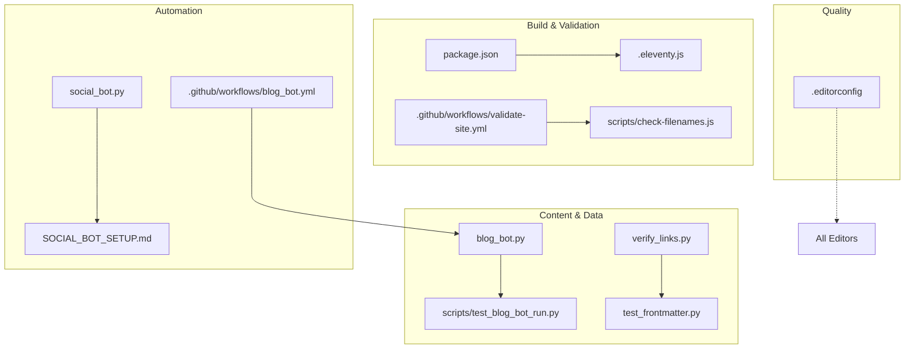
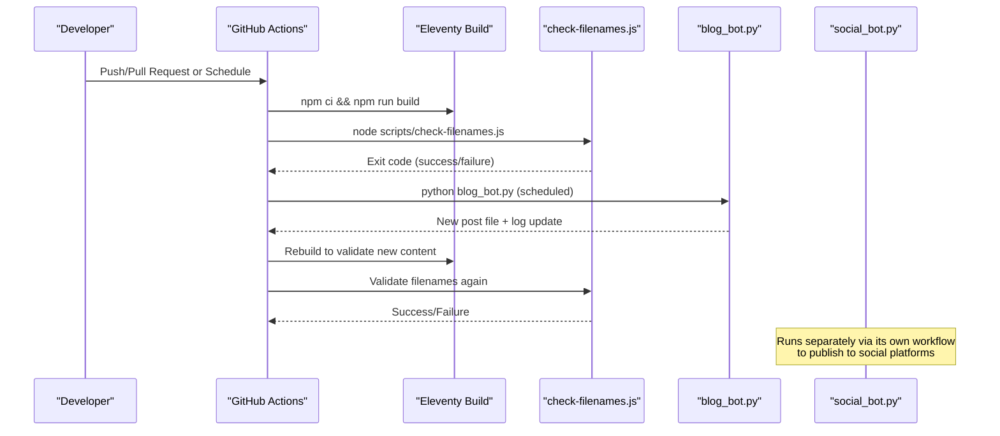
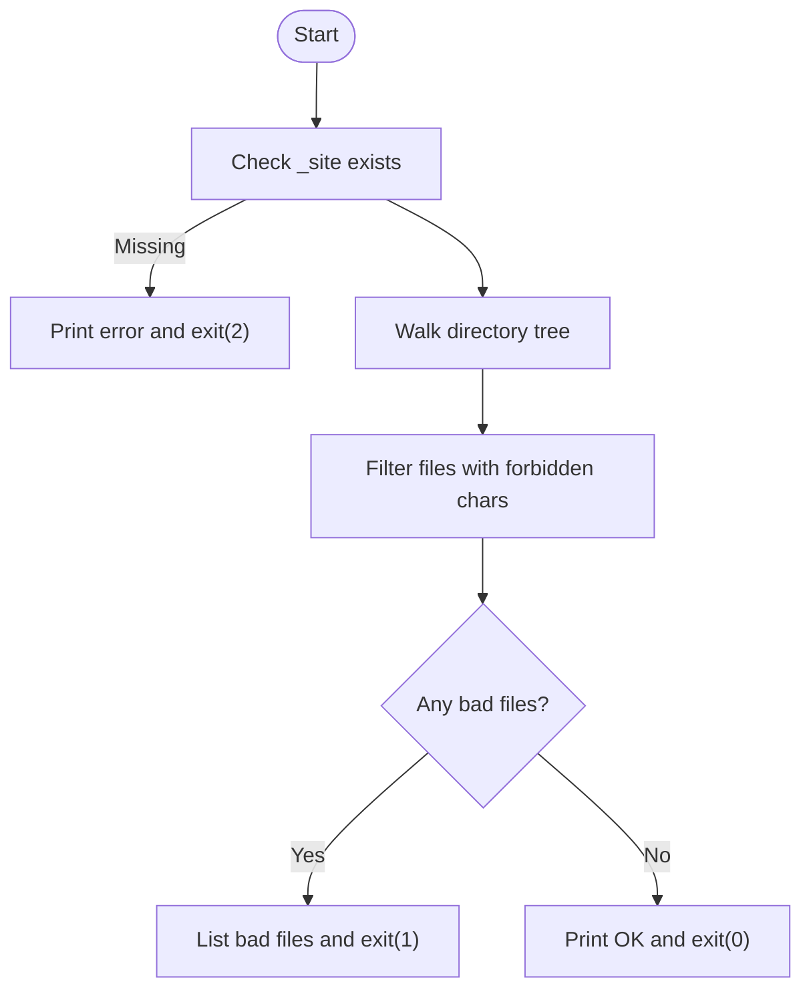
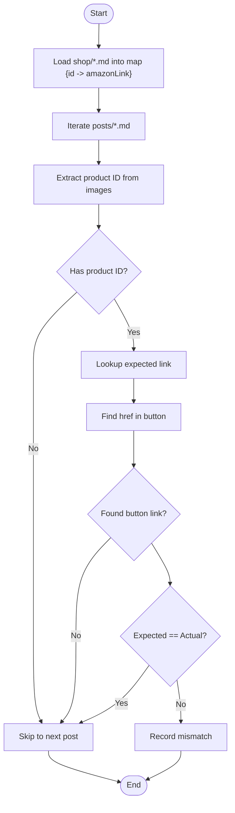
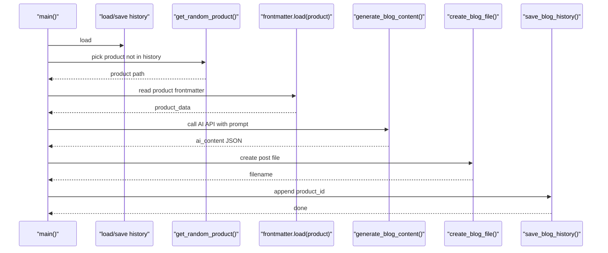
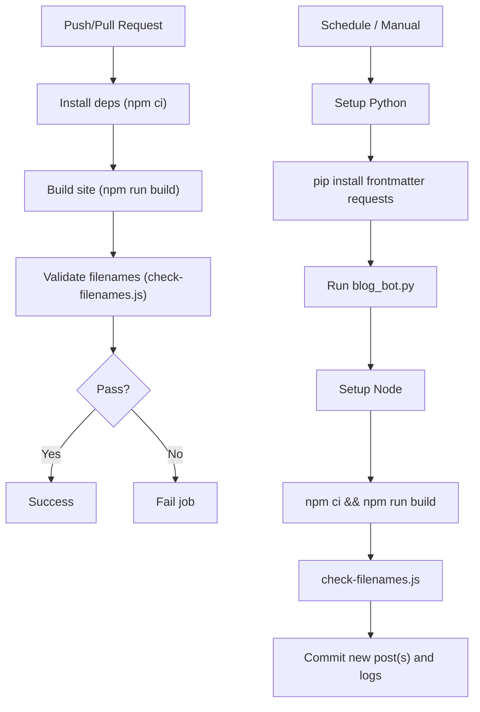
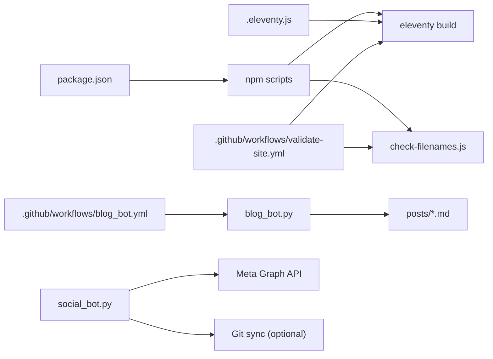

# Development Tools and Utilities

<cite>
**Referenced Files in This Document**
- [package.json](file://package.json)
- [.eleventy.js](file://.eleventy.js)
- [scripts/check-filenames.js](file://scripts/check-filenames.js)
- [verify_links.py](file://verify_links.py)
- [test_frontmatter.py](file://test_frontmatter.py)
- [scripts/test_blog_bot_run.py](file://scripts/test_blog_bot_run.py)
- [blog_bot.py](file://blog_bot.py)
- [social_bot.py](file://social_bot.py)
- [.github/workflows/validate-site.yml](file://.github/workflows/validate-site.yml)
- [.github/workflows/blog_bot.yml](file://.github/workflows/blog_bot.yml)
- [.editorconfig](file://.editorconfig)
- [SOCIAL_BOT_SETUP.md](file://SOCIAL_BOT_SETUP.md)
</cite>

## Table of Contents
1. Introduction
2. Project Structure
3. Core Components
4. Architecture Overview
5. Detailed Component Analysis
6. Dependency Analysis
7. Performance Considerations
8. Troubleshooting Guide
9. Conclusion

## Introduction
This document explains the development tools, validation scripts, testing utilities, and automation workflows used in the Nillianstore2 project. It covers:
- Build-time validation for generated filenames
- Link verification between blog posts and shop products
- Frontmatter sanity checks
- Blog content generation and social media posting automation
- Code quality configuration and formatting standards
- Extensibility patterns for custom validations and automation
- Debugging approaches and workflow optimization tips

## Project Structure
The repository uses Eleventy as the static site generator with Node-based build scripts and Python automation for content and social media tasks. Key directories and files relevant to development tooling include:
- scripts/: Node and Python utilities for validation and testing
- .github/workflows/: CI jobs that validate builds and run automation
- Root-level Python scripts for content generation and social posting
- Configuration files for editor behavior and Eleventy settings



**Diagram sources**
- [package.json:1-34](file://package.json#L1-L34)
- [.eleventy.js:1-160](file://.eleventy.js#L1-L160)
- [scripts/check-filenames.js:1-45](file://scripts/check-filenames.js#L1-L45)
- [.github/workflows/validate-site.yml:1-22](file://.github/workflows/validate-site.yml#L1-L22)
- [blog_bot.py:1-253](file://blog_bot.py#L1-L253)
- [scripts/test_blog_bot_run.py:1-10](file://scripts/test_blog_bot_run.py#L1-L10)
- [verify_links.py:1-55](file://verify_links.py#L1-L55)
- [test_frontmatter.py:1-17](file://test_frontmatter.py#L1-L17)
- [social_bot.py:1-315](file://social_bot.py#L1-L315)
- [.github/workflows/blog_bot.yml:1-52](file://.github/workflows/blog_bot.yml#L1-L52)
- [.editorconfig:1-10](file://.editorconfig#L1-L10)
- [SOCIAL_BOT_SETUP.md:1-106](file://SOCIAL_BOT_SETUP.md#L1-L106)

**Section sources**
- [package.json:1-34](file://package.json#L1-L34)
- [.eleventy.js:1-160](file://.eleventy.js#L1-L160)
- [.github/workflows/validate-site.yml:1-22](file://.github/workflows/validate-site.yml#L1-L22)
- [.github/workflows/blog_bot.yml:1-52](file://.github/workflows/blog_bot.yml#L1-L52)
- [.editorconfig:1-10](file://.editorconfig#L1-L10)

## Core Components
- Filename validator (Node): Ensures no forbidden characters appear in generated filenames under the output directory.
- Link verifier (Python): Cross-checks Amazon links referenced in blog posts against product metadata.
- Frontmatter tester (Python): Quick sanity check for product frontmatter fields.
- Blog generator (Python): Creates SEO-optimized blog posts from product data using an AI API.
- Social bot (Python): Generates captions and publishes to Instagram/Facebook; logs results and syncs to Git.
- CI pipelines: Build validation and automated blog generation workflows.
- Editor config: Consistent indentation, line endings, and whitespace trimming across editors.

**Section sources**
- [scripts/check-filenames.js:1-45](file://scripts/check-filenames.js#L1-L45)
- [verify_links.py:1-55](file://verify_links.py#L1-L55)
- [test_frontmatter.py:1-17](file://test_frontmatter.py#L1-L17)
- [blog_bot.py:1-253](file://blog_bot.py#L1-L253)
- [social_bot.py:1-315](file://social_bot.py#L1-L315)
- [.github/workflows/validate-site.yml:1-22](file://.github/workflows/validate-site.yml#L1-L22)
- [.github/workflows/blog_bot.yml:1-52](file://.github/workflows/blog_bot.yml#L1-L52)
- [.editorconfig:1-10](file://.editorconfig#L1-L10)

## Architecture Overview
The development toolchain integrates Node-based build validation with Python automation for content and social publishing. CI orchestrates these steps on push or schedule.



**Diagram sources**
- [.github/workflows/validate-site.yml:1-22](file://.github/workflows/validate-site.yml#L1-L22)
- [scripts/check-filenames.js:1-45](file://scripts/check-filenames.js#L1-L45)
- [.github/workflows/blog_bot.yml:1-52](file://.github/workflows/blog_bot.yml#L1-L52)
- [blog_bot.py:1-253](file://blog_bot.py#L1-L253)
- [social_bot.py:1-315](file://social_bot.py#L1-L315)

## Detailed Component Analysis

### Filename Validator (Node)
Purpose:
- Scans the built site directory for filenames containing forbidden characters and fails fast if found.

Key behaviors:
- Requires the output directory to exist before scanning.
- Recursively walks all files and filters by a simple regex pattern.
- Exits with distinct codes for success, validation failure, and errors.



**Diagram sources**
- [scripts/check-filenames.js:1-45](file://scripts/check-filenames.js#L1-L45)

**Section sources**
- [scripts/check-filenames.js:1-45](file://scripts/check-filenames.js#L1-L45)
- [.github/workflows/validate-site.yml:1-22](file://.github/workflows/validate-site.yml#L1-L22)

### Link Verifier (Python)
Purpose:
- Validates that each blog post’s Amazon button link matches the expected product link derived from the corresponding shop product file.

Processing logic:
- Loads all shop markdown files and maps product IDs to their Amazon links.
- For each blog post, extracts the product ID from image references and compares the button link to the expected one.
- Reports mismatches or confirms correctness.



**Diagram sources**
- [verify_links.py:1-55](file://verify_links.py#L1-L55)

**Section sources**
- [verify_links.py:1-55](file://verify_links.py#L1-L55)

### Frontmatter Tester (Python)
Purpose:
- Quick smoke test to ensure specific product files have expected frontmatter fields.

Usage:
- Run locally to verify sample product entries parse correctly and expose required keys.

**Section sources**
- [test_frontmatter.py:1-17](file://test_frontmatter.py#L1-L17)

### Blog Generator (Python)
Purpose:
- Selects a product, generates SEO-friendly blog content via an AI API, writes a new Markdown post, and records history.

Key responsibilities:
- Product selection with history tracking to avoid duplicates.
- Content generation prompt tailored to the store context.
- Safe slugification and tag sanitization to prevent invalid filenames.
- Post creation with structured frontmatter and embedded assets.
- Logging of processed product IDs.



**Diagram sources**
- [blog_bot.py:1-253](file://blog_bot.py#L1-L253)

**Section sources**
- [blog_bot.py:1-253](file://blog_bot.py#L1-L253)
- [scripts/test_blog_bot_run.py:1-10](file://scripts/test_blog_bot_run.py#L1-L10)

### Social Media Bot (Python)
Purpose:
- Generates engaging captions and publishes to Instagram and Facebook, then persists a posting log and optionally syncs it to the repository.

Highlights:
- Reads environment variables for API credentials.
- Parses product data and normalizes image URLs.
- Posts single images or carousels to Instagram; posts to Facebook.
- Retries up to three times with different products on failure.
- Syncs social_log.json back to the repo when a token is available.

```mermaid
sequenceDiagram
participant Runner as "main()"
participant Env as "env secrets"
participant Picker as "get_random_product()"
participant Parser as "parse_product()"
participant Gen as "generate_content()"
participant IG as "post_to_instagram()"
participant FB as "post_to_facebook()"
participant Save as "save_posted_history()"
participant Sync as "sync_log_to_github()"
Runner->>Env : validate required secrets
loop up to 3 attempts
Runner->>Picker : select product excluding failed_ids
Picker-->>Runner : product path
Runner->>Parser : extract title/images/link
Parser-->>Runner : product_data
Runner->>Gen : generate caption+hashtags
Gen-->>Runner : content
Runner->>IG : publish (single/carousel)
IG-->>Runner : creation/publish id or error
Runner->>FB : publish photo
FB-->>Runner : post id or error
alt success
Runner->>Save : append product_id
Runner->>Sync : commit and push log (optional)
break
else failure
Runner->>Runner : add to failed_ids
end
end
```

**Diagram sources**
- [social_bot.py:1-315](file://social_bot.py#L1-L315)

**Section sources**
- [social_bot.py:1-315](file://social_bot.py#L1-L315)
- [SOCIAL_BOT_SETUP.md:1-106](file://SOCIAL_BOT_SETUP.md#L1-L106)

### CI Pipelines
- Site validation pipeline:
  - Installs dependencies, builds the site, and runs the filename checker.
- Automated blog generation pipeline:
  - Sets up Python, installs dependencies, runs the blog generator, rebuilds the site, validates filenames, and commits new posts.



**Diagram sources**
- [.github/workflows/validate-site.yml:1-22](file://.github/workflows/validate-site.yml#L1-L22)
- [.github/workflows/blog_bot.yml:1-52](file://.github/workflows/blog_bot.yml#L1-L52)

**Section sources**
- [.github/workflows/validate-site.yml:1-22](file://.github/workflows/validate-site.yml#L1-L22)
- [.github/workflows/blog_bot.yml:1-52](file://.github/workflows/blog_bot.yml#L1-L52)

### Editor Configuration and Formatting Standards
- Enforces consistent indentation, line endings, final newline insertion, trailing whitespace trimming, and UTF-8 encoding across editors.

**Section sources**
- [.editorconfig:1-10](file://.editorconfig#L1-L10)

## Dependency Analysis
- Build orchestration:
  - package.json defines scripts for building, watching, serving, and debugging.
  - The filename checker is invoked both locally and in CI.
- Eleventy configuration:
  - Adds plugins, global data, layout aliases, filters, collections, passthrough copies, and markdown library setup.
- Automation:
  - Python scripts depend on frontmatter parsing and HTTP requests.
  - GitHub Actions provide runtime environments and secrets injection.



**Diagram sources**
- [package.json:1-34](file://package.json#L1-L34)
- [.eleventy.js:1-160](file://.eleventy.js#L1-L160)
- [.github/workflows/blog_bot.yml:1-52](file://.github/workflows/blog_bot.yml#L1-L52)
- [.github/workflows/validate-site.yml:1-22](file://.github/workflows/validate-site.yml#L1-L22)
- [social_bot.py:1-315](file://social_bot.py#L1-L315)

**Section sources**
- [package.json:1-34](file://package.json#L1-L34)
- [.eleventy.js:1-160](file://.eleventy.js#L1-L160)

## Performance Considerations
- Keep the list of recent posted products bounded to reduce I/O overhead.
- Prefer incremental builds during local development using watch mode.
- Cache external API responses where appropriate to minimize rate-limit risks.
- Avoid unnecessary full re-scans; target only changed directories when extending validators.

## Troubleshooting Guide
Common issues and resolutions:
- Missing environment variables:
  - Ensure required secrets are configured in GitHub Settings > Secrets and variables > Actions.
  - Refer to the setup guide for exact secret names and how to obtain them.
- Expired tokens:
  - If social APIs report token expiration, refresh long-lived tokens and update repository secrets.
- Build failures due to filenames:
  - Run the filename checker locally to identify problematic outputs and adjust slugs or tags accordingly.
- Link mismatches:
  - Use the link verifier to detect inconsistencies between blog posts and shop product metadata.

Operational tips:
- Local development:
  - Use the provided scripts to serve and debug the site.
- Automation logs:
  - Inspect workflow logs for detailed error messages and stack traces.

**Section sources**
- [SOCIAL_BOT_SETUP.md:1-106](file://SOCIAL_BOT_SETUP.md#L1-L106)
- [social_bot.py:1-315](file://social_bot.py#L1-L315)
- [scripts/check-filenames.js:1-45](file://scripts/check-filenames.js#L1-L45)
- [verify_links.py:1-55](file://verify_links.py#L1-L55)

## Conclusion
Nillianstore2’s development toolset combines robust build-time validation with Python-driven automation for content generation and social publishing. The included scripts and CI workflows help maintain high-quality outputs, enforce naming conventions, and streamline repetitive tasks. By following the guidance here, you can extend validations, add new automation, and optimize your development workflow effectively.