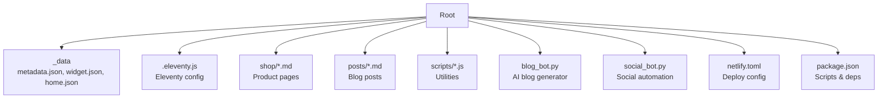
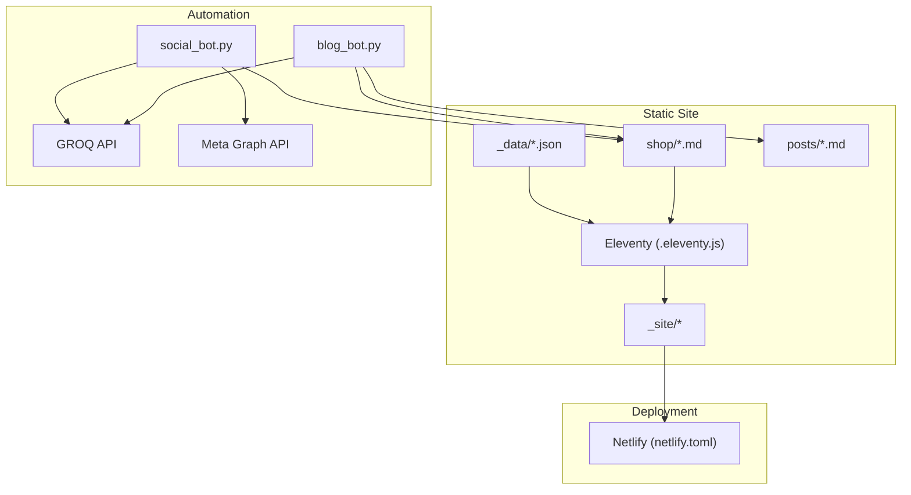
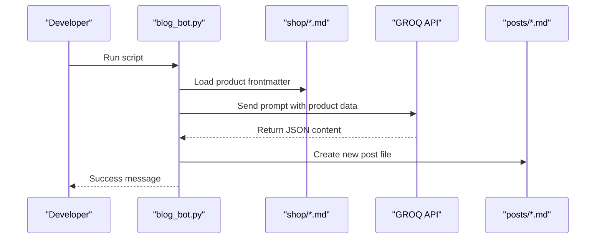
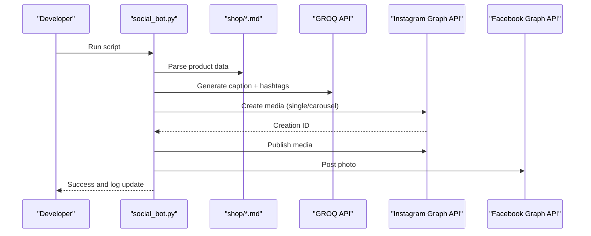
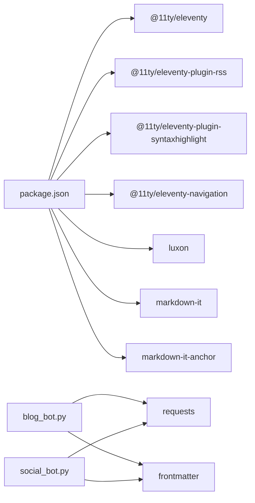

# Getting Started Guide

<cite>
**Referenced Files in This Document**
- [README.md](file://README.md)
- [package.json](file://package.json)
- [.eleventy.js](file://.eleventy.js)
- [_data/metadata.json](file://_data/metadata.json)
- [_data/widget.json](file://_data/widget.json)
- [_data/home.json](file://_data/home.json)
- [netlify.toml](file://netlify.toml)
- [blog_bot.py](file://blog_bot.py)
- [social_bot.py](file://social_bot.py)
- [SOCIAL_BOT_SETUP.md](file://SOCIAL_BOT_SETUP.md)
- [shop/B0CLHGCYRN.md](file://shop/B0CLHGCYRN.md)
</cite>

## Table of Contents
1. Introduction
2. Project Structure
3. Core Components
4. Architecture Overview
5. Detailed Component Analysis
6. Dependency Analysis
7. Performance Considerations
8. Troubleshooting Guide
9. Conclusion

## Introduction
This guide helps you set up and run the Nillianstore2 platform, a static site built with Eleventy (11ty) that powers an online shop and automated content workflows. You will:
- Install prerequisites (Node.js and Python)
- Configure environment variables for AI and social media integrations
- Build and run the development server
- Customize site metadata, theme selection, and widget settings
- Add your first product and generate automated blog posts
- Troubleshoot common setup issues, especially API integrations

The project is designed to be beginner-friendly while providing clear technical requirements and configuration steps.

## Project Structure
At a high level, the repository includes:
- Eleventy configuration and data files for site behavior and UI
- Product catalog and blog post directories
- Automation scripts for generating blog content and posting to social media
- Deployment configuration for Netlify

**Diagram sources**
- [.eleventy.js:1-160](file://.eleventy.js#L1-L160)
- [_data/metadata.json:1-27](file://_data/metadata.json#L1-L27)
- [_data/widget.json:1-7](file://_data/widget.json#L1-L7)
- [_data/home.json:1-12](file://_data/home.json#L1-L12)
- [shop/B0CLHGCYRN.md:1-55](file://shop/B0CLHGCYRN.md#L1-L55)
- [blog_bot.py:1-253](file://blog_bot.py#L1-L253)
- [social_bot.py:1-315](file://social_bot.py#L1-L315)
- [netlify.toml:1-3](file://netlify.toml#L1-L3)
- [package.json:1-34](file://package.json#L1-L34)

**Section sources**
- [README.md:1-64](file://README.md#L1-L64)
- [package.json:1-34](file://package.json#L1-L34)
- [.eleventy.js:1-160](file://.eleventy.js#L1-L160)

## Core Components
- Site configuration and global data
  - Eleventy config defines plugins, filters, collections, passthrough assets, markdown library, and output directory.
  - Global site URL and deep merge are enabled.
- Data layer
  - metadata.json holds site-wide SEO and author info.
  - widget.json provides help/contact widget text.
  - home.json controls homepage hero and feature blocks.
- Shop and posts
  - Products are Markdown files under shop/ with frontmatter fields like title, description, price, images, and links.
  - Blog posts live under posts/ and can be generated automatically from products.
- Automation
  - blog_bot.py generates SEO-optimized blog posts using GROQ AI based on product data.
  - social_bot.py creates social captions via GROQ AI and publishes to Instagram/Facebook using Meta Graph API.
- Deployment
  - netlify.toml sets publish folder and build command.

**Section sources**
- [.eleventy.js:1-160](file://.eleventy.js#L1-L160)
- [_data/metadata.json:1-27](file://_data/metadata.json#L1-L27)
- [_data/widget.json:1-7](file://_data/widget.json#L1-L7)
- [_data/home.json:1-12](file://_data/home.json#L1-L12)
- [shop/B0CLHGCYRN.md:1-55](file://shop/B0CLHGCYRN.md#L1-L55)
- [blog_bot.py:1-253](file://blog_bot.py#L1-L253)
- [social_bot.py:1-315](file://social_bot.py#L1-L315)
- [netlify.toml:1-3](file://netlify.toml#L1-L3)

## Architecture Overview
The platform combines a static site generator with AI-driven content generation and social publishing.

**Diagram sources**
- [.eleventy.js:1-160](file://.eleventy.js#L1-L160)
- [blog_bot.py:1-253](file://blog_bot.py#L1-L253)
- [social_bot.py:1-315](file://social_bot.py#L1-L315)
- [netlify.toml:1-3](file://netlify.toml#L1-L3)

## Detailed Component Analysis

### Prerequisites
- Node.js (for Eleventy and npm scripts)
- Python 3 (for automation scripts)
- Required API keys and tokens:
  - GROQ_API_KEY for content generation
  - For social automation: META_ACCESS_TOKEN, FB_PAGE_ID, IG_USER_ID
  - Optional: GITHUB_TOKEN for log syncing

Where to configure secrets:
- Local development: export as environment variables before running scripts
- GitHub Actions: add repository secrets as described in the social bot setup guide

**Section sources**
- [package.json:1-34](file://package.json#L1-L34)
- [blog_bot.py:1-253](file://blog_bot.py#L1-L253)
- [social_bot.py:1-315](file://social_bot.py#L1-L315)
- [SOCIAL_BOT_SETUP.md:1-106](file://SOCIAL_BOT_SETUP.md#L1-L106)

### Installation and Environment Setup
1. Clone the repository and open it in your terminal.
2. Install dependencies:
   - Run npm install
3. Set environment variables:
   - GROQ_API_KEY
   - For social automation: META_ACCESS_TOKEN, FB_PAGE_ID, IG_USER_ID
   - Optional: GITHUB_TOKEN
4. Verify installation by building or starting the dev server (see next section).

**Section sources**
- [package.json:1-34](file://package.json#L1-L34)

### Development Server and Build Commands
- Start local development server with live reload:
  - npm start or npm run serve
- Watch mode for incremental builds:
  - npm run watch
- Build production output:
  - npm run build
- Debug mode:
  - npm run debug

Notes:
- Eleventy outputs to _site/.
- The dev server integrates BrowserSync middleware to handle 404s during development.

**Section sources**
- [package.json:1-34](file://package.json#L1-L34)
- [.eleventy.js:118-132](file://.eleventy.js#L118-L132)
- [.eleventy.js:146-159](file://.eleventy.js#L146-L159)

### Basic Configuration
- Site metadata
  - Edit _data/metadata.json to update site title, description, language, locale, icon, feed paths, and author details.
- Theme selection
  - The project includes multiple themes; choose one by referencing the appropriate layout/theme include in your templates.
- Widget settings
  - Update _data/widget.json to change help text, button label, and contact link.
- Homepage content
  - Adjust _data/home.json to modify hero cover, icons, titles, and intro text.

**Section sources**
- [_data/metadata.json:1-27](file://_data/metadata.json#L1-L27)
- [_data/widget.json:1-7](file://_data/widget.json#L1-L7)
- [_data/home.json:1-12](file://_data/home.json#L1-L12)

### Adding Your First Product
1. Create a new Markdown file under shop/ named with a unique ID (e.g., BXXXXXXXXX.md).
2. Include frontmatter fields such as:
   - title, description, price, cover, images[], amazonLink, permalink, date
   - Optional: bullet_points, image_alts, tags, category
3. Write product content below the frontmatter.
4. Rebuild or restart the dev server to see the new product page.

Example reference:
- See an existing product file for structure and field usage.

**Section sources**
- [shop/B0CLHGCYRN.md:1-55](file://shop/B0CLHGCYRN.md#L1-L55)

### Generating Automated Content (Blog Posts)
- Purpose: Automatically create SEO-optimized blog posts from product data using GROQ AI.
- Requirements:
  - GROQ_API_KEY must be set
  - At least one product exists in shop/
- Workflow:
  - Select a product not yet used for blogging
  - Generate structured content via GROQ API
  - Write a new Markdown post under posts/ with frontmatter and body
  - Record history to avoid repeating the same product
- Run locally:
  - python blog_bot.py

**Diagram sources**
- [blog_bot.py:1-253](file://blog_bot.py#L1-L253)

**Section sources**
- [blog_bot.py:1-253](file://blog_bot.py#L1-L253)

### Social Media Automation (Instagram and Facebook)
- Purpose: Generate engaging captions and publish to Instagram and Facebook using Meta Graph API.
- Requirements:
  - GROQ_API_KEY
  - META_ACCESS_TOKEN, FB_PAGE_ID, IG_USER_ID
  - Optional: GITHUB_TOKEN for log sync
- Behavior:
  - Picks a random product not recently posted
  - Generates caption and hashtags via GROQ
  - Publishes single image or carousel to Instagram
  - Publishes photo to Facebook Page
  - Logs posted IDs and optionally syncs to GitHub
- Run locally:
  - python social_bot.py

**Diagram sources**
- [social_bot.py:1-315](file://social_bot.py#L1-L315)

**Section sources**
- [social_bot.py:1-315](file://social_bot.py#L1-L315)
- [SOCIAL_BOT_SETUP.md:1-106](file://SOCIAL_BOT_SETUP.md#L1-L106)

### First-Time User Workflow
1. Install dependencies and set environment variables.
2. Start the development server to preview changes.
3. Add a product under shop/ with required frontmatter.
4. Optionally run blog_bot.py to generate a blog post from the product.
5. Optionally run social_bot.py to publish a social post.
6. Build the site for production deployment.

**Section sources**
- [package.json:1-34](file://package.json#L1-L34)
- [shop/B0CLHGCYRN.md:1-55](file://shop/B0CLHGCYRN.md#L1-L55)
- [blog_bot.py:1-253](file://blog_bot.py#L1-L253)
- [social_bot.py:1-315](file://social_bot.py#L1-L315)

## Dependency Analysis
Key runtime and build-time dependencies:
- Eleventy core and plugins for RSS, syntax highlighting, navigation
- Luxon for date formatting
- Markdown-it and anchor plugin for enhanced Markdown processing
- Scripts use requests and frontmatter libraries for automation

**Diagram sources**
- [package.json:1-34](file://package.json#L1-L34)
- [blog_bot.py:1-253](file://blog_bot.py#L1-L253)
- [social_bot.py:1-315](file://social_bot.py#L1-L315)

**Section sources**
- [package.json:1-34](file://package.json#L1-L34)

## Performance Considerations
- Use Eleventy’s watch mode during development for fast feedback.
- Keep product images optimized and use web formats where possible.
- Avoid excessive tags or very long descriptions to keep builds quick.
- Cache or limit repeated API calls when testing automation locally.

[No sources needed since this section provides general guidance]

## Troubleshooting Guide
Common issues and resolutions:
- Missing environment variables
  - Ensure GROQ_API_KEY is set before running automation scripts.
  - For social automation, verify META_ACCESS_TOKEN, FB_PAGE_ID, IG_USER_ID are configured.
- API errors
  - Check response logs for status codes and error messages.
  - If token expired (error code 190), refresh your access token and update secrets.
- No posts happening
  - Confirm there are product files in shop/ with images and links.
  - Manually trigger the workflow or run the script locally.
- Build failures
  - Verify Node.js version compatibility and reinstall dependencies if needed.
  - Check Eleventy config and data files for syntax errors.

For detailed secret management and troubleshooting steps, refer to the social bot setup guide.

**Section sources**
- [blog_bot.py:1-253](file://blog_bot.py#L1-L253)
- [social_bot.py:1-315](file://social_bot.py#L1-L315)
- [SOCIAL_BOT_SETUP.md:1-106](file://SOCIAL_BOT_SETUP.md#L1-L106)

## Conclusion
You now have the essentials to set up, customize, and operate Nillianstore2. Start by installing dependencies and configuring environment variables, then add products and leverage automation to grow your content and social presence. Refer to the troubleshooting section if you encounter issues with APIs or builds.

[No sources needed since this section summarizes without analyzing specific files]