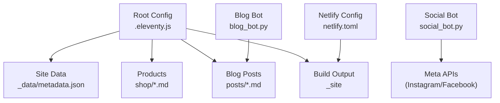
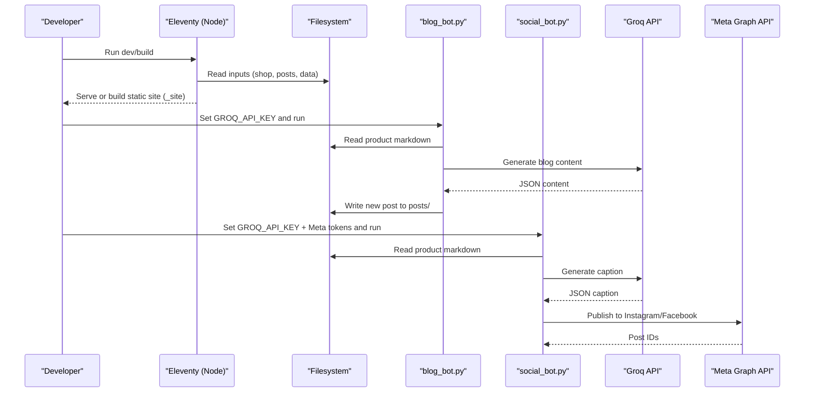
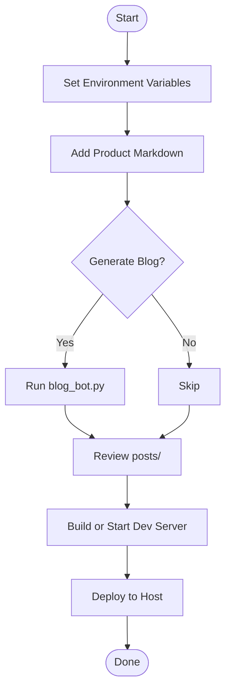
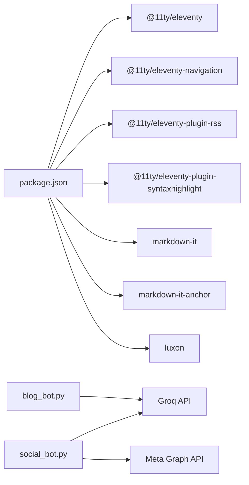

# Getting Started

<cite>
**Referenced Files in This Document**
- [README.md](file://README.md)
- [package.json](file://package.json)
- [.eleventy.js](file://.eleventy.js)
- [netlify.toml](file://netlify.toml)
- [blog_bot.py](file://blog_bot.py)
- [social_bot.py](file://social_bot.py)
- [SOCIAL_BOT_SETUP.md](file://SOCIAL_BOT_SETUP.md)
- [_data/metadata.json](file://_data/metadata.json)
- [shop/B0CLHGCYRN.md](file://shop/B0CLHGCYRN.md)
</cite>

## Table of Contents
1. Introduction
2. Project Structure
3. Core Components
4. Architecture Overview
5. Detailed Component Analysis
6. Dependency Analysis
7. Performance Considerations
8. Troubleshooting Guide
9. Conclusion
10. Appendices

## Introduction
Nillianstore2 is an AI-powered, static e-commerce site built with Eleventy (11ty). It combines a simple product catalog with automated blog and social media content generation using Groq AI. You can run the site locally, add products, generate SEO-friendly blog posts, and deploy to Netlify or other static hosts. The project also includes optional automation for posting to Instagram and Facebook via Meta Graph API.

This guide helps you set up the environment, install dependencies, configure secrets, run the development server, add a product, generate a blog post, and deploy your site.

## Project Structure
At a high level:
- Eleventy configuration and plugins are defined in the root config file.
- Site data lives under _data.
- Products are Markdown files under shop.
- Generated blog posts live under posts.
- Build output goes to _site.
- Deployment configuration is provided for Netlify.

**Diagram sources**
- [.eleventy.js:1-160](file://.eleventy.js#L1-L160)
- [_data/metadata.json:1-27](file://_data/metadata.json#L1-L27)
- [netlify.toml:1-3](file://netlify.toml#L1-L3)
- [blog_bot.py:1-253](file://blog_bot.py#L1-L253)
- [social_bot.py:1-315](file://social_bot.py#L1-L315)

**Section sources**
- [.eleventy.js:1-160](file://.eleventy.js#L1-L160)
- [package.json:1-34](file://package.json#L1-L34)
- [netlify.toml:1-3](file://netlify.toml#L1-L3)
- [_data/metadata.json:1-27](file://_data/metadata.json#L1-L27)

## Core Components
- Static site generator: Eleventy builds your site from Markdown and Nunjucks templates into a static output folder.
- Product catalog: Each product is a Markdown file with frontmatter describing title, images, price, tags, and links.
- Blog automation: A Python script reads a product, calls Groq AI to generate a blog post, and writes it to the posts directory.
- Social automation: Another Python script generates captions and publishes to Instagram and Facebook via Meta Graph API.
- Deployment: Netlify configuration points to the build output folder and sets the build command.

Key responsibilities:
- .eleventy.js: Registers plugins, filters, collections, passthrough assets, and defines input/output directories.
- package.json: Defines scripts for building, watching, serving, and debugging.
- netlify.toml: Tells Netlify where to publish and how to build.
- blog_bot.py: Uses GROQ_API_KEY to generate blog content and write posts.
- social_bot.py: Uses GROQ_API_KEY and Meta tokens to create and publish social posts.

**Section sources**
- [.eleventy.js:1-160](file://.eleventy.js#L1-L160)
- [package.json:1-34](file://package.json#L1-L34)
- [netlify.toml:1-3](file://netlify.toml#L1-L3)
- [blog_bot.py:1-253](file://blog_bot.py#L1-L253)
- [social_bot.py:1-315](file://social_bot.py#L1-L315)

## Architecture Overview
The system integrates three layers:
- Content layer: Products and pages as Markdown with frontmatter.
- Generation layer: Python bots call Groq AI to produce blog posts and social captions.
- Distribution layer: Eleventy builds the site; Netlify deploys it; optional social bots publish to Meta platforms.

**Diagram sources**
- [.eleventy.js:1-160](file://.eleventy.js#L1-L160)
- [blog_bot.py:1-253](file://blog_bot.py#L1-L253)
- [social_bot.py:1-315](file://social_bot.py#L1-L315)

## Detailed Component Analysis

### Prerequisites
- Node.js (for Eleventy and npm scripts)
- Python 3 (for blog and social bots)
- Internet access for external APIs (Groq AI and Meta Graph API)

Install Node.js and Python if not already installed on your machine. Verify installations by running their version commands in your terminal.

**Section sources**
- [package.json:1-34](file://package.json#L1-L34)
- [blog_bot.py:1-253](file://blog_bot.py#L1-L253)
- [social_bot.py:1-315](file://social_bot.py#L1-L315)

### Installation Steps
1. Clone the repository to your local machine.
2. Open a terminal in the project root.
3. Install Node dependencies:
   - Run the install command from package.json scripts.
4. Start the development server:
   - Use the serve/start script to run Eleventy in watch mode.
5. Open your browser at the local URL shown by Eleventy.

Notes:
- The build outputs to the _site directory.
- The development server uses Eleventy’s built-in watcher.

**Section sources**
- [package.json:1-34](file://package.json#L1-L34)
- [.eleventy.js:1-160](file://.eleventy.js#L1-L160)

### Basic Configuration
- Site metadata: Update global site info in the metadata file under _data.
- Netlify deployment: The netlify.toml file sets the publish folder and build command.

What to check:
- Ensure the site URL and author details in metadata match your domain and branding.
- Confirm that the build command and publish folder align with your hosting provider.

**Section sources**
- [_data/metadata.json:1-27](file://_data/metadata.json#L1-L27)
- [netlify.toml:1-3](file://netlify.toml#L1-L3)

### Environment Variables and API Keys
You need environment variables for the Python bots:
- GROQ_API_KEY: Required for both blog and social bots.
- For social bot only: META_ACCESS_TOKEN, FB_PAGE_ID, IG_USER_ID.
- Optional: GITHUB_TOKEN for syncing logs back to the repository.

How to set them:
- Locally: Export these variables in your shell before running the bots.
- In GitHub Actions: Add them as repository secrets following the setup guide.

Where they are used:
- blog_bot.py reads GROQ_API_KEY to call Groq AI.
- social_bot.py reads GROQ_API_KEY and Meta tokens to generate and publish posts.

For detailed steps to obtain each secret, see the social bot setup guide.

**Section sources**
- [blog_bot.py:1-253](file://blog_bot.py#L1-L253)
- [social_bot.py:1-315](file://social_bot.py#L1-L315)
- [SOCIAL_BOT_SETUP.md:1-106](file://SOCIAL_BOT_SETUP.md#L1-L106)

### Quick Start Examples

#### Add a Product
1. Create a new Markdown file in the shop directory.
2. Include frontmatter fields such as title, description, price, cover image, images array, tags, layout, permalink, and amazonLink.
3. Place any referenced images under the img directory so Eleventy can copy them to the build output.
4. Rebuild or restart the dev server to see the new product page.

Tip: Review an existing product file to match the structure and naming conventions.

**Section sources**
- [shop/B0CLHGCYRN.md:1-55](file://shop/B0CLHGCYRN.md#L1-L55)
- [.eleventy.js:1-160](file://.eleventy.js#L1-L160)

#### Generate a Blog Post
1. Ensure GROQ_API_KEY is set in your environment.
2. Run the blog bot script from the project root.
3. The script will:
   - Pick a random product from shop.
   - Call Groq AI to generate structured content.
   - Write a new Markdown post to the posts directory.
4. Rebuild or restart the dev server to view the generated post.

If you want to control which product is used, modify the selection logic in the script accordingly.

**Section sources**
- [blog_bot.py:1-253](file://blog_bot.py#L1-L253)

#### Deploy the Site
- Netlify:
  - Connect your repository to Netlify.
  - Netlify will use netlify.toml to build and publish the _site folder.
- Other static hosts:
  - Build locally using the build script.
  - Upload the contents of the _site folder to your host.

Verify that your custom domain and SSL settings are configured on your hosting provider.

**Section sources**
- [netlify.toml:1-3](file://netlify.toml#L1-L3)
- [package.json:1-34](file://package.json#L1-L34)

### Conceptual Overview
The typical workflow for a new user:
- Set up environment and secrets.
- Add products as Markdown files.
- Optionally generate blog posts using the blog bot.
- Optionally automate social posts using the social bot.
- Build and deploy the site.

[No sources needed since this diagram shows conceptual workflow, not actual code structure]

## Dependency Analysis
- Node dependencies include Eleventy core and several plugins for navigation, RSS, syntax highlighting, and markdown processing.
- Python dependencies include requests, frontmatter, and standard libraries for filesystem and datetime handling.
- External integrations:
  - Groq AI for content generation.
  - Meta Graph API for publishing to Instagram and Facebook.

**Diagram sources**
- [package.json:1-34](file://package.json#L1-L34)
- [blog_bot.py:1-253](file://blog_bot.py#L1-L253)
- [social_bot.py:1-315](file://social_bot.py#L1-L315)

**Section sources**
- [package.json:1-34](file://package.json#L1-L34)
- [blog_bot.py:1-253](file://blog_bot.py#L1-L253)
- [social_bot.py:1-315](file://social_bot.py#L1-L315)

## Performance Considerations
- Keep product images optimized and appropriately sized to reduce build and load times.
- Avoid excessive tags or very long descriptions in frontmatter to keep parsing fast.
- Use Eleventy’s watch mode during development to avoid full rebuilds.
- When generating content, consider batching or limiting runs to reduce API calls.

[No sources needed since this section provides general guidance]

## Troubleshooting Guide
Common issues and resolutions:
- Missing environment variables:
  - Ensure GROQ_API_KEY is set before running the bots.
  - For social bot, also set META_ACCESS_TOKEN, FB_PAGE_ID, and IG_USER_ID.
- API errors:
  - Check network connectivity and token validity.
  - Inspect error messages printed by the bots for specific codes.
- No posts happening:
  - Verify that the shop directory contains valid product Markdown files.
  - Confirm that the social bot has permissions for publishing.
- Build problems:
  - Clear the _site directory and rebuild.
  - Check that all required Node dependencies are installed.

For step-by-step secret management and troubleshooting, refer to the social bot setup guide.

**Section sources**
- [blog_bot.py:1-253](file://blog_bot.py#L1-L253)
- [social_bot.py:1-315](file://social_bot.py#L1-L315)
- [SOCIAL_BOT_SETUP.md:1-106](file://SOCIAL_BOT_SETUP.md#L1-L106)

## Conclusion
You now have everything needed to set up Nillianstore2, add products, generate AI-powered blog content, and deploy your site. Start with the prerequisites and installation steps, configure your environment variables, and then explore the quick start examples. If you encounter issues, consult the troubleshooting guide and linked documentation sections.

[No sources needed since this section summarizes without analyzing specific files]

## Appendices

### Appendix A: Scripts Reference
- Build: Runs Eleventy to generate static files.
- Watch: Watches source changes and rebuilds automatically.
- Serve: Starts a local development server with live reload.
- Debug: Runs Eleventy with debug logging enabled.

**Section sources**
- [package.json:1-34](file://package.json#L1-L34)

### Appendix B: Example Product Frontmatter Fields
Use these fields when creating a new product file in the shop directory:
- title
- description
- price
- cover
- images
- ecwidId
- category
- tags
- layout
- amazonLink
- permalink
- date
- bullet_points
- cover_alt
- image_alts

Reference an existing product file to ensure correct formatting and paths.

**Section sources**
- [shop/B0CLHGCYRN.md:1-55](file://shop/B0CLHGCYRN.md#L1-L55)