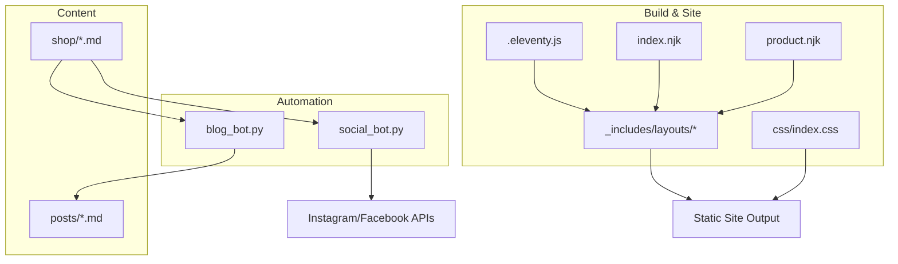
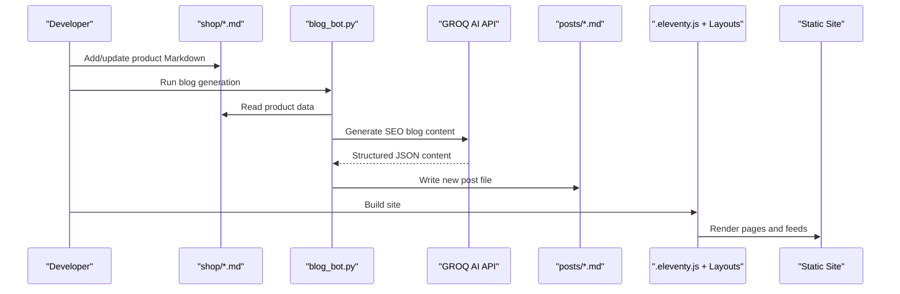
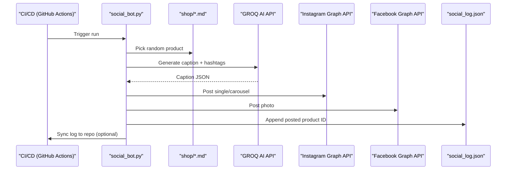
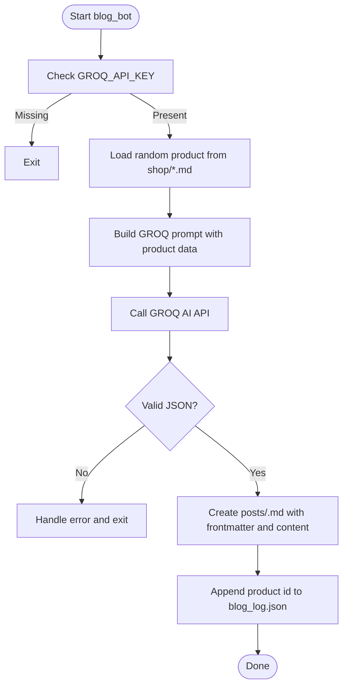
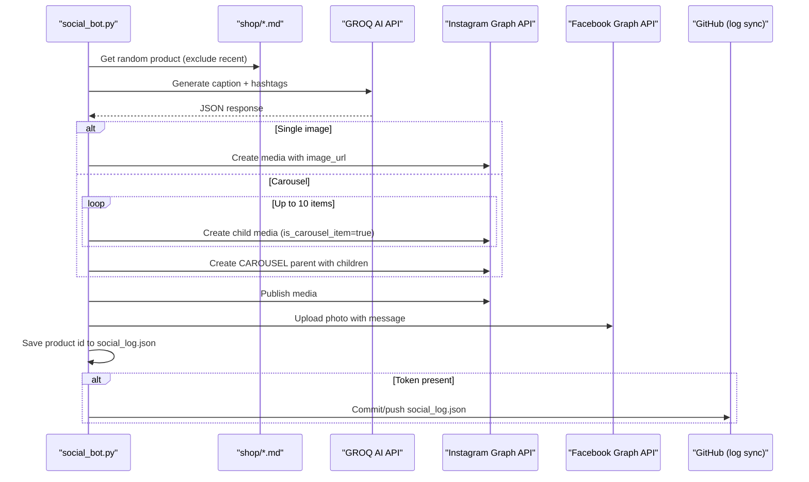
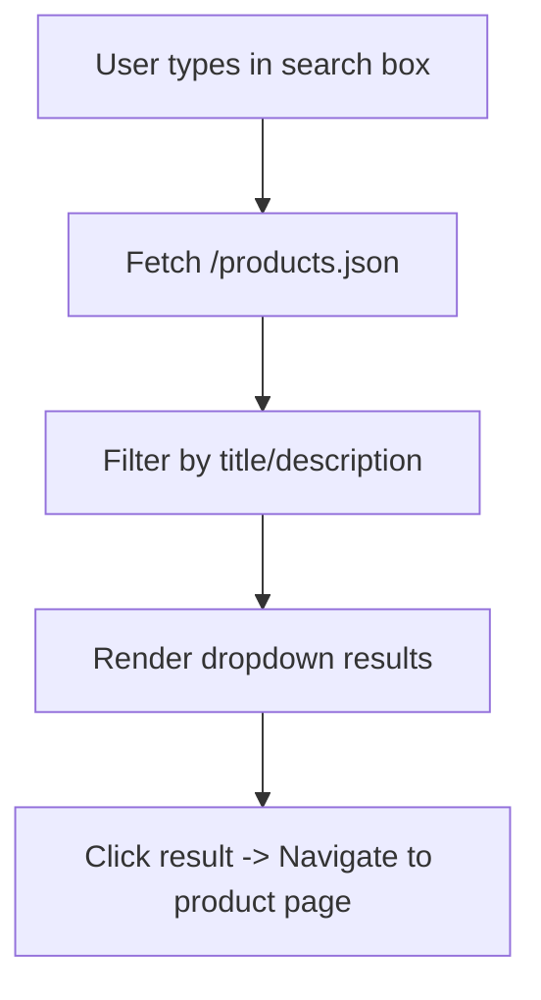
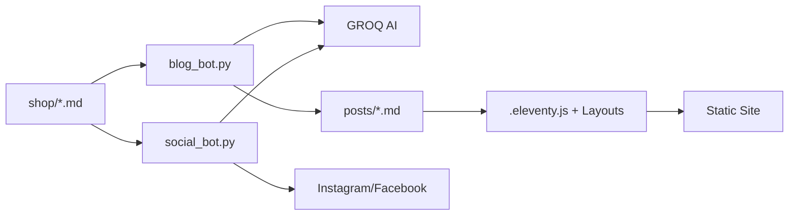
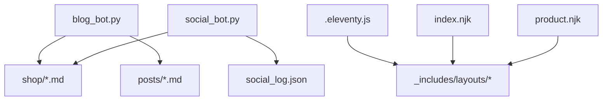

# Key Features

<cite>
**Referenced Files in This Document**
- [README.md](file://README.md)
- [blog_bot.py](file://blog_bot.py)
- [social_bot.py](file://social_bot.py)
- [SOCIAL_BOT_SETUP.md](file://SOCIAL_BOT_SETUP.md)
- [.eleventy.js](file://.eleventy.js)
- [index.njk](file://index.njk)
- [product.njk](file://product.njk)
- [_includes/layouts/base.njk](file://_includes/layouts/base.njk)
- [_includes/layouts/home.njk](file://_includes/layouts/home.njk)
- [shop/B0CLHGCYRN.md](file://shop/B0CLHGCYRN.md)
- [posts/best-gift-ideas-in-uae-2025.md](file://posts/best-gift-ideas-in-uae-2025.md)
- [css/index.css](file://css/index.css)
</cite>

## Table of Contents
1. [Introduction](#introduction)
2. [Project Structure](#project-structure)
3. [Core Components](#core-components)
4. [Architecture Overview](#architecture-overview)
5. [Detailed Component Analysis](#detailed-component-analysis)
6. [Dependency Analysis](#dependency-analysis)
7. [Performance Considerations](#performance-considerations)
8. [Troubleshooting Guide](#troubleshooting-guide)
9. [Conclusion](#conclusion)

## Introduction
Nillianstore2 is a static, SEO-focused e-commerce storefront built with Eleventy that integrates an automated content pipeline powered by GROQ AI. The platform automatically generates SEO-optimized blog posts from product data and publishes engaging social media content to Instagram and Facebook—complete with carousel support. The storefront is responsive and includes client-side product search for fast, frictionless browsing. The system is tailored for the UAE market, emphasizing local lifestyle context and Amazon.ae fulfillment links.

## Project Structure
The repository follows a clear separation between content (Markdown), templates (Nunjucks), configuration (Eleventy), automation scripts (Python), and assets:
- Content sources: shop/ (products), posts/ (generated blogs), _data/ (site metadata)
- Templates: _includes/layouts/*, _includes/desain/*, index.njk, product.njk
- Automation: blog_bot.py (AI blog generation), social_bot.py (social posting)
- Build and site config: .eleventy.js, package.json, css/index.css

**Diagram sources**
- [blog_bot.py:1-253](file://blog_bot.py#L1-L253)
- [social_bot.py:1-315](file://social_bot.py#L1-L315)
- [.eleventy.js:1-160](file://.eleventy.js#L1-L160)
- [index.njk:1-47](file://index.njk#L1-L47)
- [product.njk:1-10](file://product.njk#L1-L10)
- [_includes/layouts/base.njk:1-62](file://_includes/layouts/base.njk#L1-L62)
- [css/index.css:1-52](file://css/index.css#L1-L52)

**Section sources**
- [README.md:1-64](file://README.md#L1-L64)
- [.eleventy.js:1-160](file://.eleventy.js#L1-L160)
- [index.njk:1-47](file://index.njk#L1-L47)
- [product.njk:1-10](file://product.njk#L1-L10)
- [_includes/layouts/base.njk:1-62](file://_includes/layouts/base.njk#L1-L62)
- [css/index.css:1-52](file://css/index.css#L1-L52)

## Core Components
- AI-powered blog generator: Reads product Markdown files, calls GROQ AI to produce structured, SEO-optimized content, and writes new posts into the posts directory with frontmatter and embedded images and buy buttons.
- Social media automation bot: Selects products, generates captions and hashtags via GROQ AI, and posts to Instagram (single or carousel) and Facebook using Meta Graph API. Includes retry logic and log syncing to GitHub.
- Responsive storefront: Built with Eleventy and Nunjucks layouts; includes client-side product search powered by a generated JSON feed and responsive CSS for mobile-first design.
- Automated content pipeline: From product catalog to published blog posts and social media content, orchestrated by Python scripts and scheduled via CI/CD.

**Section sources**
- [blog_bot.py:1-253](file://blog_bot.py#L1-L253)
- [social_bot.py:1-315](file://social_bot.py#L1-L315)
- [_includes/layouts/base.njk:1-62](file://_includes/layouts/base.njk#L1-L62)
- [index.njk:1-47](file://index.njk#L1-L47)
- [css/index.css:1-52](file://css/index.css#L1-L52)

## Architecture Overview
The platform’s architecture connects content sources, automation scripts, external APIs, and the static site build process.

**Diagram sources**
- [blog_bot.py:1-253](file://blog_bot.py#L1-L253)
- [.eleventy.js:1-160](file://.eleventy.js#L1-L160)

**Diagram sources**
- [social_bot.py:1-315](file://social_bot.py#L1-L315)
- [SOCIAL_BOT_SETUP.md:1-106](file://SOCIAL_BOT_SETUP.md#L1-L106)

## Detailed Component Analysis

### AI-Powered Blog Generation System
- Purpose: Automatically create SEO-optimized blog posts from product data using GROQ AI.
- How it works:
  - Loads a product Markdown file from shop/.
  - Constructs a prompt with title, description, price, link, and images.
  - Calls GROQ AI to return structured JSON (title, description, tags, sections).
  - Writes a new Markdown post to posts/ with frontmatter, images, and a prominent “Buy on Amazon.ae” button.
  - Maintains a history file to avoid regenerating posts for the same product repeatedly.
- UAE focus: Prompts instruct the model to include UAE context (Dubai, Abu Dhabi, Sharjah) and trends.

**Diagram sources**
- [blog_bot.py:1-253](file://blog_bot.py#L1-L253)

Practical example and value proposition:
- Use case: A merchant adds a new home decor product to shop/. Running the blog bot produces a ready-to-publish article highlighting UAE lifestyle relevance, complete with images and a direct purchase link. This accelerates content creation and improves SEO visibility for location-specific queries.
- Example reference: See a generated post structure and style in [posts/best-gift-ideas-in-uae-2025.md:1-259](file://posts/best-gift-ideas-in-uae-2025.md#L1-L259).

**Section sources**
- [blog_bot.py:1-253](file://blog_bot.py#L1-L253)
- [posts/best-gift-ideas-in-uae-2025.md:1-259](file://posts/best-gift-ideas-in-uae-2025.md#L1-L259)

### Social Media Automation (Instagram and Facebook)
- Purpose: Automate daily/periodic social posts with engaging captions and hashtags generated by GROQ AI. Supports Instagram carousels.
- How it works:
  - Requires secrets: GROQ_API_KEY, META_ACCESS_TOKEN, FB_PAGE_ID, IG_USER_ID (and optional GITHUB_TOKEN).
  - Picks a random product not recently posted (tracked in social_log.json).
  - Generates caption and hashtags via GROQ AI.
  - Posts to Instagram (single image or carousel) and Facebook Page photo.
  - Retries up to three times with different products on failure.
  - Optionally syncs social_log.json back to the repository via Git.
- UAE focus: Captions are tailored for Nillian Store in the UAE, including relevant hashtags and call-to-action links.

**Diagram sources**
- [social_bot.py:1-315](file://social_bot.py#L1-L315)
- [SOCIAL_BOT_SETUP.md:1-106](file://SOCIAL_BOT_SETUP.md#L1-L106)

Practical example and value proposition:
- Use case: Every few hours, the bot selects a new product, crafts a compelling caption with UAE-centric hashtags, and publishes to both Instagram and Facebook. Carousels can showcase multiple angles or features, increasing engagement and click-throughs to Amazon.ae.
- Setup guidance: Refer to [SOCIAL_BOT_SETUP.md:1-106](file://SOCIAL_BOT_SETUP.md#L1-L106) for required secrets and permissions.

**Section sources**
- [social_bot.py:1-315](file://social_bot.py#L1-L315)
- [SOCIAL_BOT_SETUP.md:1-106](file://SOCIAL_BOT_SETUP.md#L1-L106)

### Responsive E-commerce Storefront with Product Search
- Purpose: Deliver a fast, mobile-friendly shopping experience with client-side product search.
- How it works:
  - Eleventy builds static pages using Nunjucks layouts and filters.
  - Client-side search script loads a generated products JSON feed and filters results by title and description in real time.
  - Responsive CSS ensures optimal display across devices, including adaptive video banners.
- UAE focus: Site URL and content emphasize UAE delivery via Amazon.ae.

**Diagram sources**
- [_includes/layouts/base.njk:1-62](file://_includes/layouts/base.njk#L1-L62)
- [.eleventy.js:1-160](file://.eleventy.js#L1-L160)
- [index.njk:1-47](file://index.njk#L1-L47)
- [css/index.css:1-52](file://css/index.css#L1-L52)

Practical example and value proposition:
- Use case: Shoppers quickly find specific items (e.g., “cloud ceiling lamp”) without leaving the homepage, improving conversion rates.
- Example product data: See [shop/B0CLHGCYRN.md:1-55](file://shop/B0CLHGCYRN.md#L1-L55) for a typical product entry used by the search and automation scripts.

**Section sources**
- [_includes/layouts/base.njk:1-62](file://_includes/layouts/base.njk#L1-L62)
- [.eleventy.js:1-160](file://.eleventy.js#L1-L160)
- [index.njk:1-47](file://index.njk#L1-L47)
- [css/index.css:1-52](file://css/index.css#L1-L52)
- [shop/B0CLHGCYRN.md:1-55](file://shop/B0CLHGCYRN.md#L1-L55)

### Automated Content Pipeline: From Catalog to Published Assets
- Inputs: Product Markdown files in shop/ with frontmatter (title, description, images, price, amazonLink).
- Outputs:
  - Blog posts in posts/ with SEO-rich content and structured frontmatter.
  - Social media posts on Instagram and Facebook with captions and hashtags.
- Orchestration:
  - blog_bot.py reads product data, calls GROQ AI, and writes posts.
  - social_bot.py reads product data, calls GROQ AI, and publishes to social platforms.
  - Eleventy renders the final static site from templates and content.

**Diagram sources**
- [blog_bot.py:1-253](file://blog_bot.py#L1-L253)
- [social_bot.py:1-315](file://social_bot.py#L1-L315)
- [.eleventy.js:1-160](file://.eleventy.js#L1-L160)

**Section sources**
- [blog_bot.py:1-253](file://blog_bot.py#L1-L253)
- [social_bot.py:1-315](file://social_bot.py#L1-L315)
- [.eleventy.js:1-160](file://.eleventy.js#L1-L160)

## Dependency Analysis
- External dependencies:
  - GROQ AI API for content generation (used by both bots).
  - Meta Graph API for Instagram and Facebook publishing.
  - GitHub Actions and Secrets for scheduling and secure credentials.
- Internal dependencies:
  - blog_bot.py depends on shop/*.md and writes to posts/*.md.
  - social_bot.py depends on shop/*.md and writes to social_log.json.
  - Eleventy configuration defines layout aliases, filters, collections, and passthrough assets.

**Diagram sources**
- [blog_bot.py:1-253](file://blog_bot.py#L1-L253)
- [social_bot.py:1-315](file://social_bot.py#L1-L315)
- [.eleventy.js:1-160](file://.eleventy.js#L1-L160)
- [index.njk:1-47](file://index.njk#L1-L47)
- [product.njk:1-10](file://product.njk#L1-L10)

**Section sources**
- [blog_bot.py:1-253](file://blog_bot.py#L1-L253)
- [social_bot.py:1-315](file://social_bot.py#L1-L315)
- [.eleventy.js:1-160](file://.eleventy.js#L1-L160)
- [index.njk:1-47](file://index.njk#L1-L47)
- [product.njk:1-10](file://product.njk#L1-L10)

## Performance Considerations
- Static site performance: Eleventy generates prebuilt HTML/CSS/JS, ensuring fast load times and strong SEO scores.
- Client-side search: Lightweight filtering against a small JSON dataset provides instant results without server overhead.
- Image handling: Posts embed up to three images per product; ensure optimized assets to maintain performance.
- Automation efficiency: Both bots select random products and avoid repetition via logs, minimizing redundant work.

[No sources needed since this section provides general guidance]

## Troubleshooting Guide
- Missing environment variables:
  - Ensure GROQ_API_KEY, META_ACCESS_TOKEN, FB_PAGE_ID, IG_USER_ID are set in GitHub Secrets.
  - Optional GITHUB_TOKEN enables log syncing.
- Social posting failures:
  - Check token expiration (error code 190 indicates expired token).
  - Verify app permissions for pages_manage_metadata, instagram_basic, instagram_content_publishing.
- No posts happening:
  - Confirm cron schedule or manual trigger in Actions.
  - Verify shop/*.md files exist and contain images.
- Blog generation issues:
  - Validate product frontmatter fields (title, description, images, amazonLink/link).
  - Review blog_log.json to avoid repeated regeneration.

**Section sources**
- [SOCIAL_BOT_SETUP.md:1-106](file://SOCIAL_BOT_SETUP.md#L1-L106)
- [social_bot.py:1-315](file://social_bot.py#L1-L315)
- [blog_bot.py:1-253](file://blog_bot.py#L1-L253)

## Conclusion
Nillianstore2 combines a high-performance static storefront with an intelligent, automated content engine. By turning product data into SEO-rich blog posts and engaging social media updates—tailored for the UAE market—the platform reduces manual effort while expanding reach and discoverability. The modular architecture, clear separation of concerns, and robust automation make it easy to scale and maintain.