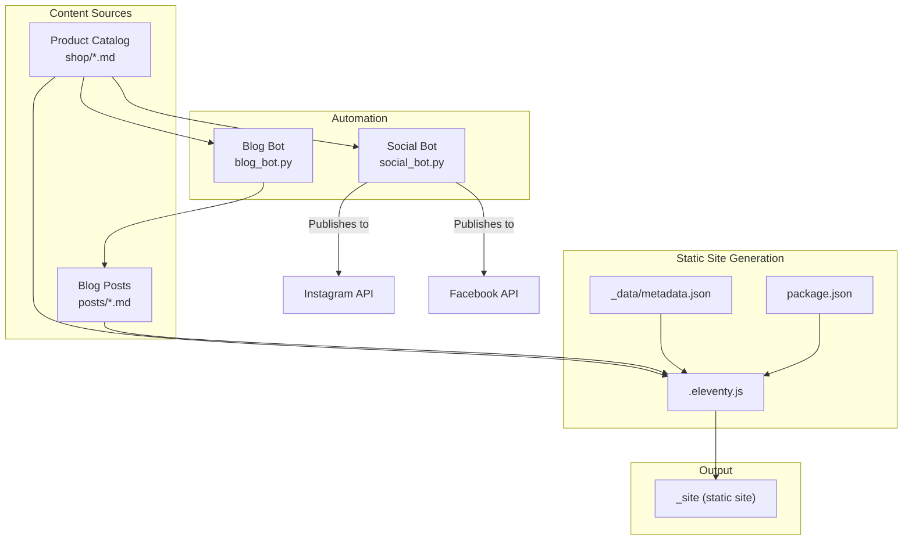
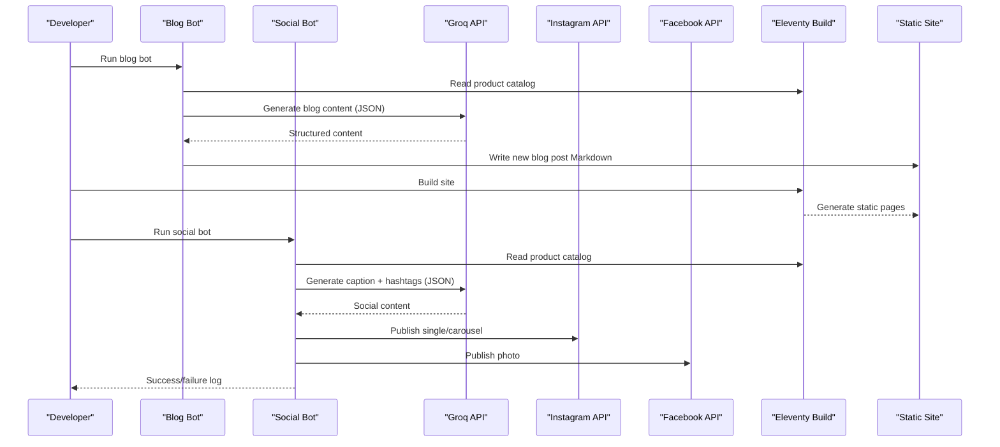
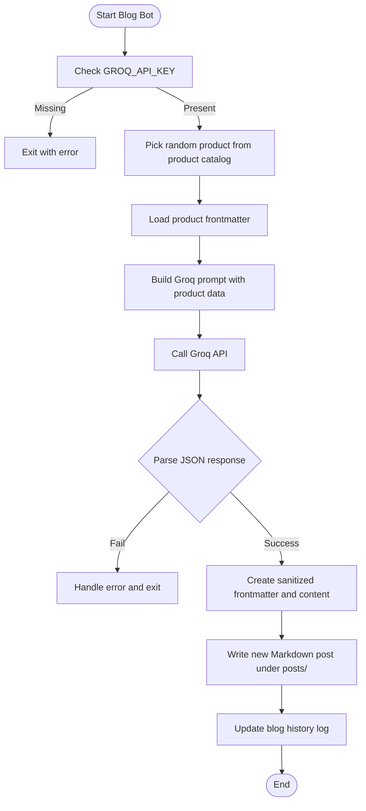
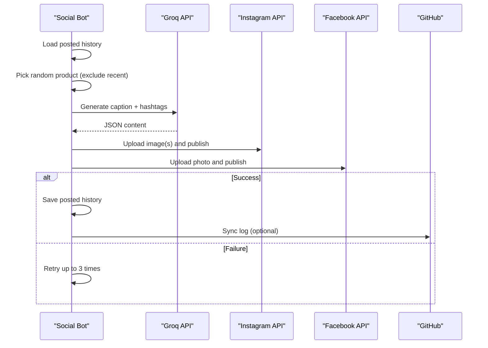
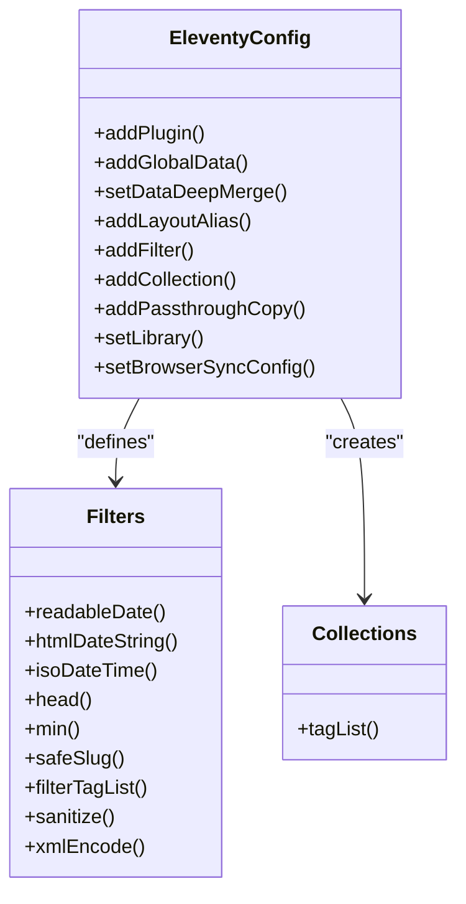
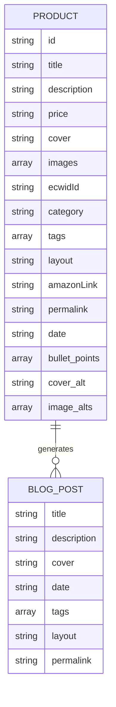
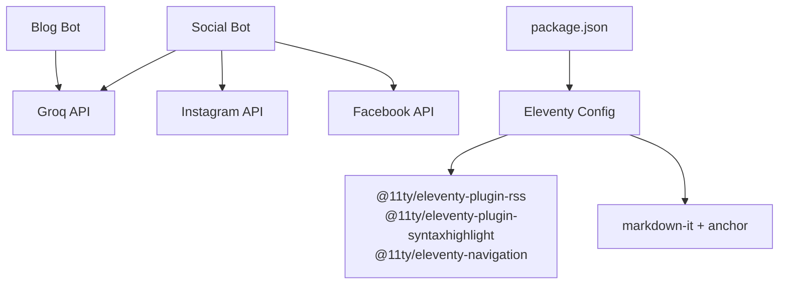

# Project Overview

<cite>
**Referenced Files in This Document**
- [README.md](file://README.md)
- [package.json](file://package.json)
- [.eleventy.js](file://.eleventy.js)
- [_data/metadata.json](file://_data/metadata.json)
- [blog_bot.py](file://blog_bot.py)
- [social_bot.py](file://social_bot.py)
- [SOCIAL_BOT_SETUP.md](file://SOCIAL_BOT_SETUP.md)
- [shop/B0CLHGCYRN.md](file://shop/B0CLHGCYRN.md)
- [posts/best-gift-ideas-in-uae-2025.md](file://posts/best-gift-ideas-in-uae-2025.md)
</cite>

## Table of Contents
1. Introduction
2. Project Structure
3. Core Components
4. Architecture Overview
5. Detailed Component Analysis
6. Dependency Analysis
7. Performance Considerations
8. Troubleshooting Guide
9. Conclusion

## Introduction
Nillianstore2 is an AI-powered e-commerce content platform designed as a static site generator built on Eleventy (11ty). It operates as an automated Amazon affiliate marketing solution targeting the UAE market, combining a responsive storefront with AI-generated blog posts and social media automation. The platform’s purpose is to turn product data into high-quality, SEO-focused content that drives traffic and conversions via Amazon.ae links.

Key features:
- AI-powered blog generation: A “blog bot” reads product entries from the product catalog and generates structured, SEO-optimized blog posts using Groq’s Llama model.
- Social media automation: A “social bot” creates engaging captions and hashtags for Instagram and Facebook, then publishes them via Meta APIs.
- Responsive e-commerce storefront: Built with Eleventy templates and layouts, producing fast, static pages optimized for search engines and mobile devices.

The architecture blends Python automation scripts with Eleventy static site generation. Product data lives in Markdown files under the product catalog; the bots generate new content (blog posts and social posts), which Eleventy compiles into a static site.

This overview provides both conceptual explanations for beginners and technical details for developers, using terminology consistent with the codebase such as “blog bot,” “social bot,” and “product catalog.”

## Project Structure
At a high level, the repository organizes content, templates, configuration, and automation scripts:
- Content sources:
  - Product catalog: Markdown files under shop/ define products with frontmatter metadata and images.
  - Generated blog posts: Markdown files under posts/ created by the blog bot.
- Templates and layouts:
  - Eleventy includes/layouts/_includes and _data provide reusable components and global site metadata.
- Automation:
  - Python scripts: blog_bot.py and social_bot.py orchestrate AI content generation and publishing workflows.
- Build and runtime:
  - package.json defines Eleventy commands and dependencies.
  - .eleventy.js configures plugins, filters, collections, and output directories.

**Diagram sources**
- [.eleventy.js:1-160](file://.eleventy.js#L1-L160)
- [package.json:1-34](file://package.json#L1-L34)
- [_data/metadata.json:1-27](file://_data/metadata.json#L1-L27)
- [blog_bot.py:1-253](file://blog_bot.py#L1-L253)
- [social_bot.py:1-315](file://social_bot.py#L1-L315)

**Section sources**
- [README.md:1-64](file://README.md#L1-L64)
- [package.json:1-34](file://package.json#L1-L34)
- [.eleventy.js:1-160](file://.eleventy.js#L1-L60)
- [_data/metadata.json:1-27](file://_data/metadata.json#L1-L27)

## Core Components
- Blog Bot: Reads a random product from the product catalog, constructs a prompt for Groq’s Llama model, receives structured JSON content, and writes a new blog post Markdown file under posts/. It also maintains a history log to avoid repeating products.
- Social Bot: Reads a random product from the product catalog, generates a caption and hashtags via Groq, and publishes to Instagram and Facebook using Meta Graph APIs. It logs posted products and can sync logs back to GitHub.
- Eleventy Configuration: Defines plugins (RSS, syntax highlighting, navigation), global site URL, layout aliases, date/time filters, safe slug handling, tag filtering, passthrough assets, markdown library settings, and output directory structure.
- Metadata and Data: Global site metadata (title, description, URLs, author, feeds) stored in _data/metadata.json.
- Product Catalog: Markdown files under shop/ with rich frontmatter (title, description, price, cover/images, tags, amazonLink, permalink, etc.).

Practical examples:
- Automated blog creation workflow:
  - Select a product from the product catalog.
  - Generate AI content (title, description, tags, sections).
  - Write a new Markdown post under posts/ with frontmatter and embedded buy button.
  - Rebuild the site with Eleventy to publish the new post.
- Automated social posting workflow:
  - Select a product from the product catalog.
  - Generate AI caption and hashtags.
  - Publish single image or carousel to Instagram; publish photo to Facebook.
  - Log the posted product ID and optionally sync to GitHub.

**Section sources**
- [blog_bot.py:1-253](file://blog_bot.py#L1-L253)
- [social_bot.py:1-315](file://social_bot.py#L1-L315)
- [.eleventy.js:1-160](file://.eleventy.js#L1-L160)
- [_data/metadata.json:1-27](file://_data/metadata.json#L1-L27)
- [shop/B0CLHGCYRN.md:1-55](file://shop/B0CLHGCYRN.md#L1-L55)
- [posts/best-gift-ideas-in-uae-2025.md:1-200](file://posts/best-gift-ideas-in-uae-2025.md#L1-L200)

## Architecture Overview
The system integrates three layers:
- Data layer: Product catalog Markdown files with frontmatter and images.
- Automation layer: Python bots calling Groq for content generation and Meta APIs for social publishing.
- Presentation layer: Eleventy builds static HTML from Markdown and Nunjucks templates, applying filters, collections, and metadata.

**Diagram sources**
- [blog_bot.py:1-253](file://blog_bot.py#L1-L253)
- [social_bot.py:1-315](file://social_bot.py#L1-L315)
- [.eleventy.js:1-160](file://.eleventy.js#L1-L160)

## Detailed Component Analysis

### Blog Bot Analysis
Responsibilities:
- Load product catalog and select a random product not recently used.
- Construct a detailed prompt for Groq to produce SEO-optimized blog content.
- Sanitize and format frontmatter and content, including tags and Amazon buy button.
- Persist generated posts under posts/ and update a history log.

Data flow:
- Input: Product frontmatter (title, description, price, images, amazon link).
- Processing: Prompt engineering and JSON response parsing.
- Output: New Markdown post with structured sections and call-to-action.

**Diagram sources**
- [blog_bot.py:1-253](file://blog_bot.py#L1-L253)

**Section sources**
- [blog_bot.py:1-253](file://blog_bot.py#L1-L253)

### Social Bot Analysis
Responsibilities:
- Load product catalog and pick a random product not recently posted.
- Generate caption and hashtags via Groq.
- Publish to Instagram (single image or carousel) and Facebook (photo).
- Maintain a posted history log and optionally sync it to GitHub.

Data flow:
- Input: Product frontmatter and image URLs.
- Processing: Prompt generation, API calls to Meta Graph endpoints.
- Output: Published posts and updated log.

**Diagram sources**
- [social_bot.py:1-315](file://social_bot.py#L1-L315)
- [SOCIAL_BOT_SETUP.md:1-106](file://SOCIAL_BOT_SETUP.md#L1-L106)

**Section sources**
- [social_bot.py:1-315](file://social_bot.py#L1-L315)
- [SOCIAL_BOT_SETUP.md:1-106](file://SOCIAL_BOT_SETUP.md#L1-L106)

### Eleventy Configuration Analysis
Highlights:
- Plugins: RSS feed, syntax highlighting, navigation.
- Global site URL and deep merge for data.
- Layout aliases for posts and shop pages.
- Date/time filters with UTC and Asia/Dubai timezone support.
- Safe slug filter to ensure valid filenames across hosting platforms.
- Tag filtering to exclude internal tags from listings.
- Passthrough copy for assets and feeds.
- Markdown-it with anchor links enabled.
- BrowserSync middleware for local development.

**Diagram sources**
- [.eleventy.js:1-160](file://.eleventy.js#L1-L160)

**Section sources**
- [.eleventy.js:1-160](file://.eleventy.js#L1-L160)

### Product Catalog and Data Models
The product catalog uses Markdown files with rich frontmatter fields:
- title, description, price, cover, images, ecwidId, category, tags, layout, amazonLink, permalink, date, bullet_points, cover_alt, image_alts.

Example product entry path:
- [shop/B0CLHGCYRN.md](file://shop/B0CLHGCYRN.md)

Generated blog post example path:
- [posts/best-gift-ideas-in-uae-2025.md](file://posts/best-gift-ideas-in-uae-2025.md)

**Diagram sources**
- [shop/B0CLHGCYRN.md:1-55](file://shop/B0CLHGCYRN.md#L1-L55)
- [posts/best-gift-ideas-in-uae-2025.md:1-200](file://posts/best-gift-ideas-in-uae-2025.md#L1-L200)

**Section sources**
- [shop/B0CLHGCYRN.md:1-55](file://shop/B0CLHGCYRN.md#L1-L55)
- [posts/best-gift-ideas-in-uae-2025.md:1-200](file://posts/best-gift-ideas-in-uae-2025.md#L1-L200)

## Dependency Analysis
External dependencies and integrations:
- Groq API: Used by both bots for content generation.
- Meta Graph APIs: Used by the social bot for Instagram and Facebook publishing.
- Eleventy ecosystem: Plugins for RSS, syntax highlighting, navigation; markdown-it with anchors.
- Node.js tooling: Scripts for build, watch, serve, debug, and filename checks.

**Diagram sources**
- [blog_bot.py:1-253](file://blog_bot.py#L1-L253)
- [social_bot.py:1-315](file://social_bot.py#L1-L315)
- [.eleventy.js:1-160](file://.eleventy.js#L1-L160)
- [package.json:1-34](file://package.json#L1-L34)

**Section sources**
- [package.json:1-34](file://package.json#L1-L34)
- [.eleventy.js:1-160](file://.eleventy.js#L1-L160)

## Performance Considerations
- Static site performance: Eleventy produces lightweight HTML/CSS/JS, improving load times and SEO.
- Image optimization: Use compressed webp images referenced in product catalog to reduce payload.
- Caching strategies: Leverage browser caching for static assets; consider CDN integration for faster delivery.
- Bot efficiency: Avoid repeated processing by maintaining history logs; batch operations where possible.
- API rate limits: Respect Groq and Meta API quotas; implement retries and backoff logic.

[No sources needed since this section provides general guidance]

## Troubleshooting Guide
Common issues and resolutions:
- Missing environment variables:
  - Ensure GROQ_API_KEY, META_ACCESS_TOKEN, FB_PAGE_ID, IG_USER_ID are set in GitHub Secrets.
  - For blog bot, GROQ_API_KEY must be present; otherwise, the script exits early.
- Social posting failures:
  - Check token expiration (error code 190 indicates expired token).
  - Verify permissions for pages_manage_metadata, pages_read_engagement, instagram_basic, instagram_content_publishing.
  - Review API responses in workflow logs for specific errors.
- No posts happening:
  - Confirm cron schedule or manual trigger.
  - Validate product catalog contains Markdown files with required fields and images.
- Git sync issues:
  - Ensure GITHUB_TOKEN is available if syncing logs to GitHub.

Operational references:
- Setup guide and troubleshooting steps are documented in SOCIAL_BOT_SETUP.md.
- Error handling paths exist within social_bot.py for API exceptions and token expiry detection.

**Section sources**
- [SOCIAL_BOT_SETUP.md:1-106](file://SOCIAL_BOT_SETUP.md#L1-L106)
- [social_bot.py:1-315](file://social_bot.py#L1-L315)
- [blog_bot.py:1-253](file://blog_bot.py#L1-L253)

## Conclusion
Nillianstore2 combines AI-driven content automation with a robust Eleventy-based static site to deliver a scalable, SEO-friendly e-commerce platform tailored for the UAE market. The blog bot transforms product catalog entries into compelling blog posts, while the social bot automates Instagram and Facebook publishing. Together, they streamline content creation and distribution, enabling efficient affiliate marketing at scale. Developers benefit from clear configuration, modular scripts, and well-defined data models, while users gain a responsive storefront and continuous content updates without manual effort.

[No sources needed since this section summarizes without analyzing specific files]