# Technology Stack

<cite>
**Referenced Files in This Document**
- [package.json](file://package.json)
- [.eleventy.js](file://.eleventy.js)
- [netlify.toml](file://netlify.toml)
- [README.md](file://README.md)
- [index.njk](file://index.njk)
- [_includes/layouts/base.njk](file://_includes/layouts/base.njk)
- [_data/metadata.json](file://_data/metadata.json)
- [css/bs.css](file://css/bs.css)
- [blog_bot.py](file://blog_bot.py)
- [social_bot.py](file://social_bot.py)
- [scripts/check-filenames.js](file://scripts/check-filenames.js)
</cite>

## Table of Contents
1. Introduction
2. Project Structure
3. Core Components
4. Architecture Overview
5. Detailed Component Analysis
6. Dependency Analysis
7. Performance Considerations
8. Troubleshooting Guide
9. Conclusion

## Introduction
This document explains the technology stack and architectural decisions behind Nillianstore2, a static site built with Eleventy (11ty), Nunjucks templates, Bootstrap CSS, Python automation scripts, and external APIs. It covers why each technology was chosen, how they work together, version compatibility, dependency management via npm, and the build process. It also provides guidance on performance and scalability considerations for this static-first approach.

## Project Structure
Nillianstore2 follows an Eleventy project layout:
- Source content is composed of Markdown pages/posts and Nunjucks templates.
- Global data lives under _data.
- Reusable UI fragments are under _includes.
- Static assets (images, videos, fonts) are copied to the output directory.
- The build outputs to _site and is published from there.

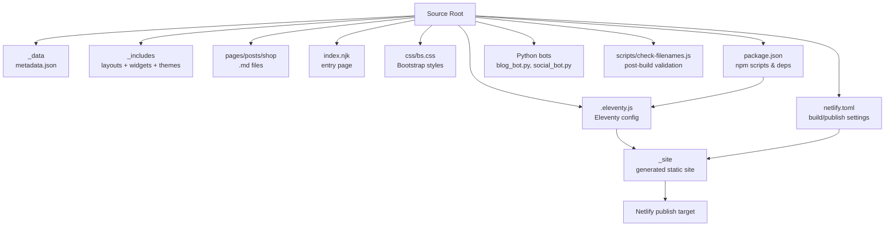

**Diagram sources**
- [.eleventy.js:146-159](file://.eleventy.js#L146-L159)
- [package.json:5-12](file://package.json#L5-L12)
- [netlify.toml:1-3](file://netlify.toml#L1-L3)
- [_data/metadata.json:1-27](file://_data/metadata.json#L1-L27)
- [index.njk:1-47](file://index.njk#L1-L47)
- [_includes/layouts/base.njk:1-62](file://_includes/layouts/base.njk#L1-L62)
- [css/bs.css:1-12](file://css/bs.css#L1-L12)

**Section sources**
- [.eleventy.js:146-159](file://.eleventy.js#L146-L159)
- [package.json:5-12](file://package.json#L5-L12)
- [netlify.toml:1-3](file://netlify.toml#L1-L3)

## Core Components
- Eleventy (11ty): Static site generator that compiles Markdown and Nunjucks into HTML. Configured with plugins for RSS, syntax highlighting, navigation, and custom filters/collections.
- Nunjucks: Template engine used for layouts, partials, and data-driven rendering.
- Bootstrap CSS v5.2.2: Prebuilt CSS framework included as a compiled stylesheet for responsive UI components.
- Python Automation Scripts:
  - blog_bot.py: Generates SEO-focused blog posts from product frontmatter using an AI API.
  - social_bot.py: Creates social media captions and publishes to Instagram/Facebook via Meta Graph API; optionally syncs logs to GitHub.
- External APIs:
  - Groq API for AI-generated content.
  - Meta Graph API for Instagram and Facebook publishing.
  - Amazon links embedded in product pages.

Why these choices:
- Eleventy + Nunjucks provide fast builds, flexible templating, and excellent developer experience for content-heavy sites.
- Bootstrap accelerates UI development with proven responsive components.
- Python scripts automate content creation and distribution without introducing server-side runtime at deploy time.
- External APIs enable dynamic content generation and social reach while keeping the site static.

**Section sources**
- [.eleventy.js:10-16](file://.eleventy.js#L10-L16)
- [.eleventy.js:25-70](file://.eleventy.js#L25-L70)
- [.eleventy.js:72-95](file://.eleventy.js#L72-L95)
- [css/bs.css:1-6](file://css/bs.css#L1-L6)
- [blog_bot.py:1-20](file://blog_bot.py#L1-L20)
- [social_bot.py:1-22](file://social_bot.py#L1-L22)

## Architecture Overview
The system is a static-first architecture:
- Content authors write Markdown and configure Nunjucks templates.
- Eleventy renders pages, collections, feeds, and static assets into _site.
- Netlify publishes _site and runs the build command.
- Python bots run separately (e.g., CI or scheduled jobs) to generate content and post to social platforms.

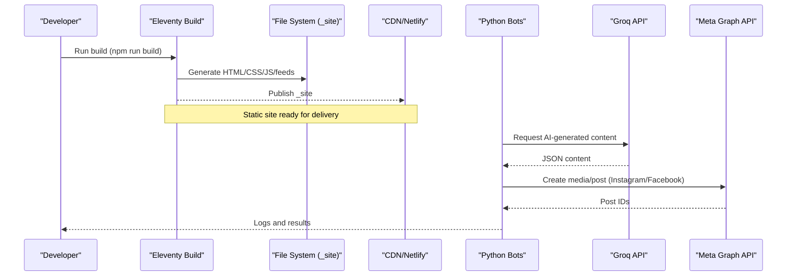

**Diagram sources**
- [netlify.toml:1-3](file://netlify.toml#L1-L3)
- [.eleventy.js:146-159](file://.eleventy.js#L146-L159)
- [blog_bot.py:84-97](file://blog_bot.py#L84-L97)
- [social_bot.py:120-136](file://social_bot.py#L120-L136)
- [social_bot.py:138-206](file://social_bot.py#L138-L206)
- [social_bot.py:208-246](file://social_bot.py#L208-L246)

## Detailed Component Analysis

### Eleventy (11ty) Configuration and Plugins
- Plugin setup: RSS, syntax highlighting, navigation.
- Global data: site URL configured for absolute URLs and sitemaps.
- Deep merge enabled for data layer composition.
- Layout aliases for post and shop pages.
- Custom filters for dates, slugs, tag filtering, sanitization, and XML encoding.
- Collections: tagList derived from all items’ tags with safe slug keys.
- Passthrough copy for img, css, robots.txt, feed, videos.
- Markdown library: markdown-it with linkify and anchor plugin.
- BrowserSync middleware for local dev 404 handling.
- Output directories and template engines defined.

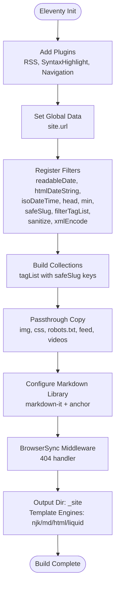

**Diagram sources**
- [.eleventy.js:10-16](file://.eleventy.js#L10-L16)
- [.eleventy.js:25-70](file://.eleventy.js#L25-L70)
- [.eleventy.js:72-95](file://.eleventy.js#L72-L95)
- [.eleventy.js:99-104](file://.eleventy.js#L99-L104)
- [.eleventy.js:106-116](file://.eleventy.js#L106-L116)
- [.eleventy.js:118-132](file://.eleventy.js#L118-L132)
- [.eleventy.js:134-143](file://.eleventy.js#L134-L143)
- [.eleventy.js:146-159](file://.eleventy.js#L146-L159)

**Section sources**
- [.eleventy.js:10-16](file://.eleventy.js#L10-L16)
- [.eleventy.js:25-70](file://.eleventy.js#L25-L70)
- [.eleventy.js:72-95](file://.eleventy.js#L72-L95)
- [.eleventy.js:99-104](file://.eleventy.js#L99-L104)
- [.eleventy.js:106-116](file://.eleventy.js#L106-L116)
- [.eleventy.js:118-132](file://.eleventy.js#L118-L132)
- [.eleventy.js:134-143](file://.eleventy.js#L134-L143)
- [.eleventy.js:146-159](file://.eleventy.js#L146-L159)

### Nunjucks Templates and Data Layer
- Entry page composes sections via includes and uses navigation metadata.
- Base layout wires global widgets and client-side search powered by a generated products JSON file.
- Metadata drives site-wide values like title, description, language, locale, author, and feed paths.

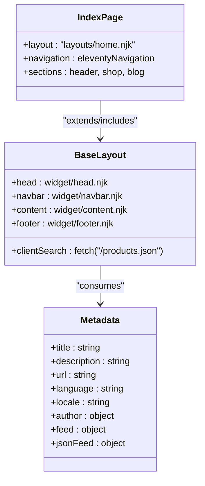

**Diagram sources**
- [index.njk:1-47](file://index.njk#L1-L47)
- [_includes/layouts/base.njk:1-62](file://_includes/layouts/base.njk#L1-L62)
- [_data/metadata.json:1-27](file://_data/metadata.json#L1-L27)

**Section sources**
- [index.njk:1-47](file://index.njk#L1-L47)
- [_includes/layouts/base.njk:1-62](file://_includes/layouts/base.njk#L1-L62)
- [_data/metadata.json:1-27](file://_data/metadata.json#L1-L27)

### Bootstrap CSS Framework
- Bootstrap v5.2.2 prebuilt CSS is included directly in the repository.
- Provides responsive grid, utilities, components, and typography.
- Fonts include Inter loaded via @font-face with font-display swap.

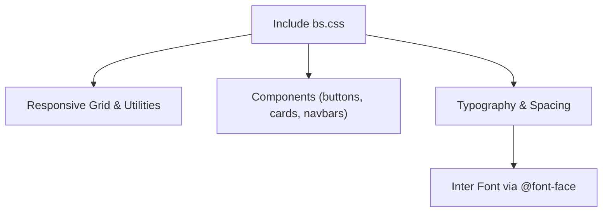

**Diagram sources**
- [css/bs.css:1-12](file://css/bs.css#L1-L12)

**Section sources**
- [css/bs.css:1-12](file://css/bs.css#L1-L12)

### Python Automation: Blog Generation
- Reads product Markdown files from the shop directory.
- Calls Groq API to generate SEO-optimized blog content structured as JSON.
- Writes new Markdown posts with frontmatter and curated images.
- Maintains a history log to avoid duplicate posts.

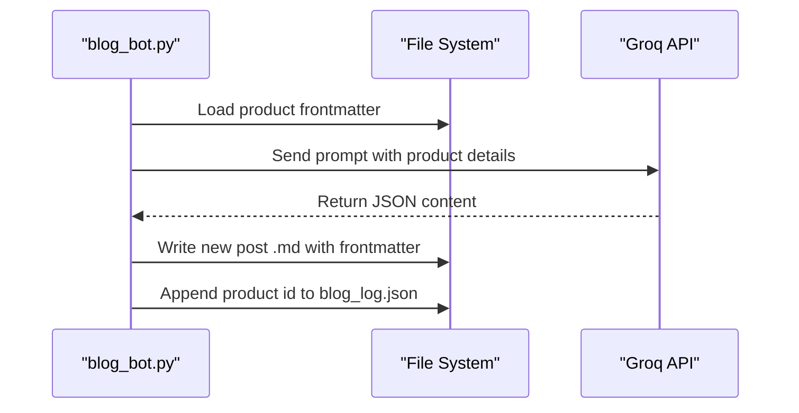

**Diagram sources**
- [blog_bot.py:33-46](file://blog_bot.py#L33-L46)
- [blog_bot.py:48-97](file://blog_bot.py#L48-L97)
- [blog_bot.py:99-208](file://blog_bot.py#L99-L208)
- [blog_bot.py:210-253](file://blog_bot.py#L210-L253)

**Section sources**
- [blog_bot.py:33-46](file://blog_bot.py#L33-L46)
- [blog_bot.py:48-97](file://blog_bot.py#L48-L97)
- [blog_bot.py:99-208](file://blog_bot.py#L99-L208)
- [blog_bot.py:210-253](file://blog_bot.py#L210-L253)

### Python Automation: Social Posting
- Parses product frontmatter and constructs image URLs.
- Uses Groq API to generate caption and hashtags.
- Posts to Instagram (single or carousel) and Facebook via Meta Graph API.
- Optionally syncs posting logs to GitHub using a token.

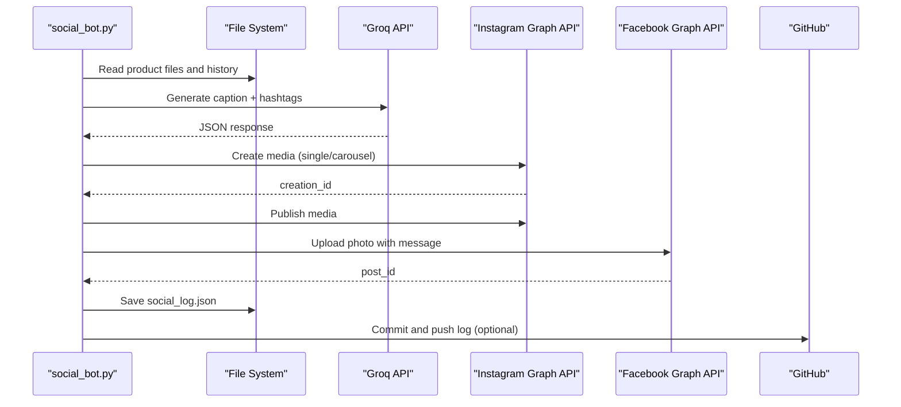

**Diagram sources**
- [social_bot.py:79-118](file://social_bot.py#L79-L118)
- [social_bot.py:120-136](file://social_bot.py#L120-L136)
- [social_bot.py:138-206](file://social_bot.py#L138-L206)
- [social_bot.py:208-246](file://social_bot.py#L208-L246)
- [social_bot.py:248-315](file://social_bot.py#L248-L315)

**Section sources**
- [social_bot.py:79-118](file://social_bot.py#L79-L118)
- [social_bot.py:120-136](file://social_bot.py#L120-L136)
- [social_bot.py:138-206](file://social_bot.py#L138-L206)
- [social_bot.py:208-246](file://social_bot.py#L208-L246)
- [social_bot.py:248-315](file://social_bot.py#L248-L315)

### Client-Side Search Integration
- Base layout fetches /products.json and performs client-side filtering by title/description.
- Results are rendered dynamically without server calls.

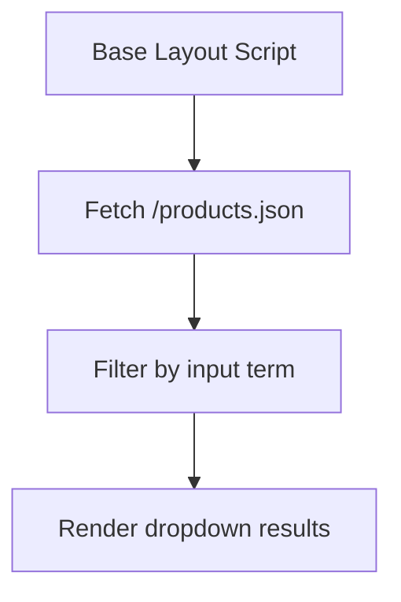

**Diagram sources**
- [_includes/layouts/base.njk:1-62](file://_includes/layouts/base.njk#L1-L62)

**Section sources**
- [_includes/layouts/base.njk:1-62](file://_includes/layouts/base.njk#L1-L62)

### Build Process and Deployment
- Local development: watch/serve/debug commands provided.
- Production build: Eleventy generates static files to _site.
- Netlify configuration sets publish directory and build command.

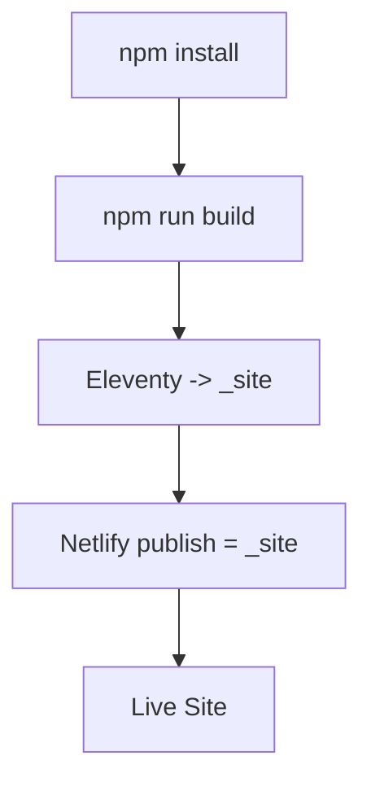

**Diagram sources**
- [package.json:5-12](file://package.json#L5-L12)
- [netlify.toml:1-3](file://netlify.toml#L1-L3)

**Section sources**
- [package.json:5-12](file://package.json#L5-L12)
- [netlify.toml:1-3](file://netlify.toml#L1-L3)

### Post-Build Validation
- Node script scans _site for filenames containing forbidden characters (? or #).
- Ensures deployment-friendly URLs and avoids routing issues.

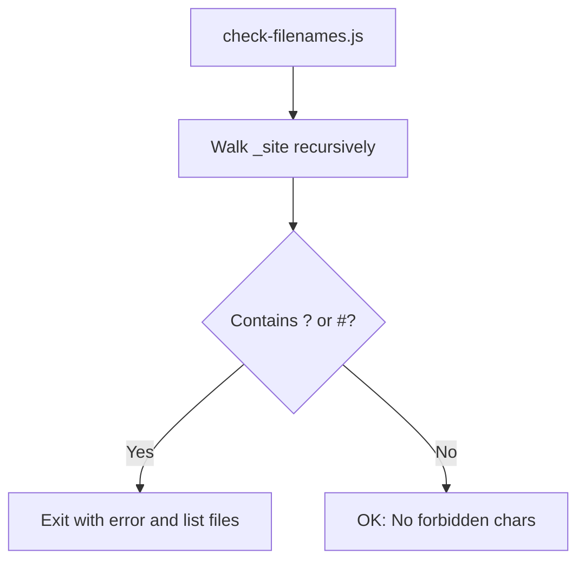

**Diagram sources**
- [scripts/check-filenames.js:1-45](file://scripts/check-filenames.js#L1-L45)

**Section sources**
- [scripts/check-filenames.js:1-45](file://scripts/check-filenames.js#L1-L45)

## Dependency Analysis
- Runtime dependencies managed via npm devDependencies:
  - Eleventy core and official plugins (navigation, RSS, syntax highlight).
  - Luxon for date formatting.
  - Markdown-it and anchor plugin for enhanced Markdown processing.
- Bootstrap CSS is vendored as a compiled stylesheet.
- Python scripts rely on standard libraries plus requests and frontmatter.

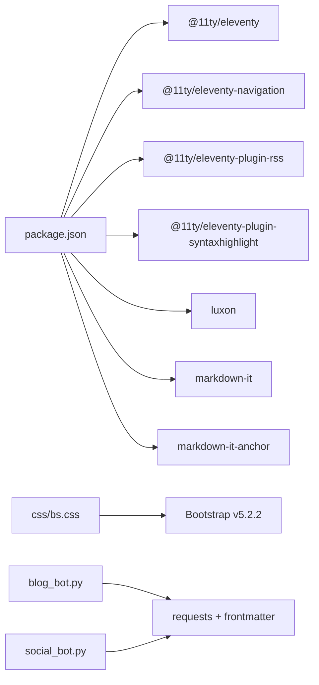

**Diagram sources**
- [package.json:24-32](file://package.json#L24-L32)
- [css/bs.css:1-6](file://css/bs.css#L1-L6)
- [blog_bot.py:1-9](file://blog_bot.py#L1-L9)
- [social_bot.py:1-9](file://social_bot.py#L1-L9)

**Section sources**
- [package.json:24-32](file://package.json#L24-L32)
- [css/bs.css:1-6](file://css/bs.css#L1-L6)
- [blog_bot.py:1-9](file://blog_bot.py#L1-L9)
- [social_bot.py:1-9](file://social_bot.py#L1-L9)

## Performance Considerations
- Static-first delivery: Eleventy produces pre-rendered HTML, enabling fast TTFB and easy CDN caching.
- CSS strategy: Using a prebuilt Bootstrap bundle simplifies setup but may include unused rules. Consider purging unused CSS for production if needed.
- Images and media: Ensure optimized formats (WebP/AVIF) and lazy loading where appropriate.
- Client-side search: Fetching a single JSON index reduces server load; keep the index small and cache it aggressively.
- Fonts: Inter is loaded with font-display swap to prevent FOIT; ensure proper subsetting and caching.
- Build-time optimizations: Leverage Eleventy’s passthrough copy for large assets and consider excluding unnecessary files from the output.

[No sources needed since this section provides general guidance]

## Troubleshooting Guide
- Missing environment variables:
  - Groq API key required for content generation.
  - Meta access tokens and IDs required for social posting.
  - GitHub token optional for syncing logs.
- Common errors:
  - API failures due to expired tokens or rate limits.
  - File naming issues causing deployment problems (checked by filename validator).
  - Build failures if _site does not exist when running checks.

Recommended steps:
- Verify secrets in your CI/CD environment.
- Inspect bot logs for detailed error responses.
- Run the filename check after building to catch invalid permalinks early.

**Section sources**
- [blog_bot.py:210-253](file://blog_bot.py#L210-L253)
- [social_bot.py:248-315](file://social_bot.py#L248-L315)
- [scripts/check-filenames.js:22-45](file://scripts/check-filenames.js#L22-L45)

## Conclusion
Nillianstore2 combines a robust static site foundation (Eleventy + Nunjucks) with a practical UI toolkit (Bootstrap) and powerful automation (Python bots) to streamline content creation and distribution. The architecture prioritizes speed, reliability, and simplicity by serving static assets while delegating dynamic tasks to external APIs and background processes. With careful attention to dependency versions, asset optimization, and error handling, the stack scales well for growing catalogs and content volumes.

[No sources needed since this section summarizes without analyzing specific files]