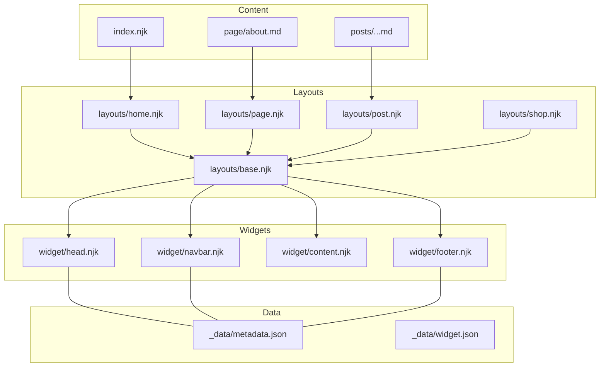
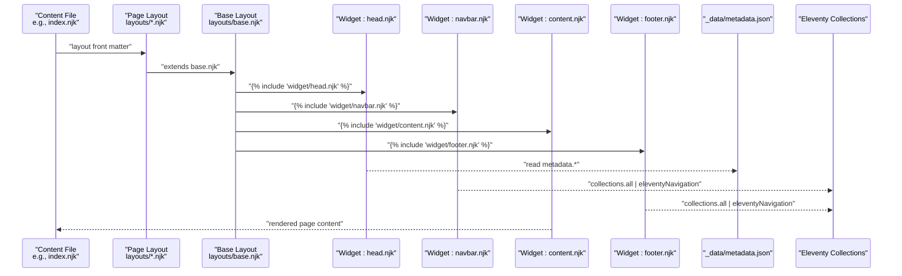
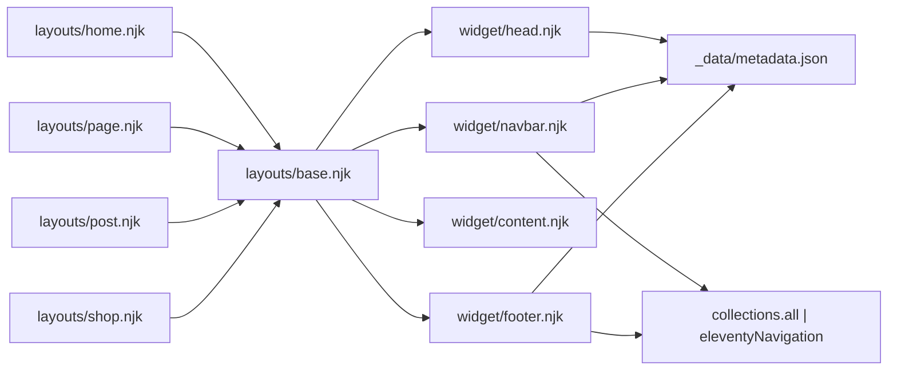

# Layout Architecture

<cite>
**Referenced Files in This Document**
- [base.njk](file://_includes/layouts/base.njk)
- [home.njk](file://_includes/layouts/home.njk)
- [page.njk](file://_includes/layouts/page.njk)
- [post.njk](file://_includes/layouts/post.njk)
- [shop.njk](file://_includes/layouts/shop.njk)
- [head.njk](file://_includes/widget/head.njk)
- [navbar.njk](file://_includes/widget/navbar.njk)
- [content.njk](file://_includes/widget/content.njk)
- [footer.njk](file://_includes/widget/footer.njk)
- [metadata.json](file://_data/metadata.json)
- [widget.json](file://_data/widget.json)
- [.eleventy.js](file://.eleventy.js)
- [index.njk](file://index.njk)
- [about.md](file://page/about.md)
- [best-gift-ideas-in-uae-2025.md](file://posts/best-gift-ideas-in-uae-2025.md)
</cite>

## Table of Contents
1. Introduction
2. Project Structure
3. Core Components
4. Architecture Overview
5. Detailed Component Analysis
6. Dependency Analysis
7. Performance Considerations
8. Troubleshooting Guide
9. Conclusion

## Introduction
This document explains the layout architecture system in Nillianstore2, focusing on how Nunjucks template inheritance and Eleventy’s layout mechanism compose pages. It covers:
- The base layout structure and how it composes shared UI parts
- Specialized layouts for home, page, post, and shop content types
- The component include pattern using widget templates
- Template data binding patterns with Eleventy global data
- How Eleventy collections integrate with layouts (navigation, tag lists)
- Examples of creating custom layouts and extending existing ones
- Performance optimization and best practices for consistent design

## Project Structure
The layout system is organized under _includes/layouts for page-level shells and _includes/widget for reusable components. Content files reference a layout via front matter and provide their own content that gets injected into the layout.

**Diagram sources**
- [base.njk:1-62](file://_includes/layouts/base.njk#L1-L62)
- [home.njk:1-5](file://_includes/layouts/home.njk#L1-L5)
- [page.njk:1-10](file://_includes/layouts/page.njk#L1-L10)
- [post.njk:1-6](file://_includes/layouts/post.njk#L1-L6)
- [shop.njk:1-5](file://_includes/layouts/shop.njk#L1-L5)
- [head.njk:1-113](file://_includes/widget/head.njk#L1-L113)
- [navbar.njk:1-37](file://_includes/widget/navbar.njk#L1-L37)
- [content.njk:1-1](file://_includes/widget/content.njk#L1-L1)
- [footer.njk:1-52](file://_includes/widget/footer.njk#L1-L52)
- [metadata.json:1-27](file://_data/metadata.json#L1-L27)
- [index.njk:1-47](file://index.njk#L1-L47)
- [about.md:1-109](file://page/about.md#L1-L109)
- [best-gift-ideas-in-uae-2025.md:1-259](file://posts/best-gift-ideas-in-uae-2025.md#L1-L259)

**Section sources**
- [base.njk:1-62](file://_includes/layouts/base.njk#L1-L62)
- [home.njk:1-5](file://_includes/layouts/home.njk#L1-L5)
- [page.njk:1-10](file://_includes/layouts/page.njk#L1-L10)
- [post.njk:1-6](file://_includes/layouts/post.njk#L1-L6)
- [shop.njk:1-5](file://_includes/layouts/shop.njk#L1-L5)
- [head.njk:1-113](file://_includes/widget/head.njk#L1-L113)
- [navbar.njk:1-37](file://_includes/widget/navbar.njk#L1-L37)
- [content.njk:1-1](file://_includes/widget/content.njk#L1-L1)
- [footer.njk:1-52](file://_includes/widget/footer.njk#L1-L52)
- [metadata.json:1-27](file://_data/metadata.json#L1-L27)
- [index.njk:1-47](file://index.njk#L1-L47)
- [about.md:1-109](file://page/about.md#L1-L109)
- [best-gift-ideas-in-uae-2025.md:1-259](file://posts/best-gift-ideas-in-uae-2025.md#L1-L259)

## Core Components
- Base layout (layouts/base.njk): Composes head, navbar, content, and footer widgets; includes client-side search logic.
- Home layout (layouts/home.njk): Extends base and renders page content directly.
- Page layout (layouts/page.njk): Extends base and includes a page-specific content block.
- Post layout (layouts/post.njk): Extends base and includes blog header and content blocks.
- Shop layout (layouts/shop.njk): Extends base and includes shop content block.
- Widget head (widget/head.njk): Provides HTML head, SEO metadata, preloads, analytics, and critical styles.
- Widget navbar (widget/navbar.njk): Renders navigation links from Eleventy navigation collection and search input.
- Widget content (widget/content.njk): Placeholder to render the current page’s content.
- Widget footer (widget/footer.njk): Renders site footer, social links, and includes scripts.

Key behaviors:
- Layout inheritance uses Eleventy’s layout front matter to wrap content in a shell.
- Widgets are included via Nunjucks  to share common UI across all pages.
- Navigation is driven by EleventyNavigation entries defined in content front matter.
- Global site metadata is bound from _data/metadata.json.

**Section sources**
- [base.njk:1-62](file://_includes/layouts/base.njk#L1-L62)
- [home.njk:1-5](file://_includes/layouts/home.njk#L1-L5)
- [page.njk:1-10](file://_includes/layouts/page.njk#L1-L10)
- [post.njk:1-6](file://_includes/layouts/post.njk#L1-L6)
- [shop.njk:1-5](file://_includes/layouts/shop.njk#L1-L5)
- [head.njk:1-113](file://_includes/widget/head.njk#L1-L113)
- [navbar.njk:1-37](file://_includes/widget/navbar.njk#L1-L37)
- [content.njk:1-1](file://_includes/widget/content.njk#L1-L1)
- [footer.njk:1-52](file://_includes/widget/footer.njk#L1-L52)
- [metadata.json:1-27](file://_data/metadata.json#L1-L27)

## Architecture Overview
The rendering pipeline starts from a content file, applies its chosen layout, which in turn includes shared widgets. Data from _data and Eleventy collections are available throughout.

**Diagram sources**
- [base.njk:1-62](file://_includes/layouts/base.njk#L1-L62)
- [head.njk:1-113](file://_includes/widget/head.njk#L1-L113)
- [navbar.njk:1-37](file://_includes/widget/navbar.njk#L1-L37)
- [content.njk:1-1](file://_includes/widget/content.njk#L1-L1)
- [footer.njk:1-52](file://_includes/widget/footer.njk#L1-L52)
- [metadata.json:1-27](file://_data/metadata.json#L1-L27)
- [index.njk:1-47](file://index.njk#L1-L47)

## Detailed Component Analysis

### Base Layout (layouts/base.njk)
Responsibilities:
- Includes shared widgets: head, navbar, content, footer.
- Adds client-side product search script that fetches /products.json and filters results by title/description.

Performance notes:
- Search logic runs only after DOMContentLoaded and hides results when input is too short or outside clicks occur.

**Section sources**
- [base.njk:1-62](file://_includes/layouts/base.njk#L1-L62)

### Home Layout (layouts/home.njk)
Responsibilities:
- Extends base layout.
- Renders raw page content safely.

Usage example:
- index.njk sets layout to layouts/home.njk and provides homepage sections via includes.

**Section sources**
- [home.njk:1-5](file://_includes/layouts/home.njk#L1-L5)
- [index.njk:1-47](file://index.njk#L1-L47)

### Page Layout (layouts/page.njk)
Responsibilities:
- Extends base layout.
- Includes a dedicated page content block.

Usage example:
- page/about.md sets layout to layouts/page.njk and defines navigation entry.

**Section sources**
- [page.njk:1-10](file://_includes/layouts/page.njk#L1-L10)
- [about.md:1-109](file://page/about.md#L1-L109)

### Post Layout (layouts/post.njk)
Responsibilities:
- Extends base layout.
- Includes blog header and content blocks.

Usage example:
- posts/*.md set layout to layouts/post.njk and define post metadata.

**Section sources**
- [post.njk:1-6](file://_includes/layouts/post.njk#L1-L6)
- [best-gift-ideas-in-uae-2025.md:1-259](file://posts/best-gift-ideas-in-uae-2025.md#L1-L259)

### Shop Layout (layouts/shop.njk)
Responsibilities:
- Extends base layout.
- Includes shop content block.

Note:
- Eleventy configuration adds a layout alias so “shop” can be used as a shorthand in content front matter.

**Section sources**
- [shop.njk:1-5](file://_includes/layouts/shop.njk#L1-L5)
- [.eleventy.js:21-24](file://.eleventy.js#L21-L24)

### Widget: Head (widget/head.njk)
Responsibilities:
- Defines DOCTYPE, html lang, meta tags, favicon, preload/defer CSS/JS, SEO includes, analytics, and critical styles.
- Uses metadata from _data/metadata.json for dynamic values.

Performance highlights:
- Preload and defer strategies for third-party CSS/JS.
- Conditional loading of heavy scripts.

**Section sources**
- [head.njk:1-113](file://_includes/widget/head.njk#L1-L113)
- [metadata.json:1-27](file://_data/metadata.json#L1-L27)

### Widget: Navbar (widget/navbar.njk)
Responsibilities:
- Renders responsive navbar with brand, toggler, and navigation links.
- Builds menu items from collections.all filtered by eleventyNavigation.
- Includes a search input for products.

Integration points:
- EleventyNavigation plugin supplies ordered navigation entries.

**Section sources**
- [navbar.njk:1-37](file://_includes/widget/navbar.njk#L1-L37)
- [.eleventy.js:1-160](file://.eleventy.js#L1-L160)

### Widget: Content (widget/content.njk)
Responsibilities:
- Placeholder that renders the current page’s content variable.

**Section sources**
- [content.njk:1-1](file://_includes/widget/content.njk#L1-L1)

### Widget: Footer (widget/footer.njk)
Responsibilities:
- Renders footer with site info, navigation links, social icons, and includes scripts.
- Also reads navigation from collections.all | eleventyNavigation.

**Section sources**
- [footer.njk:1-52](file://_includes/widget/footer.njk#L1-L52)

### Template Data Binding Patterns
- Global site metadata is provided by _data/metadata.json and accessed in templates via metadata.* keys.
- EleventyNavigation entries are added in content front matter and consumed in navbar and footer.
- Additional global data like site.url is configured in .eleventy.js.

Examples:
- index.njk defines eleventyNavigation key and order for Home.
- page/about.md defines eleventyNavigation for About.
- posts/*.md define layout and other front matter fields.

**Section sources**
- [metadata.json:1-27](file://_data/metadata.json#L1-L27)
- [widget.json:1-7](file://_data/widget.json#L1-L7)
- [.eleventy.js:1-160](file://.eleventy.js#L1-L160)
- [index.njk:1-47](file://index.njk#L1-L47)
- [about.md:1-109](file://page/about.md#L1-L109)
- [best-gift-ideas-in-uae-2025.md:1-259](file://posts/best-gift-ideas-in-uae-2025.md#L1-L259)

### Eleventy Collections Integration
- Navigation: collections.all | eleventyNavigation drives navbar and footer menus.
- Tag list: a custom tagList collection is built in .eleventy.js for tag-based features.
- Layout aliases: post and shop aliases allow shorthand usage in content front matter.

**Section sources**
- [.eleventy.js:1-160](file://.eleventy.js#L1-L160)
- [navbar.njk:1-37](file://_includes/widget/navbar.njk#L1-L37)
- [footer.njk:1-52](file://_includes/widget/footer.njk#L1-L52)

### Creating Custom Layouts and Extending Existing Ones
To create a new layout:
- Create a new file under _includes/layouts/<name>.njk.
- Set layout front matter to extend layouts/base.njk.
- Include any needed specialized blocks or includes.
- Reference the new layout from content front matter.

To extend an existing layout:
- Create a child layout that extends the parent layout (e.g., a specialized post variant).
- Override or add includes as needed.

Example references:
- Home layout extends base and renders content directly.
- Page layout extends base and includes a page-specific content block.
- Post layout extends base and includes blog header and content.
- Shop layout extends base and includes shop content.

**Section sources**
- [home.njk:1-5](file://_includes/layouts/home.njk#L1-L5)
- [page.njk:1-10](file://_includes/layouts/page.njk#L1-L10)
- [post.njk:1-6](file://_includes/layouts/post.njk#L1-L6)
- [shop.njk:1-5](file://_includes/layouts/shop.njk#L1-L5)

## Dependency Analysis
High-level dependencies between layout and widget components:

**Diagram sources**
- [base.njk:1-62](file://_includes/layouts/base.njk#L1-L62)
- [home.njk:1-5](file://_includes/layouts/home.njk#L1-L5)
- [page.njk:1-10](file://_includes/layouts/page.njk#L1-L10)
- [post.njk:1-6](file://_includes/layouts/post.njk#L1-L6)
- [shop.njk:1-5](file://_includes/layouts/shop.njk#L1-L5)
- [head.njk:1-113](file://_includes/widget/head.njk#L1-L113)
- [navbar.njk:1-37](file://_includes/widget/navbar.njk#L1-L37)
- [content.njk:1-1](file://_includes/widget/content.njk#L1-L1)
- [footer.njk:1-52](file://_includes/widget/footer.njk#L1-L52)
- [metadata.json:1-27](file://_data/metadata.json#L1-L27)

**Section sources**
- [base.njk:1-62](file://_includes/layouts/base.njk#L1-L62)
- [navbar.njk:1-37](file://_includes/widget/navbar.njk#L1-L37)
- [footer.njk:1-52](file://_includes/widget/footer.njk#L1-L52)
- [head.njk:1-113](file://_includes/widget/head.njk#L1-L113)
- [metadata.json:1-27](file://_data/metadata.json#L1-L27)

## Performance Considerations
- Prefer preloading and deferring external resources:
  - Use preload for critical CSS and defer non-critical JS until after DOMContentLoaded.
  - Defer third-party libraries like Swiper and Font Awesome where possible.
- Minimize runtime work in base layout:
  - Keep client-side search lightweight; debounce input if needed and limit result rendering.
- Avoid heavy inline styles in frequently included templates; prefer CSS classes.
- Cache-friendly assets:
  - Ensure static assets are versioned or use long cache headers at the hosting layer.
- Reduce reflows:
  - Hide search results by default and toggle visibility efficiently.

[No sources needed since this section provides general guidance]

## Troubleshooting Guide
Common issues and resolutions:
- Navigation not appearing:
  - Ensure each page has eleventyNavigation entries in front matter.
  - Verify @11ty/eleventy-navigation plugin is enabled in .eleventy.js.
- Metadata not rendering:
  - Confirm _data/metadata.json exists and contains required keys.
  - Check that templates access metadata.* correctly.
- Client-side search returns no results:
  - Verify /products.json is generated and accessible.
  - Inspect browser console for fetch errors and ensure search input IDs match.
- Layout not applied:
  - Confirm content front matter layout path matches the actual file path.
  - For aliases, ensure addLayoutAlias is configured for the intended name.

**Section sources**
- [.eleventy.js:1-160](file://.eleventy.js#L1-L160)
- [metadata.json:1-27](file://_data/metadata.json#L1-L27)
- [base.njk:1-62](file://_includes/layouts/base.njk#L1-L62)
- [navbar.njk:1-37](file://_includes/widget/navbar.njk#L1-L37)

## Conclusion
Nillianstore2’s layout architecture leverages Eleventy’s layout inheritance and Nunjucks includes to build a consistent, maintainable site shell. The base layout composes shared widgets, while specialized layouts tailor content presentation per type. Data binding through _data and Eleventy collections centralizes metadata and navigation, enabling scalable growth. Following the performance and maintenance recommendations ensures fast, reliable, and coherent user experiences across all pages.