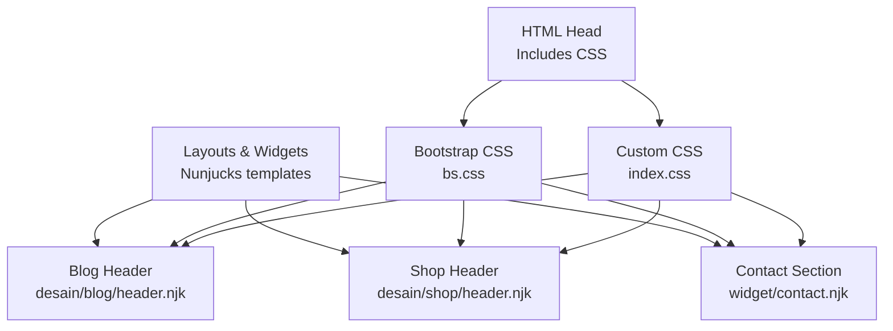
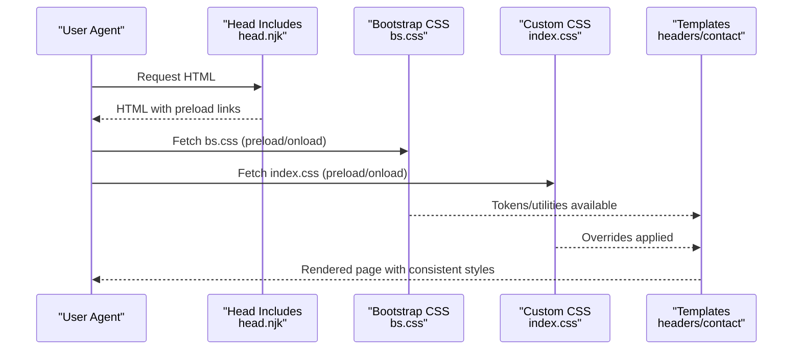
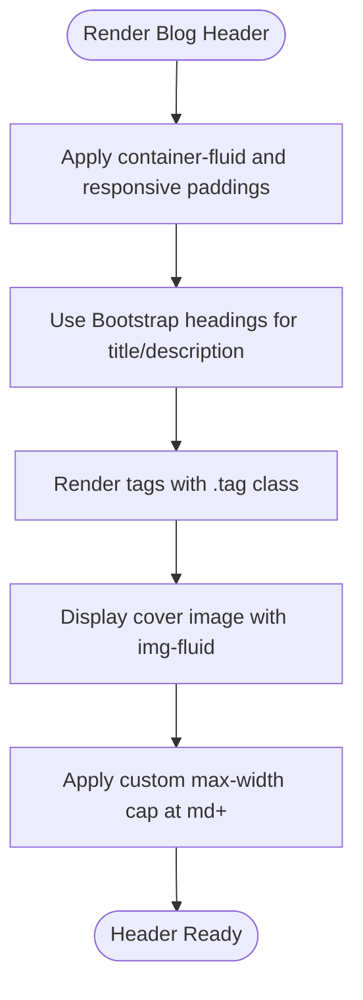
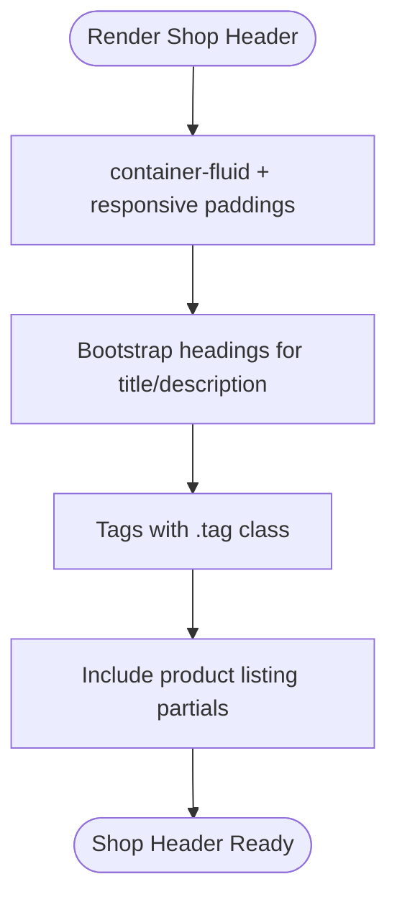
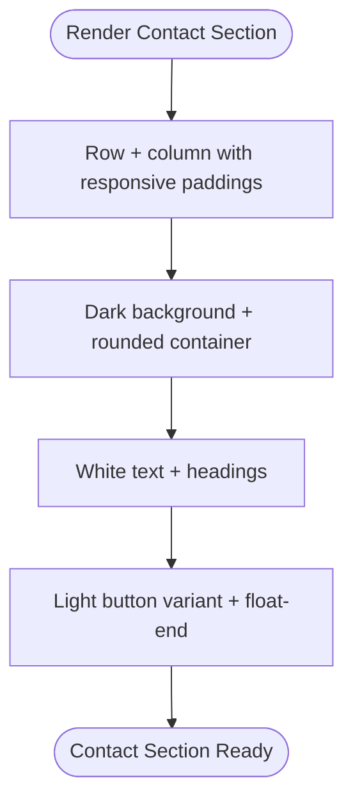
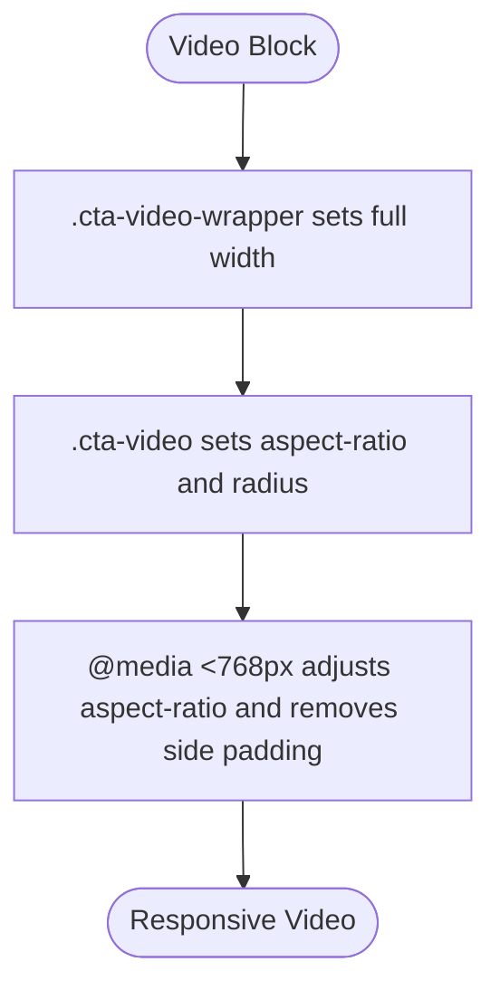
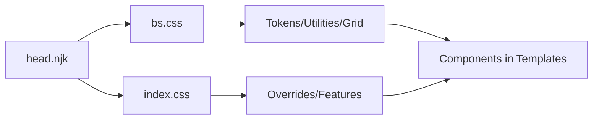

# Styling and Design System

<cite>
**Referenced Files in This Document**
- [index.css](file://css/index.css)
- [bs.css](file://css/bs.css)
- [head.njk](file://_includes/widget/head.njk)
- [base.njk](file://_includes/layouts/base.njk)
- [blog/header.njk](file://_includes/desain/blog/header.njk)
- [shop/header.njk](file://_includes/desain/shop/header.njk)
- [contact.njk](file://_includes/widget/contact.njk)
</cite>

## Table of Contents
1. Introduction
2. Project Structure
3. Core Components
4. Architecture Overview
5. Detailed Component Analysis
6. Dependency Analysis
7. Performance Considerations
8. Troubleshooting Guide
9. Conclusion

## Introduction
This document explains the styling and design system used by Nillianstore2. It covers how Bootstrap is integrated, where custom styles live, and how responsive patterns are applied across components such as blog headers, shop headers, and contact sections. It also provides guidance on maintaining consistency, overriding defaults safely, and optimizing CSS performance.

## Project Structure
The styling architecture is split into two primary layers:
- Bootstrap foundation: a compiled Bootstrap 5 stylesheet that supplies tokens, grid, typography, utilities, and component base styles.
- Custom application styles: project-specific overrides and feature styles layered on top of Bootstrap.

**Diagram sources**
- [head.njk:48-55](file://_includes/widget/head.njk#L48-L55)
- [bs.css:1-12](file://css/bs.css#L1-L12)
- [index.css:1-52](file://css/index.css#L1-L52)
- [blog/header.njk:1-17](file://_includes/desain/blog/header.njk#L1-L17)
- [shop/header.njk:1-11](file://_includes/desain/shop/header.njk#L1-L11)
- [contact.njk:1-8](file://_includes/widget/contact.njk#L1-L8)

**Section sources**
- [head.njk:48-55](file://_includes/widget/head.njk#L48-L55)
- [bs.css:1-12](file://css/bs.css#L1-L12)
- [index.css:1-52](file://css/index.css#L1-L52)

## Core Components
- Bootstrap integration via bs.css: Provides design tokens (colors, spacing, typography), grid system, utility classes, and base component styles.
- Custom styles in index.css: Small set of targeted overrides and feature-specific rules for images, tags, and video presentation.
- Template-driven UI: Components like blog header, shop header, and contact section compose Bootstrap classes with minimal custom CSS to ensure consistent behavior.

Key responsibilities:
- bs.css: Global tokens, reset, typography, layout, forms, buttons, cards, navbars, and utilities.
- index.css: Application-level refinements (e.g., image constraints, tag sizing, video aspect handling).
- Templates: Semantic markup using Bootstrap classes; no heavy inline styles.

**Section sources**
- [bs.css:1-12](file://css/bs.css#L1-L12)
- [index.css:1-52](file://css/index.css#L1-L52)
- [blog/header.njk:1-17](file://_includes/desain/blog/header.njk#L1-L17)
- [shop/header.njk:1-11](file://_includes/desain/shop/header.njk#L1-L11)
- [contact.njk:1-8](file://_includes/widget/contact.njk#L1-L8)

## Architecture Overview
CSS loading order and strategy:
- The head includes both Bootstrap and custom CSS using preload + onload pattern for non-blocking load.
- Custom CSS is loaded after Bootstrap to allow safe overrides.
- A small inline style block exists for hero image behavior; this can be moved to index.css for better caching.

**Diagram sources**
- [head.njk:48-55](file://_includes/widget/head.njk#L48-L55)
- [bs.css:1-12](file://css/bs.css#L1-L12)
- [index.css:1-52](file://css/index.css#L1-L52)

## Detailed Component Analysis

### Blog Header Styling
- Uses container-fluid and responsive padding to adapt content width and spacing across breakpoints.
- Title and description leverage Bootstrap heading utilities; tags use a shared .tag class sized by custom CSS.
- Images are responsive via Bootstrap’s img-fluid and constrained by custom rules for max-width at larger screens.

**Diagram sources**
- [blog/header.njk:1-17](file://_includes/desain/blog/header.njk#L1-L17)
- [index.css:1-25](file://css/index.css#L1-L25)

**Section sources**
- [blog/header.njk:1-17](file://_includes/desain/blog/header.njk#L1-L17)
- [index.css:1-25](file://css/index.css#L1-L25)

### Shop Header Styling
- Mirrors blog header structure for consistency: container-fluid, responsive padding, headings, and tag list.
- Composes product listings through included partials while relying on Bootstrap grid and utilities.

**Diagram sources**
- [shop/header.njk:1-11](file://_includes/desain/shop/header.njk#L1-L11)

**Section sources**
- [shop/header.njk:1-11](file://_includes/desain/shop/header.njk#L1-L11)

### Contact Section Styling
- Uses a dark-themed card-like area with rounded corners and responsive padding.
- Call-to-action button uses Bootstrap button variants and alignment utilities.

**Diagram sources**
- [contact.njk:1-8](file://_includes/widget/contact.njk#L1-L8)

**Section sources**
- [contact.njk:1-8](file://_includes/widget/contact.njk#L1-L8)

### Video and Media Handling
- Custom CSS defines wrapper and video classes to maintain aspect ratio and responsiveness.
- On mobile, the video switches to a portrait orientation and fills viewport width.

**Diagram sources**
- [index.css:27-51](file://css/index.css#L27-L51)

**Section sources**
- [index.css:27-51](file://css/index.css#L27-L51)

## Dependency Analysis
- Load order: Bootstrap first, then custom CSS. This ensures predictable override behavior.
- Token usage: Colors, spacing, typography, and utilities come from Bootstrap variables and classes.
- Font-face: A local Inter font is declared in bs.css for consistent typography.

**Diagram sources**
- [head.njk:48-55](file://_includes/widget/head.njk#L48-L55)
- [bs.css:1-12](file://css/bs.css#L1-L12)
- [index.css:1-52](file://css/index.css#L1-L52)

**Section sources**
- [head.njk:48-55](file://_includes/widget/head.njk#L48-L55)
- [bs.css:1-12](file://css/bs.css#L1-L12)
- [index.css:1-52](file://css/index.css#L1-L52)

## Performance Considerations
- Preload + onload for CSS: Both bs.css and index.css are preloaded and attached via onload to avoid render-blocking.
- External assets: Swiper CSS is preloaded and conditionally loaded; JS is deferred until DOMContentLoaded.
- Font display: Local font uses font-display: swap to prevent FOIT.
- Recommendations:
  - Move inline hero styles to index.css to improve cacheability and reduce per-page overhead.
  - Keep custom CSS minimal and scoped; prefer utility-first composition when possible.
  - Use media queries sparingly and group related rules to minimize reflows.
  - Ensure images have explicit dimensions or use object-fit to avoid layout shifts.

[No sources needed since this section provides general guidance]

## Troubleshooting Guide
- Styles not applying:
  - Verify load order: bs.css must load before index.css.
  - Check specificity conflicts; prefer adding new classes rather than !important.
- Images overflowing containers:
  - Ensure img-fluid is present and custom max-width caps are correct for the intended breakpoint.
- Video aspect issues on mobile:
  - Confirm the mobile media query is active and wrapper padding is removed as intended.
- Fonts not swapping:
  - Validate font-face declaration and path to /fonts/inter.woff2.

**Section sources**
- [head.njk:48-55](file://_includes/widget/head.njk#L48-L55)
- [index.css:11-25](file://css/index.css#L11-L25)
- [index.css:27-51](file://css/index.css#L27-L51)
- [bs.css:8-12](file://css/bs.css#L8-L12)

## Conclusion
Nillianstore2’s styling system builds on Bootstrap 5 for a robust token and utility layer, with a small, focused custom stylesheet for application-specific refinements. Components rely on semantic markup and Bootstrap classes, ensuring consistency and maintainability. The current CSS loading strategy is optimized for performance, and further improvements can be achieved by consolidating inline styles and keeping custom CSS lean and well-scoped.

[No sources needed since this section summarizes without analyzing specific files]