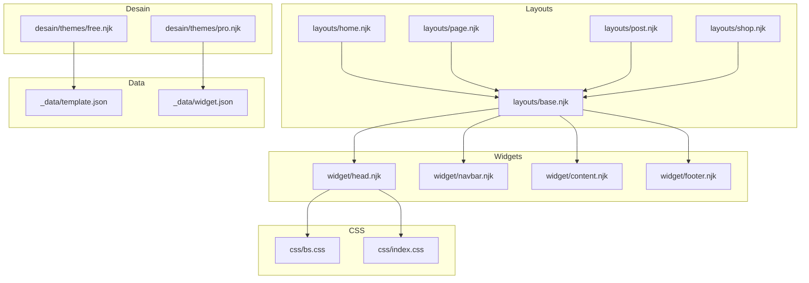
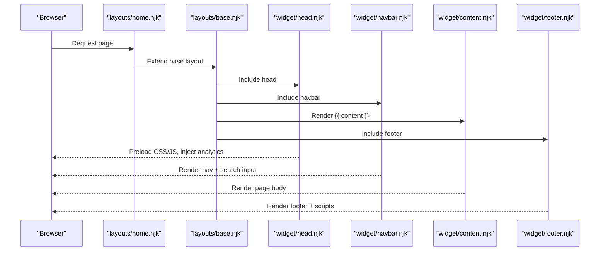
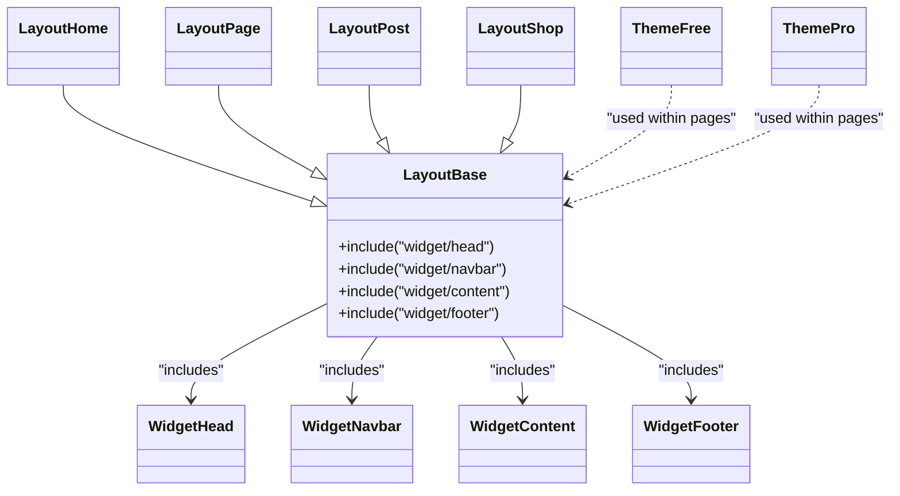
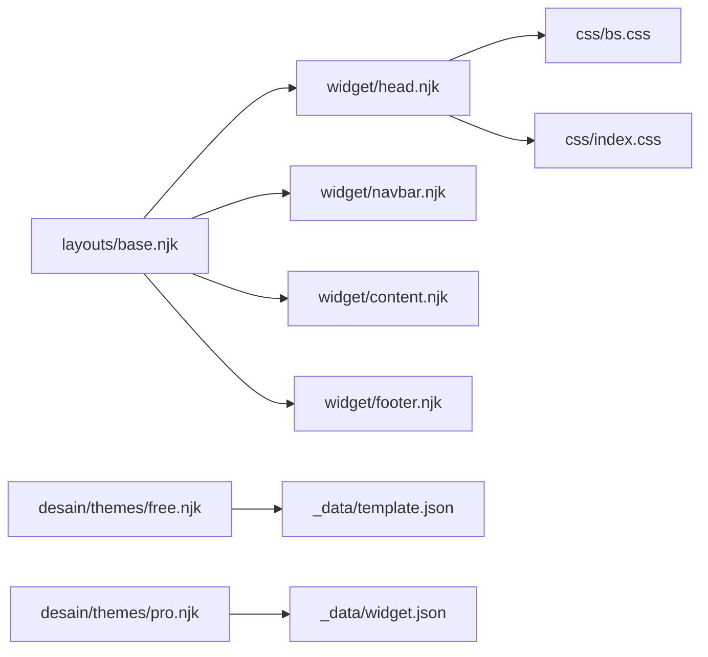

# Template System and Design

<cite>
**Referenced Files in This Document**
- [base.njk](file://_includes/layouts/base.njk)
- [home.njk](file://_includes/layouts/home.njk)
- [page.njk](file://_includes/layouts/page.njk)
- [post.njk](file://_includes/layouts/post.njk)
- [shop.njk](file://_includes/layouts/shop.njk)
- [head.njk](file://_includes/widget/head.njk)
- [navbar.njk](file://_includes/widget/navbar.njk)
- [content.njk](file://_includes/widget/content.njk)
- [footer.njk](file://_includes/widget/footer.njk)
- [free.njk](file://_includes/desain/themes/free.njk)
- [pro.njk](file://_includes/desain/themes/pro.njk)
- [template.json](file://_data/template.json)
- [widget.json](file://_data/widget.json)
- [bs.css](file://css/bs.css)
- [index.css](file://css/index.css)
</cite>

## Table of Contents
1. Introduction
2. Project Structure
3. Core Components
4. Architecture Overview
5. Detailed Component Analysis
6. Dependency Analysis
7. Performance Considerations
8. Troubleshooting Guide
9. Conclusion

## Introduction
This document explains the template system and design framework used by Nillianstore2. It covers layout architecture with Nunjucks templates, reusable widget components, theme variants (free and pro), Bootstrap integration, responsive design patterns, CSS organization, template inheritance, partial includes, data binding, component composition, best practices for custom themes, and performance optimization techniques for rendering and asset loading.

## Project Structure
The project uses Eleventy with Nunjucks templates organized into:
- Layouts: base shell and page-type layouts
- Widgets: reusable UI fragments (head, navbar, content, footer)
- Desain: feature-specific and theme-related includes
- Data: JSON files providing dynamic content to templates
- CSS: Bootstrap core and custom styles

**Diagram sources**
- [base.njk:1-4](file://_includes/layouts/base.njk#L1-L4)
- [home.njk:1-5](file://_includes/layouts/home.njk#L1-L5)
- [page.njk:1-10](file://_includes/layouts/page.njk#L1-L10)
- [post.njk:1-6](file://_includes/layouts/post.njk#L1-L6)
- [shop.njk:1-5](file://_includes/layouts/shop.njk#L1-L5)
- [head.njk:1-113](file://_includes/widget/head.njk#L1-L113)
- [navbar.njk:1-37](file://_includes/widget/navbar.njk#L1-L37)
- [content.njk:1-1](file://_includes/widget/content.njk#L1-L1)
- [footer.njk:1-52](file://_includes/widget/footer.njk#L1-L52)
- [free.njk:1-12](file://_includes/desain/themes/free.njk#L1-L12)
- [pro.njk:1-17](file://_includes/desain/themes/pro.njk#L1-L17)
- [template.json:1-59](file://_data/template.json#L1-L59)
- [widget.json:1-7](file://_data/widget.json#L1-L7)
- [bs.css:1-6](file://css/bs.css#L1-L6)
- [index.css:1-52](file://css/index.css#L1-L52)

**Section sources**
- [base.njk:1-4](file://_includes/layouts/base.njk#L1-L4)
- [head.njk:1-113](file://_includes/widget/head.njk#L1-L113)
- [navbar.njk:1-37](file://_includes/widget/navbar.njk#L1-L37)
- [content.njk:1-1](file://_includes/widget/content.njk#L1-L1)
- [footer.njk:1-52](file://_includes/widget/footer.njk#L1-L52)
- [free.njk:1-12](file://_includes/desain/themes/free.njk#L1-L12)
- [pro.njk:1-17](file://_includes/desain/themes/pro.njk#L1-L17)
- [template.json:1-59](file://_data/template.json#L1-L59)
- [widget.json:1-7](file://_data/widget.json#L1-L7)
- [bs.css:1-6](file://css/bs.css#L1-L6)
- [index.css:1-52](file://css/index.css#L1-L52)

## Core Components
- Base layout composes global widgets and provides a consistent HTML skeleton.
- Page layouts extend the base layout and include feature-specific content blocks.
- Widgets encapsulate head metadata, navigation, main content area, and footer.
- Theme includes render free and pro collections using data from JSON.
- CSS layers combine Bootstrap utilities and custom styles for responsive behavior.

Key responsibilities:
- Head widget: meta tags, preloads, CDN resources, analytics, and inline critical styles.
- Navbar widget: responsive navigation built with Bootstrap classes and search input.
- Content widget: renders page content safely.
- Footer widget: site links, social icons, and script inclusion.
- Free/pro theme includes: iterate over data arrays to render cards and CTAs.

**Section sources**
- [base.njk:1-4](file://_includes/layouts/base.njk#L1-L4)
- [head.njk:1-113](file://_includes/widget/head.njk#L1-L113)
- [navbar.njk:1-37](file://_includes/widget/navbar.njk#L1-L37)
- [content.njk:1-1](file://_includes/widget/content.njk#L1-L1)
- [footer.njk:1-52](file://_includes/widget/footer.njk#L1-L52)
- [free.njk:1-12](file://_includes/desain/themes/free.njk#L1-L12)
- [pro.njk:1-17](file://_includes/desain/themes/pro.njk#L1-L17)

## Architecture Overview
The template architecture follows a clear hierarchy:
- Page-level layouts declare a base layout and include specific content sections.
- The base layout wires together shared widgets.
- Widgets are independent and reusable across pages.
- Themes compose data-driven lists of items.

**Diagram sources**
- [home.njk:1-5](file://_includes/layouts/home.njk#L1-L5)
- [base.njk:1-4](file://_includes/layouts/base.njk#L1-L4)
- [head.njk:1-113](file://_includes/widget/head.njk#L1-L113)
- [navbar.njk:1-37](file://_includes/widget/navbar.njk#L1-L37)
- [content.njk:1-1](file://_includes/widget/content.njk#L1-L1)
- [footer.njk:1-52](file://_includes/widget/footer.njk#L1-L52)

## Detailed Component Analysis

### Layout Inheritance and Composition
- Page layouts set a front matter layout reference and include feature-specific content.
- Base layout orchestrates global widgets and client-side logic.

Examples:
- Home layout extends base and outputs content.
- Page layout includes a page-specific content block.
- Post layout includes blog header and content.
- Shop layout includes shop content.

Best practices:
- Keep page layouts minimal; delegate structure to base.
- Use includes for feature-specific sections to maintain separation of concerns.

**Section sources**
- [home.njk:1-5](file://_includes/layouts/home.njk#L1-L5)
- [page.njk:1-10](file://_includes/layouts/page.njk#L1-L10)
- [post.njk:1-6](file://_includes/layouts/post.njk#L1-L6)
- [shop.njk:1-5](file://_includes/layouts/shop.njk#L1-L5)
- [base.njk:1-4](file://_includes/layouts/base.njk#L1-L4)

### Widget System
- Head: manages viewport, SEO, preloads, CDN assets, analytics, and critical inline styles.
- Navbar: responsive navigation with Bootstrap classes and integrated search input.
- Content: safe rendering of page content.
- Footer: site info, navigation links, social icons, and script inclusion.

Design notes:
- Use Bootstrap utility classes for spacing, alignment, and responsiveness.
- Defer heavy scripts and preload critical CSS to improve performance.

**Section sources**
- [head.njk:1-113](file://_includes/widget/head.njk#L1-L113)
- [navbar.njk:1-37](file://_includes/widget/navbar.njk#L1-L37)
- [content.njk:1-1](file://_includes/widget/content.njk#L1-L1)
- [footer.njk:1-52](file://_includes/widget/footer.njk#L1-L52)

### Theme System (Free and Pro)
- Free theme include iterates over a collection to render cards with cover images, titles, descriptions, demo, and download links.
- Pro theme include renders premium items and integrates a contact widget.

Data binding:
- Free theme consumes an array of theme entries.
- Pro theme consumes a premium dataset.

Recommendations:
- Keep theme includes focused on presentation; keep data in _data files.
- Use lazy-loading for images to reduce initial payload.

**Section sources**
- [free.njk:1-12](file://_includes/desain/themes/free.njk#L1-L12)
- [pro.njk:1-17](file://_includes/desain/themes/pro.njk#L1-L17)
- [template.json:1-59](file://_data/template.json#L1-L59)
- [widget.json:1-7](file://_data/widget.json#L1-L7)

### Responsive Design Patterns and CSS Organization
- Bootstrap core provides grid, utilities, and components.
- Custom CSS augments Bootstrap with image constraints, video wrapper styles, and mobile-first adjustments.

Patterns:
- Use container-fluid or container with responsive breakpoints.
- Apply max-width constraints for images and videos.
- Prefer aspect-ratio and media queries for mobile adaptations.

**Section sources**
- [bs.css:1-6](file://css/bs.css#L1-L6)
- [index.css:1-52](file://css/index.css#L1-L52)

### Template Inheritance, Partial Includes, and Data Binding
- Inheritance: page layouts specify a base layout via front matter.
- Partials: base layout includes head, navbar, content, and footer.
- Data binding: templates access metadata and collections through Nunjucks syntax and Eleventy globals.

Guidelines:
- Centralize shared markup in widgets.
- Keep data structures flat and predictable for easier iteration.
- Use safe filters when rendering user-generated content.

**Section sources**
- [home.njk:1-5](file://_includes/layouts/home.njk#L1-L5)
- [base.njk:1-4](file://_includes/layouts/base.njk#L1-L4)
- [head.njk:1-113](file://_includes/widget/head.njk#L1-L113)
- [navbar.njk:1-37](file://_includes/widget/navbar.njk#L1-L37)
- [content.njk:1-1](file://_includes/widget/content.njk#L1-L1)
- [footer.njk:1-52](file://_includes/widget/footer.njk#L1-L52)

### Component Composition Model
- Compose pages by combining layout shells with feature includes.
- Reuse widgets across multiple pages to avoid duplication.
- Separate concerns: layout (structure), widgets (shared UI), features (page-specific).

**Diagram sources**
- [base.njk:1-4](file://_includes/layouts/base.njk#L1-L4)
- [home.njk:1-5](file://_includes/layouts/home.njk#L1-L5)
- [page.njk:1-10](file://_includes/layouts/page.njk#L1-L10)
- [post.njk:1-6](file://_includes/layouts/post.njk#L1-L6)
- [shop.njk:1-5](file://_includes/layouts/shop.njk#L1-L5)
- [head.njk:1-113](file://_includes/widget/head.njk#L1-L113)
- [navbar.njk:1-37](file://_includes/widget/navbar.njk#L1-L37)
- [content.njk:1-1](file://_includes/widget/content.njk#L1-L1)
- [footer.njk:1-52](file://_includes/widget/footer.njk#L1-L52)
- [free.njk:1-12](file://_includes/desain/themes/free.njk#L1-L12)
- [pro.njk:1-17](file://_includes/desain/themes/pro.njk#L1-L17)

### Best Practices for Creating Custom Themes
- Create new includes under desain/themes and wire them into relevant page layouts.
- Store theme metadata and listings in _data JSON files.
- Use Bootstrap classes for consistency and leverage custom CSS sparingly.
- Ensure all external assets are preloaded or deferred appropriately.

**Section sources**
- [free.njk:1-12](file://_includes/desain/themes/free.njk#L1-L12)
- [pro.njk:1-17](file://_includes/desain/themes/pro.njk#L1-L17)
- [template.json:1-59](file://_data/template.json#L1-L59)
- [bs.css:1-6](file://css/bs.css#L1-L6)
- [index.css:1-52](file://css/index.css#L1-L52)

## Dependency Analysis
High-level dependencies between templates and assets:
- Layouts depend on widgets.
- Widgets depend on CSS and external CDNs.
- Theme includes depend on data files.

**Diagram sources**
- [base.njk:1-4](file://_includes/layouts/base.njk#L1-L4)
- [head.njk:1-113](file://_includes/widget/head.njk#L1-L113)
- [navbar.njk:1-37](file://_includes/widget/navbar.njk#L1-L37)
- [content.njk:1-1](file://_includes/widget/content.njk#L1-L1)
- [footer.njk:1-52](file://_includes/widget/footer.njk#L1-L52)
- [free.njk:1-12](file://_includes/desain/themes/free.njk#L1-L12)
- [pro.njk:1-17](file://_includes/desain/themes/pro.njk#L1-L17)
- [template.json:1-59](file://_data/template.json#L1-L59)
- [widget.json:1-7](file://_data/widget.json#L1-L7)
- [bs.css:1-6](file://css/bs.css#L1-L6)
- [index.css:1-52](file://css/index.css#L1-L52)

**Section sources**
- [base.njk:1-4](file://_includes/layouts/base.njk#L1-L4)
- [head.njk:1-113](file://_includes/widget/head.njk#L1-L113)
- [navbar.njk:1-37](file://_includes/widget/navbar.njk#L1-L37)
- [content.njk:1-1](file://_includes/widget/content.njk#L1-L1)
- [footer.njk:1-52](file://_includes/widget/footer.njk#L1-L52)
- [free.njk:1-12](file://_includes/desain/themes/free.njk#L1-L12)
- [pro.njk:1-17](file://_includes/desain/themes/pro.njk#L1-L17)
- [template.json:1-59](file://_data/template.json#L1-L59)
- [widget.json:1-7](file://_data/widget.json#L1-L7)
- [bs.css:1-6](file://css/bs.css#L1-L6)
- [index.css:1-52](file://css/index.css#L1-L52)

## Performance Considerations
- Preload critical CSS and defer non-critical JS to reduce blocking.
- Use CDN prefetch/preconnect hints for third-party resources.
- Lazy-load images and conditionally load heavy libraries only when needed.
- Minimize inline scripts; move initialization to DOMContentLoaded handlers.
- Keep CSS modular: rely on Bootstrap utilities and add small custom overrides.

[No sources needed since this section provides general guidance]

## Troubleshooting Guide
Common issues and resolutions:
- Search results not appearing: ensure the products JSON endpoint is reachable and that the search input ID matches the script’s expectations.
- Navigation links not rendering: verify that collections are correctly populated and accessible via the navigation filter.
- Styles not applied: confirm that CSS files are preloaded and loaded in the correct order; check browser console for network errors.
- Analytics not firing: verify the async script tag and configuration snippet presence in the head widget.

Actionable checks:
- Inspect network tab for missing assets.
- Validate IDs and selectors used by client-side scripts.
- Confirm Nunjucks variables resolve to expected values.

**Section sources**
- [base.njk:1-62](file://_includes/layouts/base.njk#L1-L62)
- [navbar.njk:1-37](file://_includes/widget/navbar.njk#L1-L37)
- [head.njk:1-113](file://_includes/widget/head.njk#L1-L113)

## Conclusion
Nillianstore2’s template system leverages a clean separation of concerns: base layout, reusable widgets, and feature-specific includes. The theme system supports free and pro variants driven by data files, while Bootstrap and custom CSS provide a robust, responsive foundation. By following the composition model and performance recommendations outlined here, you can create scalable, maintainable custom themes and pages.