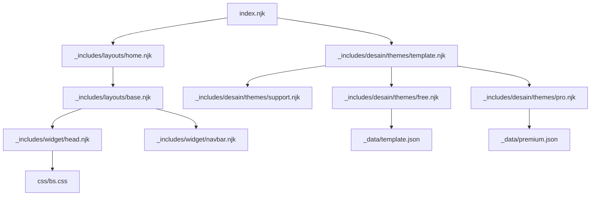
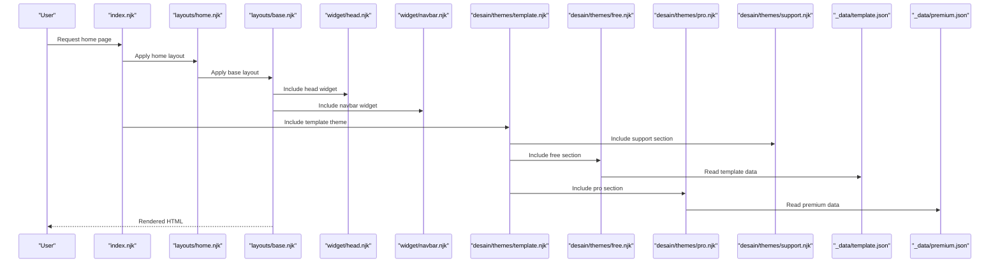
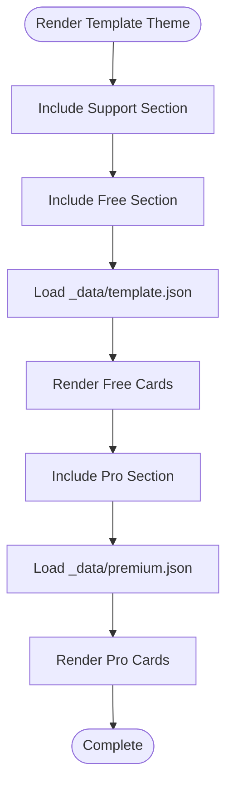
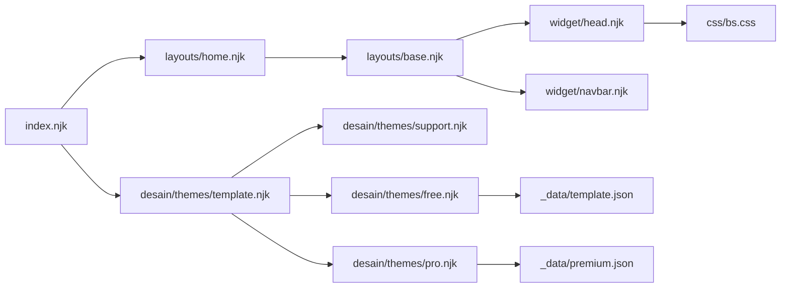

# Theme System

<cite>
**Referenced Files in This Document**
- [.eleventy.js](file://.eleventy.js)
- [index.njk](file://index.njk)
- [_includes/layouts/base.njk](file://_includes/layouts/base.njk)
- [_includes/layouts/home.njk](file://_includes/layouts/home.njk)
- [_includes/widget/head.njk](file://_includes/widget/head.njk)
- [_includes/widget/navbar.njk](file://_includes/widget/navbar.njk)
- [_includes/desain/themes/template.njk](file://_includes/desain/themes/template.njk)
- [_includes/desain/themes/free.njk](file://_includes/desain/themes/free.njk)
- [_includes/desain/themes/pro.njk](file://_includes/desain/themes/pro.njk)
- [_includes/desain/themes/support.njk](file://_includes/desain/themes/support.njk)
- [_data/template.json](file://_data/template.json)
- [_data/premium.json](file://_data/premium.json)
- [css/bs.css](file://css/bs.css)
</cite>

## Table of Contents
1. [Introduction](#introduction)
2. [Project Structure](#project-structure)
3. [Core Components](#core-components)
4. [Architecture Overview](#architecture-overview)
5. [Detailed Component Analysis](#detailed-component-analysis)
6. [Dependency Analysis](#dependency-analysis)
7. [Performance Considerations](#performance-considerations)
8. [Troubleshooting Guide](#troubleshooting-guide)
9. [Conclusion](#conclusion)

## Introduction
This document explains the theme system in Nillianstore2, focusing on how themes are organized and rendered using Nunjucks templates. The project provides a set of reusable layout and widget components, along with theme-specific partials for free, pro, support, and template variants. Themes compose content by including specialized blocks that render different sections (for example, free templates, premium/pro showcases, and support messaging). Data-driven rendering is powered by Eleventy’s data layer, with JSON files providing metadata used across theme views.

The documentation covers:
- How layouts and widgets compose pages
- How theme variants are included and composed
- How to customize and extend themes
- CSS variable usage and Bootstrap integration patterns
- Creating new themes by extending existing ones
- Conditional rendering based on theme type
- Performance optimization and best practices

[No sources needed since this section summarizes without analyzing specific files]

## Project Structure
At a high level, the theme system is built from:
- Layouts under _includes/layouts that wrap page content
- Widgets under _includes/widget that provide head, navbar, footer, etc.
- Theme partials under _includes/desain/themes that compose variant-specific sections
- Data files under _data that drive dynamic content
- CSS assets under css for global styles and Bootstrap integration

**Diagram sources**
- [index.njk:1-47](file://index.njk#L1-L47)
- [_includes/layouts/home.njk:1-5](file://_includes/layouts/home.njk#L1-L5)
- [_includes/layouts/base.njk:1-62](file://_includes/layouts/base.njk#L1-L62)
- [_includes/widget/head.njk:1-113](file://_includes/widget/head.njk#L1-L113)
- [_includes/widget/navbar.njk:1-37](file://_includes/widget/navbar.njk#L1-L37)
- [_includes/desain/themes/template.njk:1-3](file://_includes/desain/themes/template.njk#L1-L3)
- [_includes/desain/themes/support.njk:1-15](file://_includes/desain/themes/support.njk#L1-L15)
- [_includes/desain/themes/free.njk:1-12](file://_includes/desain/themes/free.njk#L1-L12)
- [_includes/desain/themes/pro.njk:1-17](file://_includes/desain/themes/pro.njk#L1-L17)
- [_data/template.json:1-59](file://_data/template.json#L1-L59)
- [_data/premium.json:1-38](file://_data/premium.json#L1-L38)
- [css/bs.css:1-6](file://css/bs.css#L1-L6)

**Section sources**
- [index.njk:1-47](file://index.njk#L1-L47)
- [_includes/layouts/home.njk:1-5](file://_includes/layouts/home.njk#L1-L5)
- [_includes/layouts/base.njk:1-62](file://_includes/layouts/base.njk#L1-L62)
- [_includes/widget/head.njk:1-113](file://_includes/widget/head.njk#L1-L113)
- [_includes/widget/navbar.njk:1-37](file://_includes/widget/navbar.njk#L1-L37)
- [_includes/desain/themes/template.njk:1-3](file://_includes/desain/themes/template.njk#L1-L3)
- [_includes/desain/themes/support.njk:1-15](file://_includes/desain/themes/support.njk#L1-L15)
- [_includes/desain/themes/free.njk:1-12](file://_includes/desain/themes/free.njk#L1-L12)
- [_includes/desain/themes/pro.njk:1-17](file://_includes/desain/themes/pro.njk#L1-L17)
- [_data/template.json:1-59](file://_data/template.json#L1-L59)
- [_data/premium.json:1-38](file://_data/premium.json#L1-L38)
- [css/bs.css:1-6](file://css/bs.css#L1-L6)

## Core Components
- Layout base: Provides the common shell including head, navigation, content area, and footer. It also wires up client-side search behavior.
- Home layout: Wraps page content with the base layout.
- Head widget: Loads critical resources (CSS, fonts), sets SEO tags, and initializes third-party scripts like Swiper.
- Navbar widget: Renders the responsive navigation and search input UI.
- Theme composition: The template theme includes support, free, and pro sections, which pull data from JSON files.

Key responsibilities:
- Base layout composes global structure and shared scripts
- Head widget centralizes resource loading and performance optimizations
- Theme partials encapsulate variant-specific content and links
- Data files supply structured content for rendering

**Section sources**
- [_includes/layouts/base.njk:1-62](file://_includes/layouts/base.njk#L1-L62)
- [_includes/layouts/home.njk:1-5](file://_includes/layouts/home.njk#L1-L5)
- [_includes/widget/head.njk:1-113](file://_includes/widget/head.njk#L1-L113)
- [_includes/widget/navbar.njk:1-37](file://_includes/widget/navbar.njk#L1-L37)
- [_includes/desain/themes/template.njk:1-3](file://_includes/desain/themes/template.njk#L1-L3)
- [_includes/desain/themes/free.njk:1-12](file://_includes/desain/themes/free.njk#L1-L12)
- [_includes/desain/themes/pro.njk:1-17](file://_includes/desain/themes/pro.njk#L1-L17)
- [_includes/desain/themes/support.njk:1-15](file://_includes/desain/themes/support.njk#L1-L15)
- [_data/template.json:1-59](file://_data/template.json#L1-L59)
- [_data/premium.json:1-38](file://_data/premium.json#L1-L38)

## Architecture Overview
The theme architecture follows a layered approach:
- Pages include layouts
- Layouts include widgets
- Widgets load global resources and initialize behaviors
- Theme partials compose variant-specific sections
- Data files feed content into theme partials

**Diagram sources**
- [index.njk:1-47](file://index.njk#L1-L47)
- [_includes/layouts/home.njk:1-5](file://_includes/layouts/home.njk#L1-L5)
- [_includes/layouts/base.njk:1-62](file://_includes/layouts/base.njk#L1-L62)
- [_includes/widget/head.njk:1-113](file://_includes/widget/head.njk#L1-L113)
- [_includes/widget/navbar.njk:1-37](file://_includes/widget/navbar.njk#L1-L37)
- [_includes/desain/themes/template.njk:1-3](file://_includes/desain/themes/template.njk#L1-L3)
- [_includes/desain/themes/support.njk:1-15](file://_includes/desain/themes/support.njk#L1-L15)
- [_includes/desain/themes/free.njk:1-12](file://_includes/desain/themes/free.njk#L1-L12)
- [_includes/desain/themes/pro.njk:1-17](file://_includes/desain/themes/pro.njk#L1-L17)
- [_data/template.json:1-59](file://_data/template.json#L1-L59)
- [_data/premium.json:1-38](file://_data/premium.json#L1-L38)

## Detailed Component Analysis

### Layouts and Page Composition
- index.njk applies the home layout and includes theme sections for header, shop, blog, and contact.
- layouts/home.njk wraps content with the base layout.
- layouts/base.njk includes head, navbar, content, and footer, and wires up client-side product search.

Best practices:
- Keep layout concerns separate from page content
- Use includes to reuse common structures
- Centralize global scripts in base layout or dedicated widgets

**Section sources**
- [index.njk:1-47](file://index.njk#L1-L47)
- [_includes/layouts/home.njk:1-5](file://_includes/layouts/home.njk#L1-L5)
- [_includes/layouts/base.njk:1-62](file://_includes/layouts/base.njk#L1-L62)

### Head Widget and Resource Loading
- head.njk preloads CSS and JS, initializes Swiper after DOMContentLoaded, and injects analytics and other third-party scripts.
- Uses preload and defer strategies to improve performance.

Optimization highlights:
- Preload critical CSS
- Defer non-critical JS until after DOM ready
- Initialize libraries conditionally when elements exist

**Section sources**
- [_includes/widget/head.njk:1-113](file://_includes/widget/head.njk#L1-L113)

### Navbar and Search Integration
- navbar.njk renders the responsive navigation and search input.
- base.njk contains the client-side search logic that fetches products.json and filters results dynamically.

Integration notes:
- Ensure /products.json exists at runtime for search functionality
- Debounce input handling if necessary for large datasets

**Section sources**
- [_includes/widget/navbar.njk:1-37](file://_includes/widget/navbar.njk#L1-L37)
- [_includes/layouts/base.njk:1-62](file://_includes/layouts/base.njk#L1-L62)

### Theme Variants and Composition
- desain/themes/template.njk composes support, free, and pro sections.
- free.njk iterates over template data to display free templates.
- pro.njk iterates over premium data to showcase pro/premium projects.
- support.njk displays support messaging and calls to action.

Data-driven rendering:
- template.json provides entries for free templates
- premium.json provides entries for pro/premium projects

**Diagram sources**
- [_includes/desain/themes/template.njk:1-3](file://_includes/desain/themes/template.njk#L1-L3)
- [_includes/desain/themes/support.njk:1-15](file://_includes/desain/themes/support.njk#L1-L15)
- [_includes/desain/themes/free.njk:1-12](file://_includes/desain/themes/free.njk#L1-L12)
- [_includes/desain/themes/pro.njk:1-17](file://_includes/desain/themes/pro.njk#L1-L17)
- [_data/template.json:1-59](file://_data/template.json#L1-L59)
- [_data/premium.json:1-38](file://_data/premium.json#L1-L38)

**Section sources**
- [_includes/desain/themes/template.njk:1-3](file://_includes/desain/themes/template.njk#L1-L3)
- [_includes/desain/themes/free.njk:1-12](file://_includes/desain/themes/free.njk#L1-L12)
- [_includes/desain/themes/pro.njk:1-17](file://_includes/desain/themes/pro.njk#L1-L17)
- [_includes/desain/themes/support.njk:1-15](file://_includes/desain/themes/support.njk#L1-L15)
- [_data/template.json:1-59](file://_data/template.json#L1-L59)
- [_data/premium.json:1-38](file://_data/premium.json#L1-L38)

### Bootstrap Integration and CSS Variables
- bs.css provides Bootstrap 5.2.2 utilities and variables.
- head.njk loads bs.css and index.css with preload and noscript fallbacks.
- Theme components use Bootstrap classes for layout and styling.

Customization guidance:
- Override Bootstrap variables via custom CSS loaded after bs.css
- Maintain consistent spacing and typography by leveraging Bootstrap tokens

**Section sources**
- [css/bs.css:1-6](file://css/bs.css#L1-L6)
- [_includes/widget/head.njk:1-113](file://_includes/widget/head.njk#L1-L113)

### Eleventy Configuration and Aliases
- .eleventy.js defines plugins, filters, collections, passthrough copies, and directory settings.
- Adds layout aliases for post and shop to simplify referencing layouts.

Theme implications:
- Use layout aliases consistently across pages
- Configure data directories and includes paths as needed

**Section sources**
- [.eleventy.js:1-160](file://.eleventy.js#L1-L160)

## Dependency Analysis
The theme system has clear dependencies between layers:
- Pages depend on layouts
- Layouts depend on widgets
- Widgets depend on CSS and external libraries
- Theme partials depend on data files

**Diagram sources**
- [index.njk:1-47](file://index.njk#L1-L47)
- [_includes/layouts/home.njk:1-5](file://_includes/layouts/home.njk#L1-L5)
- [_includes/layouts/base.njk:1-62](file://_includes/layouts/base.njk#L1-L62)
- [_includes/widget/head.njk:1-113](file://_includes/widget/head.njk#L1-L113)
- [_includes/widget/navbar.njk:1-37](file://_includes/widget/navbar.njk#L1-L37)
- [_includes/desain/themes/template.njk:1-3](file://_includes/desain/themes/template.njk#L1-L3)
- [_includes/desain/themes/support.njk:1-15](file://_includes/desain/themes/support.njk#L1-L15)
- [_includes/desain/themes/free.njk:1-12](file://_includes/desain/themes/free.njk#L1-L12)
- [_includes/desain/themes/pro.njk:1-17](file://_includes/desain/themes/pro.njk#L1-L17)
- [_data/template.json:1-59](file://_data/template.json#L1-L59)
- [_data/premium.json:1-38](file://_data/premium.json#L1-L38)
- [css/bs.css:1-6](file://css/bs.css#L1-L6)

**Section sources**
- [.eleventy.js:1-160](file://.eleventy.js#L1-L160)
- [index.njk:1-47](file://index.njk#L1-L47)
- [_includes/layouts/base.njk:1-62](file://_includes/layouts/base.njk#L1-L62)
- [_includes/widget/head.njk:1-113](file://_includes/widget/head.njk#L1-L113)
- [_includes/desain/themes/template.njk:1-3](file://_includes/desain/themes/template.njk#L1-L3)
- [_data/template.json:1-59](file://_data/template.json#L1-L59)
- [_data/premium.json:1-38](file://_data/premium.json#L1-L38)
- [css/bs.css:1-6](file://css/bs.css#L1-L6)

## Performance Considerations
- Prefer preload for critical CSS and defer non-critical scripts
- Initialize heavy libraries only when required elements exist
- Use lazy loading for images where appropriate
- Minimize DOM manipulation in client-side search; consider pagination or debouncing for large datasets
- Keep theme includes modular to avoid redundant rendering

[No sources needed since this section provides general guidance]

## Troubleshooting Guide
Common issues and resolutions:
- Client-side search returns no results: Verify /products.json is generated and accessible; ensure base layout script runs after DOMContentLoaded.
- Third-party scripts not initializing: Confirm head widget includes correct selectors and conditional checks before initialization.
- Missing theme sections: Check that theme includes reference the correct file paths and data keys.
- Styles not applied: Ensure bs.css and index.css are loaded and not overridden unexpectedly.

**Section sources**
- [_includes/layouts/base.njk:1-62](file://_includes/layouts/base.njk#L1-L62)
- [_includes/widget/head.njk:1-113](file://_includes/widget/head.njk#L1-L113)
- [_includes/desain/themes/template.njk:1-3](file://_includes/desain/themes/template.njk#L1-L3)

## Conclusion
Nillianstore2’s theme system leverages Eleventy and Nunjucks to compose pages from reusable layouts and widgets, while theme variants are assembled through focused includes. Data files drive dynamic content for free, pro, and support sections. By following the patterns outlined here—modular includes, data-driven rendering, and careful resource loading—you can create consistent, performant themes and easily extend the system with new variants.

[No sources needed since this section summarizes without analyzing specific files]